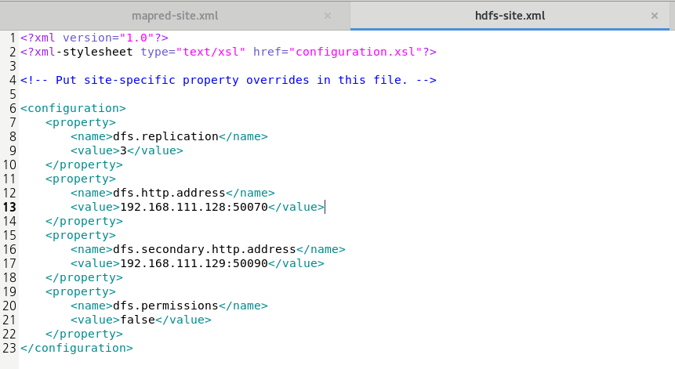
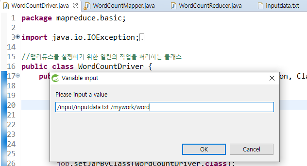
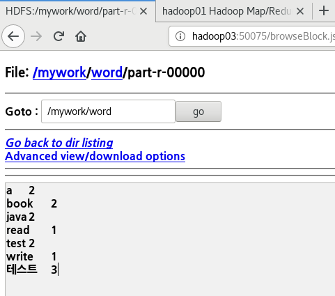
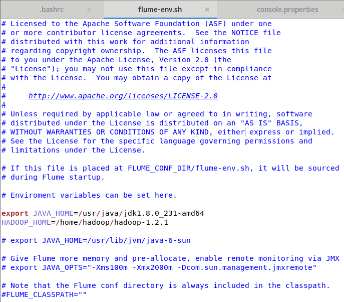
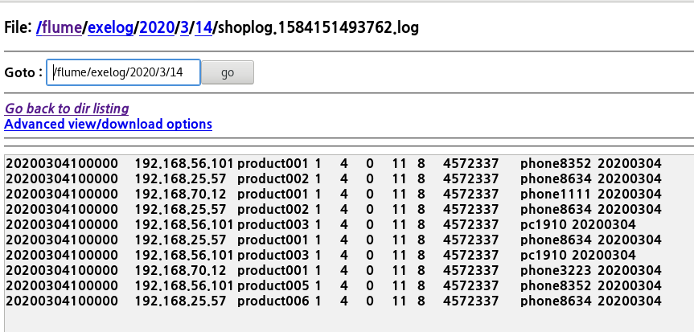
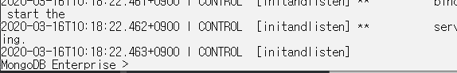
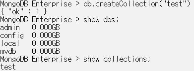
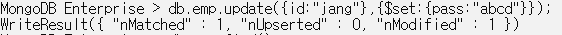
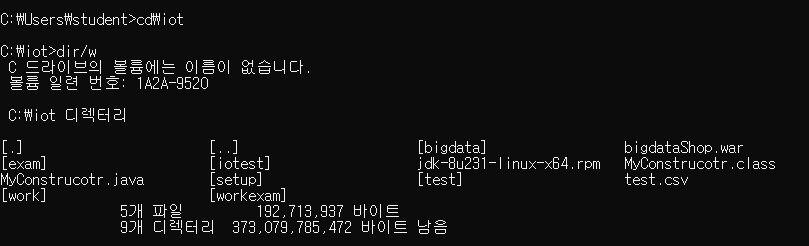

# 빅데이터

## 20-02-11 화

### << 빅데이터 플랫폼 구축 >>

### - 리눅스

* 리눅스 상용화=> 레드햇 계열? 발전=>CentOS(서버구축에 적합)
* 내부 자원에 대해 모든 접근 권한을 정의할 수 있다.
  * 보안 유지에 적합하다.
  * 네트워크를 저가로 구성하기 좋다.

### - 머신 생성( VMWare설치 ) 총 4대의 CentOS 설치

* root => 프롬프트 #
* 일반계정 =.프롬프트 $

#### home(디렉토리)

- 특정 계정으로 로그인 했을 때 자동으로 위치하는 폴더
- 모든 계정은 홈디렉토리를 갖고 있다.
- 기본 설정은 홈디렉토리 명이 계정명과 동일
- root의 홈디렉토리명은 root폴더
- " / " <<< 제일 처음!!! (시작 위치)
- su
  - 
- su -
  - 
- 처음들어가면 ~] 이 들어 있고, ~은 홈 디렉토리를 의미한다.
- 일반계정의 홈디렉토리 => /home/hadoop(계정명)
- ls 현재 위치의 폴더
- cd/ => 최상위로 빠져나감
- cd~ => 홈으로 빠져나감
- cd.. => 한단게 빠져나감 


* 컴퓨터 - etc => 리눅스 설정 파일들이 담겨 있는 폴더
* 컴퓨터 - usr => 윈도우로 치면 programfiles
* 컴퓨터 - dev => 장치에 대한 정보

## 02-02-12 수

## << 빅데이터 플랫폼 구축>>

### 1. VMware 설치

### 2. 머신생성  - CentOS7

### 3. 머신 복제

- Hadoop01 : 192.168.111.128
- Hadoop02 :  192.168.111.129
- Hadoop03 : 192.168.111.131
- Hadoop04 : 192.168.111.130

### 4. 머신 4대를 클러스터링

#### 1) 방화벽 해제

* 방확벽보기

  ```bash
  systemctl status firewalld
  ```

* 방화벽 중지

  ```bash
  systemctl stop firewalld
  ```

* 시스템 리부팅

  ```bash
  reboot
  ```

* 방화벽 정지

  ```bash
  systemctl disable firewalld - "이렇게 해야 정지가 된다."
  ```

#### 2) hostname 변경

* hostname 이름 바꾸기

  ``` bash
  " tab누르면 자동완성 가능 "
  hostnamectl set-hostname hadoop01
  ```

#### 3) DNS 설정

- 우리는 Host-only와 NAT네트워크망의 구성.
- Bridge형식을 취하면 host 레벨의 ip를 받아서 사용가능

* 특정 ip로 접속하기

* ``` bash
  ssh 192.168.111.128
  ```

* system 서비스 목록보기

  ```bash
  systemctl list-units --type=service
  ```

* host에 hadoop 저장

  ```bash
  '다른위치-컴퓨터-etc-hosts파일'
  192.168.111.128 hadoop01
  192.168.111.129 hadoop02
  192.168.111.131 hadoop03
  192.168.111.130 hadoop04
  ```

* hadoop01머신에서 hadoop02, hadoop03, hadoop04에 직접 접속

  ```bash
  /etc/init.d/network restart
  ssh hadoop02
  ssh hadoop03
  ssh hadoop04
  ```

* 원격 서버로 copy

  ```bash
  scp 	copy할파일(위치까지 명시) 	copy받을서버의 위치
  scp		/etc/hosts 		root@hadoop02:/etc/hosts
  '명령어	copy할파일		target서버의 위치와 파일명'
  ```

* 원격 서버에 실행명령

  ```bash
  ssh		서버		'실행할 명령문'
  ```

* 암호화된 통신을 위해서 공개키 생성 후 배포

  * pub : 공개키

  ```bash
  cd ~
  ssh-keygen -t rsa
  cd. ssh
  ls
  ssh-copy-id -i id_rsa.pub hadoop@hadoop02
  ```

  

## 20-02-13 목

> 리눅스는 소유권한이라는게 있다. 따라서 권한을 신경써주자.

* jdk(RPM) 다운 후 설치하기

  ```bash
  rpm -Uvh jdk-8u231-linux-x64.rpm
  'U' - 'update'
  'V' - 'view'
  'H' - '설치하겠다.'
  ```

* Hadoop 다운 후 설치하기

  ```bash
  1. tar-zxvf hadoop-1.2.1.tar.gz 
  'Z' - 'gzip사용'
  'X' - '기존의 tar파일의 압축을 풀어주겠다'
  'V' - '명령어 실행시 화면에 출력'
  'F' - '파일의 이름을 지정'
  
  2. scp /home/hadoop/hadoop-1.2.1.tar.gz hadoop@hadoop02:/home/hadoop/ - '복사하기'
  3. ssh hadoop03 "tar zxvf hadoop-1.2.1.tar.gz" - '압축풀기'
  
  ```

* 각종 설정하기

  ```bash
  <<< home - hadoop - hadopo.1.2.1. - conf >>>
  "<hadoop-env.sh>"
  # The java implementation to use.  Required.
  export JAVA_HOME=/usr/java/jdk1.8.0_231-amd64
  
  "<master>"
  hadoop02
  
  "<slaves>"
  hadoop02
  hadoop03
  hadoop04
  
  "<core-site.xml>"
  	<configuration>
  		<property>
  			<name>fs.default.name</name>
  			<value>hdfs://hadoop01:9000</value>
  		</property>
  		<property>
  			<name>hadoop.tmp.dir</name>
  			<value>/home/hadoop/hadoop-data</value>
  		</property>
  	</configuration>
  	
  "<hdfs-site.xml>"	
  	<configuration>
  	<property>
  		<name>dfs.replication</name>
  		<value>3</value>
  	</property>
  	<property>
  		<name>dfs.http.address</name>
  		<value>hadoop01:50070</value>
  	</property>
  	<property>
  		<name>dfs.secondary.http.address</name>
  		<value>hadoop02:50090</value>
  	</property>
  	</configuration>
  	
  "<mapred-site.xml"
  	<configuration>
  	<property>
  		<name>mapred.job.tracker</name>
  		<value>hadoop01:9001</value>
  	</property>
  	</configuration>
  	
  "02,03,04에 설정 복사"
  scp /home/hadoop/hadoop-1.2.1/conf/* hadoop@hadoop02:/home/hadoop/hadoop-1.2.1/conf
  scp /home/hadoop/hadoop-1.2.1/conf/* hadoop@hadoop03:/home/hadoop/hadoop-1.2.1/conf
  scp /home/hadoop/hadoop-1.2.1/conf/* hadoop@hadoop04:/home/hadoop/hadoop-1.2.1/conf
  	
  "format하기"	
  /home/hadoop/hadoop-1.2.1/bin/hadoop namenode -format
  
  "Hadoop 시작하기"
  /home/hadoop/hadoop-1.2.1/bin/start-all.sh
  
  "02,03,04에 밀어넣기"
  jps
  ssh hadoop02 "jps"
  ssh hadoop03 "jps"
  ssh hadoop04 "jps"
  ```


## 20-02-14 금

1. jps 로 hadoop 머신들 역할 확인

2. hadoop 실행

   ```bash
   /home/hadoop/hadoop-1.2.1/bin/start-all.sh
   ```

3. input 추가

   ```bsh
   /home/hadoop/hadoop-1.2.1/bin/hadoop fs -ls /input
   ```

4. input 삭제

   ```bsh
   /home/hadoop/hadoop-1.2.1/bin/hadoop fs -rmr /input
   ```

5. 폴더 생성

   ```bash
   /home/hadoop/hadoop-1.2.1/bin/hadoop fs -mkdir /input
   ```

6. 파일 복사하기

   ```bash
   /home/hadoop/hadoop-1.2.1/bin/hadoop fs -copyFromLocal README.txt /input
   ```

7. wordcount 적용하기

   ```bash
   ./bin/hadoop jar hadoop-examples-1.2.1.jar wordcount /input/README.txt /output
   ```

   


* 여기서 쓰고 파폭에서 http://hadoop04:50075로 확인가능


예제) hadoop-examples-1.2.1.jar의 wordcount를 이용해서 작업하기

* HDFS에 myinput폴더를 작성한다
* LICENSE.txt를 복사한다
* wordcount를 적용
* 출력결과는 myoutput으로 작성

---

## 20-02-17 월

### 빅데이터는 무엇인가?

- volume + velocity + variety + veracity + value = **"5V"**
- 심야버스노선도
- 데이터수집 - 데이터저장 - 데이터처리 - 데이터분석 - 분석결과활용
- flume, sqoop, R, MongoDB
- namenode(hadoop01)와 secondarynamenode(hadoop02)는 달라야한다.
- hadoop01(keygen 수행) 비공개키, 나머지 02,03,04는 공개키
  
- 따라서 01머신에서만 나머지 머신으로 접속 가능하다.
  
- 인코딩 버전확인하기

  ```bash
  su -
  echo $LANG
  ```

- input폴더에 NOTICE.txt 복사 ( hadoop/hadoop01 로 실행 )

  ```bash
  /home/hadoop/hadoop-1.2.1/bin/hadoop fs - copyFromLocal NOTICE.txt /input
  ```

- input폴더에 있는 NOTICE.txt에 wordcount적용

  ```bash
  /bin/hadoop jar hadoop-examples-1.2.1.jar wordcount /input/NOTICE.txt /wordcount_output
  ```

### HDFS

- STS에서 hdfsTest 설정

- output.txt에 write하기

  ```bash
  [haddop@hadoop01 hadoop-1.2.1]$ cd..
  [hadoop@hadoop01 ~]$ ./hadoop-1.2.1/bin/hadoop jar multi-hadoop-examples.jar hdfs.exam.HDFSExam01 output.txt hellohadoop 
  
  => 이 파일에다가 이(hellohadoop) 내용을 써주겠다.
  
  "jar파일 실행시키는 명령어 + jar파일명 + 클래스 + txt파일이름 + 내용"
  ```

- output.txt read하기

  ```bash
  [hadoop@hadoop01 ~]$ ./hadoop-1.2.1/bin/hadoop jar multi-hadoop-examples.jar hdfs.exam.HDFSExam02 output.txt
  ```

---

## 20-02-19 수

> hadoop의 역할은 빅데이터를 저장하고 처리하는 목적이다.
>
> 처리방법 : MapReduce
>
> 저장방법 : HDFS( hadoop이 갖고 있는 파일시스템 ) - 분산형파일시스템

* namenode가 마스터PC. 데이터를 요청받으면 데이터노드에 블럭단위로 쪼개서 저장. 어떤블럭이 어떤머신인지 알아야 하기때문에 namenode에서 그 정보들을 가지고 있음.
* namenode는 datanode에서 주기적으로(default : 1시간) 오는 heartbeat를 전송받으며 관리.
* 블럭하나에 복제본 3개?!
* namenode가 문제가 생길 경우를 대비해서 SecondaryNamenode를만들어놓는거다!.
  
  * checkpoint를 보내서 네임노드가 백업본을 주기적으로 세컨더리노드에 전송
* cd ~ : home디렉토리(로그인시 첫 실행화면)
* cd / : root디렉토리로 이동 !
* cd . : 현재디렉토리
* cd.. : 상위디렉토리
* pwd : 현재작업위치가 어딘지 볼 때 확인. Print Woring Directory

* path를 걸어주기 전까진 shell script를 모두 명시해야한다.

  ```bash
  /home/hadoop/hadopo-1.2.1/bin/hadoop
  ```

* path를 설정해주자~

  ```bash
  cd hadoop-1.2.1/ "path 설정 - [hadoop@hadoop01 hadop-1.2.1]"
  pwd "현재 디렉토리를 확인"
  ```

* bin 폴더를 사용하여 wordcount를 사용해서 input파일과 output파일

  ```bash
  [hadoop@hadoop01 hadop-1.2.1]$ ./bin/hadoop jar hadoop-examples-1.2.1.jar wordcount /input/README.txt /out
  ```

  => *wordcount + input경로 + output경로*

  => HDFS상에 있는 input폴더안에 있는 README 파일을 /out으로 실행시킨다.

* 파이어폭스 - **hadoop01:50070** : 내 HDFS에 있는 폴더리스트 

* **!! troubleshooting 하는 방법 !!**

  * hadoop-data가 실제 HDFS에 저장되고 처리되는 폴더 위치
  * *1번머신* : home => hadoop => hadoop-data => dfs => name => image : HDFS에 저장하고 있는 이미지파일 ( 권한 확인하기 )
  * *2번머신* : home => hadoop => hadoop-data => dfs => namesecondary => image 
    * dfs => data => current => .metadata, 
    * hadoop-data => mapred => 
  * ex ) api쓰다가 뭐가 안된다? 그러면 01,02,03,04 머신 가서 hadoop => hadoop-data를 모두 지운다 => namenode 초기화(-format)

* 폴더 지우기

  ```bash
  ./bin/hadoop fs -rmr /경로
  ```

* editslog :  변경이력

* fsimage : 메모리에 저장된 메타데이터의 파일 시스템 이미지를 저장한 파일

* ^^^ 이 두가지를 보조네임노드가 작업한다.

### < LINUX 기본 명령어 >

* ls : 현재 디렉터리의 파일 목록
  * ls /etc/sysconfig : 특정 경로의 파일 목록
  * ls -a : 현재 디렉터리의 (숨김파일포함) 모든 파일 목록
  * ls -l : 현재 디렉토리 목록을 자세히 보여줌
  * ls -al : 숨긴폴더 + 자세히
  * ls *.cfg : 확장자가 cfg인 목록을 보여줌
  * ls -l /etc/sysconfig/a* : 해당 경로의 디렉터리에 있는 목록 중 앞 그자가 'a'인 것의 목록을 자세히 보여줌
* cd : [Change Directory] 현재 사용자의 홈 디렉터리로 이동
* rm : [Remove] 파일이나 디렉터리를 삭제. 삭제권한이 있어야 하고 root 사용자는 모든권한이 있으므로 OK. (디폴트는 파일을 삭제하는 기능)
  * -f 라는 옵션을 주면 지울건지 안지울건지 물어보지 않는다.
* cp : [Copy] 파일이나 디렉터리를 복사 (로컬에서)
  * *scp : 원격으로 파일을 복사*
  * -r 옵션을 주면 디렉터리를 복사한다.
* touch : 크기가 0인 새 파일을 생성하거나, 이미 파일이 존재한다면 파일의 최종 수정 시간을 변경
* mv : [Move] 파일이나 디렉터리의 이름을 변경하거나 다른 디렉터리로 옮길 때 사용
* mkdir : [Make Directory] 새로운 디렉터리를 생성한다
  * -p 옵션을 주면 계층형의 디렉터리를 생성할 수 있음.
* rmdir : [Remove Directory] 디렉토리를 삭제한다. 해당 디렉터리의 삭제 권한이 있어야 하며 디렉터리는 비어있어야 한다.
* head / tail : 작성된 파일의 앞 10행 또는 마지막 10행만 화면에 출력
  * -5라는 옵션을 주면 5행만 출력
* more : 페이지 단위로 화면에 출력..

### < 맵리듀스 >

> HDFS에 저장된 파일을 분산 배치 분석을 할 수 있게 도와주는 프레임워크. MongoDB에서도 가능하지만 Hadoop이 성능면에서 우수.

* datanode에 있는 매퍼와 리듀스를 관리하고 작업을 시키는 게 namenode에 있는 job tracker이다.

* 주목적이 맵리듀스를 만드는 것이고, 어떻게 방대한 데이터를 처리할까나~

* mapper와 reducer만 적절하게 만들면 된다~!

* mapper와 reducer를 동작시킬 수 있는 실행파일(Driver)(Application)을 하나 만들어주어야 한다.

  => 세개를 모두 합친 후 , 어떻게 내식대로 커스터마이징 할 것인가

#### 1. 맵

* 어떻게 분류할 것인가
* 입력파일을 한 줄씩 읽어서 데이터를 변형(transformation)

#### 2. 리듀스

* 어떻게 취합할 것인가
* 맵의 결과 데이터를 집계(aggregation)


* 맵메소드의 출력데이터를 기록하고 프레임워크 내부처리에서 sort하고 merge하는 작업 (shuffle) 이후 출력 데이터를 리듀스로 내보내는 작업. => *Context 객체*
* 라인 하나에 대한 처리이다~

---

## 20-02-20 목

* STS에서 설정한 mapreduce Driver 실행시키기

  ```bash
  [hadoop@hadoop01 hadoop-1.2.1]
  
  ./bin/hadoop jar /home/hadoop/hadoop-mapred-examples.jar mapred.basic.WordCountDriver /input/README.txt /mywork/mywordcount
  
  ```

* line하나에 map메소드 한번씩 실행된다!

* && 는 하나만 검사하고 &는 두개다 검사한다.

---

## 20-02-21 금

* HDFS는 눈에 보이는 파일경로가 없다~
* HDFS는 블록 단위로 쪼개져서 저장이 되기때문에 파일의 형태로 확인을 할 수 가 없음.

### - GenericOptionParser

* PIltering으로 넘긴다.

### - MultipleOutputs

> 한 개의 입력데이터를 이용해서 여러 개의 output을 만들고 싶은 경우 사용

- Mapper : GenericOptionParser잡업할 때와 동일하게 map메소드를 구성하며 보통 구분할 수 있도록 key에 각 상황별로 문자열만 추가해준다.
- Reducer : Mapper에서 넘겨준 데이터에서 구분자를 기준으로 분리해서 합산.
  - 필터링하지 않고 다 넘기기 때문에 키 값을 구분하기 위해서 Reducer단에서 up, down, equal식으로 표현
  - setup 메소드 : Reducer객체가 처음 실행될 때 한 번 호출되는 메소드. MultipleOutputs객체를 생성
  - reduce 메소드 : 각각의 상황별로 write가 호출될 수 있도록 처리(up, equal, down)
  - cleanup 메소드 : Reducer작업이 종료될 때 한번 호출되는 메소드. MultipleOutputs객체를 해제(반드시 처리)
- Driver : MultipleOutputs으로 출력될 결로를 Path에 설정. prefix로 구분문자열을 정의

---

## 20-02-24 월

- eclipse에서 hadoop 해보기
- hadoop의 hdfs는 외부에서 읽기 권한만 있고, 쓰기 권한은 없다.!
- hdfs는 hadoop계정에서 하고 mapreduce는 다른계정에서 할 수 있도록 설정하기





### 기타 에코시스템을 다른 프로그램을 이용해 하둡과 연동하기

> MapReduce, HDFS(hadoop) 에 저장

* SNS : R
* log : flume
  * 정형화된 데이터가 아니기 때문에 **패턴**을 써야 한다!!!
* 크롤링 : R / Spring
* iot : sqoop
* DBMS : sqoop
* MongoDB

### < 정규 표현식 >

> 1. 자바에만 적용되는게 아니라, 자바스크립트, 파이썬 등 다른 프로그램에서도 같이 적용되는 프레임.
> 2. 텍스트안에서 특정 형식의 문자열을 추출하거나 검색할 때 사용하는 특수문자로 만들어진 패턴

#### 1. 자바 API

1. String클래스의 matches메소드 : 매개변수로 전달한 정규표현식에 일치하는 문자열이 있는지를 boolean으로 리턴
2. java.util.reges패키지의 클래스들을 활용
   - Pattern클래스 : 패턴을 정의할 때 사용
     - CASE_INSENSITIVE : 대소문자 적용하지 않는다는 의미
   - Matcher클래스 : 패턴과 일치하는 문자열을 관리하는 클래스
     1. find() : 패턴에 만족하는 문자열이 있는지 찾기(true / false 리턴)
     2. start() : 매칭되는 패턴과 일치하는 문자열의 start index
     3. end() : 패턴과 일치하는 문자열의 end index + 1
     4. group() : 패턴과 일치하는 문자열을 리턴(일치하는 문자 추출) 

#### 2. Pattern 기호

1. 기본 기호

   - ^
   - $
   - .
   - |
   - [ ]
   - ( ) : 그룹으로 묶을 경우 사용

   ```java
   String patternStr = "java";	   		 // 1. 정확하게 일치하는 것
   String patternStr = "^java"; 		// 2. ^뒤의 문자열로 시작
   String patternStr = "java$"; 		// 3. $앞의 문자열로 종료
   String patternStr = "^\\$";	  	   // 4. 패턴에서 사용하는 기호는 일반문자열로 인식하지 않는다.
   						   	 	// - 패턴에서 사용되는 기호를 문자열로 인식시키려면\\와 함께 사용
   String patternStr = "\\$$"; 		// 5. $로 끝나는 문자열인지 검색
   String patternStr = ".";			// 6. . 은글자 하나를 의미
   String patternStr = "....";			// 7. 문자길이가 4
   String patternStr = "\\.";			// 8. .이 포함된 문자열
   String patternStr = "\\..\\.";		// 9. .과 . 사이에 한 글자만 있는 문자열
   
   String patternStr = "a|m|g";		// 10. |는 or을 의미 => a이거나 m이거나 g인 문자
   String patternStr = "[amg]";		// 11. 10번과 동일
   String patternStr = "[amg][ma]";	// 12. 두 글자에 대해서 11번의 조건이 적용 
   	=> 첫글자가 a,m,g거나 두번째 글자가 m,a인 문자
   String patternStr = "[c-j]";		// 13. 알파벳 c-j사이에 해당하는 문자
   String patternStr = "[C-J]";		// 14. 대문자
   String patternStr = "[C-Jc-j]";		// 15. 대문자 C,J 소문자c에서 j까지 문자
   String patternStr = "[4-8]";		// 16. 숫자 4-8사이에 해당하는 문자
   String patternStr = "[^4-8]";		// 17. ^가 []안에 있으면 부정의 의미.=>숫자 4,5,6,7,8이 아닌 문자
   		
   ex1) c~j사이의 영문자가 아닌 것
   String patternStr = "[^c-j]";
   ex2) 영문자와 숫자만 추출
   String patternStr ="[A-Za-z0-9]"; 
   ex3) 영문자와 숫자를 뺀 나머지 문자만 추출
   String patternStr = "[^A-Za-z0-9]";
   ex4) 한글만 추출
   String patternStr = "[가-힣]";
   
   String str = "tomato jaava tomato prog potato";
   String patternStr ="(tom|pot)ato"; //그룹으로 묶는다.
   
   String str = "aaaaa aaabc iiiii iiibc aiabc "; 
   String patternStr = "(a|i){3}bc"; //그룹으로 묶는다.
   
   String str = "adsf111 a1 b5 b555 aaa5 qa5";
   String patternStr = "([a-z][0-9])"; //그룹으로 묶는다.
   
   equalsPattern(str, patternStr);
   
   public static void equalsPattern(String str, String patternStr) {
       //1. 패턴을 인식
       Pattern pattern = Pattern.compile(patternStr);
       //2. 패턴 적용하며 문자열을 관리
       Matcher m = pattern.matcher(str);
       /*System.out.println(m.find());
   		System.out.println(m.start());
   		System.out.println(m.end());
   		System.out.println(m.group());*/
   
       while(m.find()) { // find가 boolean을 리턴하기 때문에 반복작업이 가능
           System.out.println(m.group());
           System.out.println(m.start()+":"+(m.end()-1));
       }
   }
   ```

   

2. 수량 관련 기호

   * \* : * 앞의 패턴문자가 0이거나 1이거나 여러 개 있거나
   * \+ : + 앞의 패턴문자가 1이거나 여러개 있거나
   * ? : ? 앞의 패턴문자가 없거나 1이거나 
   * .{n} : .은 임의의 한 문자를 의미, n은 글자수를 의미 => 어떤 문자이거나 n개의 문자
   * xxxx{1,3} : 1이상 3이하(x는 패턴을 의미)
   * xxxx{3, } : 3이상

   ```java
   String str = "jaava programmaingm";
   String str ="-@-ja1- -111aCva--@@-@@@@- 한글 --@@@@-- progra44568EmgFmiJng";
   String str = "a 4 m 7 v 9  amJAVA _java aaaxl  programming and spring , hadoop";
   String patternStr = ".*";		// 모든 것
   String patternStr = "-@+-";		// -- 사이에 @이 1개 있거낭 여러개 있거나
   String patternStr = "-@?-";		// -- 사이에 @이 없거나 1개 있거나
   String patternStr = "[^ ]";		// 공백이 아닌 문지
   String patternStr = ".{5}";		// 다섯 글자식 끊어서 출력
   String patternStr = "[amv]{1,3}"; // a,m,v가 1회,2회,3회인 문자, a, m, v, aa, am, av, mv,....
   String patternStr = "[a-z]{3,}"; // a-z까지 3글자 이상의 문자
   String patternStr = "\\W";		 // 대문자, 소문자, 숫자 뺀 모두
   String patternStr = "\\w"; 		// 대문자, 소문자, 숫자 모두
   String patternStr = "\\d"; 		// 숫자만
   String patternStr = "\\D"; 		// 숫자를 뺀 나머지
   ```

   ```java
   System.out.println(Pattern.matches("[0-9]+", "1234java"));  //f
   System.out.println(Pattern.matches("[0-9]+", "java"));		//f
   System.out.println(Pattern.matches("[0-9]+", "1234"));		//t
   System.out.println(Pattern.matches("[0-9]+", "1"));			//t
   System.out.println(Pattern.matches("[0-9]+", " "));			//f
   
   System.out.println(Pattern.matches("[0-9]?", "1234java"));  //f
   System.out.println(Pattern.matches("[0-9]?", "java"));		//f
   System.out.println(Pattern.matches("[0-9]?", "1234"));		//f
   System.out.println(Pattern.matches("[0-9]?", "1"));			//t
   System.out.println(Pattern.matches("[0-9]?", " "));			//f
   ```

   

## 20-03-09 월

mapreduce의 기본동작은 분류와 집계하기. - 빈도수체크

### < 하둡 커스터마이징 >

- csv파일 hdfs에 옮겨놓기.

* 


* 컴바이너는 mini reducer
* 합을 구하는 작업에서는 컴바이너쓴거랑 안쓴거랑 차이가 많이 난다. 아래는 컴바이너 쓴 것들. 기존에 비해서 데이터가 엄청 줄었음.


#### - 컴바이너 클래스

셔플(shuffle)할 데이터의 크기를 줄이는 데 도움을 준다. => 성능 UP !

#### - 파티셔너 클래스

* mapreduce 동작 순서 : mapper - combiner - partitioner(맵에서 가져온 거를 같은 키를 기준으로 정렬) - reducer
  * combiner와 partitioner가 셔플 단계임
  * Partitioner를 사용자 정의로 커스터마이징 하겠다.
  * 정렬이 될 수 있게 클래스를 변경하는 작업 수행
  * Key를 커스텀하여 CustomKey를 생성
  * 리듀서로 넘겨줄 때 같은 키를 기준으로 처리한다. 그 기준은 사용자정의 커스터마이징 하는것.(문자열을 기준으로 비교) 

#### - 정렬을 위한 rownum 활용

* 가상의 테이블 만들기 -  subquery를 from절에서 활용하기( 페이징 처리도 가능)

```bash
select rownum, ename, sal
from (select *
  	 from emp
 	 order by sal desc) sorttable
where rownum <=3;
```


#### 1. 정렬

#####  1) 보조정렬

1. 정렬하려고 하는 기준을 정의한 사용자 키 클래스를 작성

   => **복합키**

2. Mapper 클래스의 map메소드에서 사용자 키가 outputkey로 출려고딜 수 있도록 정의

3. Reduce태스크에 분배할 수 있는 partitioner를 정의

   => 같은 키를 갖고 있는 Mapper의 출력데이터를 같은 리듀스태스크로 보내기 위해서 해시코드를 이용해서 계산

4. Reduce태스크로 보내기 전에 같은 그룹으로 그룹핑을 할 수 있도록 객체를 정의.

   => **그룹키비교기**

   => ex) air데이터에서 같은 년도별로 데이터를 분류

5. 4번에서 같은 그룹으로 정의한 데이터 내부에서 두 번째 기준을 적용해서 비교할 수 있도록 객체를 정의

   => 1번에서 정의한 복합키의 기준으로 데이터를 정렬하기 위한 객체

   => **복합키비교기**

   

#### 2. 조인


---

## 20-03-11 수

* Hadoop FireFox
  * hadoop01:50030 : 네임노드 페이지 (파일탐색기)
  * hadoop01:50070 : 잡트래커 페이지 (map, reduce 확인)

* inputdata.txt 넣고 출력해보기





* ```java
  package mapreduce.basic;
  
  public class WordCountReducer extends Reducer<Text, IntWritable, Text, IntWritable>{
  	IntWritable resultVal = new IntWritable();
  	Text appenddata = new Text();
  	String data = "";
  	Text resultKey = new Text();
  	
  	@Override
  	protected void reduce(Text key, Iterable<IntWritable> values,
  			Reducer<Text, IntWritable, Text, IntWritable>.Context context) throws IOException, InterruptedException {
  		int sum = 0;
  		data = data + "reduce호출";
  		appenddata.set(data);
  		for (IntWritable value:values) {
  			sum += value.get();
  		}
  		resultVal.set(sum);
  		resultKey.set(key+":"+appenddata);
  		
  		context.write(resultKey, resultVal);
  	}
  	
  }
  ```

  

  

=> 전달되는 key 갯수만큼 reduce 메소드가 실행됨

* 커스터마이징이랑 그냥 동작하는 거랑 다르다.

---

## 20-03-12 목

### < Sqoop 설치 및 설정 >

* 하둡 스쿱 쿼리문

sqoop import -connect jdbc:oracle:thin:@70.12.115.65:1521:xe -username shop -password shop -query "select prd_no prd_nm from tb_product" -target-dir /sqoop_where -m 1

sqoop import -connect jdbc:oracle:thin:@70.12.115.65:1521:xe -username shop -password shop -query "select prd_no prd_nm from tb_product where $CONDITIONS" -target-dir /mywork/sqoop_where -m 1

---

## 20-03-13 금

### < Flume 설치 및 설정 >

> 데이터를 추출하기 위해 사용되는 프로그램
>
> 시스템로그, 웹 서버의 로그, 클릭로그, 보안로그... 비정형 데이터를 HDFS에 적재하기 위해 사용되는 프로그램
>
> 대규모의 데이터로그가 발생하면 효율적으로 수집하고 저장하기위해 관리
>
> flume, chukwa, scribe, fluented, splunk

* apache.org - Flume


A Flume event is defined as a unit of data flow having a byte payload and an optional set of string attributes. A Flume agent is a (JVM) process that hosts the components through which events flow from an external source to the next destination (hop).


In order to flow the data across multiple agents or hops, the sink of the previous agent and source of the current hop need to be avro type with the sink pointing to the hostname (or IP address) and port of the source.


A very common scenario in log collection is a large number of log producing clients sending data to a few consumer agents that are attached to the storage subsystem. For example, logs collected from hundreds of web servers sent to a dozen of agents that write to HDFS cluster.

this can be achieved in Flume by configuring a number of first tier agents with an avro sink, all pointing to an avro source of single agent (Again you could use the thrift sources/sinks/clients in such a scenario). This source on the second tier agent consolidates the received events into a single channel which is consumed by a sink to its final destination.


#### [설정]

1. 다운로드(압축풀기)

   ```hadoop
   tar -zxvf flume~~~~
   ```

2. .bashrc에 설정 정보 등록하기

   

   

3. flume-env.sh rename하고 정보등록

   - jdk홈디렉토리

   - hadoop홈디렉토리

   ```hadoop
   source .bashrc
   cd apache-flume-1.6.0-bin/conf/
   cp flume-env.sh.template flume-env.sh
   ```

   ​	

4. flume설정정보를 등록

   * "flume-conf.properties.template을 rename해서 XXXX.properties"
   - flume agent의 source,channel,sink에 대한 정보를 등록

   ```hadoop
   cp flume-conf.properties.template console.properties
   ```

   


#### [ Flume의 구성요소 ]

- flume의 실행중인 프로세스를 agent라 부르며 source, channel, sink로 구성

##### 1. source

> 데이터가 유입되는 지정(어떤 방식으로 데이터가 유입되는지 type으로 명시)

agent명.sources.source명.type=값

- type

  - netcat : telnet을 통해서 터미널로 들어오는 입력데이터

    (bind : 접속IP, port: 접속할 port)

  - spoolDir : 특정 폴더에 저장된 파일

    (spoolDir : 폴더명)

##### 2. channel

> 데이터를 보관하는 곳(source와 sink사이에 Queue)

##### 3. sink

> 데이터를 내보내는 곳(어떤 방식으로 내보낼지)

* type
  * logger : flume서버 콘솔에 출력이 전달
    * flume을 실행할 때 -Dflume.root.logger=INFO.console을 추가
  * file_roll : file을 읽어서 가져오는 경우
    * directory : 읽어온 파일을 저장할 output 폴더를 명시

#### [ Flume의실행 ]

```hadoop
실행명령어: ./bin/flume-ng agent
옵션 : 
--conf : 설정파일이 저장된 폴더명(-c)
--conf-file : 설정파일명(-f)
--name : agent의 이름(-n)
-Dflume.root.logger=INFO.console : flumne의 로그창에 기록
```

```hadoop
[hadoop@hadoop01 apache-flume-1.6.0-bin]$ ./bin/flume-ng agent --conf conf --conf-file ./conf/console.properties --name myConsole -Dflume.root.logger=INFO,console => (source가 telnet으로 입력하는 데이터인경우)
```

```hadoop
[root@hadoop01 ~]# yum install telnet
su hadoop
telnet localhost 44444
```

- 폴더에서 폴더로 이동시키기

  ```hadoop
  cp ./conf/console.properties ./conf/myfolder.properties
  ```

  

  ```hadoop
  [hadoop@hadoop01 apache-flume-1.6.0-bin]$ ./bin/flume-ng agent -c conf -f ./conf/myfolder.properties -n myConsole
  ```

- hdfs로 이름 바꾸기

  ```hadoop
  [hadoop@hadoop01 apache-flume-1.6.0-bin]$ cp ./conf/console.properties ./conf/hdfs.properties
  ```

  ```hadoop
  [hadoop@hadoop01 apache-flume-1.6.0-bin]$ ./bin/flume-ng agent -c conf -f ./conf/hdfs.properties -n myhdfs
  ```

  

---

## 20-03-14 토

* AVRO? Flume? WAS?
* WAS에서 뽑아보는 작업?
* AVRO : 네트워크 통신에 쓰이는 Sink의 타입명 중 하나
* source의 타입
  * netcat : 많이 쓰이진않음
  * spoolDir : 폴더에서 가져오는 것이므로 많이쓰임
* sink의 타입
  * file_roll : 로컬에 저장할 때
  * logger : 받아서 분석해야 하니 많이 쓰이진 않음
  * hdfs

#### hdfs2.properties

``` hadoop
[hadoop@hadoop01 apache-flume-1.6.0-bin]$ cp ./conf/hdfs.properties ./conf/hdfs2.properties
```


* 하둡실행하기

```hadoop
[hadoop@hadoop01 apache-flume-1.6.0-bin]$ ./bin/flume-ng agent -c conf -f ./conf/hdfs2.properties -n myhdfs
```


#### hdfs 3.properties

```hadoop
[hadoop@hadoop01 apache-flume-1.6.0-bin]$ cp ./conf/hdfs2.properties ./conf/hdfs3.properties
```


* 하둡 실행하기

```hadoop
[hadoop@hadoop01 apache-flume-1.6.0-bin]$ ./bin/flume-ng agent -c conf -f ./conf/hdfs3.properties -n myhdfs
```




### < hadoop0 머신2 에서 tomcat 실행하기 >

1. 다운로드 한 tomcat 압축풀기

   ```hadoop
   [hadoop@hadoop02 ~]$ wget 붙여넣기
   [hadoop@hadoop02 ~]$ tar -zxvf apache-tomcat-9.0.31.tar.gz 
   ```

2. hadoop01에 있던 .bashrc 02로 이동(복사)

   ```hadoop
   [hadoop@hadoop01 ~]$ scp .bashrc hadoop@hadoop02:/home/hadoop
   
   scp hdfs2.properties hadoop@hadoop03:/home/apache-flume-1.6.0-bin/conf
   ```

   

3. 톰캣 실행하기

   ```hadoop
   [hadoop@hadoop02 ~]$ source .bashrc
   [hadoop@hadoop02 ~]$ cd apache-tomcat-9.0.31/
   [hadoop@hadoop02 apache-tomcat-9.0.31]$ cd bin/
   ```

   ```hadoop
   [hadoop@hadoop02 bin]$ ./startup.sh 
   [hadoop@hadoop02 bin]$ ./shutdown.sh 
   [hadoop@hadoop02 bin]$ netstat -anp | grep 8080
   [hadoop@hadoop02 bin]$ ./startup.sh
   ```

4. 서버 확인해보기

   

5. manager 권한 부여

   

   - 127.0.0.1:8080/manager

   


6. ip 제한 해제하기


7. sts에 bigdatashop - META-INF - context.xml 

```java
<Resource name="jdbc/myspring" auth="Container"
              type="javax.sql.DataSource" 
              driverClassName="oracle.jdbc.driver.OracleDriver"
              url="jdbc:oracle:thin:@70.12.115.65:1521:xe"
              username="shop" password="shop"
			  maxTotal="20" maxIdle="10"
              maxWaitMillis="-1"/>
// ip를 내 pc의 ip로 설정    
```

8. 프로젝트 export - web - war파일

9. 크롬환경에서 http://192.168.111.129:8080/manager 에서 export해준 war파일 배치하기

10. 크롬환경에서 http://192.168.111.129:8080/bigdataShop/index.do 로 접속가능. 끝.

    => 이제 hadoop02가 나의 서버가 된 것이다 !!


### < hadoop03에 WAS 구축하기 미션 >

1. 3번에 WAS구축
2. WAS에 bigdataShop을 배포
3. hadoop03에 flume을 설치
4. tomcat의 access log를 hdfs에 저장
   - avro통신
   - hdfs : /flume/tomcatlog
5. 메일로 제출
   - 3번의 was manager화면에 배포된 목록 캡쳐
   - hdfs에 저장된 access log 캡쳐
   - 각 머신의 flume설정 파일

```bash
./bin/flume-ng agent -c conf -f ./conf/hdfs2.properties -n myavro


[hadoop@hadoop03 ~]$ mkdir flume_input
[hadoop@hadoop03 ~]$ cp /home/hadoop/apache-tomcat-9.0.31/logs/localhost_access_log.2020-03-15.txt /home/hadoop/flume_input
 
```

* sink는 보낼 머신에 대한 정보(01머신에 대한 정보 입력)
* 테스트는 하둡머신의 flume실행, WAS머신의 flume실행하고, flume_input폴더에 로그파일을 copy
* 1번과 3번 모두 1번IP 사용

---

## 20-03-16 월

### MongoDB

* NoSQL?
* 비정형데이터
* 스키마가 아니다 ( 이 컬럼은 무슨 타입이고 저건 무슨 타입이고 .. )
* JSON으로 처리한다.
* 문서를 기반으로 하기 때문에 조인을 할 수 없다.(하나의 문서 안에 모든 데이터가 들어가있음)

- 레드햇계열의 리눅스? 데드뭐뭐계열의 리눅스?


* C:\Program Files\MongoDB\Server\3.6\bin 를 windows path 등록


* 데이터가 저장될 폴더가 필요하다! iot에 bigdata에 mongodata라고 만들자~


* MongoDB Enter Prise로 서버 접속하기




* 실행됐구나~ 확인~


* 웹에서 포트 접속해보기


* 데이터베이스를 만들고 그 안에서 작업하는 개념! ( ex. conn scott/tiger )


​	=> mydb에 아직 아무것도 안만들어 놨기 때문에 아무 것도 안 뜬다~

#### 1. 용어

* RDBMS : MongoDB
  * table : collection
  * column(컬럼) : field
  * row(레코드) : document
  * 기본키 : _id

#### 2. 명령어

* 



=> 

##### 1. collection(RDBMS에서의 테이블)

> 관계형 데이트에이스 처럼 스키마를 정의하지 않는다.

- 종류

  - capped collection

    => 고정사이즈를 주고 생성하는 컬렉션

    => 미리 지정한 저장공간이 모두 사용이 되면 맨 처음에 저장된 데이터가 삭제되고 공간으로 활용

  - non capped collection

    => 일반적인 컬렉션

- 생성 명령문

  ```bash
  db.createCollection("컬렉션명")
  	=> 일반 collection
  db.createCollection("컬렉션명",{옵션 list})
  	=> 각각의 옵션을 설정해서 작업(JSON)
  ```

  

- 컬렉션이 capped속성인지 아닌지 확인하기

  ```bash
  db.컬렉션명.isCapped()
  ```

  

  

- 컬렉션의 속성 확인하기 => JSON으로 뿌려준다

  ```bash
  db.collection명.valiedate()
  ```

- 삭제 명령문

  ```bash
  db.collections명.drop()
  ```


- 컬렉션명 변경 명령문

  ```bash
  db.컬렉션명.renameColletion("변경할 컬렉션명");
  ```


​			<< 실습 >>

mini 데이터베이스 생성

emp (size : 10000, capped컬렉션)

shop (일반 컬렉션)

데이터베이스 목록, 컬렉션 목록, 컬렉션 validate()  화면 캡쳐


#### 3. MongoDB에 insert하기

> document(관계형db에서의 레코드 개념)에 대한 정보는 JSON의 형식으로 생성

>  mongodb에서 document를 삽입하면 자동으로 _id가 생성

##### [구문]

```bash
db.컬렉션명.insert({데이터...})
db.컬렉션명.insertOne({데이터...})
db.컬렉션명.inserMany({데이터...})
```

- "_id" : ObjectID("5e6ee7751bf5731af5cb2f8");

  < 현재 timestap + machine id + mongodb프로세스id + 순차번호(추가될 때마다 증가) >


​	=> 스키마가 없기 때문에, 비정형 데이터를 넣기 적합하다~

* 변수에다 저장해놓고 값을 넣어도 된다.


* 특정 값을 for문으로 설정 가능


* 배열은 [ ] 로 처리


* 배열로 한꺼번에 처리할 수도 있다~


​	=> 추가로 it을 누르면 더 볼 수 있어용~

#### 4. MongoDB에 update하기

> document 수정
>
> 조건을 적용해서 수정하기 위한 코드도 JSON으로 구현

##### [업데이트를 위한 명령어]

- $set : 해당필드의 값을 변경(업데이트를 하기 위한 명령어)
  - non capped collection인 경우 업데이트할 필드가 없는 경우 추가한다.
- $inc : 해당필드에 저장된 숫자의 값을 증가
- $unset : 원하는 필드를 삭제할 수 있다.
- 업데이트 옵션
  - multi : true를 추가하지 않으면 조건에 만족하는 document 중 첫 번재 document만 update 된다.

##### [구문]

```bash
db.컬렉션명.update({조건필드:값}), // sql의 update문의 where절
				{$set:{수정할필드:수정값}},
				{update와 관련된 옵션:옵션값})
```



​		<< 실습 >>

1. id가 kang사람의 dept를 "총무"로 변경
2. dept가 "전산'인 모든 addr을 "안양"으로 변경
3. id가 jang인 document의 bonus를 1000추가하기
4. dept가 "인사"인 모든 document의 bonus에 2000을 추가하기

작업완료 후 캡쳐해서 메일 전송

#### 5. MongoDB에서 배열 관리

```bash
db.score.update({id:"jang"}, 
	{$set:
		{info:
			{city:["서울","안양"],
			movie:["겨울왕국2","극한직업","쉬리"]
			}
		}
	}
)
```

##### [배열에서 사용할 수 있는 명령어]

- addToSet : 배열의 요소를 추가 ( 중복 체크 )

  ```bash
  db.score.update({id:"jang"}, {$addToSet:{"info.city":"인천"}});
  	// 중복된 데이터는 들어가지 않는다.
  ```

- push : 배열의 요소를 추가 ( 중복 허용 )

  ```bash
  db.score.update({id:"jang"}, {$push:{"info.city":"천안"}});
  	// 중복된 데이터도 추가로 puash된다.
  ```

- pop : 배열에서 요소를 제거할 때 사용

  => 1이면 마지막 요소를 제거, -1이면 첫 번째 요소를 제거

  ```bash
  db.score.update({id:"jang"}, {$pop:{"info.city":1}}); // 오른쪽 끝에서 한 개 삭제
  db.score.update({id:"jang"}, {$pop:{"info.city":-1}}); // 왼쪽 끝에서 한 개 삭제
  ```

- each : addToSet이나 push에서 사용할 수 있다.

  ```bash
  db.score.update({id:"jang"},
  				{$push:
  					{"info.city":
  						{$each:["천안","가평","군산"]}
  					}
  				});
  ```

- sort : 정렬( **1**: 오름차순, **-1** : 내림차순)

  ```bash
  db.score.update({id:"jang"},
  				{$push:
  					{"info.city":
  						{$each:["천안","가평","군산"], $sort:1}
  					}
  				});
  ```

- pull : 배열에서 조건에 만족하는 요소를 제거(조건 한 개)

  - pullAll : 조건 여러개

  ```bash
  db.score.update({id:"jang"},
  				{$pull:{"info.city":"천안"}	
  				}
  				);
  				
  db.score.update({id:"jang"},
  				{$pullAll:{"info.city":["가평","군산"]}	
  				}
  				);				
  ```

  

  ​	<< 실습1 >>

**score collection을 이용해서 작업해보세요**

**1. song,jang,hong에 다음과 같은 값을 가질 수 있도록 배열로 필드를 추가하세요**

**song : history (영업1팀, 총무, 기획실)**

**jang: history(전략팀,총무,전산)**

**hong : history(영업1팀, 기획실,전산)**

**2. song의 document history에 자금부를 추가하세요**

**3. jang의 document의 history에 마지막 데이터를 제거하세요**

**4. servlet데이터가 100점인 모든 document에 bonus를 3000을 추가하세요. 기존데이터가 존재하면 증가되도록 구현하세요**

**5. song의 lang.ms에 "visual basic","asp",".net"을 한꺼번에 추가하세요**


1.
db.score.update({id:"song"}, {$set:{history:["영업1팀", "총무", "기획실"]}});
db.score.update({id:"jang"}, {$set:{history:["전략팀", "총무", "전산"]}});
db.score.update({id:"hong"}, {$set:{history:["영업1팀", "기획실", "전산"]}});

2.
db.score.update({id:"song"}, {$addToSet:{history:"자금부"}});
db.score.update({id:"song"}, {$pop:{history:1}});

3.
db.score.update({id:"jang"}, {$pop:{history:1}});

4.
db.score.update({servlet:100}, {$inc:{bonus:3000}}, {multi:true});

5.
db.score.update({id:"song"}, {$push:{"lang.ms":{$each:["visual basic","asp",".net"]}}});


​		<< 실습 2 >>

다음과 같은 조건으로 document를 구성해 보도록 하겠습니다.

게시물과 댓글을 mongodb에 저장

\1. board 컬렉션을 생성

\2. document는 5개 insert

no,id,title,content,count,writedate

\3. 2번째 게시물에는 댓글이 3개 추가되도록

update - 하위object와 배열로 구성

댓글의 필드

content,count1,count2,writedate

```bash
db.createCollection("board");
db.board.insert({insertno:1, title:"aaaaaaaa", content:"hello1", count:11, wirtedate:"2020-03-16", id:"kim"});
db.board.insert({insertno:1, title:"bbbbbb", content:"hello2", count:22, wirtedate:"2020-03-17", id:"park"});
db.board.insert({insertno:1, title:"ccccccc", content:"hello3", count:33, wirtedate:"2020-03-18", id:"jung"});
db.board.insert({insertno:1, title:"ddddddd", content:"hello4", count:44, wirtedate:"2020-03-16", id:"choi"});
db.board.insert({insertno:1, title:"eeeeeee", content:"hello5", count:55, wirtedate:"2020-03-16", id:"lee"});

comment1={content:"hi", count1:0, count2:0, writedate:"2020-04-01"};
comment2={content:"HELLO", count1:0, count2:0, writedate:"2020-04-02"};
comment3={content:"bye", count1:0, count2:0, writedate:"2020-04-03"};

db.board.update({content:"hello2"}, {$push:{"sub":comment1}});
db.board.update({content:"hello2"}, {$push:{"sub":comment2}});
db.board.update({content:"hello2"}, {$push:{"sub":comment3}});
```

---

## 20-03-17 화

- MongoDB도 클러스터링으로 한대처럼 사용할 수 있다.
- 하지만 하둡의 hdfs와 맵리듀스를 성능적으로 훨씬 효율적이지만, MongoDB를 쓰는 경우도 있다~

1. Aggregation
2. map-reduce

- 몽고디비는 많은양의 데이터를 가지고 해야 하거나, 복잡한 타입의 테이블이 필요할 때 사용하는거~


#### 6. advanced MongDB

- 이쁘게 출력하기

  ```bash
  db.컬렉션명.find().pretty()
  ```

- 변수처럼 사용할 수 있다.


- 전체 데이터의 갯수를 리턴

  ```bash
  db.컬렉션명.find().count()
  ```


​		<< 실습 1 >>

​	score의 모든 document에 num필드(1000)가 추가되도록 작업하고 실행결과 보기

```bash
var x = db.score.find();
while(x.hasNext()){
           var one = x.next();
           one.num = 1000;
           db.score.save(one);
                   }
db.score.find();         
```


##### [명령어]

- find

  ```bash
  db.컬렉션명.find(조건, 조회할 필드에 대한 명시)
  ```

  - db.컬렉션명.find({})와 동일

    => { }안에 아무것도 없으면 전체 데이터 조회

  - 조건, 조회할 필드에 대한 명시 모두 JSON

  - 조회할 필드의 정보를 정보 명시

    => 형식 : {필드명:1...} : 화면에 표시하고 싶은 필드

    ​				{필드명:0} : 명시한 필드가 조회되지 않도록 처리

  - **[ 조건 ]**

    - $lt : <
    - $gt : >
    - $lte : <=
    - $gte : >=
    - $or : 여러 필드를 이용해서 같이 비교 가능
    - $and : and연산
    - $in : 하나의 필드에서만 비교
    - $nin : $in으로 정의한 조건을 제외한 document를 조회 ( not in )

    

    ex) addr이 인천인 데이터 : id, name, dept, addr 출력

    ```bash
    db.score.find({addr:"인천"},{id:1,name:1,dept:1,addr:1})
    db.score.find({addr:"인천"},{id:1,name:1,dept:1,addr:1,_id:0}) // 기본키(_id) 제거
    ```

    ex) score컬렉션에서 java가 90점인 이상인 document 조회 : id, name, dept, java만 출력

    ```bash
    db.score.find({java:{$gte:90}},{id:1,name:1,dept:1,java:1,_id:0})
    ```

    ex) dept가 인사이거나 addr이 인천인 데이터 조회

    ```bash
    db.score.find({$or:[{dept:"인사"},{addr:"인천"}]})
    ```

    ex) id가 song, kang, hong인 데이터 조회

    ```bash
    db.score.find({$or:[{id:"song"},{id:"hong"},{id:"kang"}]})
    db.score.find({id:{$in:["song","kang","hong"]}})
    ```

    ex) id가 song, kang, hong이 아닌 데이터 조회

    ```bash
    db.score.find({id:{$nin:["song","kang","hong"]}})
    ```

- 조회메소드

  - findOne() : 첫번째 document 만 리턴

  - find() : 모든 document리턴

  - count() : 행의 갯수를 리턴

  - sort({필드명:sort옵션}) : 정렬

    ​										1 : 오름차순

    ​										-1 : 내림차순

  - limit(숫자) : 숫자만큼의 document만 출력

  - skip(숫자) : 숫자만큼의 document를 skip하고 출력하고 조회

    

    ex) 여러가지 조회

    ```bash
    db.score.find({num:null})
    db.score.find().sort({id:1});
    db.score.find().sort({java:-1});
    db.score.find().limit(5)
    db.score.find().skip(5)
    ```

- 정규표현식을 적용

  ```bash
  db.컬렉션명.find({조건필드명:/정규표현식/옵션})
  ```

  - **[ 기호 ]**

    - | : or

    - ^ : ^ 뒤의 문자로 시작하는지 체크

    - [  ] : 영문자 하나는 한 글자를 의미하고 [  ]로 묶으면 여러 글자를 표현

      [ a-i ] : a에서 i까지 모든 영문자

  - **[ 옵션 ]**

    - i : 대소문자 구분없이 조회 가능

    

    ex) id가 kim과 park인 document 조회

    ```bash
    db.score.find({id:/kim|park/})
    db.score.find({id:/kim|park/i}) // 대소문자 구분없이
    ```

    ex) id가 k로 시작하는 document 조회

    ```bash
    db.score.find({id:/^k/})
    db.score.find({id:/^k/i}) //대소문자 구분없이
    ```

    ex) id에 [a-i]까지 영문이 있는 id를 조회

    ```bash
    db.score.find({id:/[a-i]/})
    ```

    ex) id가 k-p로 시작하는 document 조회

    ```bash
    db.score.find({id:/^[k-p]/})
    ```

    ex) id에 a랑 i가 있는 document 조회

    ```bash
    db.score.find({id:/[ai]/})
    ```

#### 7. MongoDB에 저장된 데이터 삭제하기 - remove()

> 조건을 정의하는 방법은 find()나 update()와 동일

- 삭제해보아용~

  ex) servlet 점수가 80점 이하인 document 삭제

  ```bash
  db.score.remove({servlet:{$lt:80}})
  ```

  

- 투표 : 30%

- 코드내용 : 50%

  - 기능이 얼마나 많이 구현되었는지
  - 수업시간에 배운 내용이 충실하게 구현되었는지
  - open api를 사용해서 새로운 기능에 도전했는지
  - 실무에서 사용할 수 있는 형태를 고민해서 구현했는지
  - 발표할 때 에러 없이 잘 실행
  - 계획한 내용을 잘 완료

- 협업 : 20%

  ​	

  ​		<< 실습 2 >>

  **1. Score collection에서 이름과 주소와 servlet점수를 출력해보자**

  db.score.find({},{name:1,addr:1,servlet:1,_id:0})

  **2. Score collection에서 java점수 중 70점 이상을 출력해보자**

  db.score.find({java:{$gte:70}});

  **3. Score collection에서 이름, java점수를 출력하고 bonus가 2000이상**

  **인 사람만 출력해보자**

  db.score.find({bonus:{$gte:2000}}, {name:1, java:1, _id:0})

  **4. score에서 dept가 인사이면서 addr이 안양이거나 대구인 document 출력**

  db.score.find({$and:[{dept:"인사"}, {addr:{$in:["안양","대구"]}}]})

  **5. servlet이 70에서 90사이이며 dept가 총무인 document 조회**

  db.score.find({$and:[{dept:"총무"}, {$and:[{servlet:{$gte:70}}, {servlet:{$lt:90}}]}]})

  **6. score에서 이름에 김씨인 사람 조회해보기**

  db.score.find({name:/^[김]/})

  **7. score에서 servlet점수가 가장 낮은 document와 가장 높은 document 출력하기**

  db.score.find({servlet:{$not:{$exists:null}}}).sort({servlet:1}).limit(1);

  db.score.find().sort({servlet:1}).limit(1)
  db.score.find().count() // 13
  db.score.find().sort({servlet:1}).skip(12)

  **8. java점수가 가장 높은 document중에 7개를 출력하되 2개를 건너뛰고 출력해보자**

  db.score.find().sort({java:-1}).skip(2).limit(7)

  **9. 아이디에 n과 o가 들어가는 document 구하기**

  db.score.find({id:/[no]/i})


#### 8. Aggregation

- Oracle에서의 Group by와 동일 개념

- 간단한 집계를 구하는 경우 mapreduce를 적용하는 것 보다 간단하게 작업 가능

- Pipeline을 내부에서 구현

  => 한 연산의 결과가 또 다른 연산의 input데이터로 활용

  => https://docs.mongodb.com/v3.6/aggregation/의 pipeline 참고

##### [ 명령어 ]

- $match : where절, having절
- $group : group by
- $sort : order by
- $avg : avg그룹함수
- $sum : sum그룹함수
- $max : max그룹함수

##### [ 형식 ]

```bash
db.컬렉션명.aggregate(aggregate 명령어를 정의)
				   ----------------------- => 여러가지를 적용해야 하는 경우 배열로 표현
				   
$group:{_id:그룹으로 표시할 필드명,
		연산결과를 저장할 필드명:{연산함수:값}}
									---- => 숫자나 필드 참조
$match:{필드명:{연산자:조건값}}									
			 --------------- => 비교연산 or 조건이 여러 개
```

- addr별 인원수

  ```bash
  db.exam.aggregate([{$group:{_id:"$addr", num:{$sum:1}}}]);
  ```

- dept별 인원수

  ```bash
  db.exam.aggregate([{$group:{_id:"$dept", num:{$sum:1}}}]);
  ```

- dept별 java점수의 평균

  ```bash
  db.exam.aggregate([{$group:{_id:"$dept", num:{$avg:"$java"}}}])
  ```

- addr별 servlet합계

  ```bash
  db.exam.aggregate([{$group:{_id:"$addr", num:{$avg:"$servlet"}}}])
  ```

- dept별 java점수의 평균. 단, addr이 인천인 데이터만 작업 $match를 추가

  ```bash
  db.exam.aggregate([{$match:{addr:"인천"}}, {$group:{_id:"$dept", num:{$avg:"$java"}}}])
  ```


​		<< 실습 3 >>

**1. dept가 인사인 document의 servlet평균 구하기** 

```bash
db.exam.aggregate([{$match:{dept:"인사"}}, {$group:{_id:"$dept", num:{$avg:"$servlet"}}}])
```

**2. java가 80점이 넘는 사람들의 부서별로 몇 명인지 구하기**

```bash
db.exam.aggregate([{$match:{java:{$gte:80}}}, {$group:{_id:"$dept", num:{$sum:1}}}])
```

**3. 2번 결과를 인원수데이터를 내림차순으로 정렬해 보세요.**

```bash
db.exam.aggregate([{$match:{java:{$gte:80}}}, {$group:{_id:"$dept", num:{$sum:1}}},{$sort:{num:-1}}])
```


#### 9. STS을 이용해서 WEB으로 MongoDB 데이터 확인하기 위한 설정


src - main - webapp - WEB-INF - spring - appServlet - servlet-context.xml 에서

```bash
<context:component-scan base-package="spring.data.mongodb" />
```


---

## 20-03-16 수

- 몽고디비는 중간저장소?! 단기간 요청이 몰릴 수 있는 로그들을 작업하는?! 스키마 때문에?!
- 스키마가 없기 때문에 유연성이 있다! 
- 성능면에서 update(오버헤드 발생 가능)보다 insert가 낫다!
- 요즘 시스템들이 JSON포맷이 많이 발생 하기 때문에 이것또한 몽고디비의 매력을 상승


#### 10. MongoDB를 이용해 File Export/Import 해보기

- test.csv 를 C:iot 폴더에 복사 후 새 cmd창을 이용해 파일 export해보기




* test.csv를 C:\iot폴더에 복사 후 iot에 있는 파일 import해보기


​	-d : database

​	-c : collection

*  지금은 local이라 그냥 써주면 되지만 아니라면, /host 와 /port 설정해줘야 한다!


#### 11. MongoDB로 Client 프로그램 만들기

> STS-mongoTest에서 확인 !

---

## 20-03-19 목

Mapredce 와 HDFS 위에 몽고디비가 올라가기도 하고~ 하이브가 올라가기도하고~

로그발생시키고~ RDBMS~ 등등 < mapreduce,hdfs >로 들어가면 처리결과를 MongoDB, R, 머아웃?

빅데이터로 갈거면 " spark ".. 꼭 해라..!! 덩치는 하둡이다!!!

하둡과 스파크, 사용되는 쓰임새가 다르다~ 하둡은 배치, 스파크는 리얼타임~

R.. 반드시 알아야행.. 통계교수님들이 좋아하는언어.. 파이썬으로 갈아타는고 요구하고 있는 경우가 많다

### R

> 데이터 분석 전문 도구(소프트웨어)

[**https://rstudio.com/**](https://rstudio.com/)

[**https://www.r-project.org/**](https://www.r-project.org/)**[\**[출처\]\** ](https://www.r-project.org/)

- 오픈소스라서 좋아용~
- 컴퓨터이름, 사용자이름, 설치경로(공백도 X) => 한글 X


csv_exam.csv를 읽어서 데이터를 수정한 후 csv_exam_result.csv로 저장하기

-  science가 80이상인 데이터를 추출
- 추출된 데이터에 mytotal과 myavg컬럼을 추가
- mytotal : 모든 과목의 총점
- myavg : 모든 과목의 평균

