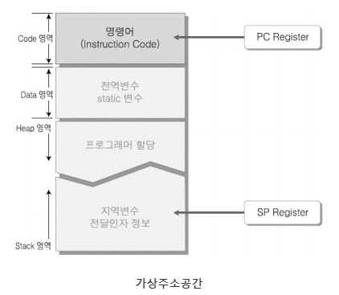
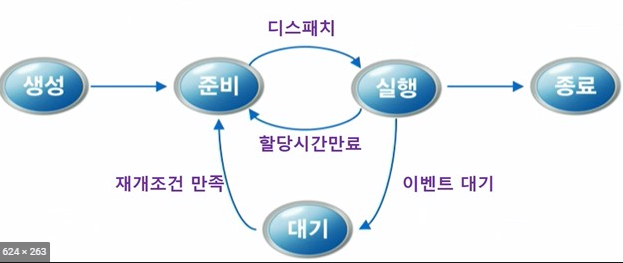
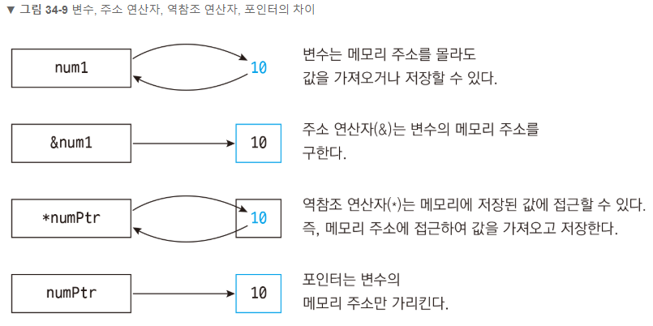
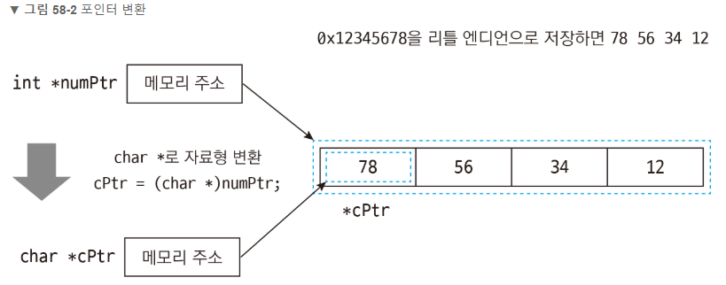
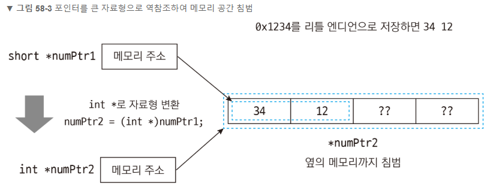
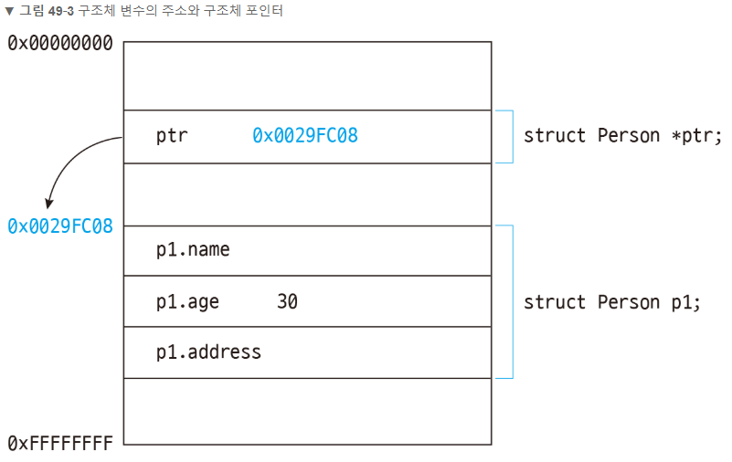

# C

파이팅!

# 메모리

---

1. RAM
   - 컴퓨터를 종료하면 데이터가 날아가는 휘발성 메모리
   - 하드 디스크나 CD와는 달리 속도가 매우 빠르다.(데이터에 랜덤하게 접근할 수 있음)
   - 컴퓨터는 대부분의 데이터들은 메모리에 보관해 놓고 작업을 한다. 틈틈이 하드디스크에 저장!
2. ROM
   - 컴퓨터를 종료해도 데이터가 날아가지 않는 비휘발성 메모리
   - ex) CD-ROM, DVD-ROM, 하드디스크 => (데이터에 순차적으로 접근한다)

컴퓨터의 한 개의 메모리 소자는 0 혹은 1의 값을 보관할 수 있다. 이 이진수 한 자리를 가리켜 비트(Bit)라고 한다. 따라서, 1개의 비트는 0 또는 1의 값을 보관할 수 있다. 8bit = 1byte

8bit(1byte)로 나타낼 수 있는 최대의 수는 0 ~ 0xFF. 0부터 255로 총 256개의 수를 나타내게 된다.

컴퓨터에서 연산을 담당하는 CPU에는 **레지스터(register)**라는 작은 메모리 공간이 있는데 이곳에다가 값을 불러다 놓고 연산을 수행하게 된다. 예를 들어 a+b를 하기 위해서는 a와 b의 값을 어디다 적어놓아야지, a+b를 할 수 있는 것처럼 CPU에서 연산을 수행하기 위해 잠시 써놓는 부분을 레지스터라고 한다.

이러한 레지스터의 크기는 컴퓨터 상에서 연산이 실행되는 최소 단위라고 볼 수 있고, 이 크기를 **워드**라고 부른다.

1워드는 64비트, 즉 8바이트가 된다.

# 프로세스(Process)

---

## 1. 프로세스란?

- 프로세스(Process)란 실행중에 있는 프로그램(Program)을 말한다.
- 스케쥴링의 대상이 되는 작업(task)와 같은 의미로 쓰인다.
- 프로세스 내부에는 최소 하나의 스레드(thread)를 가지고 있는데, 실제로는 스레드단위로 스케쥴링을 한다.
- 하드디스크에 있는 프로그램을 실행하면, 실행을 위해서 **메모리할당**이 이루어지고, 할당된 메모리 공간으로 바이너리 코드가 올라가게 되는데 이 순간부터 프로세스라 불린다.
- 모든 프로세스는 각각 4G의 가상 주소공간(메모리공간X)을 부여받는다.
  - 운영체제 약 2G, 나머지 약 2G 응용프로그램의 고유 영역
  - 개발자는 이 가상주소공간 4G가 진짜 메모리인것 처럼 사용한다.
- 가상주소공간(virtual addres space) != 가상 메모리(virtual memory)

## 2. 가상주소공간

### 가상주소공간의 구조



- Code 영역 : 프로그램을 실행시키는 실행 파일 내의 명령어들이 올라간다.
- Data 영역 : 전역변수, static 변수의 할당
- Heap 영역 : 프로그래머의 **동적할당**을 위한 메모리 영역
  - C언어 => malloc & free
  - C++ => new & delete
  - JAVA => new & Garbage Collector
- Stack 영역 : 지역변수, 함수 호출시 전달되는 인자(파라미터)를 위한 메모리 영역
- page : 가상주소공간 4G를 4096byte(4K) 단위로 나눈 하나의 메모리 블록을 page라고 한다.
- 연산을 할 때는 값을 stack으로부터 레지스터로 가져오고 ALU로 넘겨서 연산을 수행한다. 연산 결과 값은 레지스터에 먼저 저장하고, stack영역에 재전달 한다.
- 레지스터의 스택포인터(SP)는 stack 프레임을 위해서 미리 공간을 확보한다.

### virtual machine

- register based machine(연산결과를 레지스터에 저장)
- virtual stack machine(연산결과를 stack에 저장하고 이를 다시 heap으로 반환)
- 연산결과를 임시로 젖아하는 공간을 operand stack이라고 부른다.
- 인터프린터 언어는 heap에 데이터를 저장하고 연산은 레지스터 ALU에서 실행 후 실행 결과를 stack에 저장. 해당값을 heap에 전달하려면 다시 레지스터를 거쳐야 한다.

### stack vs heap

- 가상주소공간 중 stack은 빠르고 heap은 상대적으로 느리다.
- stack은 그냥 데이터를 쌓지만 heap은 도중에 del등을 통해서 지울 수 있다. 빈공간이 생기면 그 곳에 새로운 데이터가 추가 된다.(spacial locality 보장이 어렵다)
- 또한, heap은 메타데이터 정보를 함께 저장한다. 따라서 더 많은 용량을 사용하며 할당시 매번 metadata에게 여분 공간이 있는지 묻기 때문에 상대적으로 느리다.
- **heap의 최대장점**
  - 할당시점과 지우는 시점을 마음대로 저장할 수 있다.
  - 프로세스 도중에 용량을 변경할 수 있다.(stack의 경우 프로세스 실행 전에만 변경 가능하다. 용랑이 넘치는 경우 stack overflow가 발생한다.)

## 3. 가상메모리

- 가상메모리 : 물리적인 RAM + 하드디스크
- page frame : 가상메모리(물리메모리 = RAM+페이징파일)를 4096byte(4K) 단위로 나눈 후, 그 한단위를 페이지 프레임이라 한다.
- 페이지 테이블 : 가상주소공간과 가상메모리를 매핑한다. 프로세스 별로 각각 하나씩 존재한다.
- RAM의 프레임이 모두 차있을 때, 추가 요청이 들어오면 RAM에서는 교체 알고리즘에 따라서 프레임 하나를 `페이징파일`로 내리고, 새롭게 요청된 페이지에 비워진 프레임을 할당한다.
- 가상메모리 운영방식 : LRU(least, recently, uses - 최근 최소 사용). 필요한것만 RAM으로 가져오고 안쓰는건 하드디스크에 내려놓는다.

## 4. 프로세스 스케쥴링

- CPU는 하나인데 동시에 실행되어야 할 프로세스가 여러개??

  => CPU가 고속으로 여러 프로세스를 일정한 기준으로 순서를 정해서 실행한다.

- **스케쥴링(Scheduling)**

  - CPU 할당 순서 및 방법을 결정하는 일.(어떤 프로세스를 running으로 보낼까?)
  - 일정한 기준 : 스케쥴링 알고리즘을 통해서.

*대부분의 OS에서는 **우선순위(Priority algorithm) 알고리즘**과 **라운드 로빈(Round Robin) 알고리즘**을 혼합해서 스케쥴링*

## 5. 프로세스 상태변화



프로세스의 상태는 ready(준비), blocked(대기), running(실행) 상태가 있다.

- 생성(new) -> 준비(ready)

  => new 상태에서 프로세스가 생성되게 되면 OS 커널에 존재하는 Ready Queue에 올라가게 된다.

- 준비(ready) -> 실행(running)

  => Ready Queue에 있는 프로세스들을 OS가 위에서 말한 프로세스 스케쥴링 알고리즘에 의해서 Running 상태로 가야할 프로세스를 CPU로 ㅗ할당하게 된다. 그러면 프로세스는 실행(Running)상태가 된다.

- 실행(running) -> 준비(ready)

  => 현재 running 상태에 있는 프로세스A보다 Ready Queue에서 대기하고 있는 프로세스 B 우선순위가 높으면, preemptive schedule(선점형)인 경우 프로세스A는 ready상태로 오게되고 프로세스B가 running상태로 가서 CPU를 할당받는다.

- 실행(running) -> 대기(blocked)

  => 현재 running 상태에 있는 프로세스A에서 입출력(I/O) 이벤트가 발생했을 때 프로세스A가 blocked상태로 가게된다.

- 대기(blocked) -> 준비(ready)

  => 입출력(I/O) 이벤트가 종료된 프로세스는 다시 Ready상태로 오게된다.

- 실행(running) -> terminate(종료)

  => 프로세스 종료

*ready, blocked 상태에는 여러 프로세스가 존재할 수 있다.*

*하지만, **싱글코어CPU**에서, running상태의 프로세스는 단 하나만 존재한다.*


# 동적할당

---

- 동적할당이라는 것은 프로그램 실행중에 동적으로 메모리를 할당하는 것을 말한다.
- 여기서 중요한것은 **동적으로 메모리를 할당할때 Heap(힙)영역**에 할당한다는 것이다.

```bash
# 함수원형
void* malloc(size_t size)
```

- 해당함수를 사용하기 위해서는 **<stdlib.h>** 헤더파일을 include해야한다.
- 함수 동작은 매개변수에 해당하는 size_t 만큼의 크기만큼 메모리를 할당하고
  - 성공하면 : 할당한 메모리의 첫 번째 주소 리턴
  - 실패하면 : NULL 리턴
- 제일 중요한점 !!
  - **할당한 메모리는 꼭 해제해주어야한다.!!**
  - 그렇지 않으면 메모리 릭, 메모리 누수가 발생한다.

## 함수 원형

- 메모리 할당

```C
void *malloc(size_t size);
	- 할당받을 메모리 크기를 인자로 받는다
	- ex) int * arr = (int *)malloc(sizeof(int)*n); // 인자의 개수가 n개의 배열을 동적할당한다.(그만큼의 메	모리할당한다)
```

- 메모리 할당 및 초기화

```C
void *calloc(size_t nelem, sizeo_t elsize);
	- 첫번째 인자 배열요소 갯수, 두번째 인자 각 배열요소 사이즈
	- 할당된 메모리 0으로 초기화
```

- 메모리 추가할당

```C
void *realloc(void *ptr, size_t size);
	- 이미 할당받은 메모리에 추가로 메모리 할당, 이전 메모리 주소 없어짐
```

- 메모리 해제 함수

```C
void free(void *ptr);
	- 할당한 메모리를 해제한다.
	- 할당한 메모리를 제대로 해제 해주지 않으면 메모리 누수(메모리 닉)이 발생할 수 있다.
	- free(arr); // malloc으로 할당한 메모리를 해제한다.
```

## 예제1 

> 사이즈가 정해진 배열 복사

```c
// C code
#include<stdio.h>
#include<stdlib.h>

int main(void)
{
    int arr[4] = {4,3,2,1};		// 크기가 4인 배열 선언
    int * pArr;			       // int 타입을 가리키는 포인터 pArr 선언
    
    // int 타입 사이즈 * 4 만큼의 메모리를 할당하라!
    pArr = (int *)malloc(sizeof(int)*4);
    
    if(pArr==NULL)
    {
        //메모리 할당에 실패하면 이쪽으로 들어옵니다.
        printf("malloc error");
    }
    for(int i=0; i<4; ++i)
    {
        pArr[i] = arr[i];
    }
    for(int i=0; i<4; ++i)
    {
        printf("%d \n", pArr[i]);
    }
    
    //할당한 메모리를 해제해줍니다.
    free(pArr);
    
    system("pause");
    return 0;
}
```

```C
// result
4
3
2
1
```

```C
// analysis
int* pArr = (int *)malloc(sizeof(int)*4);
- (int *) : malloc의 반환형이 void*이므로 (int *)형태로 형변환
- sizeof(int) : sizeof()는 괄호 안에 자료형 타입을 바이트로 연산해주는 연산자
- sizeof(int)*4 : 위에 선언한 arr[4] 사이즈가 가지고 있는 동일한 크기의 메모리를 할당하기 위해 int 타입 곱하기 4를 해준 것
```

## 예제2

> 과목의 점수 받고, 평균점수 내기

```C
#define  _CRT_SECURE_NO_WARNINGS
#include<stdio.h>
#include<stdlib.h>

int main(void)
{
    int num;
    int *pArr;
    int average = 0;
    printf("몇개의 과목을 저장할 것인가 자네 : ");
    scanf("%d", &num);
    //0개 넣으면 프로그램 종료해
    if(num==0)
    {
        return 0;
    }
    //과목 개수만큼 메모리 동적할당을 한다!!
    pArr = (int*)malloc(sizeof(int)*num);
    //동적할당 실패
    if(pArr == NULL)
    {
        printf("malloc error");
        exit(1);
    }
    //점수를 받고 저장한다.
    for(int i=0; i<num; ++i)
    {
        printf("[%d/%d]점수입력 : ", i+1, num);
        scanf("%d", &pArr[i]);
    }
    //출력
    for(int i=0; i<num; ++i)
    {
        printf("%d번째 과목의 점수 : %d\n", i+1, pArr[i]);
    }
    //평균 출력
    for(int i=0; i<num; i++)
    {
        average += pArr[i];
    }
    //정수로 나누어지기 때문에 소수점 이하는 버려진다.
    average /= num;
    printf("평균 : %d\n", average);
    //동적할당 해제
    free(pArr);
    system("pause");
    
    return 0;
}
```


# 함수 호출방식

---

## Call-by-value

> 값에 의한 호출

- 함수가 호출될 때, 메모리 공간 안에서는 함수를 위한 별도의 임시 공간이 생성된다.(c++의 경우 stack frame) => 함수가 종료되면 해당 공간은 사라진다.
- 스택 프레임(Stack Frame) : 함수 호출시 할당되는 메모리 블록(지역변수의 선언으로 인해 할당되는 메모리 블록)
- `call-by-value` 값에 의한 호출방식은 함수 호출 시 전달되는 변수의 값을 복사하여 함수의 인자로 전달한다.
- 복사된 인자는 함수 안에서 지역적으로 사용되는 local value의 특성을 가진다.
- **따라서 함수 안에서 인자의 값이 변경되어도, 외부의 변수의 값은 변경되지 않는다.!!**
- 장점 : 복사하여 처리하기 때문에 안전하다. 원래의 값이 보존이 된다.
- 단점 : 복사를 하기 때문에 메모리 사용량이 늘어난다.

### - 예제

```C++
#include <stdio.h>

void swap(int num1, int num2){
    int temp = num1;
    num1 = num2;
    num2 = temp;
}
void main(){
	int a = 20, b = 60;
    swap(a, b);
    printf("a: %d, b: %d", a, b);
}
```

***결과=> a: 20, b: 60***

swap()에서 값만 받아와서 내부적으로 처리를 하고 아무 것도 넘기지를 않는다. 변수를 주소로 가져오거나 포인터로 통해서 가져온 것이 아니기 때문에, 새로운 변수를 만들어서 값을 대입해서 처리한 것이다. 이 경우 교체는 되지 않고 swap() 내부에서만 처리가 된다. 반환형이 없기에 사실상 위에서는 의미 없는 행동을 했다. 만일 swap()이 아닌 다른 함수로 리턴 값을 넣었다면, 안정적으로 처리를 해서 결과를 도출해준다. 하지만 swap()의 경우 이런 방법은 잘못된 사용방법이다.


## Call-by-reference

> 참조에 의한 호출

- 함수가 호출될 때, 메모리 공간 안에서는 **함수를 위한 별도의 임시 공간**이 생성된다.
- `call-by-reference` 참조에 의한 호출방식은 함수 호출시 인자로 전달되는 변수의 레퍼런스를 전달한다.(해당 변수를 가리킨다.)
- **따라서 함수 안에서 인자의 값이 변경되면, 아규먼트로 전닫뢴 객체의 값도 변경된다.**
- 장점 : 복사하지 않고 직점 참조를 하기에 빠르다.
- 단점 : 직접 참조를 하기 위해 원라 깂이 영향을 받는다.(리스크)

### - 예제

```C++
#include <stdio.h>

void swap(int &num1, int &num2){
    int temp = num1;
    num1 = num2;
    num2 = temp;
}
void main(){
    int a = 20, b = 60;
    swap(a, b);
    printf("a: %d, b: %d", a, b);
}
```

***결과=> a: 60, b: 20***

swap()에서 main()의 a,b 주소를 가져와서 처리를 했다. 직접 주소 가져와서 처리를 했기 때문에 swap()의 내부 처리로도 a,b가 교체가 되었다. 이렇게 보듯 단점으로는 주소나 포인터를 사용하면 직접 변수에 접근하기 때문에 리스크가 있다. 

이러한 개념을 이해하고 함수의 필요한 ㄷ데이터의 상관 관계를 이해하여 만들면 효율적으로 만들수가 있겠다.

## 더블포인터 사용하기

> "call_by_value()는 값을 넘긴 것이고, call_by_refer()도 값을 넘긴 것이다. 다만, call_by_value()에서는 int형 값을 넘긴 것이고, call_by_refer()에서는 int 주소형 값을 넘긴 것이다."

포인터가 어떤 변수의 주소값을 가리킨다라고 하면, 이중포인터는 포인터 변수의 주소값을 가리킨다고 할 수 있다.

즉, 둘 다 변수의 주소값을 가리키는 것이다.

다만 포인터 변수는 이미 포인터이다보니, C언어로 표현할 때에 포인터 표시가 2개 이상 연속으로 된다는 것일 뿐입니다.

### - 예제

```C++
int global_val = 30;

void call_by_value(int *val){
    val = &global_val;
}
void call_by_refer(int **ref){
    *ref = &global_val;
}
int main(){
    int local_val = 10;
    int *value = &local_val;
    int *refer = &local_val;
    
    printf("before : *value=%d, *refer=%d\n", *value, *refer);
    call_by_value(value);
    call_by_refer(&refer);
    printf("after : *value=%d, *refer=%d\n", *value, *refer);
}
```

main()시작시에 두 변수 모두 동일한 local_val의 주소값을 가리키게 했으니, *value, *refer는 10이 된다.

그리고 아까 전과 동일하게 call_by_value()는 변수를 그대로, call_by_refer()는 변수의 주소값을 인자로 보내고 각 함수에서는 global_val의 주소값을 넣어주었다.

```bash
# 결과
before : *value=10, *refer=10
after : *value=10, *refer=30
```

- call_by_value()에서의 val은 &global_val을 받긴 하지만 함수를 종료하고 나면 값은 사라진다. 그러므로 main()에서는 여전히 local_val을 가리키고 있으며 10이 출력이 된다.
- call_by_refer()에서의 ref는 포인터변수의 주소값이므로, *ref에 &global_val을 넣게 되면 main()에서의 refer값이 변경되는 셈이므로, local_val이 아니라 global_val을 가리키고 있으며, 30이 출력된다.

위에서 언급했듯이, 값도 값이고 주소값도 값이다. 중요한 것은 **내가 담고자 하는 변수의 주소값**이 필요한 것인데, 그 변수가 포인터 변수인 것이다.!

결과적으로 **내가 담고자 하는 (포인터)변수의 주소값**이 필요한 것이 된다.

main()에서 전달하는 변수가 포인터변수였고, 그 포인터변수의 주소값을 넘겨야 하므로, &refer가 되어야 하는게 맞으며 그에 맞춰서 `call_by_refer(int **ref)`처럼 이중포인터가 되는게 맞다!


# atoi, atof, atol

---

## 1. atoi, atof, atol 함수의 기원

atoi 함수를 살펴보면 a - to - i 이렇게 나눌 수 있다.  a=ch**a**r(**A**ScII), i = int

- atoi (char to int) = 문자열을 정수 타입으로
- atof (char to double) = 문자열을 실수 타입으로
- atol (char to long int) = 문자열을 long 정수 타입으로

중요한 것은 여기서 char는 char[N], char*로 표현이 되는 문자열을 말한다. // ( char * to int )가 더 정확한 표현같음?

C++에서는 string클래스에 의해서 문자열을 string으로 표현할 수 있는데, C언어에서는 string클래스가 존재하지 않기 때문에 char배열을 이용하여 문자열 표현하기 때문이다.

## 2. atoi, atof, atol 함수의 원형

```C
include <stdlib.h>
include <cstdlib>
    
int atoi(const char* cStr);
double atof(const char* cStr);
long int atol(const char* cStr);
```

cStr이라고 적은 이유는 C스타일의 문자열이라는 것을 강조하기 위해서!

C++의 string을 이용했다면 c_str() 함수를 이용해서 C스타일의 문자열로 변환해서 이용해야한다.

## 3. atoi, atof, atol 함수사용법

```C
#include <stdlib.h>
#include <stdio.h>

int main(){
    int num = 0;
    char cStr[30] = "2019";
    
    //문자열 타입으로 출력.
    printf("char* = %s\n", cStr);
    
    //char* -> int
    num = atoi(cStr);
    
    //숫자 타입으로 출력
    printf("int = %d\n", num);
    
    system("pause");
    return 0;
}
```

```C
// 출력 결과
char* = 2019
int = 2019
```

## 4. 숫자가 아닌 문자를 숫자로 바꾸려 한다면?

char 타입을 int로 바꾸려고 하는데, 항상 다 숫자가 들어가있지는 않을거다.

char[]안에 문자가 섞여서 들어간다면...??

```C++
#include<iostream>
#include<cstdlib>
using namespace std;
int main(void){
    char str1[] = "BlockDMask";		// 문자열만 있는 경우
    char str2[] = "2019";			// 숫자만 있는 경우
    char str3[] = "2019BlckDMask";	// 숫자 + 문자
    char str4[] = "BlockDMask2019"; // 문자 + 숫자
    
    cout << "atoi(\"문자만\"); - " << atoi(str1) <, endl;
    cout << "atoi(\"숫자만\"); - " << atoi(str2) <, endl;
    cout << "atoi(\"숫자 + 문자\"); - " << atoi(str3) <, endl;
    cout << "atoi(\"문자 + 숫자\"); - " << atoi(str4) <, endl;
    return 0;
}
```

```bash
# 결과
atoi("BlockDMask")			: 0
atoi("2019")				: 2019
atoi("2019BlockDMask")		: 2019
atoi("BlockDMask2019")		: 0
```

1. atoi("문자") : 문자가 맨처음 나왔기 때문에 0 반환
2. atoi("숫자") : 숫자를 반환
3. atoi("숫자+문자") : 문자가 나오기 전까지의 숫자 반환
4. atoi("문자+숫자") : 문자가 바로나오기 때문에 0 반환

**atoi() 함수의 원리는 매개변수로 들어온 문자열을 앞에서 부터 읽어서, "공백", or "숫자가 아닌 문자"가 올때까지 숫자로 변환을 해주는 원리이다**

## 5. atoi("문자") vs atoi("0")의 구분에 대해서

그렇다면 atoi("문자")의 반환이 0이라면 atoi("0")과 결과값과 똑같을까?

둘바 반환값은 0이나오지만 숫자"0"이냐, 문자"0"이냐의 차이이다. 이런경우에는 비효율적이지만 **isdigit()**을 이용해서 판단해주자

문자열의 길이가 1이고 맨앞의 문자가 isdigit('0')으로 true라면 숫자 0인것이고

isdigit('B')이 false라면 문자열로 이루어진 문자라고 판단할 수 있을 것!!

# strcpy, strncpy

---

## 예제

```c
// ===================================== strcpy =========================================
#include <stdio.h>
#include <string.h>

int main(void){
    char origin[] = "BlockDMask";		// "BlockDMask\0" 이므로 size = 11;
    char dest1[20];
    char dest2[10];
    char dest3[] = "STRCPY_EXAMPLE";	// size = 15;
    
    // case1 : 빈 배열에 전체를 복사
    strcpy(dest1, origin);
    
    // case2 : 꽉 차있는 배열에 전체를 복사
    strcpy(dest2, origin);			// **run time error
    
    // case3 : 꽉 차있는 배열에 전체를 복사
    strcpy(dest3, origin);
    
    printf("case1 : %s\n", dest1);
    //printf("case2 : %s\n", dest2);
    printf("case3 : %s\n", dest3);
    return 0;
}
```

```bash
# 출력 결과
case1 : BlockDMask
case3 : BlockDMask
```

```C
// ===================================== strncpy =========================================
#include <stdio.h>
#include <string.h>

int main(void){
    char origin[] = "BlockDMask";		// "BlockDMask\0" 이므로 size = 11;
    char dest1[20];
    char dest2[] = "abcdefghijklmnop";	// size = 17;
    char dest3[] = "STRNCPY_EXAMPLE";	// size = 16;
    char dest4[10];
    
    // case1 : 빈 배열에 전체를 복사
    strncpy(dest1, origin, sizeof(origin));
    
    // case2 : 꽉 차있는 배열에 전체를 복사
    strncpy(dest2, origin, sizeof(origin));			// **run time error
    
    // case3 : 꽉 차있는 배열에 일부만 복사
    strncpy(dest3, origin, 4);
    
    // case4 : 빈 배열에 일부만 복사
    strncpy(dest4, origin, 4);
    
    printf("case1 : %s\n", dest1);
    printf("case2 : %s\n", dest2);
    printf("case3 : %s\n", dest3);
    printf("case4 : %s\n", dest4);
    return 0;
}
```

```bash
# 출력 결과
case1 : blockDMask
case2 : blockDMask
case3 : BlockCPY_EXAMPLE
case4 : Block쓰레기쓰레기쓰레기쓰레기BlocCPY_EXAMPLE
```

## 주의 해야할 것!!

- strcpy는 문자열 끝(= "\0")까지 복사를 한다.

  => 따라서 strcpy를 통해 배열의 끝인 \0까지 복사가 되면 dest문자열의 N번째 인덱스에 \0이 존재하게 된다. 그러므로 그 문자열은 \0까지 인식하게 되고 프린트를 하게 되면 그 전까지만 출력이 나오는 거다!!

- strncpy로 복사했을 경우 n의 길이를 주의해야한다.

  ```C
  strncpy(dest, origin, n)
  n의 크기는 sizeof(origin)보다 작거나 같아야 한다.(휴먼에러 발생할 수 있음)
      - n <= sizeof(origin)
  또한, dest의 길이보다 n은 작거나 같아야 한다.
      - n <= sizeof(dest)
  ```

  

# strtoull

```c
unsigned long long strtoull(const char *nptr, char ** endptr, int base);
	// 정수로 구성한 문자열로 unsigend long long 형식 값 계산
	// *nPtr : 변환할 NULL 종료 문자열
	// **endptr : 검색을 중지하는 문자에 대한 포인터
	// base : 사용할 기수
```

strtoull 함수는 정수로 구성한 문자열을 계산하여 unsigned long long 형식 값을 반환한다. 그리고 계산할 수 없는 문자를 발견하면 두 번째 입력 인자로 받은 endptr이 가리키는 곳에 설정한다. 특히 세번째 인자로 진수를 선택하면 문자열의 정수를 입력한 진수 체계로 판단하여 계산한다.

## Return Value

`strtoull`은 변환된 값(있는 경우)을 반환하거나 오버플로가 발생할 경우 `ULLONG_MAX`를 반환한다. 변환을 수행할 수 없는 경우 `strtoull`은 0을 반환한다. `wcstoull`또는 유사값을 `strtoull`로 반환한다. 두 함수 모두 오버플로 또는 언더플로가 발생하는 경우 `errno`또는 `ERANGE`로 설정한다.

- `strtoull`은 숫자의 일부분으로 인식할 수 없는 첫 번째 문자에서 문자열 nptr읽기를 중지한다. 이 문자는 종료 null문자일 수도 있고 base보다 크거나 같은 첫 번째 숫자일 수도 있다. 로캘은 `LC_NUMERIC`범주 설정은 nptr의 기 하문자를 인식하도록 결정한다. `strtoull` 및 `wcstoull`은 현재 로캘을 사용한다. 
- endptr이 NULL이 아닌 경우 검색을 중지 한 문자에 대한 포인터는 endptr이 가리키는 위치에 저장된다. 올바른 숫자를 찾을수 없거나 잘못된 밑수를 지정하여 변환을 수행할 수 없는 경우 nptr의 값은 endptr이 가리키는 위치에 저장된다.

```C
static int t_tw_i2c_write(AMBA_SHELL_PRINT_f print_f, int argc, char **argv, char *hexString)
{
	int rval = 0;
	unsigned long value;

	void I2c_Write_Word(unsigned char mSlave, unsigned char mReg, unsigned char mData, int i2cDataSize);

	AmbaPrint("input argument hexString ::: %s", hexString);

	value = strtoull(hexString, argv, 16);
	AmbaPrint("value : %u", value);
    // 입력 : 0x00 ~ 0xFE ( 문자열 )
    // 출력 : 0x00 ~ 0xFE ( unsigned char )

	I2c_Write_Word(I2C_SLAVE, I2C_REG, value, I2C_SIZE);
	return rval;
}
```


# 포인터와 역참조 연산자

---

> 포인터 변수에는 메모리 주소가 저장되어 있다. 이 때 메모리 주소가 있는 곳으로 이동해서 값을 가져오고 싶다면 역참조 연산자 *를 이용한다.

```C
#include <stdio.h>

int main(){
    int *numPtr;		// 포인터 변수 선언
    int num1 = 10;		// 정수형 변수를 선언하고 10 저장
    
    numPtr = &num1;		// num1의 메모리 주소를 포인터 변수에 저장
    printf("%d\n", *numPtr);	// 10 // 역참조 연산자로 num1의 메모리 주소에 접근하여 값을 가져온다
    return 0;
}
```

```bash
# 실행 결과
10
```

- 역참조 연산자 *는 포인터 앞에 붙인다. 다음과 같이 numPtr 앞에 *를 붙이면 numPtr에 저장된 메모리 주소로 가서 값을 가져온다. 여기서는 numPtr이 num1의 메모리 주소를 저장하고 있으므로 num1의 값인 10이 출력된다.
- 즉, 포인터는 변수의 주소만 가리키며 역참조는 주소에 접근하여 값을 가져온다.


```C
// 참고 
// 포인터 선언과 역참조 ??
포인터를 선언할 때도 *를 사용하고 역참조를 할 때도 *를 사용한다. 같은 *기호를 사용해서 헷갈리기 쉽지만 선언과 사용을 구분해서 생각하면 된다.
즉, 포인터를 선언할 때 *는 "이 변수가 포인터다" 라고 알려주는 역할이고, 포인터에 사용할 때 *는 "포인터의 메모리 주소를 역참조하겠다"라는 뜻이다.

int *numPtr;				// 포인터. 포인터를 선언할 때 *
printf("%d\n", *numPtr);	// 역참조. 포인터에 사용할 때 *
```


이번에는 포인터 변수에 역참조 연산자를 사용한 뒤 값을 저장(할당)해보겠다.

> ***포인터 = 값;**

```C
#include <stdio.h>

int main(){
    int *numPtr;			// 포인터 변수 선언
    int num1 = 10;			// 정수형 변수를 선언하고 10 저장
    
    numPtr = &num1;			// num1의 메모리 주소를 포인터 변수에 저장
    
    *numPtr = 20;			// 역참조 연산자로 메모리 주소에 접근하여 20을 저장***********************
    
    printf("%d\n", *numPtr);	// 20 // 역참조 연산자로 메모리 주소에 접근하여 값을 가져옴
    printf("%d\n", num1);		// 20 // 실제 num1의 값도 바뀐다.
}
```

```bash
# 실행 결과
20
20
```

- 역참조 연산자는 값을 가져올 수 도 있고 값을 저장할 수도 있다. 여기서는 `*numPtr = 20;` 과 같이 numPtr에 저장된 메모리 주소에 접근하여 20을 저장했다. 따라서 printf로 *numPtr을 출력해보면 20이 나온다.
- 또 한가지 중요한 점은 `*numPtr = 20;`으로 20을 저장한뒤 printf로 변수 num1의 값을 출력해보면 20이 나온다는 것이다. 왜냐하면 numPtr에는 num1의 메모리 주소가 저장되어 있으므로 역참조 연산자로 값을 저장하면 결국 num1에 저장하게 되는것이다.


- 역참조 연산자는 자료형을 바꾸는 효과를 낸다. 즉, `int *numPtr;`에서 *numPtr처럼 역참조하면 pointer to int에서 pointer to를 제거하여 그냥 int로 만든다.
  (int 포인터 -> int)
- 만약 포인터 numPtr에 변수 num1을 할당한다면 역참조 연산자로 자료형을 맞춰주면 된다.

```C
int *numPtr;
int num1 = 10;

numPtr = num1;			// 컴파일경고, numPtr은 int포인터형이고 num1은 int형이라 자료형이 일치하지 않는다.

*numPtr = num1;			// *numPtr은 int형이고 num1도 int형이라 자료형이 일치한다.
```

- 물론 주소 연산자 &도 자료형을 맞춰주는 역할을 한다. ( &을 붙이지 않으면 경고 발생 )

```C
int *numPtr;
int num1;

numPtr = &num1;			// numPtr은 int포인터형이고, &num1은 int형 변수의 주소형이므로 자료형이 일치함
						// numPtr은 pointer to int, &num1은 address of int이므로 자료형이 일치하는 것!
```

**즉, pointer to int와 address of int는 자료형이 같은것이다.**


## 변수, 주소 연산자, 역참조 연산자, 포인터의 차이 ?!



- 먼저 **변수**는 메모리 주소를 몰라도 값을 가져오거나 저장할 수 있따. 그냥 변수에 값을 할당하거나 그대로 출력하면 된다.
- **주소 연산자 &**는 변수의 메모리 주소를 구한다. 이 그림에서 10을 감싸고 있는 상자는 메모리 공간을 뜻하는데 주소 연산자는 메모리 공간이 어디에 있는지 위치만 알아낼 수 있따.
- **역참조 연산자 ***는 그림에서 보면 상자안까지 들어가서 값을 가져오거나 저장한다. 즉, 메모리주소를 알고 있으므로 메모리 주소를 거쳐서 그 안에 있는 값을 가져오거나 저장한다.
- 마지막으로 **포인터**는 변수의 메모리 주소만 가리킨다. 따라소 포인터는 메모리 공간이 어디에 있는지 위치만 알고 있다.

# 포인터의 형변환

---

```C
#include <stdio.h>
#incldue <stdlib.h> 	// malloc, free 함수가 선언된 헤더파일

int main(){
    int *numPtr = malloc(sizeof(int)); 	// 4바이트만큼 메모리 할당
    char *cPtr;
    
    *numPtr = 0x12345678;
    
    cPtr = (char *)numPtr;		// int 포인터 numPtr을 char 포인터로 변환. 메모리 주소만 저장됨
    
    printf("0x%x\n", *cPtr);	// 0x78 : 낮은 자릿수 1바이트를 가져오므로 0x78
    
    free(numPtr);		// 동적메모리 해제
    return 0;
}
```

```bash
# 실행 결과
0x78
```

numPtr에 메모리를 할당하고 역참조하여 0x12345678을 저장했다. 그리고 `cPtr = (char *)numPtr;`과 같이 int 포인터를 char포인터로 변환하여 메모리 주소을 저장하였다.

이 상태에서 printf로 *cPtr을 출력해보면 어떻게 될까? *cPtr과 같이 역참조하면 numPtr의 메모리 주소에 접근하지만 cPtr은 char포인터이므로 1바이트만큼만 값을 가져온다. 즉, numPtr이나 cPtr이나 안에 저장된 메모리 주소는 같지만 자료형에 따라 역참조했을 때 갑을 가져오는 크기가 결정되기 때문이다.



여기서는 메모리 공간에 0x12345678(*리틀 엔디언: 78 56 34 12*)이 저장된 상태에서 1바이트 char 크기만큼 낮은 자릿수 값을 가져오므로 0x78이 된다. 자료형이 다른 포인터에 메모리 주소가 이리저리 옮겨 다닌다고 해도 메모리 공간은 그대로이고, 값을 가져오는 크기만 달라진다.


- 앞의 예제와는 반대로 크기가 작은 메모리 공간을 할당한 뒤큰 자료형의 포인터로 역참조하면 의도치 않은 값을 가져오게 된다.

```C
#include <stdio.h>
#include <stdlib.h>

int main(){
    short *numPtr1 = malloc(sizeof(short));		// 2바이트만큼 메모리 할당
    int *numPtr2;
    
    *numPtr1 = 0x1234;
    
    numPtr2 = (int *)numPtr1;		// short 포인터 numPtr1을 int 포인터로 변환. 메모리 주소만 저장됨
    
    printf("0x%x\n", *numPtr2);		// 0xfdfd1234 : 옆의 메모리를 침범하여 값을 가져옴
    							// 0xfdfd는 상황에 따라거 값이 달라질 수 있음
    free(numPtr1);
    return 0;
}
```

```bash
# 실행결과
0xfdfd1234
```

이번에는 numPtr1에 2바이트 크기로 메모리를 할당하고 역참조하여 0x1234를 저장했다. 그리고 `numPtr2= (int *)numPtr1;`과 같이 short 포인터를 int 포인터로 변환하여 메모리 주소를 저장했다.

printf로 *numPtr2를 출력해보면 1234앞에 엉뚱한 값이 붙어서 나온다. 크기가 작은 메모리를 할당한 뒤 큰 자료형의 포인터로 역참조하면 옆의 메모리 공간을 침범하여 값을 가져오게 된다.



malloc 함수로 2바이트만큼 메모리를 할당했으므로 0x1234(*리틀 엔디언 : 34 12*)만 저장되어 있다. 하지만 이 상태에서 4바이트 int 크기만큼 값을 가져오면 2바이트 크기를 벗어나서 malloc 함수로 할당하지 않은 공간까지 함께 가져오게 된다. 따라서 의도치 않은 값을 가져오게 되므로 주의하자. 참고로 할당되지 않은 공간에는 쓰레기 값이 들어있다.


## - 참고

```C
// 참고 // ******************** 포인터 변환과 컴파일경고 *************************
// 일반변수와 마찬가지로 포인터도 변환할 때 자료형이 다르면 컴파일 경고가 발생한다.

int *numPtr = malloc(sizeof(int));		// int 포인터
char *cPtr;			// char 포인터

cptr = numPtr;		// 컴파일 경고 발생
free(numPtr);
```

```bash
# 컴파일 결과
warning C4133: '=': 'int *'과(와) 'char *' 사이의 형식이 호환되지 않습니다.
```

포인터를 다른 자료형으로 변환하면서 역참조하려면 다음과 같이 ( )(괄호) 앞에 역참조 연산자 *를 붙여주면 된다.

- `*(자료형 *)포인터`

```C
#include <stdio.h>
#include <stdlib.h>		// malloc, free 함수가 선언된 헤더 파일

int main(){
    int *numPtr = malloc(sizeof(int));		// 4바이트 만큼 메모리 할당
    char *cPtr;
    
    *numPtr = 0x12345678;
    printf("0x%x\n", *(char *)numPtr);		// 0x78 : numPtr을 char 포인터로 변환한 뒤 역참조
    free(numPtr);		// 동적 메모리 해제
    return 0;
}
```

```bash
# 실행 결과
0x78
```

`*(char *)numPtr`과 같이 char 포인터로 변환한 뒤 역참조 했다. 따라서 0x12345678에서 1바이트 char 크기만큼 낮은 자릿수 값 0x78을 가져온다.


# 구조체

---

구조체는 struct 키워드로 정의한다.

```C
struct 구조체이름{
    자료형 멤버이름;
    ...
};

// 구조체는 정의만 해서 사용할 수가 없다. 구조체도 변수로 선언해서 사용한다.

struct 구조체이름 변수이름;
```

ex.

```C
#define _CRT_SECURE_NO_WARNINGS			// strcpy 보안 경고로 인한 컴파일 에러 방지
#include <stdio.h>
#include <string.h>		// strcpy 함수가 선언된 헤더 파일

struct Person{		// 구조체 정의
    char name[20];			// 구조체 멤버 1
    int age;				// 구조체 멤버 2
    char address[100];		// 구조체 멤버 3
}

int main(){
    struct Person p1;		// 구조체 변수 선언
    
    // 점으로 구조체 멤버에 접근하여 값 할당
    strcpy(p1.name, "홍길동");
    p1.age = 30;
    strcpy(p1.address, "경기도 분당구 삼평동");
    
    // 점으로 구조체 멤버에 접근하여 값 출력
    printf("이름: %s\n", p1.name);		// 이름 : 홍길동
    printf("나이: %d\n", p1.age);			// 나이 : 30
    printf("주소: %s\n", p1.address);		// 주소 : 경기도 분당구 삼평동
    
    return 0;
}
```

```bash
# 실행 결과
이름 : 홍길동
나이 : 30
주소 : 경기도 분당구 삼평동
```

- 구조체는 보통 main함수 바깥에 정의한다. 만약 함수 안에 구조체를 정의하면 해당 함수안에서만 구조체를 사용할 수 있다.
- 정의한 구조체를 사용하려면 구조체 변수를 선언해야하고 구조체 이름 앞에 반드시 `struct` 키워드를 붙인다.
- 구조체 멤버에 접근할 때는 `.`을 사용한다. `p1.age = 30`과 같이 구조체 멤버에 접근한 뒤 값을 할당하고, `p1.age`같이 값을 가져온다. `p1.name`등의 문자열 멤버는 `=(할당연산자)`로 저장할 수 없으므로 `strcpy`함수를 사용해야한다.
- 구조체정의와 선언을 따로하지않고 동시에 변수를 선언할 수 있다.

```C
struct 구조체이름{
    자료형 멤버이름;
} 변수명;
```

- 구조체 변수를 선언함과 동시에 초기화 할 수 있다.

```C
struct Person{
    char name[20];
    int age;
    char address[100];
};

int main(){
    struct Person p1 = { .name = "홍길동", .age = 30, .address="경기도 분당구 삼평동"};
    struct Person p2 = { .name = "김성현", .age = 28, .address="서울시 관악구 신림동"};
    ...
}
...
```

## typedef로 구조체 선언하기

> 일일이 struct 키워드를 붙이기 귀찮으니 별칭을 지정하는 방법으로 strcut 키워드를 생략해보자.

```C
typedef struct 구조체이름{
    자료형 멤버이름;
} 구조체별칭;
```

```C
#define _CRT_SECURE_NO_WARNINGS			// strcpy 보안 경고로 인한 컴파일 에러 방지
#include <stdio.h>
#include <string.h>		// strcpy 함수가 선언된 헤더 파일

typedef struct _Person{
    char name[20];			// 구조체 멤버 1
    int age;				// 구조체 멤버 2
    char address[100];		// 구조체 멤버 3
} Person;				// typedef를 사용하여 구조체 별칭을 Person으로 정의

int main(){
    Person p1;		// 구조체 별칭 Person으로 변수 선언
    
    // 점으로 구조체 멤버에 접근하여 값 할당
    strcpy(p1.name, "홍길동");
    p1.age = 30;
    strcpy(p1.address, "서울시 용산구 한남동");
    
    // 점으로 구조체 멤버에 접근하여 값 출력
    printf("이름: %s\n", p1.name);			// 이름 : 홍길동
    printf("나이: %s\n", p1.age);				// 나이 : 30
    printf("주소: %s\n", p1.address);			// 주소 : 서울시 용산구 한남동
    
    return 0;
}
```

```bash
# 실행 결과
이름 : 홍길동
나이 : 30
주소 : 서울시 용산구 한남동
```

- 만약에 구조체 별칭을 사용하지 않고 구조체 이름으로 변수를 선언하고 싶다면?

```C
struct _Person p1;		// 구조체 이름으로 변수 선언
```

=>**`struct _Person p1;`과 `Person p1`은 완전히 같다.**

## typedef 활용하기

`typedef`는 자료형의 별칭을 만드는 기능이다. 따라서 구조체뿐만 아니라 모든 자료형의 별칭을 만들 수 있다.

```C
typedef 자료형 별칭
typedef 자료형* 별칭
```

```C
typedef int MYINT;			// int를 별칭 MYINT로 정의
typedef int* PMYINT;		// int 포인터를 별칭 PMYINT로 정의

MYINT num1;			// MYINT로 변수 선언
PMYINT numPtr1;		// PMYINT로 포인터 변수 선언

numPtr1 = &num1;		// 포인터에 변수의 주소 저장
					   // 사용방법은 일반 변수, 포인터와 같다.
```

- 이렇게 `typedef`로 정의한 별칭을 사용자정의 자료형, 사용자 정의 타입이라 부른다.
- 여기서 `PMYINT`는 안에 *가 이미 포함되어 있으므로 포인터 변수를 선언할 때 *를 붙여버리면 이중포인터가 되므로 사용에 주의해야한다.

```c
PMYINT *numPtr1;			// PMYINT에는 *가 이미 포함되어 있어서 이중 포인터가 선언됨
int* *numPtr2;				// PMYINT와 같은의미. 이중 포인터!
```

- struct 뒤에 붙는 구조체 이름은 원래 구조체 태그(tag)라고 부른다.(공용체, 열거형도 마찬가지로 공용체 태그, 열거형 태그라 부름). 그리고 `typedef`로 정의한 구조체 별칭은 사용자 정이 타입의 이름이라 할 수 있다.

```C
struct TAG{
    자료형 멤버이름;
};

typedef struct TAG{
    자료형 멤버이름;
} 타입이름;
```

- C언어는 나온지가 오래되다 보니 여러 관습이 남아 있는데 구조체 태그와 타입 이름을 구분하기 위해 관례상 태그 앞에 `_`, `_tag`, `tag`를 붙이고 있따. 코드에 따라서 태그 뒤에 `_t`를 붙이기도 한다.
- 구조체 태그와 타입이름은 사실상 같은 구조체를 지칭하므로 이름을 완전히 다르게 지을 필요는 없다. 요즘은 구조체 태그와 타입이름을 똑같이 만들기도 한다.

## 익명구조체

`typedef` 구조체 별칭을 정의할 때 매번 구조체 이름을 지정해주는것도 번거롭다. 이때는 익명 구조체(anonymous structure)를 사용하면 구조체 이름을 지정하지 않아도 된다.

```C
typedef struct {
    자료형 멤버이름;
} 구조체 별칭;
```

```C
#define _CRTR_SECURE_NO_WARNINGS		// strcpy 보안 경고로 인한 컴파일 에러 방지
#include <stdio.h>
#include <string.h>

typedef struct{
    char name[20];
    int age;
    char address[100];
} Person;			// typedef를 사용하여 구조체 별칭을 Person으로 정의

int main(){
    Person p1;			// 구조체 별칭 Person으로 변수 선언
    
    // 점으로 구조체 멤버에 접근하여 값 할당
    strcpy(p1.name, "홍길동");
    p1.age = 30;
    strcpy(p1.address, "서울시 용산구 한남동");
    
    // 점으로 구조체 멤버에 접근하여 값 출력
    printf("이름: %s\n", p1.name):
    printf("나이: %d\n", p1.age);
    printf("주소: %s\n", p1.address);
    
    return 0;
}
```

## ** 구조체 포인터 사용하기

> 보통 구조체는 멤버 변수가 여러 개 들어있어서 크기가 큰 편이다. 그래서 구조체 변수를 일일이 선언해서 사용하는 것 보다는 포인터에 메모리를 할당해서 사용하는 편이 효율적이다.

- 다른 자료형과 마찬가지로 구조체도 포인터를 선언할 수 있으며 구조체 포인터에는 malloc 함수를 사용하여 동적 메모리를 할당할 수 있다.

```C
struct 구조체이름 *포인터이름 = malloc(sizeof(struct 구조체이름));
```

```C
#define _CRT_SECURE_NO_WARNIGNS			// strcpy 보안 경고로 인한 컴파일 에러 방지
#include <stdio.h>
#include <string.h>			// strcpy 함수
#include <stdlib.h>			// malloc, free 함수

struct Person{
    char name[20];
    int age;
    char address[100];
};

int main(){
    struct Person *p1 = malloc(sizeof(struct Person));		// 구조체 포인터 선언, 메모리할당
    
    // 화살표 연산자로 구조체 멤버에 접근하여 값 할당
    strcpy(p1->name, "홍길동");
    p1->age = 30;
    strcpy(p1->address, "서울시 용산구 한남동");
    
    // 화살표 연산자로 구조체 멤버에 접근하여 값 출력
    printf("이름: %s\n", p1->name);
    printf("나이: %d\n", p1->age);
    printf("주소: %s\n", p1->address);
    
    free(p1);		// 동적 메모리 해제
    
    return 0;
}
```

```bash
# 출력 결과
이름: 홍길동
나이: 30
주소: 서울시 용산구 한남동
```

- 다소 문법이 복잡하지만 구조체 이름 앞에는 반드시 `struct` 키워드를 붙여야 한다는 점만 기억하면 된다. 즉, 포인터를 선언할 때도, sizeof로 크기를 구할 때도 `struct` 키워드를 넣어준다.
- 특이하게 지금 까지는 구조체의 멤버에 접근하는 방법이 `.(점)`을 이용해서 접근했지만 구조체 포인터의 멤버에 접근할 때는 `->(화살표 연산자)`를 사용한다.

```bash
# 참고
구조체 포인터와 -> 구조체포인터에 접근할 때 -> 를사용하는데 ->는 화살표연산자(arrow operator)라고 부른다.
포인터는 메모리 주소를 저장하므로 어떤값이 있는 곳을 "가리키다"라는 의미가 있다. 그래서 연산자도 어떤 값이 있는 곳을 가리킨다는 의미에서 화살표 사용
```

```bash
# 구조체 포인터에서 .으로 멤버에 접근하기
구조체 포인터에서 멤버에 접근하려면 p1->age와 같이 화살표 연산자를 사용하는데 괄호와 역참조를 사용하면 .(점)으로 멤버에 접근할 수 있다.
p1->age;		# 화살표 연산자로 멤버에 접근
(*p1).age;		# 구조체 포인터를 역참조한 뒤 .으로 멤버에 접근
=> 위와 같이 구조체 포인터를 역참조하면 pointer to struct Person에서 pointer to가 제거되서 struct Person이 된다. 따라서 .으로 멤버에 접근 가능!
```

```bash
# 구조체의 멤버가 포인터일 때 역참조하기
구조체의 멤버가 포인터일 때 역참조를 하려면 맨 앞에 *를 붙여야 한다.
이때 구조체 변수 앞에 *가 붙어 있더라도 멤버의 역참조이지 구조체 변수의 역참조가 아니다.
- *구조체변수.멤버
- *구조체포인터 -> 멤버     
```

```C
// ^^^^^ //
#include <stdio.h>
#include <stdlib.h>

struct Data{
    char c1;
    int *numPtr;		// 포인터
}

int main(){
    int num1 = 10;
    struct Data d1;		// 구조체 변수
    struct Data *d2 = malloc(sizeof(struct Data));		// 구조체 포인터에 메모리 할당
    
    d1.numPtr = &num1;
    d2->numPtr = &num1;
    
    printf("%d\n", *d1.numPtr);		// 10, 구조체의 멤버를 역참조
    printf("%d\n", *d2->numPtr);	// 10, 구조체 포인터의 멤버를 역참조
    
    d2->c1 = 'a';
    printf("%c\n", (*d2).c1);		// a, 구조체 포인터를 역참조 하여 c1에 접근 ( d2->c1과 같음 )
    printf("%d\n", *(*d2).numPtr);	// 10, 구조체 포인터를 역참조 하여 numPtr에 접근한 뒤 다시 역참조( *d2->numPtr과 같음 )
    
    free(d2);
    
    return 0;
}
```

## ** 구조체 별칭으로 포인터를 선언하고 메모리 할당하기

```C
구조체별칭 *포인터이름 = malloc(sizeof(구조체별칭));
```

```C
#define _CRT_SECURE_NO_WARNINGS
#include <stdio.h>
#include <string.h>
#include <stdlib.h>

typedef struct _Person{
    char name[20];
    int age;
    char address[100];
} Person;

int main(){
    Person *p1 = malloc(sizeof(Person));		// 구조체 별칭으로 포인터 선언, 메모리 할당
    
    // 화살표 연산자로 구조체 멤버에 접근하여 값 할당
    strcpy(p1->name, "홍길동");
    p1->age = 30;
    strcpy(p1->address, "서울시 용산구 한남동");
    
    // 화살표 연산자로 구조체 멤버에 접근하여 값 출력
    printf("이름: %s\n", p1->name);
    printf("나이: %d\n", p1->age);
    printf("주소: %s\n", p1->address);
    
    free(p1);		// 동적 메모리 해제
    
    return 0;
}
```

- 이처럼 구조체 별칭을 사용하면 포인터를 선언하고 메모리를 할당하는 방법이 더 간단해진다 `Person *p1`과 같이 구조체 별칭으로 포인터를 바로 선언한 뒤 `malloc` 함수로 메모리를 할당한다. 이때 할당할 메모리 크기도 `sizeof(Person)`처럼 구조체 별칭으로 구하면 된다.
- 익명 구조체 선언하는 방법 또한 이전의 방법과 동일하다

## ** 구조체 포인터에 구조체 변수의 주소 할당하기

> 지금까지 malloc 함수로 구조체 포인터에 동적 메모리를 할당하였는데, 동적메모리를 할당하지 않고 구조체 포인터를 사용하는 방법이 있다? 이 때는 구조체 변수에 `&(주소 연산자)`를 사용하면 된다.

```C
구조체포인터 = &구조체변수;
```

```C
#include <stdio.h>

struct Person{
    char name[20];
    int age;
    char address[100];
};

int main(){
    struct Person p1;		// 구조체 변수 선언
    struct Person *ptr;		// 구조체 포인터 선언
    
    ptr = &p1;		// p1의 메모리 주소를 구하여 ptr에 할당
    
    // 화살표 연산자로 구조체 멤버에 접근하여 값 할당
    ptr->age = 30;
    
    printf("나이: %d\n", p1.age);			// 나이:30, 구조체 변수의 멤버 값 출력
    printf("나이: %d\n", ptr->age);		// 나이:30, 구조체 포인터의 멤버 값 출력
    
    return 0;
}
```

- ptr에 p1의 메모리 주소를 할당했으므로 ptr의 멤버를 수정하면 결국 p1의 멤버도 바뀌게 된다. 접근하는 방식만 차이가 있을 뿐 결국 같은 곳의 내용을 수정하게 된다. ( 메모리 주소는 컴퓨터마다, 실행할 때마다 달라진다. )



# 전처리기

일반적인 if조건문과의 차이는 일반 if조건문이 FALSE일 경우, 실행이 되지 않을 뿐 컴파일은 된다면, **#if가 0이라면 컴파일 자체가 되지않는다.**

```C++
#include <stdio.h>
int main(){
    if(0){
        printf("실행되지는 않지만 컴파일은 됨\n");
    }
    
    #if 0
	    printf("컴파일 자체가 안됨\n");
    #endif
    	return 0;
}
```

=> 전처리기의 특성을 이용한 것이다. 전처리기는 실제 컴파일이 수행되기 전에 실행되어 소스에 치환되는 데 #if가 0일 경우에는 소스에 삽입 되지 않는다. 즉 **#if는 if와 다르게 조건에 따라 소스코드를 삽입하거나 삭제하기 위해 사용되는 지시자**이다.

```C
#include <stdio.h>
#define NUM -3
int main(){
    #if NUM
    	printf("if:NUM is %d\n", NUM);
    #lse
    	printf("else: NUM is %d\n", NUM);
    #endif
}

// if값이 -3으로 음수인데도 #else가 아닌 #if를 탄다
```

```bash
# 실행 결과
if: NUM is -3
```

## # if  vs  # ifdef

- `#ifdef`의 def는 define의 약자이다. 즉 `#if`가 '만약~라면' 이라는 뜻이라면 `#ifdef`는 '만약~가 정의되어있다면'을 의미한다.
- 만약 `#ifdef A`하면 A가 TRUE이던 FALSE이던 상관하지 않는다. **`#ifdef`는 오로지 A가 사전에 정의되었느냐 안되었느냐만 확인하는 것이다. 반면 `#if A`는 A에 들어있는 값이 중요하게 작용한다.**

```C
#include <stdio.h>
#define A 0
int main(){
    #ifdef A
    	printf("A is defined\n");
    #endif
    
    #if A
    	printf("A is True\n");
    #else 
    	printf("A is False\n");
    #endif
    	return 0;
}
```

```bash
# 실행 결과
A is defined
A is False
```

## # if  조건을 분기하는  # elif

- 조건을 계속 분기할 수 있는 else if와 같은 역할이 지시자에도 있다 -> `#elif`
- `#ifdef`는 정의되어 있냐 정의되어 있찌 않냐 이분법적으로만 나누기 때문에 `#elif`를 사용할 수 없지만 `#if`는 `#elif`를 사용할 수 있다.

```C
#include <stdio.h>
#define NUM 2
int main(){
    #if NUM==1
    	printf("NUM is 1\n");
    #elif NUM==2
    	printf("NUM is 2\n");
    #elif NUM==3
    	printf("NUM is 3\n");
    #else
    	printf("NUM is %d\n", NUM);
    #endif
    	return 0;
}
```

```bash
# 실행 결과
NUM is 2
```

## # ifndef , #define, #endfi

> header파일의 중복을 막는 `#ifndef`
>
> 해당 구조체가 재선언 되지 않고 헤더파일의 중복선언을 막기 위해서 사용한다.

```C
#ifndef __TW_MODEL_OSTRICH_H__
#define __TW_MODEL_OSTRICH_H__

#include ...

#endif
```

1. __TW_MODEL_OSTRICH_H__이라는 상수가 선언되어 있는지 확인한다.
2. 상수가 선언이 안되있다면, __TW_MODEL_OSTRICH_H__라는 상수를 선언한다
3. header에 들어갈 내용이 작성된다.
4. 만약에 __TW_MODEL_OSTRICH_H__라는 상수가 선언이 안되있다면, 그냥 해당 참조는 무시하게 된다.

- 해당 __TW_MODEL_OSTRICH_H__이 이미 정의되어 있다면 `#endif`를 만날 때 까지 사이의 모든 코드를 무시하게 된다.

  => 이러한 메커니즘을 ***"include guard"*** 라고 부른다.

- 이런 형태를 만들어서 중복참조를 막는데 header파일에서 `#ifndef`라는 전처리문을 사용하는 핵심이유가 된다.

# <<<<<알고리즘>>>>>

## - 회문판별

> - 회문은 유전자 염기서열 분석에서 많이 쓰인다
> - 회문(palindrome)은 순서를 거꾸로 읽어도 제대로 읽은 것과 같은 단어와 문장을 말한다.

```C
#define _CRT_SECURE_NO_WARNINGS
#include <stdio.h>
#include <string.h>
#include <stdbool.h>

int main(){
    char word[30];				// 단어 저장 배열
    int length;					// 문자열 길이
    bool isPalindrome = true;	// 회문 판별값을 저장할 변수, 초깃값 TRUE
    
    printf("단어 입력하세요: ");
    scanf("%s", word);
    
    length = strlen(word);
    
    // 0부터 문자열 길이의 절반만큼 반복
    for(int i=0; i<length/2; i++){
        // 왼쪽 문자와 오른쪽 문자를 비교하여 문자가 다르면
        if(word[i] != word[length-1-i]){
            //회문이 아님
            isPalindrome = false;
            break;
        }
    }
    printf("%d\n", isPalindrome);	// 회문 판별값 출력
    
    return 0;
}
```

## - N-gram

> - 빅데이터 분석, 검색 엔진에서 많이 쓰인다. 구글은 책들은 스캔해서 N-gram viewer를 만들었는데 사람들의 언어 패턴을 시대별로 분석하기도 함.
> - N-gram은 문자열에서 N개의 연속된 요소를 추출하는 방법. 만약 "hello"라는 문자열을 2-gram으로 추출하면
>   - He, el, ll, lo

- 글자 단위 N-gram( 2gram )

```C
#include <stdio.h>
#include <string.h>

int main(){
    char text[30] = "Hello";
    int length;
    
    length = strlen(text);
    
    for (int i=0; i<length; i++){
        printf("%c%c\n", text[i], text[i+1]);		// 현재 문자와 그 다음 문자 출력
    }
    
    return 0;
}
```

- 단어 단위 N-gram( 2gram )

```C
#define _CRT_SECURE_NO_WARNINGS 	// strtok 보안 경고로 인한 컴파일 에러 방지
#include <stdio.h>
#include <string.h>

int main(){
    char text[100] = "this is c language";
    char *tokens[30] = { NULL, };		// 자른 문자열의 포인터를 보관활 배열, NULL로 초기화
    int count = 0;
    
    char *ptr = strtok(text, " ");		// " " 공백 문자를 기준으로 문자열을 자름, 포인터 반환
    
    while(ptr != NULL){	// 자른 문자열이 나오지 않을 때까지 반복
        token[count] = ptr;		// 문자열을 자른 뒤 메모리 주소를 포인터 배열에 저장
        count++;
        
        ptr = strtok(NULL, " ");		// 다음 문자열을 잘라서 포인터를 반환
    }
    
    // 2-gram이므로 배열의 마지막에서 요소 한 개 앞까지만 반복함
    for(int i=0; i<count-1; i++){
        printf("%s %s\n", tokens[i], tokens[i+1]);
    }
    return 0;
}
```

> **N-gram의활용**
>
> ```bash
> 4-gram을 쓰면 picked, picks, picking에서 pick만 추출하여 단어의 빈도를 세는 데 이용된다. 이런 특성 때문에 검색엔진, 빅데이터, 법언어학 분야에서 주로 활용된다.
> 
> 해리포터의 작가 조앤 롤링은 가명으로 <더 쿠쿠스 콜링>이라는 소설을 출간한 적이 있는데 그 작가가 조앤롤링 이라는 것을 밝혀내는데 N-gram을 비롯한 다양한 기법이 동원되었다. 즉, 사람마다 사용하는 문장에 패턴이 있는것. 그래서 같은 의미라 하더라도 사람마다 단어 선택이 다르다는 것을 통계적으로 분석해낸 사례이다.
> ```

## - 두점 사이 거리 구하기

```C
#include <stdio.h>
#include <math.h> 		// sqrt함수

struct Point2D{
    int x;
    int y;
};

int main(){
    struct Point2D p1;
    struct Point2D p2;
    
    p1.x = 30;
    p1.y = 20;
    
    p2.x = 60;
    p2.y = 50;
    
    int a = p2.x - p1.x;
    int b = p2.y - p1.y;
    
    double c = sqrt((a * a) + (b * b));
    
    printf("%f\n", c);
    
    return 0;
}
```

