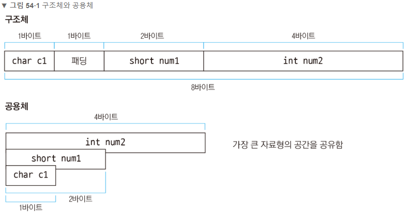
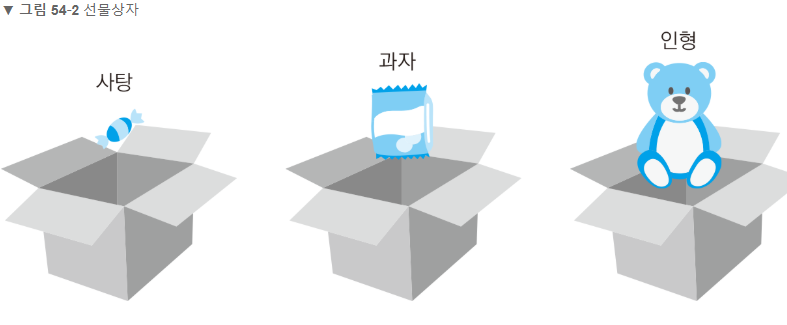
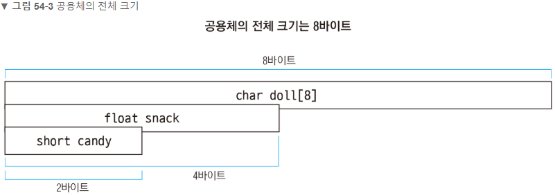
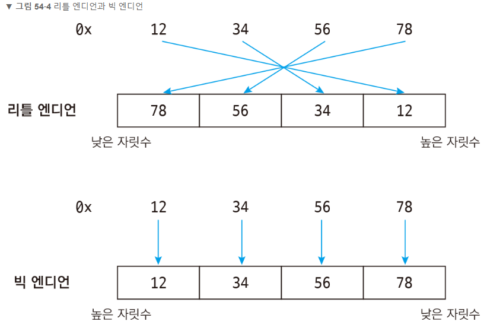
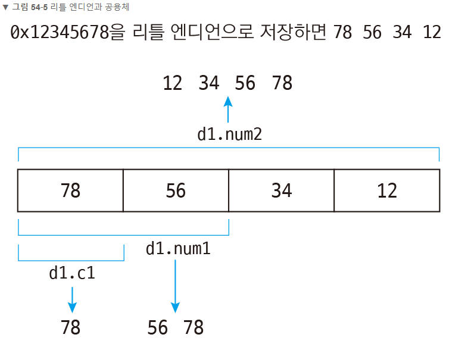

# C

파이팅!

# [ 동적할당 ]

---

- 동적할당이라는 것은 프로그램 실행중에 동적으로 메모리를 할당하는 것을 말한다.
- 여기서 중요한것은 **동적으로 메모리를 할당할때 Heap(힙)영역**에 할당한다는 것이다.

```bash
# 함수원형
void* malloc(size_t size)
```

- 해당함수를 사용하기 위해서는 **<stdlib.h>** 헤더파일을 include해야한다.
- 함수 동작은 매개변수에 해당하는 size_t 만큼의 크기만큼 메모리를 할당하고
  - 성공하면 : 할당한 메모리의 첫 번째 주소 리턴
  - 실패하면 : NULL 리턴
- 제일 중요한점 !!
  - **할당한 메모리는 꼭 해제해주어야한다.!!**
  - 그렇지 않으면 메모리 릭, 메모리 누수가 발생한다.

## 함수 원형

- 메모리 할당

```C
void *malloc(size_t size);
	- 할당받을 메모리 크기를 인자로 받는다
	- ex) int * arr = (int *)malloc(sizeof(int)*n); // 인자의 개수가 n개의 배열을 동적할당한다.(그만큼의 메	모리할당한다)
```

- 메모리 할당 및 초기화

```C
void *calloc(size_t nelem, sizeo_t elsize);
	- 첫번째 인자 배열요소 갯수, 두번째 인자 각 배열요소 사이즈
	- 할당된 메모리 0으로 초기화
```

- 메모리 추가할당

```C
void *realloc(void *ptr, size_t size);
	- 이미 할당받은 메모리에 추가로 메모리 할당, 이전 메모리 주소 없어짐
```

- 메모리 해제 함수

```C
void free(void *ptr);
	- 할당한 메모리를 해제한다.
	- 할당한 메모리를 제대로 해제 해주지 않으면 메모리 누수(메모리 닉)이 발생할 수 있다.
	- free(arr); // malloc으로 할당한 메모리를 해제한다.
```

## 예제1 

> 사이즈가 정해진 배열 복사

```c
// C code
#include<stdio.h>
#include<stdlib.h>

int main(void)
{
    int arr[4] = {4,3,2,1};		// 크기가 4인 배열 선언
    int * pArr;			       // int 타입을 가리키는 포인터 pArr 선언
    
    // int 타입 사이즈 * 4 만큼의 메모리를 할당하라!
    pArr = (int *)malloc(sizeof(int)*4);
    
    if(pArr==NULL)
    {
        //메모리 할당에 실패하면 이쪽으로 들어옵니다.
        printf("malloc error");
    }
    for(int i=0; i<4; ++i)
    {
        pArr[i] = arr[i];
    }
    for(int i=0; i<4; ++i)
    {
        printf("%d \n", pArr[i]);
    }
    
    //할당한 메모리를 해제해줍니다.
    free(pArr);
    
    system("pause");
    return 0;
}
```

```C
// result
4
3
2
1
```

```C
// analysis
int* pArr = (int *)malloc(sizeof(int)*4);
- (int *) : malloc의 반환형이 void*이므로 (int *)형태로 형변환
- sizeof(int) : sizeof()는 괄호 안에 자료형 타입을 바이트로 연산해주는 연산자
- sizeof(int)*4 : 위에 선언한 arr[4] 사이즈가 가지고 있는 동일한 크기의 메모리를 할당하기 위해 int 타입 곱하기 4를 해준 것
```

## 예제2

> 과목의 점수 받고, 평균점수 내기

```C
#define  _CRT_SECURE_NO_WARNINGS
#include<stdio.h>
#include<stdlib.h>

int main(void)
{
    int num;
    int *pArr;
    int average = 0;
    printf("몇개의 과목을 저장할 것인가 자네 : ");
    scanf("%d", &num);
    //0개 넣으면 프로그램 종료해
    if(num==0)
    {
        return 0;
    }
    //과목 개수만큼 메모리 동적할당을 한다!!
    pArr = (int*)malloc(sizeof(int)*num);
    //동적할당 실패
    if(pArr == NULL)
    {
        printf("malloc error");
        exit(1);
    }
    //점수를 받고 저장한다.
    for(int i=0; i<num; ++i)
    {
        printf("[%d/%d]점수입력 : ", i+1, num);
        scanf("%d", &pArr[i]);
    }
    //출력
    for(int i=0; i<num; ++i)
    {
        printf("%d번째 과목의 점수 : %d\n", i+1, pArr[i]);
    }
    //평균 출력
    for(int i=0; i<num; i++)
    {
        average += pArr[i];
    }
    //정수로 나누어지기 때문에 소수점 이하는 버려진다.
    average /= num;
    printf("평균 : %d\n", average);
    //동적할당 해제
    free(pArr);
    system("pause");
    
    return 0;
}
```


# [ 함수 호출방식 ]

---

## Call-by-value

> 값에 의한 호출

- 함수가 호출될 때, 메모리 공간 안에서는 함수를 위한 별도의 임시 공간이 생성된다.(c++의 경우 stack frame) => 함수가 종료되면 해당 공간은 사라진다.
- 스택 프레임(Stack Frame) : 함수 호출시 할당되는 메모리 블록(지역변수의 선언으로 인해 할당되는 메모리 블록)
- `call-by-value` 값에 의한 호출방식은 함수 호출 시 전달되는 변수의 값을 복사하여 함수의 인자로 전달한다.
- 복사된 인자는 함수 안에서 지역적으로 사용되는 local value의 특성을 가진다.
- **따라서 함수 안에서 인자의 값이 변경되어도, 외부의 변수의 값은 변경되지 않는다.!!**
- 장점 : 복사하여 처리하기 때문에 안전하다. 원래의 값이 보존이 된다.
- 단점 : 복사를 하기 때문에 메모리 사용량이 늘어난다.

### - 예제

```C++
#include <stdio.h>

void swap(int num1, int num2){
    int temp = num1;
    num1 = num2;
    num2 = temp;
}
void main(){
	int a = 20, b = 60;
    swap(a, b);
    printf("a: %d, b: %d", a, b);
}
```

***결과=> a: 20, b: 60***

swap()에서 값만 받아와서 내부적으로 처리를 하고 아무 것도 넘기지를 않는다. 변수를 주소로 가져오거나 포인터로 통해서 가져온 것이 아니기 때문에, 새로운 변수를 만들어서 값을 대입해서 처리한 것이다. 이 경우 교체는 되지 않고 swap() 내부에서만 처리가 된다. 반환형이 없기에 사실상 위에서는 의미 없는 행동을 했다. 만일 swap()이 아닌 다른 함수로 리턴 값을 넣었다면, 안정적으로 처리를 해서 결과를 도출해준다. 하지만 swap()의 경우 이런 방법은 잘못된 사용방법이다.


## Call-by-reference

> 참조에 의한 호출

- 함수가 호출될 때, 메모리 공간 안에서는 **함수를 위한 별도의 임시 공간**이 생성된다.
- `call-by-reference` 참조에 의한 호출방식은 함수 호출시 인자로 전달되는 변수의 레퍼런스를 전달한다.(해당 변수를 가리킨다.)
- **따라서 함수 안에서 인자의 값이 변경되면, 아규먼트로 전달된 객체의 값도 변경된다.**
- 장점 : 복사하지 않고 직점 참조를 하기에 빠르다.
- 단점 : 직접 참조를 하기 위해 원라 깂이 영향을 받는다.(리스크)

### - 예제

```C++
#include <stdio.h>

void swap(int &num1, int &num2){
    int temp = num1;
    num1 = num2;
    num2 = temp;
}
void main(){
    int a = 20, b = 60;
    swap(a, b);
    printf("a: %d, b: %d", a, b);
}
```

***결과=> a: 60, b: 20***

swap()에서 main()의 a,b 주소를 가져와서 처리를 했다. 직접 주소 가져와서 처리를 했기 때문에 swap()의 내부 처리로도 a,b가 교체가 되었다. 이렇게 보듯 단점으로는 주소나 포인터를 사용하면 직접 변수에 접근하기 때문에 리스크가 있다. 

이러한 개념을 이해하고 함수의 필요한 ㄷ데이터의 상관 관계를 이해하여 만들면 효율적으로 만들수가 있겠다.

## 더블포인터 사용하기

> "call_by_value()는 값을 넘긴 것이고, call_by_refer()도 값을 넘긴 것이다. 다만, call_by_value()에서는 int형 값을 넘긴 것이고, call_by_refer()에서는 int 주소형 값을 넘긴 것이다."

포인터가 어떤 변수의 주소값을 가리킨다라고 하면, 이중포인터는 포인터 변수의 주소값을 가리킨다고 할 수 있다.

즉, 둘 다 변수의 주소값을 가리키는 것이다.

다만 포인터 변수는 이미 포인터이다보니, C언어로 표현할 때에 포인터 표시가 2개 이상 연속으로 된다는 것일 뿐입니다.

### - 예제

```C++
int global_val = 30;

void call_by_value(int *val){
    val = &global_val;
}
void call_by_refer(int **ref){
    *ref = &global_val;
}
int main(){
    int local_val = 10;
    int *value = &local_val;
    int *refer = &local_val;
    
    printf("before : *value=%d, *refer=%d\n", *value, *refer);
    call_by_value(value);
    call_by_refer(&refer);
    printf("after : *value=%d, *refer=%d\n", *value, *refer);
}
```

main()시작시에 두 변수 모두 동일한 local_val의 주소값을 가리키게 했으니, *value, *refer는 10이 된다.

그리고 아까 전과 동일하게 call_by_value()는 변수를 그대로, call_by_refer()는 변수의 주소값을 인자로 보내고 각 함수에서는 global_val의 주소값을 넣어주었다.

```bash
# 결과
before : *value=10, *refer=10
after : *value=10, *refer=30
```

- call_by_value()에서의 val은 &global_val을 받긴 하지만 함수를 종료하고 나면 값은 사라진다. 그러므로 main()에서는 여전히 local_val을 가리키고 있으며 10이 출력이 된다.
- call_by_refer()에서의 ref는 포인터변수의 주소값이므로, *ref에 &global_val을 넣게 되면 main()에서의 refer값이 변경되는 셈이므로, local_val이 아니라 global_val을 가리키고 있으며, 30이 출력된다.

위에서 언급했듯이, 값도 값이고 주소값도 값이다. 중요한 것은 **내가 담고자 하는 변수의 주소값**이 필요한 것인데, 그 변수가 포인터 변수인 것이다.!

결과적으로 **내가 담고자 하는 (포인터)변수의 주소값**이 필요한 것이 된다.

main()에서 전달하는 변수가 포인터변수였고, 그 포인터변수의 주소값을 넘겨야 하므로, &refer가 되어야 하는게 맞으며 그에 맞춰서 `call_by_refer(int **ref)`처럼 이중포인터가 되는게 맞다!


# [ atoi, atof, atol ]

---

## 1. atoi, atof, atol 함수의 기원

atoi 함수를 살펴보면 a - to - i 이렇게 나눌 수 있다.  a=ch**a**r(**A**ScII), i = int

- atoi (char to int) = 문자열을 정수 타입으로
- atof (char to double) = 문자열을 실수 타입으로
- atol (char to long int) = 문자열을 long 정수 타입으로

중요한 것은 여기서 char는 char[N], char*로 표현이 되는 문자열을 말한다. // ( char * to int )가 더 정확한 표현같음?

C++에서는 string클래스에 의해서 문자열을 string으로 표현할 수 있는데, C언어에서는 string클래스가 존재하지 않기 때문에 char배열을 이용하여 문자열 표현하기 때문이다.

## 2. atoi, atof, atol 함수의 원형

```C
include <stdlib.h>
include <cstdlib>
    
int atoi(const char* cStr);
double atof(const char* cStr);
long int atol(const char* cStr);
```

cStr이라고 적은 이유는 C스타일의 문자열이라는 것을 강조하기 위해서!

C++의 string을 이용했다면 c_str() 함수를 이용해서 C스타일의 문자열로 변환해서 이용해야한다.

## 3. atoi, atof, atol 함수사용법

```C
#include <stdlib.h>
#include <stdio.h>

int main(){
    int num = 0;
    char cStr[30] = "2019";
    
    //문자열 타입으로 출력.
    printf("char* = %s\n", cStr);
    
    //char* -> int
    num = atoi(cStr);
    
    //숫자 타입으로 출력
    printf("int = %d\n", num);
    
    system("pause");
    return 0;
}
```

```C
// 출력 결과
char* = 2019
int = 2019
```

## 4. 숫자가 아닌 문자를 숫자로 바꾸려 한다면?

char 타입을 int로 바꾸려고 하는데, 항상 다 숫자가 들어가있지는 않을거다.

char[]안에 문자가 섞여서 들어간다면...??

```C++
#include<iostream>
#include<cstdlib>
using namespace std;
int main(void){
    char str1[] = "BlockDMask";		// 문자열만 있는 경우
    char str2[] = "2019";			// 숫자만 있는 경우
    char str3[] = "2019BlckDMask";	// 숫자 + 문자
    char str4[] = "BlockDMask2019"; // 문자 + 숫자
    
    cout << "atoi(\"문자만\"); - " << atoi(str1) <, endl;
    cout << "atoi(\"숫자만\"); - " << atoi(str2) <, endl;
    cout << "atoi(\"숫자 + 문자\"); - " << atoi(str3) <, endl;
    cout << "atoi(\"문자 + 숫자\"); - " << atoi(str4) <, endl;
    return 0;
}
```

```bash
# 결과
atoi("BlockDMask")			: 0
atoi("2019")				: 2019
atoi("2019BlockDMask")		: 2019
atoi("BlockDMask2019")		: 0
```

1. atoi("문자") : 문자가 맨처음 나왔기 때문에 0 반환
2. atoi("숫자") : 숫자를 반환
3. atoi("숫자+문자") : 문자가 나오기 전까지의 숫자 반환
4. atoi("문자+숫자") : 문자가 바로나오기 때문에 0 반환

**atoi() 함수의 원리는 매개변수로 들어온 문자열을 앞에서 부터 읽어서, "공백", or "숫자가 아닌 문자"가 올때까지 숫자로 변환을 해주는 원리이다**

## 5. atoi("문자") vs atoi("0")의 구분에 대해서

그렇다면 atoi("문자")의 반환이 0이라면 atoi("0")과 결과값과 똑같을까?

둘바 반환값은 0이나오지만 숫자"0"이냐, 문자"0"이냐의 차이이다. 이런경우에는 비효율적이지만 **isdigit()**을 이용해서 판단해주자

문자열의 길이가 1이고 맨앞의 문자가 isdigit('0')으로 true라면 숫자 0인것이고

isdigit('B')이 false라면 문자열로 이루어진 문자라고 판단할 수 있을 것!!

# [ strcpy, strncpy ]

---

## 예제

```c
// ===================================== strcpy =========================================
#include <stdio.h>
#include <string.h>

int main(void){
    char origin[] = "BlockDMask";		// "BlockDMask\0" 이므로 size = 11;
    char dest1[20];
    char dest2[10];
    char dest3[] = "STRCPY_EXAMPLE";	// size = 15;
    
    // case1 : 빈 배열에 전체를 복사
    strcpy(dest1, origin);
    
    // case2 : 꽉 차있는 배열에 전체를 복사
    strcpy(dest2, origin);			// **run time error
    
    // case3 : 꽉 차있는 배열에 전체를 복사
    strcpy(dest3, origin);
    
    printf("case1 : %s\n", dest1);
    //printf("case2 : %s\n", dest2);
    printf("case3 : %s\n", dest3);
    return 0;
}
```

```bash
# 출력 결과
case1 : BlockDMask
case3 : BlockDMask
```

```C
// ===================================== strncpy =========================================
#include <stdio.h>
#include <string.h>

int main(void){
    char origin[] = "BlockDMask";		// "BlockDMask\0" 이므로 size = 11;
    char dest1[20];
    char dest2[] = "abcdefghijklmnop";	// size = 17;
    char dest3[] = "STRNCPY_EXAMPLE";	// size = 16;
    char dest4[10];
    
    // case1 : 빈 배열에 전체를 복사
    strncpy(dest1, origin, sizeof(origin));
    
    // case2 : 꽉 차있는 배열에 전체를 복사
    strncpy(dest2, origin, sizeof(origin));			// **run time error
    
    // case3 : 꽉 차있는 배열에 일부만 복사
    strncpy(dest3, origin, 4);
    
    // case4 : 빈 배열에 일부만 복사
    strncpy(dest4, origin, 4);
    
    printf("case1 : %s\n", dest1);
    printf("case2 : %s\n", dest2);
    printf("case3 : %s\n", dest3);
    printf("case4 : %s\n", dest4);
    return 0;
}
```

```bash
# 출력 결과
case1 : blockDMask
case2 : blockDMask
case3 : BlockCPY_EXAMPLE
case4 : Block쓰레기쓰레기쓰레기쓰레기BlocCPY_EXAMPLE
```

## 주의 해야할 것!!

- strcpy는 문자열 끝(= "\0")까지 복사를 한다.

  => 따라서 strcpy를 통해 배열의 끝인 \0까지 복사가 되면 dest문자열의 N번째 인덱스에 \0이 존재하게 된다. 그러므로 그 문자열은 \0까지 인식하게 되고 프린트를 하게 되면 그 전까지만 출력이 나오는 거다!!

- strncpy로 복사했을 경우 n의 길이를 주의해야한다.

  ```C
  strncpy(dest, origin, n)
  n의 크기는 sizeof(origin)보다 작거나 같아야 한다.(휴먼에러 발생할 수 있음)
      - n <= sizeof(origin)
  또한, dest의 길이보다 n은 작거나 같아야 한다.
      - n <= sizeof(dest)
  ```

  

# [ strtoull ]

```c
unsigned long long strtoull(const char *nptr, char ** endptr, int base);
	// 정수로 구성한 문자열로 unsigend long long 형식 값 계산
	// *nPtr : 변환할 NULL 종료 문자열
	// **endptr : 검색을 중지하는 문자에 대한 포인터
	// base : 사용할 기수
```

strtoull 함수는 정수로 구성한 문자열을 계산하여 unsigned long long 형식 값을 반환한다. 그리고 계산할 수 없는 문자를 발견하면 두 번째 입력 인자로 받은 endptr이 가리키는 곳에 설정한다. 특히 세번째 인자로 진수를 선택하면 문자열의 정수를 입력한 진수 체계로 판단하여 계산한다.

## Return Value

`strtoull`은 변환된 값(있는 경우)을 반환하거나 오버플로가 발생할 경우 `ULLONG_MAX`를 반환한다. 변환을 수행할 수 없는 경우 `strtoull`은 0을 반환한다. `wcstoull`또는 유사값을 `strtoull`로 반환한다. 두 함수 모두 오버플로 또는 언더플로가 발생하는 경우 `errno`또는 `ERANGE`로 설정한다.

- `strtoull`은 숫자의 일부분으로 인식할 수 없는 첫 번째 문자에서 문자열 nptr읽기를 중지한다. 이 문자는 종료 null문자일 수도 있고 base보다 크거나 같은 첫 번째 숫자일 수도 있다. 로캘은 `LC_NUMERIC`범주 설정은 nptr의 기 하문자를 인식하도록 결정한다. `strtoull` 및 `wcstoull`은 현재 로캘을 사용한다. 
- endptr이 NULL이 아닌 경우 검색을 중지 한 문자에 대한 포인터는 endptr이 가리키는 위치에 저장된다. 올바른 숫자를 찾을수 없거나 잘못된 밑수를 지정하여 변환을 수행할 수 없는 경우 nptr의 값은 endptr이 가리키는 위치에 저장된다.

```C
static int t_tw_i2c_write(AMBA_SHELL_PRINT_f print_f, int argc, char **argv, char *hexString)
{
	int rval = 0;
	unsigned long value;

	void I2c_Write_Word(unsigned char mSlave, unsigned char mReg, unsigned char mData, int i2cDataSize);

	AmbaPrint("input argument hexString ::: %s", hexString);

	value = strtoull(hexString, argv, 16);
	AmbaPrint("value : %u", value);
    // 입력 : 0x00 ~ 0xFE ( 문자열 )
    // 출력 : 0x00 ~ 0xFE ( unsigned char )

	I2c_Write_Word(I2C_SLAVE, I2C_REG, value, I2C_SIZE);
	return rval;
}
```


# [ 포인터와 역참조 연산자 ]

---

> 포인터 변수에는 메모리 주소가 저장되어 있다. 이 때 메모리 주소가 있는 곳으로 이동해서 값을 가져오고 싶다면 역참조 연산자 *를 이용한다.

```C
#include <stdio.h>

int main(){
    int *numPtr;		// 포인터 변수 선언
    int num1 = 10;		// 정수형 변수를 선언하고 10 저장
    
    numPtr = &num1;		// num1의 메모리 주소를 포인터 변수에 저장
    printf("%d\n", *numPtr);	// 10 // 역참조 연산자로 num1의 메모리 주소에 접근하여 값을 가져온다
    return 0;
}
```

```bash
# 실행 결과
10
```

- 역참조 연산자 *는 포인터 앞에 붙인다. 다음과 같이 numPtr 앞에 *를 붙이면 numPtr에 저장된 메모리 주소로 가서 값을 가져온다. 여기서는 numPtr이 num1의 메모리 주소를 저장하고 있으므로 num1의 값인 10이 출력된다.
- 즉, 포인터는 변수의 주소만 가리키며 역참조는 주소에 접근하여 값을 가져온다.


```C
// 참고 
// 포인터 선언과 역참조 ??
포인터를 선언할 때도 *를 사용하고 역참조를 할 때도 *를 사용한다. 같은 *기호를 사용해서 헷갈리기 쉽지만 선언과 사용을 구분해서 생각하면 된다.
즉, 포인터를 선언할 때 *는 "이 변수가 포인터다" 라고 알려주는 역할이고, 포인터에 사용할 때 *는 "포인터의 메모리 주소를 역참조하겠다"라는 뜻이다.

int *numPtr;				// 포인터. 포인터를 선언할 때 *
printf("%d\n", *numPtr);	// 역참조. 포인터에 사용할 때 *
```


이번에는 포인터 변수에 역참조 연산자를 사용한 뒤 값을 저장(할당)해보겠다.

> ***포인터 = 값;**

```C
#include <stdio.h>

int main(){
    int *numPtr;			// 포인터 변수 선언
    int num1 = 10;			// 정수형 변수를 선언하고 10 저장
    
    numPtr = &num1;			// num1의 메모리 주소를 포인터 변수에 저장
    
    *numPtr = 20;			// 역참조 연산자로 메모리 주소에 접근하여 20을 저장***********************
    
    printf("%d\n", *numPtr);	// 20 // 역참조 연산자로 메모리 주소에 접근하여 값을 가져옴
    printf("%d\n", num1);		// 20 // 실제 num1의 값도 바뀐다.
}
```

```bash
# 실행 결과
20
20
```

- 역참조 연산자는 값을 가져올 수 도 있고 값을 저장할 수도 있다. 여기서는 `*numPtr = 20;` 과 같이 numPtr에 저장된 메모리 주소에 접근하여 20을 저장했다. 따라서 printf로 *numPtr을 출력해보면 20이 나온다.
- 또 한가지 중요한 점은 `*numPtr = 20;`으로 20을 저장한뒤 printf로 변수 num1의 값을 출력해보면 20이 나온다는 것이다. 왜냐하면 numPtr에는 num1의 메모리 주소가 저장되어 있으므로 역참조 연산자로 값을 저장하면 결국 num1에 저장하게 되는것이다.


- 역참조 연산자는 자료형을 바꾸는 효과를 낸다. 즉, `int *numPtr;`에서 *numPtr처럼 역참조하면 pointer to int에서 pointer to를 제거하여 그냥 int로 만든다.
  (int 포인터 -> int)
- 만약 포인터 numPtr에 변수 num1을 할당한다면 역참조 연산자로 자료형을 맞춰주면 된다.

```C
int *numPtr;
int num1 = 10;

numPtr = num1;			// 컴파일경고, numPtr은 int포인터형이고 num1은 int형이라 자료형이 일치하지 않는다.

*numPtr = num1;			// *numPtr은 int형이고 num1도 int형이라 자료형이 일치한다.
```

- 물론 주소 연산자 &도 자료형을 맞춰주는 역할을 한다. ( &을 붙이지 않으면 경고 발생 )

```C
int *numPtr;
int num1;

numPtr = &num1;			// numPtr은 int포인터형이고, &num1은 int형 변수의 주소형이므로 자료형이 일치함
						// numPtr은 pointer to int, &num1은 address of int이므로 자료형이 일치하는 것!
```

**즉, pointer to int와 address of int는 자료형이 같은것이다.**


## 변수, 주소 연산자, 역참조 연산자, 포인터의 차이 ?!


- 먼저 **변수**는 메모리 주소를 몰라도 값을 가져오거나 저장할 수 있다. 그냥 변수에 값을 할당하거나 그대로 출력하면 된다.
- **주소 연산자 &**는 변수의 메모리 주소를 구한다. 이 그림에서 10을 감싸고 있는 상자는 메모리 공간을 뜻하는데 주소 연산자는 메모리 공간이 어디에 있는지 위치만 알아낼 수 있다.
- **역참조 연산자 ***는 그림에서 보면 상자안까지 들어가서 값을 가져오거나 저장한다. 즉, 메모리주소를 알고 있으므로 메모리 주소를 거쳐서 그 안에 있는 값을 가져오거나 저장한다.
- 마지막으로 **포인터**는 변수의 메모리 주소만 가리킨다. 따라소 포인터는 메모리 공간이 어디에 있는지 위치만 알고 있다.

# [ 포인터의 형변환 ]

---

```C
#include <stdio.h>
#incldue <stdlib.h> 	// malloc, free 함수가 선언된 헤더파일

int main(){
    int *numPtr = malloc(sizeof(int)); 	// 4바이트만큼 메모리 할당
    char *cPtr;
    
    *numPtr = 0x12345678;
    
    cPtr = (char *)numPtr;		// int 포인터 numPtr을 char 포인터로 변환. 메모리 주소만 저장됨
    
    printf("0x%x\n", *cPtr);	// 0x78 : 낮은 자릿수 1바이트를 가져오므로 0x78
    
    free(numPtr);		// 동적메모리 해제
    return 0;
}
```

```bash
# 실행 결과
0x78
```

numPtr에 메모리를 할당하고 역참조하여 0x12345678을 저장했다. 그리고 `cPtr = (char *)numPtr;`과 같이 int 포인터를 char포인터로 변환하여 메모리 주소을 저장하였다.

이 상태에서 printf로 *cPtr을 출력해보면 어떻게 될까? *cPtr과 같이 역참조하면 numPtr의 메모리 주소에 접근하지만 cPtr은 char포인터이므로 1바이트만큼만 값을 가져온다. 즉, numPtr이나 cPtr이나 안에 저장된 메모리 주소는 같지만 자료형에 따라 역참조했을 때 갑을 가져오는 크기가 결정되기 때문이다.


여기서는 메모리 공간에 0x12345678(*리틀 엔디언: 78 56 34 12*)이 저장된 상태에서 1바이트 char 크기만큼 낮은 자릿수 값을 가져오므로 0x78이 된다. 자료형이 다른 포인터에 메모리 주소가 이리저리 옮겨 다닌다고 해도 메모리 공간은 그대로이고, 값을 가져오는 크기만 달라진다.


- 앞의 예제와는 반대로 크기가 작은 메모리 공간을 할당한 뒤큰 자료형의 포인터로 역참조하면 의도치 않은 값을 가져오게 된다.

```C
#include <stdio.h>
#include <stdlib.h>

int main(){
    short *numPtr1 = malloc(sizeof(short));		// 2바이트만큼 메모리 할당
    int *numPtr2;
    
    *numPtr1 = 0x1234;
    
    numPtr2 = (int *)numPtr1;		// short 포인터 numPtr1을 int 포인터로 변환. 메모리 주소만 저장됨
    
    printf("0x%x\n", *numPtr2);		// 0xfdfd1234 : 옆의 메모리를 침범하여 값을 가져옴
    							// 0xfdfd는 상황에 따라서 값이 달라질 수 있음
    free(numPtr1);
    return 0;
}
```

```bash
# 실행결과
0xfdfd1234
```

이번에는 numPtr1에 2바이트 크기로 메모리를 할당하고 역참조하여 0x1234를 저장했다. 그리고 `numPtr2= (int *)numPtr1;`과 같이 short 포인터를 int 포인터로 변환하여 메모리 주소를 저장했다.

printf로 *numPtr2를 출력해보면 1234앞에 엉뚱한 값이 붙어서 나온다. 크기가 작은 메모리를 할당한 뒤 큰 자료형의 포인터로 역참조하면 옆의 메모리 공간을 침범하여 값을 가져오게 된다.


malloc 함수로 2바이트만큼 메모리를 할당했으므로 0x1234(*리틀 엔디언 : 34 12*)만 저장되어 있다. 하지만 이 상태에서 4바이트 int 크기만큼 값을 가져오면 2바이트 크기를 벗어나서 malloc 함수로 할당하지 않은 공간까지 함께 가져오게 된다. 따라서 의도치 않은 값을 가져오게 되므로 주의하자. 참고로 할당되지 않은 공간에는 쓰레기 값이 들어있다.


## - 참고

```C
// 참고 // ******************** 포인터 변환과 컴파일경고 *************************
// 일반변수와 마찬가지로 포인터도 변환할 때 자료형이 다르면 컴파일 경고가 발생한다.

int *numPtr = malloc(sizeof(int));		// int 포인터
char *cPtr;			// char 포인터

cptr = numPtr;		// 컴파일 경고 발생
free(numPtr);
```

```bash
# 컴파일 결과
warning C4133: '=': 'int *'과(와) 'char *' 사이의 형식이 호환되지 않습니다.
```

포인터를 다른 자료형으로 변환하면서 역참조하려면 다음과 같이 ( )(괄호) 앞에 역참조 연산자 *를 붙여주면 된다.

- `*(자료형 *)포인터`

```C
#include <stdio.h>
#include <stdlib.h>		// malloc, free 함수가 선언된 헤더 파일

int main(){
    int *numPtr = malloc(sizeof(int));		// 4바이트 만큼 메모리 할당
    char *cPtr;
    
    *numPtr = 0x12345678;
    printf("0x%x\n", *(char *)numPtr);		// 0x78 : numPtr을 char 포인터로 변환한 뒤 역참조
    free(numPtr);		// 동적 메모리 해제
    return 0;
}
```

```bash
# 실행 결과
0x78
```

`*(char *)numPtr`과 같이 char 포인터로 변환한 뒤 역참조 했다. 따라서 0x12345678에서 1바이트 char 크기만큼 낮은 자릿수 값 0x78을 가져온다.


# [ 메모리와 포인터의 사용 ]

---

```C
#include <stdio.h>
#include <stdlib.h>		// malloc, free 함수

int main(){
    int *numPtr;		// int형 포인터 선언
    numPtr = malloc(sizeof(int));		// int의 크기 4바이트만큼 동적 메모리 할당
    
    *numPtr = 10;		// ****포인터를 역참조 한뒤 값 할당****
    
    printf("%d\n", *numPtr);		// 10 , 포인터를 역참조하여 메모리에 저장된 값 출력
    
    free(numPtr);		// 동적 메모리 해제
    return 0;
}
```

- malloc함수에 실제로 값을 저장할 때는 시스템의 한계(RAM, 디스크)이상 저장할 수 없다.

## 메모리 내용을 한꺼번에 설정하기(memset)

> memset함수를 사용하면 메모리의 내용을 원하는 크기만큼 특정값으로 설정할 수 있다.(string.h)

```C
memset(포인터, 설정할값, 크기);
	- void *memset(void *_Dst, int _Val, size_t _Size);
	- 값 설정이 끝난 포인터를 반환
```

```C
#include <stdio.h>
#incldue <stdlib.h>
#include <string.h>

int main(){
    long long *numPtr = malloc(sizeof(long long));		// long long의 크기 8바이트만큼 동적 메모리 할당
    
    memset(numPtr, 0x27, 8);		// numPtr이 가리키는 메모리를 8바이트만큼 0x27로 설정
    
    printf("0x%llx\n", *numPtr);		// 0x2727272727272727 : 27이 8개 들어가있음
    
    free(numptr);
    return 0;
}
```

```bash
# 실행 결과
0x2727272727272727
```

- 먼저 `memset` 함수를 사용하려면 `string.h` 또는 `memery.h` 헤더파일을 포함해야 한다. 그리고 memset함수에 포인터, 설정할 값, 설정할 크기를 넣으면 된다. 

- **`memset`함수는 주로 다음과 같이 설정할 값을 0으로 지정하여 메모리의 내용을 모두 0으로 만들 때 주로 사용한다.**

  ```C
  memset(numPtr, 0, 0);		// numPtr이 가리키는 메모리를 8바이트만큼 0으로 설정
  ```

### >  자료형의 크기와 포인터의 크기

```C
// memset 함수에 설정할 크기를 지정할 때 보통 숫자대신 sizeof를 사용한다.
long long *numPtr = malloc(sizeof(long long));
memset(numPtr, 0, sizeof(long long));
// 여기서 메모리를 sizeof(long long)크기만큼 할당했으므로 설정할 크기도 sizeof(long long)과 같이 지정해야 하며 sizeof(long long *)과 같이 포인터의 크기를 지정하면 안된다! 포인터의 크기는 메모리주소의 크기일뿐 실제 메모리가 차지하는 크기가 아니다. 이부분은 char 포인터에 메모리를 할당해보면 잘 알 수 있을것이다.

char *cPtr = malloc(sizeof(char));		// char의 크기 1바이트만큼 동적 메모리 할당
memset(cPtr, 0, sizeof(char));		// char의 크기 1바이트만큼 0으로 설렁(올바른 방법)
memset(cPtr, 0, sizeof(char *));	// 32비트 : char 포인터의 크기 4바이트만큼 0으로 설정(잘못된 방법)
								// 64비트 : char 포인터의 크기 8바이트만큼 0으로 설정(잘못된 방법)

// 할당해줄 크기가 포인터의 크기가 일치한다고 해서 옳은 방법이 아니므로 해당 메모리가 차지하는 크기를 선언해주자.
```

## 널포인터

```C
#include <stdio.h>

int main(){
    int *numPtr1 = NULL;		// 포인터에 NULL 저장
    printf("%p\n", numPtr1);		// 00000000
    return 0;
}
```

```bash
# 실행 결과
00000000
```

- NULL이 들어있는 포인터를 널 포인터라고 하며 아무것도 가리키지 않는 상태를 뜻한다. 따라서 역참조를 할 수 없다.

- **실무에서는 다음과 같이 포인터가 NULL인지 확인한 뒤 NULL이면 메모리를 할당하는 패턴을 주로 사용한다.**

  ```C
  if(ptr = NULL){				// ptr이 널 포인터라면
      ptr = malloc(1024);		// 1024바이트만큼 메모리 할당
  }
  ```

## 포인터에 할당된 메모리를 배열처럼 사용하기

```C
#include <stdio.h>
#include <stdlib.h>

int main(){
    int *numPtr = malloc(sizeof(int)*10);		// int 10개 크기만큼 동적 메모리 할당
    
    numPtr[0] = 10;		// 배열처럼 인덱스로 접근하여 값 할당
    numPtr[9] = 20;		// 배열처럼 인덱스로 접근하여 값 할당
    
    printf("%d\n", numPtr[0]);		// 배열처럼 인덱스로 접근하여 값 출력
    printf("%d\n", numPtr[9]);		// 배열처럼 인덱스로 접근하여 값 출력
    
    free(numPtr);		// 동적 메모리 해제
   	return 0;
}
```

```bash
# 실행 결과
10
20
```

```C
int numArr[10];						 		// int형 요소 10개를 가진 배열 생성
int *numPtr = malloc(sizeof(int) * 10);			// int 10개 크기 만큼 메모리 할당

numArr[0] = 10;
numPtr[0] = 10;
free(numPtr);
```

- 배열 numArr은 한 번 선언하면 끝이지만 포인터 numPtr은 malloc함수로 메모리를 할당했기 때문에 free함수로 해제해야한다.

- `*numPtr`처럼 포인터를 역참조한 것과 `numPtr[0]` 처럼인덱스 0에 접근한 것은 같은 값을 가져온다. 그리고 `numPtr[1]`과 `*(numPtr+1)`도 같은 값을 가져오는데 후자와 같은 방식을 포인터 연산이라고 한다.

  

# [ 포인터연산 ]

---

>  포인터로 선언한 변수에는 메모리 주소가 들어있다. 이 포인터 변수에서 연산을 할 수 있다.
>
> 마찬가지로 메모리 주소에 일정 숫자를 더하거나 빼면 메모리 주소가 증가,감소 한다. **즉, 포인터 연산을 하면 다른 메모리 주소에 접근할 수 있으며 메모리 주소를 손쉽게 옮겨 다니기 위해서 사용한다.**


> 여기서 메모리 주소가 커지는 상황을 순방향 이동(forward), 메모리 주소가 작아지는 상황을 역방향이동(backward)라 하겠다.

## 포인터연산으로 메모리 주소 조작하기

```C
#include <stdio.h>

int main(){
    int numArr[5] = { 11, 22, 33, 44, 55 };
    int *numPtrA;
    int *numPtrB;
    int *numPtrC;
    
    numPtrA = numArr;			// 배열 첫 번째 요소의 메모리 주소를 포인터에 저장
    numPtrB = numPtrA + 1;		// 포인터 연산
    numPtrC = numPtrA + 2;		// 포인터 연산
    
    printf("%p\n", numPtrA);		// 00A3FC00 : 메모리주소. 컴퓨터 마다, 실행할 때마다 달라짐
    printf("%p\n", numPtrB);		// 00A3FC04 : sizeof(int)*1 이므로 numPtrA에서 4가 증가함
    printf("%p\n", numPtrC);		// 00A3FC08 : sizeof(int)*2 이므로 numPtrA에서 8이 증가함
    
    return 0;
}
```

```bash
# 실행 결과
00A3FC00 ( 메모리주소. 컴퓨터 마다, 실행할 때마다 달라짐 )
00A3FC04
00A3FC08
```

- 포인터 연산은 특별한 것이 없고 포인터 변수에 정수 값을 더하거나 빼면 된다. 단, 연산하는 값이 메모리 주소이므로 곱하거나 나누는 연산은 의미가 없음
- 포인터 연산은 포인터 자료형의 크기만큼 더하거나 뺀다.
- 여기서 numPtrA가 4바이트 크기의 int형이다. 따라서 numPtrA+1은 메모리주소에서 4바이트만큼 1번 순방향 이동한다는 뜻 즉, 계산식은 **sizeof(자료형) * 더하거나 빼는 값**이 된다.


이번에는 포인터 뺄셈을 해보겠다.

```C
#include <stdio.h>

int main(){
    int numArr[5] = { 11, 22, 33, 44, 55 };
    int *numPtrA;
    int *numPtrB;
    int *numPtrC;
    
    numPtrA = &numArr[2];		// 배열 세 번째 요소의 메모리 주소를 포인터에 저장
    
    numPtrB = numPtrA - 1;
    numPtrC = numPtrA - 2;
    
    printf("%p\n", numPtrA);		// 00A3FC00 : 메모리주소. 컴퓨터 마다, 실행할 때마다 달라짐
    printf("%p\n", numPtrB);		// 00A3FC04 : sizeof(int) * -1 이므로 numPtrA에서 4가 감소함
    printf("%p\n", numPtrC);		// 00A3FC08 : sizeof(int) * -2 이므로 numPtrA에서 8이 감소함
    
    return 0;
}
```

```bash
# 실행 결과
00A3FC08 ( 메모리주소. 컴퓨터 마다, 실행할 때마다 달라짐 )
00A3FC04
00A3FC00
```

- `numPtrA = &numArr[2];`와 같이 배열에 `[ ](대괄호)`를 사용하여 요소에 접근한뒤 `&(주소연산자)`를 사용하면서 해당 요소의 메모리 주소를 구할 수 있다.


- 포인터 연산은 char는 1바이트, short는 2바이트, int는 4바이트, long long은 8바이트만큼 메모리 주소에서 순방향, 역방향으로 이동한다.

## 포인터연산과 역참조

1. 포인터 연산으로 조작한 메모리주소도 역참조 연산을 사용하여 메모리에 접근할 수 있다.

```C
#include <stdio.h>

int main(){
    int numArr[5] = { 11, 22, 33, 44, 55 };
    int *numPtrA;
    int *numPtrB;
    int *numPtrC;
    
    numPtrA = numArr;		// 배열 첫 번째 요소의 주소를 포인터에 저장
    
    numPtrB = numPtrA + 1;		// 포인터 연산. numPtrA + 4바이트
    numPtrC = numPtrA + 2;		// 포인터 연산. numPtrA + 8바이트
    
    printf("%d\n", *numPtrB);		// 22. 역참조로 값을 가져온다. numArr[1]과 같음
    printf("%d\n", *numPtrC);		// 33. 역참조로 값을 가져온다. numArr[2]와 같음
    
    return 0;
}
```

```bash
# 실행 결과
22
33
```

2. 포인터 연산과 동시에 역참조 연산을 할 수 있다. 포인터 연산을 한 부분을 `( )괄호`로 묶어 준 뒤 맨 앞에 `*(역참조 연산자)`를 붙이면 된다.

```C
#include <stdio.h>

int main(){
    int numArr[5] = { 11, 22, 33, 44, 55 };
    int *numPtrA;
    
    numPtrA = numArr;		// 배열 첫 번째 요소의 주소를 포인터에 저장
    
    printf("%d\n", *(numPtrA + 1));		// 22. numPtrA에서 순방향으로 4바이트만큼 떨어진 메모리에 주소에 접근. numArr[1]과 같음
    printf("%d\n", *(numPtrA + 2));		// 33. numPtrA에서 순방향으로 8바이트만큼 떨어진 메모리에 주소에 접근. numArr[2]와 같음
    
    return 0;
}
```

```bash
# 실행 결과
22
33
```

- 만약 포인터 연산을 괄호로 묶어주지 않으면 역참조 연산자가 먼저 실행되어 값을 가져 온 뒤 연산을 하게 된다. 

  **ex. `printf("%d\n", *numPtrA + 1);` 의 값은 11 + 1이 되어 12가 된다.**

## 구조체포인터로 포인터 연산

1. 구조체 포인터로 포인터 연산을 해보자

```C
#include <stdio.h>

struct Data{
    int num1;
    int num2;
};

int main(){
    struct Data d[3] = { {10, 20}, {30, 40}, {50, 60} };		// 구조체 배열 선언과 값 초기화
    struct Data *ptr;		// 구조체 포인터 선언
    
    ptr = d;		// 구조체 배열 첫 번째 요소의 메모리 주소를 포인터에 저장
    
    printf("%d %d\n", (ptr + 1)->num1, (ptr + 1)->num2);	// 30 40. 구조체 배열에서 멤버의 값 출력
    												// d[1].num1, d[1].num2와 같음
    printf("%d %d\n", (ptr + 2)->num2, (ptr + 2)->num2);	// 50 60. 구조체 배열에서 멤버의 값 출력
    												// d[2].num1, d[2].num2와 같음
    return 0;
}
```

```bash
# 실행 결과
30 40
50 60
```

- 구조체 포인터는 `(ptr+1)->num1`과 같이 포인터 연산을 한 뒤 갈호로 묶어준다. 그리고 화살표 연산자를 사용하여 멤버에 접근할 수 있다.
- 구조체 Data의 크기는 4바이트짜리 int형 멤버가 두 개 들어있으므로 8바이트이다. 따라서 포인트연산을 하면 8바이트씩 메모리 주소에서 연산을 한다.
- 만약 구조체가 커져서 int형 멤버가 10개가 된다면 40바이트씩 더하거나 빼게 된다.

2. 이번에는 void 포인터에 구조체 3개 크기만큼 동적 메모리를 할당한 뒤 포인터 연산을 해보자

   `((struct 구조체이름 *)포인터 + 값) -> 멤버`

   `((struct 구조체이름 *)포인터 - 값) -> 멤버`

```C
#include <stdio.h>
#include <stdlib.h>		// malloc, free
#include <string.h>		// memcpy

struct Data{
    int num1;
    int num2;
};

int main(){
    void *ptr = malloc(sizeof(struct Data) * 3);		// 구조체 3개 크기만큼 동적 메모리 할당
    struct Data d[3];
    
    ((struct Data *)ptr) -> num1 = 10;		// 포인터 연산으로 메모리에 값 저장
    ((struct Data *)ptr) -> num2 = 20;		// 포인터 연산으로 메모리에 값 저장
    
    ((struct Data *)ptr + 1) -> num1 = 30;		// 포인터 연산으로 메모리에 값 저장
    ((struct Data *)ptr + 1) -> num2 = 40;		// 포인터 연산으로 메모리에 값 저장
    
    ((struct Data *)ptr + 2) -> num1 = 50;		// 포인터 연산으로 메모리에 값 저장
    ((struct Data *)ptr + 2) -> num1 = 60;		// 포인터 연산으로 메모리에 값 저장
    
    memcpy(d, ptr, sizeof(struct Data) * 3);	// 동적 메모리가 구조체 배열의 형태와 같은지 확인하기 위해 동적 메모리의 내용을 구조체 배열에 복사
    
    printf("%d %d\n", d[1].num1, d[1].num2);	// 30 40. 구조체 배열의 멤버 출력
    printf("%d %d\n", ((struct Data *)ptr + 2)->num1, ((struct Data *)ptr +2)-> num2);	// 50. 60. 포인터 연산으로 메모리의 값 출력
    
    free(ptr);	// 동적 메모리 해제
    return 0;
    
}
```

```bash
# 실행 결과
30 40
50 60
```

- 문법이 복잡해보이지만 어렵지 않아요 `((struct Data *)ptr->num1)`은 앞에서 배운 구조체 포인터로 변환하는 방법이다. 이 상태에서 포인터 연산을 하려면 `((struct Data *)ptr + 1)->num1`과 같이 ptr을 구조체 포인터로 변환한 뒤 값을 더해주면 된다. (**`->(화살표연산자)`를 사용하려면 반드시 괄호로 묶어준다**)
- 이제 포인터 연산을 통해 메모리에 값을 저장한다. 만약 `(ptr + 1)->num1`처럼 ptr에 포인터 연산을 하더라도 ptr은 void 포인터라 Data 구조체의 형태를 모르기 때문에 멤버에 접근할 수 없고 컴파일 에러가 발생한다.
- 그리고 포인터 연산으로 값을 저장한 결과가 Data 구조체 배열의 형태와 같은지 확인하기 위해 `memcpy(d, ptr, sizeof(struct Data)*3);`처럼 동적 메모리의 내용을 구조체 배열 d에 복사했다.
- **즉, 동적 메모리에 저장된 값의 위치가 구조체 배열의 형태와 같고, 동적 메모리 내용을 그대로 복사했기 때문에 같은 값이 나온다. 또한, 포인터 연산으로도 동적메모리의 값을 출력할 수 있다.**


# [ 열거형 ]

---

열거형은 정수형 상수에 이름을 붙여 코드를 이해하기 쉽게 해준다. 만약 여러개 정수형 상수를 선언한다면 두세 개까지는 괜찮지만 개수가 많아지면 귀찮아 질 것이다. 열거형을 사용하면 정수형 상수를 좀 더 편하게 정의할 수 있다.

```c
enum 열거형이름{
    value1 = 초깃값,
    value2,
    value3
};
```

열거형은 정의로만 사용이 안되고 변수로 선언해서 사용해야 한다.

```C
enum 열거형이름 변수이름;
```

```C
#include <stdio.h>

enum DayOfWeek{		// 열거형 정의
    Sunday = 0;		// 초깃값 할당
    Monday,
    Tuesday,
    Wednesday,
    Thursday,
    Friday,
    Saturday
};

int main(){
    enum DayOfWeek week;		// 열거형 변수 선언
    week = Tuesday;			// 열거형 값 할당
    printf("%d\n", week);		// 2. Tuesday의 값 출력
    return 0;
}
```

```bash
# 실행 결과
2
```

- 열거형의 값은 처음에만 할당해주면 그 아래에 오는 값들은 1씩 증가하면서 자동으로 할당된다. ( 아무 값도 할당하지 않으면 0부터 시작) 따라서 처음에 오는  Sunday에 0을 할당하면 Monday는 1, Tudesday는 2, ...
- 문법으로 정해진 규칙은 아니지만 열거형 이름이나 값을 정의할 때 대문자만 사용하는 경우가 많다. 특히 단어와 단어 사이에는 `_`를 주로 사용한다. 사실 같은 C언어 코드라 하더라도 운영체제, 회사, 단체에 따라 스타일이 제각각이기때문에 해당 환경에서 사용하는 스타일에 맞춰주자.
- 보통은 처음에 오는 값에만 초깃값을 할당하지만, 모든 값에 정수를 할당할 수 있다.

```C
enum Value{
    ValueA = 1,
    ValueB = 3,
    ValueC = 7,
    ValueD = 11
};
```

- 열거형도 `typedef`로 별칭을 지정하고 익명 열거형을 정의할 수 있다.

```C
typedef enum _DayOfWeek{	// 열거형 이름은 _DayOfWeek
    Sunday = 0;
    Monday,
    Tuesday,
    Wednesday,
    Thursday,
    Friday,
    Saturday
} DayOfWeek;		// typedef를 사용하여 열거형 별칭을 DayOfWeek로 정의
```

- 익명 열거형도 가능하다. ( 구조체와 같은 방식~ )
- 열거형을 정의하는 동시에 변수 선언

```C
enum DayOfWeek{
    Sunday = 0;
    Monday,
    Tuesday,
    Wednesday,
    Thursday,
    Friday,
    Saturday
} week;		// 열거형을 정의함과 동시에 변수 week 선언
```

## 열거형을 switch에 활용하기

열거형은 `switch` 분기문을 사용할 때 유용하다

```C
switch(열거형 변수){
    case 열거형 값:
        실행할 코드;
        break;
}
```

예를들어 게임을 만든다고 할 때 캐릭터의 스킬을 열거명으로 정의할 수 있다.

```C
#include <stdio.h>

enum LuxSkill{
    LightBinding = 1,
    PrismaticBarrier,
    LucentSingularity,
    FinalSpark
};

int main(){
    enum LuxSkill skill;	// 열거형 변수 선언
    skill = LightBinding;	// 열거형 값 할당
    
    switch(skill){
        case LightBinding:
            printf("LightBinding"\n);
            break;
        case PrismaticBarrier:
            printf("LightBinding"\n);
            break;
		case LightBinding:
            printf("LucentSingularity"\n);
            break;
        case LightBinding:
            printf("iInalSpark"\n);
            break;
        default:
            break;
    }
}
```

## 열거형을 for에 활용하기

열거형을 정의한 뒤 for문에 활용하는 방법도 있다. 예를 들어 프로그램에서 일요일부터 토요일까지 매일 반복되는 알람을 설정한다면 열거형과 반복문을 사용하면 편리하다.

```C
#include <stdio.h>

typedef enum _DayOfWeek{
    Sunday = 0,
    Monday,
    Tuesday,
    Wednesday,
    Thursday,
    Friday,
    Saturday,
    DayOfWeekCount		// 열거형 값의 개수를 나타내는 항목 추가
} DayOfWeek;		// typedef를 사용하여 열거형 별칭을 DayOfWeek로 정의

int main(){
    // 초깃값은 Sunday, i가 DayOfWeekCount보다 작을 때까지만 반복
    for(DayOfWeek i = Sunday; i<DayOfWeekCount; i++){
        printf("%d\n", i);
    }
    return 0;
}
```

```bash
# 실행 결과
0
1
2
3
4
5
6
```

# [ 구조체 ]

---

구조체는 struct 키워드로 정의한다.

```C
struct 구조체이름{
    자료형 멤버이름;
    ...
};

// 구조체는 정의만 해서 사용할 수가 없다. 구조체도 변수로 선언해서 사용한다.

struct 구조체이름 변수이름;
```

ex.

```C
#define _CRT_SECURE_NO_WARNINGS			// strcpy 보안 경고로 인한 컴파일 에러 방지
#include <stdio.h>
#include <string.h>		// strcpy 함수가 선언된 헤더 파일

struct Person{		// 구조체 정의
    char name[20];			// 구조체 멤버 1
    int age;				// 구조체 멤버 2
    char address[100];		// 구조체 멤버 3
}

int main(){
    struct Person p1;		// 구조체 변수 선언
    
    // 점으로 구조체 멤버에 접근하여 값 할당
    strcpy(p1.name, "홍길동");
    p1.age = 30;
    strcpy(p1.address, "경기도 분당구 삼평동");
    
    // 점으로 구조체 멤버에 접근하여 값 출력
    printf("이름: %s\n", p1.name);		// 이름 : 홍길동
    printf("나이: %d\n", p1.age);			// 나이 : 30
    printf("주소: %s\n", p1.address);		// 주소 : 경기도 분당구 삼평동
    
    return 0;
}
```

```bash
# 실행 결과
이름 : 홍길동
나이 : 30
주소 : 경기도 분당구 삼평동
```

- 구조체는 보통 main함수 바깥에 정의한다. 만약 함수 안에 구조체를 정의하면 해당 함수안에서만 구조체를 사용할 수 있다.
- 정의한 구조체를 사용하려면 구조체 변수를 선언해야하고 구조체 이름 앞에 반드시 `struct` 키워드를 붙인다.
- 구조체 멤버에 접근할 때는 `.`을 사용한다. `p1.age = 30`과 같이 구조체 멤버에 접근한 뒤 값을 할당하고, `p1.age`같이 값을 가져온다. `p1.name`등의 문자열 멤버는 `=(할당연산자)`로 저장할 수 없으므로 `strcpy`함수를 사용해야한다.
- 구조체정의와 선언을 따로하지않고 동시에 변수를 선언할 수 있다.

```C
struct 구조체이름{
    자료형 멤버이름;
} 변수명;
```

- 구조체 변수를 선언함과 동시에 초기화 할 수 있다.

```C
struct Person{
    char name[20];
    int age;
    char address[100];
};

int main(){
    struct Person p1 = { .name = "홍길동", .age = 30, .address="경기도 분당구 삼평동"};
    struct Person p2 = { .name = "김성현", .age = 28, .address="서울시 관악구 신림동"};
    ...
}
...
```

## typedef로 구조체 선언하기

> 일일이 struct 키워드를 붙이기 귀찮으니 별칭을 지정하는 방법으로 strcut 키워드를 생략해보자.

```C
typedef struct 구조체이름{
    자료형 멤버이름;
} 구조체별칭;
```

```C
#define _CRT_SECURE_NO_WARNINGS			// strcpy 보안 경고로 인한 컴파일 에러 방지
#include <stdio.h>
#include <string.h>		// strcpy 함수가 선언된 헤더 파일

typedef struct _Person{
    char name[20];			// 구조체 멤버 1
    int age;				// 구조체 멤버 2
    char address[100];		// 구조체 멤버 3
} Person;				// typedef를 사용하여 구조체 별칭을 Person으로 정의

int main(){
    Person p1;		// 구조체 별칭 Person으로 변수 선언
    
    // 점으로 구조체 멤버에 접근하여 값 할당
    strcpy(p1.name, "홍길동");
    p1.age = 30;
    strcpy(p1.address, "서울시 용산구 한남동");
    
    // 점으로 구조체 멤버에 접근하여 값 출력
    printf("이름: %s\n", p1.name);			// 이름 : 홍길동
    printf("나이: %s\n", p1.age);				// 나이 : 30
    printf("주소: %s\n", p1.address);			// 주소 : 서울시 용산구 한남동
    
    return 0;
}
```

```bash
# 실행 결과
이름 : 홍길동
나이 : 30
주소 : 서울시 용산구 한남동
```

- 만약에 구조체 별칭을 사용하지 않고 구조체 이름으로 변수를 선언하고 싶다면?

```C
struct _Person p1;		// 구조체 이름으로 변수 선언
```

=>**`struct _Person p1;`과 `Person p1`은 완전히 같다.**

## typedef 활용하기

`typedef`는 자료형의 별칭을 만드는 기능이다. 따라서 구조체뿐만 아니라 모든 자료형의 별칭을 만들 수 있다.

```C
typedef 자료형 별칭
typedef 자료형* 별칭
```

```C
typedef int MYINT;			// int를 별칭 MYINT로 정의
typedef int* PMYINT;		// int 포인터를 별칭 PMYINT로 정의

MYINT num1;			// MYINT로 변수 선언
PMYINT numPtr1;		// PMYINT로 포인터 변수 선언

numPtr1 = &num1;		// 포인터에 변수의 주소 저장
					   // 사용방법은 일반 변수, 포인터와 같다.
```

- 이렇게 `typedef`로 정의한 별칭을 사용자정의 자료형, 사용자 정의 타입이라 부른다.
- 여기서 `PMYINT`는 안에 *가 이미 포함되어 있으므로 포인터 변수를 선언할 때 *를 붙여버리면 이중포인터가 되므로 사용에 주의해야한다.

```c
PMYINT *numPtr1;			// PMYINT에는 *가 이미 포함되어 있어서 이중 포인터가 선언됨
int* *numPtr2;				// PMYINT와 같은의미. 이중 포인터!
```

- struct 뒤에 붙는 구조체 이름은 원래 구조체 태그(tag)라고 부른다.(공용체, 열거형도 마찬가지로 공용체 태그, 열거형 태그라 부름). 그리고 `typedef`로 정의한 구조체 별칭은 사용자 정이 타입의 이름이라 할 수 있다.

```C
struct TAG{
    자료형 멤버이름;
};

typedef struct TAG{
    자료형 멤버이름;
} 타입이름;
```

- C언어는 나온지가 오래되다 보니 여러 관습이 남아 있는데 구조체 태그와 타입 이름을 구분하기 위해 관례상 태그 앞에 `_`, `_tag`, `tag`를 붙이고 있따. 코드에 따라서 태그 뒤에 `_t`를 붙이기도 한다.
- 구조체 태그와 타입이름은 사실상 같은 구조체를 지칭하므로 이름을 완전히 다르게 지을 필요는 없다. 요즘은 구조체 태그와 타입이름을 똑같이 만들기도 한다.

## 익명구조체

`typedef` 구조체 별칭을 정의할 때 매번 구조체 이름을 지정해주는것도 번거롭다. 이때는 익명 구조체(anonymous structure)를 사용하면 구조체 이름을 지정하지 않아도 된다.

```C
typedef struct {
    자료형 멤버이름;
} 구조체 별칭;
```

```C
#define _CRTR_SECURE_NO_WARNINGS		// strcpy 보안 경고로 인한 컴파일 에러 방지
#include <stdio.h>
#include <string.h>

typedef struct{
    char name[20];
    int age;
    char address[100];
} Person;			// typedef를 사용하여 구조체 별칭을 Person으로 정의

int main(){
    Person p1;			// 구조체 별칭 Person으로 변수 선언
    
    // 점으로 구조체 멤버에 접근하여 값 할당
    strcpy(p1.name, "홍길동");
    p1.age = 30;
    strcpy(p1.address, "서울시 용산구 한남동");
    
    // 점으로 구조체 멤버에 접근하여 값 출력
    printf("이름: %s\n", p1.name):
    printf("나이: %d\n", p1.age);
    printf("주소: %s\n", p1.address);
    
    return 0;
}
```

## ** 구조체 포인터 사용하기

> 보통 구조체는 멤버 변수가 여러 개 들어있어서 크기가 큰 편이다. 그래서 구조체 변수를 일일이 선언해서 사용하는 것 보다는 포인터에 메모리를 할당해서 사용하는 편이 효율적이다.

- 다른 자료형과 마찬가지로 구조체도 포인터를 선언할 수 있으며 구조체 포인터에는 malloc 함수를 사용하여 동적 메모리를 할당할 수 있다.

```C
struct 구조체이름 *포인터이름 = malloc(sizeof(struct 구조체이름));
```

```C
#define _CRT_SECURE_NO_WARNIGNS			// strcpy 보안 경고로 인한 컴파일 에러 방지
#include <stdio.h>
#include <string.h>			// strcpy 함수
#include <stdlib.h>			// malloc, free 함수

struct Person{
    char name[20];
    int age;
    char address[100];
};

int main(){
    struct Person *p1 = malloc(sizeof(struct Person));		// 구조체 포인터 선언, 메모리할당
    
    // 화살표 연산자로 구조체 멤버에 접근하여 값 할당
    strcpy(p1->name, "홍길동");
    p1->age = 30;
    strcpy(p1->address, "서울시 용산구 한남동");
    
    // 화살표 연산자로 구조체 멤버에 접근하여 값 출력
    printf("이름: %s\n", p1->name);
    printf("나이: %d\n", p1->age);
    printf("주소: %s\n", p1->address);
    
    free(p1);		// 동적 메모리 해제
    
    return 0;
}
```

```bash
# 출력 결과
이름: 홍길동
나이: 30
주소: 서울시 용산구 한남동
```

- 다소 문법이 복잡하지만 구조체 이름 앞에는 반드시 `struct` 키워드를 붙여야 한다는 점만 기억하면 된다. 즉, 포인터를 선언할 때도, sizeof로 크기를 구할 때도 `struct` 키워드를 넣어준다.
- 특이하게 지금 까지는 구조체의 멤버에 접근하는 방법이 `.(점)`을 이용해서 접근했지만 구조체 포인터의 멤버에 접근할 때는 `->(화살표 연산자)`를 사용한다.

```bash
# 참고
구조체 포인터와 -> 구조체포인터에 접근할 때 -> 를사용하는데 ->는 화살표연산자(arrow operator)라고 부른다.
포인터는 메모리 주소를 저장하므로 어떤값이 있는 곳을 "가리키다"라는 의미가 있다. 그래서 연산자도 어떤 값이 있는 곳을 가리킨다는 의미에서 화살표 사용
```

```bash
# 구조체 포인터에서 .으로 멤버에 접근하기
구조체 포인터에서 멤버에 접근하려면 p1->age와 같이 화살표 연산자를 사용하는데 괄호와 역참조를 사용하면 .(점)으로 멤버에 접근할 수 있다.
p1->age;		# 화살표 연산자로 멤버에 접근
(*p1).age;		# 구조체 포인터를 역참조한 뒤 .으로 멤버에 접근
=> 위와 같이 구조체 포인터를 역참조하면 pointer to struct Person에서 pointer to가 제거되서 struct Person이 된다. 따라서 .으로 멤버에 접근 가능!
```

```bash
# 구조체의 멤버가 포인터일 때 역참조하기
구조체의 멤버가 포인터일 때 역참조를 하려면 맨 앞에 *를 붙여야 한다.
이때 구조체 변수 앞에 *가 붙어 있더라도 멤버의 역참조이지 구조체 변수의 역참조가 아니다.
- *구조체변수.멤버
- *구조체포인터 -> 멤버     
```

```C
// ^^^^^ //
#include <stdio.h>
#include <stdlib.h>

struct Data{
    char c1;
    int *numPtr;		// 포인터
}

int main(){
    int num1 = 10;
    struct Data d1;		// 구조체 변수
    struct Data *d2 = malloc(sizeof(struct Data));		// 구조체 포인터에 메모리 할당
    
    d1.numPtr = &num1;
    d2->numPtr = &num1;
    
    printf("%d\n", *d1.numPtr);		// 10, 구조체의 멤버를 역참조
    printf("%d\n", *d2->numPtr);	// 10, 구조체 포인터의 멤버를 역참조
    
    d2->c1 = 'a';
    printf("%c\n", (*d2).c1);		// a, 구조체 포인터를 역참조 하여 c1에 접근 ( d2->c1과 같음 )
    printf("%d\n", *(*d2).numPtr);	// 10, 구조체 포인터를 역참조 하여 numPtr에 접근한 뒤 다시 역참조( *d2->numPtr과 같음 )
    
    free(d2);
    
    return 0;
}
```

## ** 구조체 별칭으로 포인터를 선언하고 메모리 할당하기

```C
구조체별칭 *포인터이름 = malloc(sizeof(구조체별칭));
```

```C
#define _CRT_SECURE_NO_WARNINGS
#include <stdio.h>
#include <string.h>
#include <stdlib.h>

typedef struct _Person{
    char name[20];
    int age;
    char address[100];
} Person;

int main(){
    Person *p1 = malloc(sizeof(Person));		// 구조체 별칭으로 포인터 선언, 메모리 할당
    
    // 화살표 연산자로 구조체 멤버에 접근하여 값 할당
    strcpy(p1->name, "홍길동");
    p1->age = 30;
    strcpy(p1->address, "서울시 용산구 한남동");
    
    // 화살표 연산자로 구조체 멤버에 접근하여 값 출력
    printf("이름: %s\n", p1->name);
    printf("나이: %d\n", p1->age);
    printf("주소: %s\n", p1->address);
    
    free(p1);		// 동적 메모리 해제
    
    return 0;
}
```

- 이처럼 구조체 별칭을 사용하면 포인터를 선언하고 메모리를 할당하는 방법이 더 간단해진다 `Person *p1`과 같이 구조체 별칭으로 포인터를 바로 선언한 뒤 `malloc` 함수로 메모리를 할당한다. 이때 할당할 메모리 크기도 `sizeof(Person)`처럼 구조체 별칭으로 구하면 된다.
- 익명 구조체 선언하는 방법 또한 이전의 방법과 동일하다

## ** 구조체 포인터에 구조체 변수의 주소 할당하기

> 지금까지 malloc 함수로 구조체 포인터에 동적 메모리를 할당하였는데, 동적메모리를 할당하지 않고 구조체 포인터를 사용하는 방법이 있다? 이 때는 구조체 변수에 `&(주소 연산자)`를 사용하면 된다.

```C
구조체포인터 = &구조체변수;
```

```C
#include <stdio.h>

struct Person{
    char name[20];
    int age;
    char address[100];
};

int main(){
    struct Person p1;		// 구조체 변수 선언
    struct Person *ptr;		// 구조체 포인터 선언
    
    ptr = &p1;		// p1의 메모리 주소를 구하여 ptr에 할당
    
    // 화살표 연산자로 구조체 멤버에 접근하여 값 할당
    ptr->age = 30;
    
    printf("나이: %d\n", p1.age);			// 나이:30, 구조체 변수의 멤버 값 출력
    printf("나이: %d\n", ptr->age);		// 나이:30, 구조체 포인터의 멤버 값 출력
    
    return 0;
}
```

- ptr에 p1의 메모리 주소를 할당했으므로 ptr의 멤버를 수정하면 결국 p1의 멤버도 바뀌게 된다. 접근하는 방식만 차이가 있을 뿐 결국 같은 곳의 내용을 수정하게 된다. ( 메모리 주소는 컴퓨터마다, 실행할 때마다 달라진다. )


# [ 공용체 ]

---

공용체는 구조체와 정의 방법이 같지만 멤버를 저장하는 방식이 다르다. 즉, 다음과 같이 멤버들이 각각 공간을 차지하지만 공용체는 모든 멤버가 공간을 공유한다.



즉, 공용체는 멤버 중에서 가장 큰 자료형의 공간을 공유한다. 현실에서 예를 들자면 물건이 하나 들어있는 선물상자와 비슷하다. 같은 크기의 상자지만 들어있는 물건의 종류가 다른 것 처럼.



## 공용체 만들고 사용하기

```C
union 공용체이름{
    자료형 멤버이름;
};
```

공용체는 정의만 해서 사용할 수 없고 따로 변수로 선언해서 사용해야한다.

```C
#define _CRT_SECURE_NO_WARNINGS		// strcpy 보안 경고로 인한 컴파일 에러 방지
#include <stdio.h>
#inlcude <string.h>		// strcpy 함수

union Box{
    short candy;		// 2바이트
    float snack;		// 4바이트
    char doll[8];		// 8바이트
};

int main(){
    union Box b1;		// 공용체 변수 선언
    printf("%d\n", sizeof(b1));		// 8: 공용체의 전체 크기는 가장 큰 자료형의 크기
    strcpy(b1.doll, "bear");		// doll에 문자열 bear 복사
    
    printf("%d\n", b1.candy);		// 25954
    printf("%f\n", b1.snack);		// 4464428256607938511036928229376.000000
    printf("%s\n", b1.doll);		// bear
    
    return 0;
}
```

```bash
# 실행 결과
8
25954
4464428256607938511036928229376.000000
bear
```



- printf로 `b1.candy`, `b1.snack`, `b1.doll`의 값을 출력해보면 `b1.doll`은 bear가 정상적으로 출력되지만, `b1.candy`와 `b1.snack`은 값이 엉망이 되었다.
- 구조체와는 달리 공용체는 멤버 중에서 가장 큰 자료형의 공간을 공유한다. 따라서 어느 한 멤버에 값을 저장하면 나머지 멤버의 값은 사용할 수 없는 상태가 된다.
- 그래서 공용체의 멤버는 한 번에 하나씩 쓰면 값을 정상적으로 사용할 수 있다.
- 만약 `b1.candy/snack/doll`을 구조체로 만들었다면 구조체의 전체크기는 2+4+8 = 14바이트이다.
- **공용체로 멤버를 한 번에 하나씩만 쓰는 상황이라면 크기는 8바이트이므로 6바이트 이득인것이다.**
- **실무에서는 공용체에 값을 저장할 때 어떤 멤버를 사용할 것인지 미리 정해놓고, 꺼낼때도 정해놓은 멤버에서 값을꺼내는 식으로 사용한다. 즉, 선물 상자 바깥에 어떤 물건이 들어있는지 적어놓고 사용하는 식이다.**

=> **정리하자면 공용체는 여러 멤버에 동시에 접근하지 않는 경우 같은 메모리 레이아웃에 멤버를 모아둘 때 사용한다. 특히 공용체는 임베디드 시스템이나 커널모드 디바이스 드라이버 등에서 주로 사용하며 보통은 거의 쓰지않는다.**

## 공용체와 엔디언

```C
#include <stdio.h>

union Data{
    char c1;
    short num1;
    int num2;
};

int main(){
    union Data d1;		// 공용체 변수 선언
    d1.num2 = 0x12345678;		// 리틀 엔디언에서는 메모리에 저장될 때 78 56 34 12로 저장됨
    
    printf("0x%x\n", d1.num2);		// 0x12345678: 4바이트 전체 값 출력
    printf("0x%x\n", d1.num1);		// 0x5678: 앞의 2바이트 값만 출력
    printf("0x%x\n", d1.c1);		// 0x78 앞의 1바이트 값만 출력
    
    printf("%d\n", sizeof(d1));		// 4 : 공용체의 전체 크기는 가장 큰 자료형의 크기
    
    return 0;
}
```

```bash
# 실행 결과
0x12345678
0x5678
0x78
4
```

- printf로 출력해보면 `d1.num2`는 저장한 숫자가 그대로 나오지만 다른 멤버는 숫자의 일부분만 나온다.

- 공용체는 값을 저장하는 공간은 공유하지만 값을 가져올 때는 해당 자료형의 크기만큼 가져오기 때문이다.

- `d1.num`은 2바이트 크기의 `short`이므로 앞의 2바이트인 `0x5678`만 나온다. 마찬가지로 `d1.c1`은 1바이트 크기의 `char`이므로 1바이트인 `0x78`만 나온다.

  - 그런데 앞의 값만 나와야 한다면 `0x1234`와 `0x12`가 나와야 하는데 왜 `0x5678`, `0x78`이 나올까?

  => 우리가 사용하는 `x86(x86-64)` 계열 CPU는 **리틀 엔디언**이라는 방법으로 값을 메모리에 저장한다. 간단하게 이야기하면 리틀 엔디어는 **숫자를 1바이트씩 쪼개서 낮은 자릿수가 앞에온다.** 사람이 보기에는 반대로 뒤집혀있는 것.

  

- `0x12345678`을 **리틀엔디언**방식으로 메모리에 저장하면 78 56 34 12가 된다. **공용체는 앞에서부터 자료형의 크기만큼 값을 가져오게 되므로** `d1.num1`은 앞의 2바이트 56 78 을 가져오게 되고, `d1.c1`은 앞의 1바이트 78만 가져오게 되는 것이다.( ***저장할 때 뒤집혀서 저장되었으므로 가져올 때는 다시 되돌려서 가져온다. 따라서 78 56이 아니라 56 78이 된다.***)



- 공용체도 구조체와 마찬가지로 `typedef`로 별칭을 지정하고 익명 공용체를 정의할 수 있따.

```C
typedef union 공용체이름{
    자료형 멤버이름;
} 공용체 별칭;
----------------------------------------------------------------------------------------------
typedef union _Box{		// 공용체 이름은 _Box
    short candy;
    float snack;
    char doll[8];
} Box;					// typedef을 사용하여 공용체 별칭을 Box로 정의
-----------------------------------------------------------------------------------------------
typedef union {			// 익명 공용체 정의
    short candy;
    float snack;
    char doll[8];
} Box;					// typedef을 사용하여 공용체 별칭을 Box로 정이ㅡ

Box b1;				// 공용체 별칭으로 공용체 변수 선언
------------------------------------------------------------------------------------------------
union Box {			// 공용체 정의
    short cnady;
    float snack;
    char doll[8];
} b1;				// 공용체를 정의하는 동시에 변수 b1 선언
```

## 공용체 포인터를 선언하고 메모리 할당하기

```C
#define _CRT_SECURE_NO_WARNINGS
#include <stdio.h>
#include <stdlib.h>		// malloc, free
#include <string.h>		// strcpy

union Box{
    short candy;
    float snack;
    char doll[8];
};

int main(){
    union Box *b1 = malloc(sizeof(union Box));		// 공용체 포인터 선언, 메모리 할당
    
    printf("%d\n", sizeof(union Box));		// 8: 공용체 전체 크기는 가장 큰 자료형의 크기
    
    strcpy(b1->doll, "bear");		// doll에 문자열 bear 복사
    
    printf("%d\n", b1->candy);    // 25954
    printf("%f\n", b1->snack);    // 4464428256607938511036928229376.000000
    printf("%s\n", b1->doll);     // bear
    
    free(b1);
    return 0;
}
```

```bash
# 실행 결과
8
25954
4464428256607938511036928229376.000000
bear
```

- 구조체와 마찬가지로 공용체 포인터도 멤버에 접근할 때는 `->(화살표 연산자)`를 사용한다.
- `typedef`로 정의한 공용체 별칭으로도 포인터를 선언하고 메모리를 할당할 수 있다.

```C
typedef union _Box{		// 공용체 이름은 _Box
    short candy;
    float snack;
    char doll[8];
} Box;					// typedef를 사용하여 공용체별칭을 Box로 정의

Box *b1 = malloc(sizeof(Box));		// 공용체 포인터 선언, 메모리 할당
```

- 공용체 포인터에 메모리를 할당하지 않고, 공용체 변수를 그대로 활용할 수도 있다!

```C
union Box{
    short candy;
    float snack;
    char doll[8];
};

int main(){
    union Box b1;		// 공용체 변수 선언
    union Box *ptr;		// 공용체 포인터 선언
    
    ptr = &b1;		// b1의 메모리 주소를 구하여 ptr에 할당
    
    strcpy(ptr->doll, "bear");		// doll에 문자열 bear 복사
    
    printf("%d\n", ptr->candy);    // 25954
    printf("%f\n", ptr->snack);    // 4464428256607938511036928229376.000000
    printf("%s\n", ptr->doll);     // bear

	return 0;
}
```

# [ 전처리기 ]

---

일반적인 if조건문과의 차이는 일반 if조건문이 FALSE일 경우, 실행이 되지 않을 뿐 컴파일은 된다면, **#if가 0이라면 컴파일 자체가 되지않는다.**

```C++
#include <stdio.h>
int main(){
    if(0){
        printf("실행되지는 않지만 컴파일은 됨\n");
    }
    
    #if 0
	    printf("컴파일 자체가 안됨\n");
    #endif
    	return 0;
}
```

=> 전처리기의 특성을 이용한 것이다. 전처리기는 실제 컴파일이 수행되기 전에 실행되어 소스에 치환되는 데 #if가 0일 경우에는 소스에 삽입 되지 않는다. 즉 **#if는 if와 다르게 조건에 따라 소스코드를 삽입하거나 삭제하기 위해 사용되는 지시자**이다.

```C
#include <stdio.h>
#define NUM -3
int main(){
    #if NUM
    	printf("if:NUM is %d\n", NUM);
    #lse
    	printf("else: NUM is %d\n", NUM);
    #endif
}

// if값이 -3으로 음수인데도 #else가 아닌 #if를 탄다
```

```bash
# 실행 결과
if: NUM is -3
```

## # if  vs  # ifdef

- `#ifdef`의 def는 define의 약자이다. 즉 `#if`가 '만약~라면' 이라는 뜻이라면 `#ifdef`는 '만약~가 정의되어있다면'을 의미한다.
- 만약 `#ifdef A`하면 A가 TRUE이던 FALSE이던 상관하지 않는다. **`#ifdef`는 오로지 A가 사전에 정의되었느냐 안되었느냐만 확인하는 것이다. 반면 `#if A`는 A에 들어있는 값이 중요하게 작용한다.**

```C
#include <stdio.h>
#define A 0
int main(){
    #ifdef A
    	printf("A is defined\n");
    #endif
    
    #if A
    	printf("A is True\n");
    #else 
    	printf("A is False\n");
    #endif
    	return 0;
}
```

```bash
# 실행 결과
A is defined
A is False
```

## # if  조건을 분기하는  # elif

- 조건을 계속 분기할 수 있는 else if와 같은 역할이 지시자에도 있다 -> `#elif`
- `#ifdef`는 정의되어 있냐 정의되어 있찌 않냐 이분법적으로만 나누기 때문에 `#elif`를 사용할 수 없지만 `#if`는 `#elif`를 사용할 수 있다.

```C
#include <stdio.h>
#define NUM 2
int main(){
    #if NUM==1
    	printf("NUM is 1\n");
    #elif NUM==2
    	printf("NUM is 2\n");
    #elif NUM==3
    	printf("NUM is 3\n");
    #else
    	printf("NUM is %d\n", NUM);
    #endif
    	return 0;
}
```

```bash
# 실행 결과
NUM is 2
```

## # ifndef , #define, #endif

> header파일의 중복을 막는 `#ifndef`
>
> 해당 구조체가 재선언 되지 않고 헤더파일의 중복선언을 막기 위해서 사용한다.

```C
#ifndef __TW_MODEL_OSTRICH_H__
#define __TW_MODEL_OSTRICH_H__

#include ...

#endif
```

1. __TW_MODEL_OSTRICH_H__이라는 상수가 선언되어 있는지 확인한다.
2. 상수가 선언이 안되있다면, __TW_MODEL_OSTRICH_H__라는 상수를 선언한다
3. header에 들어갈 내용이 작성된다.
4. 만약에 __TW_MODEL_OSTRICH_H__라는 상수가 선언이 안되있다면, 그냥 해당 참조는 무시하게 된다.

- 해당 __TW_MODEL_OSTRICH_H__이 이미 정의되어 있다면 `#endif`를 만날 때 까지 사이의 모든 코드를 무시하게 된다.

  => 이러한 메커니즘을 ***"include guard"*** 라고 부른다.

- 이런 형태를 만들어서 중복참조를 막는데 header파일에서 `#ifndef`라는 전처리문을 사용하는 핵심이유가 된다.

# [ 함수와 포인터 ]

## void 포인터 매개변수 사용하기

void 포인터 매개변수를 사용하면 자료형 변환을 하지 않아도 모든 자료형을 함수에 넣을 수 있다. 이번에는 char, int, float형을 매개변수로 받아서 값을 서로 바꿔보겠다.

```C
#include <stdio.h>

enum TYPE {
    TYPE_CHAR,
    TYPE_INT,
    TYPE_FLOAT
};

void swapValue(void *ptr1, void *ptr2, enum TYPE t){
    switch(t){
        case TYPE_CHAR:{	// 문자면 char *로 변환한 뒤 역참조하여 값을 서로 바꿈
            char temp;
            temp = *(char *)ptr1;
            *(char *)ptr1 = *(char *)ptr2;
            *(char *)ptr2 = temp;
            break;
        }
        case TYPE_INT:{		// 정수면 int *로 변환한 뒤 역참조하여 값을 서로 바꿈
            int temp;
            temp = *(int *)ptr1;
            *(int *)ptr1 = *(int *)ptr2;
            *(int *)ptr2 = temp;
            break;
        }
        case TYPE_FLOAT:{		// 실수면 float *로 변환한 뒤 역참조하여 값을 서로 바꿈
            float temp;
            temp = *(float *)ptr1;
            *(float *)ptr1 = *(float *)ptr2;
            *(float *)ptr2 = temp;
            break;
        }           
    }
}

int main(){
    char c1 = 'a';
    char c2 = 'b';
    swapValue(&c1, &c2, TYPE_CHAR);		// 변수의 메모리 주소와 TYPE_CHAR를 넣음
    printf("%c %c\n", c1, c2);			// b a : swapValue에 의해서 값이 서로 바뀜
    
    int num1 = 10;
    int num2 = 20;
    swapValue(&num1, &num2, TYPE_INT);		// 변수의 메모리 주소와 TYPE_INT를 넣음
    printf("%f %f\n", num3, num4);			// 20 10 : swapValue에 의해서 값이 서로 바뀜
    
    float num3 = 1.234567f;
    float num4 = 7.654321f;
    swapValue(&num3, &num4, TYPE_FLOAT);		// 변수의 메모리 주소와 TYPE_FLOAT를 넣음
    printf("%f %f\n", num3, num4);			// 7.654321f 1.234567 : swapValue에 의해서 값이 서로 바뀜
    
    return 0;
}
```

```bash
# 실행 결과
b a 
20 10
7.654321 1.234567
```

- void 포인터는 역참조를 할 수 없으므로 어떤 자료형의 역참조할지 알려주기위해 TYPE열거형도 함께 받았다. 함수 안에서는 TYPE에 따라 각 자료형의 포인터로 변환한 뒤 역참조하여 값을 서로 바꾼다.
- swapValue 함수를 사용할 때는 자료형 변환을 하지 않아도 다양한 자료형의 포인터(메모리 주소)를 넣을 수 있다. 여기서는 `&(주소 연산자)`를 사용하여 char, int, float 형 변수의 주소를 구해서 swapValue 함수에 넣었다. 물론 어떤 자료형인지 알려줘야 하므로 TYPE 열거형 값도 넣었다.
- `void 포인터 매개변수`에는 변수의 메모리 주소뿐만 아니라 메모리를 할당한 포인터도 넣을 수 있다. 또한, 일반 자료형의 포인터뿐만 아니라 구조체, 공용체, 열거형 등의 포인터도 넣을 수 있다!

## 이중 포인터 매개변수 사용하기

지금까지는 함수에서 포인터 매개변수를 이용해서 정수, 실수 등의 값을 가져왔다. 그러면 일반적인 값 대신 포인터(메모리주소)를 가져오려면?!

먼저 함수에 포인터를 넘겨준 뒤 메모리를 할당해보겠다.

```C
#include <stdio.h>
#include <stdlib.h>

void allocMemory(void *ptr, int size){		// 반환값 없음, void 포인터 매개변수 지정
    ptr = malloc(size);				//	ptr은 allocMemory를 벗어나면 사용할 수 없음.
}

int main(){
    long long *numPtr = NULL;
    
    // numPtr과 할당할 크기를 넣어줌
    allocMemory(numPtr, sizeof(long long));
    
    *numPtr = 10;			// 메모리가 할당되지 않았으므로 실행 에러
    printf("%lld\n", *numPtr);
    
    free(numPtr);
    return 0;
}
```

```bash
# 실행 결과
에러
```

왜 에러가 날까요? ptr에 메모리를 할당해봐야 allocMemory 함수를 벗어나면 사용할 수가 없기 때문이다. 결국 메모리 누수가 일어난다.

***그렇다면 이중포인터를 사용해서 함수 안에서 메모리를 할당한 뒤 가져와보자***

```C
#include <stdio.h>
#include <stdlib.h>

void allocMemory(void **ptr, int size){		// 반환값 없음, void 이중 포인터 매개변수 지정
    *ptr = malloc(size);		// void **ptr을 역참조하여 void *ptr에 메모리 할당
}

int main(){
    long long *numPtr;
    
    // 단일 포인터 long long *numPtr의 메모리 주소는 long long **와 같다. 할당할 크기도 넣음
    allocMemory(&numPtr, sizeof(long long));
    
    *numPtr = 10;
    printf("lld\n", *numPtr);
    
    free(numPtr);
    return 0;
}
```

```bash
# 실행 결과
10
```

- 함수를 만들 때 `void 이중 포인터` ptr을 받도록 만든다. 물론 할당할 메모리의 크기도 알아야 하니 size도 함께 받는다.
- 함수 안에서는 매개변수 `void **ptr`을 역참조하여 `void *ptr`이 되도록 만든 뒤 `malloc`함수로 메모리를 할당한다.
- 이제 `long long *numPtr;`와 같은 단일 포인터를 선언한 뒤 numPtr의 메모리 주소를 구해서 allocMemory 함수에 넣어준다. 즉, `long long *numPtr;`의 메모리 주소는 `long long **`과 같으므로 `void **ptr`로 받을 수 있다.
- 다음과 같이 매개변수 `void **ptr`를 역참조하여 실제로는 `numPtr`에 메모리를 할당하게 된다.


## 문자열 매개변수 사용하기

함수에서 매개변수로 문자열을 받으려면 다음과같이 매개변수를 문자열 포인터로 지정하면 된다.

```C
#include <stdio.h>

void helloString(char *s1){			// 반환값 없음, char 포인터 매개변수 한 개 지정
    printf("Hello, %s\n", s1);		// Hello, 와 매개변수를 조합하여 문자열 출력
}

int main(){
    helloString("world!");			// Hello, world!: 함수를 호출할 때 문자열을 전달
    return 0;
}
```

```bash
# 실행 결과
Hello, World!
```

- 먽더 함수를 정의할 때 괄호안에 `char *s1`과 같이 매개변수를 문자열 포인터로 지정한다. 여기서는 printf로 `"Hello, "`문자열을 출력하면서 서식 지정자 `%s`로 매개변수의 값을 함께 출력한다.
- 다음과 같이 배열 형태의 문자열도 문자열 포인터 매개변수에 전달할 수 있다. 이때도 매개변수는 char 포인터로 지정한다.

```C
#include <stdio.h>

void helloString(char *s1){
    printf("Hello, %s\n", s1);
}

int main(){
    char s1[10] = "world!";		// 배열 형태의 문자열
    helloString(s1);
    return 0;
}
```

- 매개변수로 문자 배열을 받는 다는 것을 확실히 해주려면 다음과 같이 매개변수 뒤에 `[ ](대괄호)`를 붙여주면 된다. 단, 대괄호 안에 들어가는 배열의 크기는 생략한다.

```C
#include <stdio.h>

void helloString(char s1[]){
    printf("Hello, %s", s1);
    
    helloString(s1);		// 함수를 호출할 때 배열 전달
    helloString("world!")	// 함수를 호출할 때 문자열 전달
};
```

- **매개변수를 `char s1[]`과 같이 지정하더라도 배열뿐만 아니라 문자열이나 메모리가 할당된 포인터도 전달할 수 있다.**

# [ 함수와 배열 ]

>  함수에서 배열을 매개변수로 사용하면 연속된 값을 전달할 수 있꼬, 전달한 배열의 요소를 함수 안에서 변경할 수 있다.

## 1차원배열 매개변수

- 함수에서 배열을 매개변수로 사용하려면 `( )(괄호)`안에서 매개변수 이름 뒤에 `[ ](대괄호)`를 붙이거나 매개변수를 포인터로 지정해줍니다.

1. 대괄호를 포인터로 지정하기 

```C
반환값자료형 함수이름(자료형 매개변수[]){
    
}
반환값자료형 함수이름(자료형 *매개변수){
    
}
```

```C
#include <stdio.h>

void printArray(int arr[], int count){		// 배열의 포인터와 개수를 받음
    for(int i=0; i<count; i++){
        printf("%d ", arr[i]);
    }
    printf("\n");
}
int main(){
    int numArr[10] = { 1, 2, 3, 4, 5, 6, 7, 8, 9, 10 };
    printArray(numArr, sizeof(numArr) / sizeof(int));		// 배열과 요소의 개수를 넣음
    
    return 0;
}
```

```bash
# 실행 결과
1 2 3 4 5 6 7 8 9 10
```

- 함수에서 배열을 매개변수로 사용할 때는 매개변수 이름 뒤에 `[ ]`만 붙이면 된다.(대괄호 안에 크기를 지정하더라도 무시된다.)
- 즉 `arr[ ]`은 배열의 메모리 주소를 담고 있는 포인터이며 배열의 실제크기를 알 수 없으므로 다른 매개변수를 통해 배열의 크기를 받아야 한다.
- 요소의 개수를 구할 때는 `sizeof(배열)/sizeof(자료형)` 이다. 배열의 크기인 10을 그대로 넣어도 되지만 `sizeof`로 크기를 구하면 배열의 크기가 바뀌었을 때 코드를 수정하지 않아도 된다.
- **매개변수를 `arr[ ]`과 같이 지정했다면 arr은 포인터이다. 따라서 다음과 같이 함수 안에서 매개변수로 받은 배열의 요소를 변경하면 함수 바깥에 있는 배열의 요소가 바뀌게 된다.**

```C
#include <stdio.h>

void setElement(int arr[]){		// 배열의 포인터를 받음
    arr[2] = 300;		// 매개변수로 받은 배열의 요소를 변경
}

int main(){
    int numArr[10] = { 1, 2, 3, 4, 5, 6, 7, 8, 9, 10 };
    setElement(numArr);		// 배열을 넣어줌
    
    printf("%d\n", numArr[2]);		// 300 : setElement에서 변경한 값이 출력된다.
    
    return 0;
}
```

```bash
# 실행 결과
300
```

- setElement 함수 안에서 arr[2]에 저장했음. **배열의 메모리 주소를 전달했기 때문에 실제로는 바깥에 있는 배열의 요소가 바뀌었다.**


2. 이번에는 대괄호 없이 매개변수로 포인터를 지정해보겠다.

```C
#include <stdio.h>

void printArray(int *arr, int count){		// 매개변수를 포인터로 지정하여 배열을 받음
    for(int i=0; i<count; i++){
        printf("%d ", arr[i]);
    }
}

int main(){
    int numArr[10] = { 1, 2, 3, 4, 5, 6, 7, 8, 9, 10 };
    printArray(numArr, sizeof(numArr)/sizeof(int));		// 배열과 요소의 개수를 넣음
    
    return 0;
}
```

```bash
# 실행 결과
1 2 3 4 5 6 7 8 9 10
```

- 1차원 배열은 `int *arr`과 같이 int형 포인터로 받을 수 있다. 물론 포인터로는 배열의 크기를 알 수 없으므로 다른 매개변수를 통해 배열의 크기를 받는다.
- 여기서도 arr은 포인터이므로 함수안에서 배열의 요소를 변경하면 함수 바깥에 있는 배열의 요소가 바뀌게 된다. 이러한 특성을 이용해 이번에는 배열에서 특정 요소의 값을 서로 바꿔보겠따.

```C
#include <stdio.h>

void swapElement(int arr[], int first, int second){
    int temp;
    
    temp = arr[first];
    arr[first] = arr[second];
    arr[second] = temp;
}

int main(){
    int numArr[10] = { 1, 2, 3, 4, 5, 6, 7, 8, 9, 10 };
    swapElement(numArr, 0, 1);		// 배열과 값을 서로 바꿀인덱스를 넣음
    
    printf("%d %d\n", numArr[0], numArr[1]);		// 2 1 : swapElement에 의해 배열 요소의 값이 서로 바뀜
    return 0;
}
```

```bash
# 실행 결과
2 1
```

### > 복합리터럴 사용하기

> 함수에 배열을 넘겨줄 때 복합 리터럴을 사용하면 배열을 따로 선언하지 않아도 된다.(복합리터럴은 C99에 추가된 기능)

- `(자료형[ ]) { val1, val2, val3 }`
- `(자료형[크기]) { val1, val2, val3 }`

```C
#include <stdio.h>

void printArray(int arr[], int count){
    for(int i=0; i<count; i++){
        printf("%d ", arr[i]);
    }
}

int main(){
    // 복합 리터럴 방식으로 배열을 넘겨준디
    printArray((int[]) {1, 2, 3, 4, 5, 6, 7, 8, 9, 10}, 10);
    return 0;
}
```

### > 함수의 배열 매개변수에서 요소의 최소 개수 지정하기

> 함수에 배열 매개변수에 static과 숫자를 사용하면 요소의 최소 개수를 지정할 수 있다. 이렇게 하면 매개변수로 들어온 배열의 요소 개수가 지정된 개수보다 작을 때 경고가 발생한다. `VS2015`에서는 사용할수 없으며, `GCC`, `Clang`에서만 지원한다.

```C
반환값자료형 함수이름 (자료형 매개변수[static 최소개수]){
    
}
```

```C
#incldue <stdio.h>
void printArray(int arr[static 5], int count){		// 배열 요소의 최소 개수를 5개로 지정
    for(int i=0; i<count; i++){
        printf("%d ", arr[i]);
    }
}

int main(){
    int numArr1[5] = { 1, 2, 3, 4, 5 };
    // 요소 개수가 5개이므로 OK
    printArray(numArr1, sizeof(numArr1)/sizeof(int));
    
    int numArr2[3] = { 1, 2, 3 };
    // 요소 개수가 3개이므로 경고
    printArray(numArr2, sizeof(numArr1)/sizeof(int));
    
    return 0;
}
```

## 2차원배열 매개변수

- 함수에서 2차원배열을 매개변수로 사용하려면 `( )(괄호)`안에서 매개변수 이름뒤에 `[ ][가로크기](대괄호)`를 두 개 붙이고 가로크기를 지정하거나 괄호로 묶은 포인터 뒤에 `[ ]`를 붙이고 가로크기를 지정한다.

```C
반환값자료형 함수이름(자료형 매개변수[][가로크기]){
    
}
반환값자료형 함수이름(자료형 (*매개변수)[가로크기]){
    
}
```

```C
#include <stdio.h>

void print2DArray(int arr[][5], int col, int row){
    for(int i=0; i<row; i++){
        for(int j=0; j<col; j++){
            printf("%d ", arr[i][j]);
        }
        printf("\n");
    }
}

int main(){
    int numArr[2][5] = {
        { 1, 2, 3, 4, 5 },
        { 6, 7, 8, 9 ,10 }
    };
    int col = sizeof(numArr[0])/sizeof(int);		// 5 : 2차원 배열의 가로크기를 구할 때는 가로 한줄을 요소의 크기로 나눠줌
    int row = sizeof(numArr)/sizeof(numArr[0]);		// 2 : 2차원 배열의 세로크기를 구할 때는 배열이 차지하는 공간을 가로한줄의 크기로 나눠줌
    print2DArray(numArr, col, row);
    return 0;
}
```

```bash
# 실행 결과
1 2 3 4 5
6 7 8 9 10
```

- 함수에서 2차원배열을 매개변수로 사용때는 매개변수 이름 뒤에 `[ ]`를 두 개 붙이고 두번째 대괄호에는 배열의 가로크기를 지정해야 한다.
- 즉, `arr[5]`는 2차원 배열의 메모리 주소를 담고 있는 포인터이며 2차원 배열의 실제 크기를 알 수 없으므로 다른 매개변수로 배열의 가로, 세로 크기를 받아야 한다.
- 여기서 가로 크기를 구할 때는 가로한주을 요소(자료형)의 크기로 나누면 되고, 세로 크기를 구할 때는 배열이 차지하는 공감을 가로 한줄의 크기로 나눠주면 된다.
- 1차원배열과 마찬가지로 대괄호 대신 포인터로 2차원배열을 지정할 수 도 있으며 복합리터럴 사용이 가능하다.

# [ 함수와 가변인자 ]

>  printf, scanf와 같이 매개변수의 개수가 정해지지 않은 개수가 있다. 이렇게 매번 함수에 들어가는 인수(argument)의 개수가 변하는 것을 가변 인자(가변 인수, variable argument)라고 한다.

- 함수에서 가변인자를 정의할 때는 고정 매개변수가 한 개 이상 있어야 하며 고정 매개변수 뒤에 `...`을 붙여 매개변수의 개수가 정해지지않았다는 표시를 해준다. 단, `...`뒤에는 다른 매개변수를 지정할 수 없다.

```C
반환값 자료형 함수이름(자료형 고정매개변수, ...){
    
}
```

```C
#include <stdio.h>

// args는 고정 매개변수
void printNumbers(int args, ...){
    printf("%d ", args);
}

int main(){
    printNumbers(1, 10);
    printNumbers(2, 10, 20);
    printNumbers(3, 10, 20, 30);
    printNumbers(4, 10, 20, 30, 40);
    
    return 0;
}
```

```bash
# 실행 결과
1 2 3 4
```

- 이제 `...` 부분의 매개변수를 사용해보자

```C
#include <stdio.h>
#include <stdarg.h>		// va_list, va_start, va_arg, va_end가 정의된 헤더파일

void printNumbers(int args, ...){
    va_list = ap;				// 가변 인자 목록 포인터
    va_start(ap, args); 		// 가변인자 목록 포인터 설정
    for(int i=0; i<args; i++){
        int num = va_arg(ap, int);	// int 크기만큼 가변 인자 목록에 서 값을 가져옴
        printf("%d ", num);			// ap를 int 크기만큼 순방향으로 이동
    }
    va_end(ap);				// 가변 인자 목록 포인터를 NULL로 초기화
    printf("\n");
}

int main(){
    printNumbers(1, 100);
    printNumbers(2, 10, 20);
    printNumbers(3, 10, 20, 30);
    printNumbers(4, 10, 20, 30, 40);
    
    return 0;
}
```

- `va_list` : 가변 인자 목록. 가변인자의 메모리 주소를 저장하는 포인터
- `va_start` : 가변 인자를 가져올 수 있도록 포인터를 설정
- `va_arg` : 가변인자 포인터에서 특정 자료형 크기만큼 값을 가져옴
- `va_end` : 가변 인자 처리가 끝났을 떄 포인터를 NULL로 초기화

- 함수 안에서는 `va_start`매크로에 가변인자 목록 포인터 ap와 가변인자 개수 args를 넣어 가변 인자를 가져올 수 있도록 준비한다.(ap = argument pointer)
- 만약 가변인자가 4개 들어잇는게 `printNumbers(4, 10, 20, 30, 40);`를 호출한 뒤 va_start 매크로를 실행하면 다음과 같은 모양이 나온다.


- 이제 반복문으로 가변 인자 개수만큼 반복하면서 `va_arg`매크로로 값을 가져오면 된다. 이때 `va_arg`에는 가변 인자의 자료형을 지정한다.
- `int num= va_arg(ap, int);`를 실행하면 현재 ap에서 4바이트(int 크기)만큼 역참조하여 값을 가져온 뒤 ap를 4바이트만큼 순방향 이동시킨다.


- 즉, 반복문에서 반복할 때마다 ap는 4바이트만큼 순방향으로 이동하므로 10, 20, 30, 40을 순서대로 가져올 수 있다.

# [ 함수 포인터 배열 활용 ]

---

## 함수 포인터 배열 사용하기

```C
#define _CRT_SECURE_NO_WARNINGS
#include <stdio.h>

int add(int a, int b){
    return a + b;
}
int sub(int a, int b){
    return a - b;
}
int mul(int a, int b){
    return a * b;
}
int div(int a, int b){
    return a / b;
}

int main(){
    int funcNumber;			// 함수 번호
    int num1, num2;
    int (*fp)(int, int) = NULL;			// int형 반환값, int형 매개변수 두 개가 있는 함수 포인터 선언
    
    printf("함수 번호와 계산할 값을 입력하세요: ");
    scanf("%d %d %d", &funcNumber, &num1, &num2);		// 함수 번호와 계산할 값을 입력받음

    switch(funcNumber){
        case 0:
            fp = add;
            break;
        case 1:
            fp = sub;
            break;
        case 2:
            fp = mul;
            break;
        case 3:
            fp = div;
            break;
    }
    printf("%d\n", fp(num1, num2));		// 함수 포인터를 사용하여 계산 결과 출력
    return 0;
}
```

소스 컴파일 후 0 10 20 을 누르고 엔터키를 누르면

```bash
# 실행 결과
함수 번호와 계산할 값을 입력하세요: 0 10 20(입력)
30
```

- 함수 포인터 배열은 함수 포인터를 선언할 때 함수 포인터 이름 뒤에 `[ ]대괄호` 안에 배열의 크기를 지정하면 된다.

  `반환값자료형 (*함수포인터이름)[크기](매개변수자료형1, 매개변수자료형2);`

- 요소의 개수가 4개이며 add함수를 담을 수 있는 함수 포인터 배열은 이렇게 만든다.

```C
int (*fp[4])(int, int);		// int형 반환값, int형 매개변수 두 개가 ㅏ있는 함수 포인터 배열 선언
```

```C
#define _CRT_SECURE_NO_WARNINGS		// scanf 보안 경고로 인한 컴파일 에러 방지
#include <stdio.h>
#include <string.h>

int add(int a, int b){
    return a + b;
}
int sub(int a, int b){
    return a - b;
}
int mul(int a, int b){
    return a * b;
}
int div(int a, int b){
    return a / b;
}

int main(){
    int funcNumber;		// 함수 번호
    int num1, num2;
    int (*fp[4])(int, int);		// int형 반환값, int형 매개변수 두 개가 있는 함수 포인터 배열 선언
    
    fp[0] = add;		// 첫 번째 요소에 덧셈 함수의 메모리 주소 저장
    fp[1] = sub;		// 두 번째 요소에 뺄셈 함수의 메모리 주소 저장
    fp[2] = mul;		// 세 번째 요소에 곱셈 함수의 메모리 주소 저장
    fp[3] = div;		// 네 번째 요소에 나눗셈 함수의 메모리 주소 저장
    
    printf("함수 번화와 계산할 값을 입력하세요: ");
    scanf("%d %d %d", &funcNumber, &num1, &num2);	// 함수 번화와 계산할 값을 입력받음
    
    printf("%d\n", fp[funcNumber](num1, num2));		// 함수 포인터 배열을 인덱스로 접근하여 함수 호출
    
    return 0;    
}
```

소스 컴파일 후 0 10 20을 입력하고 엔터키

```bash
# 실행 결과
함수 번호와 계산할 값을 입력하세요: 0 10 20(입력)
30
```

- 먼저 함수 포인터 이름 `fp`뒤에 대괄호를 붙이고 크기를 4로 지정하여 요소가 4개인 함수 포인터 배열을 선언함
- 이제 `fp`는 배열이므로 인덱스로 접근이 가능하다. 여기서는 `add`, `sub`, `mul`, `div` 함수의 메모리 주소를 각 요소에 저장했다.
- 따라서 인덱스를 사용하여 요소에 접근하고 호출할 수 있다.

```C
// 참고
// 함수 포인터 배열을 선언과 동시에 초기화
int (*fp[4])(int, int) = { add, sub, mul, div };		// 중괄호로 함수의 메모리 주소를 저장
```

## 함수 포인터를 구조체로 사용하기

지금까지 구조체에는 일반 자료형으로 된 멤버를 넣었다. 하지만 함수 포인터도 포인터이므로 구조체 멤버로 넣을 수 있다.

함수 포인터를 구조체 멤버로 사용하려면 구조체를 정의할 때 멤버로 지정해주면 된다.

```C
struct 구조체이름 {
    반환값 자료형 (*함수포인터이름)(매개변수 자료형1, 매개변수 자료형2);
}
```

```C
#include <stdio.h>

struct Calc{
    int (*fp)(int, int);
};
int add(int a, int b){
    return a + b;
}

int main(){
    struct Calc c;
    c.fp = add;		// add 함수의 메모리 주소를 구조체 c의 멤버에 저장
    
    printf("%d\n", c.fp(10, 20));		// 30: 구조체 멤버로 add함수 호출
    return 0;
}
```

```bash
# 실행 결과
30
```

- 구조체 변수를 선언한 뒤 `.(점)`으로 함수 포인터 멤버에 접근하여 add 함수의 메모리주소를 저장한다.

  (만약 구조체 포인터에 메모리를 할당했다면 `c->fp=add`가 될것)

- 이제 구조체 멤버 `fp`에 괄호를 붙여서 함수를 호출할 수 있다!

```bash
# 참고
보통 C언어는 객체지향 문법을 지원하지 않는다고 알려져 있다. 하지만 C언어에서도 구조체와 함수 포인터를 활용하면 충분히 객체지향으로 프로그래밍을 할 수 있다. 다음은 리눅스 커널에서 함수 포인터로 객체지향을 구현한 코드이다.
```

```C
struct block_device_operations{
    int (*open) (struct block_device *, fmode_t);
    void (*release) (struct gendist *, fmode_t);
    int (*rw_page)(struct block_device *, sector_t, struct page *, int rw);
    struct module *owner;
    ...
}
```

## 함수 포인터를 함수의 매개변수로 사용하기

함수포인터를 매개변수와 함수의 반환값으로 사용해보겠다. 매개변수 부분에 함수 포인터를 넣어주면 된다.

```C
#include <stdio.h>

int add(int a, int b){
    return a + b;
}
void executer(int (*fp)(int, int)){		// 함수 포인터를 매개변수로 지정
    printf("%d\n", fp(10, 20));		// 30: 매개변수로 함수 호출
}

int main(){
    executer(add);		// executer를 호출할 때 add함수의 메모리 주소를 전달
    return 0;
}
```

```bash
# 실행 결과
30
```

- 함수를 정의할 때 매개변수 부분에 함수 포인터를 그대로 만들어주면 된다. 따라서 함수 포인터의 이름이 매개변수가 되므로 `fp(10, 20)`과 같이 매개변수로 함수를 호출하면 된다.
- 함수의 메모리 주소를 전달할 때는 함수 이름만 적어주면 된다. `add()`처럼 괄호까지 붙이면 add함수가 호출이 되어 반환값이 executer로 전달되니 주의한다.

```C
// 다음과 같이 executer(add);를 풀어서 쓸 수도 있음
int (*fp)(int, int);
fp = add;
executer(fp);		// executer를 호출할 때 함수 포인터를 전달
```

## 함수 포인터를 함수의 반환값으로 사용하기

```C
#include <stdio.h>

int add(int a, int b){
    return a + b;
}

int(*getAdd())(int, int){		// 함수 포인터를 반환값으로 지정
    return add;				// add 함수의 메모리 주소를 반환
}

int main(){
    printf("%d\n", getAdd()(10, 20));		// 30: getAdd를 호출한 뒤 반환값으로 add함수 호출
    return 0;
}
```

```bash
# 실행 결과
30
```

- 함수 포인터를 반환값으로 사용할 때는 먼저 `(*getAdd())`과 같이 `*(애스터리스크)`뒤에 함수 이름을 지정하고 괄호를 붙인다. 다시 이상태에서 괄호로 묶어준 뒤 맨앞에는 함수 ㅍ호인터의 반환값 자료형, 맨 뒤 괄호에는 함수 포인터의 매개변수 자료형을 지정한다. 함수 안에서는 `return` 키워드로 add함수의 메모리 주소를 반환한다.
- **매개변수가 있는 함수에서 함수 포인터 반환하기**

```C
// getAdd 뒤의 괄호 안에 매개변수의 자료형과 매개변수 이름을 지정해준다.
int (*getAdd(int x, int y))(int, int){		// 함수 포인터 반환, int형 매개변수 두 개
    printf("%d %d\n", x, y);			// x, y는 getAdd 함수의 매개변수
    return add;
}

int main(){
    printf("%d\n", getAdd(8, 9)(10, 20));		// 8, 9는 getAdd에 전달
    										// 10, 20은 getAdd에서 반환된 add에 전달
    return 0;
}
```

#  [ goto에 관해 ]

---

goto는 별다른 제약 조건 없이 원하는 부분으로 이동할 수 있기 때문에 초보 때는 goto를 남발하는 경우가 많다. 그러다 보니 처음에는 `goto`는 가급적 사용하지 말라고 한다. 하지만 `goto`를 적절히 활용하면 중복되는 코드를 없애고 코드를 좀 더 간결히 만들 수 있을 것이다. 특히 에러처리에 매우 유용하기 때문에 리눅스커널에서도 자주 쓰이며 `for`, `switch` 등 중첩 반복문에 많이 쓰이는 것을 알아두자.

```bash
# 스파게티 코드
스파게티 코드는 `goto`를 과도하게 사용해서 프로그램의 흐름이 마치 스파게티 면발처럼 꼬여있다는데서 붙여진 이름이다. 그래서 스파게티 코드는 가독성이 떨어지고 유지보수가 매우 힘들다.
```

## goto와 레이블

```C
#define _CRT_SECURE_NO_WARNINGS
#include <stdio.h>

int main(){
    int num1;
    
    scanf("%d",&num1);
    
    if(num1==1)
        goto ONE:
    else if(num1==2)
        goto TWO;
    else
        goto EXiT;
    
ONE:		// 레이블 ONE
    printf("1입니다\n");
    goto EXIT;	// 레이블 EXIT로 즉시 이동
TWO:		// 레이블 TWO
    printf("2입니다\n");
    goto EXIT;	// 레이블 EXIT로 즉시 이동    
EXIT:		// 레이블 EXIT
    return 0;
}
```

컴파일 후 1을 입력하고 엔터키

```bash
# 실행 결과
1 (입력)
1입니다.
```

- `goto`에 레이블을 지정하면 중간에 있는 코드는 무시하고 해당 레이블로 즉시 이동한다.

## goto와 중첩루프

```C
#include <stdio.h>
#include <stdbool.h>

int main(){
    int num1 = 0;
    bool exitOuterLoop = false;	// 바깥쪽 루프를 빠져나올지 결정하는 변수
    for(int i=0; i<10; i++){
        for(int j=0; j<10; j++){
            if(num1 == 20){
                exitOuterLoop = true;		// 바깥쪽 루프도 빠져나가겟다
                break;					// 안쪽 루프를 끝냄
            }
            num1++
        }
        if (exitOuterLoop == true) break;		// eOL이 TRUE라면 바깥쪽 루프를 끝냄
    }
    printf("%d\n", num1);		// 20
    return 0;
}
```

```bash
# 실행 결과
20
```

- `break`의 가장 큰 특징은 현재 루프만 끝낸다는 점이다. 따라서 중첩 루프의 안쪽 푸르에서 `break`를 사용하면 안쪽 루프만 끈탤 뿐 바깥쪽 루프는 계속 반복된다. 이처럼 중첩루프를 빠져나오려면 추가적인 코드가 더 필요한데 **`goto`를 사용하면 간단하게 빠져나올 수 있다.**

```C
#include <stdio.h>

int main(){
    int num1 = 0;
    
    for(int i=0; i<10; i++){
        for(int j=0; j<10; j++){
            if(num1==20) goto EXIT;
            
            num++;
        }
    }

EXIT :			// 레이블 EXIT
    printf("%d\n", num1);		//20
    return 0;
}
```

```bash
# 실행 결과
```

- 변수 num1이 20이 되면 `goto`를 사용하여 레이블 EXIT로 즉시 이동한다. 따라서 안쪽과 바깥쪽 루프를 `break`로 끝낼 필요가 없다.
- 이처럼 `goto`는 다중 루프를 빠져나올 때 유용하다. `for`문 뿐만 아니라, `while`, `do while`로 된 중첩 루프를 빠져 나올 수 도 있다.
- **뿐만 아니라 에러처리코드를 한 곳에 모아놓고 `goto`를 사용하면 중복코드를 없앨 수 있고 코드의 의도를 명확히 전달할 수 있을것이다.**
- **실무에서는 파일을 열어놓거나 메모리를 할당한 상태에서 에러가 발생하면 파일을 닫거나 메모리를 해제한 뒤 프로그램을 종료하는 패턴을 주로 사용한다.**
