# **C++**

파이팅!

> C와는 중복되지 않으면서, 내가 잘 알지 못하는, 중요하다고 생각되는 개념 위주로 작성되어 있다.

# **cout, cin and endl**

## std::cout

이전 포스트의 내용에서 st::cout 객체(iostream 라이브러리)를 사용해서 콘솔에 텍스트를 출력할 수 있었다.

```cpp
#include <iostream>

int main()
{
    std::cout << "Hello world!";
    return 0;
}

// Hello world!
```

같은 행에서 출력 연산자(<<)를 사용해서 둘 이상의 것을 출력할 수 있다.

```cpp
#include <iostream>

int main()
{
    int x = 4;
    std::cout << "x is equal to: " << x;
    return 0;
}

// x is equal to: 4
```

아래 코드는 무엇은 출력할까?

```cpp
#include <iostream>

int main()
{
    std::cout << "Hi!";
    std::cout << "This blog name is boycoding.";
    return 0;
}

// Hi!This blog name is boycoding.
```

------

## std::endl

여러 줄을 출력하려면 std::endl을 사용하면 된다.

std::cout와 함께 사용하면 std::endl은 줄 바꿈 문자를 삽입하여 커서가 다음 줄의 시작부분으로 이동하게 된다.

```cpp
#include <iostream>

int main()
{
    std::cout << "Hi!" << std::endl;
    std::cout << "This blog name is boycoding.";
    return 0;
}

// Hi!
// This blog name is boycoding.
```

------

## std::cin

std::cin은 std::cout의 반대다.

std::cout은 출력 연산자(<<)를 사용하여 콘솔에 데이터를 출력하고, std::cin은 입력 연산자(>>)를 사용하여 콘솔로부터 사용자의 입력을 읽는다.

이전 포스트에서 변수에 대한 기본적인 이해를 했으므로 std::cin을 사용하여 데이터를 사용자로부터 입력을 받에 변수에 할당이 가능하다.

```cpp
#include <iostream>

int main()
{
    std::cout << "Enter a number: "; 
    int x;         // 다음 라인에서 값을 덮어 쓸 것이기 때문에 굳이 변수 x를 초기화할 필요가 없다.
    std::cin >> x; // 콘솔에서 숫자를 입력받고 변수 x에 할당한다.
    std::cout << "You entered " << x << std::endl;
    return 0;
}

// Enter a anumber: 2
// You entered 2
```

위 프로그램을 컴파일하고 직접 실행해 보면 'Enter a number: '이 콘솔창에 출력되고 다음 입력을 기다린다. 숫자를 입력하고(예를 들어 2), Enter 키를 누르면 'You entered '와 함께 방금 입력한 숫자가 출력된다.

이것은 사용자로부터 입력을 받는 쉬운 방법으로 앞으로 많은 포스트에서 사용할 것이다.

- std::cin과 std::cout은 항상 명령문(statement)의 왼쪽에 있다.
- std::cout은 값을 출력하는데 사용된다. (cout = character output)
- std::cin은 입력값을 얻는데 사용된다. (cin = character input)
- 출력 연산자(<<) 는 std::cout과 함께 사용되며 r-value에서 콘솔로 이동하는 방향을 보여준다. (std::cout << 4)
- 입력 연산자(>>) 는 std::cin과 함께 사용되며 콘솔에서 변수로 이동하는 방향을 보여준다. (std::cin >> x)

------

> 이 포스트의 원문은 http://www.learncpp.com/cpp-tutorial/1-3a-a-first-look-at-cout-cin-endl/ 입니다.

출처: https://boycoding.tistory.com/137?category=1006674 [소년코딩]

# **부동 소수점 숫자 (floating point numbers)**

정수(integer)도 매우 좋지만 때때로 매우 큰 숫자나 소수점이 있는 숫자를 저장해야 하는 경우도 있다. 부동 소수점(floating point) 자료형 변수는 4320.0, -3.33, 0.01226과 같은 실수를 저장하는 변수다. 부동 소수점은 소수점이 "부동(float)" 할 수 있다는 것을 의미한다. 즉, 소수점 앞과 뒤에 있는 자릿수를 지원한다.

C++에는 `float`, `double` 및 `long double` 과 같은 부동 소수점 자료형이 있다. 정수와 마찬가지로 C++은 이러한 자료형의 크기를 지정하지 정의하지 않았다. 현대 아키텍처에서 부동 소수점 표현은 거의 항상 IEEE 754 바이너리 형식을 따른다. 이 형식에서 float은 4 byte이고 double은 8이며 long double은 8, 12, 16 byte 중 하나다.

float 자료형은 항상 부호가 있다. (signed)

| Category       | Type        | Minimum Size | Typical Size       |
| -------------- | ----------- | ------------ | ------------------ |
| floating point | float       | 4 bytes      | 4 bytes            |
|                | double      | 8 bytes      | 8 bytes            |
|                | long double | 8 bytes      | 8, 12, or 16 bytes |

다음은 부동 소수점 숫자에 대한 몇가지 정의다.

```cpp
float fValue;
double dValue;
long double dValue2;
```

부동 소수점 숫자 리터럴을 사용할 때는 정수값과 구분할 수 있도록 소수점 이하 자리를 포함하는 것이 일반적이다.

```cpp
int x(5); // 5 means integer
double y(5.0); // 5.0 is a floating point literal (no suffix means double type by default)
float z(5.0f); // 5.0 is a floating point literal, f suffix means float type
```

f접미사는 부동 소수점 숫자의 리터럴을 나타내는 데 사용한다.

------

## 정밀도와 범위 (Precision and range)

분수 1/3을 생각해보자. 이 숫자의 10진수 표현은 0.3333333333...으로 3이 무한대로 나온다. 무한 길이의 숫자를 저장하려면 무한한 메모리가 필요하지만 부동 소수점 자료형은 일반적으로 4 or 8 byte다. 결국, 부동 소수점 숫자는 특정 유효 자릿수까지만 저장하고 나머지는 손실된다. 부동 소수점의 **정밀도(precision)**는 정보 손실 없이 나타낼 수 있는 유의한 자릿수를 정의한다.

부동 소수점 숫자를 출력할 때 std::cout의 기본 정밀도는 6이다. 즉, 모든 부동 소수점 숫자는 6자리까지만 유의하다고 가정하여 이후는 잘라낸다.

```cpp
#include <iostream>

int main()
{
    float f;
    f = 9.87654321f; // f suffix means this number should be treated as a float
    std::cout << f << std::endl;
    f = 987.654321f;
    std::cout << f << std::endl;
    f = 987654.321f;
    std::cout << f << std::endl;
    f = 9876543.21f;
    std::cout << f << std::endl;
    f = 0.0000987654321f;
    std::cout << f << std::endl;
    return 0;
}

output:
9.87654
987.654
987654
9.87654e+006
9.87654e-005
```

각각 6자리 숫자다.

그러나 `<iomanip>` 헤더 파일에 정의된 `std:setprecision()` 함수를 사용해서 cout에서 출력되는 기본 정밀도를 재정의(override)할 수 있다.

```cpp
#include <iostream>
#include <iomanip> // for std::setprecision()

int main()
{
    std::cout << std::setprecision(16); // show 16 digits
    float f = 3.33333333333333333333333333333333333333f;
    std::cout << f << std::endl;
    double d = 3.3333333333333333333333333333333333333;
    std::cout << d << std::endl;
    return 0;
}

output:
3.333333253860474
3.333333333333334
```

정밀도를 16자리로 설정했으므로 위의 각 숫자는 16자리로 출력된다. 하지만 그 숫자들이 16자리까지 모두 정확하지는 않다.

부동 소수점 자료형의 변수가 가지는 정밀도는 자릿수 크기('`float`은 `double`보다 작다.)와 저장되는 특정 값에 따라 달라진다. `float` 값의 정밀도는 6 ~ 9 자리다. `double` 값의 정밀도는 15 ~ 18 자리로 16. `long double` 은 얼마나 많은 바이트를 차지하느냐에 따라 최소 15, 18 또는 33의 자리 정밀도를 가진다.

정밀도 문제는 단지 소수점 이하의 숫자에만 영향을 미치는 것이 아니라, 너무 많은 유효 숫자에도 영향을 미친다. 큰 숫자를 고려해 보자.

```cpp
#include <iostream>
#include <iomanip> // for std::setprecision()

int main()
{
    float f(123456789.0f); // f has 10 significant digits
    std::cout << std::setprecision(9); // to show 9 digits in f
    std::cout << f << std::endl;
    return 0;
}

Output:
123456792
```

*123456792*는 *123456789*보다 크다. 값 *123456789.0*은 10자리 숫자이지만 `float`은 일반적으로 7자리 정밀도를 가지기 때문에 정밀도를 잃고, 예상하지 못한 결과가 출력한다.

따라서 변수가 보유 할 수가 있는 것보다 더 정밀도가 필요한 부동 소수점 숫자를 사용할 때는 주의해야 한다.

| Size               | Range                             | Precision                              |
| ------------------ | --------------------------------- | -------------------------------------- |
| 4 bytes            | ±1.18 x 10-38 to ±3.4 x 1038      | 6-9 significant digits, typically 7    |
| 8 bytes            | ±2.23 x 10-308 to ±1.80 x 10308   | 15-18 significant digits, typically 16 |
| 80-bits (12 bytes) | ±3.36 x 10-4932 to ±1.18 x 104932 | 18-21 significant digits               |
| 16 bytes           | ±3.36 x 10-4932 to ±1.18 x 104932 | 33-36 significant digits               |

------

## 반올림 오류 (Rounding errors)

부동 소수점 숫자가 까다로운 이유 중 하나는 binary(2진수: 데이터 저장 방법)와 10진법(사람이 생각하는 방식) 간의 차이가 크기 때문이다. 1/10을 생각해보자. 소수로, 이것은 0.1이며 0.1은 쉽게 표현할 수 있는 숫자로 생각한다. 그러나 binaray(2진수)에서 0.1은 0.00011001100110011…와 같은 무한 시퀀스로 표현된다. 이 때문에 부동 소수점 숫자에 0.1을 지정하면 정밀도 문제가 발생한다.

```cpp
#include <iostream>
#include <iomanip> // for std::setprecision()

int main()
{
    double d(0.1);
    std::cout << d << std::endl; // use default cout precision of 6
    std::cout << std::setprecision(17);
    std::cout << d << std::endl;
    return 0;
}

This outputs:
0.1
0.10000000000000001 (: rounding error)
```

정밀도를 17로 설정했다. 메모리 제한으로 인해 근사치를 잘라내야 했기 때문에 그 결과 수치는 정확하게 0.1이 아니다. 이를 반올림 오류(rounding error)라고 한다.

반올림 오류(rounding error)는 예상치 못한 결과를 초래하기도 한다.

```cpp
#include <iostream>
#include <iomanip> // for std::setprecision()

int main()
{
    std::cout << std::setprecision(17);

    double d1(1.0);
    std::cout << d1 << std::endl;

    double d2(0.1 + 0.1 + 0.1 + 0.1 + 0.1 + 0.1 + 0.1 + 0.1 + 0.1 + 0.1); // should equal 1.0
    std::cout << d2 << std::endl;
}

This outputs:
1
0.99999999999999989 (: rounding error)
```

------

## NaN and Inf

부동 소수점 숫자에는 특별한 두 가지 숫자가 있다. 첫 번째는 무한대를 나타내는 `Inf`다. 두 번째는 숫자가 아님을 나타내는 `NaN`이다.

```cpp
#include <iostream>

int main()
{
    double zero = 0.0;
    double posinf = 5.0 / zero; // positive infinity
    std::cout << posinf << std::endl;

    double neginf = -5.0 / zero; // negative infinity
    std::cout << neginf << std::endl;

    double nan = zero / zero; // not a number (mathematically invalid)
    std::cout << nan << std::endl;

    return 0;
}

This outputs:
1.#INF
-1.#INF
1.#IND
```

INF은 무한대를 의미하고 IND는 중간을 의미한다. Inf 및 NaN 출력 결과는 플랫폼마다 다르므로 결과가 다를 수 있다.

------

> 포스트의 원문은 http://www.learncpp.com/cpp-tutorial/25-floating-point-numbers/ 입니다.

출처: https://boycoding.tistory.com/152?category=1007180 [소년코딩]

# **난수 생성 (Random number generation)**

랜덤 숫자(=난수)를 생성하는 기능은 특정 종류의 프로그램에서 유용하다. 예를 들어 게임에서 무작위 이벤트가 없다면 몬스터들은 항상 같은 방법으로 공격하고, 항상 같은 아이템을 얻을 것이다. 던전의 레이아웃 또한 절대 바뀌지 않을 것이다.

그러면 어떻게 난수를 생성해야 할까? 현실에서는 동전 뒤집기, 주사위 굴리기, 카드 패 돌리기 등의 방법으로 무작위 결과를 만든다. 이러한 이벤트는 물리적 변수(Ex. 중력, 마찰, 공기 저항, 운동량)를 많이 포함한다.

그러나 컴퓨터는 물리적 변수를 이용하도록 설계되지 않았으므로 컴퓨터는 동전을 던지거나 주사위를 굴릴 수 없다. 컴퓨터는 모든 것이 바이너리이고 제어된 전기 환경에서 살고 있다. 컴퓨터는 본질적으로 가능한 한 예측 가능한 결과를 산출하도록 설계되어 있다. 2+2를 계산하도록 컴퓨터에 지시하면 항상 답이 4일 것이다.

따라서 컴퓨터는 일반적으로 난수를 생성할 수 없다. 대신 **의사 난수 생성기(pseudo-random number generator)**를 사용해서 가장 자주 수행되는 난수를 시뮬레이션해야 한다.

**의사 난수 생성기(pseudo-random number generator: PRNG)**는 시드(seed)라고 하는 시작 번호를 가지고 시드에 관련 없는 것으로 보이는 다른 번호로 변환하기 위해 수학 연산을 수행하는 프로그램이다. 그런 다음 생성된 숫자를 가져와서 같은 수학 연산을 수행하여 생성된 숫자와 관련이 없는 새로운 숫자로 변환한다. 마지막으로 생성된 숫자에 수학 연산을 수행하는 작업을 계속 반복함으로써 충분히 복잡해지면 난수와 같은 새 숫자를 생성할 수 있다.

실제로 PRNG를 작성하는 코드는 매우 쉽다. 다음은 100개의 의사 난수를 생성하는 짧은 프로그램이다.


```cpp
#include <iostream>

unsigned int PRNG()
{
    // 초기 시작 시드는 5323
    static unsigned int seed = 5323;

    // 현재 시드를 가져와서 새 값을 생성한다.
    // 큰 상수와 오버플로를 사용하기 때문에 다음 숫자가 무엇인지 예측하기는 어렵다.
    seed = 8253729 * seed + 2396403;

    // 시드를 가져와서 0 ~ 32767 사이의 값을 반환한다.
    return seed  % 32768;
}

int main()
{
    // Print 100 random numbers
    for (int count=1; count <= 100; ++count)
    {
        std::cout << PRNG() << "\t";

        // If we've printed 5 numbers, start a new row
        if (count % 5 == 0)
            std::cout << "\n";
    }

    return 0;
}
```

```
23070   27857   22756   10839   27946
11613   30448   21987   22070   1001
27388   5999    5442    28789   13576
// 출력 생략 ...
```

각 숫자는 이전 숫자와 비교해 볼 때 꽤 무작위인 것 같다. 그러나 위 알고리즘은 사실 그리 좋지 않다. 지금까지는 PRNG의 원리를 설명했다.

------

## C++에서 난수 생성 (Generating random numbers in C++)

C++에는 의사 난수 생성기가 내장되어 있다. `<cstdlib>` 헤더에는 두 가지 함수가 있다.

- `std::srand()` 함수는 매개변수(parameter)로 초기 시드 값을 설정할 수 있다. `srand()` 함수는 프로그램 시작 시에만 한 번 호출해야 한다. 보통 `main()` 함수의 맨 위에서 이루어진다.
- `std::rand()` 함수는 난수를 생성한다. 이 숫자는 0과 RAND*MAX 사이의 랜덤 정수다. RAND*MAX는 일반적으로 32767로 설정된 `<cstdlib>` 헤더의 상수다.

다음은 이러한 함수를 사용하는 예제 프로그램이다.

```cpp
#include <iostream>
#include <cstdlib> // for std::rand() and std::srand()

int main()
{
    std::srand(5323); // 시드값을 5323으로 설정한다.

    for (int count=1; count <= 100; ++count)
    {
        std::cout << std::rand() << "\t"; // 난수를 생성한다.

        if (count % 5 == 0)
            std::cout << "\n";
    }

    return 0;
}
17421    8558    19487   1344    26934   
7796    28102   15201   17869   6911    
4981    417     12650   28759   20778
// 출력 생략 ...
```

------

## PRNG sequences and seeding

위 예제 프로그램을 여러 번 실행하면 매번 같은 결과가 출력된다. 출력된 숫자가 이전 숫자와 관련하여 무작위로 보이지만 사실 전체 숫자는 랜덤하지 않다. 이는 프로그램이 완전히 예측할 수 있게 된다는 것을 의미한다. (동일한 입력이 동일한 출력으로 이어진다.)

PRNG 시퀀스의 각 숫자는 결정론적인 방식으로 이전 번호에서 생성된다. 따라서 어떤 시작 시드 숫자를 부여하면, PRNPG는 해당 시드에서 동일한 시퀀스의 번호를 생성한다. 예제에서 시작 시드 숫자가 항상 5323이기 때문에 같은 숫자 시퀀스가 생성된다.


전체 숫자 시퀀스를 무작위로 만들려면 고정된 시드가 아닌 방법이 필요하다. 아마도 머리에 떠오르는 첫 번째 생각은 임의의 숫자가 필요하다는 것이다. 좋은 생각이긴 하지만, 임의의 숫자를 만들기 위해 임의의 숫자가 필요하다면, 딜레마에 빠져 있는 것이다. 시드가 무작위 숫자가 될 필요는 없다. 매번 프로그램이 실행될 때마다 바뀌는 방식이 좋다.

이를 위해 일반적으로 사용하는 방법은, 시스템 클럭(system clock)을 사용하는 것이다. 사용자가 프로그램을 실행할 때마다 시간이 달라진다. 이 시간 값을 시드로 사용하면 프로그램이 실행될 때마다 다른 시퀀스 숫자를 생성한다.

C++에는 1970년 1월 1일 자정 이후의 초 수를 반환하는 time()이라는 함수가 있다. 이를 사용하려면 `<ctime>` 헤더를 포함하고 `srand()`를 `time(0)` 호출로 초기화해야 한다.

`time()`에 대한 호출을 시드로 사용해서 위와 동일한 프로그램을 작성해보자.

```cpp
#include <iostream>
#include <cstdlib> // for std::and() and std::srand()
#include <ctime>   // for std::time()

int main()
{
    // 초기 시드 값을 시스템 클럭으로 설정한다.
    std::srand(static_cast<unsigned int>(std::time(0)));

    for (int count=1; count <= 100; ++count)
    {
        std::cout << std::rand() << "\t";

        if (count % 5 == 0)
            std::cout << "\n";
    }

    return 0;
}
```

이제 예제 프로그램은 매번 다른 시퀀스의 난수를 생성한다!

## 임의의 두 값 사이에서 난수 생성하기 (Generating random numbers between two arbitrary values)

일반적으로 0과 RAND_MAX 사이의 난수를 원하지 않는다. 예를 들어, 주사위를 굴리는 시뮬레이션을 하려면 1과 6 사이의 난수를 원한다. 이 두 값을 최소값(min)과 최대값(max)이라고 하겠다.

다음은 rand() 함수의 결과를 원하는 범위로 변환하는 짧은 함수다.

```cpp
// Generate a random number between min and max (inclusive)
// Assumes std::srand() has already been called
// Assumes max - min <= RAND_MAX
int getRandomNumber(int min, int max)
{
    static const double fraction = 1.0 / (RAND_MAX + 1.0);  // static used for efficiency, so we only calculate this value once
    // evenly distribute the random number across our range
    return min + static_cast<int>((max - min + 1) * (std::rand() * fraction));
}
```

주사위를 굴리는 시뮬레이션을 하기 위해서는 `getRandomNumber(1, 6)`을 호출하면 된다.

## C++ 11에서 난수 생성 (Generating random numbers in C++ 11)

C++ 11은 표준라이브러리에 다양한 종류의 난수 생성기를 추가했다. 이것은 `<random>` 헤더를 통해 접근할 수 있다.

다음은 C++ 11에서 'Mersenne Twiste' 알고리즘을 사용해서 난수를 생성하는 방법을 보여주는 간단한 예다.

```cpp
#include <iostream>
#include <random> // for std::random_device and std::mt19937

int main()
{
    std::random_device rd;
    std::mt19937 mersenne(rd()); // Create a mersenne twister, seeded using the random device

    // Create a reusable random number generator that generates uniform numbers between 1 and 6
    std::uniform_int_distribution<> die(1, 6);

    // Print a bunch of random numbers
    for (int count = 1; count <= 48; ++count)
    {
        std::cout << die(mersenne) << "\t"; // generate a roll of the die here

        // If we've printed 6 numbers, start a new row
        if (count % 6 == 0)
            std::cout << "\n";
    }

    return 0;
}
```

'Mersenne Twiste' 알고리즘은 이 포스트의 내용을 넘어서고, `<random>`에는 너무 많은 기능이 있으므로 나중에 다른 포스트에서 자세히 다루겠다.

------

> 이 포스트의 원문은 http://www.learncpp.com/cpp-tutorial/59-random-number-generation/ 입니다.

출처: https://boycoding.tistory.com/192?category=1009239 [소년코딩]

# **auto**

## C++ 11에서 타입 추론 (Type inference in C++ 11)

C++ 11에서 `auto` 키워드는 유용하다.

```cpp
double d = 5.0;
```

5.0이 부동 소수점 숫자 리터럴이라는 것을 이미 알고 있다면, 왜 d의 타입(=자료형)을 `double`이라고 명시적으로 선언해야 할까? 변수를 초기화할 때 사용하는 값을 기준으로 적절한 타입을 추론하도록 하면 편하지 않을까?

auto 키워드는 선언된 변수의 초기화 식을 사용하여 해당 형식을 추론하도록 컴파일러에 지시한다.

즉, **auto 키워드를 사용하면 초깃값의 형식에 맟춰 선언하는 인스턴스(변수)의 형식이 '자동'으로 결정된다.** 이것을 **타입 추론(type inference)**이라고 한다.

```cpp
auto d = 5.0;   // 5.0 is a double literal, so d will be type double
auto i = 1 + 2; // 1 + 2 evaluates to an integer, so i will be type int
```

변수를 함수의 반환 값으로 초기화 할 때도 사용 가능하다.

```cpp
int add(int x, int y)
{
    return x + y;
}

int main()
{
    auto sum = add(5, 6); // add() returns an int, so sum will be type int
    return 0;
}
```

주의: 이 기능은 생성 시 변수를 초기화할 때만 작동한다. 초기화 값을 사용하지 않고 생성된 변수는 이 기능을 사용할 수 없다.

------

## auto 키워드는 함수 매개 변수와 함께 사용할 수 없다. (The auto keyword can’t be used with function parameters)

```cpp
#include <iostream>

void addAndPrint(auto x, auto y)
{
    std::cout << x + y;
}
```

위 코드는 작동하지 않는다. 컴파일러가 컴파일 시 함수 매개 변수 x와 y에 대한 타입을 추론할 수 없기 때문이다.

------

## C++ 14에서 함수를 위한 타입 추론 (Type inference for functions in C++14)

C++ 14는 `auto` 키워드가 함수의 반환 타입을 자동으로 추론할 수 있도록 확장되었다.

```cpp
auto add(int x, int y)
{
    return x + y;
}
```

`x + y`는 정수로 평가되기 때문에 컴파일러는 `add()` 함수가 `int` 타입의 반환 값을 가져야 한다고 추론한다.

위 문법은 좋아 보일 수도 있지만 사용하지 않는 게 좋다. 함수의 반환 타입은 호출자가 함수에서 어떤 값을 반환할지 예상하는데, auto 키워드를 사용하면 잘못 해석할 수 있으며, 이로 인해 의도하지 않은 오류가 발생할 수 있다.

------

> 이 포스트의 원문은 http://www.learncpp.com/cpp-tutorial/4-8-the-auto-keyword/ 입니다.

출처: https://boycoding.tistory.com/184?category=1008283 [소년코딩]

# **std::array**

이전 포스트들에서 **고정 배열(fixed array)**과 **동적 배열(dynamic array)**을 배웠다. 두 가지 배열 모두 C++에 내장되어 있지만, 포인터로 형 변환되었을 시 배열 길이 정보가 손실되고, 동적 배열은 지저분한 할당 해제 문제가 있다.

이러한 문제를 해결하기 위해 C++ 표준라이브러리는 배열 관리를 쉽게 해주는 `std::array` 와 `std::vector`가 있다.

## An introduction to std::array in C++11

C++ 11에서 소개된 `std::array`는 함수에 전달할 때 포인터로 형 변환되지 않는 고정 길이 배열이다. *std:: array*는 `<array>` 헤더의 `std` 네임 스페이스 내부에 정의되어 있다.

`std::array` 변수 선언은 쉽다.

```cpp
#include <array>

std::array<int, 3> myArray; // declare an integer array with length 3
```

고정 배열 선언처럼 *array*의 길이는 컴파일 타임에 설정해야 한다.

*std::array*는 초기화 리스트(initializer list) 또는 유니폼 초기화(uniform initialization)를 사용해서 초기화할 수 있다.

```cpp
std::array<int, 5> myArray = { 9, 7, 5, 3, 1 }; // initialization list
std::array<int, 5> myArray2 { 9, 7, 5, 3, 1 };  // uniform initialization
```

내장된 고정 배열과는 다르게, *std::array*의 배열 길이를 생략할 수 없다.

```cpp
std::array<int, > myArray = { 9, 7, 5, 3, 1 }; // illegal, array length must be provided
```

또한, 초기화 리스트를 사용해서 배열에 값을 할당할 수도 있다.

```cpp
std::array<int, 5> myArray;
myArray = { 0, 1, 2, 3, 4 }; // okay
myArray = { 9, 8, 7 }; // okay, elements 3 and 4 are set to zero!
myArray = { 0, 1, 2, 3, 4, 5 }; // not allowed, too many elements in initializer list!
```

일반 배열처럼 첨자 연산자(`[]`)를 사용해서 배열의 요소 값에 접근할 수 있다.

```cpp
std::cout << myArray[1];
myArray[2] = 6;
```

또. 일반 배열처럼 첨자 연산자는 유효 범위 검사를 하지 않으므로 잘못된 *index*가 제공되면 나쁜 일이 발생한다.

그러나 `std::array`는 유효 범위 검사를 수행하는 배열 요소에 접근하는 방법 `at()` 함수를 지원한다.

```cpp
std::array<int, 5> myArray { 9, 7, 5, 3, 1 };
myArray.at(1) = 6;  // array element 1 valid, sets array element 1 to value 6
myArray.at(9) = 10; // array element 9 is invalid, will throw error
```

위 예제에서 *array.at(1)*을 호출하면 배열 요소 1이 유효한지 검사하고, 배열 요소 1에 대한 참조를 반환한다. 그러나 *array.at(9)*을 호출하면 배열 요소 9가 배열의 범위를 벗어났기 때문에 *array.at(9)*는 실패한다. 이때 참조를 반환하는 대신 예외를 throw한다.(*std::out_of_range*)

`at()` 함수는 유효 범위 검사를 하므로 `operator[]`보다는 느리지만, 더 안전하다.

------

## Size and sorting

`size()` 함수를 사용해서 배열의 길이를 알 수 있다.

```cpp
std::array<double, 5> myArray { 9.0, 7.2, 5.4, 3.6, 1.8 };
std::cout << "length: " << myArray.size();
// length: 5
```

`std::array`는 함수에 전달될 때 포인터로 형 변환되지 않기 때문에 `size()` 함수는 함수 내에서 호출하더라도 정상적으로 작동한다.

```cpp
#include <iostream>
#include <array>

void printLength(const std::array<double, 5>& myArray)
{
    std::cout << "length: " << myArray.size();
}

int main()
{
    std::array<double, 5> myArray { 9.0, 7.2, 5.4, 3.6, 1.8 };

    printLength(myArray);

    return 0;
}

// length: 5
```

표준 라이브러리에서는 **"size"**라는 용어는 배열 길이를 의미하므로 `sizeof()` 연산자의 결과와 혼동하면 안 된다. (sizeof() 결과: 배열 요소 자료형의 크기 * 배열 길이)


위 예제에서 `printLength()` 함수에서 매개 변수로 `std::array`를 (const) 참조형(reference)으로 받는다는 것에 주목하자. 이는 *std::array*가 함수로 전달될 때 (성능상의 이유로) 컴파일러가 배열의 복사본을 만드는 것을 방지하기 위한 것이다.

**규칙: std::array는 항상 참조로 전달하자.**

std::array의 길이는 항상 알려져 있기 때문에 range-base for 루프와 함께 사용할 수 있다.

```cpp
std::array<int, 5> myArray { 9, 7, 5, 3, 1 };

for (auto &element : myArray)
    std::cout << element << ' ';
```

`<algorithm>` 헤더에 있는 `std::sort`를 사용해서 `std::array`를 정렬할 수 있다.

```cpp
#include <iostream>
#include <array>
#include <algorithm> // for std::sort

int main()
{
    std::array<int, 5> myArray { 7, 3, 1, 9, 5 };
    std::sort(myArray.begin(), myArray.end()); // sort the array forwards
//    std::sort(myArray.rbegin(), myArray.rend()); // sort the array backwards

    for (const auto &element : myArray)
        std::cout << element << ' ';

    return 0;
}

// 1 3 5 7 9
```

`sort()` 함수는 **이터레이터(iterator)**를 사용한다. 이터레이터는 아직 다루지 않은 개념이므로 이해하는 데 어려움이 있다. 이터레이터에 대한 설명은 이 포스트의 범위를 벗어나므로 다음에 할 예정이다.

------

## Summary

`std::array` 사용은 내장된 고정 배열을 대체하는 훌륭한 방법이다. 내장된 고정 배열보다 메모리를 더 사용하지 않으며 함수로 전달시 포인터로 형 변환되지 않는 장점이 있고, 단점은 선언할 때 배열 길이를 명시적으로 지정해야 한다는 것뿐이다.

------

> 이 포스트의 원문은 http://www.learncpp.com/cpp-tutorial/6-15-an-introduction-to-stdarray/ 입니다.

출처: https://boycoding.tistory.com/213?category=1009770 [소년코딩]

# **std::vector**

이전 포스트에서 `std::array`를 소개했다. `std::array`는 C++의 내장 고정 배열(fixed array) 기능을 더 안전하고 유용한 형태로 제공한다.

마찬가지로 C++ 표준 라이브러리에는 동적 배열(dynamic array) 작업을 더 안전하고 쉽게 해주는 `std::vector`를 제공한다.

## An introduction to std::vector

C++ 03에서 소개된 `std::vector`는 자체 메모리 관리를 처리하는 동적 배열 기능을 제공한다. 즉, *new*와 *delete*를 사용하여 메모리를 동적으로 할당∙해제하지 않고도 런타임에 길이가 설정된 배열을 만들 수 있다∙ *std :: vector*는 `<vector>` 헤더에 정의되어 있다.

`std::vector` 변수 선언은 쉽다.

```cpp
#include <vector>

// no need to specify length at initialization
std::vector<int> array; 
std::vector<int> array2 = { 9, 7, 5, 3, 1 }; // use initializer list to initialize array
std::vector<int> array3 { 9, 7, 5, 3, 1 }; // use uniform initialization to initialize array (C++11 onward)
```

*std::vector*는 요청에 따라 해당 내용에 대해 동적으로 메모리를 할당하기 때문에 초기화에 상관없이 컴파일 타임에 배열 길이를 명시적으로 설정할 필요가 없다.


*std::array*와 마찬가지로, 배열 요소에 대한 접근은 `[]`연산자 또는 `at()` 함수를 통해 수행할 수 있다.

```cpp
array[6] = 2;    // no bounds checking
array.at(7) = 3; // does bounds checking
```

위 예제에서 두 경우 모두 배열의 끝 부분에 있는 요소를 요청하면 벡터 크기가 자동으로 조정되지 않는다.

C++ 11에서는 다음과 같이 초기화 리스트(initializer-list)를 사용해 *std::vector*에 값을 할당할 수 있다.

```cpp
array = { 0, 1, 2, 3, 4 }; // okay, array length is now 5
array = { 9, 8, 7 }; // okay, array length is now 3
```

이 경우 *std::vector*는 제공된 요소 수와 일치하도록 크기가 자동으로 조정된다.

------

## Self-cleanup prevents memory leaks

*std::vector* 변수가 범위(scope)를 벗어나면 자동으로 제어하는 메모리를 할당 해제한다. 이것은 편리할 뿐만 아니라 메모리 누수를 방지하는 데 유용하다.

```cpp
void doSomething(bool earlyExit)
{
    int* array = new int[5] { 9, 7, 5, 3, 1 };

    if (earlyExit)
        return;

   // do stuff here

    delete[] array; // never called
}
```

*earlyExit*를 *true*로 설정하면 배열의 할당이 해제되지 않고 메모리가 누수 된다.

그러나 *array*가 `std::vector`인 경우 *array*가 범위를 벗어나면 함수가 일찍 종료하는지에 관계없이 메모리는 할당 해제된다. 그러므로 *std::vector*는 직접 메모리 할당하는 것보다 훨씬 안전하게 사용할 수 있다.

------

## Vectors remember their length

가리키는 배열의 길이를 모르는 내장 동적 배열과 다르게, *std::vector*는 길이를 추적한다. `size()` 함수를 통해 *std::vector*의 길이를 알 수 있다.

```cpp
#include <vector>
#include <iostream>

int main()
{
    std::vector<int> array { 9, 7, 5, 3, 1 };
    std::cout << "The length is: " << array.size() << '\n';

    return 0;
}
// 5
```

------

## Resizing an array

*std::vector*의 크기는 `resize()` 함수 호출을 통해 조절할 수 있다.

```cpp
#include <vector>
#include <iostream>

int main()
{
    std::vector<int> array { 0, 1, 2 };
    array.resize(5); // set size to 5

    std::cout << "The length is: " << array.size() << '\n';

    for (auto const &element: array)
        std::cout << element << ' ';

    return 0;
}
// The length is: 5
// 0 1 2 0 0
```

주목해야 할 두 가지 사항이 있다. 첫째, 배열의 크기를 조정할 때 기존 값은 보존된다! 둘째, 새 요소는 자료형의 기본값 (정수의 경우 0)으로 초기화된다.

*std::vector*의 크기를 더 작게 조정할 수도 있다.

```cpp
#include <vector>
#include <iostream>

int main()
{
    std::vector<int> array { 0, 1, 2, 3, 4 };
    array.resize(3); // set length to 3

    std::cout << "The length is: " << array.size() << '\n';

    for (auto const &element: array)
        std::cout << element << ' ';

    return 0;
}
// The length is: 3
// 0 1 2
```

*std::vector*의 크기를 조정하는 것은 계산 비용이 많이 들기 때문에 조정 횟수를 최소화하기 위해 노력해야 한다.

------

이 포스트는 *std::vector*의 기초를 소개했다. 다음에 STL 포스트에서 *std::vector*의 몇 가지 추가 기능과 메모리를 어떻게 할당을 처리하는 방법에 대해 자세히 살펴볼 예정이다.

> 이 포스트의 원문은 http://www.learncpp.com/cpp-tutorial/6-16-an-introduction-to-stdvector/ 입니다.

출처: https://boycoding.tistory.com/214?category=1009770 [소년코딩]

# **디폴트 매개 변수 (default parameter)**

**디폴트 매개 변수(default parameter)는 기본값이 제공된 함수 매개 변수다.** 사용자가 이 매개 변수의 값을 제공하지 않으면 기본값(default value)이 사용된다. 반대로 매개 변수의 값을 제공하면 사용자 제공 값이 기본값 대신 사용된다.

```cpp
void printValues(int x, int y=10)
{
    std::cout << "x: " << x << '\n';
    std::cout << "y: " << y << '\n';
}

int main()
{
    printValues(1);    // y will use default parameter of 10
    printValues(3, 4); // y will use user-supplied value 4
}
/*
x: 1
y: 10
x: 3
y: 4
*/
```


첫 번째 함수 호출(`printValues(1)`)에서 호출자는 *y*에 대한 인수를 제공하지 않으므로 함수는 기본값 *10*을 사용한다. 두 번째 호출(`printValues(3, 4)`)에서 호출자는 *y* 값을 제공했으므로 사용자 제공 값이 사용되었다.

디폴트 매개 변수(default parameter)가 있는 함수는 사용자가 무시할 수도 있고 그렇지 않을 수도 있으므로 훌륭한 옵션이다. 예를 들어, 다음 예제는 default parameter를 사용하는 몇 가지 함수 원형(prototype)이다.

```cpp
void openLogFile(std::string filename="default.log");
int rollDie(int sides=6);
void printStringInColor(std::string str, Color color=COLOR_BLACK); // Color is an enum
```

------

## Multiple default parameters

함수는 디폴트 매개 변수(default parameter)를 여러 개 가질 수 있다.

```cpp
void printValues(int x=10, int y=20, int z=30)
{
    std::cout << "Values: " << x << " " << y << " " << z << '\n';
}
```

함수를 호출해보자.

```cpp
printValues(1, 2, 3);
printValues(1, 2);
printValues(1);
printValues();
/*
Values: 1 2 3
Values: 1 2 30
Values: 1 20 30
Values: 10 20 30
*/
```

매개 변수 *x*와 *y*에 대한 인수를 제공하지 않고는 매개 변수 *z*에 인수를 제공할 수 없다. C++가 `printValues(, , 3)`과 같은 호출 구문을 지원하지 않기 때문이다. 이는 다음과 같은 규칙 때문이다.


*모든 default parameter는 오른쪽부터 지정해야 한다. 그래서 다음은 허용되지 않는다.*

```cpp
void printValue(int x=10, int y); // not allowed
```

------

## Default parameters can only be declared once

**선언된 후에는 디폴트 매개 변수(default parameter)를 다시 선언할 수 없다.** 즉, 전방 선언과 함수 정의가 있는 함수의 경우, default parameter는 전방 선언이나 함수 정의 둘 중 하나에서만 선언할 수 있다.

```cpp
void printValues(int x, int y=10);

void printValues(int x, int y=10) // error: redefinition of default parameter
{
    std::cout << "x: " << x << '\n';
    std::cout << "y: " << y << '\n';
}
```

가장 좋은 방법은 전방 선언이 다른 헤더 파일에 있는 경우 함수 정의가 아닌 전방 선언에서 default parameter를 선언하는 것이다.

**foo.h:**

```cpp
#ifndef FOO_H
#define FOO_H
void printValues(int x, int y=10);
#endif
```

**main.cpp:**

```cpp
#include "foo.h"
#include <iostream>

void printValues(int x, int y)
{
    std::cout << "x: " << x << '\n';
    std::cout << "y: " << y << '\n';
}

int main()
{
    printValues(5);

    return 0;
}
```

위의 예제 main.cpp의 #include "foo.h"는 default parameter를 정의하는 전방 선언을 하고 있기 때문에 `printValues()` 함수를 가지고 있으므로 main.cpp의 `printValues()` 함수 정의에서는 default parameter를 사용할 수 없다.

------

## Default parameters and function overloading

디폴트 파라미터(default parameter)가 있는 함수를 오버로딩(overloading)할 수 있다. 예를 들어, 다음 예제를 보자.

```cpp
void print(std::string string);
void print(char ch=' ');
```

사용자가 `print()`를 호출하면 `print(' ')`가 호출되어 스페이스를 출력한다.

그러나 다음은 허용하지 않는다.

```cpp
void printValues(int x);
void printValues(int x, int y=20);
```

호출한 사람이 `printValues(10)`을 호출하면 컴파일러는 사용자가 `printValues(int)`인지 `printValues(int, 20)`지 여부를 명확히 할 수 없다.

------

> 이 포스트의 원문은 http://www.learncpp.com/cpp-tutorial/77-default-parameters/ 입니다.

출처: https://boycoding.tistory.com/222?category=1011971 [소년코딩]

# **함수 포인터 (function pointer)**

포인터가 다른 변수의 주소를 저장하는 변수라는 것을 배웠다. 이와 유사하게 **함수 포인터(function pointer)**는 함수를 가리키는 변수다. 즉, 함수의 주소를 저장하는 변수다.

```cpp
int foo()
{
    return 5;
}
```

식별자 *foo*는 함수의 이름이다. 그러나 함수의 타입은 무엇일까? 함수는 고유한 l-value 함수 타입이다. 위 예제의 경우 정수(int)를 반환하고 매개 변수를 받지 않는 함수 타입이다. 변수와 마찬가지로 함수는 메모리의 할당된 주소에 있다.

() 연산자를 통해 함수를 호출하면, 호출되는 함수의 주소로 점프하여 실행한다.

```cpp
int foo() // foo 코드는 메모리 주소 0x002717f0에서 시작한다.
{
    return 5;
}

int main()
{
    foo(); // 주소 0x002717f0로 점프한다.

    return 0;
}
```

함수 *foo*를 `std::cout`로 출력하면 0x002717f0가 출력된다.

------

## 함수에 대한 포인터 (pointer to function)

비 상수 함수 포인터(non-const function pointer) 생성하는 문법은 C++에서 볼 수 있는 못생긴 문법 중 하나다.

```cpp
// fcnPtr 는 인수가 없고 정수를 반환하는 함수에 대한 포인터다.
int (*fcnPtr)();
```


위 코드에서 *fcnPtr*은 인수가 없고 정수를 반환하는 함수에 대한 포인터다.(즉, 함수 포인터) 그러므로 이 타입과 같은 함수를 가리킬 수 있다. 괄호가 필요한 이유는`int* fcnPtr()`과 같은 코드는 정수에 대한 포인터를 반환하는 인수가 없는 함수 fcnPtr의 전방 선언으로 해석되기 때문에 우선순위를 위해서다.

또한, 오류를 발생시키는 흔한 실수는 아래와 같다:

```cpp
fcnPtr = goo();
```

상수 함수 포인터를 만들기 위해서는 `*` 뒤에 `const` 키워드를 사용하면 된다.

```cpp
int (*const fcnPtr)();
```

만약 int 앞에 const가 오면 함수가 const int를 반환한다는 것을 의미한다.

------

## 함수 포인터에 함수 할당

함수 포인터는 함수로 초기화 할 수 있다.

```cpp
int foo()
{
    return 5;
}

int goo()
{
    return 6;
}

int main()
{
    int (*fcnPtr)() = foo; // fcnPtr points to function foo
    fcnPtr = goo; // fcnPtr now points to function goo

    return 0;
}
```

C++는 기본 자료형과 달리 필요할 경우 함수를 함수 포인터로 암묵적으로 변환하므로 주소 연산자 &를 사용할 필요가 없다.

------

## 함수 포인터를 사용해서 함수 호출

함수 포인터로 실제 함수를 호출할 수 있다. 호출하는 두 가지 방법이 있는데, 첫 번째는 명시적인 역참조 방법이다.

```cpp
int foo(int x)
{
    return x;
}

int main()
{
    int (*fcnPtr)(int) = foo; // fcnPtr에 foo함수를 할당한다.
    (*fcnPtr)(5); // foo(5)를 fcnPtr로 호출한다.

    return 0;
}
```

두 번째 방법은 암시적 역참조를 통한 방법이다.

```cpp
fcnPtr(5); // foo(5)를 fcnPtr로 호출한다.
```

일반적인 함수 이름은 함수의 포인터가 되기 때문에 암시적 추론을 통한 역참조 방법은 일반 함수 호출과 똑같이 생겼다. 현대 컴파일러는 대부분 이 방법을 지원한다.

------

## 다른 함수의 인자로 함수 전달하기 (Passing functions as arguments to other functions)

함수 포인터의 가장 유용한 기능은 함수를 다른 함수에 전달하는 것이다. 다른 함수에 대한 인수로써 사용되는 함수를 콜백 함수라고 부르기도 한다.

배열 정렬을 생각해보자. 정렬을 수행하는 기본적인 함수에서 사용자가 오름차순으로 할지 내림차순으로 할지 정할 수 있는 함수를 예로 한다.


모든 정렬 알고리즘은 유사한 개념으로 작동한다. 숫자 목록을 통해 반복되고, 숫자의 쌍을 비교하며, 그 비교 결과를 바탕으로 숫자의 순서를 바꾼다. 결과적으로, 비교를 변경함으로써 나머지 분류 코드에 영향을 주지 않고 함수의 정렬 방식을 변경할 수 있다.

```cpp
void SelectionSort(int* array, int size)
{
    for (int i = 0; i < size; ++i)
    {
        int smallestIndex = i;

        for (int j = i + 1; j < size; ++j)
        {
            if (array[smallestIndex] > array[j]) // 비교 부분
                smallestIndex = j;
        }

        std::swap(array[smallestIndex], array[j]);
    }
}
```

위에서 비교 부분을 함수를 이용해서 대체할 수 있다. 비교 함수는 두 개의 정수를 비교한 다음 부울 값을 반환함으로써 교체 여부를 나타낼 수 있다.


```cpp
bool ascending(int x, int y)
{
    return x > y; // 첫 번째 요소(x)가 두 번째 요소(y) 보다 크면 교환한다.
}
```

다음은 `ascending()` 함수를 이용해서 비교를 수행하는 선택 정렬 함수다.

```cpp
void SelectionSort(int* array, int size)
{
    for (int i = 0; i < size; ++i)
    {
        int smallestIndex = i;

        for (int j = i + 1; j < size; ++j)
        {
            if (ascending(array[sammlestIndex], array[j])) // 비교 부분
                smallestIndex = j;
        }

        std::swap(array[smallestIndex], array[j]);
    }
}
```

이제 하드코딩된 비교 함수를 사용하는 대신 호출자가 비교 작업을 결정할 수 있도록 함수 포인터를 사용해보자.


호출자의 비교 함수는 두 정수를 비교하고 부울 값을 반환하므로 이러한 함수에 대한 포인터는 아래와 같을 것이다.

```cpp
bool (*comparisonFcn)(int, int);
```

따라서 호출자가 정렬 함수에 원하는 비교 함수의 포인터를 세 번째 매개 변수로 전달하도록 허용한 다음 호출자의 함수를 사용하여 비교를 수행할 수 있다. 다음은 함수 포인터 매개변수를 사용하여 사용자 정의 비교를 수행하는 선택 정렬이다.

```cpp
void SelectionSort(int* array, int size, bool (*comparisonFcn)(int, int))
{
    for (int i = 0; i < size; ++i)
    {
        int smallestIndex = i;

        for (int j = i + 1; j < size; ++j)
        {
            if (comparisonFcn(array[sammlestIndex], array[j])) // 비교 부분
                smallestIndex = j;
        }

        std::swap(array[smallestIndex], array[j]);
    }
}

bool ascending(int x, int y)
{
    return x > y; // 오름차순
}

bool descending(int x, int y)
{
    return x < y; // 내림차순
}

void printArray(int *array, int size)
{
    for (int index=0; index < size; ++index)
        std::cout << array[index] << " ";
    std::cout << '\n';
}

int main()
{
    int array[9] = { 3, 7, 9, 5, 6, 1, 8, 2, 4 };

    // 내린차순 선택정렬
    selectionSort(array, 9, descending);
    printArray(array, 9);

    // 오름차순 선택정렬
    selectionSort(array, 9, ascending);
    printArray(array, 9);

    return 0;
}

9 8 7 6 5 4 3 2 1
1 2 3 4 5 6 7 8 9
```

이제 호출자가 원하는 비교 방식으로 정렬할 수 있다.

------

## 함수 포인터를 더 예쁘게 만들기

`typedef`를 사용해서 함수 포인터를 일반 변수처럼 보이게 할 수 있다.

```cpp
typedef bool (*validateFcn)(int, int);
```

위 코드는 인수로 두 개의 int를 가지고 bool 반환하는 *validateFcn*라는 함수 포인터를 정의한다.

이제 이렇게 하는 대신:

```cpp
bool validate(int x, int y, bool (*fcnPtr)(int, int)); // ugly
```

이렇게 할 수 있다.

```cpp
bool validate(int x, int y, validateFcn pfcn) // clean
```

C++ 11에서는 `using`을 사용해서 함수 포인터 타입에 대한 별칭을 만들 수 있다.

```cpp
using validateFcn = bool(*)(int, int); // type alias
```

typedef보다 좀 더 자연스럽게 읽을 수 있다.

------

## C++ 11에서의 std::function

C++ 11에서는 표준 라이브러리 `<function>` 헤더에 정의되어 있는 `std::function`을 이용해서 함수 포인터를 정의할 수 있다.

```cpp
#include <functional>
bool validate(int x, int y, std::function<bool(int, int)> fcn); //std::function<반환타입(인수..)>
```


보시다시피, 반환 타입과 매개 변수는 꺾쇠(<>)안에 들어 있다. 매개 변수를 꺾쇠 속 괄호 안에 둠으로써 좀 더 명시적으로 읽을 수 있다. 매개 변수가 없다면 괄호 안의 내용을 비워두면 된다.

```cpp
#include <functional>
#include <iostream>

int foo()
{
    return 5;
}

int goo()
{
    return 6;
}

int main()
{
    std::function<int()> fcnPtr; // int를 반환하고 매개 변수가 없는 함수 포인터 변수 fctPtr 선언
    fcnPtr = goo; // fcnPtr은 함수 goo를 가리킨다.
    std::cout << fcnPtr(); // 일반적인 함수처럼 함수를 호출할 수 있다.

    return 0;
}
```

------

함수 포인터는 주로 함수를 다른 함수에 전달할 때 유용하다. 함수 포인터를 선언하는 원시적인 방법은 보기 나쁘고 오류를 발생시키기 쉽우므로 `typedef`, `using` 또는 `std::function`을 사용하는 게 좋다.

------

> 이 포스트의 원문은 https://www.learncpp.com/cpp-tutorial/78-function-pointers/ 입니다.

출처: https://boycoding.tistory.com/233?category=1011971 [소년코딩]

# **스택과 힙 (Stack and Heap)**

프로그램이 사용하는 메모리는 일반적으로 **세그먼트(segment)**라고 하는 몇 가지 다른 영역으로 나뉜다.

- 코드 세그먼트 : 컴파일된 프로그램이 저장되는 영역, 일반적으로 read-only 속성이다.
- 데이터 세그먼트 : 전역 변수 및 정적 변수가 저장되는 영역
- 힙 세그먼트 : 동적으로 할당된 변수가 할당되는 영역
- 스택 세그먼트 : 함수 매개 변수, 지역 변수 및 기타 함수 관련 정보가 저장되는 영역

------

## 힙 세그먼트 (Heap segment)

**힙 세그먼트**는 동적 메모리 할당에 사용되는 메모리를 추적한다. C++에서 `new` 연산자를 사용해서 메모리를 할당하면 이 메모리는 응용 프로그램의 힙 세그먼트에 할당된다.

```cpp
int* ptr   = new int; //   ptr은 힙에서 4바이트로 할당된다.
int* array = new int[10]; // array는 힙에서 40바이트로 할당된다.
```

이 메모리의 주소는 연산자 `new`에 의해 포인터에 저장될 수 있다. 주의할 점은 이 메모리 요청이 순차적 메모리 주소를 할당하는 결과가 아닐 수 있다는 것이다.


```cpp
int* ptr1 = new int;
int* ptr2 = new int;
// ptr1과 ptr2은 순차적인 주소가 아닐 수 있다.
```

동적으로 할당된 변수가 삭제되면 메모리는 힙으로 "반환"되고, 이후 다시 할당될 수 있다. 포인터를 삭제하면 변수가 삭제되는 것이 아니라 관련 주소의 메모리를 운영 체제에 반환하는 것이다.

힙에는 장단점이 있다.

- 힙에 메모리를 할당하는 것은 비교적 느리다.
- 할당된 메모리는 명시적으로 할당 해제하거나 응용 프로그램이 종료될 때까지 유지된다. (메모리 릭 주의)
- 동적으로 할당된 메모리는 포인터를 통해 접근한다: 포인터를 역참조하는 것은 변수에 직접 접근하는 것보다 느리다.
- 힙은 큰 메모리 풀이므로 큰 배열, 구조체 또는 클래스를 할당할 수 있다.

------

## 스택 세그먼트 (Stack segment)

**스택 세그먼트(=콜 스택)**는 메인() 함수부터 현재 실행 지점까지의 모든 활성 함수를 추적하고 모든 함수 매개 변수와 지역 변수의 할당을 처리한다.

스택은 후입선출(LIFO) 자료구조다. 즉, 가장 늦게 들어간 자료를 가장 먼저 꺼내게 된다. 함수 호출이 끝나고, 이전 함수로 돌아갈 때 이 함수의 바로 이전 함수로 돌아가야 한다. 그래서 컴퓨터는 내부적으로 스택 세그먼트를 스택 자료구조로 구현한다.


> **콜 스택**(**call stack**) 이란 컴퓨터 프로그램에서 현재 실행 중인 서브루틴(함수)에 관한 정보를 저장하는 **스택** 자료구조이다. -위키백과-

응용프로그램이 시작되면 메인() 함수가 운영체제에 의해 호출 스택에 푸시된다. 그 후 프로그램이 실행되기 시작한다. 함수호출이 발생하면 함수가 콜 스택에 푸시된다. 현재 함수가 끝나면 해당 함수는 콜 스택에서 해제된다. 따라서 콜 스택에 푸시된 함수를 살펴보면 현재 실행 지점으로 이동하기 위해 호출된 모든 함수를 볼 수 있다.

콜 스택 자체는 고정된 크기의 메모리 영역이다. 여기서 콜 스택에 넣고 빼는 데이터 자체를 **스택 프레임(stack frame)**이라고 한다. 스택 프레임은 하나의 함수 호출과 관련된 모든 데이터를 추적한다. 또한 **스택 포인터(Stack Pointer)**라고 하는 CPU의 작은 조각인 레지스터는 현재 호출 스택의 최상위 위치를 가리킨다.

#### - The call stack in action

콜 스택이 어떻게 작동하는지 좀 더 자세히 살펴보자. 함수를 호출할 때 발생하는 단계는 다음과 같다.

1. 프로그램에 함수 호출이 발생한다.
2. 스택 프레임이 생성되고 콜 스택에 푸시된다. 스택 프레임은 다음과 같이 구성된다:
3. - 함수가 종료되면 복귀할 주소
   - 함수의 모든 매개 변수
   - 지역 변수
   - 함수가 반환할 때 복원해야 하는 수정된 레지스터의 복사본
4. CPU가 함수의 시작점으로 점프한다.
5. 함수 내부의 명령어를 실행한다.

함수가 종료되면 다음 단계가 수행된다:

1. 레지스터가 콜 스택에서 복원된다.
2. 스택 프레임이 콜 스택에서 튀어나온다. 이렇게 하면 모든 지역 변수와 매개 변수에 대한 메모리가 해제된다.
3. 반환 값이 처리된다.
4. CPU는 반환 주소에서 실행을 재개한다.

반환 값은 시스템 아키텍처에 따라 여러 가지 방법으로 처리한다. 반환 값이 스택 프레임의 일부로 포함되기도 하며, CPU 레지스터를 사용하기도 한다.

일반적으로 콜 스택이 어떻게 동작하는지에 대한 모든 세부 사항이 중요하지는 않다. 그러나 함수가 호출될 때와 종료될 때 함수가 콜 스택에서 효과적으로 작동한다는 것을 이해하면 재귀를 이해할 때와 디버깅할 때 유용하다.

------

## 스택 오버플로 (Stack overflow)

스택 세그먼트는 크기가 제한되어 있으므로 제한된 양의 데이터만 저장할 수 있다. window 운영체제에서 기본 스택 세그먼트의 크기는 1MB다. 응용 프로그램이 스택 세그먼트에 너무 많은 정보를 넣으려고 하면 **스택 오버플로(stack overflow)**가 발생한다. 스택 오버플로(Stack overflow)는 스택 세그먼트의 모든 메모리가 할당되어 꽉 찼을 때 발생하며, 이 경우 추가 할당이 메모리의 다른 섹션으로 넘치기 시작한다.

스택 오버플로는 일반적으로 스택 세그먼트에 너무 많은 변수를 할당하거나 중첩된 함수 호출(A calls function B calls function C calls funct D...)을 너무 많이 한 결과다. 보통 스택 오버플로가 발생하면 프로그램이 다운된다.

다음은 스택 오버플로를 일으킬 수 있는 예제 프로그램이다.

```cpp
int main()
{
    int stack[100000000];
    return 0;
}
```

위 프로그램은 스택에 거대한 크기의 배열을 할당하려고 시도한다. 그러나 스택 세그먼트 크기가 배열을 처리할 만큼 충분히 크지 않으므로 배열 할당은 응용 프로그램에서 사용할 수 없는 메모리 부분까지 오버플로 된다. 따라서 프로그램이 다운된다.

다음은 다른 이유로 스택 오버플로를 발생시키는 또 다른 예제 프로그램이다.

```cpp
void foo()
{
    foo();
}

int main()
{
    foo();

    return 0;
}
```

위 프로그램은 함수 *foo()*가 호출 될 때마다 스택 프레임이 스택 세그먼트에 푸시된다. *foo()* 함수는 무한히 호출되기 때문에 결국에는 스택 메모리가 꽉 차서 스택 오버플로가 발생한다.

- 스택에 메모리를 할당하는 것은 비교적 빠르다.
- 스택에 할당된 메모리는 스택 범위에 있을 때만 접근할 수 있다.
- 스택에 할당된 모든 메모리는 컴파일 타임에 알려진다. 메모리는 변수를 통해 직접 접근할 수 있다.
- 스택은 비교적 크기가 작으므로 스택 공간을 많이 차지하는 지역 변수를 만드는 것은 좋지 않다.

------

> 이 포스트의 원문은 https://www.learncpp.com/cpp-tutorial/79-the-stack-and-the-heap/ 입니다.

출처: https://boycoding.tistory.com/235?category=1011971 [소년코딩]

# **std::vector의 capacity 및 stack 동작**

이전 포스트에서 `std::vector`가 동적 배열이라는 것을 이야기했다.

`std::vector`는 가장 유용하게 많이 사용되므로 다른 속성과 기능에 대해서 좀 더 이야기해보자.

------

## Length vs. Capacity

```cpp
int* array = new int[10] { 1, 2, 3, 4, 5 };
```

위 예제 코드는 요소 5개만 할당하였어도 배열의 길이는 10이라고 말할 수 있다.

초기화한 요소만 사용하고, 사용하지 않는 요소들을 미래에 확장하기 위해 남겨두기 위해서는 어떻게 해야 할까? 위 예제에서는 할당된 요소 수에서 "사용하는" 요소 수를 별도로 기억해야 한다.

```cpp
int* array = new int[10] { 1, 2, 3, 4, 5 }; // 미래에 확장 위해 10개로 미리 잡아놓는다.
int length = 5; // 사용하는 요소 수

for(int i = 0; i < length; ++i)
{
    // ...
}
```


길이만 기억하는 내장 배열이나 std::array와 달리 `std::vector`에는 `length`와 `capacity`의 두 가지 속성이 있다. `length`는 배열에서 사용되는 요소의 수이며, `capacity`는 메모리에 할당된 용량의 크기다.

```cpp
int main()
{
    std::vector<int> array { 0, 1, 2 };
    array.resize(5); // set length to 5

    std::cout << "The length is: " << array.size() << '\n';

    for (auto const &element: array)
        std::cout << element << ' ';

    return 0;
};
/* The length is: 5
   0 1 2 0 0      */
```


위 예제 코드는 `resize()` 함수를 사용해서 벡터의 길이를 5로 지정했다. 이는 배열에 처음 5개 요소를 사용한다는 것을 알린다. 그렇다면 이 배열의 용량은 얼마일까? `capacity()` 함수를 통해 용량을 알 수 있다.

```cpp
int main()
{
    std::vector<int> array { 0, 1, 2 };
    array.resize(5); // set length to 5

    std::cout << "The length is: " << array.size() << '\n';
    std::cout << "The capacity is: " << array.capacity() << '\n';
}

/* The length is: 5
   The capacity is: 5 */
```

위에서 resize() 함수는 std::vector의 길이(length)와 용량(capacity)을 모두 변경했다. 용량은 항상 길이보다 크거나 같다.

------

## More Length vs. Capacity

왜 길이(length)와 용량(capacity)을 구별할까? **std::vector가 메모리를 재할당하기 때문이다.** 배열의 크기를 조정하는 것은 비용이 크기 때문에 될 수 있으면 피하는 게 좋다. 다음 예제를 보자:

```cpp
int main()
{
    std::vector<int> array;
    array = { 0, 1, 2, 3, 4 }; // okay, array length = 5
    std::cout << "length: " << array.size() << "  capacity: " << array.capacity() << '\n';

    array = { 9, 8, 7 }; // okay, array length is now 3!
    std::cout << "length: " << array.size() << "  capacity: " << array.capacity() << '\n';

    return 0;
}

/* length: 5  capacity: 5
   length: 3  capacity: 5 */
```


벡터에 더 작은 배열을 할당했지만, 메모리를 재할당하지 않았다. (용량이 여전히 5다.) 단순히 길이를 변경했으므로 처음 세 요소만이 현재 유효하다는 것을 알 수 있다.

------

## 용량이 아닌 길이를 기준으로 한다.

배열의 첨자 연산자(`[]`) 및 `at()` 함수의 범위는 용량이 아닌 길이를 기준으로 한다. 앞의 예제에서 길이 3과 용량 5의 배열을 고려할 때, 인덱스 4로 배열 요소에 접근하려고 하면 4가 배열 길이보다 크기 때문에 실패한다.

------

## std::vector로 stack 동작

`std::vector`는 동적 배열이지만 `스택(stack)`처럼 동작할 수 있다. 이를 위해 다음 3가지 함수를 사용한다.

- `push_back` : 스택의 요소를 푸시한다.
- `back()` : 스택의 최상위 값을 반환한다.
- `pop_back()` : 스택에서 요소를 팝한다.

```cpp
void printStack(const std::vector<int> &stack)
{
    for (const auto &element : stack)
        std::cout << element << ' ';
    std::cout << "(cap " << stack.capacity() << " length " << stack.size() << ")\n";
}

int main()
{
    std::vector<int> stack;

    printStack(stack);

    stack.push_back(5); // push_back() pushes an element on the stack
    printStack(stack);

    stack.push_back(3);
    printStack(stack);

    stack.push_back(2);
    printStack(stack);

    std::cout << "top: " << stack.back() << '\n'; // back() returns the last element

    stack.pop_back(); // pop_back() back pops an element off the stack
    printStack(stack);

    stack.pop_back();
    printStack(stack);

    stack.pop_back();
    printStack(stack);

    return 0;
}
/*
(cap 0 length 0)
5 (cap 1 length 1)
5 3 (cap 2 length 2)
5 3 2 (cap 3 length 3)
top: 2
5 3 (cap 3 length 2)
5 (cap 3 length 1)
(cap 3 length 0) */
```

함수가 호출될 때 필요한 경우 벡터의 용량이 자동 조정된다. 위 예제에서는 3번 조정되었다. 벡터의 용량이 조정되는 것은 메모리를 재할당하는 동작이므로 비용이 크다. 그러므로 **벡터에 일정량의 용량을 미리 할당함으로써 성능 향상을 꾀할 수 있다.**


```cpp
void printStack(const std::vector<int> &stack)
{
    for (const auto &element : stack)
        std::cout << element << ' ';
    std::cout << "(cap " << stack.capacity() << " length " << stack.size() << ")\n";
}

int main()
{
    std::vector<int> stack;

    stack.reserve(5); // Set the capacity to (at least) 5

    printStack(stack);

    stack.push_back(5);
    printStack(stack);

    stack.push_back(3);
    printStack(stack);

    stack.push_back(2);
    printStack(stack);

    std::cout << "top: " << stack.back() << '\n';

    stack.pop_back();
    printStack(stack);

    stack.pop_back();
    printStack(stack);

    stack.pop_back();
    printStack(stack);

    return 0;
}
/* 
(cap 5 length 0)
5 (cap 5 length 1)
5 3 (cap 5 length 2)
5 3 2 (cap 5 length 3)
top: 2
5 3 (cap 5 length 2)
5 (cap 5 length 1)
(cap 5 length 0) */
```

용량을 미리 5로 설정함으로써 프로그램이 실행되는 동안 메모리 재할당이 일어나지 않았다.

------

> 이 포스트의 원문은 https://www.learncpp.com/cpp-tutorial/7-10-stdvector-capacity-and-stack-behavior/ 입니다.

출처: https://boycoding.tistory.com/236?category=1011971 [소년코딩]

# **클래스와 클래스 멤버**

객체 지향 프로그래밍에서, 우리는 종종 우리의 타입이 데이터를 보유할 뿐만 아니라, 데이터와 함께 작동하는 기능을 제공하기를 원한다. C++에서는 이 작업을 `class` 키워드를 통해 수행한다. `class` 키워드를 사용하면 **클래스**라고 하는 새로운 사용자 정의 타입을 정의할 수 있다.

## 클래스 (class)

C++에서 클래스와 구조체는 본질적으로 같다:

```cpp
struct DateStruct
{
    int year;
    int month;
    int day;
};

class DateClass
{
public:
    int m_year;
    int m_month;
    int m_day;
};
```

중요한 차이점은 클래스의 `public` 키워드뿐이다. 이것은 다음 포스트에서 자세히 설명할 예정이다.


구조체 선언과 마찬가지로, 클래스 선언은 메모리에 할당되지 않는다. 클래스가 어떻게 보이는지만 정의한다.

구조체와 마찬가지로, 클래스를 사용하려면 해당 클래스 타입의 변수를 선언해야 한다.

```cpp
DateClass birthDay { 1992, 7, 28 }; // declare a variable of class DateClass
```

C++에서는 클래스의 변수를 정의할 때 클래스의 **인스턴스화(instantiating)**라고 부른다. 변수 자체를 클래스의 **인스턴스(instance)**라고 한다. 또한, 클래스 타입의 변수는 **객체(object)**라고도 불린다. 내장형(예: `int x`)의 변수를 정의하는 방식이 해당 변수에 메모리를 할당하는 방법과 마찬가지로, 객체를 인스턴스화(예: `DateClass birthDay`)하면 해당 객체에 대한 메모리가 할당된다.

------

## 멤버 함수 (member function)

데이터를 보유하는 것 외에도 클래스(or 구조체)에는 함수가 포함될 수 있다. 클래스의 내부에서 정의된 함수를 **멤버 함수(member function)**라고 한다. 때로는 메소드(method)라고 불리기도 한다. 멤버 함수는 클래스 정의의 내부 또는 외부에서 정의할 수 있다. 여기서는 클래스 안에 정의하고 나중에 클래스 외부에 정의하는 방법을 보여줄 것이다.

다음은 날짜를 출력하는 멤버 함수가 있는 *Date* 클래스다:

```cpp
class DateClass
{
public:
    int m_year;
    int m_month;
    int m_day;

    void print() // defines a member function named print()
    {
        std::cout << m_year << "/" << m_month << "/" << m_day;
    }
}
```

구조체의 멤버처럼 클래스의 멤버(변수 및 함수)는 멤버 선택 연산자(`.`)를 사용하여 접근할 수 있다.


```cpp
int main()
{
    DateClass birthDay { 2019, 7, 28 };

    birthDay.m_year = 1992; // 클래스의 멤버 변수 접근, 값 수정
    birthDay.print();       // 클래스의 멤버 함수 호출

    return 0;
}

// 1992/7/28
```

모든 멤버 함수 호출은 클래스의 객체와 연결되어 있어야 한다. `birthDay.print()`를 호출하면 컴파일러에게 *birthDay* 객체와 연관된 *print()* 멤버 함수를 호출하도록 알려주게 된다.

*print()* 멤버 함수를 다시 살펴보자:

```cpp
void print() // defines a member function named print()
{
    std::cout << m_year << "/" << m_month << "/" << m_day;
}
```

*m_year*, *m_month* 및 *m_day*는 멤버 함수가 실제로 연관된 객체의 멤버를 참조한다.

따라서 `birthDay.print()`를 호출하면 *m_year*을 *birthDay.m_year*로 .. *m_day*를 *birthDay.m_day*로 해석한다.

이런 식으로, 연관된 객체가 암시적으로 멤버 함수에 전달된다. 이러한 이유로 **암시적 객체(implict object)**라고도 한다. 다음 포스트에서 암시적 객체에 관한 내용을 자세히 다룰 예정이다. 중요한 점은 멤버 함수가 항상 작업할 클래스의 암시적 객체를 가지고 있다는 것이다.

------

> 이 포스트의 원문은 https://www.learncpp.com/cpp-tutorial/82-classes-and-class-members/ 입니다.

출처: https://boycoding.tistory.com/239?category=1067100 [소년코딩]

# **public과 private 접근 지정자**

다음 구조체를 보자:

```cpp
struct DateStruct // members are public by default
{
    int month; // public by default, can be accessed by anyone
    int day;   // public by default, can be accessed by anyone
    int year;  // public by default, can be accessed by anyone
};

int main()
{
    DateStruct date;
    date.month = 10;
    date.day = 14;
    date.year= 2020;

    return 0;
}
```

위 프로그램에서는 *DataStruct*를 선언한 다음 멤버를 직접 초기화하기 위해서 직접 접근한다. 이것은 구조체의 모든 멤버가 기본적으로 `public` 멤버이기 때문에 작동한다. `public` 멤버는 구조체 또는 클래스 외부에서 접근할 수 있는 구조체 또는 클래스의 공개 멤버다. 이 경우 *main()* 함수는 구조체 외부에 있지만 공개되어 있으므로 *month*, *day*, *year* 멤버에 직접 접근할 수 있다.

반면에 다음과 같이 거의 같은 클래스를 보자:

```cpp
class DateClass // members are private by default
{
    int m_month; // private by default, can only be accessed by other members
    int m_day;   // private by default, can only be accessed by other members
    int m_year;  // private by default, can only be accessed by other members
};

int main()
{
    DateClass date;
    date.m_month = 10;  // error
    date.m_day = 14;    // error
    date.m_year = 2020; // error

    return 0;
}
```

위 프로그램을 컴파일하면 오류가 발생한다. 왜냐하면, 기본적으로 클래스의 모든 구성원이 `private`이기 때문이다. `private` 멤버는 오직 클래스의 다른 멤버만 접근할 수 있는 비공개 멤버다. *main()*은 *DateClass*의 멤버가 아니므로 *m_month* 등에 접근할 수 없다.

------

## 접근 지정자 (access specifiers)

클래스 멤버는 기본적으로 `private`이지만 `public` 키워드를 사용해서 공개할 수 있다.

```cpp
class DateClass
{
public: // note use of public keyword here, and the colon
    int m_month; // public, can be accessed by anyone
    int m_day;   // public, can be accessed by anyone
    int m_year;  // public, can be accessed by anyone
};

int main()
{
    DateClass date;
    date.m_month = 10;   // okay because m_month is public
    date.m_day = 14;     // okay because m_day is public
    date.m_year = 2020;  // okay because m_year is public

    return 0;
}
```

*DateClass*의 멤버는 이제 `public`이므로 *main()*에서 직접 접근할 수 있다.

클론 특수문자와 함께 사용하는 `public:`을 **접근 지정자**라고 한다. 접근 지정자는 클래스의 멤버에 접근할 수 있는 사용자를 결정한다. 각 멤버는 접근 지정자의 접근 수준을 "획득"한다. (기본 접근 수준은 private)

C++은 `public`, `priavte` 및 `protected` 세 가지 접근 지정 키워드를 제공한다. `public`은 공개 멤버이므로 클래스 외부에서도 접근할 수 있고, `private`는 비공개 멤버이므로 클래스 내에서만 접근할 수 있다. `protected`는 나중에 "상속"을 다룰 때 설명할 예정이다.

- `public`: 공개 멤버, 클래스 외부에서도 접근 가능
- `priavte`: 비공개 멤버, 클래스 내에서만 접근 가능

------

클래스에는 여러 접근 지정자를 사용하여 각 멤버의 접근 수준을 설정할 수 있다. 한 클래스에서 사용할 수 있는 접근 지정자의 개수에는 제한이 없다.

일반적으로 멤버 변수는 비공개로 하고, 멤버 함수는 공개하는 것이 일반적이다.

```cpp
 class DateClass // members are private by default
{
    int m_month; // private by default, can only be accessed by other members
    int m_day;   // private by default, can only be accessed by other members
    int m_year;  // private by default, can only be accessed by other members

public:
    void setDate(int month, int day, int year) // public, can be accessed by anyone
    {
        // setDate() can access the private members of the class because it is a member of the class itself
        m_month = month;
        m_day = day;
        m_year = year;
    }

    void print() // public, can be accessed by anyone
    {
        std::cout << m_month << "/" << m_day << "/" << m_year;
    }
};

int main()
{
    DateClass birthDate;
    birthDate.setDate(7, 28, 1992); // okay, because setDate() is public
    birthDate.print(); // okay, because print() is public

    return 0;
}
```

*m_month*, *m_day*, *m_year*은 `private`하므로 *main()*에서 직접 접근할 수 없지만, *setDate()* 및 *print()* `public` 멤버 함수를 통해 간접적으로 접근할 수 있다.

------

> 이 포스트의 원문은 https://www.learncpp.com/cpp-tutorial/83-public-vs-private-access-specifiers/ 입니다.

출처: https://boycoding.tistory.com/242?category=1067100 [소년코딩]

# **캡슐화 (Encapusulation)**

왜 멤버 변수를 비공개(`private`)로 할까?

이전 포스트 [public과 private 접근 지정자](https://boycoding.tistory.com/242?category=1067100)에서 멤버 변수는 일반적으로 private로 설정한다고 했다. 왜 이렇게 설정하는지 현실 세계에서 비유를 들어보자. TV에는 TV를 끄고 켜기 위한 리모컨이 있다. 이 리모컨에는 버튼과 휠 등의 TV를 조작할 수 있는 인터페이스(interface)를 제공하지만, 리모컨의 내부가 어떻게 구현되어 있는지는 숨겨져 있다. 리모컨의 버튼을 누르면 리모컨 내부에서 어떻게 동작해서 TV를 조작하는지 알 필요가 없다. 인터페이스와 구현의 분리는 이렇게 리모컨의 작동 방식을 이해하지 않아도 리모컨을 사용할 수 있으므로 효과적이다.

비슷한 이유로, 프로그래밍에서도 구현과 인터페이스의 분리는 매우 유용하다.

------

객체 지향 프로그래밍에서 **캡슐화**는 객체가 구현된 방식의 세부 정보를 사용자로부터 숨기면서 유지하는 방식이다. 대신 사용자는 객체의 공개 인터페이스를 통해 접근할 수 있다.

> **캡슐화**(영어: encapsulation)는 객체 지향 프로그래밍에서 다음 2가지 측면이 있다: 객체의 속성(data fields)과 행위(메서드, methods)를 하나로 묶고, 실제 구현 내용 일부를 외부에 감추어 은닉한다. -위키백과-

C++에서는 접근 지정자를 통해 캡슐화를 구현한다. 일반적으로 클래스의 멤버 변수(*구현 세부 정보*)는 `private`로 설정하고, 멤버 함수(*공개 인터페이스*)는 `public`으로 설정한다. 클래스의 사용자가 인터페이스를 사용하도록 요구하는 것은 멤버 변수에 대한 직접 접근을 제공하는 것보다 부담스러울 수 있지만, 클래스 재사용성과 유지보수 측면에서 더 많은 이점이 있다.

------

## 캡슐화된 클래스는 사용하기 쉽고 프로그램의 복잡성을 줄여준다.

완전히 캡슐화된 클래스를 사용하면, 클래스를 사용하기 위해 공개적으로 사용할 수 있는 멤버 함수와 이 함수의 인수 및 반환 값만 알면 된다. 예를 들어 `std::string`, `std::array`, `std::vector`, `std::map` 등을 사용하는 데 있어서 클래스가 내부적으로 어떻게 구현되었는지 몰라도 사용할 수 있다. 이렇게 캡슐화는 프로그램의 복잡성을 줄여주고, 실수도 줄여준다. 다른 어떤 이유보다 캡슐화의 핵심 장점이다.

C++ 표준 라이브러리의 클래스는 모두 캡슐화되어있다. 만약 `std::string`, `std::cout` 등이 어떻게 구현되었는지 이해해야지만 사용할 수 있다면 훨씬 더 복잡한 C++가 됬을것이다.

------

## 캡슐화된 클래스는 데이터를 보호하고 오용을 방지한다.

전역 변수는 아무나 전역 변수에 접근할 수 있으므로 엄격하게 제어할 수 없어서 위험하다. `public` 멤버 변수도 같은 이유로 위험하다.

```cpp
class MyString
{
private:
    char* m_string; // we'll dynamically allocate our string here
    int m_length;   // we need to keep track of the string length
};
```


위 프로그램에서 두 멤버 변수는 서로 관련이 있다. *m_length*는 항상 *m_string*이 보유하는 문자열의 길이와 같아야 한다. 만약 *m_length*가 `public`이라면 누구나 *m_string*을 변경하지 않고도 문자열의 길이를 변경할 수 있는 문제가 있을 것이다.

또한, 멤버를 실수로 사용하지 못하도록 보호할 수 있다. `public` 멤버 배열 변수가 있는 클래스를 봐보자.

```cpp
class IntArray
{
public:
    int m_array[10];
};
```

사용자가 배열에 직접 접근할 수 있는 경우, 만약 배열을 잘못된 인덱스로 접근하면 에러가 발생한다.

```cpp
int main()
{
    IntArray array;
    array.m_array[16] = 2; // invalid array index, now we overwrote memory that we don't own
}
```


그러나 배열을 private로 설정하면 인덱스가 유효한지에 대한 확인을 하는 함수를 만들어 사용자가 강제로 사용하게 만들 수 있다.

```cpp
class IntArray
{
private:
    int m_array[10]; // user can not access this directly any more

public:
    void setValue(int index, int value)
    {
        // If the index is invalid, do nothing
        if (index < 0 || index >= 10)
            return;

        m_array[index] = value;
    }
};
```

------

> 이 포스트의 원문은 https://www.learncpp.com/cpp-tutorial/84-access-functions-and-encapsulation/ 입니다.

출처: https://boycoding.tistory.com/243?category=1067100 [소년코딩]

# **생성자 (Constructor)**

클래스의 모든 멤버 변수가 모두 `public`인 경우 **초기화 목록(initialization list)** 또는 **유니폼 초기화(uniform initialization)**를 사용해서 초기화를 직접 초기화할 수 있다.

```cpp
class Foo
{
public:
    int m_x;
    int m_y;
};

int main()
{
    Foo foo1 = { 4, 5 }; // initialization list
    Foo foo2 { 6, 7 }; // uniform initialization (C++11)

    return 0;
}
```

그러나 멤버 변수가 `private`인 경우에는 변수에 직접 접근할 수 없는 비공개 상태이므로 더는 위와 같은 방법으로는 클래스를 초기화할 수 없다.

------

**생성자 (Constructor)**는 해당 클래스의 객체가 인스턴스화될 때 자동으로 호출되는 특수한 종류의 멤버 함수다. 생성자는 일반적으로 클래스의 멤버 변수를 적절한 기본값 또는 사용자 제공 값으로 초기화하거나 클래스를 사용하는 데 필요한 설정(ex. 파일 열기 등)이 필요한 경우 사용된다.

일반적인 멤버 함수와 다르게 생성자 정의 방법에는 특정 규칙이 있다:

1. 생성자 이름은 클래스와 이름이 같아야 한다.
2. 생성자는 리턴 타입이 없다. (void도 아니다.)

------

## 1. 기본 생성자 (Default constructor)

매개 변수를 갖지 않거나 모두 기본값이 설정된 매개 변수를 가지고 있는 생성자를 **기본 생성자(Default constructor)**라고 한다. 클래스를 인스턴스화할 때 사용자가 초기값을 제공하지 않으면 기본 생성자가 호출된다.

```cpp
#include <iostream>

class Fraction
{
private:
    int m_numerator;   // 분자
    int m_denominator; // 분모

public:
    Fraction() // default constructor
    {
         m_numerator = 0;
         m_denominator = 1;
    }

    int getNumerator() { return m_numerator; }
    int getDenominator() { return m_denominator; }
    double getValue() { return static_cast<double>(m_numerator) / m_denominator; }
};

int main()
{
    Fraction frac; // Since no arguments, calls Fraction() default constructor
    std::cout << frac.getNumerator() << "/" << frac.getDenominator() << '\n';
         // Output: 0/1
    return 0;
}
```


위 예제는 분자(*m_numerator*)와 분모(*m_denominantor*)값을 가진 *Fraction* 클래스가 있고, 클래스 이름과 같은 *Fraction()* 기본 생성자를 정의했다.

인수 없이 *Fraction* 타입의 객체를 인스턴스화 했으므로 객체에 메모리가 할당된 직후 기본 생성자가 호출되고 객체가 초기화된다.

분자(*m_numerator*)와 분모(*m_denominantor*) 변수는 기본 생성장에서 지정된 값으로 초기화되었다! 이처럼 기본 생성자는 대부분 클래스에서 매우 유용한 기능이다. 만약 기본 생성자가 없었다면 위 변수들은 값을 명시적으로 할당할 때까지 쓰레기값을 가지고 있었을 것이다. (기본 자료형인 멤버 변수는 자동으로 초기화되지 않는다.)

------

## 2. 매개 변수가 있는 생성자를 사용한 초기화

기본 생성자는 클래스 멤버 변수의 기본값을 설정하는 데 유용하지만, 클래스 인스턴스 별 멤버 변수의 값을 특정한 값으로 초기화하고 싶은 경우가 있다. 다행히 생성자에 매개 변수를 선언할 수 있다:

```cpp
#include <cassert>

class Fraction
{
private:
    int m_numerator;
    int m_denominator;

public:
    Fraction() // default constructor
    {
         m_numerator = 0;
         m_denominator = 1;
    }

    // Constructor with two parameters, one parameter having a default value
    Fraction(int numerator, int denominator=1)
    {
        assert(denominator != 0);
        m_numerator = numerator;
        m_denominator = denominator;
    }

    int getNumerator() { return m_numerator; }
    int getDenominator() { return m_denominator; }
    double getValue() { return static_cast<double>(m_numerator) / m_denominator; }
};
```

위 예제에는 한 클래스 안에 두 개의 생성자가 있다:

- 기본 경우에 호출될 기본 생성자
- 두 개의 매개 변수를 사용하는 생성자

이 두 생성자는 함수 오버로드로 인해 같은 클래스 안에서 공존할 수 있다. 실제로 각각 고유한 서명(매개 변수 개수 및 타입)으로 원하는 수 만큼 생성자를 정의할 수 있다.

그렇다면 이 생성자를 매개 변수와 함께 어떻게 사용할까? 간단하게 직접 초기화 형식의 초기화를 사용하면 된다:


```cpp
int x(5); // Direct initialize an integer
Fraction fiveThirds(5, 3); // Direct initialize a Fraction, calls Fraction(int, int) constructor
```

C++ 11에서는 유니폼 초기화 방식을 선호하기도 한다:

```cpp
int x { 5 }; // Uniform initialization of an integer
Fraction fiveThirds {5, 3}; // Uniform initialization of a Fraction, calls Fraction(int, int) constructor
```

위 예제의 매개 변수가 있는 생성자에서 두 번째 매개 변수는 기본값이 지정되어 있으므로 다음과 같은 방식도 유효하다:

```cpp
Fraction six(6); // calls Fraction(int, int) constructor, second parameter uses default value
```

------

## 3. 클래스와 대입 연산자(=)를 이용한 복사 초기화

기본 자료형인 변수와 마찬가지로 대입 연산자(=)를 이용해서 클래스를 초기화할 수 있다.

```cpp
int x = 6; // Copy initialize an integer
Fraction six = Fraction(6); // Copy initialize a Fraction, will call Fraction(6, 1)
Fraction seven = 7; // Copy initialize a Fraction.  The compiler will try to find a way to convert 7 to a Fraction, which will invoke the Fraction(7, 1) constructor.
```

그러나 이런 방식의 초기화는 효율이 떨어지므로 사용하지 않는 것이 좋다. 직접 초기화, 유니폼 초기화, 복사 초기화 모두 기본 자료형과는 같은 방식으로 작동하지만, 복사 초기화는 클래스와는 다르게 동작한다.

------

## 4. 생성자 줄이기

위 예제에 있는 두 생성자를 아래와 같이 하나로 단순화할 수 있다.

```cpp
#include <cassert>

class Fraction
{
private:
    int m_numerator;
    int m_denominator;

public:
    // Default constructor
    Fraction(int numerator=0, int denominator=1)
    {
        assert(denominator != 0);
        m_numerator = numerator;
        m_denominator = denominator;
    }

    int getNumerator() { return m_numerator; }
    int getDenominator() { return m_denominator; }
    double getValue() { return static_cast<double>(m_numerator) / m_denominator; }
};
```

이 생성자는 여전히 기본 생성자이지만 이제는 하나 또는 두 개의 사용자 제공 값을 허용할 수 있는 방식으로 정의되었다.


```cpp
Fraction zero; // will call Fraction(0, 1)
Fraction six(6); // will call Fraction(6, 1)
Fraction fiveThirds(5,3); // will call Fraction(5, 3)
```

------

## 5. 암시적으로 생성되는 기본 생성자

클래스에 다른 생성자가 없으면 C++ 컴파일러는 자동으로 기본 생성자를 생성한다. 이를 **암시적 생성자**라고 한다.

아래 클래스를 보자:

```cpp
class Date
{
private:
    int m_year = 1900;
    int m_month = 1;
    int m_day = 1;
};
```

위 클래스에는 생성자가 없다. 그러므로 컴파일러는 아래와 같게 동작하는 생성자를 생성한다.

```cpp
class Date
{
private:
    int m_year = 1900;
    int m_month = 1;
    int m_day = 1;

public:
    Date() // implicitly generated constructor
    {
    }
};
```

이 암시적으로 생성되는 기본 생성자를 사용하면 매개 변수 없이 `Date` 객체를 만들 수 있지만 멤버를 초기화하지는 않는다. (모든 멤버 변수가 기본 자료형이고, 생성 시 초기화하지 않으므로)


일반적으로 클래스의 객체를 만드는 법을 명시적으로 나타내기 위해 항상 하나 이상의 생성자를 정의하는 게 좋다.

------

## 6. 클래스를 포함하는 클래스

클래스는 다른 클래스를 멤버 변수로 포함할 수 있다. 기본적으로 외부 클래스가 생성될 때 멤버 변수는 기본 생성자가 호출되는데, 이것은 생성자의 본문이 실행되기 전에 발생한다.

```cpp
#include <iostream>

class A
{
public:
    A() { std::cout << "A\n"; }
};

class B
{
private:
    A m_a; // B contains A as a member variable

public:
    B() { std::cout << "B\n"; }
};

int main()
{
    B b;
    return 0;
}
This prints:
A
B
```

변수 *b*가 생성되면 B() 생성자가 호출된다. 생성자의 본문이 실행되기 전에 `m_a`가 초기화되어 클래스 A의 기본 생성자 A()가 호출된다. 그래서 "A"가 출력된 다음 제어가 B 생성자로 돌아가서 본문이 실행된다.

B() 생성자가 변수 `m_a`를 사용하고 싶을 수도 있으므로 `m_a`를 먼저 초기화하는 것이 좋다.

------

## 7. 생성자 노트

- 컴파일러는 생성자 호출 전에 객체에 대한 메모리를 할당하지 않는다.
- 생성자는 두 가지 목적으로 사용된다.
  - 누가 객체를 만들 수 있는지 결정한다.
  - 객체를 초기화할 수 있다.

------

> 이 포스트의 원문은 https://www.learncpp.com/cpp-tutorial/85-constructors/ 입니다.

출처: https://boycoding.tistory.com/244?category=1067100 [소년코딩]

# **STL 컨테이너**

**컨테이너(Container)**는 다른 객체들을(원소) 보관하는 하나의 커다란 **보관소**라고 볼 수 있다. 특히, STL 컨테이너는 클래스 템플릿(class template) 의 형태로 구현되어 있기 때문에 임의의 타입의 원소들을 위한 컨테이너를 만들 수 있다. **물론 한 컨테이너에는 한 가지 종류의 객체들만 보관할 수 있다**

컨테이너는 자신이 보관하는 원소(element)들의 메모리를 관리하며, 각각의 원소에 접근할 수 있도록 멤버 함수를 제공해준다. 컨테이서 상에서 원소에 접근하는 방법으로 크게 두 가지가 있는데, 하나는 직접 함수를 호출해서 접근하는 것이고, 다른 하나는 반복자(iterator) 을 이용해서 접근하는 것이다. 이에 관해서는 나중에 설명하도록 하겠다.

또한 표준 라이브러리에서는, 여러가지 형태의 컨테이너를 제공하고 있기에, 프로그래머가 자신의 상황에 적합한 컨테이너를 고를 수 있다. 예컨대 동적 배열(`vector`), 큐(`queue`), 스택(`stack`), 힙(`priority_queue`), 링크드 리스트 (`list`) 트리 (`set`), 연관 컨테이너 (`map`) 등등이 지원되고 있다.

한 가지 유의할 사항은 스택(`stack`), 큐(`queue`), 우선순위 큐(`priority_queue`) 들로 이들은 **컨테이너 어댑터(container adaptor)** 이다. 이들은 다른 컨테이너 클래스들을 상속 받아서 다른 컨테이터 클래스의 객체에 특정한 인터페이스를 제공해준다.

이를 통해 원래 컨테이너의 기능을 제한하고, 어댑터가 제공하는 인터페이스를 사용할 수 있게 된다. 예컨대 `stack` 이 `deque` 에 작용한다면, `deque`에 `stack` 이 제공하는 `top, pop, push` 등의 인터페이스를 사용할 수 있게 되는 것이다.

### 컨테이너 클래스 템플릿

#### 순차 컨테이너 (Sequence Container)

- `vector` : 벡터 (Vector)

- `deque` : 데크 (double ended queue)

- `list`: 리스트 (List)

#### 컨테이너 어댑터 (Container Adaptor)

- `stack` : `LIFO (Last in First out)` 스택

- `queue` : `FIFO (First in First out)` 큐

- `priority_queue` : 우선순위 큐 (Priority queue)

#### 연관 컨테이너

- `set` : `Set`

- `multiset` : 여러 키를 가지는 `set`

- `map` : `Map`

- `multimap` : 여러 키를 가지는 `map`

- `bitset` : `Bitset`

> 출처 : https://modoocode.com/174

# **순차 컨테이너**

> 이번 강좌에서는
>
> - C++ 표준 템플릿 라이브러리 개요
> - 시퀀스 컨테이너(sequence container)
> - 반복자 (iterator)
> - 범위 기반 for 문 (Range-based for loop)
>
> 에 대해 배웁니다.
>
>  C++ 의 표준 템플릿 라이브러리 (STL) 은 사용하는 것도 엄청 간단한데, 여러분이 하는 프로그래밍 능률을 `100%` 향상 시킬 수 있는 엄청난 도구 입니다. 사실 이 `STL` 의 도입으로 C++ 이 한발 더 도약한 것도 과언이 아니라 볼 수 있습니다.

## C++ 표준 템플릿 라이브러리 (Standard Template Library - STL)

사실 C++ 표준 라이브러리를 보면 꽤나 많은 종류의 라이브러리들이 있습니다. 예를 들어서, 대표적으로 입출력 라이브러리 (iostream 등등), 시간 관련 라이브러리 (chrono), 정규표현식 라이브러리 (regex) 등등 들이 있지요. 하지만 보통 C++ 템플릿 라이브러리(STL)를 일컫는다면 다음과 같은 세 개의 라이브러리들을 의미합니다.

- 임의 타입의 객체를 보관할 수 있는 컨테이너 (container)
- 컨테이너에 보관된 원소에 접근할 수 있는 반복자 (iterator)
- 반복자들을 가지고 일련의 작업을 수행하는 알고리즘 (algorithm)

각 라이브러리의 역할을 쉽게 생각하면 다음과 같이 볼 수 있습니다. 여러분이 우편 배달부가 되어서 편지들을 여러개의 편지함에 넣는다고 생각해봅시다. 편지를 보관하는 각각의 편지함들은 '컨테이너' 라고 생각하시면 됩니다. 그리고, 편지를 보고 원하는 편지함을 찾는 일은 '반복자' 들이 수행하지요. 마지막으로, 만일 편지들을 편지함에 날짜 순서로 정렬하여 넣는 일은 '알고리즘' 이 수행할 것입니다.

한 가지 주목할 만한 점은

- 임의 타입의 객체를 보관할 수 있는 컨테이너 (container)

에서 나타나 있듯이 우리가 다루려는 객체가 어떤 특성을 갖는지 무관하게 라이브러리를 자유롭게 사용할 수 있다는 것입니다 (바로 템플릿 덕분이죠!). 우리가 만일 사용하려는 자료형이 `int` 나 [string](https://modoocode.com/237) 과 같은 평범한 애들이 아니라, 우리가 만든 임의이 클래스의 객체들이여도 자유롭게 위 라이브러리의 기능들을 모두 활용할 수 있습니다. 만일 C 였다면 불가능했을 일입니다.

또한 반복자의 도입으로 알고리즘 라이브러리에 필요한 최소한의 코드만을 작성할 수 있게 되었습니다. 다시 말하면, 기존의 경우 `M` 개 종류의 컨테이가 있고 `N` 종류의 알고리즘이 있다면 이 모든 것을 지원하려면 `MN` 개의 알고리즘 코드가 있어야만 했습니다.

하지만 반복자를 이용해서 컨테이너를 추상화 시켜서 접근할 수 있기 때문에 `N` 개의 알고리즘 코드 만으로 `M` 종류의 컨테이너들을 모두 지원할 수 있게됩니다. (후에 알고리즘 라이브러리에 대해서 설명할 때 더 와닿을 것입니다)

## C++ `STL` 컨테이너 - 벡터 (std::vector)

`C++ STL` 에서 컨테이너는 크게 두 가지 종류가 있습니다. 먼저 배열 처럼 객체들을 순차적으로 보관하는 **시퀀스 컨테이너 (sequence container)** 와 키를 바탕으로 대응되는 값을 찾아주는 **연관 컨테이너 (associative container)** 가 있습니다.

먼저 시퀀스 컨테이너의 경우 `vector`, `list`, `deque` 이렇게 3 개가 정의되어 있습니다. 먼저 벡터(`vector`) 의 경우, 쉽게 생각하면 가변길이 배열이라 보시면 됩니다 (템플릿 강의에서 `Vector` 를 제작하신 것을 기억 하시나요?) 벡터에는 원소들이 메모리 상에서 실제로 순차적으로 저장되어 있고, 따라서 임의의 위치에 있는 원소를 접근하는 것을 매우 빠르게 수행할 수 있습니다.

## 반복자 (iterator)

앞서 반복자는 컨테이너에 원소에 접근할 수 있는 포인터와 같은 객체라고 하였습니다. 물론 벡터의 경우 `[ ]` 를 이용해서 정수형 변수로 마치 배열 처럼 임의의 위치에 접근할 수 있지만, 반복자를 사용해서도 마찬가지 작업을 수행할 수 있습니다. 특히 후에 배울 알고리즘 라이브러리의 경우 대부분이 반복자를 인자로 받아서 알고리즘을 수행합니다.

반복자는 컨테이너에 `iterator` 멤버 타입으로 정의되어 있습니다. `vector` 의 경우 반복자를 얻기 위해서는 `begin()` 함수와 `end()` 함수를 사용할 수 있는데 이는 다음과 같은 위치를 리턴합니다.

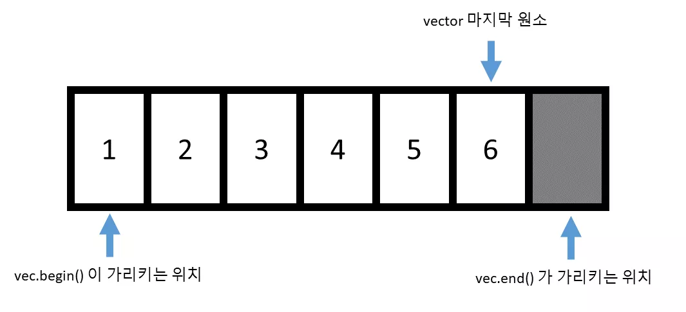

`begin()` 함수는 예상했던 대로, `vector` 의 첫번째 원소를 가리키는 반복자를 리턴합니다. 그런데, 흥미롭게도 `end()` 의 경우 `vector` 의 마지막 원소 한 칸 뒤를 가리키는 반복자를 리턴하게 됩니다. 왜 `end` 의 경우 `vector` 의 마지막 원소를 가리것이 아니라, 마지막 원소의 뒤를 가리키는 반복자를 리턴할까요?

이에 여러가지 이유가 있겠지만, 가장 중요한 점이 이를 통해 빈 벡터를 표현할 수 있다는 점입니다. 만일 `begin() == end()` 라면 원소가 없는 벡터를 의미하겠지요. 만약에 `vec.end()` 가 마지막 원소를 가리킨다면 비어있는 벡터를 표현할 수 없게 됩니다.

```cpp
// 반복자 사용 예시
#include <iostream>
#include <vector>

int main() {
  std::vector<int> vec;
  vec.push_back(10);
  vec.push_back(20);
  vec.push_back(30);
  vec.push_back(40);

  // 전체 벡터를 출력하기
  for (std::vector<int>::iterator itr = vec.begin(); itr != vec.end(); ++itr) {
    std::cout << *itr << std::endl;
  }

  // int arr[4] = {10, 20, 30, 40}
  // *(arr + 2) == arr[2] == 30;
  // *(itr + 2) == vec[2] == 30;

  std::vector<int>::iterator itr = vec.begin() + 2;
  std::cout << "3 번째 원소 :: " << *itr << std::endl;
}
```

```bash
10
20
30
40
3 번째 원소 :: 30
```

```cpp
// 전체 벡터를 출력하기
for (std::vector<int>::iterator itr = vec.begin(); itr != vec.end(); ++itr) {
  std::cout << *itr << std::endl;
}
```

`vector` 의 반복자의 타입은 위 처럼 `std::vector<>::iterator` 멤버 타입으로 정의되어 있고, `vec.begin()` 이나 `vec.end()` 함수가 이를 리턴합니다. `end()` 가 `vector` 의 마지막 원소 바로 뒤를 가리키기 때문에 `for` 문에서 `vector` 전체 원소를 보고 싶다면 `vec.end()` 가 아닐 때 까지 반복하면 됩니다.

앞서 반복자를 마치 포인터 처럼 사용한다고 하였는데, 실제로 현재 반복자가 가리키는 원소의 값을 보고 싶다면;

 C/C++ 확대 축소

```cpp
std::cout << *itr << std::endl;
```

포인터로 `*` 를 해서 가리키는 주소값의 값을 보았던 것처럼, `*` 연산자를 이용해서 `itr` 이 가리키는 원소를 볼 수 있습니다. 물론 `itr` 은 실제 포인터가 아니고 `*` 연산자를 오버로딩해서 마치 포인터 처럼 동작하게 만든 것입니다. `*` 연산자는 `itr` 이 가리키는 원소의 레퍼런스를 리턴합니다.

 C/C++ 확대 축소

```cpp
std::vector<int>::iterator itr = vec.begin() + 2;
std::cout << "3 번째 원소 :: " << *itr << std::endl;
```

또한 반복자 역시 `+` 연산자를 통해서 그 만큼 떨어져 있는 원소를 가리키게 할 수 도 있습니다. (그냥 배열을 가리키는 포인터와 정확히 똑같이 동작한다고 생각하시면 됩니다!)

반복자를 이용하면 아래와 같이 [insert](https://modoocode.com/238) 와 [erase](https://modoocode.com/240) 함수도 사용할 수 있습니다.

 코드 크기 줄이기 C/C++ 확대 축소

```cpp
#include <iostream>
#include <vector>


template <typename T>
void print_vector(std::vector<T>& vec) {
  // 전체 벡터를 출력하기
  for (typename std::vector<T>::iterator itr = vec.begin(); itr != vec.end();
       ++itr) {
    std::cout << *itr << std::endl;
  }
}
int main() {
  std::vector<int> vec;
  vec.push_back(10);
  vec.push_back(20);
  vec.push_back(30);
  vec.push_back(40);

  std::cout << "처음 벡터 상태" << std::endl;
  print_vector(vec);
  std::cout << "----------------------------" << std::endl;

  // vec[2] 앞에 15 추가
  vec.insert(vec.begin() + 2, 15);
  print_vector(vec);

  std::cout << "----------------------------" << std::endl;
  // vec[3] 제거
  vec.erase(vec.begin() + 3);
  print_vector(vec);
}
```

입력 코드 수정 실행

성공적으로 컴파일 하였다면

실행 결과

```
처음 벡터 상태
10
20
30
40
----------------------------
10
20
15
30
40
----------------------------
10
20
15
40
```

와 같이 잘 나옵니다.

참고로 템플릿 버전의 경우,

 C/C++ 확대 축소

```cpp
for (typename std::vector<T>::iterator itr = vec.begin(); itr != vec.end();
     ++itr) {
```

와 같이 앞에 `typename` 을 추가해줘야만 합니다. 그 이유는, `iterator` 가 `std::vector<T>` 의 의존 타입이기 때문입니다. [의존 타입이 무엇인지 기억 안나시는 분은 이 강좌를 참조하시기 바랍니다](https://modoocode.com/222?category=361027)

 C/C++ 확대 축소

```cpp
// vec[2] 앞에 15 추가
vec.insert(vec.begin() + 2, 15);
```

앞서 [insert](https://modoocode.com/238) 함수를 소개하였는데, 위 처럼 인자로 반복자를 받고, 그 반복자 앞에 원소를 추가해줍니다. 위 경우 `vec.begin() + 2` 앞에 `15` 를 추가하므로 `10, 20, 30, 40` 에서 `10, 20, 15, 30, 40` 이 됩니다.

 C/C++ 확대 축소

```cpp
vec.erase(vec.begin() + 3);
print_vector(vec);
```

또 아까전에 언급하였던 [erase](https://modoocode.com/240) 도 인자로 반복자를 받고, 그 반복자가 가리키는 원소를 제거합니다. 위 경우 4 번째 원소인 30 이 지워지겠지요. 물론 [insert](https://modoocode.com/238) 과 [erase](https://modoocode.com/240) 함수 모두 `O(n)` 으로 느린편입니다.

참고로 `vector` 에서 반복자로 [erase](https://modoocode.com/240) 나 [insert](https://modoocode.com/238) 함수를 사용할 때 주의해야할 점이 있습니다.

 코드 크기 줄이기 C/C++ 확대 축소

```cpp
#include <iostream>
#include <vector>

template <typename T>
void print_vector(std::vector<T>& vec) {
  // 전체 벡터를 출력하기
  std::cout << "[ ";
  for (typename std::vector<T>::iterator itr = vec.begin(); itr != vec.end();
       ++itr) {
    std::cout << *itr << " ";
  }
  std::cout << "]";
}
int main() {
  std::vector<int> vec;
  vec.push_back(10);
  vec.push_back(20);
  vec.push_back(30);
  vec.push_back(40);
  vec.push_back(20);

  std::cout << "처음 벡터 상태" << std::endl;
  print_vector(vec);

  std::vector<int>::iterator itr = vec.begin();
  std::vector<int>::iterator end_itr = vec.end();

  for (; itr != end_itr; ++itr) {
    if (*itr == 20) {
      vec.erase(itr);
    }
  }

  std::cout << "값이 20 인 원소를 지운다!" << std::endl;
  print_vector(vec);
}
```

입력 코드 수정 실행

컴파일 후 실행하였다면 아래와 같은 오류가 발생합니다.


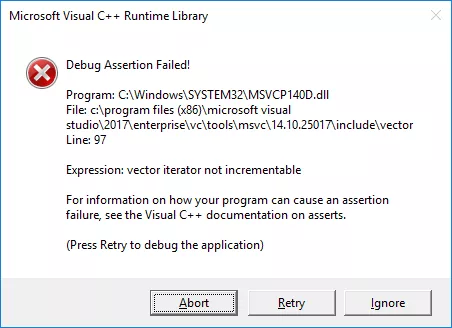


왜 이런 오류가 발생하는 것일까요?

문제는 바로 위 코드에서 발생합니다. 컨테이너에 원소를 추가하거나 제거하게 되면 기존에 사용하였던 모든 반복자들을 사용할 수 없게됩니다. 다시 말해 위 경우 `vec.erase(itr)` 을 수행하게 되면 더이상 `itr` 은 유효한 반복자가 아니게 되는 것이지요. 또한 `end_itr` 역시 무효화 됩니다.

따라서 `itr != end_itr` 이 영원히 성립되며 무한 루프에 빠지게되어 위와 같은 오류가 발생합니다.

그렇다면

와 같이 코드를 고치면 오류가 없어질까요? 실행해보시면 알겠지만 여전히 위와 같은 오류가 발생합니다. 왜냐하면 `itr` 이 유효한 반복자가 아니기 때문에 `vec.end()` 로 올바른 `end` 반복자 값을 매번 가지고 와도 `for` 문이 끝나지 않게 되는 것입니다. 결과적으로 코드를 제대로 고치려면 다음과 같이 해야 합니다.

 C/C++ 확대 축소

```cpp
std::vector<int>::iterator itr = vec.begin();

for (; itr != vec.end(); ++itr) {
  if (*itr == 20) {
    vec.erase(itr);
    itr = vec.begin();
  }
}
```

성공적으로 컴파일 하였다면


와 같이 제대로 값이 20 인 원소만 지워졌음을 알 수 있습니다.

사실 생각해보면 위 바뀐 코드는 꽤나 비효율적임을 알 수 있습니다. 왜냐하면 20 인 원소를 지우고, 다시 처음으로 돌아가서 원소들을 찾고 있기 때문이지요. 그냥 20 인 원소 바로 다음 위치 부터 찾아나가면 될 텐데 말입니다.

 C/C++ 확대 축소

```cpp
for (std::vector<int>::size_type i = 0; i != vec.size(); i++) {
  if (vec[i] == 20) {
    vec.erase(vec.begin() + i);
    i--;
  }
}
```

그렇다면 아예 위 처럼 굳이 반복자를 쓰지 않고 [erase](https://modoocode.com/240) 함수에만 반복자를 바로 만들어서 전달하면 됩니다.

 C/C++ 확대 축소

```cpp
vec.erase(vec.begin() + i);
```

를 하게 되면 `vec[i]` 를 가리키는 반복자를 [erase](https://modoocode.com/240) 에 전달할 수 있습니다. 하지만 사실 위 방법은 그리 권장하는 방법은 아닙니다. 기껏 원소에 접근하는 방식은 반복자를 사용하는 것으로 통일하였는데, 위 방법은 이를 모두 깨버리고 그냥 기존의 배열 처럼 정수형 변수 `i` 로 원소에 접근하는 것이기 때문입니다.

하지만 후에 C++ 알고리즘 라이브러리에 대해 배우면서 이 문제를 깔끔하게 해결 하는 방법에 대해 다루도록 할 것입니다. 일단 임시로는 위 방법 처럼 처리하도록 하세요 :)

`vector` 에서 지원하는 반복자로 `const_iterator` 가 있습니다. 이는 마치 `const` 포인터를 생각하시면 됩니다. 즉, `const_iterator` 의 경우 가리키고 있는 원소의 값을 바꿀 수 없습니다. 예를 들어서

 코드 크기 줄이기 C/C++ 확대 축소

```cpp
#include <iostream>
#include <vector>

template <typename T>
void print_vector(std::vector<T>& vec) {
  // 전체 벡터를 출력하기
  for (typename std::vector<T>::iterator itr = vec.begin(); itr != vec.end();
       ++itr) {
    std::cout << *itr << std::endl;
  }
}
int main() {
  std::vector<int> vec;
  vec.push_back(10);
  vec.push_back(20);
  vec.push_back(30);
  vec.push_back(40);

  std::cout << "초기 vec 상태" << std::endl;
  print_vector(vec);

  // itr 은 vec[2] 를 가리킨다.
  std::vector<int>::iterator itr = vec.begin() + 2;

  // vec[2] 의 값을 50으로 바꾼다.
  *itr = 50;

  std::cout << "---------------" << std::endl;
  print_vector(vec);

  std::vector<int>::const_iterator citr = vec.cbegin() + 2;

  // 상수 반복자가 가리키는 값은 바꿀수 없다. 불가능!
  *citr = 30;
}
```

입력 코드 수정 실행

컴파일 하였다면

컴파일 오류

```
'citr': you cannot assign to a variable that is const
```

와 같이, `const` 반복자가 가리키고 있는 값은 바꿀 수 없다고 오류가 발생합니다. 주의할 점은, `const` 반복자의 경우

 C/C++ 확대 축소

```cpp
std::vector<int>::const_iterator citr = vec.cbegin() + 2;
```

와 같이 `cbegin()` 과 `cend()` 함수를 이용하여 얻을 수 있습니다. 많은 경우 반복자의 값을 바꾸지 않고 참조만 하는 경우가 많으므로, `const iterator` 를 적절히 이용하는 것이 좋습니다.

`vector` 에서 지원하는 반복자 중 마지막 종류로 역반복자 (reverse iterator) 가 있습니다. 이는 반복자와 똑같지만 벡터 뒤에서 부터 앞으로 거꾸로 간다는 특징이 있습니다. 아래 예제를 살펴볼까요.


 코드 크기 줄이기 C/C++ 확대 축소

```cpp
#include <iostream>
#include <vector>

template <typename T>
void print_vector(std::vector<T>& vec) {
  // 전체 벡터를 출력하기
  for (typename std::vector<T>::iterator itr = vec.begin(); itr != vec.end();
       ++itr) {
    std::cout << *itr << std::endl;
  }
}
int main() {
  std::vector<int> vec;
  vec.push_back(10);
  vec.push_back(20);
  vec.push_back(30);
  vec.push_back(40);

  std::cout << "초기 vec 상태" << std::endl;
  print_vector(vec);

  std::cout << "역으로 vec 출력하기!" << std::endl;
  // itr 은 vec[2] 를 가리킨다.
  std::vector<int>::reverse_iterator r_iter = vec.rbegin();
  for (; r_iter != vec.rend(); r_iter++) {
    std::cout << *r_iter << std::endl;
  }
}
```

입력 코드 수정 실행

성공적으로 컴파일 하였다면

실행 결과

```
초기 vec 상태
10
20
30
40
역으로 vec 출력하기!
40
30
20
10
```

와 같이 역으로 벡터의 원소들을 출력할 수 있습니다.

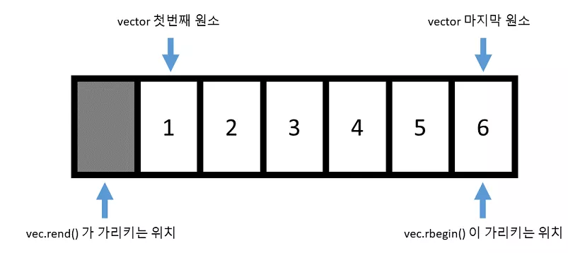


이전에 반복자의 `end()` 가 맨 마지막 원소의 바로 뒤를 가리켰던 것처럼, 역반복자의 `rend()` 역시 맨 앞 원소의 바로 앞을 가리키게 됩니다. 또한 반복자의 경우 값이 증가하면 뒤쪽 원소로 가는 것처럼, 역반복자의 경우 값이 증가하면 앞쪽 원소로 가게 됩니다.

또 반복자가 상수 반복자가 있는 것 처럼 역반복자 역시 상수 역반복자가 있습니다. 그 타입은 `const_reverse_iterator` 타입이고, `crbegin(), crend()` 로 얻을 수 있습니다.

역반복자를 사용하는 것은 매우 중요합니다. 아래와 같은 코드를 살펴볼까요.

 코드 크기 줄이기 C/C++ 확대 축소

```cpp
#include <iostream>
#include <vector>

int main() {
  std::vector<int> vec;
  vec.push_back(1);
  vec.push_back(2);
  vec.push_back(3);

  // 끝에서 부터 출력하기
  for (std::vector<int>::size_type i = vec.size() - 1; i >= 0; i--) {
    std::cout << vec[i] << std::endl;
  }

  return 0;
}
```

입력 코드 수정 실행

성공적으로 컴파일 하였다면

실행 결과

```
3
2
1
// ... (생략) ...
0
0
0
1
0
593
0
0
[1]    22180 segmentation fault (core dumped)  ./test
```

와 같이 오류가 발생하게 됩니다. 맨 뒤의 원소 부터 제대로 출력하는 코드 같은데 왜 이런 문제가 발생하였을까요? 그 이유는 `vector` 의 `index` 를 담당하는 타입이 **부호 없는 정수** 이기 때문입니다. 따라서 `i` 가 0 일 때 `i --` 를 하게 된다면 -1 이 되는 것이 아니라, 해당 타입에서 가장 큰 정수가 되버리게 됩니다.

따라서 `for` 문이 영원히 종료할 수 없게 되죠.

이 문제를 해결하기 위해서는 부호 있는 정수로 선언해야 하는데, 이 경우 `vector` 의 `index` 타입과 일치하지 않아서 타입 캐스팅을 해야 한다는 문제가 발생하게 됩니다.

따라서 가장 현명한 선택으로는 역으로 원소를 참조하고 싶다면, 역반복자를 사용하는 것입니다.

### 범위 기반 for 문 (range based for loop)

위와 같이 컨테이너의 원소를 `for` 문 으로 접근하는 패턴은 매우 많이 등장하는데, `C++ 11` 에서 부터는 이와 같은 패턴을 매우 간단하게 나타낼 수 있는 방식을 제공하고 있습니다. 바로 **범위 기반(range-based) for 문** 이라 불리는 것입니다.

 코드 크기 줄이기 C/C++ 확대 축소

```cpp
#include <iostream>
#include <vector>

int main() {
  std::vector<int> vec;
  vec.push_back(1);
  vec.push_back(2);
  vec.push_back(3);

  // range-based for 문
  for (int elem : vec) {
    std::cout << "원소 : " << elem << std::endl;
  }

  return 0;
}
```

입력 코드 수정 실행

성공적으로 컴파일 하였다면

실행 결과

```
원소 : 1
원소 : 2
원소 : 3
```

와 같이 나옵니다. 범위 기반 `for` 문의 경우 아래와 같은 형태로 써주시면 됩니다.

위 경우

 C/C++ 확대 축소

```cpp
for (int elem : vec) {
  std::cout << "원소 : " << elem << std::endl;
}
```

의 형태로 썼을 경우, `elem` 에 `vec` 의 원소들이 매 루프 마다 복사되서 들어가게 됩니다. 마치

 C/C++ 확대 축소

```cpp
elem = vec[i];
```

를 한 것과 말이지요. 만약에 복사 하기 보다는 레퍼런스를 받고 싶다면 어떨까요? 매우 간단합니다. 단순히 레퍼런스 타입으로 바꿔버리면 되죠. 예를 들어서 기존의 `print_vec` 함수를 범위 기반 for 문을 사용해서 어떻게 바꿀 수 있는지 살펴봅시다.


 코드 크기 줄이기 C/C++ 확대 축소

```cpp
#include <iostream>
#include <vector>

template <typename T>
void print_vector(std::vector<T>& vec) {
  // 전체 벡터를 출력하기
  for (typename std::vector<T>::iterator itr = vec.begin(); itr != vec.end();
       ++itr) {
    std::cout << *itr << std::endl;
  }
}

template <typename T>
void print_vector_range_based(std::vector<T>& vec) {
  // 전체 벡터를 출력하기
  for (const auto& elem : vec) {
    std::cout << elem << std::endl;
  }
}

int main() {
  std::vector<int> vec;
  vec.push_back(1);
  vec.push_back(2);
  vec.push_back(3);
  vec.push_back(4);

  std::cout << "print_vector" << std::endl;
  print_vector(vec);
  std::cout << "print_vector_range_based" << std::endl;
  print_vector_range_based(vec);

  return 0;
}
```

입력 코드 수정 실행

실행 결과

```
print_vector
1
2
3
4
print_vector_range_based
1
2
3
4
```

와 같이 동일하게 나타남을 알 수 있습니다.

 C/C++ 확대 축소

```cpp
for (const auto& elem : vec) {
  std::cout << elem << std::endl;
}
```

위와 같이 `const auto&` 로 `elem` 을 선언하였으므로, `elem` 은 `vec` 의 원소들을 상수 레퍼런스로 접근하게 됩니다.

이와 같이 범위 기반 for 문을 활용한다면 코드를 직관적으로 나타낼 수 있어서 매우 편리합니다.

참고로 앞서 설명한 함수들 말고도 `vector` 에는 수 많은 함수들이 있고, 또 오버로드 되는 여러가지 버전들이 있습니다.

예를 들어 [insert](https://modoocode.com/238) 함수만 해도 5 개의 오버로드 되는 버전들이 있습니다 (물론 하는 역할은 똑같지만 편의를 위해 여러가지 방식으로 사용할 수 있게 만들어 놓은것입니다). 이 모든 것들을 강좌에서 소개하는 것은 시간 낭비이고, [C++ 레퍼런스를 보면 잘 정리](http://en.cppreference.com/w/cpp/container/std::vector)되어 있으니 이를 참조하시기 바랍니다.

## 리스트 (list)

리스트(`list`) 의 경우 양방향 연결 구조를 가진 자료형이라 볼 수 있습니다.

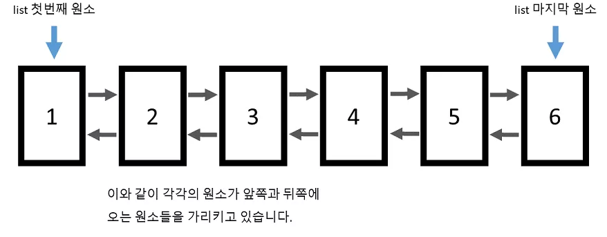


따라서 `vector` 와는 달리 임의의 위치에 있는 원소에 접근을 바로 할 수 없습니다. `list` 컨테이너 자체에서는 시작 원소와 마지막 원소의 위치만을 기억하기 때문에, 임의의 위치에 있는 원소에 접근하기 위해서는 하나씩 링크를 따라가야 합니다.

그래서 리스트에는 아예 `[]` 나 `at` 함수가 아예 정의되어 있지 않습니다.

물론 리스트의 장점이 없는 것은 아닙니다. `vector` 의 경우 맨 뒤를 제외하고는 임의의 위치에 원소를 추가하거나 제거하는 작업이 O(n)*O*(*n*) 이였지만 리스트의 경우 O(1)*O*(1) 으로 매우 빠르게 수행될 수 있습니다. 왜냐하면 원하는 위치 앞과 뒤에 있는 링크값만 바꿔주면 되기 때문입니다.

 C/C++ 확대 축소

```cpp
#include <iostream>
#include <list>

int main() {
  std::list<int> lst;

  lst.push_back(10);
  lst.push_back(20);
  lst.push_back(30);
  lst.push_back(40);

  for (std::list<int>::iterator itr = lst.begin(); itr != lst.end(); ++itr) {
    std::cout << *itr << std::endl;
  }
}
```

입력 코드 수정 실행

성공적으로 컴파일 하였다면

실행 결과

```
10
20
30
40
```

와 같이 잘 나옵니다.

한 가지 재미있는점은 리스트의 반복자의 경우 다음과 같은 연산밖에 수행할 수 없습니다.

 C/C++ 확대 축소

```cpp
  itr++    // itr ++
  itr--  // --itr 도 됩니다.
```

다시말해

와 같이 임의의 위치에 있는 원소를 가리킬 수 없다는 것입니다. 반복자는 오직 한 칸 씩 밖에 움직일 수 없습니다.

이와 같은 이유는 `list` 의 구조를 생각해보면 알 수 있습니다. 앞서 말했듯이 리스트는 왼쪽 혹은 오른쪽을 가리키고 있는 원소들의 모임으로 이루어져 있기 때문에, 한 번에 한 칸 씩 밖에 이동할 수 없습니다. 즉, 메모리 상에서 원소들이 연속적으로 존재하지 않을 수 있다는 뜻입니다. 반면에 벡터의 경우 메모리 상에서 연속적으로 존재하기 때문에 쉽게 임의의 위치에 있는 원소를 참조할 수 있습니다.

이렇게 리스트 에서 정의되는 반복자의 타입을 보면 `BidirectionalIterator` 타입임을 알 수 있습니다. 이름에서도 알 수 있듯이 양방향으로 이동할 수 있되, 한 칸 씩 밖에 이동할 수 없습니다. 반면에 벡터에서 정의되는 반복자의 타입은 `RandomAccessIterator` 타입 입니다.

즉, 임의의 위치에 접근할 수 있는 반복자 입니다 (참고로 `RandomAccessIterator` 는 `BidirectionalIterator` 를 상속받고 있습니다)

 코드 크기 줄이기 C/C++ 확대 축소

```cpp
#include <iostream>
#include <list>

template <typename T>
void print_list(std::list<T>& lst) {
  std::cout << "[ ";
  // 전체 리스트를 출력하기 (이 역시 범위 기반 for 문을 쓸 수 있습니다)
  for (const auto& elem : lst) {
    std::cout << elem << " ";
  }
  std::cout << "]" << std::endl;
}
int main() {
  std::list<int> lst;

  lst.push_back(10);
  lst.push_back(20);
  lst.push_back(30);
  lst.push_back(40);

  std::cout << "처음 리스트의 상태 " << std::endl;
  print_list(lst);

  for (std::list<int>::iterator itr = lst.begin(); itr != lst.end(); ++itr) {
    // 만일 현재 원소가 20 이라면
    // 그 앞에 50 을 집어넣는다.
    if (*itr == 20) {
      lst.insert(itr, 50);
    }
  }

  std::cout << "값이 20 인 원소 앞에 50 을 추가 " << std::endl;
  print_list(lst);

  for (std::list<int>::iterator itr = lst.begin(); itr != lst.end(); ++itr) {
    // 값이 30 인 원소를 삭제한다.
    if (*itr == 30) {
      lst.erase(itr);
      break;
    }
  }

  std::cout << "값이 30 인 원소를 제거한다" << std::endl;
  print_list(lst);
}
```

입력 코드 수정 실행

성공적으로 컴파일 하면

실행 결과

```
처음 리스트의 상태 
[ 10 20 30 40 ]
값이 20 인 원소 앞에 50 을 추가 
[ 10 50 20 30 40 ]
값이 30 인 원소를 제거한다
[ 10 50 20 40 ]
```

와 같이 잘 나옵니다.

 C/C++ 확대 축소

```cpp
for (std::list<int>::iterator itr = lst.begin(); itr != lst.end(); ++itr) {
  // 만일 현재 원소가 20 이라면
  // 그 앞에 50 을 집어넣는다.
  if (*itr == 20) {
    lst.insert(itr, 50);
  }
}
```

앞서 설명하였지만 리스트의 반복자는 `BidirectionalIterator` 이기 때문에 `++` 과 `--` 연산만 사용 가능합니다. 따라서 위 처럼 `for` 문으로 하나 하나 원소를 확인해보는것은 가능하지요. `vector` 와는 다르게 [insert](https://modoocode.com/238) 작업은 `O(1)` 으로 매우 빠르게 실행됩니다.

 C/C++ 확대 축소

```cpp
for (std::list<int>::iterator itr = lst.begin(); itr != lst.end(); ++itr) {
  // 값이 30 인 원소를 삭제한다.
  if (*itr == 30) {
    lst.erase(itr);
    break;
  }
}
```

마찬가지로 [erase](https://modoocode.com/240) 함수를 이용하여 원하는 위치에 있는 원소를 지울 수 도 있습니다. 리스트의 경우는 벡터와는 다르게, **원소를 지워도 반복자가 무효화 되지 않습니다**. 왜냐하면, 각 원소들의 주소값들은 바뀌지 않기 때문이죠!

## 덱 (deque - double ended queue)

마지막으로 살펴볼 컨테이너는 덱(`deque`) 이라고 불리는 자료형 입니다. 덱은 벡터와 비슷하게 O(1)*O*(1) 으로 임의의 위치의 원소에 접근할 수 있으며 맨 뒤에 원소를 추가/제거 하는 작업도 O(1)*O*(1) 으로 수행할 수 있습니다. 뿐만아니라 벡터와는 다르게 맨 앞에 원소를 추가/제거 하는 작업 까지도 O(1)*O*(1) 으로 수행 가능합니다.

임의의 위치에 있는 원소를 제거/추가 하는 작업은 벡터와 마찬가지로 O(n)*O*(*n*) 으로 수행 가능합니다. 뿐만 아니라 그 속도도 벡터 보다 더 빠릅니다 (이 부분은 아래 덱이 어떻게 구현되어 있는지 설명하면서 살펴보겠습니다.)

그렇다면 덱이 벡터에 비해 모든 면에서 비교 우위에 있는 걸까요? 안타깝게도 벡터와는 다르게 덱의 경우 원소들이 실제로 메모리 상에서 연속적으로 존재하지는 않습니다. 이 때문에 원소들이 어디에 저장되어 있는지에 대한 정보를 보관하기 위해 추가적인 메모리가 더 필요로 합니다. (실제 예로, 64 비트 `libc++` 라이브러리의 경우 1 개의 원소를 보관하는 덱은 그 원소 크기에 비해 8 배나 더 많은 메모리를 필요로 합니다).

즉 덱은 실행 속도를 위해 메모리를 (많이) 희생하는 컨테이너라 보면 됩니다.

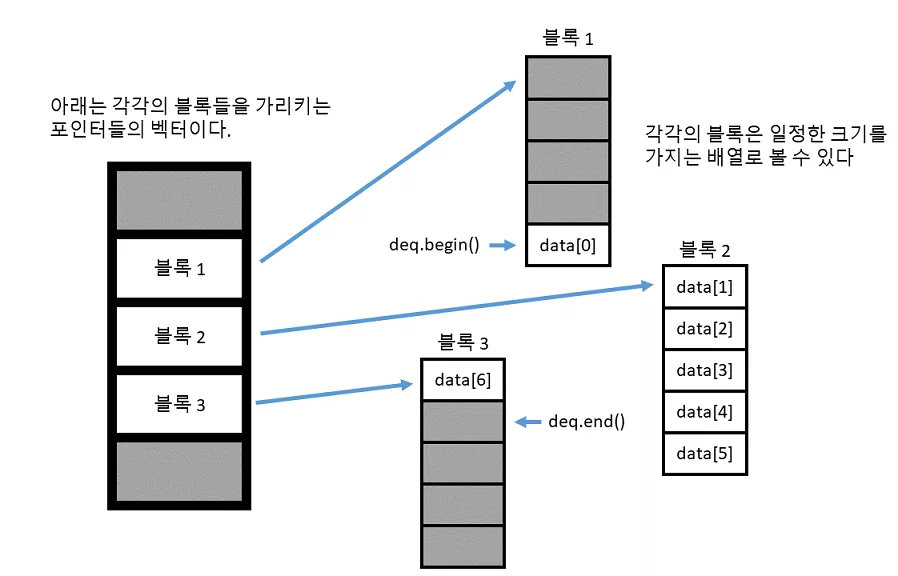


위 그림은 덱이 어떠한 구조를 가지는지 보여줍니다. 일단, 벡터와는 다르게 원소들이 메모리에 연속되어 존재하는 것이 아니라 일정 크기로 잘려서 각각의 블록 속에 존재합니다. 따라서 이 블록들이 메모리 상에 어느 곳에 위치하여 있는지 저장하기 위해서 각각의 블록들의 주소를 저장하는 벡터가 필요로 합니다.

참고로 이 벡터는 기존의 벡터와는 조금 다르게, 새로 할당 시에 앞쪽 및 뒤쪽 모두에 공간을 남겨놓게 됩니다. (벡터의 경우 뒤쪽에만 공간이 남았지요) 따라서 이를 통해 맨 앞과 맨 뒤에 `O(1)` 의 속도로 [insert](https://modoocode.com/238) 및 [erase](https://modoocode.com/240) 를 수행할 수 있는 것입니다. 그렇다면 왜 덱이 벡터 보다 원소를 삽입하는 작업이 더 빠른 것일까요?


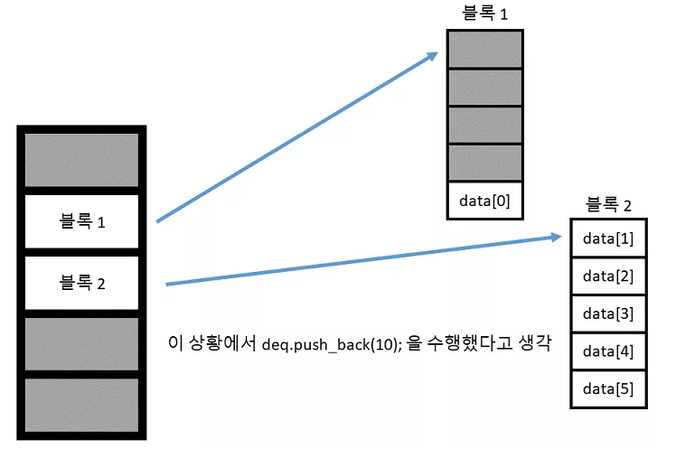


위와 같은 상황에서 `deq.push_back(10)` 을 수행하였다고 생각해봅시다.


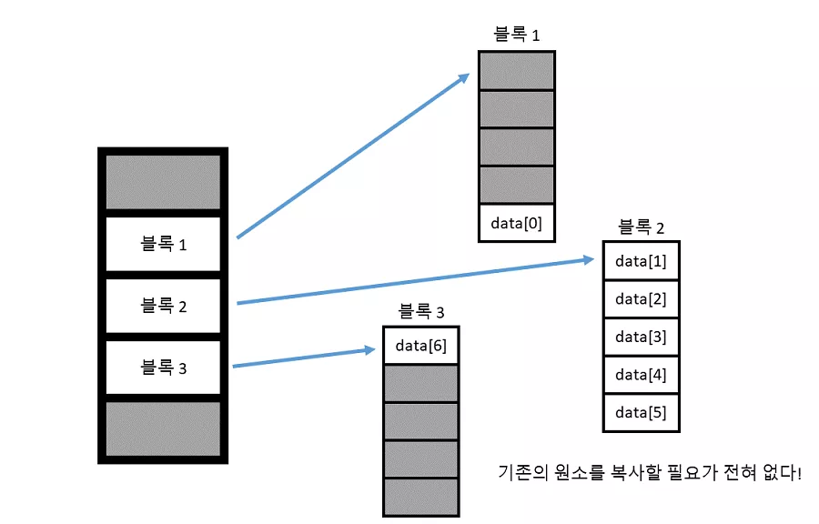


그렇다면 단순히 새로운 블록을 만들어서 뒤에 추가되는 원소를 넣어주면 됩니다. 즉 기존의 원소들을 복사할 필요가 전혀 없다는 의미 입니다. 반면에 벡터의 경우


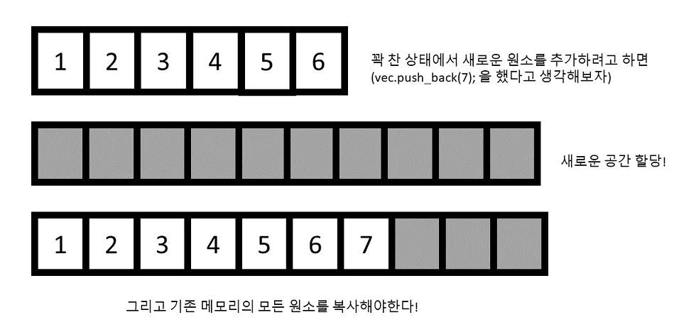


위 그림에서도 잘 알 수 있듯이, 만약에 기존에 할당한 메모리가 꽉 차면 모든 원소들을 새로운 공간에 복사해야 합니다. 따라서 평균적으로 덱이 벡터보다 더 빠르게 작동합니다. (물론 덱의 경우 블록 주소를 보관하는 벡터가 꽉 차게 되면 새로운 공간에 모두 복사해야 합니다.

하지만 블록 주소의 개수는 전체 원소 개수 보다 적고 ( 위 경우 N / 5 가 되겠네요. 왜냐하면 각 블록에 원소가 5개 씩 있으므로), 대체로 벡터에 저장되는객체들의 크기가 주소값의 크기보다 크기 때문에 복사 속도가 훨씬 빠릅니다.)

 코드 크기 줄이기 C/C++ 확대 축소

```cpp
#include <deque>
#include <iostream>

template <typename T>
void print_deque(std::deque<T>& dq) {
  // 전체 덱을 출력하기
  std::cout << "[ ";
  for (const auto& elem : dq) {
    std::cout << elem << " ";
  }
  std::cout << " ] " << std::endl;
}
int main() {
  std::deque<int> dq;
  dq.push_back(10);
  dq.push_back(20);
  dq.push_front(30);
  dq.push_front(40);

  std::cout << "초기 dq 상태" << std::endl;
  print_deque(dq);

  std::cout << "맨 앞의 원소 제거" << std::endl;
  dq.pop_front();
  print_deque(dq);
}
```

입력 코드 수정 실행

성공적으로 컴파일 하였다면

실행 결과

```
초기 dq 상태
[ 40 30 10 20  ] 
맨 앞의 원소 제거
[ 30 10 20  ]
```

와 같이 잘 수행됩니다.


 C/C++ 확대 축소

```cpp
dq.push_back(10);
dq.push_back(20);
dq.push_front(30);
dq.push_front(40);
```

위와 같이 [push_back](https://modoocode.com/185) 과 `push_front` 를 이용해서 맨 앞과 뒤에 원소들을 추가하였고,

 C/C++ 확대 축소

```cpp
dq.pop_front();
```

`pop_front` 함수를 이용해서 맨 앞의 원소를 제거할 수 있습니다.

앞서 말했듯이 덱 역시 벡터 처럼 임의의 위치에 원소에 접근할 수 있으므로 `[]` 와 `at` 함수를 제공하고 있고, 반복자 역시 `RandomAccessIterator` 타입 이고 벡터랑 정확히 동일한 방식으로 작동합니다.

## 그래서 어떤 컨테이너를 사용해야돼?

어떠한 컨테이너를 사용할지는 전적으로 이 컨테이너를 가지고 어떠한 작업들을 많이 하냐에 달려있습니다.

- 일반적인 상황에서는 그냥 벡터를 사용한다 (거의 만능이다!)
- 만약에 맨 끝이 아닌 중간에 원소들을 추가하거나 제거하는 일을 많이 하고, 원소들을 순차적으로만 접근 한다면 리스트를 사용한다.
- 만약에 맨 처음과 끝 모두에 원소들을 추가하는 작업을 많이하면 덱을 사용한다.

참고적으로 O(1)*O*(1) 으로 작동한다는 것은 언제나 이론적인 결과일 뿐이며 실제로 프로그램을 짜게 된다면, O(\log n)*O*(log*n*) 이나 O(n)*O*(*n*) 보다도 느릴 수 있습니다. (n*n* 의 크기에 따라서) 따라서 속도가 중요한 환경이라면 적절한 벤치마크를 통해서 성능을 가늠해 보는것도 좋습니다.

자 이번 강좌는 이것으로 마치도록 하겠습니다. 다음 강좌에서는 다른 종류의 컨테이너인 연관 컨테이너에 대해서 배웁니다.

# **연관컨테이너**

> 이번 강좌에서는
>
> - `set`, `map`, `multiset`, `multimap`
> - `unordered_set`, `unordered_map`
> - 커스텀 클래스 객체를 `set/map` 혹은 `unordered_set/map` 에 추가하기
>
> 에 대해 다룹니다.
>
> 안녕하세요 여러분! 지난 강좌에서 시퀀스 컨테이너들 (`vector`, `list`, `deque`) 에 대해서 다루어보았습니다. 시퀀스 컨테이너들은 말 그대로 '원소' 자체를 보관하는 컨테이너들 입니다.
>
> 이번 강좌에서는 다른 종류의 컨테이너인 **연관 컨테이너(associative container)** 에 대해서 다루어볼 것입니다. 연관 컨테이너는 시퀀스 컨테이너와는 다르게 키(key) - 값(value) 구조를 가집니다. 다시 말해 특정한 키를 넣으면 이에 대응되는 값을 돌려준다는 것이지요. 물론 템플릿 라이브러리 이기 때문이 키와 값 모두 임의의 타입의 객체가 될 수 있습니다.
>
> 예를 들어서 어떤 웹사이트에서 회원 관리를 한다고 생각해봅시다. 사용자의 로그인을 처리하기 위해서는 아이디를 키로 가지고, 비밀번호를 값으로 가지는 데이터 구조가 필요할 것입니다. 왜냐하면 사용자가 로그인을 할 때 올바르게 입력하였는지 확인하기 위해선, 입력한 아이디에 대응되어 있던 비밀번호를 가지고, 실제 사용자가 입력한 비밀번호와 비교를 해야 되기 때문이지요.
>
> 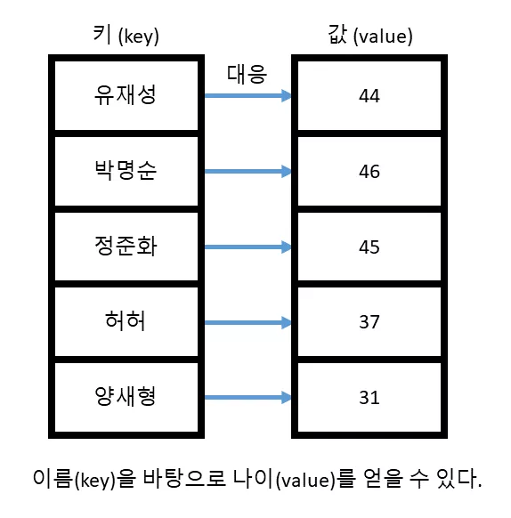
>
> 위 처럼 연관 컨테이너는 키를 바탕으로 이에 대응되는 값을 얻을 수 있는 구조 입니다.
>
> 우리는 위와 같이 주어진 자료에서 보통 두 가지 종류의 질문을 할 수 있습니다.
>
> - 박명순이 데이터에 존재하나요? (특정 키가 연관 컨테이너에 존재하는지 유무) → True
> - 만약 존재한다면 이에 대응되는 값이 무엇인가요? (특정 키에 대응되는 값이 무엇인지 질의) → 46
>
> C++ 에서는 위 두 가지 작업을 처리할 수 있 C++ 에서는 위 두 가지 작업을 처리할 수 있는 연관 컨테이너라는 것을 제공합니다. 전자의 경우 **셋(set)** 과 **멀티셋(multiset)** 이고, 후자의 경우 **맵(map)** 과 **멀티맵(multimap)** 입니다. 물론 맵과 멀티맵을 셋 처럼 사용할 수 있습니다. 왜냐하면 해당하는 키가 맵에 존재하지 않으면 당연히 대응되는 값을 가져올 수 없기 때문이지요.
>
> 하지만 맵의 경우 셋 보다 사용하는 메모리가 크기 때문에 키의 존재 유무 만 궁금하다면 셋을 사용하는 것이 좋습니다. 그렇다면 셋 부터 어떻게 사용하는지 살펴보겠습니다.

## 셋(set)

 코드 크기 줄이기 C/C++ 확대 축소

```cpp
#include <iostream>
#include <set>

template <typename T>
void print_set(std::set<T>& s) {
  // 셋의 모든 원소들을 출력하기
  std::cout << "[ ";
  for (typename std::set<T>::iterator itr = s.begin(); itr != s.end(); ++itr) {
    std::cout << *itr << " ";
  }
  std::cout << " ] " << std::endl;
}
int main() {
  std::set<int> s;
  s.insert(10);
  s.insert(50);
  s.insert(20);
  s.insert(40);
  s.insert(30);

  std::cout << "순서대로 정렬되서 나온다" << std::endl;
  print_set(s);

  std::cout << "20 이 s 의 원소인가요? :: ";
  auto itr = s.find(20);
  if (itr != s.end()) {
    std::cout << "Yes" << std::endl;
  } else {
    std::cout << "No" << std::endl;
  }

  std::cout << "25 가 s 의 원소인가요? :: ";
  itr = s.find(25);
  if (itr != s.end()) {
    std::cout << "Yes" << std::endl;
  } else {
    std::cout << "No" << std::endl;
  }
}
```

입력 코드 수정 실행

성공적으로 컴파일 하였다면

실행 결과

```
순서대로 정렬되서 나온다
[ 10 20 30 40 50  ] 
20 이 s 의 원소인가요? :: Yes
25 가 s 의 원소인가요? :: No
```

와 같이 나옵니다.

 C/C++ 확대 축소

```cpp
s.insert(10);
s.insert(50);
s.insert(20);
s.insert(40);
s.insert(30);
```

셋에 원소를 추가하기 위해서는 시퀀스 컨테이너 처럼 [insert](https://modoocode.com/238) 함수를 사용하면 됩니다. 한 가지 다른점은, 시퀀스 컨테이너 처럼 '어디에' 추가할지에 대한 정보가 없다는 점입니다. 시퀀스 컨테이너가 상자 하나에 원소를 한 개 씩 담고, 각 상자에 번호를 매긴 것이라면, 셋은 그냥 큰 상자 안에 모든 원소들을 쑤셔 넣은 것이라 보면 됩니다. 그 상자 안에 원소가 어디에 있는지는 중요한게 아니고,그 상자 안에 원소가 '있냐/없냐' 만이 중요한 정보입니다.

셋에 원소를 추가하거나 지우는 작업은 O(log N)*O*(*l**o**g**N*) 에 처리됩니다. 시퀀스 컨테이너의 경우 임의의 원소를 지우는 작업이 O(N)*O*(*N*) 으로 수행되었다는 점을 생각하면 훨씬 빠르다고 볼 수 있습니다.

 C/C++ 확대 축소

```cpp
template <typename T>
void print_set(std::set<T>& s) {
  // 셋의 모든 원소들을 출력하기
  std::cout << "[ ";
  for (typename std::set<int>::iterator itr = s.begin(); itr != s.end();
       ++itr) {
    std::cout << *itr << " ";
  }
  std::cout << " ] " << std::endl;
}
```

셋 역시 셋에 저장되어 있는 원소들에 접근하기 위해 반복자를 제공하며, 이 반복자는 `BidirectionalIterator` 입니다. 즉, 시퀀스 컨테이너의 리스트 처럼 임의의 위치에 있는 원소에 접근하는 것은 불가능 하고 순차적으로 하나 씩 접근하는 것 밖에 불가능 합니다.

한 가지 흥미로운 점은 우리 셋에 원소를 넣었을 때 `10 -> 50 -> 20 -> 40 -> 30` 으로 넣었지만 실제로 반복자로 원소들을 모두 출력했을 때 나온 순서는 `10 -> 20 -> 30 -> 40 -> 50` 순으로 나왔다는 점입니다.다시 말해 셋의 경우 내부에 원소를 추가할 때 정렬된 상태를 유지하며 추가합니다.

앞서 셋을 큰 상자라 생각하고 그 안에 원소들을 쑤셔 넣은 것이라 했는데, 실제로 마구 쑤셔넣지는 않고 순서를 지키면서 쑤셔 넣습니다. 이 때문에 시퀀스 컨테이너와는 다르게 원소를 추가하는 작업이 O(log N)*O*(*l**o**g**N*) 으로 진행됩니다.

또한 셋의 진가는 앞서 말했듯이 원소가 있냐 없냐를 확인할 때 드러납니다.

 C/C++ 확대 축소

```cpp
std::cout << "20 이 s 의 원소인가요? :: ";
auto itr = s.find(20);
if (itr != s.end()) {
  std::cout << "Yes" << std::endl;
} else {
  std::cout << "No" << std::endl;
}
```

셋에는 [find](https://modoocode.com/241) 함수가 제공되며, 이 [find](https://modoocode.com/241) 함수를 통해 이 셋에 원소가 존재하는지 아닌지 확인할 수 있습니다. 만일 해당하는 원소가 존재한다면 이를 가리키는 반복자를 리턴하고 (`std::set<>::iterator` 타입입니다) 만일 존재하지 않는다면 `s.end()` 를 리턴하게 되지요.

만일 벡터였다면 원소가 존재하는지 아닌지 확인하기 위해 벡터의 처음 부터 끝 까지 하나씩 비교해가면서 찾았어야 했겠죠. 만일 원소가 없었더라면 벡터에 있는 모든 원소를 확인하였을 것입니다 (즉 벡터에서 [find](https://modoocode.com/241) 는 O(N)*O*(*N*) 이라 볼 수 있습니다).

하지만셋의 경우 놀랍게도 O(log N)*O*(*l**o**g**N*) 으로 원소가 존재하는지 확인할 수 있습니다. 이것이 가능한 이유는 셋 내부적으로 원소들이 정렬된 상태를 유지하기 때문에 비교적 빠르게 원소의 존재 여무를 확인할 수 있습니다.

따서 20 을 찾았을 때 `Yes` 가 나오고 셋에 없는 원소인 25 를 찾는다면 `No` 가 출력됩니다.

셋이 이러한 방식으로 작업을 수행할 수 있는 이유는 바로 내부적으로 트리 구조로 구성되어 있기 때문입니다.


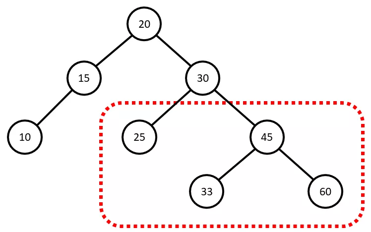


위 그림은 흔히 볼 수 있는 트리 구조를 나타냅니다. 각각의 원소들은 트리의 각 노드들에 저장되어 있고, 다음과 같은 규칙을 지키고 있습니다.

- 왼쪽에 오는 모든 노드들은 나보다 작다
- 오른쪽에 있는 모든 노드들은 나보다 크다

예를 들어 오른쪽의 30 을 살펴볼까요 (위 그림에서 점선으로 표시한 부분). 30 왼쪽에 오는 노드는 25 로 30 보다 작고, 오른쪽에 오는 노드들은 33, 45, 60 으로 모두 30 보다 큽니다. 어떤 노드들을 살펴보아도 이러한 규칙을 지키고 있음을 알 수 있습니다.

그렇다면 위 구조에서 25 를 찾으려면 어떻게 할까요?

1. 일단 최상위 노드 (루트 노드라 합니다) 와 비교 : 25 > 20 → 오른쪽 노드로 간다
2. 30 과 비교 : 25 < 30 → 왼쪽 노드로 간 30 과 비교 : 25 < 30 → 왼쪽 노드로 간다
3. 25 와 비교 : 25 == 25 → 당첨 25 와 비교 : 25 == 25 → 당첨!

전체 원소 개수는 8개 이지만, 단 3번의 비교로 원소를 정확히 찾을 수 있습니다.

그렇다면 12 를 찾으려면 어떻게 할까요? 참고로 12 는 위 셋에 들어있지 않은 원소 입니다.

1. 루트 노드와 비교 : 12 < 20 → 왼쪽 노드로 간다
2. 15 와 비교 : 12 < 15 → 왼쪽 노드로 간 15 와 비교 : 12 < 15 → 왼쪽 노드로 간다
3. 10 과 비교 : 12 > 10 → 오른쪽 노드로 가야하지만 오른쪽에 아무것도 없다. 따라서 이 원소는 존재하지 않는다 10 과 비교 : 12 > 10 → 오른쪽 노드로 가야하지만 오른쪽에 아무것도 없다. 따라서 이 원소는 존재하지 않는다.

만일 벡터 였다면 원소들을 처음 부터 끝까지 확인해봐야 했지만 셋의 경우 단 3번의 비교만으로 12 가 셋에 존재하는지 아닌지 여부를 판단할 수 있었습니다.


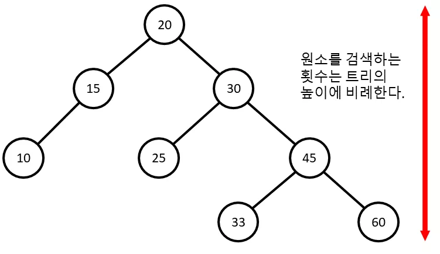


아마 깨달으신 분들도 있겠지만, 원소를 검색하는데 필요한 횟수는 트리의 높이와 정확히 일치합니다. 즉, 15 는 단 2번의 비교로 찾아낼 수 있고, 맨 밑에 있는 60 이나 33 의 경우 총 4번의 비교가 필요하겠지요. 따라서, 트리의 경우 최대한 모든 노드들을 꽉 채우는 것이 중요합니다. 예를 들어서


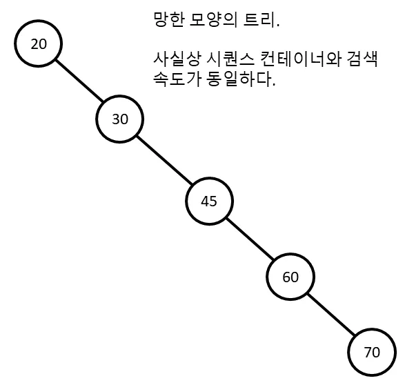


어쩌다 보니 트리가 위 처럼 되버렸다면 사실상 시퀀스 컨테이너와 검색 속도가 동일할 것입니다. 위와 같이 한쪽으로 아예 치우쳐버린 트리를 군형잡히지 않은 트리 (unbalanced tree) 라고 부릅니다. 실제 셋의 구현을 보면 위와 같은 상황이 발생하지 않도록 앞서 말한 두 개의 단순한 규칙 보다 더 많은 규칙들을 도입해서 트리를 항상 균형 잡히도록 유지하고 있습니다.

따라서 셋의 구현 상O(log N)*O*(*l**o**g**N*) 으로 원소를 검색할 수 있다는 것이 보장됩니다. (궁금하신 분들만! [대부분의 셋 구현에서 사용하고 있는 트리 구조는 여기서 볼 수 있습니다](https://en.wikipedia.org/wiki/Red–black_tree))

또한 셋의 중요한 특징으로 바로 셋 안에는 중복된 원소들이 없다는 점이 있습니다.

 코드 크기 줄이기 C/C++ 확대 축소

```cpp
#include <iostream>
#include <set>

template <typename T>
void print_set(std::set<T>& s) {
  // 셋의 모든 원소들을 출력하기
  std::cout << "[ ";
  for (const auto& elem : s) {
    std::cout << elem << " ";
  }
  std::cout << " ] " << std::endl;
}

int main() {
  std::set<int> s;
  s.insert(10);
  s.insert(20);
  s.insert(30);
  s.insert(20);
  s.insert(10);

  print_set(s);
}
```

입력 코드 수정 실행

성공적으로 컴파일 하였다면

실행 결과

```
[ 10 20 30  ] 
```

와 같이 나옵니다. 분명히

 C/C++ 확대 축소

```cpp
s.insert(10);
s.insert(20);
s.insert(30);
s.insert(20);
s.insert(10);
```

위와 같이 10 과 20 을 두 번씩 넣었지만 실제로는 한 번씩 밖에 나오지 않습니다. 이는 셋 자체적으로 이미 같은 원소가 있다면 이를 [insert](https://modoocode.com/238) 하지 않기 때문입니다. 따라서 마지막 두 [insert](https://modoocode.com/238) 작업은 무시되었을 것입니다.

참고로 시퀀스 컨테이너들과 마찬가지로 `set` 역시 범위 기반 for 문을 지원합니다. 원소들의 접근 순서는 반복자를 이용해서 접근하였을 때와 동일합니다.

만약에 중복된 원소를 허락하고 싶다면 멀티셋(multiset) 을 사용하면 되는데, 이는 후술 하겠습니다.


### 여러분이 만든 클래스 객체를 셋에 넣고 싶을 때

위와 같이 기본 타입들 말고, 여러분이 만든 클래스의 객체를 셋의 원소로 사용할 때 한 가지 주의해야 할 점이 있습니다. 아래는 할 일 (Todo) 목록을 저장하기 위해 셋을 사용하는 예시 입니다. `Todo` 클래스는 2 개를 멤버 변수로 가지는데 하나는 할 일의 중요도이고, 하나는 해야할 일의 설명 입니다.

 코드 크기 줄이기 C/C++ 확대 축소

```cpp
#include <iostream>
#include <set>
#include <string>

template <typename T>
void print_set(std::set<T>& s) {
  // 셋의 모든 원소들을 출력하기
  std::cout << "[ ";
  for (const auto& elem : s) {
    std::cout << elem << " " << std::endl;
  }
  std::cout << " ] " << std::endl;
}
class Todo {
  int priority;  // 중요도. 높을 수록 급한것!
  std::string job_desc;

 public:
  Todo(int priority, std::string job_desc)
      : priority(priority), job_desc(job_desc) {}
};
int main() {
  std::set<Todo> todos;

  todos.insert(Todo(1, "농구 하기"));
  todos.insert(Todo(2, "수학 숙제 하기"));
  todos.insert(Todo(1, "프로그래밍 프로젝트"));
  todos.insert(Todo(3, "친구 만나기"));
  todos.insert(Todo(2, "영화 보기"));
}
```

입력 코드 수정 실행

그런데 컴파일 하였다면 아래와 같은 오류가 발생합니다.

컴파일 오류

```
binary '<': no operator found which takes a left-hand operand of type 'const Todo' (or there is no acceptable conversion)
```

왜 발생하였을까요? 생각을 해봅시다. 앞서 셋은 원소들을 저장할 때 내부적으로 정렬된 상태를 유지한다고 하였습니다. 즉 정렬을 하기 위해서는 반드시 원소 간의 비교를 수행해야 겠지요. 하지만, 우리의 `Todo` 클래스에는 `operator<` 가 정의되어 있지 않습니다. 따라서 컴파일러는 `<` 연산자를 찾을 수 없기에 위와 같은 오류를 뿜어내는 것입니다.

그렇다면 직접 `Todo` 클래스에 `operator<` 를 만들어주는 수 밖에 없습니다.

 코드 크기 줄이기 C/C++ 확대 축소

```cpp
#include <iostream>
#include <set>
#include <string>

template <typename T>
void print_set(std::set<T>& s) {
  // 셋의 모든 원소들을 출력하기
  for (const auto& elem : s) {
    std::cout << elem << " " << std::endl;
  }
}
class Todo {
  int priority;
  std::string job_desc;

 public:
  Todo(int priority, std::string job_desc)
      : priority(priority), job_desc(job_desc) {}

  bool operator<(const Todo& t) const {
    if (priority == t.priority) {
      return job_desc < t.job_desc;
    }
    return priority > t.priority;
  }

  friend std::ostream& operator<<(std::ostream& o, const Todo& td);
};

std::ostream& operator<<(std::ostream& o, const Todo& td) {
  o << "[ 중요도: " << td.priority << "] " << td.job_desc;
  return o;
}
int main() {
  std::set<Todo> todos;

  todos.insert(Todo(1, "농구 하기"));
  todos.insert(Todo(2, "수학 숙제 하기"));
  todos.insert(Todo(1, "프로그래밍 프로젝트"));
  todos.insert(Todo(3, "친구 만나기"));
  todos.insert(Todo(2, "영화 보기"));

  print_set(todos);

  std::cout << "-------------" << std::endl;
  std::cout << "숙제를 끝냈다면!" << std::endl;
  todos.erase(todos.find(Todo(2, "수학 숙제 하기")));
  print_set(todos);
}
```

입력 코드 수정 실행

컴파일 하였다면

실행 결과

```
[ 중요도: 3] 친구 만나기 
[ 중요도: 2] 수학 숙제 하기 
[ 중요도: 2] 영화 보기 
[ 중요도: 1] 농구 하기 
[ 중요도: 1] 프로그래밍 프로젝트 
-------------
숙제를 끝냈다면!
[ 중요도: 3] 친구 만나기 
[ 중요도: 2] 영화 보기 
[ 중요도: 1] 농구 하기 
[ 중요도: 1] 프로그래밍 프로젝트 
```

와 같이 잘 실행됩니다.

먼저 `<` 연산자를 어떻게 구현하였는지 살펴보겠습니다.

 C/C++ 확대 축소

```cpp
bool operator<(const Todo& t) const {
  if (priority == t.priority) {
    return job_desc < t.job_desc;
  }
  return priority > t.priority;
}
```

셋이서 `<` 를 사용하기 위해서는 반드시 위와 같은 형태로 함수를 작성해야 합니다. 즉 `const Todo` 를 레퍼런스로 받는 `const` 함수로 말이지요. 이를 지켜야 하는 이유는 셋 내부적으로 정렬 시에 상수 반복자를 사용하기 때문입니다. (상수 반복자는 상수 함수만을 호출할 수 있습니다 . 이를 지켜야 하는 이유는 셋 내부적으로 정렬 시에 상수 반복자를 사용하기 때문입니다. (상수 반복자는 상수 함수만을 호출할 수 있습니다)

우리의 `Todo <` 연산자는 중요도가 다르면,

 C/C++ 확대 축소

```cpp
return priority > t.priority;
```

로 해서 중요도 값이 높은 일이 위로 가게 하였습니다. 만약 중요도가 같다면

 C/C++ 확대 축소

```cpp
return job_desc < t.job_desc;
```

로 비교해서 `job_desc` 가 사전상에서 먼저 오는것이 먼저 나오게 됩니다.

한 가지 유의해야 할 점은 셋 내부에서 두 개의 원소가 같냐 다르냐를 판별하기 위해서 `==` 를 이용하지 않는다는 점입니다. 두 원소 `A` 와 `B` 가 셋 내부에서 같다는 의미는 `A.operator<(B)` 와 `B.operator<(A)` 가 모두 `false` 라는 뜻입니다. (예를 들어서 `a` 와 `b` 가 값이 같다고 하면 `a < b` 가 `false` 이고 `b < a` 도 `false` 이므로 `a == b` 이라 생각함)

만약에 우리가 중요도가 같을 때 따로 처리하지 않고 그냥

 C/C++ 확대 축소

```cpp
bool operator<(const Todo& t) const { return priority > t.priority; }
```

게 했다면 어떻게 되었을까요? 그 결과는 아래와 같습니다.


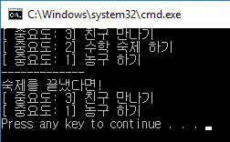


위와 같이 중요도가 같은 애들은 추가 되지 않습니다. 왜냐하면 앞서 말했듯이 셋에는 중복된 원소를 허락하지 않습니다. 그런데, 셋의 입장에서

 C/C++ 확대 축소

```cpp
Todo(1, "농구 하기")
```

와

 C/C++ 확대 축소

```cpp
Todo(1, "프로그래밍 프로젝트")
```

를 보았을 때

 C/C++ 확대 축소

```cpp
Todo(1, "농구 하기") < Todo(1, "프로그래밍 프로젝트");
Todo(1, "프로그래밍 프로젝트") > Todo(1, "농구 하기");
```

가 둘다 `false` 이므로, 두 개의 원소는 같은 것이라 생각하기 때문입니다! 따라서 나중에 추가된 '프로그래밍 프로젝트' 는 셋에 추가되지 않습니다. 같은 이유로 영화 보기도 추가되지 않습니다.

따라서 `operator<` 를 설계할 때 반드시 다른 객체는 `operator<` 상에서도 구분될 수 있도록 만들어야 합니다. 다시 말해 `A` 랑 `B` 가 다른 객체라면, `A < B` 혹은 `B < A` 중 하나는 반드시 `True` 여야 합니다.

엄밀히 말하자면 `operator<` 는 다음과 같은 조건들을 만족해야 합니다. (A 랑 B 가 다른 객체라면)

- `A < A` 는 거짓
- `A < B != B < A`
- `A < B` 이고 `B < C` 이면 `A < C`
- `A == B` 이면 `A < B` 와 B `< A` 둘 다 거짓
- `A == B` 이고 `B == C` 이면 `A == C`

위와 같은 조건을 만족하는 `<` 연산자는 *strict weak ordering* 을 만족한다고 합니다. 지켜야 할 조건들이 꽤나 많이 보이는데 사실, 상식적으로 `operator<` 를 설계하였다면 위 조건들은 모두 만족할 수 있습니다.

만약에, 위 중 하나라도 조건이 맞지 않는면 `set` 이 제대로 동작하지 않고 (컴파일 타임에는 오류가 발생하지 않습니다), 런타임 상에서 오류가 발생할 텐데 정말 디버깅 하기 힘들 것입니다 :(

마지막으로 보여드릴 것은, 클래스 자체에 `operator<` 를 두지 않더라도 셋을 사용하는 방법입니다. 예를 들어서 우리가 외부 라이브러리를 사용하는데, 만약에 그 라이브러리의 한 클래스의 객체를 셋에 저장하고 싶다고 해봅시다. 우리가 사용하는 외부 클래스에 `operator<` 가 정의되어 있지 않다는 점입니다. 이럴 경우, 셋을 사용하기 위해서는 따로 객체를 비교할 수 있는 방법을 알려주어야 합니다.

아래 예제를 보실까요.

 코드 크기 줄이기 C/C++ 확대 축소

```cpp
#include <iostream>
#include <set>
#include <string>

template <typename T, typename C>
void print_set(std::set<T, C>& s) {
  // 셋의 모든 원소들을 출력하기
  for (const auto& elem : s) {
    std::cout << elem << " " << std::endl;
  }
}
class Todo {
  int priority;
  std::string job_desc;

 public:
  Todo(int priority, std::string job_desc)
      : priority(priority), job_desc(job_desc) {}

  friend struct TodoCmp;

  friend std::ostream& operator<<(std::ostream& o, const Todo& td);
};
struct TodoCmp {
  bool operator()(const Todo& t1, const Todo& t2) const {
    if (t1.priority == t2.priority) {
      return t1.job_desc < t2.job_desc;
    }
    return t1.priority > t2.priority;
  }
};

std::ostream& operator<<(std::ostream& o, const Todo& td) {
  o << "[ 중요도: " << td.priority << "] " << td.job_desc;
  return o;
}
int main() {
  std::set<Todo, TodoCmp> todos;

  todos.insert(Todo(1, "농구 하기"));
  todos.insert(Todo(2, "수학 숙제 하기"));
  todos.insert(Todo(1, "프로그래밍 프로젝트"));
  todos.insert(Todo(3, "친구 만나기"));
  todos.insert(Todo(2, "영화 보기"));

  print_set(todos);

  std::cout << "-------------" << std::endl;
  std::cout << "숙제를 끝냈다면!" << std::endl;
  todos.erase(todos.find(Todo(2, "수학 숙제 하기")));
  print_set(todos);
}
```

입력 코드 수정 실행

성공적으로 컴파일 하였다면

실행 결과

```
[ 중요도: 3] 친구 만나기 
[ 중요도: 2] 수학 숙제 하기 
[ 중요도: 2] 영화 보기 
[ 중요도: 1] 농구 하기 
[ 중요도: 1] 프로그래밍 프로젝트 
-------------
숙제를 끝냈다면!
[ 중요도: 3] 친구 만나기 
[ 중요도: 2] 영화 보기 
[ 중요도: 1] 농구 하기 
[ 중요도: 1] 프로그래밍 프로젝트 
```

와 같이 나옵니다. 달라진 점은 일단 `Todo` 클래스에서 `operator<` 가 삭제되었습니다. 하지만 셋을 사용하기 위해 반드시 `Todo` 객체간의 비교를 수행해야 하기 때문에 다음과 같은 클래스를 만들었습니다.


 C/C++ 확대 축소

```cpp
struct TodoCmp {
  bool operator()(const Todo& t1, const Todo& t2) const {
    if (t1.priority == t2.priority) {
      return t1.job_desc < t2.job_desc;
    }
    return t1.priority > t2.priority;
  }
};
```

앞서 템플릿 첫 강좌에서 함수 객체를 배운 것이 기억 나시나요? 위 클래스는 정확히 함수 객체를 나타내고 있습니다. 이 `TodoCmp` 타입을

 C/C++ 확대 축소

```cpp
std::set<Todo, TodoCmp> todos;
```

위 처럼 `set` 에 두번째 인자로 넘겨주게 되면 셋은 이를 받아서 `TodoCmp` 클래스에 정의된 함수 객체를 바탕으로 모든 비교를 수행하게 됩니다. 실제로 `set` 클래스의 정의를 살펴보면;

 C/C++ 확대 축소

```cpp
template <class Key, class Compare = std::less<Key>,
          class Allocator = std::allocator<Key>  // ← 후에 설명하겠습니다
          >
class set;
```

와 같이 생겼는데, 두 번째 인자로 `Compare` 를 받는 다는 것을 알 수 있습니다. (템플릿 디폴트 인자로 `std::less<Key>` 가 들어있는데 이는 `Key` 클래스의 `operator<` 를 사용한다는 의미와 같습니다. `Compare` 타입을 전달하지 않으면 그냥 `Key` 클래스의 `operator<` 로 비교를 수행합니다.)

결과적으로 셋은 원소의 삽입과 삭제를 O(log N)*O*(*l**o**g**N*) 원소의 탐색도 O(log N)*O*(*l**o**g**N*) 에 수행하는 자료 구조 입니다.

## 맵 (map)

맵은 셋과 거의 똑같은 자료 구조 입니다. 다만 셋의 경우 키만 보관했지만, 맵의 경우 키에 대응되는 값(value) 까지도 같이 보관하게 됩니다.

 코드 크기 줄이기 C/C++ 확대 축소

```cpp
#include <iostream>
#include <map>
#include <string>

template <typename K, typename V>
void print_map(std::map<K, V>& m) {
  // 맵의 모든 원소들을 출력하기
  for (auto itr = m.begin(); itr != m.end(); ++itr) {
    std::cout << itr->first << " " << itr->second << std::endl;
  }
}

int main() {
  std::map<std::string, double> pitcher_list;

  // 참고로 2017년 7월 4일 현재 투수 방어율 순위입니다.

  // 맵의 insert 함수는 pair 객체를 인자로 받습니다.
  pitcher_list.insert(std::pair<std::string, double>("박세웅", 2.23));
  pitcher_list.insert(std::pair<std::string, double>("해커 ", 2.93));

  pitcher_list.insert(std::pair<std::string, double>("피어밴드 ", 2.95));

  // 타입을 지정하지 않아도 간단히 std::make_pair 함수로
  // std::pair 객체를 만들 수 도 있습니다.
  pitcher_list.insert(std::make_pair("차우찬", 3.04));
  pitcher_list.insert(std::make_pair("장원준 ", 3.05));
  pitcher_list.insert(std::make_pair("헥터 ", 3.09));

  // 혹은 insert 를 안쓰더라도 [] 로 바로
  // 원소를 추가할 수 있습니다.
  pitcher_list["니퍼트"] = 3.56;
  pitcher_list["박종훈"] = 3.76;
  pitcher_list["켈리"] = 3.90;

  print_map(pitcher_list);

  std::cout << "박세웅 방어율은? :: " << pitcher_list["박세웅"] << std::endl;
}
```

입력 코드 수정 실행

성공적으로 컴파일 하였다면

실행 결과

```
니퍼트 3.56
박세웅 2.23
박종훈 3.76
장원준  3.05
차우찬 3.04
켈리 3.9
피어밴드  2.95
해커  2.93
헥터  3.09
박세웅 방어율은? :: 2.23
```

와 같이 나옵니다.


 C/C++ 확대 축소

```cpp
std::map<std::string, double> pitcher_list;
```

맵의 경우 템플릿 인자로 2 개를 가지는데, 첫번째는 키의 타입이고, 두 번째는 값의 타입입니다. 우리는 투수 이름을 키로 가지고 대응되는 값을 그 투수의 방어율로 하는 맵을 만들 예정입니다.

 C/C++ 확대 축소

```cpp
pitcher_list.insert(std::pair<std::string, double>("박세웅", 2.23));
pitcher_list.insert(std::pair<std::string, double>("해커 ", 2.93));
pitcher_list.insert(std::pair<std::string, double>("피어밴드 ", 2.95));
```

맵에 원소를 넣기 위해서는 반드시 `std::pair` 객체를 전달해야 합니다. `std::pair` 객체는 별다른게 아니고,

 C/C++ 확대 축소

```cpp
template <class T1, class T2>
struct std::pair {
  T1 first;
  T2 second;
};
```

로 생긴 단순히 2 개의 객체를 멤버로 가지는 객체 입니다. 문제는 `std::pair` 객체를 사용할 때 마다 위 처럼 템플릿 인자를 초기화 해야 하는데 꽤나 귀찮습니다. 그래서 `STL` 에서는 `std::make_pair` 함수를 제공해주는데,

 C/C++ 확대 축소

```cpp
pitcher_list.insert(std::make_pair("차우찬", 3.04));
pitcher_list.insert(std::make_pair("장원준 ", 3.05));
pitcher_list.insert(std::make_pair("헥터 ", 3.09));
```

이 함수는 인자로 들어오는 객체를 보고 타입을 추측해서 알아서 `std::pair` 객체를 만들어서 리턴해줍니다. 따라서 굳이 귀찮게 타입을 명시해줄 필요가 없습니다.

한 가지 재미있는 점은

 C/C++ 확대 축소

```cpp
// 혹은 insert 를 안쓰더라도 [] 로 바로
// 원소를 추가할 수 있습니다.
pitcher_list["니퍼트"] = 3.56;
pitcher_list["박종훈"] = 3.76;
pitcher_list["켈리"] = 3.90;
```

맵의 경우 `operator[]` 를 이용해서 새로운 원소를 추가할 수 도 있습니다 (만일 해당하는 키가 맵에 없다면). 만일 키가 이미 존재하고 있다면 값이 대체될 것입니다.

 C/C++ 확대 축소

```cpp
template <typename K, typename V>
void print_map(std::map<K, V>& m) {
  // 맵의 모든 원소들을 출력하기
  for (auto itr = m.begin(); itr != m.end(); ++itr) {
    std::cout << itr->first << " " << itr->second << std::endl;
  }
}
```

맵의 경우도 셋과 마찬가지로 반복자를 이용해서 순차적으로 맵에 저장되어 있는 원소들을 탐색할 수 있습니다. 참고로 셋의 경우 `*itr` 가 저장된 원소를 바로 가리켰는데, 맵의 경우 반복자가 맵에 저장되어 있는 `std::pair` 객체를 가리키게 됩니다. 따라서 `itr->first` 를 하면 해당 원소의 키를, `itr->second` 를 하면 해당 원소의 값을 알 수 있습니다.

참고로 해당 `for` 문을 범위 기반 `for` 문으로 바꿔본다면 아래와 같습니다.

 C/C++ 확대 축소

```cpp
template <typename K, typename V>
void print_map(std::map<K, V>& m) {
  // kv 에는 맵의 key 와 value 가 std::pair 로 들어갑니다.
  for (const auto& kv : m) {
    std::cout << kv.first << " " << kv.second << std::endl;
  }
}
```

반복자를 이용한 버전과 매우 유사하게, 맵의 키와 대응되는 원소를 `first` 와 `second` 를 이용해서 참조할 수 있습니다. 이 역시 반복자를 사용한 형태보다 더 간단하므로 권장됩니다.

 C/C++ 확대 축소

```cpp
std::cout << "박세웅 방어율은? :: " << pitcher_list["박세웅"] << std::endl;
```

만약에 맵에 저장된 값을 찾고 싶다면 간단히 `[]` 연산자를 이용하면 됩니다. `[]` 연산자는 인자로 키를 받아서 이를 맵에서 찾아서 대응되는 값을 돌려줍니다.

하지만, `[]` 연산자를 사용할 때 주의해야 할 점이 있습니다.

 코드 크기 줄이기 C/C++ 확대 축소

```cpp
#include <iostream>
#include <map>
#include <string>

template <typename K, typename V>
void print_map(const std::map<K, V>& m) {
  // kv 에는 맵의 key 와 value 가 std::pair 로 들어갑니다.
  for (const auto& kv : m) {
    std::cout << kv.first << " " << kv.second << std::endl;
  }
}

int main() {
  std::map<std::string, double> pitcher_list;

  pitcher_list["오승환"] = 3.58;
  std::cout << "류현진 방어율은? :: " << pitcher_list["류현진"] << std::endl;

  std::cout << "-----------------" << std::endl;
  print_map(pitcher_list);
}
```

입력 코드 수정 실행

성공적으로 컴파일 하였다면

실행 결과

```
류현진 방어율은? :: 0
-----------------
류현진 0
오승환 3.58
```

와 같이 나옵니다.

 C/C++ 확대 축소

```cpp
pitcher_list["오승환"] = 3.58;
```

일단 위와 같이 `pitcher_list` 에 오승환의 방어율만 추가하였기 때문에 류현진의 방어율을 검색하면 아무것도 나오지 않는게 정상입니다. 그런데,

 C/C++ 확대 축소

```cpp
std::cout << "류현진 방어율은? :: " << pitcher_list["류현진"] << std::endl;
```

위 처럼 류현진의 방어율을 맵에서 검색하였을 때, 0 이라는 값이 나왔습니다. 없는 값을 참조하였으니 오류가 발생해야 정상인데 오히려 값을 돌려주었네요.이는 `[]` 연산자가, 맵에 없는 키를 참조하게 되면, 자동으로 값의 디폴트 생성자를 호출해서 원소를 추가해버리기 때문입니다.

`double` 의 디폴트 생성자의 경우 그냥 변수를 0 으로 초기화 해버립니다. 따라서 되도록이면 [find](https://modoocode.com/241) 함수로 원소가 키가 존재하는지 먼저 확인 후에, 값을 참조하는 것이 좋습니다. 아래는 [find](https://modoocode.com/241) 함수를 이용해서 안전한게 키에 대응되는 값을 찾는 방법입니다.


 코드 크기 줄이기 C/C++ 확대 축소

```cpp
#include <iostream>
#include <map>
#include <string>

template <typename K, typename V>
void print_map(const std::map<K, V>& m) {
  // kv 에는 맵의 key 와 value 가 std::pair 로 들어갑니다.
  for (const auto& kv : m) {
    std::cout << kv.first << " " << kv.second << std::endl;
  }
}

template <typename K, typename V>
void search_and_print(std::map<K, V>& m, K key) {
  auto itr = m.find(key);
  if (itr != m.end()) {
    std::cout << key << " --> " << itr->second << std::endl;
  } else {
    std::cout << key << "은(는) 목록에 없습니다" << std::endl;
  }
}

int main() {
  std::map<std::string, double> pitcher_list;

  pitcher_list["오승환"] = 3.58;

  print_map(pitcher_list);
  std::cout << "-----------------" << std::endl;

  search_and_print(pitcher_list, std::string("오승환"));
  search_and_print(pitcher_list, std::string("류현진"));
}
```

입력 코드 수정 실행

성공적으로 컴파일 하였다면

실행 결과

```
오승환 3.58
-----------------
오승환 --> 3.58
류현진은(는) 목록에 없습니다
```

와 같이 나옵니다.


 C/C++ 확대 축소

```cpp
template <typename K, typename V>
void search_and_print(const std::map<K, V>& m, K key) {
  auto itr = m.find(key);
  if (itr != m.end()) {
    std::cout << key << " --> " << itr->second << std::endl;
  } else {
    std::cout << key << "은(는) 목록에 없습니다" << std::endl;
  }
}
```

위 처럼 [find](https://modoocode.com/241) 함수는 맵에서 해당하는 키를 찾아서 이를 가리키는 반복자를 리턴합니다. 만약에, 키가 존재하지 않는다면 `end()` 를 리턴합니다.

마지막으로 짚고 넘어갈 점은 맵 역시 셋 처럼 중복된 원소를 허락하지 않는다는 점입니다. 이미, 같은 키가 원소로 들어 있다면 나중에 오는 [insert](https://modoocode.com/238) 는 무시됩니다.


 코드 크기 줄이기 C/C++ 확대 축소

```cpp
#include <iostream>
#include <map>
#include <string>

template <typename K, typename V>
void print_map(const std::map<K, V>& m) {
  // kv 에는 맵의 key 와 value 가 std::pair 로 들어갑니다.
  for (const auto& kv : m) {
    std::cout << kv.first << " " << kv.second << std::endl;
  }
}

int main() {
  std::map<std::string, double> pitcher_list;

  // 맵의 insert 함수는 std::pair 객체를 인자로 받습니다.
  pitcher_list.insert(std::pair<std::string, double>("박세웅", 2.23));
  pitcher_list.insert(std::pair<std::string, double>("박세웅", 2.93));

  print_map(pitcher_list);

  // 2.23 이 나올까 2.93 이 나올까?
  std::cout << "박세웅 방어율은? :: " << pitcher_list["박세웅"] << std::endl;
}
```

입력 코드 수정 실행

성공적으로 컴파일 하였다면

실행 결과

```
박세웅 2.23
박세웅 방어율은? :: 2.23
```

와 같이 먼저 [insert](https://modoocode.com/238) 된 원소가 나오게 됩니다. 즉, 이미 같은 키를 가지는 원소가 있다면 그 [insert](https://modoocode.com/238) 작업은 무시됩니다. 만약에, 원소에 대응되는 값을 바꾸고 싶다면 [insert](https://modoocode.com/238) 를 하지 말고, `[]` 연산자로 대응되는 값을 바꿔주면 됩니다.

### 멀티셋(multiset)과 멀티맵(multimap)

앞서 셋과 맵 모두 중복된 원소를 허락하지 않습니다. 만일, 이미 원소가 존재하고 있는데 [insert](https://modoocode.com/238) 를 하였으면 무시가 되었지요. 하지만 멀티셋과 멀티맵은 중복된 원소를 허락합니다.

 코드 크기 줄이기 C/C++ 확대 축소

```cpp
#include <iostream>
#include <set>
#include <string>

template <typename K>
void print_set(const std::multiset<K>& s) {
  // 셋의 모든 원소들을 출력하기
  for (const auto& elem : s) {
    std::cout << elem << std::endl;
  }
}

int main() {
  std::multiset<std::string> s;

  s.insert("a");
  s.insert("b");
  s.insert("a");
  s.insert("c");
  s.insert("d");
  s.insert("c");

  print_set(s);
}
```

입력 코드 수정 실행

성공적으로 컴파일 하였다면

실행 결과

```
a
a
b
c
c
d
```

와 같이 나옵니다. 만약에 기존의 `set` 이였다면 그냥 `a,b,c,d` 이렇게 나왔어야 하지만, 멀티셋의 경우 중복된 원소를 허락하기 때문에 [insert](https://modoocode.com/238) 한 모든 원소들이 쭈르륵 나오게 됩니다.


 코드 크기 줄이기 C/C++ 확대 축소

```cpp
#include <iostream>
#include <map>
#include <string>

template <typename K, typename V>
void print_map(const std::multimap<K, V>& m) {
  // 맵의 모든 원소들을 출력하기
  for (const auto& kv : m) {
    std::cout << kv.first << " " << kv.second << std::endl;
  }
}

int main() {
  std::multimap<int, std::string> m;
  m.insert(std::make_pair(1, "hello"));
  m.insert(std::make_pair(1, "hi"));
  m.insert(std::make_pair(1, "ahihi"));
  m.insert(std::make_pair(2, "bye"));
  m.insert(std::make_pair(2, "baba"));

  print_map(m);

  // 뭐가 나올까요?
  std::cout << "--------------------" << std::endl;
  std::cout << m.find(1)->second << std::endl;
}
```

입력 코드 수정 실행

성공적으로 컴파일 하였다면

실행 결과

```
1 hello
1 hi
1 ahihi
2 bye
2 baba
--------------------
hello
```

와 같이 나옵니다.

일단 맵 과는 다르게, 한 개의 키에 여러개의 값이 대응될 수 있다는 것은 알 수 있습니다. 하지만 이 때문에 `[]` 연산자를 멀티맵의 경우 사용할 수 없습니다. 왜냐하면 예를 들어서


 C/C++ 확대 축소

```cpp
m[1]
```

을 했을 때 "hello" 를 리턴해야할지, 아니면 "hi" 를 리턴해야 할 지 알 수 없기 때문이지요. 따라서 멀티맵의 경우 아예 `[]` 연산자를 제공하지 않습니다. 그렇다면

 C/C++ 확대 축소

```cpp
std::cout << m.find(1)->second << std::endl;
```

위 처럼 [find](https://modoocode.com/241) 함수를 사용했을 때 무엇을 리턴할까요? 일단 해당하는 키가 없으면 `m.end()` 를 리턴합니다. 그렇다면 위 경우 1 이라는 키에 3 개의 문자열이 대응되어 있는데 어떤거를 리턴해야 할까요? 제일 먼저 [insert](https://modoocode.com/238) 한것? 아니면 문자열 중에서 사전 순으로 가장 먼저 오는 것?

사실 C++ 표준을 읽어보면 무엇을 리턴하라고 정해놓지 않았습니다. 즉, 해당되는 값들 중 아무 거나 리턴해도 상관 없다는 뜻입니다. 위 경우 `hello` 가 나왔지만, 다른 라이브러리를 쓰는 경우 `hi` 가 나올 수 도 있고, `ahihi` 가 나올 수 도 있습니다.

그렇다면 1 에 대응되는 값들이 뭐가 있는지 어떻게 알까요? 이를 위해 멀티맵은 다음과 같은 함수를 제공하고 있습니다.

 코드 크기 줄이기 C/C++ 확대 축소

```cpp
#include <iostream>
#include <map>
#include <string>

template <typename K, typename V>
void print_map(const std::multimap<K, V>& m) {
  // 맵의 모든 원소들을 출력하기
  for (const auto& kv : m) {
    std::cout << kv.first << " " << kv.second << std::endl;
  }
}

int main() {
  std::multimap<int, std::string> m;
  m.insert(std::make_pair(1, "hello"));
  m.insert(std::make_pair(1, "hi"));
  m.insert(std::make_pair(1, "ahihi"));
  m.insert(std::make_pair(2, "bye"));
  m.insert(std::make_pair(2, "baba"));

  print_map(m);

  std::cout << "--------------------" << std::endl;

  // 1 을 키로 가지는 반복자들의 시작과 끝을
  // std::pair 로 만들어서 리턴한다.
  auto range = m.equal_range(1);
  for (auto itr = range.first; itr != range.second; ++itr) {
    std::cout << itr->first << " : " << itr->second << " " << std::endl;
  }
}
```

입력 코드 수정 실행

성공적으로 컴파일 하였다면

실행 결과

```
1 hello
1 hi
1 ahihi
2 bye
2 baba
--------------------
1 : hello 
1 : hi 
1 : ahihi 
```

와 같이 나옵니다.

 C/C++ 확대 축소

```cpp
auto range = m.equal_range(1);
```

`equal_range` 함수의 경우 인자로 멀티맵의 키를 받은 뒤에, 이 키에 대응되는 원소들의 반복자들 중에서시작과 끝 바로 다음을 가리키는 반복자를 `std::pair` 객체로 만들어서 리턴합니다. 즉, `begin()` 과 `end()` 를 `std::pair` 로 만들어서 세트로 리턴한다고 볼 수 있겠지요. 다만, `first` 로 시작점을, `second` 로 끝점 바로 뒤를 알 수 있습니다. 왜 끝점 바로 뒤를 가리키는 반복자를 리턴하는지는 굳이 설명 안해도 알겠죠?

 C/C++ 확대 축소

```cpp
for (auto itr = range.first; itr != range.second; ++itr) {
  std::cout << itr->first << " : " << itr->second << " " << std::endl;
}
```

따라서 위 처럼 1 에 대응되는 모든 원소들을 볼 수 있게 됩니다.

## 정렬되지 않은 셋과 맵 (unordered_set, unordered_map)

`unordered_set` 과 `unordered_map` (한글로 하면 너무 길어서 그냥 영문으로 표기하겠습니다) 은 C++ 11 에 추가된 비교적 최근 나온 컨테이너들 입니다 (위에것들은 모두 C++ 98 에 추가되었었죠).

이 두 개의 컨테이너는 이름에서도 알 수 있듯이 원소들이 정렬되어 있지 않습니다.

이 말이 무슨 말이냐면, 셋이나 맵의 경우 원소들이 순서대로 정렬되어서 내부에 저장되지만, `unordered_set` 과 `unordered_map` 의 경우 원소들이 순서대로 정렬되서 들어가지 않는다는 뜻입니다. 따라서 반복자로 원소들을 하나씩 출력해보면 거의 랜덤한 순서로 나오는 것을 볼 수 있습니다.

 코드 크기 줄이기 C/C++ 확대 축소

```cpp
#include <iostream>
#include <string>
#include <unordered_set>

template <typename K>
void print_unordered_set(const std::unordered_set<K>& m) {
  // 셋의 모든 원소들을 출력하기
  for (const auto& elem : m) {
    std::cout << elem << std::endl;
  }
}

int main() {
  std::unordered_set<std::string> s;

  s.insert("hi");
  s.insert("my");
  s.insert("name");
  s.insert("is");
  s.insert("psi");
  s.insert("welcome");
  s.insert("to");
  s.insert("c++");

  print_unordered_set(s);
}
```

입력 코드 수정 실행

성공적으로 컴파일 하였다면

실행 결과

```
c++
to
my
name
hi
is
psi
welcome
```

와 같이 나옵니다.

실제로 `unordered_set` 의 모든 원소들을 반복자로 출력해보면 딱히 순서대로 나오는 것 같지는 않습니다. 원소를 넣은 순서도 아니고, [string](https://modoocode.com/237) 문자열 순서도 아니고 그냥 랜덤한 순서 입니다.

그런데 이 `unordered_set` 에 한 가지 놀라운 점이 있습니다. 바로 [insert](https://modoocode.com/238), [erase](https://modoocode.com/240), [find](https://modoocode.com/241) 모두가 O(1)*O*(1) 으로 수행된다는 점입니다! 셋이나 맵의 경우 O(log n)*O*(*l**o**g**n*) 이었지만, `unordered_set` 과 `unordered_map` 의 경우 상수 시간에 원소를 삽입하고, 검색할 수 있습니다.

이 놀라운 일이 어떻게 가능한건지 `unordered_set` 과 `unordered_map` 이 어떻게 구현되었는지 살펴보면 알 수 있습니다.


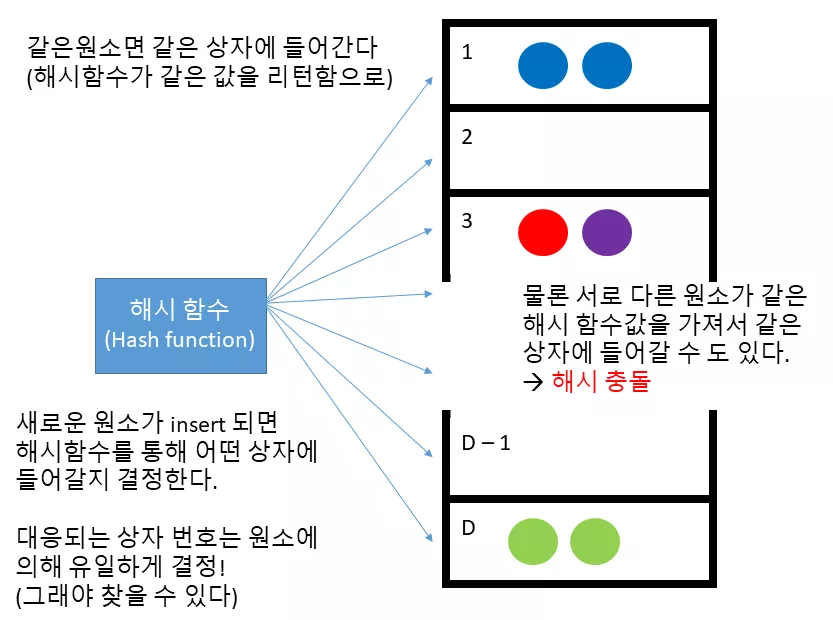

## 해시 함수(Hash function)

`unordered_set` 과 `unordered_map` 은 원소를 삽입하거나 검색 하기 위해 먼저 해시 함수라는 것을 사용합니다 (사실 그래서 원래 `hashset` 이나 `hashmap` 이란 이름을 붙이려고 했지만 이미 이러한 이름을 너무 많이 사용하고 있어서 충돌을 피하기 위해 저런 이름을 골랐다고 합니다).

해시 함수란 임의의 크기의 데이터를 고정된 크기의 데이터로 대응시켜주는 함수라고 볼 수 있습니다. 이 때 보통 고정된 크기의 데이터라고 하면 일정 범위의 정수값을 의미합니다.

`unordered_set` 과 `unordered_map` 의 경우, 해시함수는 1 부터 D (= 상자의 수)까지의 값을 반환하고 그 해시값 (해시 함수로 계산한 값)을 원소를 저장할 상자의 번호로 삼게 됩니다. 해시 함수는 구조상 최대한 1 부터 D 까지 고른 값을 반환하도록 설계되었습니다. 따라서 모든 상자를 고루 고루 사용할 수 있게 되지요.

해시 함수의 가장 중요한 성질은, 만약에 **같은 원소를 해시 함수에 전달한다면 같은 해시값을 리턴**한다는 점입니다. 이 덕분에 원소의 탐색을 빠르게 수행할 수 있습니다.

예를 들어 사용자가 파란공이 `unordered_set` 에 들어있는지 아닌지 확인한다고 해봅시다. 파란공을 해시 함수에 대입하면 1 을 리턴합니다. 따라서 1 번 상자를 살펴보면 이미 파란공이 있는 것을 알 수 있지요. 따라서 파란공이 `unordered_set` 에 이미 존재하고 있음을 알 수 있습니다.

그런데 재미있는 점은 해시 함수가 해시값 계산을 상수 시간에 처리한다는 점입니다. 따라서 `unordered_set` 과 `unordered_map` 모두 탐색을 상수 시간에 처리할 수 있습니다.

물론 빨간색 공과 보라색 공 처럼 다른 원소임에도 불구하고 같은 해시값을 갖는 경우가 있을 것입니다. 이를 **해시 충돌(hash collision)** 이라고 하는데, 이 경우 같은 상자에 다른 원소들이 들어있게 됩니다.

따라서 만약에 보라색 공이 이 셋에 포함되어 있는지 확인하고 싶다면 먼저 보라색 공의 해시값을 계산 한 뒤에, 해당하는 상자에 있는 모든 원소들을 탐색해보아야 할 것입니다.

해시 함수는 최대한 1 부터 N 까지 고른 값을 반환하도록 설계되었습니다. 뿐만 아니라 상자의 수도 충분히 많아야 상수 시간 탐색을 보장할 수 있습니다. 하지만 그럼에도 운이 매우 매우 나쁘다면 다른 색들의 공이 모두 1 번 상자에 들어갈 수 도 있습니다. 이 경우 탐색이 O(1)*O*(1) 은 커녕 O(N)*O*(*N*) (여기서 `n` 은 상자의 개수가 아니라 원소의 개수) 으로 실행될 것입니다.

따라서 `unordered_set` 과 `unordered_map` 의 경우 평균적으로 O(1)*O*(1) 시간으로 원소의 삽입/탐색을 수행할 수 있지만 최악의 경우 O(N)*O*(*N*) 으로 수행될 수 있습니다. (그냥 `set` 과 `map` 의 경우 평균도 O(log N)*O*(*l**o**g**N*) 최악의 경우에도 O(log N)*O*(*l**o**g**N*) 으로 실행됩니다)

이 때문에 보통의 경우에는 그냥 안전하게 맵이나 셋을 사용하고, 만약에 최적화가 매우 필요한 작업일 경우에만 해시 함수를 잘 설계해서 `unordered_set` 과 `unordered_map` 을 사용하는 것이 좋습니다.

기본 타입들(int, double 등등) 과 std::string 의 경우 라이브러리 자체적으로 해시 함수가 내장되어 있으므로, 그냥 사용하셔도 됩니다


또한 처음부터 많은 개수의 상자를 사용할 수 없기 때문에 (메모리를 낭비할 순 없으므로..) 상자의 개수는 삽입되는 원소가 많아짐에 따라 점진적으로 늘어나게 됩니다. 문제는 상자의 개수가 늘어나면 해시 함수를 바꿔야 하기 때문에 (더 많은 값들을 해시값으로 반환할 수 있도록) 모든 원소들을 처음부터 끝 까지 다시 [insert](https://modoocode.com/238) 해야 합니다. 이를 `rehash` 라 하며 O(N)*O*(*N*) 만큼의 시간이 걸립니다.

 코드 크기 줄이기 C/C++ 확대 축소

```cpp
#include <iostream>
#include <string>
#include <unordered_set>

template <typename K>
void print_unordered_set(const std::unordered_set<K>& m) {
  // 셋의 모든 원소들을 출력하기
  for (const auto& elem : m) {
    std::cout << elem << std::endl;
  }
}

template <typename K>
void is_exist(std::unordered_set<K>& s, K key) {
  auto itr = s.find(key);
  if (itr != s.end()) {
    std::cout << key << " 가 존재!" << std::endl;
  } else {
    std::cout << key << " 가 없다" << std::endl;
  }
}
int main() {
  std::unordered_set<std::string> s;

  s.insert("hi");
  s.insert("my");
  s.insert("name");
  s.insert("is");
  s.insert("psi");
  s.insert("welcome");
  s.insert("to");
  s.insert("c++");

  print_unordered_set(s);
  std::cout << "----------------" << std::endl;
  is_exist(s, std::string("c++"));
  is_exist(s, std::string("c"));

  std::cout << "----------------" << std::endl;
  std::cout << "'hi' 를 삭제" << std::endl;
  s.erase(s.find("hi"));
  is_exist(s, std::string("hi"));
}
```

입력 코드 수정 실행

성공적으로 컴파일 하였다면

실행 결과

```
c++
to
my
name
hi
is
psi
welcome
----------------
c++ 가 존재!
c 가 없다
----------------
'hi' 를 삭제
hi 가 없다
```

와 같이 나옵니다.

 C/C++ 확대 축소

```cpp
template <typename K>
void is_exist(std::unordered_set<K>& s, K key) {
  auto itr = s.find(key);
  if (itr != s.end()) {
    std::cout << key << " 가 존재!" << std::endl;
  } else {
    std::cout << key << " 가 없다" << std::endl;
  }
}
```

일단 위에서 볼 수 있듯이, `unordered_set` 과 `unordered_map` 모두 [find](https://modoocode.com/241) 함수를 지원하며, 사용법은 그냥 셋과 정확히 동일합니다. [find](https://modoocode.com/241) 함수의 경우 만일 해당하는 원소가 존재한다면 이를 가리키는 반복자를, 없다면 `end` 를 리턴합니다.

 C/C++ 확대 축소

```cpp
s.erase(s.find("hi"));
is_exist(s, std::string("hi"));
```

또한 원소를 제거하고 싶다면 간단히 [find](https://modoocode.com/241) 함수로 원소를 가리키는 반복자를 찾은 뒤에, 이를 전달하면 됩니다.

### 내가 만든 클래스를 `unordered_set/unordered_map` 의 원소로 넣고 싶을 때

그렇다면 여러분이 만든 클래스를 직접 `unordered_set` 혹은 `unordered_map` 에 넣으려면 어떻게 해야 할까요? 안타깝게도 셋이나 맵에 넣는것 보다 훨씬 어렵습니다. 왜냐하면 먼저 내 클래스의 객체를 위한 '해시 함수'를 직접 만들어줘야 하기 때문입니다. (그렇기 때문에 셋과 맵을 사용하는 것을 권장하는 것입니다!)

물론 셋이나 맵 과는 다르게 순서대로 정렬하지 않기 때문에 `operator<` 는 필요하지 않습니다. 하지만 `operator==` 는 필요한데, 왜냐하면 해시 충돌 발생 시에 상자안에 있는 원소들과 비교를 해야하기 때문이지요.

한 가지 다행인 점은 C++ 에서 기본적인 타입들에 대한 해시 함수들을 제공하고 있습니다. 우리는 이들을 잘만 이용하기만 하면 됩니다.

 C/C++ 확대 축소

```cpp
class Todo {
  int priority;  // 중요도. 높을 수록 급한것!
  std::string job_desc;

 public:
  Todo(int priority, std::string job_desc)
      : priority(priority), job_desc(job_desc) {}
};
```

그렇다면 위 `Todo` 클래스의 해시 함수를 만들어보겠습니다. 기본적으로 `unordered_set` 과 `unordered_map` 은 해시 함수 계산을 위해 hash 함수 객체를 사용합니다. `hash` 함수 객체는 아래와 같이 생겼습니다.

예를 들어 [string](https://modoocode.com/237) 함수의 해시값을 계산하고 싶다면

 C/C++ 확대 축소

```cpp
hash<string> hash_fn;
size_t hash_val = hash_fn(str);  // str 의 해시값 계산
```

위와 같이 수행하게 되는 것이지요. [string](https://modoocode.com/237) 을 템플릿 인자로 받는 `hash_fn` 객체를 만든 뒤에, ([Functor](https://modoocode.com/219) 입니다) 마치 함수를 사용하는 것처럼 사용하면 됩니다.

따라서 `Todo` 함수의 해시 함수를 계산하는 함수 객체를 만들기 위해 다음과 같이 `hash` 클래스의 `Todo` 특수화 버전을 만들어줘야 합니다.

 C/C++ 확대 축소

```cpp
// hash 클래스의 Todo 템플릿 특수화 버전!
template <>
struct hash<Todo> {
  size_t operator()(const Todo& t) const {
    // 해시 계산
  }
};
```

해시 함수는 객체의 `operator()` 를 오버로드하면 되고 `std::size_t` 타입을 리턴하면 됩니다. 보통 `size_t` 타입은 `int` 랑 동일한데, 이 말은 해시값으로 0 부터 4294967295 까지 가능하다는 뜻입니다. 물론 그렇다고 해서 이 만큼의 상자를 사용하는 것은 아니고, 현재 컨테이너가 사용하고 있는 상자 개수로 나눈 나머지를 상자 번호로 사용하겠지요.

 코드 크기 줄이기 C/C++ 확대 축소

```cpp
#include <functional>
#include <iostream>
#include <string>
#include <unordered_set>

template <typename K>
void print_unordered_set(const std::unordered_set<K>& m) {
  // 셋의 모든 원소들을 출력하기
  for (const auto& elem : m) {
    std::cout << elem << std::endl;
  }
}

template <typename K>
void is_exist(std::unordered_set<K>& s, K key) {
  auto itr = s.find(key);
  if (itr != s.end()) {
    std::cout << key << " 가 존재!" << std::endl;
  } else {
    std::cout << key << " 가 없다" << std::endl;
  }
}
class Todo {
  int priority;  // 중요도. 높을 수록 급한것!
  std::string job_desc;

 public:
  Todo(int priority, std::string job_desc)
      : priority(priority), job_desc(job_desc) {}

  bool operator==(const Todo& t) const {
    if (priority == t.priority && job_desc == t.job_desc) return true;
    return false;
  }

  friend std::ostream& operator<<(std::ostream& o, const Todo& t);
  friend struct std::hash<Todo>;
};

// Todo 해시 함수를 위한 함수객체(Functor)
// 를 만들어줍니다!
namespace std {
template <>
struct hash<Todo> {
  size_t operator()(const Todo& t) const {
    hash<string> hash_func;

    return t.priority ^ (hash_func(t.job_desc));
  }
};
}  // namespace std
std::ostream& operator<<(std::ostream& o, const Todo& t) {
  o << "[중요도 : " << t.priority << " ] " << t.job_desc;
  return o;
}

int main() {
  std::unordered_set<Todo> todos;

  todos.insert(Todo(1, "농구 하기"));
  todos.insert(Todo(2, "수학 숙제 하기"));
  todos.insert(Todo(1, "프로그래밍 프로젝트"));
  todos.insert(Todo(3, "친구 만나기"));
  todos.insert(Todo(2, "영화 보기"));
  print_unordered_set(todos);
  std::cout << "----------------" << std::endl;
}
```

입력 코드 수정 실행

성공적으로 컴파일 하였다면

실행 결과

```
[중요도 : 2 ] 영화 보기
[중요도 : 1 ] 프로그래밍 프로젝트
[중요도 : 3 ] 친구 만나기
[중요도 : 1 ] 농구 하기
[중요도 : 2 ] 수학 숙제 하기
----------------
```

와 같이 나옵니다.

먼저 `Todo` 를 위해 정의한 해시 함수를 살펴보도록 하겠습니다.

 C/C++ 확대 축소

```cpp
// Todo 해시 함수를 위한 함수객체(Functor)
// 를 만들어줍니다!
namespace std {
template <>
struct hash<Todo> {
  size_t operator()(const Todo& t) const {
    hash<string> hash_func;

    return t.priority ^ (hash_func(t.job_desc));
  }
};
}  // namespace std
```

다행이도 C++ STL 에서는 기본적인 타입들 (`int, std::string` 등등) 에 대한 해시 함수를 제공하기 때문에 우리의 `Todo` 클래스의 해시 함수는 이들을 잘 사용해서 짬뽕만 시키면 됩니다. 일단 `priority` 는 `int` 값 이므로 그냥 해시값 자체로 쓰기로 하고, [string](https://modoocode.com/237) 의 해시값은 `hash_func` 객체로 이용해서 계산하면 됩니다

결과적으로 두 해시값을 짬뽕 시키기 위해서 [XOR](https://modoocode.com/xor) 연산을 이용하였습니다.

참고로 왜 `hash` 클래스가 `namespace std` 안에 정의되어 있냐면 (이미 위에서 `using namespace std` 를 했음에도 불구하고), 특정 `namespace` 안에 새로운 클래스/함수를 추가하기 위해서는 위처럼 명시적으로 `namespace (이름)` 를 써줘야만 합니다. ([여기를 참고](https://stackoverflow.com/questions/2282349/specialization-of-templateclass-tp-struct-stdless-in-different-namespace))

그리고 마지막으로 아래와 같이 간단히 `==` 연산자를 추가해주면 됩니다.


 C/C++ 확대 축소

```cpp
bool operator==(const Todo& t) const {
  if (priority == t.priority && job_desc == t.job_desc) return true;
  return false;
}
```

그럼 위 처럼 `Todo` 객체를 마음껏 `unordered_set` 에서 사용할 수 있게 됩니다!

주의 사항

해시 함수를 직접 제작하는 일은 꽤나 어렵습니다. 가장 큰 이유로, `unordered_set` 이나 `unordered_map` 이 제대로 된 성능을 발휘하기 위해서는 해시 함수가 입력 받은 키를 잘 **흝뿌려야** 합니다.

만일 해시 함수의 결과가 특정 범위의 값에게만 집중되어 있다면, 해시 함수를 이용한 컨테이너의 성능이 그냥 `map` 이나 `set` 보다 훨씬 못하니만이 되게 됩니다. 특히 악의적인 사용자가 해당 허점을 이용해서 프로그램의 성능을 저하시킬 수도 있겠지요.

따라서 가장 권장하는 방식은 [여기](https://en.cppreference.com/w/cpp/utility/hash) 에 나온 기본 타입들의 대한 해시 함수들을 사용할 것이고, 해시 함수의 성능을 정확히 검증할 수 없다면, `map` 이나 `set` 을 사용하는 것이 나을 것입니다.

## 그렇다면 뭘 써야되?

아래와 같이 간단히 생각하시면 됩니다.

- 데이터의 존재 유무 만 궁금할 경우 → `set`

- 중복 데이터를 허락할 경우 → `multiset` (`insert, erase, find` 모두 O(\log N)*O*(log*N*). 최악의 경우에도 O(\log N)*O*(log*N*))

- 데이터에 대응되는 데이터를 저장하고 싶은 경우 → `map`

- 중복 키를 허락할 경우 → `multimap` (`insert, erase, find` 모두 O(\log N)*O*(log*N*). 최악의 경우에도 O(\log N)*O*(log*N*))

- 속도가 매우매우 중요해서 최적화를 해야하는 경우 → `unordered_set`, `unordered_map`

  ([insert](https://modoocode.com/238), [erase](https://modoocode.com/240), [find](https://modoocode.com/241) 모두 O(1)*O*(1). 최악의 경우엔 O(N)*O*(*N*) 그러므로 해시함수와 상자 개수를 잘 설정해야 한다!)

그렇다면 이번 강좌는 여기에서 마치도록 하겠습니다. 다음 강좌에서는 STL 알고리즘을 이용한 여러가지 작업들에 대해 알아보도록 하겠습니다!

# **:ballot_box_with_check: String class**

https://blockdmask.tistory.com/338 고고고고

# **:ballot_box_with_check: algorithm** 

https://modoocode.com/256 고고고고