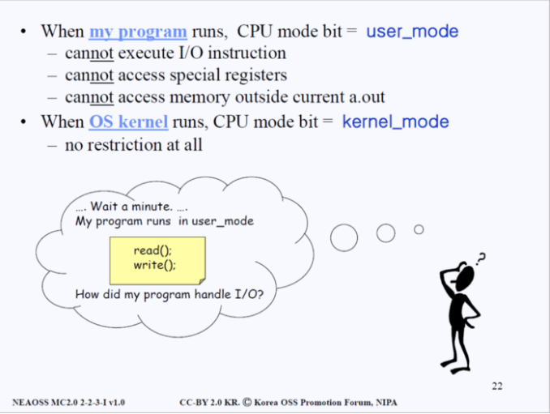

# LINUX 커널 :black_nib:

리눅스 커널을 한 사람이 전부 아는 것은 불가능하다. 커널 관련 두터운원서를 75~80권 정도는 읽어야 "아, 한 번씩은 훑어봤다"라고 말할 수 있을 정도다. `IBM`같은 대형회사에서도 리눅스를 다루는 사람만 250명 정도 있다고 한다. 250명의 사람이 방대한 커널에서 각자 분야를 맡아서 일을 처리한다.

따라서 "모든걸 다 알아야지~!"라는 마음가짐 보다는 **"커널과 운영체제가 어떤식으로 동작하는지 개략적으로 이해해보자"**라는 수준의 마음가짐으로 임할것이다.

# 1. 운영체제란?

운영체제(Operating System)이란 하드웨어 자원들(cpu, memory, disk, tty)을 관리하고 프로그램들을 지원(support)해주는 것이다. 

(아래 그림을 살펴보면 Operating System의 아래에 하드웨어들이 있고 그 위로는 프로그램들이 있다.)


다르게 표현하면, **하드웨어를 감추고 겉으로 다른 프로그램들을 지원해준다**라고 생각할 수 있다.

하드웨어를 감춘다는 건, 프로그램을 사용하는 사람이 편하게 쓸 수 있게 각종 기반 작업을 지원한다는 것으로 이해할 수 있다.

```bash
# Note
일반적으로 우리는 파워포인트나 워드를 쓸 때 프로그램이 cpu와 memory와 어떻게 소통하는지 등에 대해 따로 신경쓰지 않는다.
이는 다 운영체제 덕분이다.
```

---

## 1.1 프로그램이란?

코딩을 해봤다면 `main()`함수의 존재에 대해서 알 것이다. 프로그램이란 `main()`함수를 포함하여 다른 다양한 기능들을 하는 함수들이 모인 존재라고 생각할 수있다. 함수들이 적혀 있는 소스코드 파일을 컴파일 하면 프로그램이 된다는 것을 우리는 알고 있다.

`*.c`파일을 컴파일해서 `a.out` 혹은 `*.exe`등이 생성되고 우리는 이걸 프로그램이라 부른다.

여기서 한 가지 생각해볼 점이 있다. **왜 대부분의 프로그램은 분리되어 있는가?**에 대한 점이다. Microsoft사를 예로 들어보자. Microsoft사는 Word, PowerPoint 등 많은 프로그램을 보유하고 있다. Office관련 프로그램을 통틀어 우리는 Microsoft Office라고 부르기도 하는데, 왜 Microsoft사에서는 **왜 하나의 Office프로그램이 아니라 여러 프로그램(Word, PowerPoint)으로 분할해놨을까?**

사업적인 목적일 수 있겠으나 본질적으로는 **하나의 커다란 프로그램으로 운영할 경우 발생하는 비효율성 때문**이다. 거대한 프로그램은 실행할 때 부팅 시간도 오래 걸리고 메모리 사용에 있어서도 심각한 비효율성을 초래한다. 이런 여러가지 불편한 점이 있기에 여러가지 프로그램으로 분할해 놓은 것이다.

위와같은 이유로 리눅스 운영체제 또한 **Kernel, Shell, Utility 등 여러가지 프로그램으로 나뉘어져 있다.**

---

## 1.2 커널(Kernel)이란?

`Kernel`은 본질적으로 프로그램이다. 우리가 흔히 아는 `main()`으로 시작하는 프로그램 말이다.

하지만 다른 모든 프로그램과는 다르게 커널만이 가지고 있는 특별한 점이 있다. **그것은 바로 'Memory Resident'라는 점이다.** 메모리에 항상 상주해있는 것이 바로 커널이다.


커널이 아닌 다른 프로그램들은 메모리에 있어도 되고 없어도 된다. **'Disk Resident'**라고 표현한다. 필요할때마다 그 때 그 때 메모리에 로딩해서 사용하면 된다는 의미이다.

**커널은 'Memory Resident'특징을 제외하곤 아주 평범한 C Program이다.** 커널을제외한 다른 프로그램들을 우리는 `Utility`라고 하는데 위에서 언급했듯 disk resident하다. 항상 현 주소가 disk라는 의미다. 유저가 필요할 때 요청을 하면 그 때 메모리에 올라오는(로딩되는) 것이다. 그런 의미에서 **Utility**를 우리는 **Command**라고도 칭한다. **Utility와 Command를 동의어로 생각하고 공부**해보자.

---

## 1.3 쉘(Shell)이란?

우리 디스크에는 수십 수백개의 프로그램들이 존재한다. **이 프로그램들이 언제 메모리에 로딩되고 언제 메모리에서 해제되는지 누가 관리해줄까?** 관리해주는 프로그램이 꼭 필요하지 않을까?

위와 같은 필요에 의해 탄생한 것이 쉘이다. **많은 프로그램들의 메모리 교통정리를 해주는 역할을 한다.** 유틸리티 중 하나로 쉘의 1차적인 임무는 **'Job Control'**이다. `Utility`, `Command`, `Job`을 동의어로 생각하고 공부해보자.

---

## 1.4 파일(file)이란?(유닉스 한정)

유닉스(Unix)에서 파일은 **sequence of bytes**를 의미한다. 말 그대로 바이트들의 배열이란 뜻이다. 모든 함수, 명령어들은 결국 기계어로 해석하면 0과 1의 나열에 불과하다.

특히 유닉스, 리눅스에서는 **I/O device**도 file로 취급한다. 당장 이해가 안되겠지만, 입출력 기계들(하드디스크, USB, 키보드 등)을 파일로 취급한다고 알고있어라.

```bash
# Note
유닉스, 리눅스에서 입출력 기계들은 `/dev/hd0`, `/dev/hd1`, `/dev/tty2` 등 파일로서 다뤄지고 입출력 기계와 1:1로 대응된다.
```

---

## 1.5 커널과 쉘, 그리고 유틸리티의 관계

아래의 이미지를 살펴보면, 좌측에 메모리 그리고 우측에 디스크가 있다. 커널과 쉘, 그리고 유틸리티들이 디스크와 메모리에서 어떻게 작동하는지 살펴보자.


맨 처음 시스템을 부팅하면 제일 먼저 메인 메모리에 `Kernel(a.out)`이 올라온다. 커널 실행파일이 메모리에 로딩된다는 말이다. 리눅스는 **멀티 유저 시스템으로 하나의 시스템에 다양한 유저가 들어온다**는 사실을 상기하고 아래의 그림을 살펴보자.


유저가 터미널에 전원을 키면 그 터미널 위에서 쉘(shell)이란 프로그램을 메인 메모리에 올라온다. 그 후 쉘은 유저가 키보드로 커맨드를 입력하기 기다린다. 유저가 커맨드를 입력하면, 쉘은 커맨드에 대응하는 유틸리티를 디스크로부터 가져와서 실행시킨다. **각 유저로부터 전원이 들어올 때마다 이 3개의 프로그램(커널, 쉘, 유틸리티)의 관계가 형성됨을 알 수 있다.**

그런데 키보드로 커맨드를 입력하길 기다리고 그에 대응하는 유틸리티를 디스크로부터 가져와 실행시킨다는 것이 무슨말일까? 이 말의 의미를 이해하기 위해서는 **리눅스가 멀티유저 시스템이라는 점을 상기해야한다.** 더 자세한 설명 고고

위 내용들을 다시한번 정리하면 이렇다.

- 커널은 운영체제이며 항상 메모리에 상주해 있다. 나머지 프로그램들은 전부 유틸리티이며 디스크에 상주한다.
- 유틸리티는 항상 디스크에 있다가 필요할 때마다 메모리에 올라오고 사용하지 않을 때는 다시 내려간다. 유틸리티를 우리는 커맨드라고도 칭하며 커맨드들이 교통정리를 하는 것이 쉘의 역할이다
- 쉘한테 우리가 ppt라고 커맨드를 입력하면 쉘은 `child process`로 ppt를 생성한다. `child process`도 추후에 나오는 개념이니 일단 넘어가자

---

## 1.6 터미널은 뭐고 콘솔은 뭘까?

> 이 파트는 *KLDP의 게시물*을 보고 참조하여 작성하였다.

콘솔은 전통적으로 보면 계기판과 입력장치의 모음과 비슷한 것들의 집합으로 컴퓨터를 조작히 위한 조작부라고 생각하면 된다.

옛날 대형컴퓨터는 `serial(rs232, 422, 485)`를 이용하여 터미널이라는 장치와 연결하여 조작하였고, 아직도 몇몇 은행에서는 이러한 장비들을 볼 수 있다. 터미널이라는 장비는 CRT와 키보드로 구성되어 있으며 Teraterm, 넷텀, 하이퍼터미널과 같은 프로그램들을 모두 '터미널 에뮬레이터'라고 불렸다.

이들은 일반 PC를 터미널 대용으로 사용할 수 있도록 해주는 역할을 한ㄷ. 

**이제부터 `터미널`을 통해 `콘솔`과 통신한다 라고 생각해보자**

이해를 쉽게하기 위해 터미널은 콘솔의 부분집합이라고 생각하는 것도 좋다. 아래 커널 컴파일 도움말에 기술된 내용을 보면, 리눅스에서 콘솔과 터미널은 거의 동일한 의미로 사용되고 있다고 볼 수 있기 때문이다.

# 2. 운영체제 비교, 리눅스 vs 윈도우

---

## 2.1 자원의 소모에 대하여

운영체제에는 종류가 굉장히 많지만 가장 대표적이라고 일컬어지는 리눅스와 윈도우를 한 번 비교해보려 한다. 윈도우는 개인 컴퓨터(Personal Computer)에 사용되는 운영체제다. 개인 컴퓨터에 쓰인다는 것은 나홀로 사용자라는 것, 즉 싱글유저 시스템이라는 의미다. 리눅스가 멀티유저 시스템으로 마 ㄴ들어진 것과는 상반된다.

싱글유저 시스템일 때는 보안문제에 대해서 신경을 별로 안 써도 되지만, **멀티유저 시스템일 때는 보안에 특히 신경을 써야 한다.** 이유는 간단하다. 멀티유저 시스템은 그 안에 **내 파일 뿐만 아니라 다른 사람의 파일 또한 존재하기 때문이다.** 내가 다른 사람의 파일을 멋대록 읽고 쓸 수 있다면? 즉 삭제하고 변경할 수 있다면?이라는 물음을 던지면 쉽게 이해가 갈 것이다.

또하나의 이슈는 **메모리관리**이다. 멀티유저시스템에서는 한정된 자원을 모두가 효율적으로 이용하기 때문에 메모리 관리가 상당히 중요하다. 반면 윈도우와 같은 싱글유저 시스템에서는 멀티유저 시스템만큼 메모리관리에 신경을 덜 써도 된다.

> 싱글유저 시스템 : 내돈 내고 구입한 컴퓨터(장비)인데, 내가 아니면 누가써? 나만 쓸거야!

위의 한 문장이 싱글유저 시스템의 기본 철학이다. 그래서 PC(Personal Computer)는 일찌감치 윈도우 운영체제와 함께 결합된다. 윈도우는 GUI(Graphic User Interface)를 채택하고 있기 때문이다. 일반 사용자 입장에서 화면에 일일이 키보드로 명령어를 입력하는 것보다 마우스 몇 번 클릭해서 프로그램을 실행하고 관리하는 것이 훨씬 편하기 때문이다.

반면 **리눅스, 유닉스 등의 멀티유저시스템 CLI(Command Line Interface)를 채택**한다. 윈도우에서는 내가 사용할 수 있는 유틸리티(프로그램, 커맨드와 동의어)가 아이콘으로 보기 좋게 화면에 표시되는데, 리눅스는 `man`이라는 명령어로 내가 사용할 수 있는 커맨드가 무엇인지 알아내거나 사전에 알고 있어야 원활한 사용이 가능하다.


**윈도우는 사용자에게 편리한 인터페이스를 제공하는 대신, 동일 작업 대비 훨씬 많은 자원을 요구한다.** 리눅스는 사용자에게 다소 불편한 인터페이스를 제공하는 대신, 화면에 표시되는 Char1(1단위당 1바이트)만큼의 자원을 쓰는 등 효율적인 자원 사용을 가능케한다.

---

## 2.2 보안 이슈에 대하여

윈도우와는 다르게 리눅스에서는 보안이 매우 중요하다. 위에서 언급한 상황을 다시 생각해보자 **만일 한 프로세스가 다른 프로세스의 정보를 함부로 I/O하려고 하면 어떨까? 즉, 다른 프로세스의 파일을 삭제하거나 내용을 바꿀 수 있다면?** 그것만큼 끔찍한 일도 없을 것이다. 어제 힘들게 작성한 보고서를 자신의 가장 친한 친구가 실수로 삭제했다고만 생각해도 화가 치미는데, 모르는사람이 그런다면..

이러한 보안문제를 해결하기 위해 리눅스에서는 사전방지(Prevent)하기 위해 많은 노력을 하게 된다. 사후처리가 아닌 사전방지(Prevent)하는 이유 또한 간단하다. 내 파일이 삭제된 이후에 복구하는 뻘짓보다는 사전에 그런 행위를 못하게 막는 것이 훨씬 효율적이고 철학적으로도 옳다.

우리가 시스템을 설계하는 입장이라고 생각해보자. 알다시피 한 시스템에서 CPU는 모든 프로그램이 공통적으로 사용하는 공용자원이다. **메모리에 존재하는 프로그램은 여러가지고 하나의 프로그램만이 한 번의 순간에 CPU를 온전히 차지한다.**

- **CPU는 한 순간에 하나의 연산밖에 못한다.**

즉, 한 순간에 CPU를 사용하는 건 오직 하나의 프로그램 뿐이다. 여기서 순간이란 건, 기술력에 따라서 달라지는데 현재는 1초에 40억번의 연산이 가능한 CPU들이 등장하고 있으니, 최근기술로서 한 순간을 해석해보자면 나노세컨드 정도는 될 것으로 생각된다.

위의 내용들을 바탕으로 아래의 그림을 샆펴보자.

```bash
# Note
1초에 40억번의 연산이 가능하다는 말은 1초에 CPU는 40억번의 순간을 함축하고 있다는 뜻이다. CPU는 1초에 40억번의 순간이 존재하고 그 순간마다 연산(모든 프로그램을 관리)하기 때문에 우리가 여러 프로그램들을 한꺼번에 켜놓고 작업해도 끊김없이 동시에 처리가 되는 것 처럼 보인다.
```


CPU가 Bob의 터미널과 연결된 쉘에게 양도되었다고 하자. 즉 시스템이 Bob의 터미널과 연결된 쉘에 CPU를 넘겨준 것이다. 쉘도 하나의 프로그램이므로, 쉘에 버그가 생겼다고 가정해보자. 본래 쉘은 Bob이 접근 가능한 디스크 영역, 메모리 영역에만 데이터를 읽고 써야하는데, 디스크의 Sector Address를 잘못 계산해서 Dan의 영역에 데이터를 썼다고 가정해보자.

즉 Dan이 저장해놓은 파일들이 다 엉망이 됐다는 뜻이다. 시스템은 이미 CPU를 Bob과 연결되어 있는 쉘에게 양도를 해놨고... 이 쉘은 잘못을 저질렀다. 해당 프로그램이 오류로 엉뚱한곳에 데이터를 읽거나 쓰는 상황이 발생했는데 어떻게 이러한 상황을 예방할 수 있을까?


위 그림에도 써져 있지만 리눅스 시스템 설계자가 고안한 해답은 바로 **"I/O instruction 하지마!!"**이다. 만약 쉘을 포함한 다른 일반 프로그램이 I/O를 수행하는 순간 CPU를 사용권한을 바로 뺏긴다.

쉘(sh)입장에서는 한편으론 억울할 수 있다. **"나는 CPU를 사용할 수 있고, 내역할은 I/O를 하는건데 그럼 뭘 하라는거야?"**라고 쉘은 반박한다. 자신의 임무를 수행하려 했더니 억울하게 CPU를 뺏겨버리니 말이다.

그래서 리눅스 시스템 설계자는 **"그럼 니가 I/O할 때 커널에게 부탁을 해. I/O하게 해달라고"** 라고 쉘에게 말한다. 즉, 현재 리눅스 시스템의 작동은 **I/O Instruction을 할 때는 커널이 갖고 있는 function에 부탁을 하는방식**으로 되어있다. 이 부탁하는 과정을 `***System Call***`이라 한다.

커널은 해당 입출력 명령이 합법적인 것인지 검사한 후에 I/O를 대신 진행해준다. 이런 특별한 구조를 구축하기 위해 윈도우나 개인 컴퓨터에는 없는 개념을 하드웨어에 도입한다. 아래의 그림을 살펴보자.


바로 **CPU에 하나의 Binary Bit를 도입한 것**이다. 위 그림에 빨간색 네모칸이 바로 그 bit(비트)다. 이 bit를 우리는 **mode bit**라 칭한다. 비트라는건 알다시피 2개의 데이터(0과 1)만을 저장할 수 있다. 0은 유저모드를 의미하고 1은 커널모드를 뜻한다. 우선 우리가 메모리와 CPU에 대해서 알고 있는 개념을 다시 한번 정리해보자. 그림과 함께보자.

- CPU의 Control Unit 파트에 **PC는 Program Counter라고 하는 특수 레지스터다. PC에서는 이번에 수행해야 할 instruction(명령)의 주소**를 메모리로 보낸다. **MAR은 Memory Address Register**이며 **Address Bus**라고도 이해할 수 있는데 MAR이 읽어들인 주소에 **해당하는 데이터를 MBR(Memory Buffer Register)에 담아 IR(Instruction Register)에 보낸다.**
- IR로 들어온 **Instruction(명령)은 위 그림의 우측 하단과 같은 구조**를 지닌다. **op-code**에는 수행해야 할 명령이 적혀있고 그 옆에는 **operands**라고 하는 명령 인수들이 적혀 있다. i와 j 주소에 있는 값을 더하라는 의미 정도로 해석할 수 있다.


- Op-Code를 읽어들여 명령어를 처리하는데, **i와 j에 해당하는 메모리주소에 담겨 있는 값을 알아내기 위해 또 다시 메모리에 접근해서 연산을 진행한다.**

### >> mode bit(모드 비트) 추가설명

CPU에는 한 바이너리 비트인 **모드 비트**라는 개념이 존재하고, **그것은 0 또는 1의값**을 갖는다. 커널 모드에서 동작하느냐 유저모드에서 동작하냐를 정해주는 이 바이너리 비트를 우리는 일단 0이면 유저모드, 1이면 커널모드로 동작한다고 생각해보자.


만약 모드 비트가 `커널모드(1)`로 되어있다면 **CPU는 어떠한 영역의 메모리라도 접근할 수 있다.**

커널모드가 아닌 `유저모드(0)`로 되어있다면 **모든 메모리에 접근(Access)는 불가능하고 자신의 Address Space만 접근가능하다.**

또한 `커널모드(1)`일 경우에는 **모든 instruction이나 op-code를 수행(execute)할 수 있지만**

`유저모드(0)`라면 **I/O instruction이나 special register accesses와 관련된 instruction은 금지**된다.

즉, **유저모드에서는 타인에게 큰 영향을 줄 수 있는 instruction은 모두 거분되는 것이다.**

```bash
# Note
`special register accesses`란 스택 포인터(SP)나 프로그램 카운터(PC)와 같은 특별한 레지스터에 대해 값을 읽는 등위 행위를 말한다.
```


---

## 2.3 커널모드와 유저모드

인천 공항 보안 검색대를 생각해보자. 일반 사람들이라면 보안 검색대를 반드시 통과해야겠지만, 자신이 대통령이나 국가원수에 해당하는 중책이고 매우 바쁜일이 있다면 보안 검색대를 거치지 않고 바로 공항을 나설 수 있다.

CPU는 항상 메모리에서 address를 메모리에 건넨다. 원하는 instruction이 있다면 해당 instruction의 주소를 Program Counter가 메모리로 보낸다. 이 과정이 CPU가 메모리에게 **"이 instruction을 수행해야 하니 메모리에 관련된 코드를 나에게 보내다오"**라고 말하는 과정이며, instruction이 오면 그걸 실행(execute)하는 과정에서 또 관련 매개변수(operands)에 관련된 주소를 보내고 관련 정보를 받아온다.

이처럼 CPU는 계속 메모리에게 address를 보내는 작업을 진행하는 것인데, CPU가 메모리로 주소를 보낼 때는 그 당시 모드 비트가 어떤 것으로 되어 있느냐가 정말 중요하다. 먼저 아래의 그림을 살펴보자.


위의 그림은 **빨간색 모드 비트가 유저모드였을 경우**를 상정하고 설명을 한다. 앞에서 인천 공항 검색대로 예시를 들었는데, 운영체제에 빗대서 다시 정리해보자. 먼저 첫 번째 보안 검색(address)를 진행한다.

CPU와 메모리 사이에는 **MMU(Memory Management Unit)**이라는 하드웨어가 존재한다. 이 MMU의 역할은 CPU로부터 메모리로 가는 **address를 조사**하는 것이다. 즉, CPU가 메모리에게 넘기는 address 정보가 올바른지 판명하는 것이다. **"CPU야. 너가 지금 보낸 주소가 너가 할 수 있는 접근 메모리 범위를 벗어나지는 않았니?"**라고 말한다.

첫 번째 검사를 무사히 통과하면 **Instruction Fetch**, 즉 instruction을 가져온다. 위에서 우리는 instruction,의 구조가 op-code, operands로 구성된다는 것을 확인했는데, 바로 이 **op-code를 보고** 아 이것이 덧셈이구나, 뺄셈이구나, 곱셈이구나 등을 확인하게 된다. 이게 바로 2번째 검사다.

명령어(op-code)를 확인해 봤는데, 만약 이것이 **privileged op-code(I/O와 같은 중요한 역할을 하는 실행)**을 시도하려 한다라고 판단되면 **그 순간 바로 CPU를 뺏겨버린다.**

이렇게 작동을 한다면 위에서 언급한 보안이슈를 만족할 수 있다. illegal access가 사전에 예방(prevent)이 되고 차단이 될 수 있다.



정리하자면 모드 비트가 유저모드일 때, CPU가 접근하는 메모리 주소가 실행 중인 프로그램의 범위 밖이거나 I/O instruction등의 금지된 실행을 하려고 한다면 CPU를 운영체제로부터 박탈당한다. 반대로 커널모드였을 경우는 위에서 언급한 검증 절차를 전혀 밟지 않아도 된다.

```bash
# Note
커널모드는 어떠한 메모리 영역도 접근 가능하며 어떠한 연산도 시행할 수 있는 특권을 가지고 있다. `오직 커널만이.`
```

# 3. printf("Hello World!")의 진실

---

그러면 이제 우리가 한 가지 궁금한 점이 있다. 우리는 프로그램을 만들 때 소스코드에 입출력과 관련된 함수를 작성한다. `printf()`를 사용하거나 `get()`등 디스크에 접근해서 값을 읽어오거나 화면에 문자를 출력하는 함수를 사용한다. 우리가 작성한 코드와 프로그램은 유저모드에서 아무런 제약없이 사용할 수 있었는데, 왜 I/O가 금지되었다고 말을 하는 것일까?

정답은 **“소스코드에서만 그렇게 보인다”**이다. 소스코드에서는 개발자가 입출력을 관리하는 것처럼 보이지만, 소스코드를 컴파일 한 후에 바이너리 파일을 열어보면 I/O와 관련된 instruction은 전혀 존재하지 않는다.


위에서 언급했듯이 I/O를 하고 싶으면 **커널이 가지고 있는 function**을 호출하는 방법밖에는 없다. 즉 커널에 부탁을 해야한다는 말이다. 그 행위를 우리는 위에서 **시스템 콜(System call)**이라고 했었다.

그런데 의문점이 하나 있다. 함수를 호출한다는 건, 특정 기능을 호출한다는 건 내 프로그램 안에 있는 함수를 호출하는 개념인 것인데, 어떻게 다른 프로그램(커널)의 함수를 호출하지?

그 원리는 우리가 입출력 함수를 담은 소스코드를 컴파일 했을 때, 해당 부분(입출력 등)이 등장하면**’change CPU protection mode to Kernel’**명령어를 수행하는 것이다. CPU의 모드비트를 바꾸는 것이다.

소스파일에 **privileged instruction**이 등장하면 바이너리파일에서 **chmodk**로 변환된다는 건 이제 이해할 수 있을 것이다. 그렇다면 이제 하드웨어가 이 명령어를 어떻게 실행시켜가는지 이해해보자.

---

## 3.1 chmodk를 실행했을 때 하드웨어에서 벌어지는 일들


소스파일에 입출력 파트에 컴파일러가 컴파일 시에 **chmodk**를 넣어둔 후 발생하는 일은 첫 번째로 유저로부터 CPU를 뺏는다. 더 이상 유저모드에서 실행(run)할 수 없게 만드는 것이다. 그걸 우린 **“trap에 걸린다”**라고 한다.

*트랩은 인터럽트랑 비슷한 개념으로 글 최하단 부분에 자세하게 설명을 적어놓았다.*

트랩에 걸린 후에 트랩핸들러 루틴(트랩을 처리하는 루틴)으로 진입하는데, 해당 루틴은 커널 안에서 처리된다. **chmodk**명령어를 처리하기 직전에 우리는 시스템 콜과 관련된 parameter를 사전에 약속된 곳에 기록을 해둔다. 왜냐하면 이후 트랩이 명령어를 처리할 때 유저가 어떤 처리(write, read, open, close)를 하려 했는지를 알아야 하기 때문이다.

I/O와 관련된 디스크와 관련 섹터에**”A프로그램에 B작업을 요청합니다.”**라는 관련 parameter를 적어두는 것이다. 그럼 트랩핸들러가 그 정보를 확인한 후,**”아 너는 I/O를 하고 싶고 그 중에서도 read를 하고 싶구나”**처럼 확인을 하는 것이다.

이제 유저가 뭘 처리하고 싶어하는지 알았으니 그냥 진행하면 되는 것일까? 아니다.**유저가 해당 디스크나 메모리 영역에 권한(read, write, execute 중 하나)이 있는지도**확인해야한다.

```bash
# Note
커널 function은 라이브러리 function과 다르다. 라이브러리에 있는 함수를 우리가 호출할 때는, 해당 코드가 그대로 우리 소스코드 안에 Copy & Paste 되는반면 커널의 함수를 호출한다는 건 커널에게 부탁을 하고 커널이 해당 함수를 수행해주는 개념이다. 커널이 메모리에 항상 상주해 있어야 하는 이유 중 하나이기도 하다. 유저가 어떤 함수를 요구할지 모르기 때문에 항시 대기해야 하는 것이다.
```


위의 검증 과정들을 거친 후 read/write 등의 작업이 끝나면 트랩으로 돌아가고, 해당 트랩에서 다시 유저모드로 return된다. 그 때 비로소 유저는 자신이 처리한 작업이 제대로 완료됐는지를 확인할 수가 있다.


과정을 한 번 더 간략하게 도식화한 것이 위 그림이다. 소스파일을 컴파일해서 바이너리파일에 **chmodk**를 껴넣고, 그로 인해 **트랩이 발생**한다. 커널 안의 트랩 핸들러는 적절한 검증절차를 거친 후에 유저모드에서 요구했던 작업을 진행한다. 그 후 다시 유저모드로 돌아온다.


커널모드와 유저모드 사이의 모드가 바뀌는 과정을 계속해서 반복한다. 프로그램 내에 더이상 커널에 요구할 것이 없을 때까지. 모든 프로그램은 다 유저모드로 run하다가 커널 모드로 run하는 걸 반복한다.

자, 그런데 run을 한다는 건 유저 모드 혹은 커널 모드 안에 있는 function을 사용한다는 것인데 function들을 계속 call 했다가 return하고 call 했다가 돌아오고 하는 과정을 반복한다는 것이다.

function에는 보통 local variable(지역 변수)들이 있기 마련이고, 해당 지역 변수들이 어디 저장되는지 생각해보자. **일단 이 지역변수들은 메모리에 언제부터 언제까지 존재할까?** 그렇다. 함수가 호출되고 리턴되기까지 존재한다. 따라서 미리 메모리에 담아두는 비효율적인 방법보다는 임시적으로 메모리에 담아뒀다가 삭제하기 용이한 자료구조를 택해야 하는데, 그것이 바로 **스택(Stack)**이다.


function이 호출되면 해당 function의 local variable(지역변수)들이 스택에 push(삽입)된다. 지역변수 뿐만 아니라 함수가 끝나고 돌아갈 주소(return address)등도 함께 push(삽입)된다. 어떤 프로그램이나 유저모드와 커널모드를 오가기를 반복한다는 점을 우리는 알고 있다.

**유저모드에서 유저만의 function들을 실행하고 리턴하기 위해서 유저모드에도 스택이 필요한 것이고, 커널모드도 마찬가지로 자신만의 function을 실행하고 리턴하기 때문에 스택이 필요하다.**

# 4. 정리

---


결국 프로그램의 실행은 **유저모드와 커널모드를 Alternating하는 것**으로 볼 수 있다. 위 그림을 쭈욱 따라가면서 1강에서 했던 내용들을 다시 상기해보자. 유저모드가 자신만의 코드를 수행하다가 **커널에게 부탁할 일이 생기면 System call을 한다.**

그렇게 되면 커널모드로 진입하여 **Kernel a.out**이 진행되면서 커널이 일을 처리한 후 다시 유저모드로 돌아와서 작업을 진행한다. 이 과정은 프로그램이 종료할 때까지 반복된다.

마지막으로 인터페이스에 대한 언급으로 1강 강의노트를 마치고자 한다. 커맨드는 유틸리티의 또 다른 이름이고 유틸리티는**disk resident program**이다(function이 아니다). 운영체제의 interface를 살펴보면, **커맨드는 키보드 interface**고 **system call이나 library call은 function interface**이다.

리눅스 운영체제를 사용하게 된다면, **man**명령어를 정말 많이 사용하게 될텐데 각종 명령어를 모를 때 `man <command>`방식으로 원하는 명령에 대한 상세 정보를 확인할 수 있다. 명령어 우측 괄호 안에 있는 숫자가 해당 명령어가 **커맨드, 시스템 콜, 라이브러리 함수**인지를 분간해준다.


# 5. 인터럽트와 트랩

---

인터럽트는 시스템 내에서 하드웨어가 생성한 흐름 변경이다. 인터럽트 원인을 처리하기 위해 인터럽트 처리기가 사용된다. 제어는 인터럽트된 컨텍스트 및 명령으로 리턴된다. 트랩은 소프트웨어가 생성한 인터럽트다. 장치 폴링의 필요성을 없애기 위해 인터럽트를 사용하여 I/O의 완료를 알릴 수 있다. 트랩을 사용하여 운영 체제 루틴을 호출하거나 산술 오류를 포착 할 수 있다.

**인터럽트는 하드웨어 인터럽트**이며 **트랩은 소프트웨어 호출 인터럽트**이다. 하드웨어 인터럽트 발생은 일반적으로 다른 하드웨어 인터럽트를 비활성화하지만 트랩에는 해당되지 않는다. 트랩이 제공 될 때까지 하드웨어 인터럽트를 허용하지 않으려면 명시 적으로 인터럽트 플래그를 지워야한다. 일반적으로 컴퓨터의 인터럽트 플래그는 트랩이 아닌 (하드웨어) 인터럽트에 영향을준다. 즉,이 플래그를 지우더라도 트랩을 방지 할 수는 없다. 트랩과 달리 인터럽트는 CPU의 이전 상태를 유지해야한다.

**트랩은 일반적으로 소프트웨어 인터럽트 라고하는 특별한 종류의 인터럽트**다. 인터럽트는 하드웨어 인터럽트(하드웨어 장치의 인터럽트)와 소프트웨어 인터럽트(트랩)를 모두 포괄하는보다 일반적인 용어다.

---

> 지금부터는 1장에서 간단하게 배운 **System Call**에 대해 더 자세히 다룰 것 이다. **System Call**이란 멀티유저 시스템에서 한 프로세스가 다른 프로세스에 I/O로 함부로 접근해 데이터를 망치는 일을 사전방지(Prevent)하기 위해 나온 방법이다. 정리해보면 쉘이 I/O를 사용하려고 하는 순간 커널은 CPU를 빼았는다. **I/O를 하고 싶으면 커널이 가지고 있는 function에 부탁해**라는 매커니즘을 System Call이라 하고 우리는 이 내용을 1장에서 배웠다. 이번 2장에서는 System Call의 구체적인 동작 방식을 살펴본다.

---

# 6. 시스템 콜(System Call)

**시스템 콜(System Call)은 것은 정확히 언제 일어나는 것일까?** 우리가 I/O관련 function을 하려고 하면 그때 바로 일어나는 것일까? 이것을 알아보기 위해 먼저 밑에 그림을 보자.


*리눅스 명령어는 옆에 붙은 숫자에 따라* ***커맨드(1), 시스템 콜(2), 라이브러리 함수(3)****로 구분된다.*

위 그림의 좌측을 보면 유저 영역 안에 내가(유저)가 작성한 코드 `my code`가 있다. 이 코드에서 `printf()`를 호출(call) 하는데 이 `printf()` 코드는 내가 작성한 게 아니라 `library function`이다. C언어를 배울 때 `#include <stdio.h>`를 하는 이유를 생각해보면 금방 이해할 것이다. 그럼 이제 `printf()`가 내가 작성한 코드 `my code`에 들어오는데 `printf()`는 출력 즉, I/O를 해 줘야 한다. 1장에서 배웠듯, 멀티 유저 시스템에서 I/O는 오직 커널만 할 수 있기 때문에 **I/O를 하는 모든 library function은 무조건 System Call을 사용해야 한다. 커널에게 부탁한다는 뜻이다.**

시스템 콜을 하게 되면 **Wrapper Routine**이라는 공간에 가게 되고 이 공간에는 왜 커널로 가게 되는지 알려주는 정보들을 담고 있는 **Prepare parameter**와 CPU의 모드 비트를 커널로 바꾸는 **chmodk**가 들어있다.

**chmodk**가 실행되면서 프로그램은 런타임 중 트랩에 걸려 커널 영역으로 가게 된다. 커널에서는 `Prepare parameter`에 담겨있는 내용을 보고 적절한 **System call function**으로 처리를 해준다.

*커널 안에 있는 **모든 System call function의 이름은 `sys_`로 시작**한다. 리눅스의 naming convention(명명 규칙)이니 알아두길 바란다*

---

## 6.1 Wrapper Routine

트랩으로 넘어갈 내용들을 준비하고 실질적으로 트랩을 일으키는 공간인 `Wrapper Routine`에 대해 조금 더 알아보자.


`Wrapper Routine`에서 (인텔의 경우) `$0x80`등 의미 없는 문자들을 이용해 Machine Instruction을 주어 트랩을 발동한다. 그런데 위에서 트랩을 일으키기 전에 `Prepare parameter`들을 준비하게 되는데 그 중에 가장 중요한 것은 바로 **system call number**라는 것이다. 이 `system call number`는 커널이 가지고 있는 **system call function의 시작 주소를 담고있는 Array(배열)의 Index 번호**로 사용이 된다.

`system call number`의 예를 들어 보면 다음과 같다. `file`과 관련된 `system call`에는 `open, close, read, write`등이 있는데 open은 0번, close는 2번, read는 3, write는 4번 등 call number을 이용해 Array의 Index 위치에 접근을 한다.

지금까지의 과정을 순차적으로 정리해 보면 아래와 같다.

1. 컴파일러(gcc)가 유저가 짠 코드를 보고 라이브러리(`printf()`)를 호출한다.
2. 라이브러리에서 시스템 콜(`write`)을 호출한다. 위 그림의 write(2)의 2는 시스템 콜을 의미하는 숫자일 뿐 매개변수와 같은 의미는 없다.
3. Wrapper Routine에서 `write`에 대응하는 `system call number`가 나오고 트랩을 건다.
4. 커널이 `system call number`을 가지고 `system call function table`에 접근해 `function`의 시작 주소에 접근한다.

```bash
# Note
여기서 하나 알아둬야 할 점은 이렇게 system call number를 지정한 컴파일러와 그 system call number를 받고 system call function table에서 function을 찾는 운영체제의 번호가 서로 일치해야 한다는 점이다. 이러한 번호들은 컴파일러를 쓰는 회사에서 결정을 한다. 실례로 만약 다른 회사의 플랫폼으로 시스템을 옮기면 소스파일들을 다시 컴파일을 해줘야 system call number가 얽혀서 오동작하는 오류를 방지할 수 있다.
```

마지막으로 아래 그림에 나온 예시를 통해 시스템 콜의 과정을 자세히 살펴보자.


- 유저 프로그램이 시스템 콜을 호출한다.
- Machine Instruction이 트랩을 발동한다.
- 하드웨어가 유저 모드에서 커널 모드로 `mode bit`를 바꾼다.
- 하드웨어가 `sys_call()`이라는 커널안의 트랩 핸들러(Trap Handler)로 가게 된다.
- 이런 핸들러는 커널안의 `assembly function`을 수행한다.
- 지금까지 유저 프로그램에서 진행했던 단계를 저장을 한다. (커널 쪽 일이 다 끝나면 시스템 콜을 호출 했던 곳으로 돌아가서 다시 진행을 해야하기 때문에 저장하는 것이다.)
- 시스템 콜 번호가 커널 안에 `sys_call table`에 있는 번호에 맞는 번호인지 확인한다.
- 맞다면 `system call function`의 주소를 가져온다.
- 그리고 `system call function`을 불러 작업한다.
- (만약 진행 과정 중 디버깅이 필요하다면 디버거를 실행시킨다.)
- 다시 시스템 콜 호출했던 유저의 영역으로 돌아가고 mode bit를 유저 모드로 전환한다.

---

## 6.2 Kenrel System Call Function

스마트폰 어플리케이션으로 찍은 사진을 볼 수 있는 갤러리 어플리케이션을 만들었다고 생각해보자. 갤러리 어플은 사용자가 자신이 촬영하여 폰에 저장한 사진을 볼 수 있게끔 해준다.

어플리케이션을 제작할 때 소스코드에는 분명 스마트폰에 저장된 사진을 읽어오는 기능이 있을 것이다. 이 기능은 `library`함수를 사용하여 구현했을 것이고, 실제 동작할 때 `library`는 I/O를 하기위해 System Call을 호출할 것이다. 커널에게 부탁한다는 매커니즘이 시스템 콜이라는 점을 다시한 번 떠올리자.

```bash
# Note
별도의 함수를 만들어서 스마트폰에 저장된 파일을 읽어오는 것보다는 라이브러리로 구현된 소스코드를 사용하는 것이 훨씬 효율적이다. 만약 코드를 직접 만든다고 해도 시스템 콜을 적절히 배합해서 원하는 동작을 하게끔 구현해야하는데 굳이 이렇게 할 필요가…
```

커널에서는 유저가 원하는 사진 파일을 시스템 콜을 호출한 유저 영역으로 넘겨줘야 할 것이다. 때로는 커널이 유저 영역으로부터 데이터를 가져와야 하는 경우도 있을 것이다. 즉 어플리케이션이 제대로 동작하기 위해서는 유저 프로그램과 커널 프로그램이라는 서로 독립된 프로그램 사이에 데이터를 주고 받을 수 있는 수단이 반드시 필요하다.


**그러한 기능들은 오직 커널만이 가지고 있다.** 리눅스는 멀티 유저 시스템이고 시스템의 보안을 위해서 오직 커널만이 모든 메모리에 접근이 가능하다. 좀 더 자세히 살펴보면, 커널이 유저에게 데이터를 보내줄 수는 있어도 **유저가 커널로부터 데이터를 읽어 올 수는 없고** 커널이 유저한테서 데이터를 읽어올 수는 있어도 **유저가 커널한테 데이터를 보낼 수는 없다.** 모든 I/O는 커널을 통해서만이 이루어 진다.

```bash
# Note
이쯤 되면 유저는 거의 커널의 노예라고 할 수 있다. 모든 중요한 행위는 커널에게 부탁해야한다. 감히 컴퓨터에 직접적으로 데이터를 쓴다거나 읽어온다든가 하는 행위는 절대 할 수 없다.
유저가 요청하는 데이터의 바이트의 수는 커널이 디스크에서 받아오는 것처럼 일정한 바이트의 단위가 아닌 4바이트, 7바이트 등 여러가지가 될 수 있기 때문에 커널에는 유저가 원하는 바이트 만큼 넘겨주는 기능 등이 존재한다.
```

---

## 6.3 System Call Number

그럼 커널에 대해 더 자세히 알아보기에 앞서 트랩전에 정해지는 시스템 콜 번호에 대해 구체적으로 알아보고 가자.


`System call number`는 커널의 `system call table`의 인덱스 번호로 사용되어 `system call function`의 주소의 시작값을 불러오는 용도로 사용된다. `System call number`는 컴파일러와 OS를 제작한 회사에서 정하며 이렇게 정해진 번호는 변경 할 수 없다.

그렇다면 리눅스에 자신만의 `시스템 콜(System Call)`을 만들 수는 없을까? `sys_write()`나`sys_read()`처럼 내가 특정 기능 수행하는 시스템 콜을 정의하고 사용할 순 없을까? 물론 직접 만들 수 있다!


시스템 콜을 만들기 전에 먼저 새로운 시스템 콜을 만드는 것의 장점을 살펴보자. 우리는 새로운 시스템 콜을 만들 때 우리가 원하는 특정 기능만을 위한 코드를 작성할 수 있다. 즉 기존에 존재하는 시스템 콜 보다 간단하고 성능 또한 좋게 만들 수 있다.

```bash
# Note
예를 들어, 여러분은 컴퓨터 화면에 특정 알파벳만을 출력하는 기능을 새로 정의할 수 있을 것이고 이는 알파벳 뿐만 아니라 숫자, 기호 등을 출력해줄 수 있는 기존의 printf() 함수보다 훨씬 코드도 간결하고 효율적일 것이다.
```

분명 시스템 콜을 직접 만들어 사용하면 성능도 좋고 기존 시스템 콜보다 간결할 수 있다는 장점이 존재하지만 이보다 훨씬 큰 단점이 존재한다. 새로운 시스템 콜을 만들게 되면, 그 시스템 콜만의 새로운 `system call number`가 필요하게 된다.

이렇게 새로 제작할 때마다 `system call number`를 정의하게 되면 새로만든 시스템 콜은 그것을 제작한 플랫폼에서만 사용할 수 있다. 즉 다른 플랫폼에서 본인이 만든 시스템 콜(예를 들어 99번)을 호출하는 것은 불가능하다. 다른 플랫폼에는 99번에 해당하는 시스템 콜이 존재하지 않거나 다른 시스템 콜일 수 있기 때문이다. **플랫폼 의존적**이라는 치명적인 단점 때문에 보통 시스템 콜을 직접 만들어서 사용하는 일은 거의 없다.

또한 한번 만든 시스템 콜은 **추가만 가능하고 변경은 불가능**하기 때문에 나중에 수정을 하는 것도 불가능하다. 그렇다면 새로운 시스템 콜은 만드는 건 아예 하지 말아야 할까? 다행히도 방법은 있다.


그 방법은 바로 기존에 있던 시스템 콜인 `read`나 `write`에 있는 **파일 디스크립터(File Descriptor)**을 활용하는 것이다. 파일 디스크립터는 뒤에 다루겠지만 먼저 간단히 설명을 하자면 **운영체제가 만든 파일이나 소켓을 편하게 부르기 위해서 부여한 숫자**이다.

파일 디스크립터는 보통 적은 숫자만이 활용이 되고 있어 보통은 잘 쓰지 않는 999번 등에 본인의 파일 디스크립터를 지정하고 사용하면 커널안에 내장된 시스템 콜에 영향을 주지 않고도 사용할 수 있다. 훨씬 안전한 방법이다.

`Robert M. Love`의 책에서도 권장하는 방식이고 전 세계 모든 유닉스 사용자들이 이러한 방식을 사용하고 있다고 한다.

# 7. Process Management

---

시스템 콜에 대한 내용은 이 정도로 정리하고, **Process Management**에 대한 내용으로 넘어가자. Process Management는 커널이 하는 아주 중요한 임무 중 하나로서 반드시 짚고 넘어가야 할 부분 중 하나다.

---

## 7.1 OS Kernel

1강에서 우리는 운영체제가 어떤 역할을 하는지를 배웠다. 운영체제는 **하드웨어 자원을 관리**하고 **프로그램들을 지원**해주는 역할을 한다.


이와 마찬가지로 **운영체제의 핵심**인 커널 또한 같은 역할을 한다. 위 그림을 살펴보자. 커널은 위로는 프로그램들을 지원하고 밑으로는 하드웨어(CPU, Memory, Disk, TTY)를 관리하는 데이터와 기능들을 가지고 있는 프로그램이다.

```bash
# Note
실제로 위 아래 개념이 존재하는 것은 아니고 유저 프로그램과 하드웨어의 중간다리 역할을 한다는 점을 보여주기 위해 그림과 설명이 저렇게 제공된 것이다.
```

효율적인 하드웨어 관리와 유저 프로그램을 지원하기 위해 커널은 자체적인 **Internal Data Structure**을 가지고 있다.


먼저 하드웨어 관리를 위한 **Data Structure**안에는 **각 하드웨어에 대한 정보**가 담겨있다. 예를 들어 Memory 하드웨어에 관한 Data Structure `mem`에는 이 **Memory의 크기가 어느정도이며 어디서부터 어디까지 메모리가 사용되고 있는지 등** 관리를 위해 필요한 내용들이 담겨있다.

하드웨어 뿐만 아니라 프로세스들을 관리하기 위한 Data Structure또한 존재한다. 우리는 이러한 Data Structure를 **PCB(Process Control Block)**이라 부른다. 즉 **프로세스를 지원하고 관리하기 위한 정보들이 담겨있는 데이터 구조체**이다.

위에서 설명한 프로세스와 하드웨어를 관리하기 위한 데이터가 담겨있는 데이터 구조체를 통틀어 **메타데이터(metadata)**라고 부른다.

```bash
# Note
컴퓨터공학을 공부하다보면 정말 많이 만나는 용어 중 하나가 메타데이터다. 데이터를 관리하기 위한 데이터라고 생각하면 이해가 편하다. 도서관에 수많은 책들이 존재하는데, 책들을 관리하기 위해서는 효율적인 전산 시스템이 필요하듯 메타데이터 또한 시스템에 있어 필수적인 요소다.
```

**그렇다면 프로세스를 관리하기 위한 metadata에는 어떤 정보들이 있을까?**


`metadata`에는 다음과 같은 내용등이 담겨있다.

- PID(프로세스 식별자)
- 프로세스의 우선순위
- 대기 현상 (디스크를 읽고 쓰는 등 입출력 작업에는 waiting이 일어난다.)
- 프로세스의 상태 (동작 중인지, 수면 중인지)
- 디스크 내 이미지의 위치
- 메모리 내 이미지의 위치(메모리 안에 코드가 저장되어 있는 위치)
- 열린 파일들(유닉스에서 **파일은 바이트의 연속이고 각종 디바이스 또한 전부 파일로 취급**한다. 참고로 **제일 먼저 오픈하는 파일은 키보드와 스크린 파일**이다.)
- 현재 프로세스가 실행되고 있는 환경에 대한 정보
- 터미널
- 상태 백터 저장 공간 (`state vector save area`라는 용어 자체에 친숙해지는 것이 좋다.)

```bash
# Note
- 만약 프로세스 A가 CPU를 점유하고 있다가 디스크에 용무가 생겨 디스크에게 갔는데 디스크가 먼저 들어 온 일을 처리하고 있었다면 기다림(waiting)을 신청하고 디스크가 작업을 끝내기를 기다린다. 인간 세계에서는 대기 시간이 고작 몇 초도 안걸리는 작업이라고 생각할 수 있지만 이 정도의 시간은 CPU 입장에서는 몇억, 몇 천억년의 시간이기에 A가 기다리는 동안 A가 점유하던 CPU를 다른 프로세스에게 주게 되는데 이때 A가 하고 있던 작업 내용을 A의 PCB(Process Control Block)에 저장을 한다.

- 이때 이 저장 공간을 state vector save area라고 한다. state vector save area는 Register들을 저장하고 있는 공간이다. Register라는 건 State of Flipflop(0과 1)이 32개가 모여있는 집합이다. 프로세스의 상태들을 저장한다고 이해하면 된다.
```

- 부모, 자식 프로세스
- 실행 시간

**이처럼 metadata에는 프로세스와 하드웨어를 관리하는데 있어 필요한 모든 정보를 담고 있다.**

다음으로 `state vector save area`를 자세히 살펴보자. 먼저 앞서 예시로 들었던 **프로세스 A의 기다림(waiting) 신청**이라는 개념에 대해 자세히 설명하겠다. 도대체 기다린다는 건 뭐고 커널 내에서 어떻게 동작하는 걸까?


우리는 은행에 가서 일을 처리하려 할 때 이미 창구에 다른 사람이 먼저 일을 보고 있으면 **번호표**를 뽑고 기다린다. 이처럼 프로세스 또한 본인이 사용하고 싶은 하드웨어가 이미 다른 프로세스에 의해 사용되고 있으면 대기표를 뽑고 기다려야 한다.

프로그램적으로 위 과정을 이해해보면 다음과 같다. **프로세스가 자신의 PCB에 사용하고 싶은 하드웨어에 대한 링크를 걸어놓고 Waiting Queue(대기열)에 들어가게 된다.** 만약 본인 앞에 다른 프로세스가 똑같은 하드웨어를 사용하려고 이미 `Waiting Queue`에 있는 상황이라면 먼저 기다리고 있던 프로세스의 뒷 순서로 `Waiting Queue`에 들어간다.

이런 `Waiting Queue`중 **CPU에 링크를 걸어놓고 기다리는 것을 ready queue**라고 **하고 디스크에 링크를 걸어놓고 기다리는 것을Disk I/O queue(또는 Disk wait queue)라고 한다.**

# 8. Child Process 생성하기

컴퓨터를 부팅하면 제일 먼저 **커널 프로세스**가 로드된다. 그리고 이 커널은 터미널이 켜질때 마다 그에 해당하는 **Shell**, 즉 **Child Process**를 만든다. Shell은 사용자의 입력을 기다리고 입력이 들어오면 그에 따른 작업을 수행해주는 프로그램이다. 사용자가 `Mail`이라고 입력하면 `Mail`이라는 `Child Process`가 생성 된다. 이처럼 프로세스들이 진행될 때는 자식 프로세스(Child Process)가 생성되면서 진행된다. 따라서 커널을 공부할 때 Child Process는 반드시 알아야하는 개념이다. 지금부터의 설명은 아래 그림과 함께 살펴보도록 한다.


```bash
# Note
잠시 여기서 프로그램과 프로세스의 차이에 대해 알아보자. 프로그램과 프로세스의 차이는 명확하다. 프로그램은 보조 기억 장치에서 실행이 되기만을 기다리는 정적인 데이터의 집합이고, 프로그램이 명령어와 데이터와 함께 메모리에 적재되면 프로세스가 되는 것 이다. 즉, 프로세스란 실행 중인 프로그램을 뜻한다.
```

1강에서 배웠듯 프로그램에는 `User Stack`과 `Kernel Stack`이 존재한다. `User Stack`은 프로그램에서 `function`을 사용할 때 사용된다. `Kernel Stack`은 유저 모드에서 시스템 콜을 통해 `커널의 function`들을 사용할 때 필요한 자료구조로 프로그램 실행에 필요한 Local Variable들을 저장하기 위한 공간이다. 만약 자료구조를 가변적인 Stack구조로 사용하지 않고 늘 공간을 확보해둔다면, 프로그램 크기가 엄청 커지고 운영 비용만 비싸질 것이다.

지금부터는 `Child Process`를 생성하기 위한 과정들을 살펴볼 것이다. `Child Process` 생성을 위해서는 먼저 Process의 정보가 들어있는 `PCB(Process Control Block)`를 만들고 그 PCB에 해당하는 Process를 만들어 줘야한다.

진행 순서는 아래와 같다.

1. **PCB 공간을 만들어 준다.** 초기값으로 **Parent Process의 PCB를 복사**해온다. Parent가 사용하던 Resource(터미널, 키보드, 스크립트)를 자식 프로세스도 사용하게 되는 것이다. `Parent Process`의 실행 환경이 `Child Process`의 실행 환경이 된다.
2. `Child Process`가 들어갈 수 있는 메모리 공간을 확보하여 초기값을 지정한다. 이를 위해 커널은 Memory의 Data Structure에 가서 빈 메모리 공간을 찾아 공간을 지정해준다. 지정된 공간에 Child Process의 값들을 넣기 전에 먼저 `Parent Process`의 **image를 똑같이 복사**를 해준다. 이 이유는 후에 등장한다. 프로세스 처리과정을 간편화하기 위해 복사한다고 일단 기억해두자.
3. 디스크로부터 `Child Process`에 **새로운 image를 로드한다.**
4. 새로 생긴 `Child Process`의 `PCB`를 **CPU의 ready queue에 등록**하여 CPU를 사용 할 수 있게끔 준비해준다. (아직까지 CPU는 `Parent Process`가 사용 중 이기 때문이다.)

이러한 4가지 과정을 시스템 콜의 용어로 정리하면 **두가지**로 정리할 수 있는데,

1. 1번과 2번의 과정을 **Fork**라고 부른다. (Parent와 동일한 것을 만든다.)
2. 3번과 4번의 과정을 **Exec**이라고 부른다. (디스크로 부터 새 이미지를 읽어온다.)

---

## 8.1 Fork

일단 Fork(포크)에 대해 알아보기 전에 Fork는 **한번 호출하면 두번 리턴한다**라는 개념으로 기억하자. 지금은 이해가지 않더라도 일단 이 사실을 받아들이고 설명을 읽어보자.

두번의 리턴 중 첫번째 리턴은 `Parent Process`가 본인이 가지고 있는 Process 상태를 그대로 `Child Process`에 복사하고 CPU의 `ready queue`에 `Child Process`를 등록 시켜놓고 다시 `Parent Process`로 리턴하는 과정이다.

```bash
# Note
단순히 함수를 호출한 후 리턴해서 그 다음 실행흐름으로 위치했다는 의미다. 프로그램적으로 너무나도 당연한 과정이다.
```

그 후 `ready queue`에 등록되어 대기중이었던 `Child Process`가 CPU를 점유하게 된다. `Child Process`가 실행되는데, `Child Process`는 만들어질 당시 `Parent Process`와 동일한 `PCB(Process Control Block)` 즉, 같은 `State Vector`를 가지고 생성되었기 때문에 **Fork를 호출하고 난 바로 그 다음 진행 시점**에서 실행된다.

즉 `Child Process`는 `Parent Process`가 가지고 있는 정보들 뿐만 아니라 **프로그램 진행 상황까지 완전히 똑같은 상태**를 가지게 되고 이런 현상 때문에 **Child Process 또한 Fork에서 리턴**하게 된다.

그렇기 때문에 한번 Fork를 해서 두번 돌아온다는 표현이 생긴 것 이다. 단, 운영체제가 이런 두 가지의 return으로 일어나는 혼동을 막기위해 리턴하는 값은 다르게 해준다. 지금까지 설명한 과정을 아래 그림과 함께 살펴보자.


Fork가 두번 리턴되는데 한번은 `Parent Process`로, 한번은 `Child Process`으로 리턴한다. 그리고 리턴할 때의 값은 **pid 값**이다. `pid`는 Process Id라는 의미로 이는 유닉스 시스템에서 각 프로세스에게 할당하는 고유 식별값이다. `pid`값이 0이라면 가면 `Child Process`를 의미하고 그게 아니라면 현재 실행 중인 프로세스는 `Parent Process`다.

```bash
# Note
fork()는 두 번 리턴하는데, 각 리턴값은 다음과 같다. Child Process에게는 0값을 리턴하고 Parent Process에게는 Child Process의 pid(process id)를 리턴한다.
```

아래의 프로그램을 리뷰하면서 내용을 정리해보자.


`fork.c`라는 이름을 가진 소스파일이고, fork를 호출하는 프로그램이다. 프로그램의 출력 결과를 예상 해보고 확인하면서 지금까지 배운 `fork`를 리뷰해본다.

`fork()`를 호출하면 위 그림에 나와 있는 코드가 그대로 복사되어 `Child Process`에게 할당된다. **하나 더 생성**이 되는 것이다. 그럼 `Parent Process`와 `Child Process`는 서로 같은 코드와 상태를 가지고 있게 되는 것이다.

`fork()`호출의 리턴값 `pid`의 값에 따라 `Child Process`가 실행되거나 `Parent Process`가 실행된다. 결국엔 둘 다 실행되겠지만 둘 중 누가먼저 실행되는지 위 코드에서는 정확히 파악하기 어렵다. 보통은 부모 프로세스가 먼저 실행된다.

---

> 이번 강의에서는 System Call이 일어나는 절차에 대해 System Call Wrapper Routine, System Call Number 등을 배웠고 커널이 프로세스들과 하드웨어들을 관리하기 위해 정보를 모아둔 Data Structure인 metadata에 대해서 배웠다. 또 마지막으로 Child Process의 생성과정 중 Fork에 대해 간략히 알아보았다. 다음 3강에는 Fork를 좀 더 자세히 살펴보고 Exec에 대해 설명한다. 

---