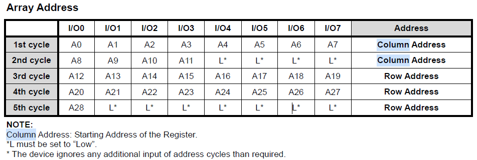

# F59L2G81A

## 특징

- 전압공급 : 3.3V(2.7V ~ 3.3V)
- 조직
  - 메모리 셀 어레이 : (256M + 16M) X 8bit
  - 데이터 레지스터 : (2K + 64) X 8bit
- 자동 프로그램 및 지우기
  - 페이지 프로그램 : (2K + 64) Byte
  - 블록 지우기 : (128 + 4K) Byte
- 페이지 읽기 작업
  - 페이지 크기 : (2K+64) Byte
  - 랜덤 읽기 : 25us(최대)
  - 직렬 액세스 : 25ns(최소)
- 메모리 셀 : 1bit /메모리 셀
- Fast Write Cycle Time(빠른 주기 시간)
  - 프로그램 시간 : 250us (Typ.)
  - 블록 지우기 시간 : 2ms (Typ.)
- 명령 / 주소 / 데이터 다중 I/O포트
- 하드웨어 데이터 보호
  - 전원 전환 중 프로그램 / 삭제 잠금
- 신뢰할 수 있는 CMOS 플로팅 게이트 기술
  - ECC 요구사항 : 4bit / 512Byte
  - 내구성 : 100K 프로그램 / 지우기 주기
  - 데이터 보유 : 10년
- 명령 레지스터 작업
- 파워업 옵션에서 자동 페이지 0 읽기
  - NAND 지원에서 부팅
  - 자동 메모리 다운로드
- NOP : 4 cycles
- 고성능 프로그램을 위한 캐시 프로그램 운영
- 캐시 읽기 작업
- 카피 백 작업
  - EDO 모드
  - OTP 운영
  - Two-Plane 운영

## 주문정보


## 일반적인 설명

이 장치는 여분의 16Mx8bit**(Spare Byte Size)** 용량이있는 256Mx8bit**(Main Byte Size)**입니다.

이 장치는 3.3V VCC 전원 공급 장치로 제공됩니다.
NAND 셀은 솔리드 스테이트 대용량 스토리지 시장에 가장 비용 효율적인 솔루션을 제공합니다.

메모리는 독립적으로 지울 수있는 블록으로 나누어 져있어 오래된 데이터는 지워지는 동안 유효한 데이터를 보존 할 수 있습니다.

장치는 64 페이지**(Block Page Size)**로 구성된 2048 개의 블록 **(Plane Block Size * Total Planes)**을 포함합니다.
32 시리즈 연결 플래시의 두 개의 NAND 구조로 구성
세포. 프로그램 작업을 통해 2112-Word 페이지를
일반적으로 250us 및 지우기 작업을 수행 할 수 있습니다.
X8 장치 블록의 경우 128K 바이트에서 2ms.

페이지 모드의 데이터는 당 25ns 주기로 읽을 수 있습니다.
워드. I / O 핀은 주소 및 명령을위한 포트 역할을합니다.
입력 및 데이터 입력 / 출력.

카피 백 기능을 통해 결함 블록 관리를 최적화 할 수 있습니다. 페이지 프로그램 작업이 실패하면 데이터를 동일한 어레이 섹션 내의 다른 페이지에 직접 프로그래밍 할 수 있습니다.

시간 소모적 인 직렬 데이터 삽입 단계없이.
캐시 프로그램 기능을 사용하면 캐시에 데이터를 삽입 할 수 있습니다.
데이터 레지스터가 플래시 어레이에 복사되는 동안 등록합니다.

이 파이프 라인 된 프로그램 작업은 프로그램을 향상시킵니다.
긴 파일이 메모리 내부에 기록 될 때 처리량.
캐시 읽기 기능도 구현됩니다. 이 기능을 통해
연속적인 경우 읽기 처리량을 크게 향상
페이지를 스트리밍해야합니다.

이 장치에는 추가 기능이 포함되어 있습니다. 전원을 켤 때 자동 읽기.

---

## PIN CONFIGURATION

> TSOPI 48L, 12mm X 20mm Body, 0.5mm Pin Pitch


## BALL CONFIGURATION

> BGA 63 BALL, 9mm X 11mm Body, 0.8 Ball  Pitch


## Pin Description


**=>** 

| Symbol    | Pin Name              | Functions                                                    |
| --------- | --------------------- | ------------------------------------------------------------ |
| I/O0~I/O7 | Data Inputs / Outputs | I / O 핀은 명령, 주소 및 데이터를 입력하고 읽기 작업 중에 데이터를 출력하는 데 사용됩니다.<br/>I / O 핀은 칩이 선택 해제되거나 출력이 비활성화되면 Hi-Z로 플로팅됩니다. |
| CLE       | Command Latch Enable  | LE 입력은 내부 명령 레지스터로 전송 된 명령의 활성화 경로를 제어합니다.<br/>명령은 CLE가 높은 WE 신호의 상승 에지에있는 I / O 포트를 통해 명령 레지스터에 래치됩니다. |
| ALE       | Address Latch Enable  | ALE 입력은 내부 주소 레지스터로 전송되는 주소의 활성화 경로를 제어합니다.<br/>주소는 ALE가 높은 WE의 상승 에지에있는 I / O 포트를 통해 주소 레지스터에 래치됩니다. |
| CE        | Chip Enable           | CE 입력은 장치 선택 컨트롤입니다. 장치가 Busy 상태에있을 때 CE high는 무시되고 장치는 프로그램 또는 지우기 작업에서 대기 모드로 돌아 가지 않습니다.<br/>읽기 동작 중 CE 제어에 대해서는 장치 작동의 '페이지 읽기'섹션을 참조하십시오. |
| RE        | Read Enable           | RE 입력은 직렬 데이터 출력 제어이며 활성 로우 일 때 데이터를 I / O 버스로 구동합니다.<br/>데이터는 내부 열 주소 카운터를 1 씩 증가시키는 RE의 하강 에지 이후에 유효한 tREA입니다. |
| WE        | Write Enable          | WE 입력 컨트롤은 I / O 포트에 기록합니다.<br/>명령, 주소 및 데이터는 WE 펄스의 상승 에지에서 래치됩니다. |
| WP        | Write Project         | WP 핀은 전원 전환 중에 의도하지 않은 프로그램 / 삭제 보호 기능을 제공합니다.<br/>내부 고전압 발생기는 WP 핀이 액티브 로우 일 때 리셋됩니다. |
| R/B       | Ready / Busy Output   | R / B 출력은 장치 작동 상태를 나타냅니다.<br/>낮으면 프로그램, 지우기 또는 임의 읽기 작업이 진행 중임을 나타내며 완료되면 높음 상태로 돌아갑니다.<br/>이는 오픈 드레인 출력이며 칩이 선택 해제되거나 출력이 비활성화 될 때 Hi-Z 상태로 플로팅되지 않습니다. |
| Vcc       | Power                 | VCC는 장치의 전원 공급 장치입니다.                           |
| Vss       | Ground                |                                                              |
| NC        | No Connection         | 리드는 내부적으로 연결되어 있지 않습니다.                    |

```bash
# Note
각 장치의 모든 VCC 및 VSS 핀을 공통 전원 공급 장치 출력에 연결합니다. VCC 또는 VSS를 분리 된 상태로 두지 마십시오.
```

### Hi-Z 상태

**디지털 회로에서의 하이 임피던스**

- 흔히들 MCU를 사용하여 Port제어를 할 때 `Hi-Z`상태라는 말을 자주 사용한다. 일단 하이 임피던스는 말 뜻 그대로 임피던스(교류저항)이 크다는 말이다.

  **> 하이 임피던스가 필요한 이유**

  ​	만약 한 개의 Data Bus에 여러 개의 메모리 소자가 연결되어 있다고 가정할 경우 메모리 소자가 모두 Data를 출력 하도록 설정되어 있을 경우 메모리 소자	간에 충돌이 발생하게 된다.

  ​	따라서 이를 해결하기 위해서 `Hi-Z`상태가 있어 다른 메모리가 Data를 출력하는 경우 출력 하는 Data와 상관없도록 하기 위해 필요한 것이다.

  ​	**다시 정리하면 같은 Data 버스를 공유하는 메모리들이 서로간의 충돌을 막기 위해 필요한 것이 `Hi-Z` 상태라고 생각하면 된다.**

  

- 디지털 로직 회로에서 하이임피던스라 함은 출력단자에 적용되는 것이다. 로직이 0이나 1을 나타내는 것은 전압을 가지고 나타내는 것인데, 해당 로직이 출력을 아예 내보내지 않을 때는 하이임피던스 상태로 두게 된다. 다시 말해서 출력 임피던스를 매우 높은 값이 되게 한다는 뜻이고, 그 말은 로직의 출력에 매우 높은 임피던스의 저항이 직렬로 연결된 것처럼 동작하게 한다는 뜻이고, 결과적으로는 전기 회로상에서 거의 단절된 것과 같게 만든다는 뜻이다.

- 이것을 tri-state(3가지 상태) output이라고 부를 수 있다. 여러 개의 로직 디바이스가 연결되어 있다고 하고 그 출력이 하나의 버스에 병렬로 묶여있다고 하면, 각각의 디바이스가 0 혹은 1 상태만을 내보낸다고 하면 모든 디바이스의 출력이 같다고 하면 모를까 서로 다른 경우에는 문제가 발생하게 된다. 그럴 때 출력을 내보낼 디바이스만 0 혹은 1을 내보내고 나머지 디바이스의 출력을 Hi-Z상태로 두면 사실상 이들 디바이스는 회로로부터 단절된 상태가 되니까 다른 디바이스의 출력에 영향을 주지 않게 된다.

- 다시 말해서 Hi-Z 출력을 둠으로써 하나의 버스(=와이어의 묶음)를 여러 개의 디바이스가 공유할 수 있게 되는 것이다. 이 얘기는 출력 임피던스가 크게 잡혀 있으면 실질적으로 외부에 미치는 영향이 미미해진다는 것도 아울러 이해할 수 있다.

**오디오 기기에서의 하이 임피던스**

- 반대로 오디오 기기에서는 하이 임피던스 입력은 중요한 의미를 갖는다. 이것은 출력 임피던스가 큰 장치가 그것에 연결된 다른 디바이스를 드라이브하는 힘이 미약한 경우에도 그 출력을 잘 받아들일 수 있다는 것을 의미한다. 출력 임피던스가 작은 경우는 말할 것도 없이 잘 받아낼 수 있다.
- 이것은 입력단에 입력임피던스가 매우 큰 FET(Field effect transistor:전계효과 트랜지스터:전기장(electric field)의 성질을 이용하여 전류를 제어하는 트랜지스터)가 달려있다는 것을 의미한다.
- 여기서 FET와 일반 TR(BJT: bipolar junction TR:쌍극 접합 트랜지스터: n과 p형 반도체를 각각 양극으로 붙여놓은 트랜지스터)이 어떻게 다른지 이야기하고 넘어가야 할 것 같다.
- 일반적인 TR(BJT)는 3개의 반도체가 접합되어있는 그림으로 주로 나타내는데, 실제 접합이 그렇게 되어있진 않지만 이해를 돕기 위해 그렇게 나타낸다. 중요한 것은 이들이 서로 붙어있다는 것이고, 접합면이 일종의 다이오드처럼 동작하기 때문에 3개의 단자로 모두 전류가 흘러야 정상정으로 작동한다.


- 일반적인 증폭작용은 E와 C단자 사이로 흐르는 전류를 B단자에서 컨트롤하는 식으로 이루어지게 되는 것인데, E와 C단자를 흐르는 전류의 양을 B로 들어가는 전류의 양으로 컨트롤 하게 된다. 다시 말해서 B단자로 어느 정도의 전류를 흘려 넣어야 증폭작용(=전류의 흐름제어)을 하게 만들 수 있단 말이다. 또, 다이오드이기 때문에 접합면을 넘기 위한 문턱전압(Threshold Voltage)이 넘어서야 전류를 흘릴 수 있다. 증폭회로에서 입력단으로 어느 정도의 전류가 흘러들어가야 한다는 것은 그 입력에 물리는 어떤 장치가 전류를 어느정도 내보낼 수 있는 능력이 있어야 함을 의미하고, 그렇지 못한다면 정상적인 동작을 하지 못하게 된다거나 신호가 급격히 약해지게 된다는 것도 의미한다. 쉽게 말해서 그 장치의 출력 전압이 고스란히 입력단으로 전달되지 못하는 것을 의미한다.
- 반면에 FET는 D,S 두 단자간의 전류의 흐름을 G(Gate)라는 단자의 전압으로 컨트롤한다. G단자로도 매우 약하게나마 전류가 흐르게 되지만 매우 작기 때문에 사실상 전압으로 전류흐름을 제어하는 성질을 갖게 된다. 따라서, 입력 임피던스가 매우 크다(왜냐면 입력단으로 거의 전류가 흘러갈 필요가 없으므로)고 할 수있고 입력단에 걸리는 전압을 입력단에 물린 장치의 출력 임피던스가 높더라도 잘 전달시켜줄 수 있다는 뜻이 된다.


- 여기서 흔히 나올 수 있는 질문은, 임피던스 문제로 신호가 작아지게 되도 다시 증폭해내면 되지 않느냐 할 수 있다. 증폭해내면 음량을 회복시킬 수 있겠지만, 임피던스가 매칭되지 않는 상황에서 손실되는 신호는 모든 주파수에 대해 일정하지 않기 때문에 특정 음역의 신호가 손실된 상태로 증폭되고, 신호가 손실된 만큼 증폭하다 보면 그 부분의 잡음이 부각되어 나타날 수 밖에 없다.
- 전공자들의 입장이 되면 TR/FET는 전자회로 해석 문제로 변질되어 실제 응용보단 증폭률과 입력/출력 임피던스, 주파수 응답을 얼마나 빠르고 정확하게 계산해 내느냐가 주된 문제가 되고, 반도체쪽 전공자 입장에서는 요구 사항에 맞게 어떻게 설계해야 (그려내야) 하는 가의 문제, 또 어떻게 하면 수율을 높일 수 있느냐의 문제 등이 관심사가 될 것이다. 오히려 비전공자들이 바라보는 세계가 더 재미있다. 전공자들에겐 이게 ‘재미’ 보단 ‘일’에 가깝다. 또 이미 일정 수준 이상의 기술은 사실상 그 수준이 포화에 이르러 ‘이미 다 되어있는데 뭘 더 해야 하나?’하는 생각을 하게 될지도 모를 것이다.
- 요새 많은 오디오용 OPAMP는 입력단이 HI-Z이다. 과거엔 그렇지 않은 opamp가 더 많았지만. 그래서 보급형 오디오카드들도 대부분 HI-Z 입력이다. 다이내믹 마이크 (배터리가 들어가지 않는 마이크, 혹은 팬텀 파워가 필요없는 마이크)를 곧바로 연결해서 쓸 수 있다. 피에조 센서를 사용하거나 매그네틱 픽업을 사용하는 기타를 연결해도 손실이 별로 없이 입력할 수 있다.

### 레지스터

> - 프로세서 레지스터(Processor Register)는 컴퓨터의 프로세서 내에서 자료를 보관하는 아주 빠른 기억 장소.
>
> - 일반적으로 현재 계산을 수행중인 값을 저장하는데 사용된다.
>
> - 대부분의 현대 프로세서는 메인 메모리에서 레지스터로 데이터를 옮겨와 데이터를 처리한 후 그 내용을 다시 레지스터에서 메인 메모리로 저장하는 `로드-스토어 설계`를 사용한다.
> - 레지스터는 메모리계층의 최상위에 위치하며 가장 빠른 속도로 접근 가능한 메모리이다.

**명령 레지스터**

​	현재 실행중인 명령어를 저장한다.

**주소 레지스터**

​	메모리 주소를 저장하여 메모리 접근에 사용되는 레지스터. 어떤 프로세서에서는 주소를 저장하는 것이 아니라 조작하기 위한 목적으로 색인레지스터를 사용

## BLOCK DIAGRAM


## ARRAY ORGANIZATION




Colum Address => cycle 2개

Row Address => cycle 3개


## PRODUCT INTRODUCTION

이 장치는 2,112x8 열에 의해 128K 행 (페이지)로 구성된 2,112Mbit 메모리입니다.

여분의 64x8 컬럼은 2,048 ~ 2,111의 컬럼 주소에서 위치합니다.

2,112 바이트 데이터 레지스터는 페이지 읽기 및 페이지 프로그램 작업 동안 I / O 버퍼와 메모리 사이의 데이터 전송을 수용하는 메모리 셀 어레이에 연결됩니다.

프로그램 및 읽기 작업은 페이지 단위로 실행되고 삭제 작업은 블록 단위로 실행됩니다.

메모리 어레이는 별도로 지울 수있는 2048 개의 128K 바이트 블록로 구성됩니다.

장치에서 비트 단위 지우기 작업이 금지되었음을 나타냅니다.

장치에는 8 개의 I / O로 멀티플렉싱 된 주소가 있습니다.

이 체계는 핀 수를 극적으로 줄이고 시스템 보드 설계의 일관성을 유지함으로써 향후 밀도로 시스템을 업그레이드 할 수 있도록합니다.

명령, 주소 및 데이터는 모두 CE가 낮을 때 WE를 낮게 설정하여 I / O를 통해 기록됩니다.

그것들은 WE의 상승 에지에 고정되어 있습니다.

명령 래치 활성화 (CLE) 및 주소 래치 활성화 (ALE)는 각각 I / O 핀을 통해 명령과 주소를 다중화하는 데 사용됩니다.

일부 명령에는 하나의 버스 사이클이 필요합니다.
예를 들어, 리셋 명령, 상태 읽기 명령 등은 하나의 사이클 버스 만 필요합니다. 페이지 읽기 및 차단과 같은 다른 명령
삭제 및 페이지 프로그램에는 두 개의 사이클이 필요합니다. 하나는 설정을위한 것이고 다른 하나는 실행을위한 것입니다.

향상된 아키텍처 및 인터페이스 외에도이 장치는 한 페이지에서 다른 페이지로 카피 백 프로그램 기능을 통합합니다.
외부 버퍼 메모리로 (부터) 데이터를 전송할 필요가 없습니다.