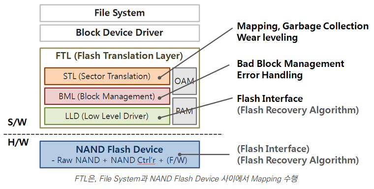
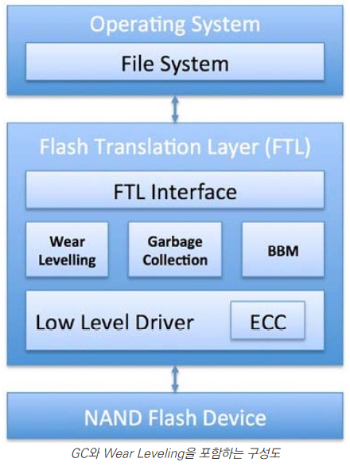

# SSD 기본

---

## 1. 메모리 셀타입

SSD(Soild state drive)는 플래시 메모리를 기반으로 하는 저장 장치이다. 각 비트들은 셀에 저장되는데, SSD의 셀은 1비트(SLC), 2비트(MLC), 3비트(TLC) 셀 타입이 있다.

## 2. 수명 제한

각 셀은 최대 가능한 P/E(Program/Erase) cycle을 가지며, 최대 가능한 P/E cycle을 초과하면 결함 셀(Defective cell)로 간주된다. 이는 NAND 플래시 메모리는 언젠가는 Wear-off되고 수명이 제한적이라는 것을 의미한다.

## 3. 벤치마킹의 어려움

테스트도 결국 사람이 수행하는 것이기 때문에, 모든 벤치마크는 오류나 실수를 담고 있다. 그래서 제조사나 제 삼자에 의한 벤치마킹 결과를 참조할 때는 주의해야 한다. SSD를 이용한 벤치마킹을 진행할 경우에는, 실제 사용할 SSD 드라이브와 최대한 응용 프로그램의 워크로드와 비슷한 인하우스 벤치마킹도구를 이용할 것을 권장한다. 마지막으로 응용프로그램의 요건(SLA)에 맞는 메트릭에 집중해서 벤치마킹 할 것을 권장한다.

# 페이지와 블록

---

## 4. NAND 플래시 블록과 페이지

SSD의 셀(Cell)을 블록(Block)으로 그룹핑되어 있으며, 블록(Block)은 다시 플레인(Plane)으로 그룹핑된다. SSD에서 읽고 쓰기의 가장 작은 단위는 페이지(Page)이며, 페이지는 단독으로 삭제(Erase)되지 못하고 블록(Block)단위로만 삭제될 수 있다. NAND 플래시 페이지 사이즈는 제품이나 제조사 별로다양한데, 대부분의 SSD는 2KB와 4KB 그리고 8KB와 16KB를 페이지 사이즈로 사용하고 있다.

또한 대부분의 SSD에서는 하나의 블록은 128개 또는 256개의 페이지를 가지므로, 블록의 사이즈는 256KB에서 4MB까지 다양한 사이즈를 가지게 되는 것이다. 예를들어서 삼성 SSD 840 EVO는 2048KB의 블록 크기를 가지며, 각 블록은 256개의 8KB크기 페이지를 가지고 있다.

## 5. 읽기는 페이지 단위로 실행(Align)

SSD 드라이브에서는 페이지 하나의 크기보다 작은 사이즈의 데이터를 읽을 수는 없다. 물론 응용 프로그램이나 운영 체제에서는 단 1개의 바이트도 읽을 수는 있지만, 실제 SSD 내부적으로는 하나의 페이지 전체를 읽어서 불필요한 데이터는 모두 버리고 사용자가 원하는 하나의 바이트만 리턴해주는 것일 뿐이다.

## 6. 쓰기는 페이지 단위로 실행(Align)

SSD에 쓰기를 할 때에는 SSD의 페이지 크기의 배수로 처리된다. 그래서 단지 1바이트만 SSD에 기록하는 경우에는 최소 하나의 페이지 크기의 데이터가 기록되어야 한다. 필요 이상으로 데이터를 기록해야 하는 것을 "Write amplication"이라고 하며, SSD 드라이브에 쓰기를 하는 것을 "program"이라고도 한다.

## 7. 페이지는 덮어쓰기 안됨

NAND 플래시 페이지는 "free" 상태일때에만 데이터를 저장(program) 할 수 있다. 데이터가 변경되면 이전 버전의 페이지는 SSD의 내부 레지스터로 복사된 후 데이터가 변경되고 그리고 새로운 버전의 데이터는 새로운 "free"상태의 페이지에 기록되는데 이를 "read-modify-update"라고 한다.

또한, SSD에서 변경된 데이터는 기존 위치에 업데이트되지 못하고, 항상 새로운 "free"상태의 페이지에만 저장될 수 있다. 일단 데이터가 SSD 드라이브에 영구히 저장되면, 이전 버전의 데이터를 가지고 있는 페이지는 "stale" 상태로 마킹되고 Garbage-collection에 의해서 삭제(Erase)될 때까지 그 상태로 남아있게 된다.

***'stale' 상태: 무효경과 상태***

=> 컴퓨터 처리에서, 만약 한 프로세서가 피연산자의 값을 변경하고, 그리고 이어서 그 피연산자를 불러왔을 때 피연산자의 새로운 값이 아닌 변경되기 이전의 값을 가지고 왔다면 이때 그것을 stale data라고 부른다.

=> 프로세서가 하나인 단일 프로세서 상황에서는 스테일 데이터가 허용되지 않는다. 이것은 프로세서가 자신의 행동에 관한 기본적인 기대치를 위반하였다는 것을 의미한다. 그러나 공유메모리 다중 프로세서에서 프로세스들 간에 공유된 피연산자 상에 스테일 데이터가 생성되는 것은 용인할 수 있는 것으로 간주된다. 그러한 피연산자를 위해 바라는 목표는 스테일데이터가 보이는 것을 막기 위해 프로그램들이 극소 명령어나 위험부분 루틴 등과 같은 에방조치를 취하게 될 것이라는 것이다.

## 8. 삭제(Erase)는 블록 단위로 실행(Aligned)

SSD의 페이지는 덮어쓰기할 수 없다. 일단 페이지가 "stale"상태로 바뀌면, 그 페이지를 다시 사용하기 위해서는 반드시 삭제(Erase)과정을 거쳐야 한다. 그러나 페이지는 단독으로 삭제될 수 없으며, 그 페이지를 포함한 블록이 통째로 삭제(Erase)될 때에만 "free"상태로 바뀔 수 있다.

# SSD 컨트롤러와 인터널

---

## ***9. FTL(Flash Translation Layer)******

### 가.FTL의 개념

- 플래시메모리와 파일시스템 사이에 위치하면서, 플래시 메모리를 디스크처럼 사용할 수 있게 해주는 사상(Mapping)기술

### 나. FTL의 필요성

- 플래시 메모리 섹터들의 최대 지우기 횟수의 유한한 결점을 보완하는 역할
- DISK I/O를 플래시 메모리에서 동작할 수 있도록 지원
- NAND 플래시 한계 : 쓰기보다 지우기가 느린 특성

### 다. FTL의 계층 구조

### 라. FTL의 구성 요소

1. STL(Sector Translation Layer)
   - Address Mapping, Garbage Collection, Wear Leveling 등 담당
   - Address Mapping : 파일 시스템으로부터 논리적 주소를 NAND Flash Memory의 물리적 주소로 연결
2. BML(Bad-Block Management Layer)
   - 무효화된 페이지를 많이 가지고 있는 블록을 선택 후, 유효 페이지를 다른 블록에 복사하여 블록을 삭제하여 재사용 해주는 기법
3. LLD(Low Level Driver)
   - NAND Flash를 사용하기 위한 Driver

### 마. FTL의 핵심기술

1. Wear Leveling
   - 블록당 Writer 횟수를 모니터하여, 균등하게 분배
   - 특정 블록에만 Write되는 것을 방지하여, 수명 연장
2. Garbage Collection
   - 블록을 실제로 삭제하지 않고, 표기 후 적절한 시점에 일괄 삭제처리하는 기술
   - Java의 GC와 유사한 기술, 삭제효율화
3. Over Provisioning
   - Wear Leveling, GC를 작업하기 위한 여유공간

### 바. FTL의 매핑방식

1. Sector Mapping
   - read, write 단위인 섹터 단위로 사상테이블 생성
   - 장점 : update시, 정보만 변경한 data를 쓸 수 있음, erase 연산 최소화
   - 단점 : 사상테이블 크기가 커질 수 있음
2. Block Mapping
   - Erase 단위인 블록 단위로 사상 테이블 생성
   - 장점 : 사상테이블의 크기 최소화 가능
   - 단점 : 같은 논리 주소에 쓰기 연산이 많이 요청되는 경우 성능저하
3. Hybrid Mapping
   - Sector와 Block을 혼합한 기법
   - 장점 : Sector와 Block의 장점 혼합
   - 단점 : 구현의 복잡한 문제 존재

FTL(Flash translation layer)는 호스트의 논리 블록 주소를 SSD의 물리 블록 주소로 맵핑해주는 SSD컨트롤러의 컴포넌트이다. 최근의 SSD 드라이브는 대부분 Log structred 파일 시스템과 비슷한 작동 방식을 가진 "hybrid log-block mapping"나 그로부터 파생된 블록 맵핑 알고리즘을 사용하고 있다. "hybrid log-block mapping" 맵핑 알고리즘은 랜덤쓰기를 시퀀셜하게 변환해주는 장점을 가지고 있다.

## 10. 내부 병렬 처리

SSD 드라이브는 내부적인 병렬 처리 기능을 가지고 있는데, 이 병렬 처리 기능은 NAND 플래시 칩 단위로 여러 블록들에 동시에 쓰기할 수 있도록 해준다. 이렇게 한번엡여렬로 액세스할 수 있는 블록들의 그룹을 "Clustered block"이라고 한다.

## 11. Wear leveling

웨어 레벨링(Wear Leveling)은 플래시 장치의 모든 블록에 데이터를 균등하게 기록함으로써 특정 블록의 과도한 사용을 방지하여 플래시 제품에서 일어날 수 있는 장치 오류 및 데이처 손실을 사전에 예방하며 제품의 내구성과 안정성을 향상시키는 것

가장 낮은 지우기 횟수를 가진 블록에 쓰기 작업이 우선 수행되도록 하고, 전체 장치에 대한 쓰기 작업을 평균화하여 장치의 수명을 늘려준다. 트랜센드의 전 플래시 제품 라인업은 제품 내구성과 신뢰성을 보장하기 위한 웨어 레벨링 기능을 지원.

NAND 플래시 셀은 데이터 쓰기를 할 수 있는 회수 제한이 있어서, 이 제한을 넘어서면 해당 셀은 더 이상 사용할 수 없게 된다. 이런 현상을 "Wear-off"라고 하는데, FTL은 최대한 SSD의 셀들이 최대한 골고루 사용될 수 있도록 쓰기 작업을 분산해준다. 이상적으로는 SSD의 모든 셀들이 동시에 그들의 P/E cycle 한계에 도달하도록 하는 것이 FTL의 중요한 목표인 것이다.

## 12. Garbage collection

SSD 컨트롤러의 Garbage-collection은 "stale" 상태의 페이지를 삭제하여 다시 사용 가능한 "free"상태로 만들어준다. "stale"상태의 페이지는 "free"상태로 전환되지 않고서는 재사용될 수 없다.

## 13. 백그라운드 오퍼레이션은 유저 오퍼레이션에 영향을 미침

Garbage-collection과 같은 백그라운드 오퍼레이션은 호스트로부터 유입되는 사용자 요청(포그라운드 오퍼레이션)에 좋지 않은 영향을 미치게 된다. 대표적으로 지속적인 작은 랜덤 쓰기가 발생하는 상황에서는 더욱 더 성능상 나쁜 영향을 미치게 된다.

# 액세스 패턴

---

## 14. SSD는 페이지 크기보다 작은 데이터만 쓰기할 수 없음

"Read-modify-write" 오퍼레이션으로 인한 "Write Amplication"(WA)을 최소화하기 위해서, 가능하다면 NAND 플래시의 페이지 크기로 SSD 드라이브에 쓰기를 하는 것이 좋다. 현재까지 출시된 SSD제품들 중에서 가장 큰 페이지 사이즈는 16KB이므로, 가능하면 16KB 정도를 기본 쓰기 데이터 사이즈로 선택하는 것이 좋다. SSD의 페이지 사이즈는 SSD 제조사나 모델별로 상이하며, 또한 SSD 기술 발전으로 더 크게 증가할 수도 있다.

## 15. 쓰기 맞춤(Align writes)

SSD 드라이브에 쓰기를 할 때에는 페이지 사이즈에 맞춰서(Align) 호출하는 것이 좋으며, 페이지 사이즈의 배수로 데이터를 기록하는 것은 더더욱 권장한다.

## 16. 작은 데이터 쓰기는 버퍼링 후 실행

최대희 스루풋을 위해서, 가능한 작은 사이즈의데이터 쓰기는 메모리에 모아서 버퍼링했다가 버퍼가 가득 차면 SSD 드라이브로 기록하는 것이 좋다. 작은 데이터 쓰기들을 모아서 배치로 하번의 쓰기요청으로 처리하는 것이 좋다.

## 17. 읽기 성능 향상을 위해서, 관련된 데이터는 한번에 같이 저장

읽기 성능으 쓰기 패턴의 결과라고 볼 수 있다. 만약 대용량의 데이터가 한번에 SSD드라이브에 쓰여진다면, 그 데이터들은 NAND 플래시 칩의 여러 위치로 분산 저장된다. 그래서 연관된 데이터는 동일 페이지와 블록 그리고 Clustered block에 기록하는 것이 좋다. 그래야지만 나중에 (SSD의 내부 병렬 처리의 도움을 받아서) 한번의 I/O 요청으로 데이터를 빠르게 읽을 수 있기 때문이다.

## 18. 읽기와 쓰기 요청은 분리 실행

읽기와 쓰기가 동시에 실행되는 워크로드에서는 SSD 내부적인 캐싱과 Readahead 메커니즘의 효과를 얻기 어려우며, 이로 인해서 스루풋이 떨어질 수도 있다. 이렇게 읽고 쓰기가 혼합된 형태의 워크로드는 가능하다면 읽기와 쓰기를 대용량(가능하다면 Clustered block 크기에 맞춰서)으로 순차적으로 실행할 수 있도록 유도하는 것이 좋다. 예를 들어서 1000개의 파일을 읽고 변경해야 한다면, 하나씩 파일을 읽어서 변경하는 형태보다 한번에 1000개의 파일을 읽어서 처리한 후 1000개의 파일을 변경하는 형태가 더 SSD의 처리 효율성에는 도움이 된다.

## 19. 불필요한 데이터는 배치로 삭제

> Invalidate obsolete data in batch

SSD 드라이버의 데이터가 더이상 필요치 않아서 삭제하고자 할 때에는, 삭제 요청을 일정량 모아서 한번의 오퍼레이션으로 삭제하는 것이 좋다. 이는 SSD 컨트롤러의 Garbage-collection이 한 번에 더 큰 영역을 처리할 수 있도록 해주며, 그로 인해서 SSD의 내부적인 프레그멘테이션을 최소할 수 있다.

## 20. 랜덤쓰기가 연속쓰기보다 항상 느린것은 아니다

> Random writes are not always slower than sequential writes

SSD 드라이브에 기록하고자 하는 데이터가 작다면(SSD의 Clustered block보다 작은 경우), 랜덤 쓰기는 시퀀셜쓰기보다 느리게 처리될 것이다. 만약 쓰기가 ,Clustered block 크기와 일치하거나 Clustered block의 크기의 N배수(정확하게)인 경우에는, 랜덤쓰기라 하더라도 SSD의 내부 병렬 처리능력을 활용할 수 있게 된다. 랜덤 쓰기라 하더라도 SSD의 병렬 처리 능력을 활용할 수 있다면 시퀀셜쓰기만큼의 스루풋을 얻을 수 있다. 대부분의 SSD드라이브에서 Clustered block의 사이즈는 16MB에서 32MB정도이므로, 32MB정도의 데이터를 한 번에 쓰기할 수 있으면 최적의 성능을 얻을 수 있다.

## 21. 단일 쓰레드로 대량 읽기가 멀티 쓰레드의 소량 데이터 읽기보다 나은 스루풋 보장

동시에 여러 쓰레드로 실행되는 읽기 요청은 SSD드라이브의 Readahead 메커니즘을 100% 활용하기 어렵다. 게다가 한번에 여러 논리 블록 주소를 액세스하는 것은 결국 하나의 NAND 플래시 칩으로 집중될 수 있고, 이런 경우에는 SSD의 내부 병렬 처리 능력을 활용하지 못하게 된다. 연속된 블록을 대용량으로 읽는 오퍼레이션은 SSD 드라이브의 Readahead 버퍼를 활용(SSD 드라이브가 Readahead cache를 가지고 있는 경우)할 수 있으며, 또한 내부적인 병렬 처리 기능까지 활용할 수 있다.결과적으로 가능하다면 요청을 버퍼링했다가 한번에 큰 데이터를 읽는 형태가 스루풋 향상에 도움이 된다.

## 22. 단일 쓰레드로 대량 쓰기가 멀티 쓰레드의 소량 데이터 쓰기보다 나은 스루풋 보장

단일 쓰레드로 대용량의 데이터를 쓰는 것은 많은 쓰레드로 동시에 작은 데이터를 쓰는 것 만큼의 스루풋을 얻을 수 있따. 하지만 단일 쓰레드로 대용량의 데이터를 기록하는 것이 레이턴시(응답 속도)측면에서는 여러 쓰레드로 동시에 쓰기를 하는 것보다 빠르게 처리된다. 그래서 가능하다면, 단일 쓰레드로 대량의 데이터를 한꺼번에 기록하는 것이 좋다.

## 23. 소량 데이터 쓰기를 버퍼링하거나 그룹핑할 수 없을때는, 멀티 쓰레드로 실행

멀티 쓰레드로 작은 데이터를 아주 빈번하게 쓰기 요청을 실행하는 것은 단일 쓰레드로 작은 쓰기를 실행하는 것보다는 더 나은 스루풋을 낼 것이다. 그래서 작은 데이터 쓰기가 배치 형태로 묶어서 처리될 수 없다면, 멀티 쓰레드로 실행하는 것이 좋다.

## 24. 콜드 데이터와 핫 데이터 분리

핫(Hot) 데이터는 빈번하게 읽고 변경되는 데이터를 의미하며, 반대로 콜드(Cold)데이터는 그렇지 않은 데이터를 말한다. 만약 핫 데이터가 콜드 데이터와 함께 동일 페이지에 저장되어 있다면, 콜드 데이터는 핫 데이터가 Read-modify-write 형태로 변경될 때마다 항상 같이 복사되어야하며 또한 Wear-leveling을 위해서 Garbage-collection이 해당 페이지를 이동시킬 때에도 동일하게 콜드데이터가 항상 같이 다른 페이지로 이동되어야 한다. 콜드 데이터와 핫 데이터를 분리하는 것은 Garbage-collection이 좀 더 빠르고 효율적으로 처리될 수 있도록 도와줄 것이다.

## 25. 핫 데이터는 버퍼링해서 배치로 업데이트

매우 빈번하게 변경되는 핫 데이터나 메타 데이터는 최대한 시스템의 메모리에 캐시되거나 버퍼링될 수 있도록 유지하고, SSD 드라이브에 변경되는 빈도를 최소화 해주는 것이 좋다.

# 시스템 최소화

---

## 27. Over-provisioning은 Wear-leveling과 성능 향상에 많은 도움이 된다.

SSD 드라이브는 최대 물리 용량보다 더 작은 용량으로 파티션을 생성함으로써 Over-provisioning공간을 할당할 수 있다. 남은 공간은 사용자나 호스트에게는 보이지 않지만 SSD 컨트롤러는 여전히 남은 물리 공간을 활용할 수 있다. Over-provisioning 공간은 NAND 플래시 셀의 제한된 수명을 극복하기 위한 Wear-leveling이 좀 더 원활하게 처리될 수 있도록 도와준다. 데이터 쓰기가 아주 빈번한 경우에는 성능 향상을 위해서 전체 용량의 25% 정도의 공간을 Over-provisioning 공간을 할당하는 것이 좋으며, 그렇게 쓰기 부하가 심하지 않은 경우에는 10%~15% 정도의 공간을 Over-provisioning 공간으로 할당해주는 것이 좋다.

Over-provisioning공간은 NAND 플래시 블록의 버퍼처럼 작동하기도 하는데, 이는 일시적으로 평상시보다 높은 쓰기 부하가 발생하더라도 Garbage-collection이 충분한 "free" 상태 페이지를 만들어 낼 수 있도록 완충 역할을 해준다.

## 28. TRIM 명령의 활성화

운영체제의 커널과 파일 시스템이 TRIM 명령을 지원하는지 확인하도록 하자. TRIM 명령은 운영 체제나 파일 시스템 레벨에서 삭제된 블록의 정보를 SSD 컨트롤러에게 알려주는 역할을 한다. SSD컨트롤러는 새로운 쓰기 요청들을 위해서, 시스템이 한가한 시간에 Garbage-collection을 실행하는데, TRIM명령으로 삭제된 블록 정보를 SSD 컨트롤러가 받을 수 있으면 Garbage-collection의 삭제(Erase)작업이 훨씬 효율적으로 처리될 수 있다.

## 29. 파티션 얼라인(Align the partition)

쓰기 요청이 NAND 플래시의 물리 메모리와 맞춰지려면 (Alignment), SSD 드라이브를 파티셔닝하고 포맷할때 NAND플래시의 페이지 크기와 일치(Align)시켜야 한다.