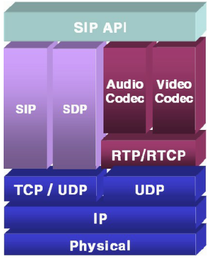
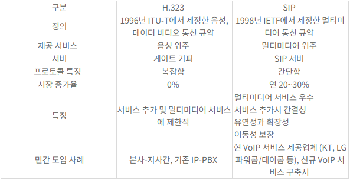
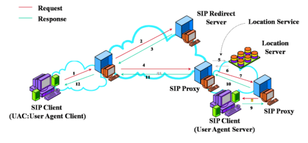
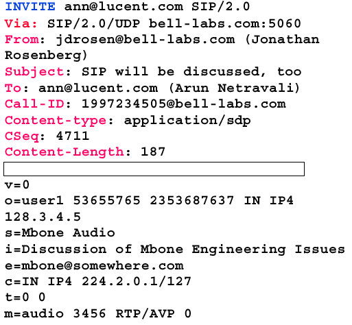
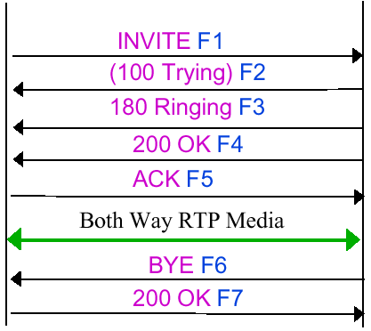

# VoIP

---

> **Voice over Internet Protocol**
>
> **IP네트워크를 활용하여 음성을 데이터 패킷으로 변환해서 통화를 가능하게 하는 통신 서비스 기술**

**VoIP**는 IP를 사용하여 음성전보를 전달하는 일련의 설비들을 위한 IP 전화기술을 지칭하는 용어이다. 일반적으로, 이것은 공중교환전화망인 PSTN 처럼 회선에 근거한 전통적인 프로토콜들이 아니라, 불연속적인 패킷들 내에 디지털 형태로 음성정보를 보낸다는 것을 의미한다.

**VoIP**와 인터넷 전화기술의 주요장점은 기존 IP네트웍을 그대로 활용해 전화서비스를 통합 구현함으로써 전화 사용자들이 시내전화 요금만으로 인터넷, 인트라넷 환경에서 시외 및 국제전화 서비스를 받을 수 있게 된다는 점이다.

**VoIP**는 공중 인터넷 또는 기업 내부의 인트라넷 상에서 IP를 이용해 음성(소리)와 비디오를 전송하기 위한 표준인 ITU-T H.323의 사용을 장려하기 위해, **VoIP**포럼을 통해 시스코, 보컬텍, 3Com, 넷스피크 등 주요 장비제자고히사들이 노력함으로써 이루어졌다. **VoIP**포럼은 또한 디렉토리 서비스 표준을 장려함으로써, 사용자들이 다른 사용자들의 위치를 찾아낼 수 있고, 자동 전화분배와 음성메일을 위한 터치폰 신호의 사용을 가능하게 하였다.

**VoIP**는 원래의 IP기능에 더하여, 패킷들이 적시에 도착하도록 지원하기 위해 **RTP**를 사용한다. 공중 네트웍을 사용하려면, 현재 서비스 품질(QoS)을 보장하기에 어렵다. 

독자적인 기업이나, 인터넷 전화서비스 공급자(ITSP)에 의해 관리되는 사설 네트웍을 사용하면 더 나은 서비스가 가능하다. 빠른 패킷 전달을 보장하기 위해 넷스피크라는 장비제작자에 의해 사용되는 기술은, 상태편과 `TCP` 소켓접속을 확립하기 전에 공중 네트웍에 접속되

어 있는 모든 네트웍 게이트웨이에핑을 해서, 그 결과를 토대로 가장 빠른 경로를 선택하는 것이다.

## VoIP 특징

- 패킷망 사용으로 이용요금이 저렴하다.
- 멀티미디어를 통합합으로 영상통화, 메시징 등 다양한 기술 구현이 가능하다.
- 통합망을 구성함으로써 회신 교환망보다 효율적인 망 관리가 가능하다.
- 기존에 구축된 인터넷 장비(Router, Switch) 등을 활용함으로써 구축비용이 상대적으로 저렴하다.
- 신규 서비스 개발과 수요 창출에 따른 새로운 수익 창출이 가능하다.

저렴한 요금이나 다양한 서비스로 유선통신을 주도할 `All IP`, `BcN`, `NGN`, `NGcN` 등에서 활용될 것이다.

실제로 070 전화와 같은 인터넷 전화로의 활용은 시장에서 자리를 잡았다.

아직 PC 기반이나 스마트폰과 같은 모바일 기반의 **VoIP**시장의 확산은 좀 기다려 봐야겠지만, FMC 등의 등장으로 기대해볼만 하다.

## VoIP 구현 기술

`VoIP`를 구현하기 위한 기본 기술들을 살펴보자.

- **`H.323`** : ITU-T에서 제정한 음성, 데이터, 비디오 통신 규약으로 음성 위주로 지원을 하고 있다. SIP의 등장과 함께현재는 성장세가 둔화되고 있다.
- **`SIP`** : IETF에서 제정한 멀티미디어 통신규약으로 멀티미디어 장점을 보유하고 있고 현재 급속히 성장하고 있다. 통화와 같은 실시간 통신을 위해서 내부적으로 `RTP`라는 프로토콜을 사용한다.
- **`MGCP(Media Gateway Control Protocol)`** : 중계를 위한 게이트웨이 기술로 일부 통신 사업자들이 사용중이다. 실제 통화를 중계하는 프로토콜
- **`megaco(MEdia GAteway COntrol)`** : MGCP와 같은 중계를 위한 게이트 웨이 기술로 ITU-T/IETF의 공통 표준화 작업으로 만들었다.

## Mobile VoIP

인터넷 전화와 같은 서비스는 유선환경에서 연결하는 **`VoIP`**라 할 수 있다.

**`VoIP`**의 단말이나 네트워크의 발전을 살펴보면 결국에는 모바일 환겨응로 이동할 것이라고 많은 전문가들이 예측하고 있다.

- **`VoIP `** 지원 단말 : PC > 전용 IP폰 > 일반전화 > 휴대폰/휴대용기기
- **`VoIP`** 네트워크 : PSTN > IP Network > 이동통신망

그렇다면 모바일 **`VoIP`**는 기존의 유선(Fixed) **`VoIP`**와 어떤 차이가 있을까?

유선 **`VoIP`**는 초고속 인터넷망을 기반 인프라로 활용하는데 반해, 

모바일 **`VoIP`**는 모바일 브로드밴드망인 무선랜(Wi-fi 등), WiBRO(WiMAX), 이동통신의 3G망이 사용된다는 것이다.

모바일 **`VoIP`**의 구성형태는 다음과 같다.

- **반이중 방식 `VoIP`(Half-duplex VoIP)**

  - PTT(Push To Talk)가 대표적이다.

  - Hafl Duplex이므로 한 쪽 방향으로만 전송이 가능하도록 구현된 통신기술이다.

- **이동전화 망연동 `VoIP`(Cellular bypass VoIP)**

  - 뉴스에 많이 나오는 FMC를 생각하면 된다.
  - 홈존 VoIP와 핫스팟 VoIP로 나뉜다
  - *홈존 VoIP*
    - 홈존(Home Zone) 내에서는 패킷망을 통해 유선전화 수준의 요금을 제공하고, 밖에서는 일반적인 이동통신 서비스를 제공하는 일종의 FMC(Fixed Mobile Convergaence) 서비스
  - *핫스팟 VoIP*
    - 핫스팟(Hot Spot) 지역에서는 무선랜 망을 이용하여 VoIP서비스를 제공하고, 핫스팟을 벗어나면 이동전화망을 이용해서 서비스를 제공

  => 둘의 차이는 패킷망을 통한 **`VoIP`**서비스를 어느 지역에서만 허용할 것인지에 따라 다르다.

  - *셀룰러망 이용 VoIP*
    - WCDMA, HSDPA, EVDO와 같은 3G 이통망 또는 WiMAX와 같은 데이터전용 브로드밴드망을 활용해서 음성통화를 구현하는 것으로 최근 이슈화되고 있다. IMT-Advanced 등 4G 통신망으로 업그레이드 되고 `All IP`가 구현되어 음성과 데이터의 융합, 통신과 방송의 융합, 유선과 무선의 융합이 가속화 될 경우 이런 형태의 서비스가 **`VoIP`**의 구현과 확산에 기여할 것으로 예상된다.

# SIP

---

> **Session Initiation Protocol**
>
> **멀티미디어 통신에 있어 세션이나 신호(Call)을 관리하는 프로토콜**

멀티미디어 데이터 전송 자체보다는 Signaling을 통한 멀티미디어 통신 관리에 중점을 두고 있다.

다시 말해, 멀티미디어 데이터 전송은 실시간 전송을 기반으로 하는 **`RTP`**가 담당하고 **`SIP`**는 어플리케이션 레벨의 프로토콜

다음은 실제 **`SIP`**의 프로토콜 스택이다.

- `SIP` (RFC 3261) : SIP 기본 내용 정의
- `SDP` (Session Description Protocol, RFC 4566/3264) : 멀티미디어 세션 파라미터 설정
- `Audio Codec` (G.711A, G.723.1, G.729A) : 음성 코딩 담당, 다양한 시스템과 호환을 위해 여러 규격 존재
- `Video Codec` (H.263, MPEG-4, H.264) : 비디오 코딩, H.263이 공통으로 사용되며 H.264는 최신 버전
- `RTP/RTCP` (Realtime Transport (Control) Protocol, RFC 3550/3551) : 실시간 통신

## SIP 특징

- **`SIP`**는 패킷 교환망에서 회선교환망 방식의 제어가 가능하도록 세션을 제어한다.
- 패킷망의 인터넷 상에서 멀티미디어 어플리케이션이 간으하게 한다.
- URL 및 E-Mail형식의 텍스트 기반 어드레싱 방법을 사용하므로 메시지 파싱이나 확장이 용이하다.

일반적으로 SIP는 기존의 비슷한 기능을 제공했던 `H.323`와 많이 비교하고 있다. 살펴보도록 하자.

초기 `H.323`에서 현재는 **`SIP`**기반의 단말이 많이 늘어나고 있는 추세이다.

## SIP 구성요소

**`SIP`**시스템의 구성요소는 SIP 클라이언트와 SIP 서버로 나누어 볼 수 있따.

- SIP 클라이언트

  - UAC(User Agent Client) :  세션 종단에위치하며 호를 생성하고 설정을 요청한다.
  - UAS(User Agent Server) : UAC로부터 호를 수락하거나 거절 또는 Redirect한다.

- SIP 서버

  *UA간 직접 호출이 가능하지만 SIP 서버를 둠으로 확장성을 제공한다.*

  - Proxy Server : UAC로부터 SIP콜을 받아 자신이 콜을 대신 만들어 주는 역할을 한다.
  - Register Server : 사용자의 에이전트로부터 레지스터 요청을 수신하여 사용자의 위치 정보를 유지한다.
  - Redirect Server : 사용자가 직접 요청할 수 있는 상대방의 URL을 알려준다.
  - Location Server : Proxy Server나 Redirect Server로부터 SIP 콜의 목적지 노드의 주소가 요청되면 이를 Resolution 해주는 역할을 한다.

  이들 간의 상호관계는 다음 그림과 같다

## SIP 메시지

실제 SIP의 요청 메시지를 보면 다음과 같은 형태로 되어 있다.

**INVITE** 메시지가 전송되는 것을 알 수 있다.

**INVITE**나 **From**에 보면  이메일 형태의 어드레스가 사용됨을 알 수 있다.

또한 **Content-type**을 보면 `application/sdp`로 되어 있어 SIP의 body에는 SDP(Session Description Protocol)이 사용된다는 것을 알 수 있다.

SDP가 적용된 body를 보면 `RTP/AVP`와 같은 미디어의 형태를 표현하고 있다.

Proxy나 Redirect가 없는 가장 기본적인 형태의 흐름은 다음과 같다.

