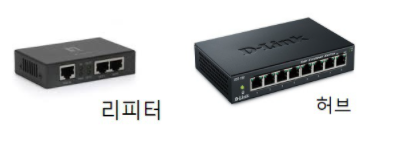
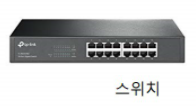
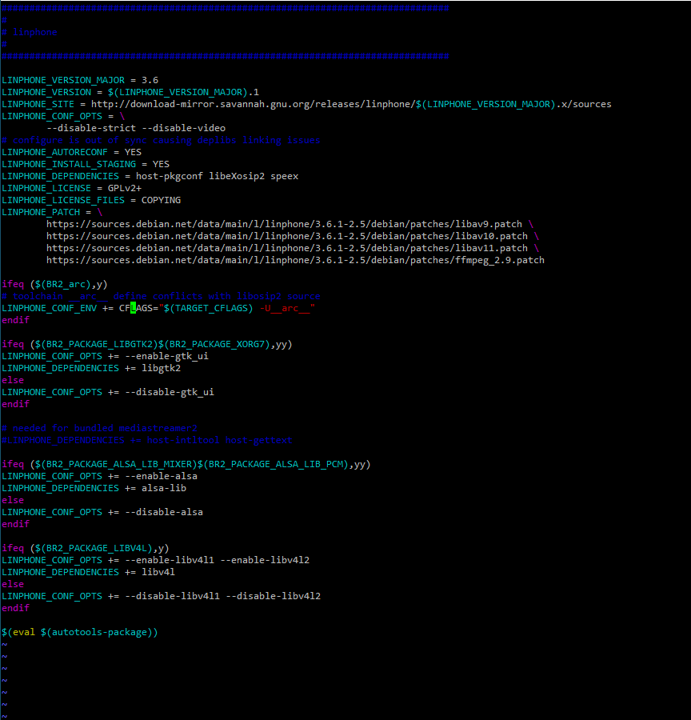
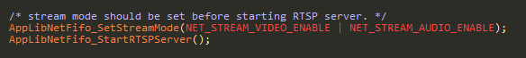
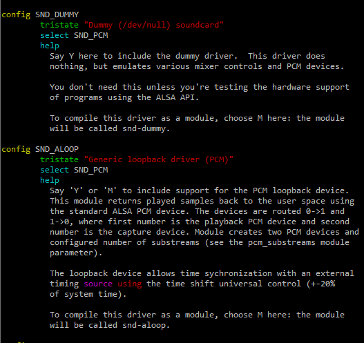
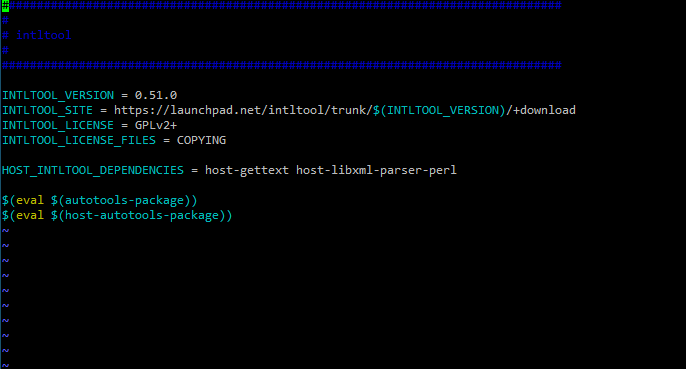
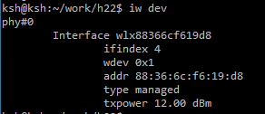
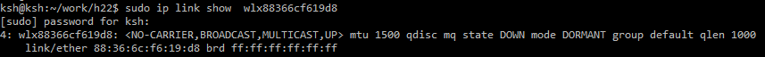
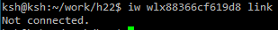
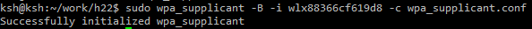

# **VoIP**

---

> **Voice over Internet Protocol**
>
> **IP네트워크를 활용하여 음성을 데이터 패킷으로 변환해서 통화를 가능하게 하는 통신 서비스 기술**

**VoIP**는 IP를 사용하여 음성전보를 전달하는 일련의 설비들을 위한 IP 전화기술을 지칭하는 용어이다. 일반적으로, 이것은 공중교환전화망인 PSTN 처럼 회선에 근거한 전통적인 프로토콜들이 아니라, 불연속적인 패킷들 내에 디지털 형태로 음성정보를 보낸다는 것을 의미한다.

**VoIP**와 인터넷 전화기술의 주요장점은 기존 IP네트웍을 그대로 활용해 전화서비스를 통합 구현함으로써 전화 사용자들이 시내전화 요금만으로 인터넷, 인트라넷 환경에서 시외 및 국제전화 서비스를 받을 수 있게 된다는 점이다.

**VoIP**는 공중 인터넷 또는 기업 내부의 인트라넷 상에서 IP를 이용해 음성(소리)과 비디오를 전송하기 위한 표준인 ITU-T H.323의 사용을 장려하기 위해, **VoIP**포럼을 통해 시스코, 보컬텍, 3Com, 넷스피크 등 주요 장비제작회사들이 노력함으로써 이루어졌다. **VoIP**포럼은 또한 디렉토리 서비스 표준을 장려함으로써, 사용자들이 다른 사용자들의 위치를 찾아낼 수 있고, 자동 전화분배와 음성메일을 위한 터치폰 신호의 사용을 가능하게 하였다.

**VoIP**는 원래의 IP기능에 더하여, 패킷들이 적시에 도착하도록 지원하기 위해 **RTP**를 사용한다. 공중 네트웍을 사용하려면, 현재 서비스 품질(QoS)을 보장하기에 어렵다. 

독자적인 기업이나, 인터넷 전화서비스 공급자(ITSP)에 의해 관리되는 사설 네트웍을 사용하면 더 나은 서비스가 가능하다. 빠른 패킷 전달을 보장하기 위해 넷스피크라는 장비제작자에 의해 사용되는 기술은, 상태편과 `TCP` 소켓접속을 확립하기 전에 공중 네트웍에 접속되어 있는 모든 네트웍 게이트웨이에 핑을 해서, 그 결과를 토대로 가장 빠른 경로를 선택하는 것이다.

## :black_nib: ​VoIP 특징

- 패킷망 사용으로 이용요금이 저렴하다.
- 멀티미디어를 통합함으로 영상통화, 메시징 등 다양한 기술 구현이 가능하다.
- 통합망을 구성함으로써 회선 교환망보다 효율적인 망 관리가 가능하다.
- 기존에 구축된 인터넷 장비(Router, Switch) 등을 활용함으로써 구축비용이 상대적으로 저렴하다.
- 신규 서비스 개발과 수요 창출에 따른 새로운 수익 창출이 가능하다.

저렴한 요금이나 다양한 서비스로 유선통신을 주도할 `All IP`, `BcN`, `NGN`, `NGcN` 등에서 활용될 것이다.

실제로 070 전화와 같은 인터넷 전화로의 활용은 시장에서 자리를 잡았다.

아직 PC 기반이나 스마트폰과 같은 모바일 기반의 **VoIP**시장의 확산은 좀 기다려 봐야겠지만, FMC 등의 등장으로 기대해볼만 하다.

## :black_nib: ​VoIP 구현 기술

`VoIP`를 구현하기 위한 기본 기술들을 살펴보자.

- **`H.323`** : ITU-T에서 제정한 음성, 데이터, 비디오 통신 규약으로 음성 위주로 지원을 하고 있다. SIP의 등장과 함께 현재는 성장세가 둔화되고 있다.
- **`SIP`** : IETF에서 제정한 멀티미디어 통신규약으로 멀티미디어 장점을 보유하고 있고 현재 급속히 성장하고 있다. 통화와 같은 실시간 통신을 위해서 내부적으로 `RTP`라는 프로토콜을 사용한다.
- **`MGCP(Media Gateway Control Protocol)`** : 중계를 위한 게이트웨이 기술로 일부 통신 사업자들이 사용중이다. 실제 통화를 중계하는 프로토콜
- **`megaco(MEdia GAteway COntrol)`** : MGCP와 같은 중계를 위한 게이트 웨이 기술로 ITU-T/IETF의 공통 표준화 작업으로 만들었다.

## :black_nib: ​Mobile VoIP

인터넷 전화와 같은 서비스는 유선환경에서 연결하는 **`VoIP`**라 할 수 있다.

**`VoIP`**의 단말이나 네트워크의 발전을 살펴보면 결국에는 모바일 환경으로 이동할 것이라고 많은 전문가들이 예측하고 있다.

- **`VoIP `** 지원 단말 : PC > 전용 IP폰 > 일반전화 > 휴대폰/휴대용기기
- **`VoIP`** 네트워크 : PSTN > IP Network > 이동통신망

그렇다면 모바일 **`VoIP`**는 기존의 유선(Fixed) **`VoIP`**와 어떤 차이가 있을까?


유선 **`VoIP`**는 초고속 인터넷망을 기반 인프라로 활용하는데 반해, 

모바일 **`VoIP`**는 모바일 브로드밴드망인 무선랜(Wi-fi 등), WiBRO(WiMAX), 이동통신의 3G망이 사용된다는 것이다.


모바일 **`VoIP`**의 구성형태는 다음과 같다.

- **반이중 방식 `VoIP`(Half-duplex VoIP)**

  - PTT(Push To Talk)가 대표적이다.

  - Half Duplex이므로 한 쪽 방향으로만 전송이 가능하도록 구현된 통신기술이다.

- **이동전화 망연동 `VoIP`(Cellular bypass VoIP)**

  - 뉴스에 많이 나오는 FMC를 생각하면 된다.
  - 홈존 VoIP와 핫스팟 VoIP로 나뉜다
  - *홈존 VoIP*
    - 홈존(Home Zone) 내에서는 패킷망을 통해 유선전화 수준의 요금을 제공하고, 밖에서는 일반적인 이동통신 서비스를 제공하는 일종의 FMC(Fixed Mobile Convergaence) 서비스
  - *핫스팟 VoIP*
    - 핫스팟(Hot Spot) 지역에서는 무선랜 망을 이용하여 VoIP서비스를 제공하고, 핫스팟을 벗어나면 이동전화망을 이용해서 서비스를 제공

  => 둘의 차이는 패킷망을 통한 **`VoIP`**서비스를 어느 지역에서만 허용할 것인지에 따라 다르다.

  - *셀룰러망 이용 VoIP*
    - WCDMA, HSDPA, EVDO와 같은 3G 이통망 또는 WiMAX와 같은 데이터전용 브로드밴드망을 활용해서 음성통화를 구현하는 것으로 최근 이슈화되고 있다. IMT-Advanced 등 4G 통신망으로 업그레이드 되고 `All IP`가 구현되어 음성과 데이터의 융합, 통신과 방송의 융합, 유선과 무선의 융합이 가속화 될 경우 이런 형태의 서비스가 **`VoIP`**의 구현과 확산에 기여할 것으로 예상된다.

# **SIP ver.1**

---

> **Session Initiation Protocol**
>
> **멀티미디어 통신에 있어 세션이나 호(Call)을 관리하는 프로토콜**

멀티미디어 데이터 전송 자체보다는 Signaling을 통한 멀티미디어 통신 관리에 중점을 두고 있다.

다시 말해, 멀티미디어 데이터 전송은 실시간 전송을 기반으로 하는 **`RTP`**가 담당하고 **`SIP`**는 어플리케이션 레벨의 프로토콜

다음은 실제 **`SIP`**의 프로토콜 스택이다.


- `SIP` (RFC 3261) : SIP 기본 내용 정의
- `SDP` (Session Description Protocol, RFC 4566/3264) : 멀티미디어 세션 파라미터 설정
- `Audio Codec` (G.711A, G.723.1, G.729A) : 음성 코딩 담당, 다양한 시스템과 호환을 위해 여러 규격 존재
- `Video Codec` (H.263, MPEG-4, H.264) : 비디오 코딩, H.263이 공통으로 사용되며 H.264는 최신 버전
- `RTP/RTCP` (Realtime Transport (Control) Protocol, RFC 3550/3551) : 실시간 통신

## :black_nib: ​SIP 특징

- **`SIP`**는 패킷 교환망에서 회선교환망 방식의 제어가 가능하도록 세션을 제어한다.
- 패킷망의 인터넷 상에서 멀티미디어 어플리케이션이 가능하게 한다.
- URL 및 E-Mail형식의 텍스트 기반 어드레싱 방법을 사용하므로 메시지 파싱이나 확장이 용이하다.

일반적으로 SIP는 기존의 비슷한 기능을 제공했던 `H.323`와 많이 비교하고 있다. 살펴보도록 하자.


초기 `H.323`에서 현재는 **`SIP`**기반의 단말이 많이 늘어나고 있는 추세이다.

## :black_nib: ​SIP 구성요소

**`SIP`**시스템의 구성요소는 SIP 클라이언트와 SIP 서버로 나누어 볼 수 있다.

- SIP 클라이언트

  - UAC(User Agent Client) :  세션 종단에위치하며 호를 생성하고 설정을 요청한다.
  - UAS(User Agent Server) : UAC로부터 호를 수락하거나 거절 또는 Redirect한다.

- SIP 서버

  *UA간 직접 호출이 가능하지만 SIP 서버를 둠으로 확장성을 제공한다.*

  - Proxy Server : UAC로부터 SIP콜을 받아 자신이 콜을 대신 만들어 주는 역할을 한다.
  - Register Server : 사용자의 에이전트로부터 레지스터 요청을 수신하여 사용자의 위치 정보를 유지한다.
  - Redirect Server : 사용자가 직접 요청할 수 있는 상대방의 URL을 알려준다.
  - Location Server : Proxy Server나 Redirect Server로부터 SIP 콜의 목적지 노드의 주소가 요청되면 이를 Resolution 해주는 역할을 한다.

  이들 간의 상호관계는 다음 그림과 같다


## :black_nib: ​SIP 메시지

실제 SIP의 요청 메시지를 보면 다음과 같은 형태로 되어 있다.


**INVITE** 메시지가 전송되는 것을 알 수 있다.

**INVITE**나 **From**에 보면  이메일 형태의 어드레스가 사용됨을 알 수 있다.

또한 **Content-type**을 보면 `application/sdp`로 되어 있어 SIP의 body에는 SDP(Session Description Protocol)이 사용된다는 것을 알 수 있다.

SDP가 적용된 body를 보면 `RTP/AVP`와 같은 미디어의 형태를 표현하고 있다.

Proxy나 Redirect가 없는 가장 기본적인 형태의 흐름은 다음과 같다.


# **SIP ver.2**

---

> **`VoIP` 또는 멀티미디어 통신용 신호 프로토콜**
>
> **1 이상의 양방향 멀티미디어 세션/호를 설정, 변경, 해제**


## :black_nib: 세션

> 1. 네트워크 상에서 양 종단간 일회용 논리적 연결
>
>    ex) SVC 가상회선, TCP 세션 등
>
> 2. 컴퓨터(멀티 사용자 시스템) 상에서, 하니 사용자가 로그인 후부터 로그아웃할 때 까지의 경과
>
>    -> 이 경우 사용 이력 기록을 로그(Log)라고 함

- **세션 계층(Session Layer)**

  -  OSI 7계층 모델의 5계층에 해당
    - 종단 호스트 프로세스 간에 세션을 생성, 유지, 종료하는데  필요한 여러 기능을 제공

- **세션 설정 프로토콜**

  - 세션의 설정, 변경, 해제와 관련된 프로토콜

    ex) SIP, SDP 등

- **세션 키(Session Key)**

  - 하나의 논리적 연결 세션 동안 만 유효한 암호 키


### > 세션계층의 주요 기능

- **접속 설정 및 해제**
  - 세션을 설정 및 해제하는 기능
- **다중화**
  - 여러 세션들이 효율을 높이기 위해 1개의 같은 **전송계층** 접속을 사용할 수 있음
    - 단대로 1개 세션이 속도 등을 위해 다수의 전송계층 접속들을 사용할 수도 있음
  - 따라서 전송 계층에서와 같이 세션 계층에서도 상향, 하향 다중화가 가능
- **데이터 교환**
  - OSI는 데이터를 4가지 범주로 구분한 바 있음
    - 정보 데이터, 급송 데이터, 제어데이터, 세션 파라미터 협상에 사용되는 데이터
- **대화 관리**
  - 세션계층은, **토큰**을 사용함으로써 대화(dialogue)를 관리
  - 성립된 세션을 통한 상호 대화 관리를 하는 양단간 응용 개체를 위해 **토큰**개념이 정의
    - 누가 언제 통신하였는지를 결정하며 **토큰**을 교환함으로써 구현
    - 프로세스는 토큰을 가졌을 때 전송할 수 있음
  - **토큰**은 어떤 서비스의 실행을 기동하는 권리를 표현하는 것
- **에러 복구**
  - 세션계층은 전송시 동기점을 삽입함으로써 메세지를 대화 단위로 그룹화 함
    - 에러 발생하면 중단된 대화 단위의 처음부터 전송을 다시 시작


## :black_nib: 호(Call)

> **전화교환망에서 개개의 통신이 통신설비를 일시적으로 점유하는 것**
>
> ​	=> 사용자가 통화를 목적으로 통신회선 또는 설비를 점유하는 사상


## :black_nib: 라우팅(Routing)

> **네트워크 상에서 주소를 이용, 목적지까지 경로를 체계적으로 결정하는 경로선택 과정**
>
> ​	=> 네트워크를 효율적으로 이용하여 양종단 노드 간에 경로 찾기

**1. 라우팅 방식의 일반적 구분**

- **라우팅 방식의 주요 구분**
  - 고정 라우팅(Fixed Routing) / 정적 라우팅(Static Routing)
    - 미리 정해진 루트를 따라 경로 선택 (수동 경로 설정)
  - 동적 라우팅(Dynamic Routing) / 적등적 라우팅(Adaptive Routing)
    - 망의 상테에 따라 경로 선택 (자동 경로 설정)
- **네트워크 정보를 이용하지 않는 라우팅 방식**
  - 홍수 라우팅(Fllod Routing) / 플러딩(Flooding)
    - 수신 경로 이외의 모든 경로로 전파하는 매우 간단한 경로선택 방식
  - 랜덤 라우팅(Random Routing)
    - 무작위로 경로 선택 방식
- **기타 구분**
  - 소스 라우팅(Source Routing)
    - 경로를 모두 리스트로 만들어 패킷의 헤더에 넣어 보내는 경로선택 방식
  - 계층적 라우팅(Heararchical Routing)
    - 큰 그룹에서 점차 작은 그룹으로 계층적 경로선택 방식


**2. [패킷교환망(인터넷)] 라우팅**

- **데이터통신망에서 라우팅**

  - 패킷 내 목적지 주소를 이용, 목적지까지 메세지(패킷 등)을 체계적으로 전달하는 경로선택 과정

    (이 과정을 능동적으로 수행하는 장치 -> *Router(라우터)*)

- **라우팅 정보 (라우팅 결정에 이용하는 주요 정보)**

  - 목적지주소
    - 토폴로지
    - 트래픽 부하
    - 링크 비용(라우팅 메트릭) : 홉수, 비용, 지연, 처리율 등

- **라우팅 알고리즘**

  - 거리벡터 알고리즘 (속도나 거리 지연등을 고려하지 않아 최적의 경로 산정에 비효율적)
  - 링크상태 알고리즘 (최소비용 기준 알고리즘)

- **라우팅 프로토콜**

  - 자치시스템 내부에서의 라우팅 : *`RIP, OSPF, IGRP` 등*
  - 자치시스템 외부(상호) 간의 라우팅 : *`EGP, BGP` 등*

- **라우팅(경로결정) 우선순위**

  - 동일 목적지로 가능 경로가 단일이 아니고 다수개로 계산되었을 때,
    - 동일 라우팅 프로토콜에서는 **라우팅 메트릭**이 가장 낮은 것을 우선으로 함
    - 다른 라우팅 프로토콜 간에는 **관리거리** 값이 낮은 것을 우선으로 함.


**3. [회선교환망(PSTN)] 라우팅(중계방식)**

- **회선 교환망**에서의 경로 배정(루팅)
  - 전화번호에 따라 발신국에서 착신국까지 호가 연결되는 경로선택 방식
    - 이 과정에 참여하는 주된 장치 : *교환기(Switching System)*
    - 교환기 간에 연결된 회선군 : *교환선군(Route)*
- **루팅 구분**
  - 직접루팅
  - 우회루팅

**PSTN(Public Swtiched Telephone Network)**이란 KT(한국 통신)가 설치한 전화 통신망을 말한다. 즉, 시내전화/시외전화/국제전화 등을 할 수 있도록 전화케이블을 전국에 설치한 망을 말한다.

**PSTN**은 실시간 음성 통신을 위해 최적화 되어 있다. 누군가가 전화를 걸면 스위치가 닫히게 되고, 다른 대상에 회로가 설정된다.

**PSTN**은 전화를 끊을 때까지 회선을 호출해 전용시킴으로써 QoS(서비스 품질)를 보장한다. 사용자나 상대방이 말을 하거나 가많이 있거나 관계없이 전화를 끊을 때까지 같은 회로를 계속 사용하게 된다.

이렇게 전용하는 방식을 사용하기 때문에, 한 지역에 전화가 많이 몰리면 통화중이라는 현상이 발생하게 된다. 즉, 그쪽 지역으로 전화를 걸 수 없는 상황이 발생!


이와는 달리 인터넷망은 **패킷망**이다.

**패킷망**은 회선을 전용하는 게 아니라, 그때 그때 필요한 사람끼리 나눠쓰는 구조이다. 여러명이 접속할 수 있지만, 점점 느려지는 현상이 발생한다.

그래서 동영상을 실시간으로 볼 때는 동영상 플레이어가 이런현상을 가미해서, 버퍼링이라는 것을 해두는 것이다. 미리미리 수십초앞의 데이터를 받아두고 플레이를 시켜두는 것! => 그래야 혹시 네트웍이 불안하거나 다른 트래픽이 몰리더라도 동영상 플레이가 끊기지 않게 되기 때문이다!

+

*공중전화망은 거의 대부분 고정적(정적) 또는 계층적 라우팅 방식*

​	=> 본래 공중전화망은 교환기 간에 연결된 직통회선에 여유회선이 없을 때 이미 점유된 경로와는 또다른 경로로 우회하며, 호 연결을 시키는 `고정 경로제어 방식`을 사용하여 왔다. (종단간에 이어진 회선의 원활한 연결접속에 주안점을 둠)


## :black_nib: 홉(Hop)

> **홉이란 영어 뜻 자체로는 건너뛰는 모습을 의미**
>
> **데이터통신망에서 각 패킷이 매 노드(또는 라우터)를 건너가는 양상을 비유적으로 표현**
>
> ​	=> 이러한 체계를 `hop-by-hop` 체제라고 한다.

1. **다음 홉(Next Hop)**

   - 목적지 네트워크까지 가기위한 바로 다음의 라우터를 말함
   - 각 노드(라우터)는
     - 수신된 패킷의 헤더부분에 있는 주소를 조사하여,
     - 라우팅 테이블에 있는 최적 경로 상에 있는 다음 홉 라우터 인터페이스를 찾아내어
     - 수신 패킷을 당므으로 `Hop`할 라우터를 향하는 그 인터페이스에게 넘겨 전달함

2. **홉 수 (Hop Count)**

   - 거치게 되는 라우터 수
   - `RIP` 라우팅 프로토콜의 경우 최대 홉 수 : *15개* (16은 무한대를 의미)

3. **홉 한계/제한 (Hop Limit 또는 `TTL`)**

   - `IP` 헤더 내에서 `8비트`로 그 값을 나타냄

     - 헤더 내 필드 명칭 : `TTL(IPv4)` 또는 `Hop Limit(IPv6)`
     - 최대 홉 값 = 2<sup>8</sup> - 1 = *255*
     - 권장 기본값 = *64*

   - 멀티캐스트 패킷의 경우

     - RIPv2, OSPF에서 이웃라우터를 넘어서 멀티캐스트 패킷을 전달되지 못하도록 함

       => 즉, `TTL(IPv4)` 또는 `Hop Limit(IPv6)` = 1

   - 한편, `IPv6`에서 `Hop Limit = 255`(가장 큰 수)는 특별한 의미를 갖는다

     - 보안성 강화를 위해, 라우터가 이 값의 패킷을 아예 라우팅 처리하지 않음. 즉, 무시함

       => 즉, Local Link 영역 내에서만 통용됨

     - ICMPv6 NDP 메시지(5 종류)에 이 값(255)이 쓰여짐

       => 이 값으로 쓰여지지 않는 NDP 메시지들은 무시되어짐

     - RCP 5082


## :black_nib: SIP의 특징

- **VoIP 표준**
  - ITU-T H.323과 대응되는 IETF의 신호 프로토콜
    - `H.323`이 과거 인터넷폰에 대한 사실상의 표준이었으나, 지금은 `SIP`가 우세함
    - ITU-T가 IETF SIP 표준화 작업에 참여함으로써, 사실상 `SIP`로 단일화 됨
- **H.323에 비하면 매우 단순하여, 호 설정이 간단**
  - `파싱(parsing)` 및 `컴파일(Compile)`이 쉬워 확장 및 구현이 용이
- **호의 설정, 변경, 종료를 위한 일종의 시그널링 기술**
  - 호의 경로 배정을 목적으로 `Redirect` 및 `Proxy Server`에 의해 중계도 가능
  - 세션의 관리보다는 세션의 설정/변경/종료를 위한 프로토콜임
- **텍스트 기반(text-based)의 응용계층 프로토콜**
  - `HTTP` 및 `SMTP` 프로토콜에 바탕을 둔 요청-응답 텍스트 메시지
    - `HTTP` 클라이언트/서버 통신방법 및 `URL` 주소방식 등을 이용하여 구현 용이
  - `SMTP`의 텍스트 인코딩 방식 및 헤더 형태를 그대로 이용
- **클라이언트/서버 기반의 요청과 응답 구조로 동작**
  - 클라이언트(UAC)에서 서버(UAS)로의 호 설정 요청시 메소드를 이용
    - 메세지 구조가 헤더와 바디(본체)로 구성 (HTTP와 유사)
  - 서버(UAS)에서 클라이언트(UAC)로의 응답은 **숫자에 의한 상태코드**를 전달하게 됨
- **주소방식은 URL방식을 응용**
  - `E-Mail`과 유사한 형태의 주소를 이용해 사용자 식별
- **사용자 간에 실제 통화 내용을 전달하는(주고받는) 프로토콜로는,**
  - 호 설정 이후에, 실제 데이터 전달은 `RTP` 활용
  - 단, `SIP`자체를 활용하여 단순 테스트 전달도 가능
- **사용자 이동성(Personal Mobility) 제공**
  - `3GPP`의 `IMT-2000 VoIP` 규격으로 기확정


## :black_nib: SIP 프로토콜 계층


- `SIP` 호 신호의 전달 프로토콜로는,
  - 전송계층 프로토콜 중에, `UDP`를 기본으로 사용하나, `TCP, SCTP, TLS` 등도 가능함
- 포트번호는 `UDP` 포트 **5060**을 기본으로 사용


## :black_nib: ​SIP 참고사항

### > SIP 구성요소

- **SIP 터미널**

  => 통화 세션 양단간 단말 소프트웨어/하드웨어 (호출 UAC <-> 피호출 UAS)

- **SIP 서버**

  => 세션 관리를 위한 일종의 중계 장치

### > SIP 에이전트

> **통상의 클라이언트/서버 구조와는 달리 SIP 단말은 세션 설정 역할에 따라, 클라이언트가 되기도 서버가 되기도 함.**

- **SIP UA**(User Agent, 유저에이전트)

  - IP 클라이언트(터미널, 단말)로써, 종단에 위치함

    - PC, 전화기, 사용자단말, 이종망 게이트웨이, 소프트스위치, IP-PBX 등 인터넷 호스트

      (인터넷호스트 : 표준 RFC 1121/1122에 부합하는 장치)

- **SIP UA 역할**

  - 다른 UA와 직접 단대단 연결을 설정하거나
  - SIP 서버(프록시/리다이렉트 서버)의 도움으로 다른 UA와의 연결 설정하는 등에의해,
  - 주로, 단말(UA)측에서 세션 상태를 저장 및 관리 하게 됨

- **SIP UA 간에 발신 및 수신 (클라이언트/서버 모델)** : (호출 UAC <-> 피호출 UAS)

  - 호출자/발신자 => `UAC` (User Agent Client)
    - 호를 생성, 호의 설정 요청을 함
  - 피호출/수신자 => `UAS`(User Agent Server)
    - 호를 수락 또는 거절 또는 `Redirect`

*`H.323` 터미널은 `TE`라고 하고, `SIP`터미널은 `UA`라고 칭한다.*

### > SIP 서버(중계장치)

- **SIP 서버들은 일종의 중계장치**

  - `UA`간에는 직접 호출/응답이 가능 하나, `SIP` 서버들은 오직 **시그널링**만을 전달
  - `UA`가 기능확장을 원한다면 `SIP` 서버들이 필요하다

- **서버 구분**

  - **Register Server** : *사용자 등록 기능*

    - 사용자 현재 위치의 등록, 수정, 삭제 및 현재 리스트를 보여주는 기능 수행
    - `SIP` 등록 요쳥을 받아, 해당 `UA` 정보를 등록/변경함

  - **Proxy Server** :  *호 접속 및 교환 중개(교환기와 유사)*

    - 호 요청을 받고 좀 더 자세한 사용자 위치정보 및 다양한 기능. 서버로 호를 넘겨줌.
    - 가상적인 `UAC/UAS` 역할 가능
      - `UA`를 대신해 요청을 만들고 접속을 수립하는 등
      - 수신 Proxy, 발신 Proxy, 영역 담당 Proxy 등으로 동작 가능

  - **Redirect Server**

    - 자체적으로는 접속을 만들어내지 못하나, 원래 요청을 재시도할 곳에 대한 정보로써 방향을 바꾸는 응답(redirection response 3xx)을 해줌

      (다른 영역으로 이동한 사용자의 현재 위치를 알려주는 등)


### > SIP 메세지

- **호 또는 세션의 제어(설정/변경/종료) 처리**를 위해

  - 크게 **요청(Request) 메세지** 및 **응답(Response) 메시지** 형태로 구성

- `SIP/TCP/IP`, `SIP/UDP/IP`, `SIP/SCTP/IP` 등과 같은 프로토콜 스택 상에서 전달됨

- **메시지구성**

  1. **시작 줄(start line)**

     - 요청 메시지 : `Method`, `Request URI`, `SIP Version`

       ex) `INVITE sip : userid@ktword.co.kr SIP/2.0`

     - 응답 메시지 : `SIP Version`, `응답상태코드`

       ex) `SIP/2.0 200 ok`

  2. **메시지 헤더(Message Header)**

     - 세션의 서비스, 주소, 프로토콜 등의 정보(To, from, Conatct, Cseq, Call-ID 등)

       ex) `Via: SIP/2.0/UDP 221.146.2.5:5060; branch=z93ksh52`

     - 여기서, 한 세션을 구분하는 단위로써, **세션 Dialog**라고 불리움

       - 한 세션 동안 무 변화하므로 갑작스런 단말 고장시에도 상대 단말이 이 정보를 유지함으로써 재 설정 가능

  3. **빈 줄(blank line)**

  4. **메시지 본체(Message body)**

     - `SDP`(Session Description Protocol)을 통해 세션정보를 기술하게 됨

- **메시지 구분**

  1. **Client -> Server 요청 메시지** : *메소드 이름으로 요청*

     - SIP Request는 기본 6가지의 **`메소드(Method)`**로 나뉨(`RFC 3261`)
       - `INVITE` : 세션 설정
       - `ACK` : 응답 확인 (`INVITE` 요청에 대한 최종응답 확인)
       - `BYE` : 세션 종료
       - `CANCEL` : 요청 취소 (세션 취소)
       - `REGISTER` : 서버에 등록 (사용자 URI 등록)
       - `OPTIONS` : 수신자 능력 질의
     - 확장 **`메소드(Method)`** => `INFO, PRACK, UPDATE, SUBSCRIBE, PUBLISH, REFER, NOTIFY` 등

  2. **Server -> Client 응답 메시지** : *1xx-6xx의 상태코드로 구분하여 응답*

     - SIP Response(응답 상태 코드)는 **숫자**로 표시됨 (일부는 `HTTP` 코드와 유사)

       - `1xx` : 정모메시지 (처리중)

         (`100 trying, 180 ringin, 181 call is being forwarded`)

       - `2xx` : 성공적인 호 응답 (완료)

       - `3xx` : Redirection 응답 (요청 대체)

       - `4xx` : Request Fail 응답 (클라이언트 오류)

       - `5xx` : Server Fail 응답 (서버 오류)

       - `6xx` : Global Fail 응답 (처리 실패)

### > SIP 호 처리절차

- **단말 간 직접 연결**


- **`SIP` 서버 경유 호처리**


## :black_nib: SIP 표준

- `RFC 2543` : *SIP(1999)*
  - IETF의 MMUSIC Working Group에서 작성
  - 이후 별도 `SIP WG`들이 구성되어 추가 표준 작업들이 진행
- `RFC 3261` : RFC 2543을 대체함

# **G.711**

> - **64 kbps PCM을 위한 '음성부호화' 표준**
>
>   => 음성부호화 중 음성파형부호화에 전형적임
>
> - **`G.711`은 `PSTN망(전화망)`에 적용되는 가장 기초적인 방식**
>
>   => 그냥 PCM(Pulse Code Modulation, 펄스부호변조) 방식이라고도 한다.


## :black_nib: G.711의 기술적 주요 특징

- **대역폭** : 300Hz ~ 3400Hz 대역의 음성 대역 신호

- **표본화 주파수** : 8kHz (125 us)

- **양자화 비트수** : 각 표본을 8비트로 부호화

- **양자화 방식** : 비선형 양자화 (Companding 방식)

  => `mu-Law(u-Law)` 또는 `A-Law` 모두 사용 가능

- **전송 비트율** : 8000 [표본/초] x 8 [비트] = **`64kbps`**

- **통화품질** : MOS(Mean Opinion Score)


## :black_nib: 다른 G 코덱과의 비교

| **코덱 종류** | **알고리즘(압축방식)** | **속도 Bit rate(BW)** | **encoding time** | **MOS**  | **설명**                           |
| ------------- | ---------------------- | --------------------- | ----------------- | -------- | ---------------------------------- |
| G.711         | PCM                    | 64 Kbps               | 10 ms             | 4.1      | PSTN 통화 품질                     |
| G.726         | ADPCM                  | 16K, 24K, 32K         | 10 ms             | 3.85     | BW 크면 품질 좋음                  |
| G.722         | SB-ADPCM               | 64 Kbps               |                   |          | 멀티미디어 음성 회의. AM 방송 품질 |
| G.723         | MLQ                    | 6.3 Kbps 5.3 Kbps     | 30 ms             | 3.9      | MS 넷미팅 기본 코덱                |
| G.723.1       | MPC-MLQ ACELP          | 6.3 Kbps 5.3 Kbps     | 37.5 ms           | 3.9 3.61 | 이동통신                           |
| G.728         | LD-CELP                | 16 Kbps               | 15 ms             | 3.61     | 디지털 이동 통신                   |
| G.729         | CS-ACELP               | 8 Kbps                | 10 ms             | 3.9      | VoIP 에서 가장 보편적인 코덱       |


#  **PCM**

---

> **Pulse Code Modulation, 펄스 부호 변조**
>
> - **최초로 실용화된 '음성의 디지털 부호화' 및 '다중화 전송' 방식**
>
>   => 일반적으로, 최초 입력단에 `ADC`, 최종 출력단에 `DAC`를 갖는다

## :black_nib: PCM 방식 주요 특징

1. **아날로그 음성신호의 디지털화**
   - PCM 방식의 이론적 근거 : 기본적으로 **샘플링 이론(Sampling Theroy)**에 근거
   - 아날로그에서 디지털로 변환 -> A/D 컨버터 참조
2. **음성 부호화**
   - 최초의 국제 표준 음성 부호화 방식(G.711) 구현
3. **시분할다중화(TDM Multiplexing)**
   - 다중화 방식 표준 : T1방식(북미 표준) 및 E1방식(유럽 표준)


## :black_nib: PCM 디지털화 과정

> **표본화(Sampling) > 양자화(Quantizing) > 부호화(Coding)**
>
> - 음성신호에 대해 초당 8천번을(125`us`마다) 표본화
> - 이러한 속도는 `4kHz` 대역폭을 갖는 채널로도 충분히 재생 가능함
> - 초당 8천개 표본을 **8비트 양자화**하면 `64kbps`임


## :black_nib: PCM 방식에 의한 음성 부호화

- **PCM은 사상 처음으로 널리 사용되기 시작한 국제 표준 음성 부호화기**

  - 1972년 표준화 ( 64 kbps PCM ) -> `G.711`
  - 이 방식은 지금까지도 많은 디지털 시스템에 사용되고 있으며 특히 우리가 사용하고 있는 일반전화에서 바로 이 방식이 이용되고 있음

- 한편, 1984년에는 `32kbps` `ADPCM`이 국제 규격으로 채택

  - 이는 `64kbps` `PCM`에 비해 전송률을 반으로 낮춘 부호화기로 저전성률 음질부호화기의 음질평가의 기준으로 많이 사용됨

    (장거리 국제전화에 가장 보편적으로 사용되는 표준 코딩 방식)


## :black_nib: PCM 다중화

- 시분할다중화의 최초 구현
- PCM 다중화 단계별 표준


## :black_nib: 샘플링 이론

> **Sampling Theory**

1. **표본화 정리**

   - 원 신호가 대역제한되어 있다고 가정하면,

     - 원 신호 대역폭의 2배 이상으로 표본화하면 원 신호를 완전히 재생할 수 있다는 정리

       (원래 정보의 2배 잉상의 속도로 표본화하면, 그 표본치들 만으로도 원래 정보가 충분히 재생 가능)

   *=> A/D변환시 또는 `PCM`화때 가장 중요한 정리/이론*

2. **'신호의 표본화' 및 '원 신호의 재구성'**

   - 시간표본화에 따른 주파수 스펙트럼

     => 신호를 샘플링하면, 신호 스펙트럼이 샘플링 주파수 간격으로 반복되어 나타남

   

   - 재생가능하려면
     - 원 신호의 최대 주파수(`fm`)의 2배 이상으로 표본화(`fs`)하여 송신하면, 수신측에서는 표본추출된 신호로부터 원신호를 정확하게 재생가능
     - 즉, `fs >= 2fm` ( `fs` : Nyquist 표본화 주파수)
   - 결국, 원 신호의 재구성은
     - 어떤 신호가 신호원의 최고 주파수 보다 두 배 이상의 속도의 균일한 시간 간격으로 얻어진 데이터는 원래의 신호가 모든 정보를 포함하며,
     - 이렇게 얻어진 데이터는 **저역통과필터(Low Pass Filter)**를 사용하여 재구성 가능

3. **표본화 정리의 실제 환경 하 고려할 사항**

   - 원래 신호가 대역제한 되었다는 가정
     - 표본화 정리는 원래의 아날로그 신호가 대역제한 되어 있다고 가정하나,
     - 실제의 신호는 시간 제한적이며, 대역 제한되지 않은 신호이다 (유한 대역폭 조건)
     - 따라서, 실제 신호를 표본화하면 신호 스펙트럼이 중첩된다.
   - 표본화 신호의 복원시 이상적인 **저역통과필터** 사용을 가정
     - 원래의 신호를 복원할 때에 사용하는 필터가 이상적인 저역통과필터여야하나, 이를 실제로 구현할 수 없음

   *=> 결국, 현실적으로 에일리어싱 발생*


## :black_nib: TDM

> **Time Division Multiplexing, 시분할 다중화**
>
> **시간분할된 여러 사용자 타임슬롯을 하나로 결합시키는 다중화 방식**


**> TDM 방식 구분**

- **프레임 내 사용자 채널 할당 방식에 따른 구분**

  - **`STDM`(동기식 시분할다중화)** 또는 **비 통계적 시분할 다중화**

    - 각 사용자 채널(타임슬롯)에서 데이터가 있건 없건 간에 프레임 내 해당 사용자 채널이 항상 점유됨

    

    - 프레임 동기 필요
    - 순서에 따라 목적지 구분이 용이

  - **`ATDM`(비동기식 시분할다중화)** 또는 **통계적 시분할다중화**

    - 각 사용자 채널에서 데이터가 있을때만 프레임에 삽입되어짐

    

    - 프레임 동기 불필요
    - 각 타임슬롯에는 반드시 목적지 구분을 위한 주소가 필요함

- **동기 클럭 관점에 따른 구분**

  - **비동기식 다중화**(Plesichronous Multiplexing)

    - 개별 자체 클럭원에 의해 하위 계위신호들을 상위 계위신호로 다중화

      => 비트스터핑에 의한 비트 간의 동기를 일치시키며 다중화 처리함

  - **동기식 다중화**(Synchronous Multiplexing)

    - 하나의 기준된 단일 동기 클럭원에 의해 하위 계위신호가 상위 계위신호로 다중화


**> FDM(주파수축), TDM(시간축), WDM(파장별) 비교**

- **FDM(주파수분할다중화)** : 주파수축에서 다중화

- **TDM(시간분할다중화)** : 시간축에서 다중화

  => PDH(T1, E1 등) / SDH / SONET 등은 `TDM`방식에 기반을 둔 전송기술

- **WDM(파장분할다중화)** : FDM 방식의 일종


# **IP PBX**

---

## :black_nib: PBX란?

> Private Branch Exchange

PBX, EPABX는 사설 전화 교환기 인데, 기업용 서비스에 특화가 되어 있는 장비이다.

PBX는 기업에 필요한 다양한 기능들을 가지고 있어, 기업에서 전화를 이용해 빠르고 편하게 통신을 할 수 있께 해주는 장비이다.

*하지만 예전부터 PBX가 지금의 것처럼 좋았던 것은 아닙니다. 
예전에는 전화국의 교환원이 전화코드를 통화를 원하는 사람끼리 연결 해주던 시절이 있었습니다. 
전화를 걸고자 하는 사람은 전화기에 달려있는 발전기를 돌려서 신호를 보내면 전화국의 교환원이 받게됩니다. 
전화를 받은 교환원은 전화받을 사람을 물어보고 수동으로 연결해 주는 방식이었습니다. 
이런 방식은 아직 우리군의 야전용으로 많이 사용되고 있습니다.*


하지만 **PABX** 즉, 전자식 전화교환기는 이런 교환원들의 일자리를 싹 빼았아 버렸다. 전화번호 설정만 미리 해놓으면 사람들이 누르는 전화번호를 입력받아서 자동으로 연결해주는 전자식 전화 교환기가 탄생!

PABX는 TDM(Time-division multiplexing)방식의 자동 전화 교환기 이다. **PBX**는 TDM 백플레인을 가지고 있으며, 각 카드는 백플레인에 연결 되어서 호처리, 가입자 수용, 부가기능 수행, 음성 사서함, Ringback tone 등의 다양한 기능을 수행한다. 

**PBX**에 연결된 전화기들은 ISDN규격에 따라 신호를 주고 받으며, 송신측과 수신측이 서로 다른 주파수 대역을 사용하여 통화하게 된다.

PBX가 놓여져 있는 곳에는 MDF(Main Distributing Frame)라고 불리는, 선이 어지럽게 연결되 있는 일명 "짬빠" 작업을 하는 곳이 있다. PBX에 연결된 Telco Cable을 가입자의 전화 포트 아울렛으로 분배해주는 곳이다. 이렇게 작업이 된 케이블들은 PABX로부터 출발해 사무실의 각 자리로 들어가게 되고 사람들은 2가닥의 전화선을 `RJ-11`이라는 투명한 잭으로 만들어져 전화와 연결하게 된다. 즉 각 전화기들은 모두 **PBX**에 직접 연결되어 통화를 하게 된다.

## :black_nib: IP PBX

> Internet Protocol Private Branch Exchange
>
> **An IP (Internet Protocol) PBX (Private branch exchange) is a business telephone system designed to deliver voice or video over a data network and interoperate with the normal Public Switched Telephone Network (PSTN)**
>
> ​	=> IP PBX는 비지니스 전화시스템이다. 데이타 네트워크를 통해 보이스와 비디오를 전달하도록 설계되어 있다. 그리고 PSTN과 연동도 되도록 설계돼어있다.

즉, **PBX**와 **IP PBX**는 같은 기능을 하는 전화교환기 이다. 다만 "짬빠"를 통해서 전화기가 연결되는 것이 아니라, IP Network 즉 여러분들이 인터넷을 사용하는 회선과 스위치에 **RJ-45**커넥터를 이용해서 전화가 연결된다. 또한 **Voice Gateway**를 통해서 **PSTN**과도 연결이 되어 집전화, 휴대폰으로도 전화가 가능하다.


**IP PBX**는 아래 그림과 같이 하드웨어는 서버이다. 일반적으로 사용되는 X86서버에 IP PBX소프트웨어를 설치해서 PBX로 동작하게 만든다. IP PBX도 마찬가지로 **RJ-45**커넥터를 통해서 스위치에 연결되고, 호처리, 가입자 수용, 부가서비스 등 PBX와 똑같은 역할을 한다. 

하지만 PBX와 같이 PSTN을 연결하는 기능흔 **Voice Gateway**에 일임을 하고 음성사서함과 같이 리소스가 많이 필요한 부가서비스도 별도의 서버로 독립시켜버렸다.


## :black_nib: IP PBX와 함께 IP TelePhony를 구성하는 요소

**IP TelePhony**는 기존의 PBX에서 카드형태로 제공되던 것을 분리시켜, 각각 역할을 수행하는 장비들이 모여 하나의 PBX처럼 동작을 합니다. 이는 각각의 장비가 한 곳에 모여 있을 필요가 없이 용도에 따라, 목적에 따라 별도의 장소에서 동작할 수도 있습니다.

### > Voice Gateway

Voice Gateway는 Trunk Gateway, Analog Gateway 등 규모와 용도에 따라서 다른 이름으로 불려지기도 하며, 통틀어서 Media Gateway라고도 불려집니다. **Media Gateway**라고 불려지는 이유는 서로 다른 Media 즉, PSTN과 IP Network를 중간에서 관문역할을 하기 때문이다. 즉, 전화국과 연결되는 E1/T1(ISDN Trunk), FSX/FXO(일반 전화선과 전화기 연결)과 IP TelePhony와 연결이 된다.

이 Voice Gateway를 통해서 IP Phone에서 IP Phone 뿐 아니라, 기존에 사용하던 집전화, 휴대폰 등으로 전화를 할 수 있도록 설계가 되었습니다.


하지만 아래의 Voice Gateway가 IP TelePhony를 처음 접하는 사람이어도 익숙한 분들이 계실겁니다. Voice Gateway는 Router에 Voice Module을 설치해서 Voice Gateway역할을 한다. 또한 이 Voice Gateway를 통해서 작은 규모 사무실에 적합한 소규모 PBX와 음성 사서함 모듈을 통한 소규모 음성사서함, 그리고 IP PBX와 연결되는 WAN의 장애 발생시에 비상 복구모드인 SRST(Suvival Remote Site Telephony)의 용도로도 사용이 가능하도록 설계가 되어 있다.

또한, 이 Voice Gateway는 기업용 SBC(Session Border Controller)인 CUBE(Cisco Unified Border Element)로도 사용이 가능하다.

<Cisco Integrated Services Router = Voice Gateway>

### > IP Phone

PBX를 **IP PBX**로 바꾸게 되면 당연히 전화기도 IP Phone으로 바꿔야 한다. 물론 IP PBX를 사용하더라도 Analog Gateway를 통해서 일반 전화기도 사용할 수 있습니다만. 일번전화도 Analog Gate를 통하게 되면 IP Phone과 같은 방식으로 동작하게 된다.

IP Phone은 아래 그림과 같이 일반적인 전화와 똑같이 생겼지만 IP Network에 연결이 되고, IP TelePhony를 위한 VoIP 프로토콜(H.323, SIP, Skinny 등)을 이용하여 IP PBX를 통해 Call Processing을 하게 되고, 통화로가 열리게 된다. IP Phone에서 음성 전달은 코텍(G.711, G.729, G.723 ....)을 이용하여 전달되게 되는데 이는 Legacy PBX에서 주파수를 이용하여 전달하는 것이라 생각 하시면 된다.

**IP Phone**은 일반적으로 2개의 Swtich포트를 제공하여 한 포트는 Switch에 다른 한 포트는 사용자의 PC에 연결이 되며, 큰 화면을 통해서 XML 브라우저를 통한 정보전달, 소프트키를 통한 부가서비스 등 다양한 기능을 수행한다.

<Cisco IP Phone>

### > PoE Switch

> Power over Ethernet Swtich

**IP PBX, Voice Gateway, IP Phone**과 같은 직접 텔레포니의 기능을 수행하는 장비들이 있다면, 이들을 연결하는 장비도 필요하다. 이 시대 사는 대부분의 사람들에게 익순한 Switch라는 장비가 IP TelePhony에서는 또 하나의 중요한 요소이다.

하지만, 제목에서 그렇듯이 그냥 Switch가 아니다. ~~PoE스위치!!~~

Inline Power Switch라고도 불리는 장비는 회선을 통해서 전화기에 전원을 공급한다.

잠시, 아날로그 전화기로 화제를 바꿔 보자면, 일반적인 전화기는 전원을 위한 어댑터를 사용하지 않고도 전화가 가능하다. 즉, 집에 정전이 되어도 전화는 사용이 가능한 것이다. 이러한 이유는 PBX는 전화선을 통해 전원을 보내게 되어 있기 때문이다. 이렇듯 IP TelePhony에서도 전화기에 전원을 위한 어댑터를 사용하지 않아도 스위치를 통해 전원을 공급하게 된다.

<Cisco Catalyst Switch>

### > IP TelePhony의 기본구성

위의 각 컴포넌트들을 합쳐 놓으면 **IP TelePhony**의 기본구조가 완성이 된다. IP PBX는 전화기의 등록, 호처리, 부가서비스를 담당하고, 스위치는 전화기에 전원 공급 및 패킷 스위칭을 하고, Voice Gateway는 ethernet과 PSTN을 연결하여 IPT와 PSTN의 관문 역할을 담당하게 된다.

이러한 IPT환경을 기반으로 Unified Communication의 어플리케이션이 동작을 하게되고 사용자는 전화 뿐 아니라, 메세징, 협업, 텔레프레즌스 등의 서비스를 사용할 수 있게 된다.

즉, IPT의 처음 도입은 중요하다! 어떠한 프로토콜을 사용하느냐, 어떠한 기능이 지원되느냐를 기본으로 어떠한 서비스를 편리하고 조화롭게 업무에 사용할 수 있느냐에 대한 고려도 많이 되어야 한다.

<IP TelePhony의 기본구성>

## :black_nib: IP PBX의 주요 기능

**IP PBX**의 가장 기본이면서, 가장 중요한 것은 **호처리(Call Processing)**이다. 전화를 걸고 받는데에는 **시그널(Signal)과 미디어(Media)** 두 가지 형태의 패킷이 만들어 진다.

- **Signal**은 발신자 전화번호(Caller ID, Calling Party), 수신자 전화번호(Called Party), 코덱, IP Address 등 음성 이외의 모든 전화를 위한 정보를 담고 있다.

  => `SIP, H.323, MGCP, SCCP` 등 다양한 종류가 있으며 각 Signaliong Protocol은 각각 용도나 환경에 맞게끔 사용되게 된다.

- **Media**는 정해진 코덱으로 인코딩된 음성을 **`RTP(Real Time Protocol)`**로 전송하게 된다.

아래 그림의 Phone A가 Phone B에게 전화를 하려고 하는 상황이다.

Phone A와 Phone B는 각각 Switch에 UTP케이블로 연결이 되어 있고 PBX도 마찬가지로 Switch에 연결이 되어있다. 그럼 전화를 거는 과정을 살펴보자

1. Phone A의 수화기를 들면, Phone A는 다이얼 톤을 울리게 된다.

2. Phone  A에서 Phone B의 전화번호를 누르면 전화번호 정보를 담은 Signal이 IP PBX에게 전달된다.

3. IP PBX는 IP Phone B에게 Phone A가 전화가 왔다는 것을 알려주면 Phone B는 벨이 울리고, IP PBX는 Phone B의 벨이 울리고 있다는 것을 **Ring Back**을 통해 Phone A에게 알려준다.

4. Phone B가 전화를 받게되면 Media가 PBX를 거치지 않고 Phone A와 Phone B간에 흐르게 된다.

이와 같은 수순으로 Phone A와 Phone B 가 통화를 할 수 있게 된다.


## :black_nib: 관리자 인터페이스

일반적으로 IP PBX는 Web을 통해서 Config를 한다. 예전에 CLI를 지원하는 PBS의 관리보다 조금 불편한 점도 있다고 하지만, 직관적인 인터페이스로는 웹과 CLI를 비교할 수가 없다.


## :black_nib: IP PBX의 장점

1. **거리의 제약이 없다.**
   - IP PBX는 IP Network의 위에서 사용되기 때문에 거리에 제약이 없다. 글로벌 회사들에서는 아시아의 여러나라에 있는 지사를 홍콩, 싱가폴 등 한 위치에 IP PBX를 놓고 다양한 아시아의 나라가 전화를 사용한다. 즉 몇백명 정도 있는 지사에 궂이 PBX를 설치할 필요없이 전화의 사용이 가능한 것
   - 또한 그렇게 함으로써 **중앙 집중식 관리**가 가능하여, 본사의 정책을 지사에도 공통적으로 적용할 수 있고, 음성사서함, Visual Caller ID등의 부가기능도 본사와 지사가 하나의 서버를 사용할 수 있어서 중복투자 발생을 방지하고, 관리를 쉽게 할 수 있다.
2. **다양하고 사용하기 쉬운 부가 서비스**
   - 부가서비스는 Legacy PBX에도 다양하게 존재 했다. 하지만 그 특성상 사용자들이 편하게 사용할 수 없게끔 되어 있다. PBX의 그 다양한 기능을 제대로 사용하는 사람이 별로 없다.
   - 가장 큰 이유는 직관적이지 못한 액세스 코드를 이용한 부가서비스를 제공함으로써 일반 유저들이 매일같이 사용하지 않으면 잊어버려서 더이상 존재하지 않는 부가서비스가 되는 것이다.
   - 하지만 IP PBX는 IP Phone에 부가서비스에 대한 소프트키, 혹은 XML을 통한 그림버튼제공 등으로 직관적이고 User Friendly한 인터페이스를 제공하여 편하게 사용할 수 있도록 하는 것이 장점이다.
3. **UC? FMC? Collaboration?**
   - IP TelePhony는 전화기와 PBX만을 바꾸기 위해 도입하는 경우는 점점 줄어들고 있다. 일반적으로 **VoIP**를 사용하여 전화요금의 축소를 위한 것이 큰 목적인 회사의 경우 IPT도입만으로도 큰 도움이 되겠습니다만, 지금 도입을 생각하고 있는 대부분의 기업은 협업, 기업용 메신저, 스마트폰 도입, 그룹웨어와의 연동 등 IPT를 기반으로 좀 더 편리하고 좋은 기업환경과 Business Process의 개선을 위한 도입이 많아진다.
   - 이러한 UC, FMC, Collaboration은 IPTelePhony를 기반으로 Integration을 하면 더 많고 편리하게 사용이 가능해지며 생산성 향상에 도움이 된다.

## :black_nib: 마지막으로

1800년대 후반 전화기가 발명된 후 PBX의 발전이 음성과 음성을 보조하는 기술에 꾸준한 발전이 이루어졌다면, 최근 15년간은 음성과, 영상, 메신저, 협업, 소셜네트워킹과 같은 분야에 커다란 발전이 있었습니다. 그 발전의 기반은 IP Network와 PC의 보급 그리고 인터넷 문화의 확산에 따른 것이고, 이러한 문화에 익숙한 사람들이 일하는 세상은 점점 더 그들의 문화에 맞게 변해갈 것입니다. 

*IP PBX는 단순한 PBX 대용이 아니다. 새로운 통신의 기반이고, 플랫폼이다!*

# **OSI 7계층**

---

> 네트워크에서 통신이 일어나는 과정을 7단계로 나눈 것.

계층을 나눈 이유는 통신이 일어나는 과정을 단계별로 파악할 수 있기 때문이다.

**흐름을 한눈에 알아보기 쉽고, 사람들이 이해하기 쉽고, 7단계 중 특정한 곳에 이상이 생기면 다른 단계의 장비 및 소프트웨어를 건들이지 않고도 이상이 생긴 단계만 고칠 수 있기 때문이다!**

그럼 예를 들어서,

```bash
PC방에서 오버워치를 하는데 연결이 끊겼다. 어디에 문제가 있는지 확인해보자

1. 모든 PC에 문제가 있다면
라우터의 문제(3계층 네트워크 계층)이거나 광랜을 제공하는 회사의 회선문제(1계층 물리 계층)

2. 한 PC만 문제가 있고 오버워치 소프트웨어에 문제가 있다면(7계층 어플리케이션 계층), 오버워치 소프트웨어에 문제가 없고 스위치게 문제가 있으면(2계층 데이터링크 계층)

이런 식으로 판단하여 다른 계층에 있는 장비나 소프트웨어를 건들이지 않는 것이다.
```

## 1계층 - 물리계층

> **Pysical Layer**

이 계층에서는 주로 전기적, 기계적, 기능적인 특성을 이용해서 통신 케이블로 데이터를 전송하게 된다.

이 계층에서 사용되는 통신 단위는 비트이며 이것은 1과 0으로 나타내어지는, 즉 전기적으로 ON, OFF 상태라고 생각하면 된다.

이 계층에서는 단지 데이터를 전달만 할 뿐 전송하려는(또는 받으려는) **데이터가 무엇인지, 어떤 에러가 있는지 등에는 전혀 신경 쓰지 않는다.**

단지 데이터 전기적인 신호로 변환해서 주고받는 기능만 할 뿐이다. 이 계층에 속하는 대표적인 장비는 **통신케이블, 리피터, 허브** 등이 있다.

=> ***케이블, 리피터, 허브를 통해 데이터를 전송한다.***



## 2계층 - 데이터 링크계층

> **DataLink Layer**

물리 계층을 통해 송수신 되는 정보의 오류와 흐름을 관리하여 안전한 **정보의 전달을 수행**할 수 있도록 도와주는 역하을 한다.

따라서 통신에서의 오류도 찾아주고 재전송도 하는 기능을 가지고 있는 것이다.

이 계층에서는 **맥 주소를 가지고 통신**하게 된다.

이 계층에서 전송되는 단위를 프레임이라고 하고, 대표적인 장비로는 **브릿지, 스위치** 등이 있다.(여기서 `MAC`주소를 사용한다)

=> **브릿지나 스위치를 통해 맥주소를 가지고 물리계층에서 받은 정보를 전달함.**

데이터 링크 계층(Data link layer)은 포인트 투 포인트(Point to Point) 간 신뢰성 있는 전송을 보장하기 위한 계층으로 `CRC`기반의 **오류 제어**와 **흐름제어**가 필요하다. 네트워크 위의 개체들 간 데이터를 전달하고, 물리 계층에서 발생할 수 있는 오류를 찾아 내고, 수정하는 데 필요한 기능적, 절차적 수단을 제공한다.

주소 값은 물리적으로 할당 받는데 ,이는 네트워크 카드가 만들어질 때부터 맥 주소(MAC address)가 정해져 있다는 뜻이다.

주소 체계는 계층이 없는 단일 구조이다. 데이터 링크 계층의 가장 잘 알려진 예는 **이더넷**이다.

이 이외에도 `HDLC`나 `ADCCP` 같은 포인트 투 포인트(point-to-point) 프로토콜이나 패킷 스위칭 네트워크나 `LLC`, `ALOHA` 같은 근거리 네트워크용 프로토콜이 있다.

네트워크 브릿지나 스위치 등이 이 계층에서 동작하며, 직접 이어진 곳에만 연결할 수 있다.

=> ***프레임에 주소 부여(MAC - 물리적 주소), 에러검출/재전송/흐름제어***



## 3계층 - 네트워크계층

> **Network Layer**

이 계층에서 가장 중요한 기능은 **데이터를 목적지까지 가장 안전하고 빠르게 전다랗는 기능(라우팅)**이다.

여기에 사용되는 프로토콜의 종류도 다양하고, 라우팅하는 기술도 다양하다

이 계층은 경로를 선택하고 주소를 정하고 경로에 따라 패킷을 전달해주는 것이 이 계층의 역할이다.

이 계층의 대표적인 장비는 라우터이며, 요즘은 2계층의 장비 중 스위치라는 장비에 라우팅 기능을 장착한 Layer 3 스위치도 있다.(여기서 IP주소를 사용한다.)

네트워크 계층(Network Layer)은 여러개의 노드를 거칠 때마다 경로를 찾아주는 역할을 하는 계층으로 다양한 길이의 데이터를 네트워크들을 통해 전달하고, 그 과정에서 전송 계층이 요구하는 서비스 품질(QoS)을 제공하기 위한 기능적, 절차적 수단을 제공한다.

네트워크 계층은 라우팅, 흐름제어, 세그멘테이션(segmentation/desegmentation), 오류 제어, 인터네트워킹(Internetworking) 등을 수행한다.

라우터가 이 계층에서 동작하고 이 계층에서 동작하는 스위치도 있다.

데이터를 연결하는 다른 네트워크를 통해 전달함으로써 인터넷이 가능하게 만드는 계층이다.

논리적인 주소 구조(IP), 곧 네트워크 관리자가 직접 주소를 할당하는 구조를 가지며 계층적(Hierarchical)이다.

서브네트의 최상위 계층으로 경로를 설정하고, 청구 정보를 관리한다. 개방형 시스템들의 사이에서 네트워크 연결을 설정, 유지, 해제하는 기능을 부여하고, 전송 계층 사이에 네트워크 서비스 데이터 유닛(NSDU : Network Service Data Unit)을 교환하는 기능을 제공한다.

=> ***주소부여(IP), 경로설정(Route)***

### - IP 계층

> TCP/IP 상에서 IP 계층이란 네트워크의 주소(IP 주소)를 정의하고 **IP패킷의 전달 및 라우팅을 담당하는 계층**

OSI 7계층 모델의 관점에서 보면 IP계층은 네트워크 계층에 해당. 즉, 패킷을 목적지까지 전달하는 역할 및 그에 수반되는 기타 역할을 함

- **IP 계층의 주요 역할**
  - IP 계층에서는 그 하위 계층인 데이터 링크 계층의 하드웨어적인 특성에(즉, ATM 이든 Frame Relay든 상관없이) 관계없이 독립적인 역할을 수행
- **IP 계층 상에 있는 주요 프로토콜**
  - 패킷의 전달을 책임지는 IP
  - 패킷 전달 에러의 보고 및 진단을 위한 ICMP
  - 복잡한 네트워크에서 인터네트워킹을 위한 경로를 찾게해주는 라우팅 프로토콜

### - IP 프로토콜

>  TCP/IP 기반의 인터넷 망을 통하여 데이터그럼의 전달을 담당하는 프로토콜

- **주요 기능**

  - IP 계층에서 IP 패킷의 라우팅 대상이 됨(Routing)
  - IP 주소 지정(Addressing)

- **주요 특징**

  - '신뢰성(에러제어)' 및 '흐름 제어' 기능이 전혀 없음 -> **Best-Effort Service**

    *신뢰성을 확보하려면 IP 계층 위의 TCP와 같은 상위 트랜스포트 계층에 의존*

  - 비연결성 데이터그램 방식으로 전달되는 프로토콜 -> **Connectionless**

  - 패킷의 완전한 전달(소실, 중복, 지연, 순서바뀜 등이 없게함)을 보장 않음 -> **Unreliable**

  - IP 패킷 헤더 내 수신 및 발신 주소를 포함 -> **IPv4 헤더, IPv6 헤더, IP주소**

  - IP 헤더 내 바이트 전달 순서 : 최상위 바이트 (MSB)를 먼저 보냄 -> Big-endian

  - 경우에 따라 단편화가 필요하다

  - TCP, UDP, ICMP, IGMP 등이 IP 데이타그램에 실려서 전송

## 4계층 - 전송계층

> **Transport Layer**

통신을 활성화하기 위한 계층이다. 보통 TCP프로토콜을 이용하며, 포트를 열어서 응용프로그램들이 전송을 할 수 있게 한다.

만약 데이터가 왔다면 4계층에서 해당 데이터를 하나로 합쳐서 5계층에 던져준다.

**단대단 오류제어 및 흐름제어** 이 계층 까지는 물리적인 계층에 속한다.(TCP/UDP 프로토콜을 사용한다)

전송계층(Transport layer)은 양 끝단(End to End)의 사용자들이 신뢰성있는 데이터를 주고 받을 수 있도록 해 주어, 상위 계층들이 데이터 전달의 유효성이나 효율성을 생각하지 않도록 해준다.

시퀀스 넘버 기반의 오류 제어 방식을 사용한다.

전송계층은 특정 연결의 유효성을 제어하고, 일부 프로토콜은 상태 개념이 있고(stateful), **연결 기반(connection oriented)**이다.

이는 **전송 계층이 패킷들의 전송이 유효한지 확인하고 전송 실패한 패큿들을 다시 전송한다는 것**을 뜻한다.

가장 잘 알려진 전송 계층의 예는 TCP이다.

종단간(end-to-end) 통신을 다루는 최하위 계층으로 종단간 신뢰성 있고 효율적인 데이터를 전송하며, 기능은 **오류검출 및 복구와 흐름제어, 중복검사** 등을 수행한다.

=> **패킷 생성(Assembly/Sequencing/Deassembly/Error detection/Request repeat/Flow control) 및 전송**

### - TCP 프로토콜

> Transmission Control Protocl

OSI 계층 모델의 관점에서 전송 계층(4계층)에 해당

- 양종당 호스트 내 프로세스 상호 간에 신뢰적인 연결지향성 서비스를 제공

  -  IP의 비신뢰적인 최선형 서비스에다가 신뢰적인 연결지향성 서비스를 제공하게 됨

    ***신뢰적인 전송을 보장함으로써, 어플리케이션 구현이 한층 쉬워지게 됨***

1. **신뢰성 있음(Reliable)**

   패킷 손실, 중복, 순서바뀜 등이 없도록 보장

   TCP 하위 계층인 IP 계층의 신뢰성 없는 서비스에 대해 다방면으로 신뢰성을 제공

2. **연결지향적(Connection-oriented)** -> **TCP 연결**

   - 같은 전송계층의 UDP가 비연결성(connectionless)인 것과는 달리, TCP는 연결지향적 임
   - 이 경우, 느슨한 연결(Loosly Connected)을 갖으므로 강한 연결을 의미하는 가상회선이라는 표현보다는 오히려 연결지향적이라고 말한다.
   - 연결 관리를 위한 연결설정 및 연결해제가 필요 -> **TCP연결설정, TCP연결종료**
   - 양단간 어플리케이션/프로세스는 TCP가 제공하는 연결성 회선을 통하여 서로 통신

### - UDP 프로토콜

> User Datagram Protocol

전송 계층의 통신 프로토콜의 하나(TCP에 대비됨)

- **신뢰성이 낮은 프로토콜**로써 완전성을 보증하지 않으나,
- 가상회선을 굳이 확립할 필요가 없고 유연하며 효율적 응용의 데이터 전송에 사용

1. **비연결성이고, 신뢰성이 없으며, 순서화되지 않은 Datagram 서비스 제공**

   - 메시지가 제대로 도착했는지 확인하지 않음 (확인응답 없음)

   - 수신된 메세지의 순서를 맞추지 않음 (순서제어 없음)

   - 흐름제어를 위한 피드백을 제공하지 않음 (흐름제어 없음)

   - 검사합을 제외한 특별한 오류 검출 및 제어 없음 (오류제어 거의 없음). 

     *UDP를 사용하는 프로그램 쪽에서 오류제어 기능을 스스로 갖춰야함*

   - 데이터그램 지향의 전송계층용 프로토콜(논리적인 가상회선 연결이 필요없음)

     *비연결접속상태 하에서 통신*

2. **실시간 응용 및 멀티태스킹 가능**

   - 빠른 요청과 응답이 필요한 실시간 응용에 적합
   - 여러 다수 지점에 전송 가능 (1:多)

3. **헤더가 단순함**

   - UDP는 TCP처럼 16비트의 포트 번호를 사용하나,

   - 헤더는 고정크기의 8비트 (TCP는 20바이트) 만 사용

     *즉, 헤더 처리에 많은 시간과 노력을 요하지 않음*

## 5계층 - 세션계층

> **Session Layer**

**데이터가 통신하기 위한 논리적인 연결**을 말한다. 통신을 하기 위한 대문이라고 보면 된다.

하지만 4계층에서도 연결을 맺고 종료할 수 있기 때문에 우리가 어느 계층에서 통신이 끊어졌나 판단하기에는 한계가 있다.

그러므로 세션 계층은 4 계층과 무관하게 응용 프로그램 관점에서봐야 한다.

세션 설정, 유지, 종료, 전송 중단시 복구 등의 기능이 있다.

세션 계층(Session layer)은 양 끝단의 응용 프로세스가 통신을 관리하기 위한 방법을 제공한다.

**동시 송수신 방식(duplex), 반이중 방식(half-duplex), 전이중 방식(Full Duplex)**의 통신과 함께, 체크 포인팅과 유휴, 종료, 다시 시작 과정 등을 수행한다.

이 계층은 **TCP/IP 세션을 만들고 없애는 책임**을 진다.

=> **통신하는 사용자들을 동기화하고 오류 복구 명령들을 일괄적으로 다룬다.**

=> **통신을 하기 위한 세션을 확립/유지/중단 (운영체제가 해줌)**

## 6계층 - 표현계층

> **Presentation Layer**

데이터 표현이 상이한 응용 프로세스의 독립성을 제공하고, 암호화 한다

표현 계층은(Presentation Layer)은 코드 간의 번역을 담당하여 사용자 시스템에서 데이터의 형식상 차이를 다루는 부담을 응용 계층으로부터 덜어준다.

**MIME 인코딩이나 암호화** 등의 동작이 이 계층에서 이루어진다.

예를 들면, EBCDIC로 인코딩된 문서 파일을 ASCII로 인코딩된 파일로 바꿔 주는 것, 해당 데이터가 TEXT인지, 그림인지, GIF인지, JPG인지의 구분 등이 표현계층의 몫이다.

=> **사용자의 명령어를 완성 및 결과 표현. 포장/압축/암호화**

## 7계층 - 응용계층

> **Application Layer**

최종 목적지로서 HTTP, FTP, SMTP, POP3, IMAP, Telnet 등과 같은 프로토콜이 있다.

해당 통신 패큿들은 방금 나열한 프로토콜에 의해 모두 처리되며 우리가 사용하는 브라우저나, 메일 프로그램은 프로토콜을 보다 쉽게 사용하게 해주는 응용프로그램이다.

한마디로 모든 통신의 양 끝단은 HTTP와 같은 프로토콜이지 응용프로그램이 아니다.

응용계층(Application Layer)은 응용 프로세스와 직접 관계하여 일반적인 **응용 서비스를 수행**한다.

일반적인 응용서비스는 관련된 응용 프로세스들 사이의 전환을 제공한다.

응용 서비스의 예로, 가상 터미널(예를 들어, 텔넷), "Job transfer and Manipulation protocol"(JTM, 표준 ISO/IEC 8832) 등이 있다.

=> **네트워크 소프트웨어 UI부분, 사용자의 입출력(I/O) 부분**

### - HTTP 프로토콜

> HypterText Transfer Protocol

웹 상에서 웹 서버 및 웹브라우저 상호 간의 데이터 전송을 위한 응용계층 프로토콜

처음에는, WWW 상의 하이퍼텍스트형태의 문서를 전달하는 데 주로 이용

현재는, 이미지, 비디오, 음성 등 거의 모든 형식의 데이터 전송 가능

1. **요청 및 응답의 구조**
   - 동작 형태가 클라이언트/서버 모델로 동작
2. **메세지 교환 형태의 프로토콜**
   - 클라이언트와 서버간에 'HTTP 메세지'를 주고받으며 통신(SMTP 전자메일 프로토콜과 유사)
   - HTTP의 응답 및 요청 메세지 구성
   - HTTP 메세지 내 헤더 항목들
3. **트랜잭션 중심의 비연결성 프로토콜**
   - 종단간 연결이 없음 (Connectionless)
   - 이전의 상태를 유지하지 않음 (Stateless)
4. **전송계층 프로토콜 및 사용 포트 번호**
   - 전송계층 프로토콜 : TCP
   - 사용 포트 번호 : 80번
5. **http 표준**
   - `HTTP 1.0` : RFC 1945 (~1997년)
     - 유용한 초기 개념들 도입
     - HTTP 헤더, HTTP 메서드, HTTP 응답 코드, 리다이렉트, 비지속 연결 등
   - `HTTP 1.1` : RFC 2068 -> RFC 2616 -> RFC7230~7235 (1998년)
     - HTTP 1.0으로부터 기능 향상
     - HTTP 헤더 내 Host 필드를 필수 항목으로 함 (1개 IP 주소에 다수의 가상 호스팅 가능)
     - HTTP 헤더 내 Accept 필드에 의한 컨텐츠 협상
     - 잘 정의된 캐시 컨트롤
     - 블록 단위 인코딩 전송
     - 지속 연결 회선(**킵얼라이브 커넥션**)을 통한 재사용 가능
     - 요청 파이프라인을 이용한 병렬 커넥션 처리(실제 사용 거의 없음) 등

# **전송계층(Transport Layer)**

---

먼저 **네트워크란** 데이터를 교환하기 위해 전송 매체를 매개로 서로 연결되어 있는 것이고 **인터넷은** 전세계 컴퓨터들이 서로 연결되어있는 거대한 네트워크를 뜻한다.

 사람간의 대화에서 같은 언어를 이용해 의사소통 하듯 네트워크 상에서 데이터를 주고받기 위해서 일종의 정해진 규약이 있는데 이것을 **프로토콜**이라고 부른다.

 네트워크 상에서 정보를 주고받으려면 어느 경로로 보낼지 어떤 방식으로 데이터를 보낼지 등등 고려해야할 사항이 많다. 만약 하나의 규약을 정해놓았다면 문제가 발생 하였을시 전체를 바꾸어야 하고 또 문제가 발생하기도 쉬울 것이다. 그래서 역할을 나누어 네트워크는 **네트워크 계층** 구조를 가지게 되었다. 각각의 계층은 모듈단위로 독립적이지만 서로 상호 유기적인 관계를 가진다.


 TCP/IP 계층을 보면 크게 4개로 나누어져 있고 각각의 계층마다 하는 역할이 다르고 각각의 여러 프로토콜이 존재한다. 이것을 다 알아보는거는 주제에 벗어나는 것 같으므로 **TCP**가 속해있는 Transport Layer 즉 **전송 계층**만 간단히 설명하자면

두 호스트 간에 연결을 맺고 최종적인 통신 목적지까지 데이터를 전달하는 기능을 한다.

## :black_nib: TCP 와 UDP

전송 계층에는 크게 TCP(Transmission Control Protocol) 와 UDP(User Datagram Protocol) 2가지 프로토콜이 있다.

**-TCP** 연결지향적이며 오류제어, 흐름제어, 혼잡제어, 타이머재전송 등의 기능을 하며 연결지향이란말은 데이타를 전송하는 측과 데이타를 전송받는 측에서 전용의 데이타 전송 선로(Session)을 만든다는 의미이다. 데이타의 신뢰도가 중요하다고 판단될때 주로 사용된다.(*가상회선 방식 패킷교환*)

**-UDP** 비연결지향이며, 최소한의 오류제어 기능만 수행한다. 단순히 데이타를 받거나, 던져주기만 하는 프로토콜이다. UDP는 특히 실시간 멀티미디어 정보를 처리하기 위해서 주로 사용한다.(*데이터그램 방식 패킷교환*)

여기서 딱 보이는 둘의 차이는 연결 비연결이 보인다.

서두가 길었다. TCP에서 연결지향적인 특성을 갖게 해주는 과정, 방법이 바로 **3 Way-Handshake** 방식으로 잠시 뒤에 알아보겠다.

## :black_nib: SSL/TLS란?

> **Secure Socket Layer**, **Transport Layer Security**

- 전송 계층 상에서 클라이언트, 서버에 대한 인증 및 데이터 암호화 수행
  - 클라이언트와 서버 양단 간 응용계층 및 TCP 전송계층 사이에서 안전한 보안 채널을 형성해 주는 역할을 수행하는 보안용 프로토콜
- 주요 응용
  - **HTTP(HTTPS)**, **FTP(FTPS)**, **TELEMENT**, **SMTP**, **SIP**, **POP**, **IMAP** 등에서 사용 가능
  - 주로, **웹 브라우저**와 **웹 서버**사이의 안전한 보안 채널을 제공하기 위해 많이 사용된다

*OpenSSL*

***DTLS**는 TLS프로토콜은 **UDP에 적용가능**하게 해주는 UDP를 위한 프로토콜이다. 그러므로 **UDP**기반의 애플리케이션들은 이 **DTLS**를 사용함으로 도청, 간섭, 메시지 변조 등 네트워크 상에서 발생할 수 있는 공격들을 막을 수 있다. 특히나 UDP를 사용하는 **IoT에 보안성을 추가**해줄 수 있는 프로토콜로 제시되고 있다.*

## :black_nib: SSL/TLS 역사

- 최초 제안 : 넷스케이프 사

  - 버젼 : SSL v1.0(1994.7), SSL v2.0(1994.12), SSL v3.0(1996.11)

    *SSL v3.0은 그 당시 사실상의 웹 보안 표준이었음*

- SSL의 표준화 기여 => TLS 표준
       - SSL v3.0 을 참고로하여 RFC 2246(1999년)으로 표준화된 것이 TLS 임
            - 버젼 : TLS 1.0 (RFC 2246,1999) : SSL v3.1에 해당, 
                TLS 1.1 (RFC 4346, 2006), TLS 1.2 (RFC 5246, 2008)

   *따라서, SSL 및 TLS는 본질적으로 같으며 버전이 다른 정도임*

## :black_nib: SSL/TLS 주요 기능

- 상호 인증

  - 공개키 인증서를 이용하여 서버, 클라이언트의 상호 인증
  - 즉, 클라이언트/서버 두 응용 간에 상대방에 대한 인증

- 메세지 압축

  - 디폴트는 Null(즉, 무 압축)

    *압축 알고리즘은 미리 정해지지 않고 협상으로 지정 가능*

- 메세지 인증(메세지 무결성)

  - 메세지 인증 코드 `HMAC`에 의한 메세지 무결성 제공(`HMAC MD5`, `HMAC SHA-1` 등)

- 암호화용 세션 키 생성(대칭 키 합의)을 위한 키 교환

  - **RSA** : 두 키(공개 키 및 개인 키)가 하나의 수 체계를 형성(서버 공개 키 사용)
  - **Diffie-Hellman** : `Diffie-Hellman`프로토콜을 기반으로 한 키 교환 방식

- 생성된 공유 비밀키에 의해 암호화된 종당간 안전한 연결 통로 제공

  - 스트링 암호화 : 40, 128 비트의 RC4
  - 블록 암호화 : IDEA, 40, 56비트의 DES, 168 비트의 3DES 등

## :black_nib: SSL/TLS 특징

- 클라리언트/서버 기반의 프로토콜
- 응용 프로그램(어플리케이션) 자체 구현 가능
  - 대부분의 다른 보안 프로토콜(EAP,IPsec 등)은 운영체제 등에 밀접하게 관련됨
- 인증 구조          :  X.509
  - X.509에서 규정된 공개키 인증서 교환에 의해 상대방에 대한 인증 수행
- 키 교환 방식       :  (협상 선택 가능)
  - Null, RSA 공개 키 교환, Anonymous Diffie-Hellman 키 교환, 
    Ephermeral Diffie-Hellman 키 교환, Fixed Diffie-Hellman 키 교환, Fortezza
- 대칭키 암호화 방식 :  (협상 선택 가능)  
  - RC2 (40), RC4 (40), RC4 (128), DES, Triple DES, IDEA 등
- 해쉬 알고리즘      :  (협상 선택 가능)
  - Null, MD5, SHA-1

 ## :black_nib: SSL/TLS 프로토콜 스택

- 전송계층 TCP 위에서, `보안 소켓/보안 채널/터널링`을 구성

  

  - 응용계층에서 생성된 데이터에 대한 보안(인증,무결성,기밀성),압축 등의 서비스 제공

  - SSL/TLS 보안 터널을 위한 TCP/UDP 포트번호

    ex) 보안 `HTTP`를 위한 포트번호 4433 ( HTPS )

  - 한편, UDP 상에서도 가능한 버전으로

    - DTLS (Datagram Transport Layer Security) RFC 6347(2012년)가 있음

  

  *SSL/TLS의 상세 프로토콜 스택 :  ☞  SSL/TLS 구성 프로토콜 참조*

  => 크게, 하위 레코드 계층 프로토콜(단편화,압축,무결성,암호화,인증 기능 제공)과
  위 핸드세이크 관련 프로토콜들로 구성*

## :black_nib: SSL/TLC 핸드세이크

**초기 협상 단계 => 인증 단계 => 보안 채널 형성 => 상호 암호화 통신 시작**

1. 초기 협상 단계
   - **클라이언트, 서버** 간에 Client Hello, Server Hello 메세지 교환
   - 클라이언트가 서버에게 Cipher Suite(사용 가능 암호화, 해싱 방식 등)을 보내고 서버 인증서를 요구
2. 인증단계
   - 서버에서 공개키, 서버명, 인증기관 주소 등을 포함한 인증서를 클라이언트에게 전송
   - 이 때, 서버는 클라이언트가 제시한 것 중 자신이 선택한 암호화 방식 및 인증서를 보냄
   - 필요히 클라이언트는, 인증서를 발급한 인증기관 서버에 접속하여 서버 인증서의 유효성 확인
3. 보안채널 형성
   - 클라이언트는 보안 채널 형성에 필요한 **세션키**를 만들기 위해,
   - **서버의 공개키**를 이용하여 임의의 수(Pre Master Key)를 **암호화**시켜 **서버**에게 전송하고,
   - **서버**는 **자신의 비밀키(개인키)**로 이를 해독(역암호화)하게 됨
   - 이때 임의의 수(Pre Master Key)로부터 Master Key를 유도하고, 
   - 이 Master Key로부터 양측은 암호화,복호화에 필요한 세션키를 생성함
4. 상호 암호화 통신 시작
   - 즉, **보안성**이 확립된 **TLS 터널** 내에서 상호 통신

## :black_nib: 핸드세이크(Handshake)

> **통신의 양측 간에 조건에 합의해 가는 정보 교환 과정**

### - DTE, DCE

> **DTE : Data Terminal Equipment**
>
> **DCE : Data Communications Equipment**

- **DTE**
  - 사용자 - 네트워크 인터페이스의 사용자측에서 데이터발신 장치나 수신 장치, 또는 두 가지 겸용으로 사용되는 장치
  - DTE는 반드시 모뎀과 같은 DCE 장치를 통해 데이터 네트워크에 연결되며, 일반적으로 DCE에 의해 생성된 클럭처리 신호를 말한다.
  - DTE에는 컴퓨터, 멀티플렉서, 라우터 등과 같은 장치가 포함된다.
- **DCE**
  - 사용자 - 네트워크 인터페이스의 네트워크 측으로 구성되는 통신 네트워크 장비의 연결 수단
  - DCE는 네트워크로 연결되는 물리적 수단이며, 트래픽을 전송하고, DCE장치와 DTE장치 사이에서 데이터 전송을 동기화 시키는 데 사용되는 클럭신호를 제공
  - DCE에는 모뎀과 인터페이스 카드가 포함된다.

***`DTE` - `DCE` 간의 데이터 흐름을 제어하기 위한 핸드세이킹!!***

### - TCP 3-way Handshaking

> TCP/IP 프로토콜을 이용해서 통신을 하는 응용프로그램이 데이터를 전송하기 전에 먼저 정확한 전송을 보장하기 위해 상대방 컴퓨터와 사전에 세션을 수립하는 과정

간단하게 비유를 들어 설명하자면 a가 b에게 

**1.** b야 내말 잘 들리니? b가 a에게 

**2.** 응 잘들려 a야 너도 내말 잘 들리니? 

**3.** 응 잘들려! 

과 같은 방법으로 서로 의사소통이 할 환경이 잘 구성 되었는지, 즉 연결이 잘 되었는지 확인하는 과정이다. 네트워크 상에서는 서로 패킷을 주고받아 위 과정을 수행한다. 

- Client > Server : `TCP SYN`
- Server > Client : `TCP SYN ACK`
- Client > Server : `TCP ACK`

*여기서 **SYN**는 `synchronize sequence numbers`, 그리고 **ACK**는 `acknowledgment`의 약자*

**< 역할 >**

- 양쪽 모두 데이터를 전송할 준비가 되었다는 것을 보장하고, 실제로 데이터 전달이 시작하기 전에 한쪽이 다른 쪽이 준비되었다는 것을 알 수 있도록 한다.
- 양쪽 모두 상대편에 대한 초기 순차일련번호를 얻을 수 있도록 한다.


**< 과정 >**

1. A클라이언트는 B서버에 접속을 요청하는 SYN 패킷을 보낸다. 이때 A클라이언트는 SYN 을 보내고 SYN/ACK 응답을 기다리는SYN_SENT 상태가 되는 것이다.
2. B서버는 SYN요청을 받고 A클라이언트에게 요청을 수락한다는 ACK 와 SYN flag 가 설정된 패킷을 발송하고 A가 다시 ACK으로 응답하기를 기다린다. 이때 B서버는 SYN_RECEIVED 상태가 된다.
3. A클라이언트는 B서버에게 ACK을 보내고 이후로부터는 연결이 이루어지고 데이터가 오가게 되는것이다. 이때의 B서버 상태가 ESTABLISHED 이다.

*위와 같은 방식으로 통신하는것이 신뢰성 있는 연결을 맺어 준다는 TCP의 3 Way handshake 방식이다.*


위 방식을 통해 **TCP**는 연결지향적인 특성과 자체적으로 오류를 처리하며 순서가 뒤바뀐 패킷을 교정해주는 기능이 더불어 주로 데이터의 **신뢰도**가 중요하다고 판단되어질 때 쓰인다. 

 **신뢰도 확보**가 중요하거나 용량이 큰 데이터를 전달해야 때, 실시간일 필요는 없을 때 활용 된다.

 하지만 데이터의 신뢰성 보다 전송 속도가 중요시되는 경우면 어떨까? 스트리밍 서비스 같은 경우 속도가 생명이다. 만약 계속해서 버퍼링이 걸린다면 사용자는 매우 불쾌할 것이다.

 앞서 말한 UDP 프로토콜은 위와 같은 과정이 없이 단순히 데이터만을 전송하므로 속도가 빠르다. 스트리밍 서비스 같은경우 약간의 화질이나 음질의 손상이 있다 해도 끊기지 않는 서비스가 중요하다. 그래서 **`UDP`**방식을 사용한다.


*추가로 이러한 3-way handshakinig의 취약점을 이용해 서버를 공격하는 방법이 바로 **`SYN Flodding`**이라고 한다.*

```bash
3way handshaking 과정중 서버는 2단계 에서 (클라이언트로 부터 요청을받고 응답을 하고난후 다시 클라이언트의 응답을 기다리는 상태)  이 연결을 메모리 공간인 백로그큐(Backlog  Queue) 에 저장을 하고 클라이언트의 응답 즉 3단계를 기다리게 되고 일정 시간 (default 로 UNIX/LINUX : 60초 , Windows : 256초 , Apache : 300 초이며 수정 가능) 동안 응답이 안오면 연결을 초기화한다.

바로 이 점을 이용한 공격법이다.

악의적인 공격자가 실제로 존재하지 않는 클라이언트IP로 응답이 없는 연결을 초기화 하기전에 또 새로운 연결 즉 1단계 요청만 무수히 많이 보내어 백로그 큐를 포화 상태로 만들어 다른 사용자로 부터 더이상에 연결 요청을 못 받게 하는 공격 방법이다.

대응책으로는 연결 타이머 시간을 짧게 하거나 백로그 큐 사이즈를 늘리는법, 정해진 시간동안 들어오는 연결 요구의 수를 제한하는법, 쿠키(cookie)라는 것을 이용해서 전체 연결이 설정되기 전까지는 자원의 할당을 연기하는 법이 있다..
```


### - 무선 LAN보안 을 위한 **4-way Handkshaking**

> 3-way handshake는 TCP 연결을 초기화할 때 사용한다면, 4-way handshake는 세션을 종료하기 위해 수행되는 절차이다.

**< 역할 >**

비록 양단간에 사전에 준비된 키가 없더라도 안전하지 못한 채널(비 보안 채널)을 통해서도 같은 **비밀 키(세션 키)**를 공유할 수 있게끔 일련의 **패킷**등을 교환해가며 **대칭 키**를 합의하는 과정


**< 과정 >** 

1. 클라이언트가 연결을 종료하겠다는 FIN플래그를 전송한다. 서버가 FIN플래그로 응답하기 전까지 연결을 계속 유지한다.
2. 서버는 일단 확인메시지를 보내고 자신의 통신이 끝날때까지 기다리는데 이 상태가 **TIME_WAIT**상태다. 수신자는 ACK Number 필드를 Sequence Num+1로 지정하고 ACK플래그 비트를 1로 설정한 세그먼트를 전송한다. 그리고 자신이 전송할 데이터가 남아있다면 이어서 계속 전송한다.
3. 서버가 통신이 끝났으면 연결이 종료되었다고 클라이언트에게 FIN플래그를 전송한다.
4. 클라이언트는 확인했다는 메시지를 보낸다.


그런데 만약 Server에서 FIN을 전송하기 전에 전송한 패킷이 Routing 지연이나 패킷 유실로 인한 재전송 등으로 인해 FIN패킷보다 늦게 도착하는 상황"이 발생한다면 어떻게 될까요? 

Client에서 세션을 종료시킨 후 뒤늦게 도착하는 패킷이 있다면 이 패킷은 Drop되고 데이터는 유실될 것입니다. 이러한 현상에 대비하여 Client는 Server로부터 FIN을 수신하더라도 일정시간(디폴트 240초) 동안 세션을 남겨놓고 잉여 패킷을 기다리는 과정을 거치게 되는데 이 과정을 **`TIME_WAIT`** 라고 합니다.

# **VoIP Open Source의 종류**

---

## :black_nib: PJSIP

> ***PJSIP*는 설치 공간이 매우 작고 성능이 뛰어난 오픈소스 SIP 프로토콜 스택**

jsip 는 오픈소스로 제작된 멀티미디어 통신 라이브러리이다. pjsip 에서 제공하는 라이브러리를 이용하면 자동 SIP 콜 테스트 프로그램 등을 쉽게 제작할 수 있다.

Library 뿐만 아니라, pjsip 설치시 함께 컴파일되는 모듈 중에 pjsua 라는 모듈이 있는데 이는 CLI(Command line interface) 지원하는 SIP 클라이언트 프로그램이다.
즉, library 를 제공하는 것 뿐만 아니라 CLI 기반 클라이언트 프로그램도 같이 제공한다.

그리고 Library 모듈 중, Python 모듈은 Python 을 이용한 스크립트 제작을 가능하게 해준다. 즉, Python 으로 동작하는 SIP 자동 테스트 같은 프로그램을 제작할 수 도 있는 것이다.


지원 OS는 **Windows, Linux, Mac OS, Android, IOS**


## > Installation

**Ubuntu/Debian**

apt-get을 통한 패키지 설치를 지원하지 않는다. 따라서 소스를 다운받아 컴파일 하는 방식으로 설치해야 한다.

```shell
$ wget http://www.pjsip.org/release/2.3/pjproject-2.3.tar.bz2
$ tar xf pjproject-2.3.tar.bz2
$ cd pjproject-2.3
$ ./configure
$ make dep
$ make
$ sudo make install
```

- 실수로 make dep 를 하기 전에 make 를 먼저 했을 경우, 에러가 발생하는 문제가 있었다. 이후에 다시 make dep 를 하고 make 를 해도 같은문제가 발생했다. make distclean & make clean 후, 다시 make dep & make 실행 후 정상적으로 컴파일이 되었다.


PJSIP는 여러 수준의 API로 구성되며 각 API는 서로 계층화됩니다. 이로 인해 새로운 독자는 시작할 곳을 찾는 것이 조금 어려울 수 있습니다.

일반적으로 PJSIP 사용에 대한 두 가지 접근 방식을 권장 할 수 있다고 생각합니다.

**1. PJSUA API 사용**

**`PJSUA API-High Level SoftPhone API`**는 모든 SIP 구성 요소와 미디어를 일반적인 SIP 사용자 에이전트 애플리케이션을 만드는 데 적합한 높은 수준의 API로 래핑한다. 다음을 위해 사용하기 쉬운 API를 제공한다.

- 여러 클라이언트 등록(계정)
- 높은 수준의 SIP 및 미디어 세션(호출)
- 친구목록, 현재 상태 및 인스턴트 메시징
- 강력하고 사용하기 쉬운 미디어 조작

일부 유형의 애플리케이션에 필요한 사용자 정의 공간(사용자 정의 SIP 전송, 사용자 정의 SIP 미디어 등)을 유지한다.

**`PJSUA API-High Level SoftPhone API`**는 또한 애플리케이션이 적절한 스레딩 전략 및 메모리 제한(호출 수, 미디어 포트 등)을 신중하게 설정하도록 허용하며 PDA 또는 휴대폰과 같은 장치에서 실행할 수 있도록 하는 것을 목표로 한다.

그러나 **`PJSUA API-High Level SoftPhone API`**는 사용하기 쉬운 API를 지향하기 때문에 일부 유형의 애플리케이션에 가장 적합한 API는 아닐 수 있다. 보다 고급적인 사용을 위해 아래 설명된대로 **PJSIP + PJMEDIA**를 직접 사용하여 애플리케이션을 더 잘 구현할 수 있다.


**2. PJSIP 및 PJMEDIA 직접 사용**

최고의 유연성과 성능을 위해서는 PJSIP 및 PJMEDIA를 직접 사용하는 것이 좋다. 단점은 물론 더 가파른 학습 곡선이라는 것..

그러나 다음 링크는 몇 가지 유용한 정보를 제공해 줄 것이다.

- [PJSIP 개발자 가이드](https://www.pjsip.org/docs.htm) PDF 문서는 PJSIP 디자인 개념을 이해하기위한 최고의 가이드입니다.
- [**pjsip-apps / src / samples**](https://www.pjsip.org/cgi-bin/viewcvs.cgi/pjproject/trunk/pjsip-apps/src/samples/) 디렉토리에 몇 가지 샘플이 있습니다 .
- [PJSUA API-High Level Softphone API](https://www.pjsip.org/pjsip/docs/html/group__PJSUA__LIB.htm) 소스 코드는 PJSIP / PJMEDIA를 사용하여 상위 레벨 API를 구현하는 방법을 확인하는데도 유용 할 수 있습니다.
- 마지막으로 항상 **소스** 를 사용할 수 있습니다 !


## :black_nib: LinPhone

**Linphone** ( *[Linux](https://en.wikipedia.org/wiki/Linux) 전화의* 축소 )은 [IP ](https://en.wikipedia.org/wiki/VoIP)[소프트 폰](https://en.wikipedia.org/wiki/Softphone) , [SIP](https://en.wikipedia.org/wiki/Session_Initiation_Protocol) 클라이언트 및 서비스를 [통한](https://en.wikipedia.org/wiki/VoIP) 무료 [음성](https://en.wikipedia.org/wiki/VoIP) 입니다. 음성 및 영상 직접 [통화](https://en.wikipedia.org/wiki/Telephone_call) 및 [VoIP 소프트 스위치](https://en.wikipedia.org/wiki/Softswitch) 또는 [IP-PBX를](https://en.wikipedia.org/wiki/IP-PBX) 통한 [통화에](https://en.wikipedia.org/wiki/Telephone_call) 사용할 수 있습니다 . 또한 Linphone은 인스턴트 메시지를 교환 할 수있는 가능성을 제공합니다. [GUI](https://en.wikipedia.org/wiki/Graphical_user_interface) 용 [GTK +](https://en.wikipedia.org/wiki/GTK%2B) 를 기반으로하는 간단한 다국어 인터페이스가 있으며 Linux 에서 [콘솔](https://en.wikipedia.org/wiki/System_console) 모드 응용 프로그램으로 실행할 수도 있습니다 .

소프트 폰은 현재 프랑스의 Belledonne Communications에서 개발했습니다. Linphone은 처음에 [Linux](https://en.wikipedia.org/wiki/Linux) 용으로 개발 되었지만 이제는 [Microsoft Windows](https://en.wikipedia.org/wiki/Microsoft_Windows) , [Mac OS X](https://en.wikipedia.org/wiki/Mac_OS_X) , [Windows Phone](https://en.wikipedia.org/wiki/Windows_Phone) ,[iOS ](https://en.wikipedia.org/wiki/IOS)[[12\]](https://en.wikipedia.org/wiki/Linphone#cite_note-12) 또는 [Android를](https://en.wikipedia.org/wiki/Android_(operating_system)) 실행하는 휴대 전화를 비롯한 많은 추가 플랫폼을 지원합니다 . 이 지원 [ZRTP을](https://en.wikipedia.org/wiki/ZRTP) 위한 [엔드 - 투 - 엔드 암호화 된](https://en.wikipedia.org/wiki/End-to-end_encryption) 음성 및 영상 커뮤니케이션.

Linphone은 GPL ( [GNU General Public License)에](https://en.wikipedia.org/wiki/GNU_General_Public_License) 따라 사용이 허가되었으며 [IPv6를](https://en.wikipedia.org/wiki/IPv6) 지원 [합니다](https://en.wikipedia.org/wiki/IPv6) . Linphone은 뒤에 사용할 수있는 [네트워크 주소 변환기](https://en.wikipedia.org/wiki/Network_address_translator) 가 홈 라우터 뒤에 실행할 수있는 의미 (NAT). ITSP ( [인터넷 전화 서비스 공급자)](https://en.wikipedia.org/wiki/Internet_telephony_service_provider) 를 사용하여 전화 통신과 호환됩니다 .

### > 기능

> - Linphone은 웹 사이트에서 무료 SIP 서비스를 호스팅합니다.
> - Linphone 클라이언트는 다음 기능에 대한 액세스를 제공합니다.

- 다중 계정 작업
- 모든 SIP 서비스 및 회선 상태 관리에 등록
- 다른 사용자의 상태가 있는 연락처 목록
- 전화 회의 시작
- 메시지 내역 및 통화 세부 정보 조합
- DTMF 신호 전송
- 파일 공유
- 추가 플러그인

### > 지원

#### 프로토콜

- [RFC 3261](https://tools.ietf.org/html/rfc3261) ( [UDP](https://en.wikipedia.org/wiki/User_Datagram_Protocol) , [TCP](https://en.wikipedia.org/wiki/Transmission_Control_Protocol) 및 [TLS](https://en.wikipedia.org/wiki/Transport_Layer_Security) ) 에 따른 SIP
- SIP [단순](https://en.wikipedia.org/wiki/SIMPLE_(instant_messaging_protocol))
- [TURN](https://en.wikipedia.org/wiki/Traversal_Using_Relays_around_NAT) 및 ICE에 의한 [NAT 통과](https://en.wikipedia.org/wiki/NAT_traversal)
- [RTP](https://en.wikipedia.org/wiki/Real-time_Transport_Protocol) / [RTCP](https://en.wikipedia.org/wiki/RTCP)
- 미디어 보안 : [SRTP](https://en.wikipedia.org/wiki/Secure_Real-time_Transport_Protocol) 및 [ZRTP](https://en.wikipedia.org/wiki/ZRTP)

#### 오디오 코덱

오디오 코덱 지원 : [Speex](https://en.wikipedia.org/wiki/Speex) (협 대역 및 광대역), [G.711](https://en.wikipedia.org/wiki/G.711) ( [μ-law](https://en.wikipedia.org/wiki/Μ-law) , [A-law](https://en.wikipedia.org/wiki/A-law) ), [GSM](https://en.wikipedia.org/wiki/GSM_06.10) , [Opus](https://en.wikipedia.org/wiki/Opus_(audio_format)) 및 [iLBC](https://en.wikipedia.org/wiki/ILBC) (옵션 플러그인 사용)

#### 비디오 코덱

비디오 코덱 지원 : [MPEG-4](https://en.wikipedia.org/wiki/MPEG-4) , [Theora](https://en.wikipedia.org/wiki/Theora) , [VP8](https://en.wikipedia.org/wiki/VP8) 및 [H.264](https://en.wikipedia.org/wiki/H.264) ( [x264](https://en.wikipedia.org/wiki/X264) 기반 플러그인 포함 ), 네트워크 대역폭과 CPU 전력이 충분하다면 QCIF (176x144)에서 SVGA (800x600)까지의 해상도가 제공됩니다.

## :black_nib: Twinkle

**Twinkle** 은 VoIP ( [Voice over IP](https://en.wikipedia.org/wiki/Voice_over_IP) ) 프로토콜을 [통한](https://en.wikipedia.org/wiki/Voice_over_IP) 음성 통신을위한 [무료 오픈 소스](https://en.wikipedia.org/wiki/Free_and_open-source) 앱입니다 . [Linux](https://en.wikipedia.org/wiki/Linux) 운영 체제 [용](https://en.wikipedia.org/wiki/Linux) 으로 설계되었으며 그래픽 사용자 인터페이스에 [Qt](https://en.wikipedia.org/wiki/Qt_(framework)) 툴킷을 사용합니다 . 호출 신호를 위해 SIP ( [Session Initiation Protocol](https://en.wikipedia.org/wiki/Session_Initiation_Protocol) )를 사용합니다. 또한 직접 IP 대 IP 통화를 제공합니다. 미디어 스트림은 SRTP ( [Secure Real-time Transport Protocol](https://en.wikipedia.org/wiki/Secure_Real-time_Transport_Protocol) ) 및 [ZRTP](https://en.wikipedia.org/wiki/ZRTP) 보안 프로토콜 로 암호화 될 수있는 RTP ( [Real-time Transport Protocol](https://en.wikipedia.org/wiki/Real-time_Transport_Protocol) )를 통해 전송됩니다 .

버전 1.3.2 (2008 년 9 월)부터 Twinkle은 사전 정의 된 통신 파트너의 온라인 상태를 표시하는 프레즌스 알림을위한 메시지 교환 및 *친구 목록* 기능을 지원합니다 (제공자 지원 필요).

## :black_nib: Jami

**Jami** (이전 **GNU Ring** , **SFLphone** )는 [Linux](https://en.wikipedia.org/wiki/Linux) , [Microsoft Windows](https://en.wikipedia.org/wiki/Microsoft_Windows) , [OS X](https://en.wikipedia.org/wiki/OS_X) , [iOS](https://en.wikipedia.org/wiki/IOS) 및 [Android ](https://en.wikipedia.org/wiki/Android_(Operating_System))[용 ](https://en.wikipedia.org/wiki/IOS)[SIP](https://en.wikipedia.org/wiki/Session_Initiation_Protocol) 호환 분산 [P2P ](https://en.wikipedia.org/wiki/Peer-to-peer)[소프트 폰](https://en.wikipedia.org/wiki/Softphone) 및 [SIP](https://en.wikipedia.org/wiki/Session_Initiation_Protocol) 기반 [인스턴트 메신저](https://en.wikipedia.org/wiki/Instant_messaging) 입니다 . 캐나다 회사 인 [Savoir-faire Linux](https://en.wikipedia.org/wiki/Savoir-faire_Linux)에서 , 개발 및 유지 관리하며 사용자 및 기여자의 글로벌 커뮤니티의 도움으로 Jami는 잠재적 인 무료 [Skype](https://en.wikipedia.org/wiki/Skype) 대체품 으로 자리 매김했습니다 .

Jami는 [GNU General Public License에](https://en.wikipedia.org/wiki/GNU_General_Public_License) 따라 출시 된 [무료 오픈 소스 소프트웨어](https://en.wikipedia.org/wiki/Free_and_open-source_software) 입니다. 2016 년 11 월에 [GNU 프로젝트의](https://en.wikipedia.org/wiki/GNU_Project) 일부가되었습니다 .

현재 두 가지 계정 유형을 사용할 수 있으며 각 유형의 대부분을 동시에 구성 할 수 있습니다. 두 유형 모두 메시징, 비디오 및 오디오를 포함한 유사한 기능을 제공합니다. 계정 유형은 [SIP](https://en.wikipedia.org/wiki/Session_Initiation_Protocol) 및 링입니다. SIP 계정을 사용하면 Jami 소프트 폰을 표준 SIP 서버에 연결할 수 있으며 링 계정은 중앙 서버가 필요없는 분산 Jami 네트워크에 등록 (또는 계정 설정 사용) 할 수 있습니다. 그러나 Jami는 여전히 부트 스트랩 서버를 사용하여 연결해야하므로 진정한 인터넷 무료 통신 플랫폼이 아닙니다.

[분산 해시 테이블](https://en.wikipedia.org/wiki/Distributed_hash_table) 기술 (예 : [BitTorrent](https://en.wikipedia.org/wiki/BitTorrent) 네트워크 내에서 사용됨)을 채택함으로써 Jami는 연결된 모든 시스템에 디렉터리 기능, 인증 및 [암호화](https://en.wikipedia.org/wiki/Encryption) 를 배포 할 수있는 자체 네트워크를 만듭니다.

패키지는 [Debian](https://en.wikipedia.org/wiki/Debian) , [Fedora](https://en.wikipedia.org/wiki/Fedora_(operating_system)) 및 [Ubuntu를](https://en.wikipedia.org/wiki/Ubuntu) 포함한 모든 주요 Linux 배포판에서 사용할 수 있습니다. 별도의 [GNOME](https://en.wikipedia.org/wiki/GNOME) 및 [KDE](https://en.wikipedia.org/wiki/KDE) 버전을 사용할 수 있습니다. 문서는 Ring의 [Tuleap](https://en.wikipedia.org/wiki/Tuleap_(project_management)) wiki에 있습니다.

### > 디자인

Jami는 데몬 (모델)과 클라이언트 (뷰)가 통신 하는 [MVC 모델을](https://en.wikipedia.org/wiki/Model–view–controller) 기반으로합니다 . 데몬은 통신 계층 (SIP / IAX), 오디오 캡처 및 재생 등을 포함한 모든 처리를 처리합니다. 클라이언트는 그래픽 사용자 인터페이스입니다. [D-Bus](https://en.wikipedia.org/wiki/D-Bus) 는 클라이언트와 데몬 간의 통신을 가능하게하는 컨트롤러 역할을 할 수 있습니다.

### > 기능

- OpenDHT 지원과 SIP 호환
- 무제한 통화
- 인스턴트 메시징
- 검색 가능한 통화 내역
- 통화 녹음
- 유인 통화 전달
- 자동 전화 응답
- 통화 보류
- 다자간 오디오 및 화상 회의를 통한 오디오 및 비디오 통화
- 다중 채널 오디오 지원
- 통화 중 비디오 및 오디오 파일 스트리밍
- **TLS** 및 **SRTP** 지원
- 여러 오디오 코덱 지원 : G711u, G711a, GSM, [Speex](https://en.wikipedia.org/wiki/Speex) (8, 16, 32kHz), [Opus](https://en.wikipedia.org/wiki/Opus_(audio_codec)) , [G.722](https://en.wikipedia.org/wiki/G.722) (Speex에서 무음 감지 지원)
- 계정 별 [STUN](https://en.wikipedia.org/wiki/STUN) 지원 및 SIP 프레즌스 구독으로 여러 SIP 계정 지원
- [DTMF](https://en.wikipedia.org/wiki/Dual-tone_multi-frequency_signaling) 지원
- [자동 이득 제어](https://en.wikipedia.org/wiki/Automatic_gain_control)
- 계정 도우미 마법사
- 전역 키보드 단축키
- [Flac](https://en.wikipedia.org/wiki/FLAC) 및 [Vorbis](https://en.wikipedia.org/wiki/Vorbis) 벨소리 지원
- 데스크톱 알림 : 음성 메일 번호, 수신 전화, 정보 메시지
- SIP 재 초대
- GNOME 및 KDE의 주소록 통합
- [PulseAudio](https://en.wikipedia.org/wiki/PulseAudio) 지원
- [잭 오디오 연결 키트](https://en.wikipedia.org/wiki/JACK_Audio_Connection_Kit) 지원
- 로케일 설정 : 프랑스어, 영어, 러시아어, 독일어, 중국어, 스페인어, 이탈리아어, 베트남어
- 수신 [URL](https://en.wikipedia.org/wiki/Uniform_Resource_Locator) 자동 열기
- 채팅, 비디오 및 음성에 사용되는 종단 간 암호화
- 분산 형 (하지만 ISP를 통한 인터넷 연결 필요)

## :black_nib: MicroSIP

**MicroSIP** 는 [Microsoft Windows에서](https://en.wikipedia.org/wiki/Microsoft_Windows) 사용할 수 있는 [PJSIP](https://en.wikipedia.org/w/index.php?title=PJSIP&action=edit&redlink=1) 스택을 기반으로 하는 휴대용 [SIP ](https://en.wikipedia.org/wiki/Session_Initiation_Protocol)[소프트 폰](https://en.wikipedia.org/wiki/Softphone) 입니다. 개방형 SIP 프로토콜을 기반으로 고품질 [VoIP](https://en.wikipedia.org/wiki/VoIP) 통화 ( [p2p](https://en.wikipedia.org/wiki/Peer-to-peer) 또는 일반 전화)를 용이하게 합니다.

MicroSIP는 [무료 및 오픈 소스 소프트웨어](https://en.wikipedia.org/wiki/Free_and_open_source_software) 범주에 속하며 [GNU General Public License에](https://en.wikipedia.org/wiki/GNU_General_Public_License) 따라 릴리스됩니다 .

PJSIP 스택에 의존하고 사용 가능한 기능을 사용합니다

이 소프트웨어의 특징은 다음과 같습니다.

- 경량 백그라운드 애플리케이션의 프로필
- 작은 메모리 풋 프린트 (<20mb RAM 사용량)
- SIP 표준에 대한 강력한 준수
- 다양한 코덱 지원 : [Opus](https://en.wikipedia.org/wiki/Opus_(audio_format)) , [SILK](https://en.wikipedia.org/wiki/SILK) , [G.722](https://en.wikipedia.org/wiki/G.722) , [G.729](https://en.wikipedia.org/wiki/G.729) , [G.723.1](https://en.wikipedia.org/wiki/G.723.1) , [G.711](https://en.wikipedia.org/wiki/G.711) , [Speex](https://en.wikipedia.org/wiki/Speex) , [iLBC](https://en.wikipedia.org/wiki/ILBC) , [GSM](https://en.wikipedia.org/wiki/GSM_06.10) , [AMR](https://en.wikipedia.org/wiki/Adaptive_Multi-Rate_audio_codec) , [AMR-WB](https://en.wikipedia.org/wiki/Adaptive_Multi-Rate_Wideband) 및 비디오 코덱 [H.264](https://en.wikipedia.org/wiki/H.264) , [H.263 +](https://en.wikipedia.org/wiki/H.263%2B) , [VP8](https://en.wikipedia.org/wiki/VP8) .
- [STUN](https://en.wikipedia.org/wiki/STUN) 및 [ICE ](https://en.wikipedia.org/wiki/Interactive_Connectivity_Establishment)[NAT](https://en.wikipedia.org/wiki/Network_address_translation) 순회
- SIP [SIMPLE](https://en.wikipedia.org/wiki/SIMPLE_(instant_messaging_protocol)) 현재 상태 및 메시징

비디오가있는 정식 버전과 음성 및 메시징 전용 "Lite"버전의 두 가지 변형이 있습니다.

## :black_nib: QuteCom

**QuteCom** (이전의 **WengoPhone** )은 [GNU General Public License](https://en.wikipedia.org/wiki/GNU_General_Public_License) (GPL) 에 따라 QuteCom (이전 OpenWengo) 커뮤니티에서 개발 한 [무료 소프트웨어 ](https://en.wikipedia.org/wiki/Free-software)[SIP](https://en.wikipedia.org/wiki/Session_Initiation_Protocol) 호환 [VoIP](https://en.wikipedia.org/wiki/Voice_over_IP) 클라이언트였습니다 . 사용자가 SIP 호환 VoIP 소프트웨어의 다른 사용자와 무료로 대화 할 수 있습니다. 또한 통화에 사용자 수 있습니다 [유선 전화](https://en.wikipedia.org/wiki/Landline) 및 [휴대 전화](https://en.wikipedia.org/wiki/Mobile_phone) , 전송 [SMS](https://en.wikipedia.org/wiki/SMS) 와 메이크업의 [화상 통화를](https://en.wikipedia.org/wiki/Videotelephony) . 이러한 기능 중 어느 것도 특정 공급자와 연결되어 있지 않으므로 사용자는 SIP 공급자 중에서 선택할 수 있습니다.

PC 간 통화가 [하이파이의](https://en.wikipedia.org/wiki/High_fidelity) 품질을 여러 사용하는 [코덱](https://en.wikipedia.org/wiki/Codec) 과 같은 [에서 iLBC](https://en.wikipedia.org/wiki/Internet_Low_Bit_Rate_Codec) , [G.711](https://en.wikipedia.org/wiki/G.711) ( [PCMA](https://en.wikipedia.org/wiki/A-law_algorithm) 또는 [PCMU](https://en.wikipedia.org/wiki/Μ-law_algorithm) ), [G.722](https://en.wikipedia.org/wiki/G.722) , [AMR을](https://en.wikipedia.org/wiki/Adaptive_Multi-Rate_audio_codec) (라이센스 필요), [AMR-WB](https://en.wikipedia.org/wiki/Adaptive_Multi-Rate_Wideband) (라이센스 필요), [G.729](https://en.wikipedia.org/wiki/G.729) ( 라이센스 필요). 동일한 소프트웨어 또는 [Gizmo](https://en.wikipedia.org/wiki/Gizmo5) 와 같은 SIP 호환 소프트웨어를 사용하는 다른 사용자와 대화를 시작할 수 있습니다 . QuteCom은 또한 사용자가 [FFmpeg를](https://en.wikipedia.org/wiki/FFmpeg) 사용하여 화상 통화를 할 수 있도록합니다 . 지원되는 비디오 코덱은 [H.263](https://en.wikipedia.org/wiki/H.263) 입니다. 버전 2.1부터 QuteCom은 다음과의 IM 채팅을 허용합니다.[MSN](https://en.wikipedia.org/wiki/Windows_Live_Messenger) , [YIM](https://en.wikipedia.org/wiki/Yahoo!_Messenger) , [AIM](https://en.wikipedia.org/wiki/AOL_Instant_Messenger) , [ICQ](https://en.wikipedia.org/wiki/ICQ) 및 [XMPP](https://en.wikipedia.org/wiki/Extensible_Messaging_and_Presence_Protocol) 사용자. 이것은 [libpurple](https://en.wikipedia.org/wiki/Pidgin_(software)) 라이브러리 를 사용하여 이루어졌습니다 .

유선 전화 호출에 관한 기본 서버 구성에서 하나 [Wengo](https://en.wikipedia.org/wiki/Wengo) OpenWengo 프로젝트의 주요 스폰서이었다. 버전 2.1이 출시 된 후 QuteCom은 모든 [SIP](https://en.wikipedia.org/wiki/Session_Initiation_Protocol) 공급자 와 함께 사용할 수 있습니다 . 이는 사용자가 사용하는 소프트웨어가 아닌 분당 청구하는 요금에 따라 SIP 공급자를 선택할 수 있기 때문에 사용자에게 경제적 이점을 제공합니다.

### > 사용자 인터페이스

[GUI](https://en.wikipedia.org/wiki/Graphical_user_interface) 는 [Gizmo5](https://en.wikipedia.org/wiki/Gizmo5) 또는 [Skype](https://en.wikipedia.org/wiki/Skype) 와 같은 다른 VoIP [소프트 폰](https://en.wikipedia.org/wiki/Softphone) 의 [GUI](https://en.wikipedia.org/wiki/Graphical_user_interface) 와 유사합니다 . 기본 GUI에서 [탭](https://en.wikipedia.org/wiki/Tab_(GUI)) 을 통해 연락처 목록, 최근 통화 목록 및 사용자 계정 정보에 액세스 할 수 있습니다. 기술적으로는 [Python](https://en.wikipedia.org/wiki/Python_(programming_language)) 및 [Qt](https://en.wikipedia.org/wiki/Qt_(framework)) / [C ++](https://en.wikipedia.org/wiki/C%2B%2B) 프로그래밍 언어로 작성되었습니다 .

### > 기능

- SIP 준수
- 공급자 불가지론
- 사용자가 프랑스로 SMS를 보낼 수 있습니다.
- NAT 통과
- [크로스 플랫폼](https://en.wikipedia.org/wiki/Cross-platform)
- 오디오 [스마일](https://en.wikipedia.org/wiki/Smiley)
- [Qt](https://en.wikipedia.org/wiki/Qt_(framework)) 기반 GUI
- MSN, AIM, ICQ, Yahoo 및 XMPP 사용자와 채팅
- [SRTP](https://en.wikipedia.org/wiki/Secure_Real-time_Transport_Protocol) 를 통한 암호화 , 그러나 표준이 아닌 Everbee 키를 통한 키 교환
- 표준 [세션 시작 프로토콜 사용](https://en.wikipedia.org/wiki/Session_Initiation_Protocol)

### > 한계

QuteCom의 주요 제한 사항은 다음과 같습니다.

- 암호화와 같은 진정한 개인 정보 보호 기능이 없습니다. [SRTP를](https://en.wikipedia.org/wiki/Secure_Real-time_Transport_Protocol) 사용한 베타 [AES-128](https://en.wikipedia.org/wiki/Advanced_Encryption_Standard) 암호화 는 QuteCom 2.1 버전부터 제공됩니다.
- [H.261을](https://en.wikipedia.org/wiki/H.261) 지원하지 않고 잘못된 [H.263](https://en.wikipedia.org/wiki/H.263) 패킷을 전송 하여 다른 비디오 폰과 통신 하지 못함
- 3 명 이상의 오디오 컨퍼런스를 지원하지 않음
- 암호화를위한 키 교환은 표준이 아니므로 QuteCom 클라이언트간에 만 작동합니다.

## :black_nib: Jitsi Meet

> **오픈소스 기반 비디오 컨퍼런스 솔루션**

줌이 대중적으로 사용되고 있기는 하지만 사생활 문제나 보안문제, 암호화 문제 등에 있어서 많은 이슈들이 제기되고 있는 상황이다.

그런데, **짓시미트(Jitsi Meet)**는 기본적으로 무료이면서 사용이 아주 간편한 오픈소스 비디오 채팅 도구를 갖추고 있으며 , 무엇보다 **암호화**되어 있고 데이터를 판매하지 않는다는 점이 많은 주목을 받는 이유이다.

이 서비스는 별도로 계정을 만들 필요도 없으며, 회의를 시작하거나 참가하기 위해 어떤 것도 다운받을 필요가 없다. ~~줌에서 익숙한 타일뷰도 지원해준다!~~

1. **시작하는 법(미팅방 개설)**

   통화연결하는 법은 매우 간단하다. 미팅 관리자가 [Jitsi 미팅 페이지](https://meet.jit.si/)로 이동하여 "새로운 미팅 시작(start a new meeting)"에서 원하는 미팅명을 입력하고 "이동(Go)"를 누른다.

   그러면 바로 통화 연결이 시작되는데, 여기서 중요한 것은 바로 통화에 **비밀번호를 추가**하라는 것이다. 이것은 원하지 않는 참가자들이 컨퍼런스 연결을 끊지 못하도록 하는 장치이다.

   통화를 시작한 직후에 암호를 추가하려면 화면 오른쪽 하단에 있는 "i"아이콘을 클릭하면 된다.

   

   암호 추가를 선택한 다음 빈 필드에 원하는 암호를 입력하고 Enter키를 누르면 이제 Jitsi 호출이 암호로 보호된다.

2. **친구를 초대함**

   이렇게 관리자가 처음 만든 방의 URL을 참가할 사람들에게 알려준다. 이메일이나 문자 등으로 참가자들에게 URL과 비밀번호를 알려주면, 참가자들은 그대로 찾아가서 비밀번호 넣고 로그인하면 통화에 연결된다.

   

   현재 `Jitsi`는 최대 75명의 통화자를 동시에 지원가능하며, 중요한 것은 줌과 달리 통화에 시간 제한이 없다는 것!

3. **몇가지 팁과 요령**

   `Jitsi`는 화면 공유가 가능하고 녹화 기능과 타일 보기 등 다양한 기능으로 유료 비디오 회의 도구와 직접 경쟁하고 있따. 그리고, 언어 설정에서 한국어를 선택하면 한국어로 번역되어 메뉴가 나타난다.

   - 타일보기
     - 통화를 타일 보기로 전환하려면 통화가 시작되면 오른쪽 아래 모서리에 있는 작은상자4개를 클릭한다.
   - 블러 배경
     - `Jitsi`는 자동으로 배경을 흐리게 하는 기능도 있다. 낯선 사람들에게 집안의 내부 모습을 숨길 수 있는 유용한 도구이다

   이 밖에도 Youbue 비디오 공유, 화면 녹화, 손들기 기능 등 꽤 훌륭한 기능들이 무료로 제공되고 있따.

   *`Jitsi`는 줌의 왠만한 기능들을 다 가지고 있으면서도 계정을 만들지 않더라도 컨퍼런스 통화 연결할 때 비밀번호 설정만 잘 해준다면 자신만의 `Jitsi` URL을 만들어 아주 쉽고 간단히 회의를 공유할 수 있는 툴이다.*

# :point_up: Ubuntu환경에서 C++ SIP  개발하기

## 1. 서버실행하기

~~sudo apt install yum~~

~~sudo apt install yum-utils~~

~~`yum-config-manager`로 yum 정상작동 확인~~

위 명령어는 CentOS전용이라 필요없고.. Ubuntu는

1. sudo apt-get install libssl-dev ( =*openssl 관련* )

2. `ksipserver.sh`파일에 root_dir=/home/work/voip/cppsipstack/KSipServer

3. make ( = *컴파일* )

4. chmod +x ksipserver.sh (실행권한부여)

5. UserXml > 1002.xml파일의 User 내부에 `<DND>ture</DND>`  추가하기

   *(DND : Do Not Distrub의 약자로 전화 수신을 하지 않고 싶을 때 사용하는 옵션. true가 되어 있으면 해당 사용자에게 호출한 전화는 KSipServer에서 자동으로 종료시킨다.)*

6. UserXml > 1003.xml파일의 User 내부에 `<CallForward>1001</CallForward>` 추가하기

   *(착신전환 기능을 on 시킨 사용자 정보를 포함한 XML파일이다. CallForward에 착신전환할 전화번호를 넣어주면 된다.)*

7. SipServer.Xml파일 수정하기(경로수정)

8. ./ksipserver.sh start


서버 start 시켰으면 SIP 통화 해보자

**SIP 클라이언트 프로그램 개발 가이드**

**1. SipClient 폴더의 소스 코드 읽기**

 \- SipClient 프로젝트는 C++ SIP stack 의 User Agent 의 기능을 SIP 클라이언트 입장에서 테스트하는 용도로 개발된 소스 코드입니다.

 \- SipClient 에는 3개의 소스 파일이 포함되어 있고 각각에 대한 설명은 다음과 같습니다.

  \* SipClient.cpp : SIP UserAgent callback 처리 클래스 정의

  \* SipClient.h : SIP UserAgent callback 처리 클래스 선언

  \* SipClientMain.cpp : SIP UserAgent 를 시작하고 기능 테스트


**2. SipClientMFC 폴더의 소스 코드 읽기**

 \- SipClientMFC 프로젝트는 MFC 기반 SIP 클라이언트 개발 예제 소스 코드입니다.

 \- SipClientMFC 프로젝트에서는 SipUserAgent 와 SipUserAgentMFC 라이브러리를 이용하여서 개발하였습니다.

 \- SipUserAgentMFC 라이브러리는 MFC 기반 윈도우 프로그램에서 효율적으로 callback 처리를 할 수 있는 기능이 개발되어 있습니다.


## C++ SIP stack 구조


- **SipPlatform**
  - C++ SIP stack 에서 사용되는 OS 독립적인 유틸리티 라이브러리
  - 네트워크, 로그 등의 기능을 수행하는 라이브러리입니다.

- **SipParser**
  - SIP 메시지 파서/생성 라이브러리

- **SdpParser**
  - SDP 메시지 파서/생성 라이브러리

- **SipStack**
  - SIP stack 라이브러리
  - SIP 메시지 수신 / SIP 메시지 파싱 및 callback, stack 관리 기능을 수행합니다. 

- **SipUserAgent**
  - SIP 로그인 / 통화 관리 라이브러리
  - SIP Dialog 관리 기능
  - 응용 프로그램에서 SIP 프로토콜에 대한 지식이 없어서 편리하게 통화 요청 / 수락 / 거절 / 통화 종료할 수 있습니다.

- **XmlParser**
  - XML 문자열을 파서/생성 라이브러리
  - SIP body 에 포함된 XML 파싱 및 설정 파일 XML 파싱을 위한 기능


## 문서 보는 순서

1. [[오픈소스] C++ SIP stack 으로 IP-PBX 에 로그인하는 방법](http://blog.naver.com/websearch/220071177716)
2. [[오픈소스] C++ SIP stack 으로 통화 호출하는 방법](https://blog.naver.com/websearch/220071411915)


다익, 패턴, dfs, DP, 문자열 검색(트라이, KMP), 슬라이딩 윈도우, Hashmap,


# :mag_right: LinPhone 시작하기

Installing Linux dependencies from 4.1 version of Desktoop

```shell
sudo apt-get install libqt53dcore5:amd64 libqt53dextras5:amd64 libqt53dinput5:amd64 libqt53dlogic5:amd64 libqt53dquick5:amd64 libqt53dquickextras5:amd64 libqt53dquickinput5:amd64 libqt53dquickrender5:amd64  libqt53drender5:amd64 libqt5concurrent5:amd64 libqt5core5a:amd64 libqt5dbus5:amd64 libqt5designer5:amd64 libqt5designercomponents5:amd64 libqt5gui5:amd64 libqt5help5:amd64 libqt5multimedia5:amd64 libqt5multimedia5-plugins:amd64 libqt5multimediawidgets5:amd64 libqt5network5:amd64 libqt5opengl5:amd64 libqt5opengl5-dev:amd64 libqt5positioning5:amd64 libqt5printsupport5:amd64 libqt5qml5:amd64 libqt5quick5:amd64 libqt5quickcontrols2-5:amd64 libqt5quickparticles5:amd64 libqt5quicktemplates2-5:amd64 libqt5quicktest5:amd64 libqt5quickwidgets5:amd64 libqt5script5:amd64 libqt5scripttools5:amd64 libqt5sensors5:amd64 libqt5serialport5:amd64 libqt5sql5:amd64 libqt5sql5-sqlite:amd64 libqt5svg5:amd64 libqt5svg5-dev:amd64 libqt5test5:amd64 libqt5webchannel5:amd64 libqt5webengine-data libqt5webenginecore5:amd64 libqt5webenginewidgets5:amd64 libqt5webkit5:amd64 libqt5widgets5:amd64 libqt5x11extras5:amd64  libqt5xml5:amd64 libqt5xmlpatterns5:amd64 qt5-default:amd64 qt5-doc qt5-gtk-platformtheme:amd64 qt5-qmake:amd64 qt5-qmltooling-plugins:amd64
```

```bash
sudo apt-get install linphone -y
sudo add-apt-repository ppa:linphone/release
sudo apt-get update
sudo apt-get install linphone linphone-plugin-openh264
```

```bash
git clone https://gitlab.linphone.org/BC/public/linphone-desktop.git --recursive

git submodule update --init --recursive
```

network 상태확인

```bash
sudo apt install net-tools
sudo netstat -peanut
```

Could not start tls transport on port 5060, maybe this port is already used.

```bash
lsof -i -n -P | grep 5060
```

```bash
ksh@ksh:~$ linphonec
ALSA lib conf.c:4974:(snd_config_expand) Unknown parameters 0
ALSA lib control.c:1373:(snd_ctl_open_noupdate) Invalid CTL default:0
ALSA lib conf.c:4974:(snd_config_expand) Unknown parameters 0
ALSA lib pcm.c:2495:(snd_pcm_open_noupdate) Unknown PCM default:0
ALSA lib conf.c:4974:(snd_config_expand) Unknown parameters 0
ALSA lib pcm.c:2495:(snd_pcm_open_noupdate) Unknown PCM default:0
Warning: Could not start tls transport on port 5060, maybe this port is already used.
Ready
Warning: video is disabled in linphonec, use -V or -C or -D to enable.


linphonec> ports
sip port = 5060
audio rtp port = 7078
video rtp port = 9078

linphonec> states
Global liblinphone state
LinphoneGlobalOn
Call states
Id |            Destination              |      State      |    Flags   |
------------------------------------------------------------------------
(empty)
Proxy registration states
           Identity                      |      State
------------------------------------------------------------
sip:ksh0915@sip.linphone.org             | LinphoneRegistrationProgress
```

**해결방안1**

```bash
sudo usermod aG plugdev ksh
```

...안된다..

```bash
 Qt5_DIR="~/Qt/5.12.5/gcc_64/lib/cmake"
 PATH="~/Qt/5.12.5/gcc_64/bin/:$PATH"
```


+ 20/09/21

옵션에서 **User IPv6 instead of IPv4**를 선택하니까 전화는 걸린다. 이제 상대방?에게 전화가 오는지 확인해야한다.

윈도우는 test call이 되는데, ubuntu에서는 안된다.


Ubuntu

```bash
linphonec> call dhkdghehfdl@10.10.81.94:5060
Terminate or hold on the current call first.
linphonec> Remote ringing.
linphonec> Remote ringing...
linphonec> Call 12 to <sip:dhkdghehfdl@10.10.81.94> ringing.
Call 12 with <sip:dhkdghehfdl@10.10.81.94> connected.
Call answered by <sip:dhkdghehfdl@10.10.81.94>.
linphonec> Media streams established with <sip:dhkdghehfdl@10.10.81.94> for call 12 (audio).
Friend "dhkdghehfdl" <sip:dhkdghehfdl@10.10.81.94> is Offline
Registration on <sip:sip.linphone.org> successful.
linphonec> ortp-error-Subscription closed but no associated op !

```

- call 하고 나서 전화가 오기까지 조금의 대기시간이 요구됨
- network설정은 현재는 UDP/TLS 어떤것을 해도 다 잘된다?
- 전화가 끝나고나면 terminate를 한번씩 쳐줘야한다...? -> 기다리면 자동으로 끊어짐

*여기서 말하는 **oRTP**라는 것은 Real-Time-Transport Protocol(RFC 3550)을 수행하는 라이브러리이며, GNU GPLv2 또는 독점 라이센스로 배포할 수 있다*


linphone 설정파일

```bash
cd ~
ls -a -l
vi .linphonerc
```

source list 보기

```bash
cd /etc/apt
ls
vi sources.list , cd sources.list.d vi l~
```


## linphone-desktop build 과정

```bash
# git clone
git clone https://gitlab.linphone.org/BC/public/linphone-desktop.git --recursive
git submodule update --init --recursive

# 최신 cmake설치
https://cmake.org/download/
https://tttsss77.tistory.com/77

# pip 설치
sudo apt install pip
pip install pystache

# doxygen 설치
sudo apt-get install doxygen
sudo apt-get install doxygen-gui

# six 설치
pip install six --user

# nasm 설치
sudo apt-get install -y nasm

# yasm 설치
sudo apt-get install -y yasm

# perl 설치
sudo apt-get install -y perl

# pk-config 설치
sudo apt-get install -y pkg-config

# libv4l2
sudo apt-get install libv4l-dev
sudo apt-get install libglew-dev

# dependency
sudo apt-get install python-pystache libv4l-dev libpulse-dev libglew-dev doxygen libbsd-dev qt5-default qttools5-dev qttools5-dev-tools libqt5svg5-dev libqt5texttospeech5-dev qtdeclarative5-dev qtdeclarative5-dev-tools qtquickcontrols2-5-dev qml-module-qtquick-controls qml-module-qtquick-controls2 qml-module-qtquick-dialogs  qml-module-qtqml-models2 qml-module-qtquick-templates2 qml-module-qt-labs-folderlistmodel qml-module-qt-labs-settings qml-module-qt-labs-platform

sudo apt-get install libpulse-dev pulseaudio apulse

sudo apt-get install libasound2-dev

sudo apt-get install libv4l-dev libvpx-dev libgl1-mesa-dev

sudo apt-get install build-essential linux-headers-`uname -r` alsa-base alsa-firmware-loaders alsa-oss alsa-source alsa-tools alsa-tools-gui alsa-utils alsamixergui

sudo apt-get install oem-audio-hda-daily-dkms

sudo apt-get install -y v4l-utils

sudo apt-get install libqt53dcore5:amd64 libqt53dextras5:amd64 libqt53dinput5:amd64 libqt53dlogic5:amd64 libqt53dquick5:amd64 libqt53dquickextras5:amd64 libqt53dquickinput5:amd64 libqt53dquickrender5:amd64 libqt53drender5:amd64 libqt5concurrent5:amd64 libqt5core5a:amd64 libqt5dbus5:amd64 libqt5designer5:amd64 libqt5designercomponents5:amd64 libqt5gui5:amd64 libqt5help5:amd64 libqt5multimedia5:amd64 libqt5multimedia5-plugins:amd64 libqt5multimediawidgets5:amd64 libqt5network5:amd64 libqt5opengl5:amd64 libqt5opengl5-dev:amd64 libqt5positioning5:amd64 libqt5printsupport5:amd64 libqt5qml5:amd64 libqt5quick5:amd64 libqt5quickcontrols2-5:amd64 libqt5quickparticles5:amd64 libqt5quicktemplates2-5:amd64 libqt5quicktest5:amd64 libqt5quickwidgets5:amd64 libqt5script5:amd64 libqt5scripttools5:amd64 libqt5sensors5:amd64 libqt5serialport5:amd64 libqt5sql5:amd64 libqt5sql5-sqlite:amd64 libqt5svg5:amd64 libqt5svg5-dev:amd64 libqt5test5:amd64 libqt5webchannel5:amd64 libqt5webengine-data libqt5webenginecore5:amd64 libqt5webenginewidgets5:amd64 libqt5webkit5:amd64 libqt5widgets5:amd64 libqt5x11extras5:amd64 libqt5xml5:amd64 libqt5xmlpatterns5:amd64 qt5-default:amd64 qt5-doc qt5-gtk-platformtheme:amd64 qt5-qmake:amd64 qt5-qmltooling-plugins:amd64

sudo apt-get install libpulse-dev pulseaudio libasound2-dev pavucontrol

# bashrc 환경변수 설정
Qt5_DIR="~/Qt/5.12.5/gcc_64/lib/cmake"
PATH="~/Qt/5.12.5/gcc_64/bin/:$PATH"

# source를 안해줘서 빌드가 안됐었다... soruce 까먹지말자..
source ~/.bashrc

# build
git clone https://gitlab.linphone.org/BC/public/linphone-desktop.git --recursive
cd linphone-desktop
mkdir build
cd build
sudo cmake .. -DCMAKE_BUILD_PARALLEL_LEVEL=10 -DCMAKE_BUILD_TYPE=RelWithDebInfo -DENABLE_BUILD_VERBOSE=ON -DENABLE_V4L=0
sudo cmake --build . --target install --parallel 10 --config RelWithDebInfo --clean-first
./OUTPUT/bin/linphone --verbose` or `./OUTPUT/Linphone.app/Contents/MacOS/linphone --verbose
```

```bash
ksh@ksh: sudo passwd root
ksh@ksh: 0000
ksh@ksh: 0000
root@ksh : mount -o rw,remount /
sudo gedit /etc/apt/sources.list
```

```java

```


## BB단말에 linphone 적용하기(feat. ostrich)

+ 20/09/25

work/h22/ambalink_sd_4_9$ vi ambarella/configs/h22_ambalink_ostrich_defconfig 내에서 inphone = y로 바꿔주면된다.


linphone뿐만 아니라

```bash
vi ambalink_sdk_4_9/buildroot/package/linphone/linphone.mk
```



로 들어가서 필요한 디펜던시를 확인해서 `h22_ambalink_ostrich_defconfig`에 올리는 작업을 해야한다. 

++

```bash
vi ambalink_sdk_4_9/buildroot/package/linphone/Config.in
```

에서도 확인할 수 있다.

해당 defconfig에서 `BR2_PACKAGE_MEDIASTREAMER`와 `BR2_PACKAGE_LIBINTL`을 disable 시키니까 **Build Success**성공

vi에서 문자열을 검색할 땐 `/문자열`로 이용하면 된다.

**`make menuconfig`**는 buildroot에서 이용할 수 있다.


++ 

build할 때 `--linux` 명령어를 추가하면 RTOS에 추가로  linux 콘솔을 이용할 수 있다.


- 20/10/05

```bash
RTSP Liveview(2nd) stream encode start시 default로 video only로 되어 있습니다.
(주로 A/V sync 문제가 있을 수 있기 때문에)
이것을 보신 것 같습니다.

아래 t cmd중 rtsp 관련 cmd를 참조해 보십시오.
#if defined(CONFIG_APP_AMBA_LINK)
        "\t vf [on | off | sw] \n"
        "\t rtsp [on | off | show] \n"
        "\t rec [av | v | show] \n"
        "\t ps \n"
        "\t idr \n"
        "\t np \n"
        #endif /* CONFIG_APP_AMBA_LINK */
```

```bash
a:\> t app test rtsp show
UserSetting->VideoPref.StreamType : 1
```

```bash
a:\> t app test rec show
rec mode : AV
[01164546][CA53_0] [Applib - ExtendEnc] <_ExtendEnc_GetEnableStatus> Enable flag: 1
text     : enable
net stream mode :
   video enable
   audio disable
   text  disable
```

```bash
a:\> t app test rec av
[01335687][CA53_0] [Applib - VideoEnc] <PipeChange> Delete pipe fail !
a:\> [01335741][CA53_0] LINK_CTRL_CMD_GET_MEM_INFO
[01335741][CA53_0] DONE LINK_CTRL_CMD_GET_MEM_INFO
[01335741][CA53_0] LINK_CTRL_CMD_GET_MEM_INFO
[01335741][CA53_0] DONE LINK_CTRL_CMD_GET_MEM_INFO
[01335760][CA53_0] [AppLibVideoEnc_GetStreamingIdFromCandidate 4539] invalid Stream Candidate
[01335760][CA53_0] [Applib - VideoEnc] <GetStreamEncodeType> invalid stream id 140
[01335760][CA53_0] [Applib - VideoStream] <GetCodecHandler> Wrong stream ID 140
[01335760][CA53_0] [Applib - ExtendEnc] <_ExtendEnc_GetEnableStatus> Enable flag: 1
[01335760][CA53_0] task:LINK_RPC_SVC_NETFIFO
[01335763][CA53_0] AmbaFIFO_Create Virtual(2938e7c8) Base(2938dc10) : (62305,62305) NumEntries =      256 Q = 0x2A51F040, QSize = 12288
[01335763][CA53_0] [App - multivin] <NetFifoEventStart> AMSG_NETFIFO_EVENT_START
```

```bash
a:\> t app test rec show
rec mode : AV
[01373089][CA53_0] [Applib - ExtendEnc] <_ExtendEnc_GetEnableStatus> Enable flag: 1
text     : enable
net stream mode :
   video enable
   audio enable
   text  disable
```


**`handler.c`** 파일 내에서



설정 바꾸어 주고 빌드 후 iphone - U1000 연결 하니 BB에서 휴대폰으로 소리가 전달되는 것은 확인하였다!


RTOS에서 소리를 받아 코덱을 거쳐 LINUX(하나의 task)로 전달해주는 것.

ffmpeg -> cd /tmp 폴더에 in/out을 만들어서 따로 보내는 것?!을 생각해보자.


**`menuconfig`**이용해서 필요해 보이는 것들 임의로 체크하고 새로 클린 빌드 후 실행하였더니 linux(단말)에서 `linphonec`가 실행되었다. 하지만 **`Network is unreachable`**이라는 오류 발생.

```bash
call dhkdghehfdl@10.10.81.94:5060
linphonec help
linphonec proxy
linphonec sip:kimsunghyun@sip.linphone.org
sip:ksh0915@sip.linphone.org
```


ostrich_defconfig에서 `libeXosip2`, `speex` ON


- 20/10/06 

일단은 추가로 aac 파일을 sdcard의 root 폴더에 저장하는 것이 첫번째 과제!

동작되는 우분투로 가서 해당 계정을 살펴 보니 이거다.


단말도 이것처럼 설정해주자.

**ipv6 enable**을 사용하니 `Network is unreachable`이 나타남을 확인했다.

```bash
proxy add
sip:sip.linphone.org
sip:kim@sip.linphone.org
yes
3600
no (route)
yes

call dhkdghehfdl@10.10.81.94:5060
```


- 20/10/07

오디오 -> 코덱으로 생성됨

비디오 -> 센서로 input

그러면 이 AV들은 FIFO에 들어간다음(Amba 라이브러리 내 작동) 각자의 AV Pipe(데이터 이동 통로)로 이동해서, 셋팅한대로 가공되고 처리된다.


++ 새로운방법 추가 

현재 BB에 soundcard가 없기 때문에, 가상으로 dummy sound driver를 만든다!

=> Linux Audio Loopback Device를 이용해서 !

- 참조 사이트

https://hellobird.tistory.com/433

https://niklasjang.github.io/nnstreamer/Installing-Gstreamer/

https://github.com/TheSalarKhan/Linux-Audio-Loopback-Device

https://sysplay.in/blog/linux/2019/06/playing-with-alsa-loopback-devices/

```bash
sudo apt-get install libgstreamer1.0-0 gstreamer1.0-plugins-base gstreamer1.0-plugins-good gstreamer1.0-plugins-bad gstreamer1.0-plugins-ugly gstreamer1.0-libav gstreamer1.0-doc gstreamer1.0-tools gstreamer1.0-x gstreamer1.0-alsa gstreamer1.0-gl gstreamer1.0-gtk3 gstreamer1.0-qt5 gstreamer1.0-pulseaudio
```

```bash
pkg-config --cflags gstreamer-1.0
```

```bash
gcc -o hello hello.c -I/usr/include/gstreamer-1.0 -I/usr/include/glib-2.0 -I/usr/lib/x86_64-linux-gnu/glib-2.0/include -lgstreamer-1.0 -lgobject-2.0 -lglib-2.0
```

- 20/10/08

```bash
dpkg -S /lib/modules/5.4.0-48-generic/kernel/sound/drivers/snd-aloop.ko
sudo apt install linux-generic
```

## snd-aloop , ALSA Loopback

전날에 했던 것이 에러가 아니라 명령어 하나를 건너뛰었다. 아래와 같이 하면 실행이 된다.

```bash
# 루프백 모듈 로드
sudo modprobe snd-aloop

# (사용 가능한 재생 장치 목록 (쓰기 가능한 스피커와 같은 출력 장치))
aplay -l

**** List of PLAYBACK Hardware Devices ****
card 0: I82801AAICH [Intel 82801AA-ICH], device 0: Intel ICH [Intel 82801AA-ICH]
  Subdevices: 1/1
  Subdevice #0: subdevice #0
card 1: Loopback [Loopback], device 0: Loopback PCM [Loopback PCM]
  Subdevices: 8/8
  Subdevice #0: subdevice #0
  Subdevice #1: subdevice #1
  Subdevice #2: subdevice #2
  Subdevice #3: subdevice #3
  Subdevice #4: subdevice #4
  Subdevice #5: subdevice #5
  Subdevice #6: subdevice #6
  Subdevice #7: subdevice #7
card 1: Loopback [Loopback], device 1: Loopback PCM [Loopback PCM]
  Subdevices: 8/8
  Subdevice #0: subdevice #0
  Subdevice #1: subdevice #1
  Subdevice #2: subdevice #2
  Subdevice #3: subdevice #3
  Subdevice #4: subdevice #4
  Subdevice #5: subdevice #5
  Subdevice #6: subdevice #6
  
# (사용 가능한 입력 장치 목록 (마이크와 같은 장치))
arecord -l

**** List of CAPTURE Hardware Devices ****
card 0: I82801AAICH [Intel 82801AA-ICH], device 0: Intel ICH [Intel 82801AA-ICH]
  Subdevices: 1/1
  Subdevice #0: subdevice #0
card 0: I82801AAICH [Intel 82801AA-ICH], device 1: Intel ICH - MIC ADC [Intel 82801AA-ICH - MIC ADC]
  Subdevices: 1/1
  Subdevice #0: subdevice #0
card 1: Loopback [Loopback], device 0: Loopback PCM [Loopback PCM]
  Subdevices: 8/8
  Subdevice #0: subdevice #0
  Subdevice #1: subdevice #1
  Subdevice #2: subdevice #2
  Subdevice #3: subdevice #3
  Subdevice #4: subdevice #4
  Subdevice #5: subdevice #5
  Subdevice #6: subdevice #6
  Subdevice #7: subdevice #7
card 1: Loopback [Loopback], device 1: Loopback PCM [Loopback PCM]
  Subdevices: 8/8
  Subdevice #0: subdevice #0
  Subdevice #1: subdevice #1
  Subdevice #2: subdevice #2
  Subdevice #3: subdevice #3
  Subdevice #4: subdevice #4
  Subdevice #5: subdevice #5
  Subdevice #6: subdevice #6
  Subdevice #7: subdevice #7
```

card0은 하드웨어 장치이고 card1는 루프백이다.


간단히 말해서, **ALSA**는 두 개의 가상 장치(스피커, 마이크)를 제공한다. 스피커 장치에 쓰면 마이크 장치에서 읽을 수 있는데 이를 마이크와 스피커 쌍이라고 한다. ALSA는 이러한 8개의 쌍을 제공한다.

ALSA랜드에서 단일 오디오 장치는 `hw:x, y, z` 패턴이 있는 장치 이름으로 식별된다.

여기서 `x`는 카드번호, `y`는 장치번호, `z`는 하위 장치이다.

따라서 위의 예에서 루프백 모듈은 카드 card1을 제공하고 두 개의 장치 `device 0`과 `device 1`을 가지고 각 device는 8개의 하위 device 0~7이 있다.

루프백 모듈의 작동 방식으로 돌아가면 연결된 모든 스피커-마이크 쌍은 다음과 같다.

```bash
'Speaker'   ====> 'Mic'
'hw:1,1,0'  ====> 'hw:1,0,0'
'hw:1,1,1'  ====> 'hw:1,0,1'
'hw:1,1,2'  ====> 'hw:1,0,2'
'hw:1,1,3'  ====> 'hw:1,0,3'
'hw:1,1,4'  ====> 'hw:1,0,4'
'hw:1,1,5'  ====> 'hw:1,0,5'
'hw:1,1,6'  ====> 'hw:1,0,6'
'hw:1,1,7'  ====> 'hw:1,0,7'
```

*`device 0`의 모든 하위 장치는 마이크/Src (읽기 가능)이고 `device 1`에 있는 모든 하위 장치는 스피커/싱크 (쓰기 가능) 이다. 즉, `hw: 1, 1, n`에 쓰여진 모든 것은 `hw: 1, 0, n`에서 읽혀지며 n은 0-7을 포함한다.*

```bash
# 루프백 스피커에 테스트 스트림 쓰기
gst-launch-1.0 audiotestsrc ! alsasink device="hw:1,1,3"

# 루프백 마이크에서 테스트 스트림을 읽고 스피커에서 재생
gst-launch-1.0 alsasrc device="hw:1,0,3" ! alsasink
```


**`hw:1,1,4`**에서 오디오 녹음 시작

```bash
arecord -D hw:1,1,4 -f S16_LE -c 2 -r 48000 recorded.wav
```

레코딩 시 샘플 형식, 채널 수, 프레임 속도를 제공하면 재생 시 동일한 설정이 적용된다. 이는 가상 루프백 연결에 불과한 실제 하드웨어가 없기 떄문이다.

그리고 병렬로 (다른 shell)에서 audio.wav의 오디오를 **`hw:1,0,4`**로 재생한다.

```bash
aplay -D hw:1,0,4 audio.wav
```

루프백이 작동하여 녹음된 오디오에 재생된 오디오가 포함되어 있음을 알 수 있다.

다음과 같이 녹음된 오디오를 재생한다.

```bash
aplay recorded.wav
```

이것은 시스템의 기본 스피커에서 재생된다. 또한 오디오 형식이 일치하지 않는 등의 이유로 `audio.wav`파일을 재생하는데 문제가 있을 수 있기 때문에 다음 명령을 사용해서 음성으로 새로운 wav 파일을 녹음하라

```bash
arecord -f S16_LE -c 2 -r 48000 audio.wav
```

것은 시스템의 기본 마이크에서 녹음한다.


흥미롭게도 `alsa-utils`패키지의 `alsaloop`을 사용하여 사용자 공간에서 오디오 루프백을 달성할 수 도 있다. 다음은 동일한 데모이다.

`aplay -l`의 출력에서 `hw:1,0`은 아날로그 출력(스피커)이다. `hw:1,0`은 `hw:1,0,0`과 동일하다. (시스템에서 동등한 것을 찾으면 된다.) 이제 가상 오디오 캡처 장치 `hw:1,1,4`를 다음과 같이 루프백한다.

```bash
alsaloop -C hw :1,1,4 -P hw:1,0
```

다른 셀에서 이전 연주를 수행하라.

```bash
aplay -D hw:1,0,4 audio.wav
```

번에는 시스템의 기본 스피커를 통해 직접 `audio.wav`를 들을 수 있어야 한다. 다시 한번 루프백이 작동한다.(두 개의 루프백이 작동)

***audio.wav -> `hw:1,0,4` -> 드라이버 -> `hw:1,1,4` -> alsaloop 앱을 통한 루프백 -> `hw:1,0` -> 스피커에서 들림***


### 단말 테스트

```bash
# ubuntu
ksh@ksh:~/work/h22$ arecord -D hw:1,1,4 -f S16_LE -c 2 -r 48000 recorded.wav
Recording WAVE 'recorded.wav' : Signed 16 bit Little Endian, Rate 48000 Hz, Stereo

```

```bash
# ostrich
```



++ 새롭게 안 사실은 h22 Ambalink에 config 패키지를 추가하기 위해서는 ambalink_sdk_4_9 -> output.oem -> h22~~ 에서 make menuconfig 해서 lib을 추가해줘야 한다. 

++ 적용하기 위해선 해당 위치에서 make -j8을 하고 가줘야한다.

```bash
ksh@ksh:~/work/h22/ambalink_sdk_4_9/output.oem/h22_ambalink$ make -j8
```

여기를 make하게 되면 .config로 생기는데 이것을 복사해서 내가 사용하고 싶은(h22~ostrich.defconfig)로 복사해야한다!!!


- 20/10/12

```bash
>>> tw_link_util 1.0 Syncing from source dir /home/ksh/work/h22/ambalink_sdk_4_9/buildroot/../pkg/tw_link_util
if [ "TW_LINK_UTIL" == "LINUX" ] && [ "y" == "y" ]; then \
        mkdir -p /home/ksh/work/h22/ambalink_sdk_4_9/output.oem/h22_ambalink/build/tw_link_util-1.0; \
        rsync -au --chmod=u=rwX,go=rX --exclude .svn --exclude .git --exclude .hg --exclude .bzr --exclude CVS /home/ksh/work/h22/ambalink_sdk_4_9/buildroot/../pkg/tw_link_util/tools /home/ksh/work/h22/ambalink_sdk_4_9/output.oem/h22_ambalink/build/tw_link_util-1.0; \
else \
        rsync -au --chmod=u=rwX,go=rX --exclude .svn --exclude .git --exclude .hg --exclude .bzr --exclude CVS /home/ksh/work/h22/ambalink_sdk_4_9/buildroot/../pkg/tw_link_util/ /home/ksh/work/h22/ambalink_sdk_4_9/output.oem/h22_ambalink/build/tw_link_util-1.0; \
fi
>>> tw_link_util 1.0 Configuring
>>> tw_link_util 1.0 Building

tw_link_hls.h:17:39: fatal error: libavfilter/avfiltergraph.h: No such file or directory

```

***빌드시 위와같은 오류가 계속 발생해서 아예 h22폴더를 날려버리고 새로 시작한다.***

1. 위에서 확인했던 디펜던시를 h22_ostrich_defconfig에 추가한다.	

   ```bash
   BR2_PACKAGE_LINPHONE, BR2_PACKAGE_PKGCONF, BR2_PACKAGE_LIBEXOSIP2, BR2_PACKAGE_SPEEX, BR2_PACKAGE_ALSA_UTILS, BR2_PACKAGE_XORG7, BR2_PACKAGE_LIBV4L, 
   ```

2. 단말에 연결하여 linux 포트로 해당 명령어로 dummy soundcard가 올라감을 확인해본다.

   ```bash
   modprobe snd-dummy
   ```

3. linphonec로 접속하여 linphone에서 사용가능한 soundcard가 있는지 확인한다.

   ```bash
   linphonec
   soundcard list
   ```


...



계속해서 configure: error: Your intltool is too old. You need intltool 0.40 or later. ~~에러가 나서 위와 같은 디펜던시를 추가해준다.~~

```bash
HOST_GETTEXT, HOST-LIBXML-PARSER-PERL
```

이걸 추가해줬더니 에러가 나서 다시 빼줬더니 빌드 성공함.

- 20/10/13

~~어제까지 분명 리눅스 포트가 열리지 않아 이것저것 고생했는데, 신기하게도 주임님이 빌드하니까 됐다. ??????~~

이제 위에서 말한 패키지들을 추가해보자.

```bash
BR2_PACKAGE_LINPHONE, BR2_PACKAGE_PKGCONF, BR2_PACKAGE_LIBEXOSIP2, BR2_PACKAGE_SPEEX, BR2_PACKAGE_ALSA_UTILS, BR2_PACKAGE_XORG7, BR2_PACKAGE_LIBV4L, BR2_PACKAGE_GETTEXT, BR2_INSTALL_LIBSTDCPP, BR2_TOOLCAHIN_HAS_THREADS, BR2_USE_MMU, BR2_PACKAGE_ORTP
```

역시나 configure: error: Your intltool is too old. You need intltool 0.40 or later.에러가 뜬다.

구글링 결과 gudev-1.0.을 추가로 install 해주었다.

linphone.mk에서 += LINPHONE_DEPENDENCIES를 주석처리해주었다. => **build success**

리눅스 터미널이 안나오는 에러 때문에 U1000말고 EOS에서 진행했다.

단말 linphonec결과 아래와 같은 에러들이 발생함.

```bash
ALSA lib confmisc.c:767:(parse_card) cannot find card '0'
ALSA lib conf.c:4371:(_snd_config_evaluate) function snd_func_card_driver returned error: No such file or directory
ALSA lib confmisc.c:392:(snd_func_concat) error evaluating strings
ALSA lib conf.c:4371:(_snd_config_evaluate) function snd_func_concat returned error: No such file or directory
ALSA lib confmisc.c:1246:(snd_func_refer) error evaluating name
ALSA lib conf.c:4371:(_snd_config_evaluate) function snd_func_refer returned error: No such file or directory
ALSA lib conf.c:4850:(snd_config_expand) Evaluate error: No such file or directory
ALSA lib pcm.c:2450:(snd_pcm_open_noupdate) Unknown PCM default
ALSA lib confmisc.c:767:(parse_card) cannot find card '0'
ALSA lib conf.c:4371:(_snd_config_evaluate) function snd_func_card_driver returned error: No such file or directory
ALSA lib confmisc.c:392:(snd_func_concat) error evaluating strings
ALSA lib conf.c:4371:(_snd_config_evaluate) function snd_func_concat returned error: No such file or directory
ALSA lib confmisc.c:1246:(snd_func_refer) error evaluating name
ALSA lib conf.c:4371:(_snd_config_evaluate) function snd_func_refer returned error: No such file or directory
ALSA lib conf.c:4850:(snd_config_expand) Evaluate error: No such file or directory
ALSA lib pcm.c:2450:(snd_pcm_open_noupdate) Unknown PCM default
ALSA lib pcm_hw.c:1712:(_snd_pcm_hw_open) Invalid value for card
ALSA lib pcm_hw.c:1712:(_snd_pcm_hw_open) Invalid value for card
Ready
Warning: video is disabled in linphonec, use -V or -C or -D to enable.
linphonec> ortp-error-Error in connect: Network is unreachable
ortp-error-Error in connect: Network is unreachable
soundcard list
0: ALSA: default device
```

```bash
linphonec
proxy add
sip:sip.linphone.org
sip:kim@sip.linphone.org
yes
3600
no (route)
yes

call dhkdghehfdl@10.10.81.102:5060
call dhkdghehfd@sip:linphone.org
```

`ipv6 enable`을 치면

```bash
ortp-error-getaddrinfo() error: Temporary failure in name resolution
DEBUG: [get_output_if] setsockopt(SOL_SOCKET, SO_BROADCAST: Bad file descriptor
ortp-error-Could not find default routable ip address !
```

와 같은 에러가 뜬다.

그래서 BR2_PACKAGE_ORTP=y를 추가함.

- 20/10/14

ios용 voip 서버 app을 핫스팟으로 연결해서 단말기를 같은 핫스팟으로 붙어서 네트워크연결해보기

## U1000 test

- 20/10/15

U1000 wifi로 모바일 앱 연결 & linphonec 연결 후 아래와 같은 메세지가 linux terminal로 나옴

```bash
cmd server get sock= 10
_cmd_server_action[#239] from Remote:(26) {"token":1,"msg_id":2051}
_cmd_server_send_method[#138] to Remote:(24) {"rval":0,"msg_id":2051}
```

proxy add 해준 뒤 call dhkdghehfd@sip:linphone.org를 했다.

```bash
linphonec[421]: unhandled level 2 translation fault (11) at 0x00000000, esr 0x92000006
[  303.821523] pgd = ffffffc03cd48000
[  303.824989] [00000000] *pgd=000000003cd20003, *pud=000000003cd20003, *pmd=0000000000000000
[  303.834967]
[  303.836737] CPU: 0 PID: 421 Comm: linphonec Tainted: G           O    4.9.76 #1
[  303.844190] Hardware name: Ambarella H22EVK K2 Board (DT)
[  303.849594] task: ffffffc03c2ed080 task.stack: ffffffc03c398000
[  303.855558] PC is at 0x7fa44cc29c
[  303.860054] LR is at 0x7fa4da7354
[  303.863683] pc : [<0000007fa44cc29c>] lr : [<0000007fa4da7354>] pstate: 40000000
[  303.871106] sp : 0000007feb289d30
[  303.874434] x29: 0000007feb289d30 x28: 000000000040b53b
[  303.879748] x27: 000000000040b538 x26: 0000000000a4ff40
[  303.885087] x25: 0000000000000001 x24: 0000000000a3c920
[  303.890446] x23: 0000000000a4f760 x22: 0000000000a3c900
[  303.897409] x21: 0000000000a4ff90 x20: 0000000000a1dce0
[  303.902737] x19: 0000000000a3c710 x18: 0000000000000001
[  303.908042] x17: 0000007fa44cc280 x16: 0000007fa4de2088
[  303.913358] x15: 0000007fa4e0e000 x14: 00076415a9d91e60
[  303.918666] x13: 00000003e8000000 x12: 0101010101010101
[  303.924015] x11: 7f7f7f7f7f7f7f7f x10: 0101010101010101
[  303.931064] x9 : 0000000000000000 x8 : 0000000000a4f790
[  303.936551] x7 : 0000000000000000 x6 : 0000000000000000
[  303.941861] x5 : 0000007fa45979f8 x4 : 00000000ffffffff
[  303.947163] x3 : 0000000000000000 x2 : 706e696c2e706973
[  303.952885] x1 : 0000000000000000 x0 : 0000000000a3c908
[  303.958348]
Segmentation fault
```

```bash
Selected interface 'wlan0'
bssid / frequency / signal level / flags / ssid
70:5d:cc:7f:27:78       5745    -50     [WPA2-PSK-CCMP][WPS][ESS]       iptime-unknown
90:9f:33:65:fa:56       5745    -53     [WPA2-PSK-CCMP][WPS][ESS]       EXC_5G
20:0a:8e:89:ce:04       2427    -55     [WPA2-PSK-CCMP][ESS]    UNICORN_89CEAD
6c:41:0e:7c:82:6f       5220    -38     [WPA2-PSK-CCMP][ESS]    thinkap_trust
6c:41:0e:7c:82:6e       5220    -39     [WPA2-PSK-CCMP][ESS]    thinkap_untrust
88:36:6c:f6:20:49       2462    -46     [WPA2-PSK-CCMP][WPS][ESS][P2P]  jjc
c4:3a:35:4f:71:84       2447    -47     [WPA2-PSK-CCMP][WPS][ESS]       Thinkware_84
74:da:88:db:0c:9e       5785    -69     [WPA2-PSK-CCMP][WPS][ESS]       TP-Link_k_5G
90:9f:33:66:fa:56       2452    -65     [WPA-PSK-CCMP][WPA2-PSK-CCMP][WPS][ESS] EXC_24
6c:71:0d:fd:e0:ee       5745    -65     [WPA2-PSK-CCMP][ESS]    thinkap_untrust
6c:71:0d:fd:e0:ef       5745    -66     [WPA2-PSK-CCMP][ESS]    thinkap_trust
6c:41:0e:7c:82:61       2462    -49     [WPA2-PSK-CCMP][ESS]    thinkap_untrust
6c:41:0e:7c:82:60       2462    -50     [WPA2-PSK-CCMP][ESS]    thinkap_trust
6c:71:0d:fd:e0:e1       2412    -73     [WPA2-PSK-CCMP][ESS]    thinkap_untrust
74:da:88:db:0c:9f       2422    -73     [WPA2-PSK-CCMP][WPS][ESS]       TP-Link_k
88:36:6c:92:5c:80       5745    -81     [WPA2-PSK-CCMP][WPS][ESS]       iptime5G_YS
6c:71:0d:fd:e0:e0       2412    -74     [WPA2-PSK-CCMP][ESS]    thinkap_trust
70:5d:cc:1a:0f:e0       5765    -82     [WPA2-PSK-CCMP][WPS][ESS]       iNaviQA_5G
88:36:6c:1a:29:78       5745    -84     [WPA2-PSK-CCMP][WPS][ESS]
88:36:6c:1a:29:7a       2452    -78     [WPA2-PSK-CCMP][WPS][ESS]
08:5d:dd:e7:35:8d       2462    -77     [WPA2-PSK-CCMP][ESS]    U+Net358F
4c:ed:fb:36:05:6c       5785    -87     [WPA2-PSK-CCMP][WPS][ESS]       ASUS_68_5G
9c:5c:8e:49:f9:8c       5745    -88     [WPA2-PSK-CCMP][ESS]    ADPD0_5G
88:36:6c:d9:3f:a6       5745    -88     [WPA2-PSK-CCMP][WPS][ESS]       LBS_5G
ec:41:18:e3:f5:be       2457    -81     [WPA-PSK-CCMP+TKIP][WPA2-PSK-CCMP+TKIP][WPS][ESS]       privateKT
6c:41:0e:7c:79:ce       5320    -85     [WPA2-PSK-CCMP][ESS]    thinkap_untrust
6c:41:0e:7c:79:cf       5320    -85     [WPA2-PSK-CCMP][ESS]    thinkap_trust
70:5d:cc:2d:c3:82       5200    -91     [WPA2-PSK-CCMP][WPS][ESS]       iNaviMTD_5G
6c:41:0e:7c:74:6f       5200    -89     [WPA2-PSK-CCMP][ESS]    thinkap_trust
6c:41:0e:7c:74:6e       5200    -90     [WPA2-PSK-CCMP][ESS]    thinkap_untrust
70:5d:cc:7f:27:7a       2417    -55     [WPS][ESS]      iptime
88:36:6c:27:53:9a       5745    -83     [WPS][ESS]      iptime5G
stop_time=1602740727
escape_time=46
sleep5
Successfully initialized wpa_supplicant
Selected interface 'wlan0'
OK
```

```bash
failed to detect SSID iPhone, use /usr/local/share/script/wpa_supplicant.conf:
```

```bash
/# iwlist
Usage: iwlist [interface] scanning [essid NNN] [last]
              [interface] frequency
              [interface] channel
              [interface] bitrate
              [interface] rate
              [interface] encryption
              [interface] keys
              [interface] power
              [interface] txpower
              [interface] retry
              [interface] ap
              [interface] accesspoints
              [interface] peers
              [interface] event
              [interface] auth
              [interface] wpakeys
              [interface] genie
              [interface] modulation
/# Oct 15 06:17:43 AmbaLink user.info wpa_supplicant: /tmp/wifi_connected_hook.sh AP-STA-CONNECTED  b2:05:27:3c:2c:0c
Oct 15 06:17:43 AmbaLink daemon.info dnsmasq-dhcp[903]: DHCPREQUEST(wlan0) 192.168.42.6 b2:05:27:3c:2c:0c
Oct 15 06:17:43 AmbaLink daemon.info dnsmasq-dhcp[903]: DHCPACK(wlan0) 192.168.42.6 b2:05:27:3c:2c:0c iPhone
Oct 15 06:17:43 AmbaLink user.info dnsmasq: /tmp/wifi_connected_hook.sh 192.168.42.6 b2:05:27:3c:2c:0c iPhone
```

```bash
# hotspot iPhone 연결
3a:01:76:71:a8:19 2447 -41 [WPA2-PSK-CCMP][ESS] iPhone
Successfully initialized wpa_supplicant
udhcpc: started, v1.25.0
udhcpc: sending discover
udhcpc: sending discover
udhcpc: sending select for 172.20.10.7
udhcpc: lease of 172.20.10.7 obtained, lease time 85536
deleting routers
adding dns 172.20.10.1

UDP server start, PORT: 8778!!!
Product name : QUANTUM_4K , OEM name : EOS
Start App Connect Thread
Ping Test Success
1+0 records in
1+0 records out

/# linphonec
ALSA lib confmisc.c:767:(parse_card) cannot find card '0'
ALSA lib conf.c:4371:(_snd_config_evaluate) function snd_func_card_driver returned error: No such file or directory
ALSA lib confmisc.c:392:(snd_func_concat) error evaluating strings
ALSA lib conf.c:4371:(_snd_config_evaluate) function snd_func_concat returned error: No such file or directory
ALSA lib confmisc.c:1246:(snd_func_refer) error evaluating name
ALSA lib conf.c:4371:(_snd_config_evaluate) function snd_func_refer returned error: No such file or directory
ALSA lib conf.c:4850:(snd_config_expand) Evaluate error: No such file or directory
ALSA lib pcm.c:2450:(snd_pcm_open_noupdate) Unknown PCM default
ALSA lib confmisc.c:767:(parse_card) cannot find card '0'
ALSA lib conf.c:4371:(_snd_config_evaluate) function snd_func_card_driver returned error: No such file or directory
ALSA lib confmisc.c:392:(snd_func_concat) error evaluating strings
ALSA lib conf.c:4371:(_snd_config_evaluate) function snd_func_concat returned error: No such file or directory
ALSA lib confmisc.c:1246:(snd_func_refer) error evaluating name
ALSA lib conf.c:4371:(_snd_config_evaluate) function snd_func_refer returned error: No such file or directory
ALSA lib conf.c:4850:(snd_config_expand) Evaluate error: No such file or directory
ALSA lib pcm.c:2450:(snd_pcm_open_noupdate) Unknown PCM default
ALSA lib pcm_hw.c:1712:(_snd_pcm_hw_open) Invalid value for card
ALSA lib pcm_hw.c:1712:(_snd_pcm_hw_open) Invalid value for card

call dhkdghehfdl@10.10.81.102:5060
call dhkdghehfd@sip:linphone.org
_cmd_server_send_method[#123] No connection (sock= 10) info !
data_req_get_status_svr[#363] get client sock (0) conn_state= x6
data_req_close_conn_svr[#480] no client sock 0
net.core.wmem_max = 491552
cbControl: cmd=1
AmbaStreamerLive_StartEncode: no track in mediaInfoAmbaStreamerLive_StartEncode fail

DEBUG: [get_output_if] setsockopt(SOL_SOCKET, SO_BROADCAST: Bad file descriptor
ortp-error-Could not find default routable ip address !

linphonec
proxy add
sip:sip.linphone.org
sip:ksh0915@sip.linphone.org
yes
3600
no (route)
yes
Password for ksh0915 on "sip.linphone.org": a2011287!!
Registration on <sip:sip.linphone.org> successful.

call dhkdghehfdl@10.10.81.102:5060 or
call dhkdghehfd@sip:linphone.org:5060

ALSA lib pcm_hw.c:1712:(_snd_pcm_hw_open) Invalid value for card
```

aplay, arecord를 올리기 위해 alsa-util 내 package를 추가해준다.

```bash
alsaconf, aconnect, alsaloop, amixer, aplay/arecord, aseqdump, speaker-test
```

패키지만으로 명령어가 올라오지않는다... 아무래도 커널모듈을 먼저 포팅해야 할거 같다.

참고 : https://m.blog.naver.com/PostView.nhn?blogId=jjong_w&logNo=221099378860&proxyReferer=https:%2F%2Fwww.google.com%2F

- 20/10/16

## UBUNTU에 WIFI 연결하기

> LINUX 터미널이나 서버 모드에서 Wi-Fi 연결하는 방법이다.
>
> Ubuntu18.04에서 iptimeA3000UA를 설치할 것이다.

### 1. USB 연결

제품의 USB단자를 PC에 연결한다.

### 2. 드라이버 설치

Windows환경에서는 iptime 공식홈페이지에 이 제품에 제공되는 드라이버가 있어서 바로 설치하기만 하면 된다.

하지만 여기서는 리눅스 전용 드라이버를 제공하지 않는다.

대신 별도로 `Realtek 88 12BU chipset`을 설치하면 된다.

터미널로 들어가서 다음 명령을 실행시켜준다.

- **드라이버 설치명령**

```bash
sudo apt update 
sudo apt install dkms bc git 
git clone https://github.com/cilynx/rtl88x2BU_WiFi_linux_v5.3.1_27678.20180430_COEX20180427-5959 
sudo dkms add ./rtl88x2BU_WiFi_linux_v5.3.1_27678.20180430_COEX20180427-5959 
sudo dkms install -m rtl88x2bu -v 5.3.1 
sudo modprobe 88x2bu
```

### 3. WIFI 연결

설치가 끝나면 오른쪽 상단에 무선LAN 아이콘(와이파이 모양)이 뜬다.

패스워드가 있다면 패스워드 입력 후 연결하면 잘 연결된다.

아직까지는 사용하면서 인l터넷이 끊겨지는 둥 하는 불편함은 없었다.

### 4. 무선랜 인터페이스 확인

```bash
$ iw dev
```



명령어 실행 결과, 무선랜 카드 인터페이스 이름은  wlx88366cf619d8 으로 확인되고 있습니다. 앞으로 이 인터페이스 이름을 이용하여 설정에 사용되게 됩니다.

### 5. 무선랜 인터페이스 활성화

아래의 명령어로 인터페이스를 확인 한다.

```bash
sudo ip link show wlx88366cf619d8
```



현재 무선랜 카드가 활성화 되어있지 않으므로, 다음 명령어를 사용하여 무선랜 카드를 활성화한다.

```bash
sudo ip link set wlx88366cf619d8 up
```

그리고 다시 무선랜 카드 정보를 확인하면, 활성화된 무선랜 카드 정보를 확인할 수 있다.

### 6. 연결상태 확인

다음 명령어를 사용하여, 현재 무선랜 카드의 연결상태를 확인한다.

```bash
iw wlx88366cf619d8 link
```



현재 WIFI에 연결되어 있지 않다.

### 7. WIFI 스캔

다음 명령어를 사용하여 WiFi 정보를 스캔합니다. 스캔 후 나타나는 WiFi 중에서 비밀번호가 없는 WiFi 와 WPA/WPA2 암호화 방식을 사용하는 WiFi에 대해서 나눠서 설명드리도록 하겠습니다.

#### 공개된 WiFi 일 경우

공개된 WiFi 일 경우 아래와 같은 명령어를 사용하여, SSID를 확인 한 다음 바로 WiFi에 연결 할 수 있습니다.

아래의 명령어는 iptime 이라는 WiFi에 접속하는 명령어 입니다. 그 다음 연결접속 정보를 확인 후 IP를 할당 받으면 됩니다.

```bash
sudo iw wlx88366cf619d8 scan
sudo iw dev wlx88366cf619d8 connect iptime
```

#### 비공개된 WiFi 일 경우 (WPA/WPA2)

WPA/WPA2 암호화 방식을 사용하는 WiFi 정보입니다. 네트워크를 스캔하면 다음과 비슷한 결과가 나타납니다.

```bash
$ sudo iw wlx88366cf619d8 scan
// 생략
BSS 34:cc:28:05:f0:58(on wlx88366cf619d8)
	TSF: 175628935496 usec (2d, 00:47:08)
	freq: 2432
	beacon interval: 100 TUs
	capability: ESS Privacy ShortSlotTime (0x0411)
	signal: -69.00 dBm
	last seen: 800 ms ago
	Information elements from Probe Response frame:
	SSID: sw4t
	WPA:	 * Version: 1
		 * Group cipher: TKIP
		 * Pairwise ciphers: TKIP CCMP
		 * Authentication suites: PSK
	RSN:	 * Version: 1
		 * Group cipher: TKIP
		 * Pairwise ciphers: TKIP CCMP
		 * Authentication suites: PSK
		 * Capabilities: 1-PTKSA-RC 1-GTKSA-RC (0x0000)
// 생략
```

위의 스캔된 정보에서 가장 중요한 내용이 SSID 와 암호화 프로토콜입니다. RSN 방식이 WPA2 를 나타냅니다. WiFi의 SSID 이름이 sw4t일 경우 설정 후 접속하는 방법입니다.

아래의 명령어를 실행 후, WiFi 패스워드를 입력하면 설정 파일이 생성되게 됩니다.

```bash
sudo wpa_passphrase jjc > wpa_supplicant.conf
```

이 설정 파일을 이용하여 다음 명령어를 이용하여 Wi-Fi에 접속하면 된다.

```bash
sudo wpa_supplicant -B -i wlx88366cf619d8 -c wpa_supplicant.conf
```



위의 명령어에서 사용된 옵션의 의미는 다음과 같습니다.

- **-B** : 백그라운드 실행
- **-i wlx88366cf619d8**: 무선랜 인터페이스 이름
- **-c wpa_supplicant.conf** : WiFi 설정 파일 경로

### 8. WIFI 연결 정보 확인

Wifi에 접속 후 연결 정보를 확인한다.

```bash
sudo iw wlx88366cf619d8 link
```

명령어 실행 결과 SSID가 출력되며, 연결정보가 나타난다.

### 9. DHCP 주소 할당

성공적으로 WiFi에 접속되면, 아래의 명령어로 IP 주소를 할당 받는다.

```bash
sudo dhclient wlx88366cf619d8
sudo dhcpcd wlx88366cf619d8 &
```

위의 명령어 실행결과, 에러 없이 IP 주소가 할당되었을 경우 WIFI 연결이 성공적으로 이뤄진 것이다.


- 20/10/19

현재 wifi 연결에 어려움을 겪고 있는 상황.

```bash
sudo killall wpa_supplicant
```

/etc/wpa_supplicant에 conf를 만들어준다.

```bash
ctrl_interface=/var/run/wpa_supplicant
ctrl_interface_group=wheel
update_config=1

network={
	ssid="jjc"
	psk="maae1313"
}

sudo wpa_passphrase jjc > /etc/wpa_supplicant/wpa_supplicant.conf
sudo wpa_supplicant -B -i wlx88366cf619d8 -c /etc/wpa_supplicant/wpa_supplicant.conf
```

```bash
ksh@ksh:~/work/h22$ ps aux | grep wpa
ksh       2334  0.0  0.0  15716  1048 pts/0    S+   10:37   0:00 grep --color=auto wpa
```

자꾸 연결이 안된다.. 처음부터 다시해보자

```bash
iwlist wlx88366cf619d8 scan
```

- 20/10/20

반차쓴 관계로 처음부터 다시.

jjc - maae1313

```bash
Cell 17 - Address: 88:36:6C:F6:20:49
                    ESSID:"jjc"
                    Protocol:IEEE 802.11gn
                    Mode:Master
                    Frequency:2.462 GHz (Channel 11)
                    Encryption key:on
                    Bit Rates:867 Mb/s
                    Extra:rsn_ie=30140100000fac040100000fac040100000fac020000
                    IE: IEEE 802.11i/WPA2 Version 1
                        Group Cipher : CCMP
                        Pairwise Ciphers (1) : CCMP
                        Authentication Suites (1) : PSK
                    IE: Unknown: DD360050F204104A00011010440001021049000600372A0001201054000800010050F20000001011000E54572D4A4A433430323435333036
                    Quality=71/100  Signal level=-32 dBm
                    Extra:fm=0001

```

**Ubuntu <-> iphone linphone test**

```bash
ctrl_interface=/run/wpa_supplicant 
ctrl_interface_group=netdev
update_config=1
country=US

network={
	ssid="jjc"
	psk="maae1313"
}
```

```bash
iwlist wlx88366cf619d8 scan
sudo lshw -c network				# PC 무선랜 카드 정보 보기
sudo killall wpa_supplicant				# 1
sudo service network-manager restart 	# 802.1x supplicant failed ubuntu, 3
sudo iw wlx88366cf619d8 link
sudo iwconfig
sudo wpa_passphrase jjc maae1313
sudo /etc/init.d/networking restart		# 어댑터에서 ip할당, 2
sudo wpa_supplicant -B -i wlx88366cf619d8 -c /etc/wpa_supplicant/wpa_supplicant.conf
sudo dhclient wlx88366cf619d8
sudo systemctl status networking.service
```

network device 보기

```bash
$ nmcli d
DEVICE           TYPE      STATE         CONNECTION
enp0s3           ethernet  connected     Wired connection 1
enp0s8           ethernet  connected     Wired connection 2
wlx88366cf619d8  wifi      disconnected  --
lo               loopback  unmanaged     --
```

```bash
# wifi 연결 중
$ nmcli d s
DEVICE           TYPE      STATE                             CONNECTION
enp0s3           ethernet  connected                         Wired connection 1
enp0s8           ethernet  connected                         Wired connection 2
wlx88366cf619d8  wifi      connecting (need authentication)  jjc
lo               loopback  unmanaged  
```

wifi list 보기

```bash
$ nmcli d wifi list
IN-USE  SSID               MODE   CHAN  RATE        SIGNAL  BARS  SECURITY
        jjc                Infra  11    270 Mbit/s  100     ▂▄▆█  WPA2
```

무선 인터페이스 상태 보기

```bash
$ nmcli r
WIFI-HW  WIFI     WWAN-HW  WWAN
enabled  enabled  enabled  enabled
```

wifi 연결하기

```bash
$ nmcli d wifi connect jjc password maae1313
Error: Failed to add/activate new connection: Not authorized to control networking.
$ sudo nmcli d wifi connect jjc password maae1313
Error: Connection activation failed: (7) Secrets were required, but not provided.
```

연결된 상황 보기

```bash
$ nmcli c s
NAME                UUID                                  TYPE      DEVICE
Wired connection 1  f42086da-132b-391d-a403-8b13c53b3912  ethernet  enp0s3
Wired connection 2  45a7883f-3a9b-3f6b-bab9-2f9eb3276c3f  ethernet  enp0s8
iPhone              ef76f76c-6a64-495a-8f85-9ef123a61779  wifi      --
iptime              c8dc6dfd-99ed-444a-a840-c51aab0b793f  wifi      --
iptime 1            5eecf996-ce6f-424f-bc57-948712f93c66  wifi      --
iptime 2            8bb445fa-544d-4172-bf4f-20252b572aed  wifi      --
iptime 3            067c5982-f065-4a16-84d9-96ffc753fa1d  wifi      --
jjc                 40454120-2b5e-4365-915d-e4f1b8c2c78d  wifi      --
jjc 1               e8776fca-7f63-4948-a1f2-6dfa1fe723a3  wifi      --
jjc 2               21323a4b-a156-459a-bea6-d01763eb5d50  wifi      --
jjc 3               712e0a86-6b17-443c-8552-c567a4ab566d  wifi      --
```

```bash
sudo usermod -aG netdev ksh
```

아아!!!!!!!!!!!!!!!!!!!!!!!!!!!! systemctl에 서비스가 disable로 되있다. 그래서 해당 서비스들을 enable해주면된다.

```bash
wpa_supplicant-wired@.service              disabled
wpa_supplicant@.service                    disabled
systemd-networkd.service                   disabled
systemd-networkd-wait-online.service       disabled
networking.service						 disabled
ssh.socket                                 disabled

sudo systemectl enable @@@@@@@.service
```

이래도 안되는 오류들이 있다. 한번 알아보자

```bash
$ systemctl status networking.service
● networking.service - Raise network interfaces
   Loaded: loaded (/lib/systemd/system/networking.service; enabled; vendor preset: enabled)
   Active: failed (Result: exit-code) since Tue 2020-10-20 16:27:12 KST; 12s ago
     Docs: man:interfaces(5)
  Process: 3138 ExecStop=/sbin/ifdown -a --read-environment --exclude=lo (code=exited, status=0/SUCCESS)
  Process: 3190 ExecStart=/sbin/ifup -a --read-environment (code=exited, status=1/FAILURE)
  Process: 3187 ExecStartPre=/bin/sh -c [ "$CONFIGURE_INTERFACES" != "no" ] && [ -n "$(ifquery --read-environment --list --exclude=lo)
 Main PID: 3190 (code=exited, status=1/FAILURE)

10월 20 16:27:12 ksh wpa_supplicant[3211]: ctrl_iface exists and seems to be in use - cannot override it
10월 20 16:27:12 ksh wpa_supplicant[3211]: Delete '/run/wpa_supplicant/wlx88366cf619d8' manually if it is not used anymore
10월 20 16:27:12 ksh wpa_supplicant[3211]: Failed to initialize control interface '/run/wpa_supplicant'.
                                            You may have another wpa_supplicant process already running or the file was
                                            left by an unclean termination of wpa_supplicant in which case you will need
                                            to manually remove this file before starting wpa_supplicant again.
10월 20 16:27:12 ksh wpa_supplicant[3211]: nl80211: deinit ifname=wlx88366cf619d8 disabled_11b_rates=0
10월 20 16:27:12 ksh ifup[3190]: /etc/network/if-pre-up.d/wpasupplicant: 120: /etc/network/if-pre-up.d/wpasupplicant: cannot create /d
10월 20 16:27:12 ksh ifup[3190]: run-parts: /etc/network/if-pre-up.d/wpasupplicant exited with return code 1
10월 20 16:27:12 ksh ifup[3190]: Failed to bring up wlx88366cf619d8.
10월 20 16:27:12 ksh systemd[1]: networking.service: Main process exited, code=exited, status=1/FAILURE
10월 20 16:27:12 ksh systemd[1]: networking.service: Failed with result 'exit-code'.
10월 20 16:27:12 ksh systemd[1]: Failed to start Raise network interfaces.
```

**단말 <-> iphone linphoe test**

```bash
Successfully initialized wpa_supplicant

/# udhcpc: started, v1.25.0
udhcpc: sending discover

/# udhcpc: sending discover
udhcpc: sending select for 192.168.137.19
udhcpc: lease of 192.168.137.19 obtained, lease time 604800
deleting routers
adding dns 192.168.137.1

UDP server start, PORT: 8778!!!
Product name : QUANTUM_4K , OEM name : EOS
Start App Connect Thread
Ping Test Success
1+0 records in
1+0 records out

linphonec
proxy add
sip:sip.linphone.org
sip:ksh0915@sip.linphone.org
yes
3600
no (route)
yes
Password for ksh0915 on "sip.linphone.org": a2011287!!
Registration on <sip:sip.linphone.org> successful.

call dhkdghehfdl@10.10.81.102:5060 or
call dhkdghehfd@sip:linphone.org:5060
=> NULL pointer EXCEPTION 발생
```

- 20/10/21

```bash
iwlist wlx88366cf619d8 scan
sudo lshw -c network
sudo killall wpa_supplicant
sudo service network-manager restart
sudo rm -r /run/wpa_supplicant
sudo /etc/init.d/networking restart		# 어댑터에서 ip할당, 2

sudo ifconfig wlx88366cf619d8 up
sudo iw wlx88366cf619d8 link
sudo iwconfig
sudo wpa_supplicant -B -i wlx88366cf619d8 -c /etc/wpa_supplicant/wpa_supplicant.conf
sudo dhclient wlx88366cf619d8
sudo systemctl status networking.service

# /etc/dhcp/dhclient.conf 파일에 
# send dhcp-requested-address 192.168.56.1;
# 1 line 추가
sudo dhclient -4 -d -v -cf /etc/dhcp/dhclient.conf wlx88366cf619d8

```

실제 단말에 입출력 장치가 없어 계속되는 NULL_POINTER 에러로 인해 단말에서 추가로 진행하지 않음.

RTOS 코드 상에서 단말에 있는 dummy souncard와 마이크 입출력을 연결하라.

RTOS와 LINUX 연동?

- 20/10/22

하 모르겠다 ToT 정답 알려줄 사람..