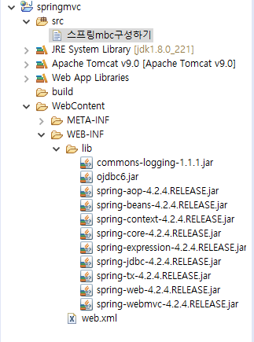

# 20-01-21 화

## Spring Framework

* 내부에서 객체를 관리 < LIFECYCLE >
  * 객체생성에 관여하는 기능 : 컨테이너 가 객체를 관리하는 방식 : IOC(Inversion of Control) 컨테이너
  * => 스프링의 컨셉을 이해하는데 가장 중요
* WEB , DB연동, 로그, 트랜잭션
* 스프링에서는 객체를 Bean이라고 불러요
* 스프링은 우리가 일반적으로 만드는 방식대로 클래스를 만들고 어떻게 개발하는지 방식이 정해져있다.
  * 클래스를 만드는 방식과 운영방식이 정해져있는 것.

---

# 20-01-22 수

## 스프링의 개요

### 1. 프레임 워크

> 완성된 소프트웨어가 아니라 어떤 문제를 해결하기 위해서 잘 설계된 미완의 모듈로 spring같은 경우 자바 개발자들이 공통으로 사용할만한 기능을 미리 정의해 놓은 모듈이다.

* 모듈? : 코드를 모아 놓은 라이브러리
* 해결해야 하는 문제 : 내가 개발하고 싶은 시스템 => 쇼핑몰, 예약관리시스템, 인터넷뱅킹............
* 스프링은 재사용이 가능한 모듈이며 일반적으로 프레임워크를 통해서 개발하는 시스템의 공통모듈은 프레임워크에서 제공

#### - 스프링 프레임워크의 이점

* 개발자가 처리해야하는 대부분의 작업을 프레임워크 내부에서 처리해 주므로 개발을 위한 시간과 노력을 절약가능
* 신뢰있는 프로그램을 개발할 수 있다.(정부인증 프레임워크로 대부분의 대기업들이 사용)
* 개발자간의 의사소통이 활발.
* 주어진 메뉴얼대로 개발하면된다. 즉, 프레임워크 내부에서 제공하는 모듈을 사용해서 개발하면 된다.

### 2. 스프링의 특징

* 경량시스템(포함된 라이브러리가 거의 1MB가 넘지 않기 때문에 가볍다)
* POJO(Plain Old Java Object)로 개발하기 때문에 작성하는 클래스는 작성하는 OOP의 특징을 적용하며 개발하면 됨.
* spring 프레임워크 내부에 IoC컨테이너를 포함하고 있다.(***)

#### 1) 의존성을 주입

* 시스템 내부(내가 만든 프로그램)에서 사용하는 객체를 직접 생성해서 사용하지 않고 스프링내부에 존재하는 *컨테이너*를 통해 필요한 곳에서 사용할 수 있도록 전달받아 사용한다.
  * *컨테이너*? : 스프링 내부에서 라이브러리로 존재
    * spring-beans-4.2.4.RELEASE.jar
    * spring-context-4.2.4.RELEASE.jar

#### 2) 스프링 내부의 IoC컨테이너를 통해 객체를 관리하면서 커플링을 낮출 수 있다.

#### 3) 스프링 내부에는 발생할 수 있는 다양한 모든 경웨 반응할 수 있도록 많은 컨테이너 클래스를 제공한다.

### 3. 스프링 컨테이너의 종류

> 기본설정은 모든 컨테이너는 같은 객체는 하나만 생성한다.

* *BeanFactory*  : 개발자가 객체(빈)를 요청하는 시점에 객체를 생성한다.(가장 상위의 컨테이너)
  - *ApplicationContext* : 컨테이너 객체가 생성될때 전달된 xml안에 정의된 모든 빈을 생성하고 의존성주입을 처리.
    - *WebApplicationContext* :

### 4. 의존성 주입

#### 1)  DL(Dependency Lookup)

* 컨테이너가 만든 객체를 getBean메소드를 통해 가져와서 사용하는 것

#### 2) DI(Dependency Injection)

* 

---

# 20-01-23 목

* 내가 사용하고 있는 클래스? => 의존모듈 -> ( DI ) 를 통해서 여러 객체를 관리할 것이다.

* 유지보수를 위해 요구사항이 바귄다 해서 변경되면 안되고 원활하게 추가될 수 있게 개발해야 한다.

  => OOP와 다형성을 이용해서 잘 설계해야 함. => 외부에서 객체를 관리하도록 위임

* setter인젝션은 기본생성자가 추가되어야 하고, setter메소드가 추가되어야 한다. - <property>

* di인젝션 은 - <constructor> - 기본 생성자가 없어도 ㄱㅊ & set 메소드가 없다.


### <어노테이션을 활용하기>

- 설정파일에 빈을 등록하지 않고 사용한다.

- 설정파일에 <context:compent-scan>앨립먼트를 이용해서 컨테이너가 빈을 찾을 수 있도록 패키지를 등록

- 기본생성자를 반드시 추가해야 한다.

- 빈 생성을 위해 사용할 수 있는 어노테이션 기호

  - *component* : 일반적인 빈
  - *Service* : 비지니스로직(DAO제외)이 정의되어 있는 빈을 등록하는 경우 사용
    - 클래스의 첫 글자를 소문자로 변경한 이름을 빈을 name에 등록
    - Dice=>dice , Player=>player
    - 이름을 별도로 정의하고 싶으면  괄호를 이용해서 사용가능
  - *Repository* : DAO를 등록하는 경우 사용
  - *Autowired* : 해당 타입의 bean이 생성된게 있으면 자동으로 맵핑
    - *Qualifier* ("객체 아이디/이름") : 의존성 주입할 객체 지정

- 빈의 이름을 특별한 이름으로 명시하고 싶으면 ( )안에 " " 로 정의

  ex) 빈의 이름을 myplayer - @Service( " myplayer " )

  ​															------------------- => 등록한 빈의 이름은 lookup하거나 의존성주입할때 사용한다.

---

# 20-01-28 화

* Model 1 ? => Model 2 ( Controller가 중요 )

* 개발자들이 컨트롤러 부분을 좀 더 편하게 작업하기 위해 .

* 웹사이트는 굉장히 다양하게 치고 들어온다.?(접속) => 사이트 관리가 안돼~(보안, 로그인 등등) 

  => 모든요청이 하나의 통로로 들어오게 만들어 주자!!

  => *Front Controller* 패턴

  => 결국에는 전부 스프링 기반이다~

  < Front Controller >

  * 요청 분석 기능
  * 요청에 따라 실행할 결과를 찾아서 호출
  * forward 전담
  * 한글처리
  * DB처리
  * view
  * .... 등등

* 모든 작업을 클래스 하나로 만들 수 없고 분리시켜야 하기 때문에 RequestMapping이라는 클래스를 하나 만들어서 mycommand.properties를 보고 요청. 

* 실행할 객체를 만들어서 넘겨줘야한다. (다양한 이름과 다양한 패키지) => 타입을 통일시켜줘야 함.

  * Action이라는 걸 상속.(다형성 적용)
  * 그럼 Action만 하나 넘겨주면 된다


* STS에서 JSP라이브러리 등록하기 : https://blog.naver.com/heaves1/221592072984 
* internal, external server 익스터널이 캐시를 덜 받는다.
* web프로젝트는 라이브러리가 lib에 있어야 한다.

## Spring-STS

### 1. Spring MVC 프로젝트 구성 - maven을 이용하지 않는 경우 

1. Dynamic Web Project 생성

2. 라이브러리를 lib폴더에 복사하기

   

3. DispatcherServlet을 web.xml에 등록

   => 모든 요청이 DispatcherServlet을 통해 진입하도록 설정해야 스프링이 제공하는 여러가지 기능을 적용할 수 있다.

   ( forntController패턴이 적용되어 있다.)

4. spring에서 사용할 설정파일을 작성한다.

   => 따로 등록하지 않으면 web프로젝트에서 사용할 스프링설정 파일은 파일명을 작성할 때 규칙이 있다.

   [DispatcherServlet을 등록한 서블릿명] - servlet.xml

   ex) 서블릿명 : springapp

   ​	/ WEB-INF /

   ​			+

   ​			 l_ springapp-servlet.xml

5. Controller 작성하기

   * 기본 web에서 서블릿과 같은 역할을 하는 클래스
   * 실제 처리를 담당하는 클래스

6. 스프링설정파일에 컨트롤러 등록하기

   * <bean> 태그를 이용해서 5번에서 생성한 컨트롤러 등록하기
   * 요청path를 기준으로 컨트롤러를 등록할 것이므로 id속성을 쓰지 않고 name속성을 사용한다.
   * DispatcherServlet내부에서 요청path에 맞는 컨트롤러를 getBean할 수 있도록 등록

   ```xml
   [형식]
   <bean name="요청path" class="컨트롤러 클래스"/>
   
   [예제] - test.do로 TestController를 요청
   <bean name="/test.do" class="test.TestController"/>
   ```

   * 1,2,3,4번은 한번만 등록하고 5,6번은 계속 해줘야 한다. 6번은 mypropertis에 등록했던 것을 xml에등록하는 것.

### 2. Spring MVC 구성요소

> 스프링 MVC를 구축하고 웹을 실행
>
> 스프링이 제공하는 모든 기능을 잘 활용하기 위해서 스프링이 내가 작성한 자바빈을 관리할 수 있도록 작업해야 한다. => *스프링 내부의 컨테이너가 내가 작성한 빈을 생성하고 관리할 수 있도록 작업)*
>
> * 이를 위해 모든 요청을 DispatcherServlet이라는 서블릿을 통해 들어올 수 있도록 처리

#### 1.DispatcherServlet 

* 클라이언트의 모든 요청을 처리하기 위해 첫 번재로 실행되는 서블릿

#### 2. HandlerMapping

* 클라이언트가 요청한 path를 분석해서 어떤 컨트롤러를 실행해야 하는지 찾아서 DispatcherServlet으로 넘겨주는 객체

#### 3. Controller

* 클라이언트의 요청을 처리하는 객체
* DAO의 메소드를 호출하는 기능을 정의

#### 4. ModelAndView

* Controller에서 DAO의 메소드를 실행결과로 만들어진 데이터에 대한 정보나 응답할 view에 대한 정보를 갖고 있는 객체

#### 5. ViewResolver

* ModelAndView에서 저장된 view의 정보를 이용해서 실제 어떤 view를 실행해야 하는지 정보를 넘겨주는 객체

=> 컨트롤러를 기능별로 세분화 시켜놓은 것.( 중앙 집중식 관리! )

=> *스프링MVC를 구축하면 위의 클래스들이 자동으로 실행되며 일처리를 한다. 따라서 필요에 따라 ViewResolver나 handlerMapping객체를 다양하게 등록하고 사용할 수 있다.*

=> 기본 설정을 이용하는 경우 개발자는 Controller만 작성하고 설정파일이나 Annotation으로 등록하면 된다.


* WEB-INF는 외부에서 절대로 요청될 수 없는 폴더이다. 그 안에 jsp가 있으면 XX

---

# 20-01-29 수

## Maven

* STS에 있는 Build Tool
* <beans> 로 되있는 거는 스프링설정 파일이다.
* STS에서 UTF-8 설정하기
  * windows-preferences-General-Workspace-Text file Encoding - UTF8
  * windows-preferences-Web-CSS,HTML,JSP Files - UTF-8
  * windows-preferences-General-Content types- text- Default encoding에 UTF-8
* 최종프로젝트 - 책 20p
* 라이브러리를 form.xml에 등록하고 사용할 것임 - <dependency>

## Tiles Framework

> https://mvnrepository.com/

### - 화면구성하기

1. 라이브러리를 pom.xml에 등록

2. 레이아웃이 적용되어 있는 템플릿 파일과 연결할 jsp파일들이 미리 준비되어 있어야 한다.

3. tiles 설정파일을 작성( main-tiles.xml )

   - 템플릿을 등록 : 템플릿의 각 영역을 나누고 각 영역에 기본으로 연결할 jsp파일을 설정한다.

4. 템플릿(레이아웃을 미리 설정해 놓은 파일 - mainLayout.jsp)으로 만들어 놓은 jsp파일의 각 영역이 템플릿에 등록한 영역과 일치하도록 설정

   * tiles에서 제공하는 태그를 사용한다.

     => 내부에서 tiles설정 파일에 등록한 내용과 연결하여 실행하는 작업을 처리하기 위해 tiles에서 제공하는 태그를 써서 작업해야 한다.

5. 스프링 내부에서 실행될 때 DispatcherServlet이 뷰 정보를 ViewResolver에게 전달하면 ViewResolver가 tiles프레임워크를 활용해서 뷰를 만들 수 있도록 spring설정파일에 등록

   * tiles설정 파일이 어떤 파일인지 등록
   * 만들어야 하는 view가 tiles뷰임을 등록

6. 템플릿을 활용해서 만들어질 뷰의 정보를 tiles설정 파일에 등록

# 20-01-30 목

* 반드시 "config" - "spring-config.xml"에서 DistpatcherServlet 설정을 해줘야 한다 !!

```java
	<servlet>
		<servlet-name>appServlet</servlet-name>
		<servlet-class>org.springframework.web.servlet.DispatcherServlet</servlet-class>
		<init-param>
			<param-name>contextConfigLocation</param-name>
			<param-value>
			/WEB-INF/config/spring-config.xml
			</param-value>
		</init-param>
		<load-on-startup>1</load-on-startup>
	</servlet>
```

- tiles를 사용할 때 bootstrap 라이브러리는 layout페이지에만 있으면 된다.( 안그러면 충돌 일어남 )
- 무슨 작업을 하든 라이브러리 추가하는 작업부터~


## Spring-JDBC

> jdbc에서 발전된 것이 spring-jdbc

* Connection 관리

  * DriverManager
  * Data Source : Connection pool 을 활용 - DBCP
    * 현업에서는 요청이 들어올 때마다 커넥션을 만들어주면 느려지기 때문에, 평균을 내서 미리 확보해 놓는다
    * 현재는 WAS에서 별도로 Connection pool을 제공해준다.

  

* sql 처리

  * JDBC Template : JDBC의 반복적인 코드를 제거하기 위해 사용되는 클래스

    => JDBC에서 하던 수많은 코드들을 대신 다 해준다

  ```java
  JdbcTemplate mytemplate;
  return mytemplate.queryForObject("sql", Type)
  ```


- rowMapper ?!

  ```java
  While(rs.next()){
  DTO row = new DTO(rs.getString(1),.....); ----- 이 부분만 rowMapper 객체로 넘겨주는 것이다.
      								=> 유일하게 달라지는 부분(mapRow에 구현)
  list.add.....
  }
  ```

- 근데 실제로 이것보다 mybatis를 더 많이 쓴다.

# 20-01-31 금

## Connection Pool

- 동시 접속사수를 예상해서 미리 만들어 놓고 + 실제 사용자가 접속하면 객체를 하나씩 주는 방식

- WAS에서 DBMS에 접속해서 가져오는 시간을 줄이기 위해

- DBCP 사용(in 책)

- WAS에서 지원되는 Connection Pool 사용

- - 각각의 WAS에서 자원 관리(이름-자원 > 표로 관리?)

- - Tomcat
  - Weblogic
  - JEUS

- 

- 자바의 배포버전 : jar
-  web의 배포버전 : war
-  META-INF - MANIFAST.ME : 프로젝트에 대한 정보를 명시해 놓는 파일

![img](data:image/png;base64,iVBORw0KGgoAAAANSUhEUgAAAVMAAACSCAIAAAB36r6GAAAAAXNSR0IArs4c6QAAAARnQU1BAACxjwv8YQUAAAAJcEhZcwAADsMAAA7DAcdvqGQAAB0pSURBVHhe7Z0PfBTlmcffzR+s+DdiwJ4Cge7GI0RPAUUSlRwKsgExtmdoqZjLHd1UxCYVUrVGVAy91rQ0WwNtUhQi1wDB4pKTrBJEFJNCBVslLl52DUi8KgLGUgElye4975+Znd2Z3Ww2f2f2+X7mk33nfZ/3nXc2+8z7vDP7/tbk8/kIgiAxRpx4RRAklkDPR5BYpI+jfffrFWfb/waJuDhffJz3wqSRo29ZyosQBX/asfwt84ri8XwPQQacPh7zwe0nWovSsx9Km7306lnFX5/6RBR0j7PAJMi0e0TeQNG6Zfaa5bM3v/mx2Pfz8YHViw8cFzv6IdJut7+5GE58zZY/iX0kZuibMb/8iV/GxXsTiG/h98+PJ166+bynTpw+cfzvO/8yipmY2F/S5Y178MllPK0A3L40zd1YaGY7drulkCcHiNYti9uz1kxOFrsKwIV+RnI1i3pDf4/5Pen28c2bd4+Zf880sYvEBiHHfPUVIcw1ostnAre3LbnpouTrhydPPi/5hoSRUy9Lm5E6/e7FRRlsm2ZbMhXa6NJsw9PSnJE7R/J1q+z2HnsmDwMKnGI3026nsUFBQYHIo7B8GieEtod9EVR0F1Hw8X/N6s3t1H8W7TvWuu9ZvqssoukdLl4D3FgaYMGLWClNgCXbhBkrOkBbKGtlGQw4hHrIhQbLDvDRmFUXI7PcFOAq4zlynBKm2/7O8ANp9wSJMcCf1axbt+7hhx/u6OgQ+z4fpCFn/fr1Yl/FIw896/t8Z/iN2mjjLs8gtnqxI1FvIxnlbpGipdRKMhNZFMhmycjs3fX1zEbJh7X37/+Mpd5/ZnVtE0181vQhzWnbXxGi6P1nNr3RxnY3vVpxv0iLzKZXH5dqfbZpE0/TxB2vvs8yqcEzH9Lj3iEqBgClUj4c9PE7pONu2lSx6XOaatv/BsuRDxSm24rOwOFoBwJ6wnZ5XSSW0Bjzu7q6Pvjgg3379pWUlHR2dkIO/IU05Bw6dAhKuVkQrScvIJ2nw2/URhtzYaM7rVQerBlOR5WthI/+1hxbcwsfqm05VvYKWVUOPrJvr02nmeHtZcxWayQTieRp40OFyrwoeQw52AgjavuhoyNyFyYda4OS1vcPmydcRVxvea5ZKCLt5PmzbicnxZT7NnMaT1BgJH+FPDH/1qvEfgC33cDz0242k/FTs1gonjwm6dhROoaTqybfyoPzaeZr2KuMutuKzoyfeFv7CR4jBPQEiUE0PD8+Pv7pp5+eOnUqd/6zZ89yt4ec0tJSKBV2gXzdmUA6z8CW/9MTobbhib78HzwPm6gTADg/XIlyHJL7wwyAVGWzAN1kyq5qcrmpVUaahb4AkutLjt+NvbWSX1q6CfbTir83aoMyivYTVJScaSbghx+3HiRJyaNHfPZWK/m4/bNxSczHRowaTV8khL+NGpPEdhmv7ds5bnZEs2vRJiGjR/B7JoAU7b9ykO2G7nb7icPk4FPceM2m106yK1RgT5BYRHuen5iYCE7OnT83N1d2+4SEBGGh4uvOeNJxGraHFpCzHQnWh75/9+P/DlvFb/NhW3b1I3ybtmA2lIo6GlgrITAnpeCe5tR0EbtzKoPGbuH6kuN3b88vLSUuiyKu0CDp1jWLV7xyw7FF/km1RGDRVUkjX/O42k6OvHk8TR9udzV6aJoiHEwi6XL1wH7b7O+SV/g8vKeA279/M/QEttnSmB+q20mXjxtx+1puTDe8k4cwQt7hAyfnzv/ll1926/bAV+D5naff/d9zT28YPik7s/Oc96vTHbyoddWo1Pzd/5xTOPH64dPevm5p4W0834/HXuAfiiFqZ6+WNFJUJpzUadcYqmlM7ygTjt+Nvcdu50WWtAxpIqBB+5ub+U2vpFHj2UANLt3KY3VVEQueX9/Qzob38RPHeV5/I2ki8ysI0Q9ukO/57dg5Tju0hoH6mjc29vyJGgzjIqY4vvltNuaH6TadlezcKO7kuTbr8Akl0i+E9HyAO39+fj4E/+HdHoAx/82/mh57YcTE6ZOTR4/s6vDKzt/ZQQ7/4b6Wl7ccaDJB+obrr+RV/JgLi0kej9MhUif17PEejNH1RITvjlStp3zWnPSq5txiMbiHtTcXptJ5hMlkqc2t1mqLk3TrGA8LjDcenD6LzbTBvT2b6E1yoioCD086RujEHgAHO0ZGiLB82qwHp3ueZQH2s2+YHywO9fQOBurZ5ClxBz5ikm5dmLRzEW28lvB5fphutyfPnw/BBStd8/6Yvn48ieiVPvsOX86iF0+cNN1yR/oYc3JCYnzCsLiExLj4xLh5E77h+tmo6x/cHff5i/FHn//znjM3PvmZqDNkCP08PwY4js/zY5G+/PbupLnbREpB3drbjz477oaHwPNr44+ub9p1JmPlEPR8eqsM5sMh7rQblvY3F2/c2UqueQLn/7HGQKzSfeMnIzMe3h1/clNc2wtvvHpm+jNDzvMRJNYYCM8Hdv54JE/c/mt0ewQZfAbI8xEEGVKEu7ePIIhRQc9HkFgEPR9BYhH0fCRynMq10VEht9D7pvocvox7qPWqvxgSnn/284/fXpPXWHYXbJCAXVHQHbKMj0S//ttkGYAIkJUCtLsktAJCLyCSDQZBoahnZzrQ9FffPPbSZrruo9JK/3dD9vT7jCHh+W8/t+Sa+Y9Pe/A52K6+s/DdjY+Jgu6o9FHc5RnSWh3VMp3BwVlgqc3lPaon2cGfIvhkZROhGpBepLGACNy+NE1afFRCthv9QzhUSE9lX+umS7uEPJSB6XvPhw+rSEmoc5S8uz4/vuOTs8fqv/7HiS/cDadcmy65mOyvuFPa5rXUPSFMI8Q/3soDLo0t7QrBHtlE4XaqPGncZZ4LpZaipqYiS/AoTJuWGwErKFUoBRBrcTmpDfBdz/ZaUi4WG0CpegHRgCgUBRDZmQYgNx7QXNAhg1oOpiXYWrtZ0QZtotu+qTqg0SD9jyk/DDwL2qWLvGmz1CC4Oq0R5u3QH33s+evXr3/00Ue5ngcH0pBTXV0t9lV80fb+1Xc9ED/8qq6vjiRcOPyib0254sbZqXMXSdt/fvKu9BGICMV46y5v9g+4VbWkmmbW2+AfbHGVCAO6IBigHylRzZ3WQg/osbfk0F06LufZPTAQSLFF4HjglwiBOttr0yWXlzCnpgutAIHbRfx+bZ6TSwJKAZonrzqU8Z8XhBHig9lU5KJ9rKzU6EM4+8DIKNIzVaD5Jnf7HrKqfqT/CG1BckB1s84CESBVp7q76Zu6A919GKRDWyshyZSdAppVVM9xFTWJXGPQl54fnZhPR6f3ouTk84afn3ie77wLhn3j4ouGJ1163vBh8gYGwjQSlOOtubC6XPYrhV4PyRBjruyVbBwWa/jMhYW0ULzwCuHwu76kFUBzxBUFPo2lfNGxBFUQCUQ16NPP9wApFFEiPlMZzTe5x++h1ARc6XjgE/J/x+hWTEndgW4/DPKhNVFWp9EZSxiFvvT86MR8Oru8XNIDtq6zf29+vf5/yku3/WqFvB37onPLo1ls+1dRJyx+2R6G1j9WTOjYan326nY1yXkyUqSaHei6KiS3k5wOcirpBJ5VziO5toAewdVGpCTUR6af035VKAoi0jP1o/Em9+o9FGg0G0ZMKSiS1+qARoM9IdQbZgD6ONqPQsyHDulMpe/44Q9e/f2aS0d9c8Z9ttvz7//O0ztgm5j84XWj/5Y2wnXNjJlnvjgm6oQlMLbW9CsV0hXAD3xkHTxSpeKd4eFu53d8msVvPkL0mOqqCu6CsocQ+4f+dPWjQpGfnpypjMab3Lv3kKP5v+NXQQ0xJV7AoOen7kB0HwYFiupwXREpY9D3d/h6KubTyTz/+BH3nq1bb5h9x1XjR18wPA62uDjiKv+WLObT8Rf79B+UizphoB7gj7TzivzOGA6I+qS5JtSyO9ldNu6R/nBdNWOXgYMq1YGIx+kUYwvMUpul23kCiBvlY9Fi/6Rf0P8KRUp6dqYczTc5ovcwLFrNqsSUQvdN1YEoPwwyiuoRnoGO6HvPB3ok5tPR5Tt+pHWPY/st82YnX3EJOfd3cu4U6ThFfL4gMZ+USbNEnXBAdJhbyyNtensmwud8MHxIgj55ZI4V9ktEvE7DdWFEPwlgoxF3BqoDEbOlRUgM+X8/hIamvCadcTbzY0n6QwH0v0KRkh6eKUfzTY7oPQyLRrNqMaXQfQvuQIh+Ro5/1pZHSgw2zx/8tXp/eGCiLz4+686s5CtHQn/oZqJ/h33rh2//LHWIi/kgMQOfuvT02jF06Zcxv0dcOvbazq/P7al/86XnHI5127atr6tbt61uneP0P07DOM+g9/alNIIMAjTa13wwolsGf8zv6vj67KkTYkfB8EtH7Xn0n1DMBxk8YJyXHkpklEvTNoMw1JU5UMwHQfoD1ORBkFhk8Of5CIIMPOj5CBKL6D7a3+38hUgpSEwcdt3Uey+4CH9QBkG00b3nv7a97JZZD4kdiUO7nmr3JV134z2XXtZ/v5wxkA94jfYwGRl0dB/td3jjvT4StF14nulS8sX+vX9s//z/hF00eCJaku3/cl7/M5DHQgyN7j2/syu+y0uqXnx7VfWep1bvWPaLbbAblzj8wvPIZaaTe9/aKuz6D/MASrgM5LEQQ2MEz/f6fPl3T3nw3pt/+sOZ/7VsHuxePmnpqJset2Qt/7rDJOw0kBd5SmvAIKZmsFEVSi0B8i8BpUqggLdAE0FiL5QwFTPtTsneXyr3K2CBPkc+FhDQf2UBLVEdDEGUGCLa95J1L+2vrN377IY9v3zu9ZW/3fGEvf6Rsm2QD6XCLhjq2EJvJSIRnvDyMjJqnZmwFZuKSrm9vzSUjEwQwf2n61iCZXkQJDTsI6ZjajZWnvzHuVAblAq7ICSn1qTexsu0jaTSehuh8k1aCUCjrlRRRmkvVQjIo5lsT3UIzeaFjVQJQUKj/2ifjfn/XXfg+T/u+13NW/b1u5+paiitcD6+qg7yoVTYBRGFgEz40jCEqail+RKUpy0jo9F/adQPUAhBEG30H+3TeT757pzJ9+VMXTT/5gcWZq0sspb95M7Fw+8/VnXlpL89KuyC6KmATPjSMISvGKj5wn05SHdCW0ZGS3+Guz46PhIJhrjD5/Vt2n7gBce+tZvfWr1h9xenzrp+OUoW8zn4jFjzE0APRXh6LC8j0V1FpeYLWwVK3TcCGRm1/gxA1X5K89DxkQgwQrTf5SPfmT3pe3femPdvmbYF0y+56PwgMR8tIhKQkeVfSI/lZQQazdJb8tJ9u4zyXBcr9SvGRCgjo9afoZlzcgnxSwMhSEh0/x0+++83f/vunJd2/OWrr86d+erc2bPniv9jeqt9nB7EfJwFmS3Fffl4Hi4qeaQaH/gj3WOAMT8O5vl3zbx+/p1T8++5ZfF9t11y8fAYFfOBKb7iRzwQJAxGuMO3cct25Xb6yzMdzNtNPur5PG146AMEmB2IH5pAkG4wrDIHivkgSBhQkwdBYhHdR/sIgkQBej6CxCKoyYMgsQhq8kQN/14u6uQgukT/T/ViSpMnShQnooPeIgOB/r/JE1OaPL0HVX0QDkT7uualF589daYj1Aalwk4Dt/TrqNJqdmkxHVv5LpeK/cBSvh+4Zp4lyoMbVVeUoQv26yV7UcoW3pfTGqwBRS/8vVTXAoLOxt9ORobcBLWWe6uqIvdU1VHEeBgi2jeUJg/NdNEalVYSQp8nrJJPPZHW8Il2GhsDTkRGVcVZkE3YJaA61R3yBBGjQP/TesZomjzwohyC/eW0hO1p1VLm8cMo25GsGJKpukrg4RBjo/95vuE0eZSZQeVCn0dVy9PSTOhyYnEYISqg2biERhVrpTutFPbwBmAsoP9o33CaPEq09XlUtcyp6fKYTongUaNmFXr7z+crcVnEfAExLka4t28oTR4lIfV5VLUsaaSoTHir064as/0n4kdVRZb2gauitvgfYiCMEO0bS5NHSQh9HnUtxdmYHKnqh3byifgdWlXFXJjqYHvQKi72NTyoyTOIRKfJ0+dKPkgsYoAxHzV5EKTHGOEOH2ryIEhPQU0eBIlFUJMHQWIR/Xn+O8dEIsaZNEokECQKdD/PRxAkCnQ/5p96R0OTB7h40sMiZVBwzEd6g+49v/1A2S0zgzV53K88eDxhrOGc37nyCkfWp5WZbAc9H+kNuo/2u7o0TmHYBSNGdn4UKhzoNZ6auZk1R8ROBPTUHkH6HQN8kyceoha+eSGAYWpc4PmJF4xI7jxybO+vhR2CIAqM8E2eLp8PtuvvKlz28+e7vGTZz5+zPum5MvPJ8bMqOr0Jwk4DGIpNk6+AraCRZxyx59Nduq3cxbMgwC6oqcpUZEIty6/2N/3qJtPkufY2yJBrFdMFL21gzBJS2h5sz1CZQTr4WDQ/oDMI0mfo3/M7E7xe4vX6FuZk7frTe3AJgL+Qhpwurw+uC8IuGOrADfPcBz71Hdib9hF1LefKm2pn7vWxnHLPAjk+r2og1VImXCPMC152L52SsRQsXy4craj1G5INLjraVr30UCmte8S+vC7XUVYYaC9QmfHFONKxamxbF5hy3CXiuKv8lwwE6RN07/nnvFSBs8trWnzvXbBb8YID/kKaZYb2/CPbG0j5Chtb9pJSuGAGIbscWxeWLEhhpSmFK1aQw60sTWyLhNmcmVOaPwqaritqZVptHo+HwKWhIrdhtbNxde3MCr+rq9A0k441I+fbJGPpA+xykJJq3u86SlMI0mfo3/M7wfPp8A6uDkP9Bsdu+CvnQKmwC6LV9d6E1CC3vNYSoGHD3Lgb2jzNZEM2j8knL6h6z80WwcOFw1K61lItriOh6MYsfazIt4ybwhMI0mcYYJ6fIPm5j7v9vfOyLrkg8ZPKK2Gb9MlPhV0Q49OuFSk/wm8lzObuF8KONqdfu4JNGfjGg3YawKeb6/K6uZ8foRmC9APG8HwI7MnaTXWwm597J/xVavIkVmtp8kDofohOyylH7DWQgAB7A5t4s5zly9OzYAqgjXnshCYxFxifRpaXiRuEu+ysuqdmCQTwlY9BML+Ez88V9n7UZggycBjA82m07/USGPBnTLsWJvznf2NYJJo8C16uJwtYlL6E3EKd3PrY3tyGm1gOvWknvjCjCUzpt0Ldufa2lMJ1NeRHPNp3pkLc3lhsaZjHAviUwkUTinLYDXy/PX0QQO8dapohyICh++/w7X5pyz3fmQcJOA2TiaqIf/OyYe88fYVSkyfhfgMu1MXv8CG9Qf9jvi+OP8/3wgaDvw8uAfI4j5o8CKKN7j3f643bWOusqXVu3OL8wxZnzRbnl6jJgyDdYcD1+RMvp3/3LBM39i57xJiaPBjtI70BlTn0Cno+0hvQ84c06N5IP6H7eT6CIFGg+zHf2Jo8OOYj/YTuPd9wmjwovIMMBLqP9gdDkwdBdI/uPR81eRAkCnTv+VFr8jQWsy/byzo5gdI6dHeuvYbaFKwsVqjisHxaJbS9WMCDwjvIEEb/nh+dJs+ugh+RerqutiL1KF1gFyytQ9lfdNgKOZWPWW1bnZID76g1P6QhxUOR7OWlPii8gwxZdO/5UWryyKRYM1M0pXUAm1ioSxfwOthI7tlTx1bvhrf3g8I7yBBF/54fnSbPjEqHpRRi7Pwq6rTa0jpT0sbQF8CatbBqNwzsR7Y3TMiBIb07ewUovIMMSQwwz49Kk4eG4o0QZi9yWyBW15bWUUAX2DudNNS30qJu7f2g8A4yJDGG5/dYk6etys7vw42xZNBYXUNaJxCIzA85XuChPtCtvQCFd5AhigE8PxpNntG21N0sVs+py6UKvCppHRXWrAlVnnnF4u5deHt62x+Fd5Ahje6/w2dsTR78Dh/ST+h/zEdNHgTpObr3fNTkQZAoMOD6fCNp8mC0j/QTqMwxpEHPR/oJ/Xk+giC9R/fzfARBokD3Y/5up/Yi/CyrETR5EKSf0L3nv1YfUpMHnT9inAUmR46vMvSXkBGjoftoP4wmT6hwgOGxZ2bau/+Z7F4yMEdBkB6je88Pr8nj3IaaPAiige49PzpNHnumpaipqchiMvEhGcZmk6BAfLkeAuACu5QNmbKJZACo8qASg7UKpYFHURIQDdBj8RZEA3JR0BFYLTu1ofvBxgxaQ+qOlI7kXJDYQv+eH5UmT2Gjuzwjo9zt8zUWmsExLLW5kAbc5c3ZsidV1ZJqmllvq8o2WVwlwqCUl4P7SNXcaS3UhTz2lhy666tPL8qze8yBR4kAZ0E2qacNVKe66TH8Hasn2cJLm4pc9CCV1mBjgbmwWnTRY8+D2mLyHv5ckJhD957fW00ewOmospUI16R+Q1xMaIMQKdeaYyMZ5cXMhcyp6U2s3LO9lpRXcwNzYSEtFC+8Qq8wW63QsKJj0GJzC3dSW07QjThu7AfOIbe2zOksq80V/QPCngsSe+jf86PT5AkkI80iUgzJx5SkpwofsqRlsFe3q0nOk5Gi/ewqkeFHjrDDxNjWSndaKRjwqMPT0kxggOZkVwknlfsaaBwA+H5aaWma3+8DUZ0LEnsYYJ4fpSaPkqCRT+3RGqi9BtzewaN9iKlFnh+I/XkZjdRFnhpuVeKywNUBhmQ2VZBQVVMaB0Dj/PT0WphxiAwECcIYnh9Ok+fgMxqaPAGRLgTAVdJ8F3ymKD04nNbEPCe3WZp7e+x2Jx2ixXjssZeKMT90PE1Larezg8rmrBkKXFVo3GFJI0Vlwqmd9iA3Djb2w+b31ZWVEPOj7yMhMIDnR6PJA1B/h1CaxsoQN+fWWlhQTe+oRfiFFhhx6wkPxvPIHCvsl6TT+/h0N1ca8xVHCcJaWR9sbi5MddAM2gsaqSuOYHKkBoXuwcZ0NkEPw+4Ksjifdyjk1AKJaXT/Hb5Vv+tek+fGJ3W8UBdB+gP9j/moyYMgPUf3no+aPAgSBYZdn7/zx+LG3u2/xlAfQYJBZQ4EiUX05/nGU+NCyS1k4NH9PB9BkCjQ/Zh/6h3tRfgXT9KNLAeO+cjAo3vPbz8QUpOn75zfuXJuy30vyz+D3XucK69wZEm/tI+ejww8uo/2w2jyhAoHEATRveeH1+Q5thc1eRBEA917fnSaPI3FppW7eBICb/q7t5Qj9vy57Leu6Y/hst/JVfz67dGqTJpzhSm/KuA7+G2QL5lJaWizoEayhwPRfCmNIEMB/Xt+VJo8mVYb/dl84EgLmUIadrB0q4vMmzMa/Pam2pl7fQc+9f2GZAtf3V+0llRDzoFP683L85Q/mD/aVr30UCnNOWJfXpfrKOPrfaoauH2NbesCU467hKb3lntW4a/oI0MC3Xt+lJo849NI3XZwwrYdrnEVJWY3XUnb6GyeOctMdjm2LizhP4nvv0AQ2yIbXytnvW8FOdzKkgLzgorchtXOxtW1Myvku4CS/Yycb5OMpQ+wy0FKqnm/6yhNIcggo3/Pj06TJ2XOTAJO6NlTR8amWMYdcjQSz0eH0semkDZPM9mQzYPzyQuq3mMXBTIlbQyrx5EuBxIphSsspWst1fx6oYI2y7CMm8ITCDLIGGCeH50mj3nshKrdu9yHJ+Rk0nTzR7u2N9A0GW1Ov3aFmwX2bOPRu2KsPupuMpsD18rTOD/dXBcwC0CQoYwxPD+cJk9itaYmD4vkV5V6LFRFJ9Oa3rCq1mxlTg4TgeVljTRFyC675MxVa/mNvSP2tRtsWTNYnsBTswTi/MrHIOZfgtN4RB8YwPOj1OSBGbh5P6ETewC8fT8ZN57lpxSuqyE/4tG+M1UE8FPKZ7otNIfe/GPfwKH3/+lDgcZiS8M8FuenFC6aUJSjeByAIEMW3X+Hb/dL3WvyJNw/pBfq4nf4kIFH/2M+avIgSM/RveejJg+CRIEB1+dPvJz+3bNM3Ni77JGhrsmD0T4y8KAyx+CDno8MPPrzfARBek+fef5f332r8eM/u32pFlNL5lU3XvcvN4sChsn0FCFPsORTPh9PIAgySBDy/9nCxekCDLBdAAAAAElFTkSuQmCC)

- server.xml : 서버에 대한 정보
- web.xml : 서버를 사용하는? 모든 웹에 대한? 정보
- context.xml : context에서 필요한 정보 / 자원에 대한 정보


###  - JDBC 연결을 위한 환경설정?

1. META-INT로 Server-context.xml 복사
2. https://tomcat.apache.org/tomcat-9.0-doc/jndi-datasource-examples-howto.html#Oracle_8i,_9i_&_10g 의 <Resourse> … 코드 복사
3. 해당 코드를 복사한 context.xml에 붙여넣기

* maxTotal : Connection Pool 최대 개수

* javax.naming - InitialContext : WAS에 등록된 자원을 이름으로 가져올 때 =>  *lookup()*

  

### - WAS에서 제공하는 Connection Pool 이용

- WAS마다 각각의 고유한 자원으로 Connection Pool을 만들고 관리함
- 자바에서 이를 사용하기 위해 표준 API인 javax.sql.DataSource를 이용

1. WAS에 등록된 자원을 lookup

   => InitialContext의 lookup 메소드 사용

2. WAS에서 lookup한 DataSoure로부터 커넥션을 가져옴

   => DriverManager와 동일하게 getConnection 이용


 tranjaction 이란 하나의 논리적인 작업단위

## mybatis

- DB를 연동하기 위한 도구 라이브러리
- spring과의 직접적인 호환이 안되기 때문에 Spring과 mybatis를 연동할 수 있는 라이브러리가 하나 더 필요.
- mybatis에서 Connection관리를 기본적으로 해준다. 하지만 Main Framework인 spring이 있기 때문에 스프링에서 함

### < Mybatis 작업순서 >

1. pom.xml에 의존모듈을 추가

   * mybatis
   * mybats-spring

2. mybatis에서 사용할 설정 파일 작성

   - mybatis메인 설정파일 ; mybatis를 실행할 때 필요한 내용을 정의

     => connection관리를 위해 필요한 내용(spring으로 관리하므로 생략)

     => mapper에 대한 정보

     => mapper에서 사용한 DTO

     => spring설정파일이 저장되는 위치에 추가 ----- /WEB-INF/config/mybatis-config.xml로 저장

   - mapper : sql문을 정의하는 설정파일

     => 테이블 한 개에서 사용하는 sql문을 하나의 mapper파일

     => src폴더에 추가

3. spring설정 파일에 mybatis를 사용할 수 있도록 등록

   => SqlSession객체가 mybatis에서 사용하는핵심클래스(spring jdbc의 jdbcTemple과 동일)

   - connection을 사용(생성)할 수 있도록 등록

   - SqlSession을 사용하려면  factory객체 부터 생성해야 하므로 Factory객체를 먼저 설정한다.

     (spring에서 mybatis의 핵심 클래스를 사용할 수 있게 하기 위한 객체- 호환할 수 있도록)

     => Connection객체를 사용, mybatis의 메인설정파일을 등록

   - mybatis의 핵심클래스인 SqlSession클래스의 하위 클래스를 생성

     => SqlSessionTemplate ---- ( spring-jdbc의 JdbcTemplate과 같은 역할) 

> 이후 부터는 mapper-에 .xml파일만 추가하고, mybatis설정파일에 configuration만 추가해주면 된다.

### [기능 추가하기]

1. 새로운 테이블로 작업을 한다면 mybatis-config.xml파일에 VO파일과 mapper파일 등록
2. mapper에 sql문 추가
3. DAOImpl클래스에 메소드 정의
   - mybatis의 핵심클래스인 SqlSession클래스를 이용해서 작업
4. ServiceImpl클래스에서 dao의 메소드 호출할 수 있도록 메소드 정의
5. Controller에서 Serviceimpl의 메소드를 호출해서 작업할 수 있도록 정의
6. Controller에서 response하는 뷰에서 Controller에서 공유해준 데이터를 꺼내서 출력하기( select작업 )
7. tiles설정 파일에서 뷰등록하기


- BoardDAO

  BaordDAOImpl

  ​		|

  BoardService

  BoardServiceImpl

  ​		|

  BoardContoller

  

# 20-02-03 월

service단? dao단?

 mybatis설정 - dao 작성 - service 작성 - Controller에서 requestmapping 작성 - login.jsp가서 html 확인.


EmpServiceImpl, EmpDAOImpl, emp.xml(namespace=multi.erp.emp)

request view -> Controller -> service -> dao -> mapper.xml


​	(login.jsp)			|

​								|

​					response view( board/list 가 실행되도록)

​					로그인이 끝나면 top.jsp의 이미지가 로그인 한 사용자 이미지로 변경


* resulttype은 db조회 결과 , parametertype은 내가 찍어논거
* 항상 컨트롤러는 서비스를 autowired, 서비스는 dao를 autowired 


* Session과 Request ?!
* 세션을 끌려면 지금은 톰캣늘 내렸다 올려야 함. x 누르고 없어지게 할려면 기타 코딩스킬이 필요
* 기존에는 mav.addObject로 하지만 이렇게 하면 기본 리퀘스트로 저장. / 우리는 세션으로 할거임

# 20-02-05 수

## ajax

> 지금까지 했던 거 자체를 다 바꾸는 게 아니라 원하는 값만 가져와서 뿌려주기. 일부만 수정!!

- 비동기통신!

# 20-02-06 목

## JSON

# ajax, json 반드시 꼭 공부해서 정리하기!!!

