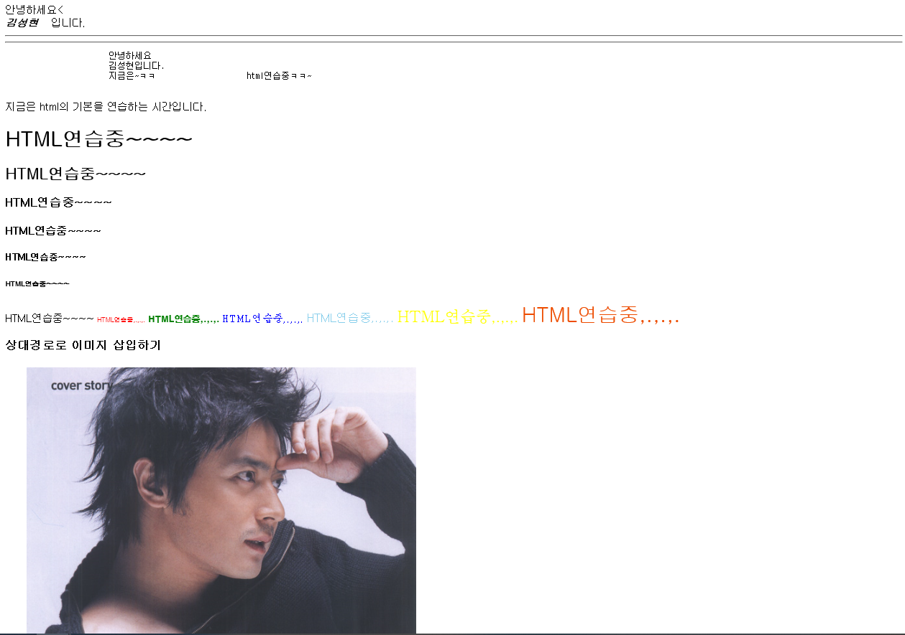
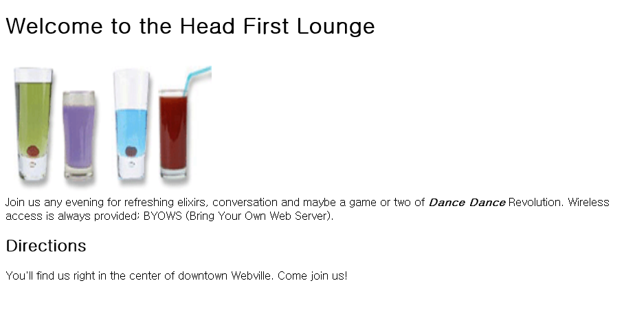
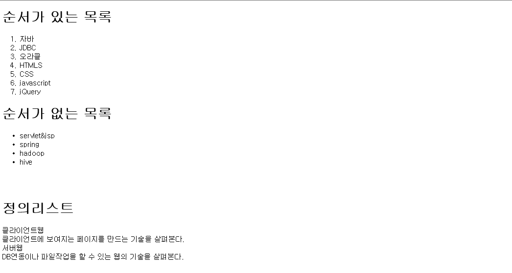
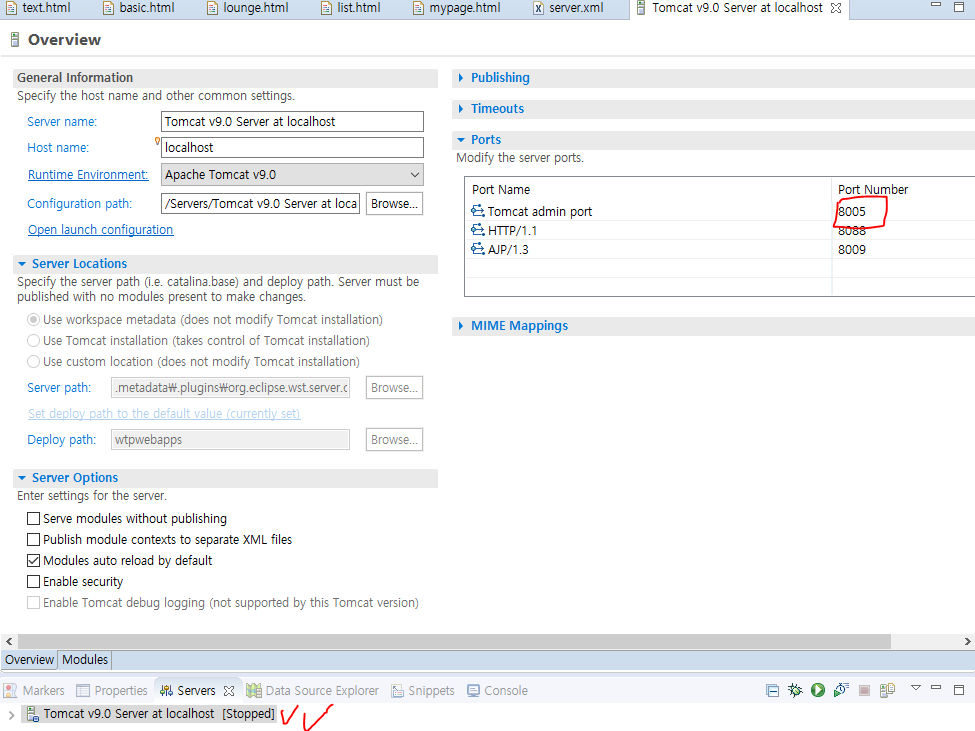
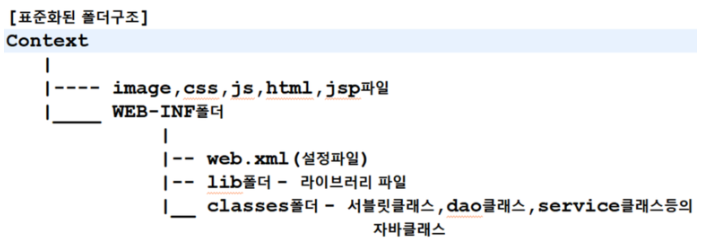

WEB

## 19-12-30 월

* 우리가 말하는 웹서버는 : IIS , apache 등등(웹서버 역할을 하는 소프트웨어)
  
  * 이런 소프트웨어가 설치된 PC가 웹서버
* client에 보여주기 위한 기본 기술(프론트엔드) : html, css, javascript, jQuery

* WAS(Web Application Server)
  * Web logic, JEUS, **Tomcat(Test Server)**

    => 내부적으론 웹서버의 기능도 가지고 있으면서 자바를 실행할 수 있는 컨테이너의 기능을 갖고 있다.

* 결과를 조회해서 -> Servlet & JSP (서버기술 Application)

* Client Page + Web application/Server + DBMS(Oracle...SQL...) + Servlet&JSP

  => Spring같은 framwork 

  => 따라서 WEB은 전반적인 모든 것을 알고 있어야 한다

  

  ### 강의 순서

  1. 서버를 설치하고 작업.( Tomcat ) - apache.org
  2. 기본적으로 웹페이지를 어떻게 구성하는지.

* https 는 http에 보안이 적용되어있는 프로토콜.
* 웹페이지를 구성하는 요소?를 정의할 때  사용하는 기술 - **html (뼈대)**
* web 스타일 시트 - **css (꾸미기)**
* interactive - **javascript (대화형페이지)**  => 최근에 많이 중요해짐!!


## 19-12-31 화

* web은 제약사항이 없다~ 하려고하는 건 거의 다 구현할 수 있음.

* 내가 할만한거?

  * 음악 관련(가상악기)
  * 자동차 관련 - what? - 지도활용? - 부품? -기술?

* Client - WAS(webserver, container) - / / - Servlet&JSAP - JDBC - DBMS

  ​     << 프론트엔드 >>							<< 백엔드 >> ( 수업의 주 - servlet&jsp, spring framework )

* 어디서 장비추가? 어디서 빅데이터 활용? 어디서 보안 적용? 하는지 구조를 알아야 한다. 

* 웹요청 방식 : http://127.0.0.1:8088 / context명 / ( 폴더명 ) / 요청할 web application

    			프로토콜 :// 웹서버ip : port / 기본context는 생략(root) / 

  ​				   	( 웹의 기본port 80 생략가능 )

  * http://127.0.0.1:8088/docs/index.html : docs에 있는 index.html을 실행해라

* **Tomcat 9.0 - webapps - ROOT**

* 서버가 기본으로 인식하는 위치 : **Tomcat 9.0 - webapps**

* Web Application 폴더 ( Context )

* 서버에 대한 정의 : **Tomcat 9.0 - conf - server.xml**

  * 한글 인코딩 방식 : "UTF-8"  "EUC-KR"
  * <> : tag 혹은 엘리먼트 : 이런 것들을 markup 언어라고 한다

* 웹에 대한 정의 : **Tomcat 9.0 - conf - web.xml**

* 서버를 실행하면서 기록되는 파일들 : **Tomcat 9.0 - logs** => 싹다 기록된다 

  * 마케팅 전략으로 활용 가능

* 파일이 변환되는 위치가 저장되는 폴더 : Tomcat 9.0 - temp

* 서버가 스타트될 때 설정파일들을 모두 읽고 생성, 메모리 작업, 셋팅작업이 되기 때문에 무조건 xml을 변경할 때는 무조건 서버를 내렸다가 올려아 한다.

* 에러를 볼땐 밑에서부터!

### **중요

- http://127.0.0.1;8088/docs/index.html

  * 파일로 만들어져 있는 걸 찾아서 가져오는 것 - 정적 문서

- Context에는 어떤 폴더에 어떤 파일을 위치시키는 방법이 정형화 되어있다. - 동적문서

  * Context 

    *  jsp, html, js, image(jpg, gif, png) ,css, 

       * WEB-INF

            * web.xml : 설정파일
            * lib : 외부라이브러리
         * classes : 자바 파일(Servelt, DAO, DTO, 등)

         

* eclipse는 통합개발환경
  * eclipse에서 보여지는 위치는 그냥 우리가 보기 편하라고 보여지는 위치.
* setup -java- work - webwork - .metadata(설정 파일) - plugin
* **C:\iot\setup\java\work\webwork\.metadata\.plugins\org.eclipse.wst.server.core\tmp0\wtpwebapps\clientweb** : 서버가 인식하는 위치 => 작업시작 전 항상 띄워놓고 시작!

###  HTML

#### basic.html

```html
<!DOCTYPE html>
<html>
	<head>
		<meta charset="EUC-KR">
		<title>기본 html 연습</title>
	</head>
	<body>
		<!-- html주석(client에 전송되는 주석 : 주의) 김성현 -->
		안녕하세요&lt;<br/>
		<b><i>김성현</i></b>&nbsp;&nbsp;&nbsp;&nbsp;입니다.
		<hr/>
		<hr/>
		<pre>
			안녕하세요
			김성현입니다.
			지금은~ㅋㅋ 			html연습중ㅋㅋ~
		</pre>
		<p>지금은 html의 기본을 연습하는 시간입니다.</p>
		<h1>HTML연습중~~~~</h1>
		<h2>HTML연습중~~~~</h2>
		<h3>HTML연습중~~~~</h3>
		<h4>HTML연습중~~~~</h4>
		<h5>HTML연습중~~~~</h5>
		<h6>HTML연습중~~~~</h6>
		<h7>HTML연습중~~~~</h7>
		<font size="1" color="red" face="굴림">HTML연습중,.,.,.</font>
		<font size="2" color="green" face="HY견고딕">HTML연습중,.,.,.</font>
		<font size="3" color="blue" face="궁서">HTML연습중,.,.,.</font>
		<font size="4" color="skyblue" face="고딕">HTML연습중,.,.,.</font>
		<font size="5" color="yellow" face="바탕">HTML연습중,.,.,.</font>
		<font size="6" color="#ED4C00" face="굴림">HTML연습중,.,.,.</font>
		<h3>상대경로로 이미지 삽입하기</h3>
		
		
		
		<br/>
		<br/>
		<br/>
		<h3>절대경로로 이미지 삽입하기</h3>
		
		
	</body>
</html>
```



* ./은 현재경로 , ../은 상위경로
* http://127.0.0.1:8088 을 생략해도 된다. => 자동으로 root로 인식

#### lounge.html

```html
<!DOCTYPE html>
<html>
<head>
<meta charset="EUC-KR">
<title>Insert title here</title>
</head>
<body>
<h1>Welcome to the Head First Lounge</h1>

<p>Join us any evening for refreshing elixirs, conversation and maybe a game or two of
<b><i>Dance Dance</i></b> Revolution. Wireless access is always provided; 
BYOWS (Bring Your Own Web Server).</p>
<h2>Directions</h2>
<p>You'll find us right in the center of downtown Webville.  Come join us!</p>
</body>
</html>
```



#### list.html

```html
<!DOCTYPE html>
<html>
<head>
<meta charset="EUC-KR">
<title>Insert title here</title>
</head>
<body>
	<h1>순서가 있는 목록</h1>
	<ol>
		<li>자바</li>
		<li>JDBC</li>
		<li>오라클</li>
		<li>HTMLS</li>
		<li>CSS</li>
		<li>javascript</li>
		<li>jQuery</li>
	</ol>
	<h1>순서가 없는 목록</h1>
	<ul>
		<li>servlet&jsp</li>
		<li>spring</li>
		<li>hadoop</li>
		<li>hive</li>
	</ul>
	<br/><br/>
	<h1>정의리스트</h1>
	<dl>
		<dt>클라이언트웹</dt>
		<dt>클라이언트에 보여지는 페이지를 만드는 기술을 살펴본다.</dt>
		<dt>서버웹</dt>
		<dt>DB연동이나 파일작업을 할 수 있는 웹의 기술을 살펴본다.</dt>
	</dl>
</body>
</html>
```



#### mypage.html

```html
<!DOCTYPE html>
<html>
	<head>
		<meta charset="EUC-KR">
		<title>김성현을 알아봅시다</title>
	</head>
	<body>
	<h1>WHO</h1>
	<ul>
		<li><font size="4" face="HY견고딕">hair : black</font></li>
		<li><font size="4" color="skyblue" face="HY견고딕">name : 김성현</font></li>
		<li><font size="4" color="blue" face="HY견고딕">height : 170</font></li>
		<li><font size="4" face="HY견고딕">UNIV : KOOKMIN</font></li>
		<li><font size="5" color="red" face="궁서">age : 27.999</font></li>
		<li><font size="4" color="blue" face="HY견고딕">hometown : Ulsan</font></li>
		<li><font size="4" color="skyblue" face="HY견고딕">weight : 62</font></li>
		<li><font size="5" color="red" face="바탕">탑레이팅 : PLATINUM 1 100</font></li>
		<li><font size="4" face="고딕">3대 : 60</font></li>
		<li><font size="4" color="#53C14B" face="HY견고딕">hobby1 : 참이슬</font></li>
		<li><font size="4" face="HY견고딕">hobby2 : 넷플릭스</font></li>
		<li><font size="3" face="HY견고딕">hobby3 : 작사작곡랩</font></li>
	</ul>
	<h1>조카의 AGE</h1>
	<font size = "5"> 8.999 </font>
	<h1>조카의 특징</h1>
	<p><font size = "5"> 귀엽습니다 </font>
	<br/>
	<font size = "5"> 사진은 없습니다ㅜ </font></p>
	<h1>제 장래희망</h1>
	
	<h1>HOW?</h1>
	
	<br/>
	<pre>                                    <font size="5" face="궁서"><b>열심히!!</b></font></pre>
	
	</body>
</html>
```

## 20-01-02 목




* 집에서 할 때 반드시 등록해줘야함(서버 더블클릭)

* C:\iot\setup\java\work\webwork\clientweb 여기 있는 것들이 표준화된 폴더 구조인C:\iot\setup\java\work\webwork\.metadata\.plugins\org.eclipse.wst.server.core\tmp0\wtpwebapps\clientweb(서버가 인식하는 위치)로 복사되어 들어가는 것이다.


### HTML

#### table.html

```html
<!DOCTYPE html>
<html>
<head>
<meta charset="EUC-KR">
<title>Insert title here</title>
</head>
<body>
	<h1>테이블연습</h1>
	<table border="1" width="561">
		<tr bgcolor="green">
			<th>번호</th>
			<th>제목</th>
			<th>저자</th>
		</tr>
		<tr align="center">
			<td>1</td>
			<td>이클립스</td>
			<td rowspan="2">스테파니메이어</td>
		</tr>
		<tr>
			<td>2</td>
			<td>트와일라잇</td>
		</tr>
		<tr>
			<td>3</td>
			<td>감자</td>
			<td>강원도</td>
		</tr>
		<tr>
			<td colspan = "3">비고:<br/>
			지금은 table을 작성하기 위해 필요한 태그의 연습 중입니다.</td>
		</tr>
	
	</table>
</body>
</html>
```

```html
<!DOCTYPE html>
<html>
<head>
<meta charset="EUC-KR">
<title>Insert title here</title>
</head>
<body>
<table border="1" width="500" height="500" style="text-align: center;" mathlength="20">
	<tr>
		<td>1</td>
		<td colspan="2">2</td>
		<td colspan="2" rowspan="2">3</td>
	</tr>
	<tr>
		<td>4</td>
		<td rowspan="2">5</td>
		<td>6</td>
	</tr>
	<tr>
		<td>7</td>
		<td colspan="3">8</td>
	</tr>
	<tr>
		<td colspan="3">9</td>
		<td colspan="2">10</td>
	</tr>
</table>
</body>
</html>
```


#### formTest.html

* 양식태그 : action과 mehod는 서버로 데이터를 보낼 때 굉장히 중요한 속성이다! 

  ```html
  <!DOCTYPE html>
  <html>
  <head>
  <meta charset="EUC-KR">
  <title>Insert title here</title>
  </head>
  <body>
  	<h1>양식태그 테스트하기</h1>
  	<form action="/clientweb/member/login.jsp" method="get">
  		<h2>fieldset이용하기</h2>
  		<fieldset>
  		<h3>좋아하는 과목</h3>
  			<input type="checkbox" name="subject1" value="자바">자바
  			<input type="checkbox" name="subject1" value="JDBC">JDBC
  			<input type="checkbox" name="subject1" value="HTML5">HTML5
  			<input type="checkbox" name="subject1" value="Servlet" checked="checked">Servlet
  			<br/><br/>	
  		</fieldset>
  	
  		<h2>1. 텍스트 관련 태그</h2>
  		아이디 : <input type="text" name="id" size="100" maxlength="20"/><br/>
  		패스워드 : <input type="password" name="pass"><br/>
  		닉네임 : <input type="text" name="nickname" value="별칭을  입력하세요" disabled="disabled"><br/>
  		비고:<br/>
  		<textarea rows="30" cols="30" name="info">자기소개:</textarea>
  		
  		<h2>2. 버튼 관련 태그</h2>
  		<input type="submit" value="서버로 전송하기">
  		<input type="reset" value="입력 취소하기">
  		<input type="button" value="자바스크립트 연결하는 버튼"
  				onclick="alert('환영합니다.')"/>
  				
  				
  		<h2>3. 선택관련태그</h2>
  		<h3>좋아하는 과목</h3>
  		<input type="checkbox" name="subject1" value="자바">자바
  		<input type="checkbox" name="subject1" value="JDBC">JDBC
  		<input type="checkbox" name="subject1" value="HTML5">HTML5
  		<input type="checkbox" name="subject1" value="Servlet" checked="checked">Servlet
  		<br/><br/>		
  		
  		<h3>좋아하는 과목</h3>
  		<input type="radio" name="subject2" value="자바">자바
  		<input type="radio" name="subject2" value="JDBC" checked="checked">JDBC
  		<input type="radio" name="subject2" value="HTML5">HTML5
  		<input type="radio" name="subject2" value="Servlet">Servlet
  		<br/><br/>
  		
  		<h3>좋아하는 과목</h3>
  		<select name="subject3">
  			<option value="hadoop">hadoop</option>
  			<option value="hive">hive</option>
  			<option value="mongodb">mongodb</option>
  			<option value="sqoop">sqoop</option>
  		</select>
  		<br/><br/>
  		
  		<h3>좋아하는 과목</h3>
  		<select name="subject4" size="10" multiple="multiple">
  			<option value="hadoop">hadoop</option>
  			<option value="hive">hive</option>
  			<option value="mongodb">mongodb</option>
  			<option value="sqoop">sqoop</option>
  		</select>
  		<br/><br/>
  		
  		<h2>4. 기타 태그</h2>
  		<input type="file" name="photo" value="파일선택">
  		<input type="date" name="regdate">
  		<input type="number" name="count">
  		<input type="email" name="mymail">
  	</form>
  </body>
  </html>
  ```

  => 양식관련 태그는 반드시 <form> 을 이용해라!!

  * get은 요청메시지 헤더에 우리가 입력한 데이터들이 넘어가는 것. => 그대로 노출 된다
  * post는 요청메시지 바디에 숨겨져서 내보냄 => 노출되지 않음
  * action에 들어가는 건 절대경로로 주는 것이 일반적
  * submit의 역할 : 액션에 명시되어있는 애플리케이션을 새롭게 요청하면서 실행과 동시에 form과 /form 사이에 있는 모든 로그인정보를 호출한다. => 데이터를 서버로 전송하고 싶으면 form과 /form 사이에 입력해라
  * reset의 역할 : 다시 지우는 버튼
  * onclick : 내가 이버튼을 클릭했을 때

#### customer.html

```html
<!DOCTYPE html>
<html>
<head>
<meta charset="EUC-KR">
<title>Insert title here</title>
</head>
<body>
	<table border="1" width="400" height="400" style="text-align: left;">
		<tr>
			<td colspan="2" align="center"><b>회원가입</b></td>
		</tr>
		<tr>
			<td>이름</td>
			<td><input type="text" name="name" maxlength="10"/></td>
		</tr>
		<tr>
			<td>사용자 ID</td>
			<td><input type="text" name="id" maxlength="20"/></td>
		</tr>
		<tr>
			<td>암호</td>
			<td><input type="password" name="pass" maxlength="20"></td>
		</tr>
		<tr>
			<td>암호확인</td>
			<td><input type="password" name="passcheck" maxlength="60"></td>
		</tr>
		<tr>
			<td>주민등록번호</td>
			<td><input type="text" name="regnum1" size="13" maxlength="6"/>-
			<input type="text" name="regnum2" size="13" maxlength="7"/></td>
		</tr>
		<tr>
			<td>전화번호</td>
			<td><input type="number" name="phone1" maxlength="3" size="8"/>-
			<input type="number" name="phone2" maxlength="4" size="8"/>-
			<input type="number" name="phone3" maxlength="4" size="8"/></td>
		</tr>
		<tr>
			<td>성별</td>
			<td><input type="radio" name="sex" value="남자">남자
		<input type="radio" name="sex" value="여자">여자</td>
		</tr>
		<tr>
			<td>직업</td>
			<td>
			<select name="job" size="1">
			<option value="웹디자이너">웹디자이너</option>
			<option value="개발자">개발자</option>
			<option value="빅데이터개발자">빅데이터개발자</option>
			<option value="DBA">DBA</option>
			<option value="임베디드개발자">임베디드개발자</option>
			</select>
			</td>
		</tr>
		<tr>
			<td>email주소</td>
			<td><input type="email" name="mymail"></td>
		</tr>
		<tr>
			<td colspan="2" align="center"><input type="submit" value="가입신청">
		<input type="reset" value="취소"></td>
		</tr>
	</table>
</body>
</html>
```


* http://www.html5test.com
* www.data.go.kr

### CSS

* html에서는 못하는 화면 구성이나 레이아웃을 배치할 수 있음.
  * 그룹으로 묶을 수 있어야함
    * div : 줄바꿈이 필요할 떄
    * span : 줄바꿈이 필요없을 때

#### block_tag.html

```html
<!DOCTYPE html>
<html>
<head>
<meta charset="EUC-KR">
<title>Insert title here</title>
</head>
<body>
	<div>
		div와 span태그는 논리적인 그룹을 분리할 때 사용하는 태그이다.
		div와 span태그는 논리적인 그룹을 분리할 때 사용하는 태그이다.
		div와 span태그는 논리적인 그룹을 분리할 때 사용하는 태그이다.
	</div>
		div와 <span>span태그는</span> 논리적인 그룹을 분리할 때 사용하는 태그이다.
		<p>
		div와 span태그는 논리적인 그룹을 분리할 때 사용하는 태그이다.
		div와 span태그는 논리적인 그룹을 분리할 때 사용하는 태그이다.
		div와 span태그는 논리적인 그룹을 분리할 때 사용하는 태그이다.
		</p>
		div와 <span>span태그는</span> 논리적인 그룹을 분리할 때 사용하는 태그이다.
</body>
</html>
```


## 20-01-03 금

### CSS

* 외부 CSS를 자기의 스타일에 맞게 적용할 수 있는 방법
* 텍스트 관련 , 테이블 관련 => 기본 사용방법
* box 모델
* 포지셔닝
* floating => layout 잡기 ! 

#### 1. 선택자

> css를 어디다 적용하겠느냐!

* 타입선택자 : html요소를 선택하겠다.

```html
P{ color: blue; }
```

* 아이디선택자 : 특정한 요소(ex. id / name / pass)를 선택 ( javascrip나 jQuery에서 많이 사용 )

```html
#special{ color: yellow; }
```

* 클래스선택자 : 클래스로 묶어서 선택 ( css에서 많이 사용 )

```html
.myclass{ color: red; }
```

##### 1) css의 기본 사용방법과 선택자의 종류 및 사용방법

```html
<!DOCTYPE html>
<!-- 1) css의 기본 사용방법과 선택자의 종류 및 사용방법 -->
<html>
<head>
	<meta charset="EUC-KR">
	<title>Insert title here</title>
    <link type="text/css" rel="stylesheet" href="../common/css/mystyle.css">
	<style type="text/css">
		p{			/*	1. html을 선택자로 사용할 수 있다. 	*/
			color: #f7d572;
			background-color: #ff0000
		}
		body{
			color : green;
			font-size; 9pt;
			font-family: 굴림체;			
		}
		.myclass{	/*	2. 태그 내부에 class속성을 정의하고 선택자로 사용할 수 있다.
						=> 중복해서 정의하는 것이 가능 	*/
			color: blue;
		}
		#mydiv{	/* 3. 태그 내부에 id속성을 정의하고 선택자로 사용할 수 있다.
					=> id속성은 식별하기 위해서 사용하는 것이므로 한 문서에서 동일한 이름의 id는 하나만 정의할 수 있다.*/
			border:solid blue 1px;
		}
	</style>
</head>
<body>
	<div class="myclass">
		HTML 5는 별도 프로그램을 깔지 않아도 인터넷 브라우저상에서 화려한 그래픽 효과를 구현하며,
		음악ㆍ동영상을 자유롭게 감상할 수 있는 마크업 언어(markup language)이다.
	</div>
	<p>
		2004년부터  HTML 5 표준화 그룹인 WHATWG(Web Hypertext Application Technology Working Group)는
		HTML 5를 HTML의 차기 핵심 표준으로 만들기 위한 세부 작업을 시작하였고, 2014년 10월 웹표준화기구 월드와이드컨소시엄(W3C)은
		HTML 5을 웹표준으로 선정했다.
	</p>
	<div class="myclass"> 
		이에 따라 애플ㆍ마이크로소프트(MS), 구글, 페이스북 등 글로벌 IT 기업들은 HTML 5 시대 주도권을
		잡기 위해 치열한 경쟁에 돌입하기도 했다.
	</div>
	<br/>
	
	<div>
		HTML 5는 별도 프로그램을 깔지 않아도 인터넷 브라우저상에서 화려한 그래픽 효과를 구현하며,
		음악ㆍ동영상을 자유롭게 감상할 수 있는 마크업 언어(markup language)이다.
	</div>
	<p class="myclass">
		2004년부터  HTML 5 표준화 그룹인 WHATWG(Web Hypertext Application Technology Working Group)는
		HTML 5를 HTML의 차기 핵심 표준으로 만들기 위한 세부 작업을 시작하였고, 2014년 10월 웹표준화기구 월드와이드컨소시엄(W3C)은
		HTML 5을 웹표준으로 선정했다.
	</p>
	<div id="mydiv">
		이에 따라 애플ㆍ마이크로소프트(MS), 구글, 페이스북 등 글로벌 IT 기업들은 HTML 5 시대 주도권을
		잡기 위해 치열한 경쟁에 돌입하기도 했다.
	</div>
</body>
</html>
```

##### 2) css와 선택자를 활용하는 방법

```html
<!DOCTYPE html>
<!-- 2) css를 사용하는 방법과 선택자를 활용하는 방법 -->
<html>
<head>
	<meta charset="EUC-KR">
	<title>Insert title here</title>
    <link type="text/css" rel="stylesheet" href="../common/css/mystyle.css">
	<style type="text/css">
		div a{			/* 4. 태그 안에 정의된 하위 태그를 선택자로 사용할 수 있다. */
			color: red;
			text-decoration: none;	
		}
		h1,h2{			/* 5. 여러 선택자를 복수개 선택해서 사용할 수 있다.  */
			color: blue;
		}
		/* div중에서 myclass인 것만 바꾸고 싶을때  */
		div.myclass{	/* 6. class속성이나 id속성이 정의된 태그만 선택자로 사용할 수 있다. */
			color: aqua;
		}
	</style>
</head>
<body>
	<h1>지금은 CSS선택자 연습 중</h1>
	<h2><a href="#">1. 태그명</a></h2>
	<h2>2. class속성</h2>
	<h2>3. id속성</h2>
	<div class="myclass">
		<a href="#">HTML 5</a>는 별도 프로그램을 깔지 않아도 인터넷 브라우저상에서 화려한 그래픽 효과를 구현하며,
		음악ㆍ동영상을 자유롭게 감상할 수 있는 마크업 언어(markup language)이다.
	</div>
	<p>
		2004년부터  HTML 5 표준화 그룹인 WHATWG(Web Hypertext Application Technology Working Group)는
		HTML 5를 HTML의 차기 핵심 표준으로 만들기 위한 세부 작업을 시작하였고, 2014년 10월 웹표준화기구 월드와이드컨소시엄(W3C)은
		HTML 5을 웹표준으로 선정했다.
	</p>
	<div class="myclass"> 
		이에 따라 애플ㆍ마이크로소프트(MS), 구글, 페이스북 등 글로벌 IT 기업들은 HTML 5 시대 주도권을
		잡기 위해 치열한 경쟁에 돌입하기도 했다.
	</div>
	<br/>
	
	<div>
		HTML 5는 별도 프로그램을 깔지 않아도 인터넷 브라우저상에서 화려한 그래픽 효과를 구현하며,
		음악ㆍ동영상을 자유롭게 감상할 수 있는 마크업 언어(markup language)이다.
	</div>
	<p class="myclass">
		2004년부터  HTML 5 표준화 그룹인 WHATWG(Web Hypertext Application Technology Working Group)는
		HTML 5를 HTML의 차기 핵심 표준으로 만들기 위한 세부 작업을 시작하였고, 2014년 10월 웹표준화기구 월드와이드컨소시엄(W3C)은
		HTML 5을 웹표준으로 선정했다.
	</p>
	<div id="mydiv">
		이에 따라 애플ㆍ마이크로소프트(MS), 구글, 페이스북 등 글로벌 IT 기업들은 HTML 5 시대 주도권을
		잡기 위해 치열한 경쟁에 돌입하기도 했다.
	</div>
</body>
</html>
```

#### 2. 스타일 시트

* 스타일 시트는 외부/내부/인라인 스타일 시트를 지정할 수 있고 인라인의 우선순위가 가장 높다.

##### 2) 내부 스타일시트 사용방법

>  *선택자 참조*

##### 1) 외부 스타일시트 사용방법

```css
"mystyle.css"
@charset "EUC-KR";
body{
	background-color: pink	
}
```

#### 3. 폰트 스타일

```html
<!DOCTYPE html>
<html>
<head>
<meta charset="EUC-KR">
<title>Insert title here</title>
<style type="text/css">
	body{
		/* css내부에서 이미지나 파일이나 여러 경로를 정의해야 하는 경우 상대경로, 절대경로 속성을 동일하게 적용한다. */
		background-image: url("../images/background.gif");
		background-repeat: no-repeat;
	}
	.shadow{
		text-shadow:5px 5px 5px gray;
		font-size: 40pt;
		font-family: HY견고딕;
	}
	.op10{
		opacity: 1
	}
	.op06{
		opacity: 0.6
	}
	.op02{
		opacity: 0.2
	}
</style>
</head>
<body>
	<!-- 배경지정하기 -->
	<p class="shadow">그림자 효과주기 정말 멋져....</p>
	<h1 class="op10">투명도 1</h1>
	<h1 class="op06">투명도 0.6</h1>
	<h1 class="op02">투명도 0.2</h1>

<p></img></p>
<p></img></p>
<p></img></p>

	<p style="font-size: xx-small;">font-size xx-small</p>
	<p style="font-size: x-small;">font-size x-small</p>
	<p style="font-size: small;">font-size small</p>
	<p style="font-size: medium;">font-size medium</p>
	<p style="font-size: large;">font-size large</p>
	<p style="font-size: x-large;">font-size x-large</p>
	<p style="font-size: xx-large;">font-size xx-large</p>
	<p style="font-size: larger;">font-size larger</p>
	<p style="font-size: samller;">font-size smaller</p>
	<p style="font-size: 12px;">font-size 12px</p>
	<p style="font-size: 150%;">font-size 150%</p>
	<p style="font-style: normal;">Font style - normal</p>
	<p style="font-style: italic;">Font style - italic</p>
	<p style="font-style: oblique;">Font style - oblique</p>

	<p style="font-weight: normal;">font-weight normal</p>
	<p style="font-weight: bold;">font-weight bold</p>
	<p style="font-weight: bolder;">font-weight bolder</p>
	<p style="font-weight: lighter;">font-weight lighter</p>
	<p style="font-weight: 100;">font-weight 100</p>
	<p style="font-weight: 200;">font-weight 200</p>
	<p style="font-weight: 300;">font-weight 300</p>
	<p style="font-weight: 400;">font-weight 400</p>
	<p style="font-weight: 500;">font-weight 500</p>
	<p style="font-weight: 600;">font-weight 600</p>
	<p style="font-weight: 700;">font-weight 700</p>
	<p style="font-weight: 800;">font-weight 800</p>
	<p style="font-weight: 900;">font-weight 900</p>

	<p>기존의 HTML은 웹 문서를 다양하게 설계하고 수시로 변경하는데 많은 제약이 따르는데, 이를 보완하기 위해 만들어진
		것이 스타일 시트이고 스타일 시트의 표준안이 바로 CSS 이다. 간단히 스타일시트라고도 한다.</p>
	<p>기존의 HTML은 웹 문서를
		다양하게 설계하고 수시로 변경하는데 많은 제약이 따르는데, 이를 보완하기 위해 만들어진 것이 스타일 시트이고 스타일 시트의
		표준안이 바로 CSS 이다. 간단히 스타일시트라고도 한다.</p>
	<p>기존의 HTML은 웹 문서를
		다양하게 설계하고 수시로 변경하는데 많은 제약이 따르는데, 이를 보완하기 위해 만들어진 것이 스타일 시트이고 스타일 시트의
		표준안이 바로 CSS 이다. 간단히 스타일시트라고도 한다.</p>


</body>
</html>
```

#### 4. 커서 스타일

```html
<!DOCTYPE html>
<html>
<head>
<meta charset="EUC-KR">
<title>Insert title here</title>
</head>
<body>

<p style="cursor: auto">auto</p>
	<p style="cursor: crosshair">crosshair</p>
	<p style="cursor: default">default</p>
	<p style="cursor: e-resize">e-resize</p>
	<p style="cursor: help">help</p>
	<p style="cursor: move">move</p>
	<p style="cursor: n-resize">n-resize</p>
	<p style="cursor: ne-resize">ne-resize</p>
	<p style="cursor: nw-resize">nw-resize</p>
	<p style="cursor: pointer">pointer</p>
	<p style="cursor: progress">progress</p>
	<p style="cursor: s-resize">s-resize</p>
	<p style="cursor: se-resize">se-resize</p>
	<p style="cursor: sw-resize">sw-resize</p>
	<p style="cursor: text">text</p>
	<p style="cursor: w-resize">w-resize</p>
	<p style="cursor: wait">wait</p>

</body>
</html>
```

#### 5. 링크 스타일

1. a:link :방문되지 않은 링크의 스타일

2. a:visited : 방문된 링크의 스타일

3. a:hover : 마우스가 위에 있을 때의 스타일

4. a;active : 마우스로 클릭되는 때의 스타일

* " **:(콜론)** " 은 실체가 없고 상황이 주어졌을 때 실행되는 것.
* hover는 link와 visted다음에 위치해야 하고 active는 hover 다음에 위치해야한다.

```html
<!DOCTYPE html>
<html>
<head>
	<meta charset="EUC-KR">
	<title>Insert title here</title>
	<style type="text/css">
		a:link {/* 방문전  */
			color: black;
			text-decoration: none;		
		}
		a:visted{/* 방문후  */
			color: yellow;
		}
		a:hover {/* 마우스 포인터를 올려 놓았을 때(a태그가 아니어도 모두 적용 가능)  */
			color: blue;
			text-decoration: underline;
		}
		a:active {/* 마우스를 클릭하는 시점 */
			color: red;
		}
	</style>
</head>
<body>
	<h1>하이펑크에서 사용할 수 있는 pseudo선택자</h1>
	<a href="http://www.google.com">구글</a>
	<a href="http://www.kitri.re.kr">kitri</a>
	<a href="http://data.seoul.go.kr">서울시 데이터센터</a>
	<a href="http://www.data.go.kr">정부 데이터센터</a>
</body>
</html>
```

#### 6. 리스트 스타일

```html
<!DOCTYPE html>
<html>
<head>
	<meta charset="EUC-KR">
	<title>Insert title here</title>
	<style type="text/css">
		ul{
			list-style: none;
			text-align: center;
			font-size: 18pt;
			font-weight: bolder;
			border-bottom: solid 2px red;
			border-top: solid 2px red;
			padding: 10px;
			width: 80%;
		}
		ul li{
			display: inline; /* 모든 항목이 한 줄에 보여지도록 설정 */
			text-transform: uppercase;
			padding: 10px; /* 간격 */
			letter-spacing: 10px; /* 자간 간격 */
		}
		ul li:hover {
			text-decoration: underline;
		}
	</style>
</head>
<body>
	<ul>
		<li>Home</li>
		<li>Product</li>
		<li>About</li>
		<li>Board</li>
	</ul>
</body>
</html>
```

```html
<!DOCTYPE html>
<html>
<head>
	<meta charset="EUC-KR">
	<title>Insert title here</title>
	<style type="text/css">
		ul{
			list-style: none;
			text-align: center;
			font-size: 18pt;
			font-weight: bolder;
			border-bottom: solid 2px red;
			border-top: solid 2px red;
			padding: 10px;
			width: 80%;
		}
		ul li{
			display: inline; /* 모든 항목이 한 줄에 보여지도록 설정 */
			text-transform: uppercase;
			padding: 10px; /* 간격 */
			letter-spacing: 10px; /* 자간 간격 */
		}
		ul li:hover {
			text-decoration: underline;
		}
	</style>
</head>
<body>
	<ul>
		<li>Home</li>
		<li>Product</li>
		<li>About</li>
		<li>Board</li>
	</ul>
</body>
</html>
```

#### 7. 박스모델(box model)

```html
<!DOCTYPE html>
<html>
<head>
	<meta charset="EUC-KR"/>
<title>Insert title here</title>
<style type="text/css">
	 p.none {border-style:none;}
    p.dotted {border-style:dotted;}
    p.dashed {border-style:dashed;}
    p.solid {border-style:solid;}
    p.double {border-style:double;}
    p.groove {border-style:groove;}
    p.ridge {border-style:ridge;}
    p.inset {border-style:inset;}
    p.outset {border-style:outset;}
    p.hidden {border-style:hidden;}
</style>
</head>
<body>
	<div class="rect">
		지금은 CSS연습 중입니다.
	</div>
	<div class="rect2">
		지금은 CSS연습 중입니다.
	</div>
	
	<p class="none">No border.</p>
	<p class="dotted">A dotted border.</p>
	<p class="dashed">A dashed border.</p>
	<p class="solid">A solid border.</p>
	<p class="double">A double border.</p>
	<p class="groove">A groove border.</p>
	<p class="ridge">A ridge border.</p>
	<p class="inset">An inset border.</p>
	<p class="outset">An outset border.</p>
	<p class="hidden">A hidden border.</p>
</body>
</html>

```

```html
<!DOCTYPE html>
<html>
	<head>
		<meta charset="EUC-KR">
		<title>Insert title here</title>
		<style type="text/css">
			#mydiv1{
				position:absolute; 	/* absoulte : 절대위치 */
				top:100px;
				left:100px;
				width: 400px;
				height: 300px;
				background-color: blue;
				border-color: aqua;
				border-style: solid;
				border-width: 5px;
				z-index:2			/* 그려지는 순서 : 1부터 시작 */
			}
			#mydiv2{
				position:absolute; 	/* absoulte : 절대위치 */
				top:150px;
				left:150px;
				width: 400px;
				height: 300px;
				background-color: aqua;
				border-color: blue;
				border-style: solid;
				border-width: 5px;
			}
		</style>
	</head>
	<body>
		<div id="mydiv1"></div>
		<div id="mydiv2"></div>
	</body>
</html>
```

#### 8.포지셔닝(positioning)

```html
<!DOCTYPE html>
<html>
<head>
	<meta charset="EUC-KR">
	<title>Insert title here</title>
	<style type="text/css">
#outer {
	background-color: yellow;
	position: absolute;
	width: 500px;
	left: 100px;
	top: 100px;
	height: 500px;
}

#jang {
	background-color: #eaf2d3;
	width: 100px;
	position: static; /* 원래 기본 흐름대로 보여진다. - 위에서 아래로, 왼쪽에서 오른쪽으로
											- 부모의 위치에 영향을 받는다. */
	left: 70px;
	top: 10px;
}

#kim {
	background-color: #a7cece;
	width: 100px;
	position: relative; /* 원래 있어야 하는 위치로부터 상대이동 */ left : 70px;
	top: 10px;
	left: 70px;
}

#lee {
	background-color: #f0bc2e;
	width: 100px;
	position: absolute; /* 기준위치에서 지정된 위치로 이동, 부모위치(#outer)를 기준으로 설정 */
	left: 70px;
	top: 10px;
}

#hong {
	background-color: #a0f090;
	width: 100px;
	position: fixed; /* 기준위치에서 지정된 위치로 이동 - 부모의 영향을 받지 않고 고정된 위치로 이동
													- 윈도우 기준으로 무조건 지정된 위치에서 보여진다. */
	left: 70px;
	top: 10px;
}

#jung {
	background-color: #a0f090;
	width: 100px;
	position: absolute;	/* 기준위치에서 지정한 위치로 이동 - 도큐먼트 기준이므로 해상도와 상관없이 무조건 보임 */
	left: 1000px;
	top: 1800px;
}

#park {
	background-color: #f0bc2e;
	width: 100px;
	position: fixed; /* 기준위치에서 지정한 위치로 이동 - 윈도우 기준이므로 윈도우 해상도를 벗어나면 화면에서 안보인다.
											- 윈도우 해상도를 벗어나지 않으면 스크롤해도 화면에서 지정한 위치에서 고정 */
	left: 1000px;
	top: 1800px;
	
}
</style>
</head>
<body>
	<div id="outer">
		<div id="jang">장동건</div>
		<div id="kim">김성현</div>
		<div id="lee">이민호</div>
		<div id="hong">홍길동</div>
		<div id="jung">정우성</div>
		<div id="park">박나래</div>
	</div>
</body>
</html>
```

---

## 20-01-06 월

### CSS

#### 9. 플로팅(floating)

> layout을 잡겠다 !!

```html

```

* bootstrap(부트스트랩)

  => html + css + javascript 

  => 버전충돌을 조심하자~!

* Bootstrap CDN

  * https://www.w3schools.com/

    => 

  * CDN에서 링크를 주는데 뭐가 장점? 내가 사용하는 js나 css, jQuery파일들을 특정 서버에서 다운 받아서 사용

  * 내부에서 라이브러리 파일들을 사용할 수 있도록 범용 링크 경로 제공

  * 내가 customizing 하지않을거면 CDN으로 쓰는게 일반적

  * 서버 경로로 카피해도 다운이 될것이다!!

- 다운받는 폴더 => temp 폴더에 저장
- 이사이트에서 쓰는 파일이 뭐지? => F12 클릭 => 확인가능
- 인터넷옵션-검색기록 설정 - "파일보기"

* Grid System?!
  * 그리드를 12개로 나누어서 관리한다. 화면에 12개가 채워지도록 만들기만 하면 됌


* bootstrap_exam 폴더 생성
* 주제를 정하고 주제에 대한 소개 페이지를 두 장 작성
* boostrap을 적용한 페이지

---

## 20-01-07 화

### JavaScript

* 디버깅이 어렵다.

* 자동완성 플러그인을 설치하지 않은이상 자동완성이 없다.

* 자바스크립트는 한글자라도 틀려도 결과가 안나온다!

  

* 이벤트에 반응하는 동작을 구현할 수 있다. ( 가장 큰 용도 ! )

* 비동기 통신( Ajax를 통해 전체 페이지를 다시로드하지 않고도 서버로부터 새로운 페이지 콘텐츠를 받거나 데이터를 제출할 때 사용한다.)

#### <초급>

1. 문법
   1. 사용방법
   2. 변수
   3. 제어구문
2. 함수
3. 내장객체
   1. 내장객체
   2. String, Array, Date, Math
4. 이벤트핸들러
5. 브라우저객체모델(BOM)

#### <중급>

1. DOM
2. JSON
3. Ajax
4. 자바스크립트 프로토타입
   1. 사용자 정의 객체 정의
   2. 클로저

#### <고급>

* 자바스크립트의 프레임워크 사용

1. bootstrap - css와 javascript의 프레임워크
2. MEAN stack
   1. MongoDB
   2. ExpressJs(express.js)
   3. AngularJs
   4. NodeJs
3. ReactJs - 웹 UI개발에 사용(facebook이 공개한 오픈소스 라이브러리)
4. Vue.js
5. D3

---

## 20-01-08 수

#### <1> DOM

> 문서 객체 모델
>
> HTML문서를 객체로 표현한 것

* 결국엔 jQuery로 개발하겠지만 실제 문법은 자바스크립트 문법!

#### <2> BOM

> 브라우저 객체 모델
>
> 웹 브라우저를 객체로 표현한 것

> 브라우저에 출력되는 모든 구성요소를 객체로 정의하고 접근하는 방법

### JavaScipt - BOM

* help- marketplace - tern을 검색하여 1.2.0 installed - clientweb - configure
* 내장객체는 브라우저 안의 기능= > 엔진
* date = new Date();

1. window
2. location
3. document
4. form(양식 태그)
5. image

#### 1. 접근방법

* 모든 객체는 계층구조를 갖고 있다.

  * window.document.....

* form태그와 form태그 하위 태그를 객체로 접근하기 위해서 name속성을 정의하고 접근

  ```javascript
  <form name = "myform">
      아이디 :<input type="text" name="id">
      패스워드 :<input type="password" name="pass">
  </form>
  ```

  * window. document. 폼객체. 텍스트객체
  * window.document.myform.id.속성(메소드)
  * 주로 window.document는 생략 ( 내페이지에서 갖고 올때는 생략가능하지만 다른 페이지에서 사용할 거면 X )

* id를 정의하는 경우

  * 사실은 DOM의 방식인데 섞어서 쓰기도 한다.

  ```javascript
  <div id="mydiv">
  </div>
  객체 = document.getElementById("mydiv")
  ```

* setTimeout(code, ms) : 지정한 시간이 지나면 딱 한번 실행
* setInterval(code, ms) : 지정한 시간 마다 계속 호출

* div는 텍스트이기때문에 DOM으로 접근해야 한다.

* 우리가 사용하는 방식? - 동기통신? - 누르면 반짝? - 서버들어갔다 나오는거 - 정상 - 그런갑다

---

## 20-01-09 목

### JavaScript - BOM

####  2. window

##### 1) 대화상자

- alert
- prompt
- confirm

##### 2) popup

* open
* close

##### 3) 자동실행

* setTimeout
* setInterval
* clearInterval

##### 4) 데이터처리

* parseInt : 숫자 모양을 한 문자열을 숫자로 변환
* inNaN : 입력받은 값이 숫자인지 문자인지 확인(타입을 비교하지 않고 실제 값을 비교 - 문자가 입력되면 true)
* eval : 매개변수로 전달된 데이터(식,연산)를 실제로 실행( 악성코드 등 보안에 취약 )
* trim : 공백을 제거

---

* 유일한건 id 중복되는건 class 속성으로 정의	

  < js_check_exam.html>

* 뭘 제어해야 하는지 먼저 파악하기.

1. 전체 체크를 선택하면 모든 항목이 체크/해제
2. 전체 체크가 되면 수량과 판매가를 계산해서 구매 예정가에 출력
3. 각각의 체크를 선택/해제 했을때 구매예정가가 변경되도록
4. totalPrice출력하기

#### 3. event

* submit은 하나의 form안에 하나밖에 못쓴다. => 서버로 전송하는 것!
  * onclick = "formexe(this.from)" 을 사용 

* onclick
* onkeyup : 키보드로 내용 입력
* onmouseover , onmouseout : 마우스가 위에 올릴 때, 내릴때
* onchange : 데이터 입력 직후
* onload : 로딩할 때

* 카카오지도는 우리 ip말고 대표ip를 써야해용

### JavaScript - DOM

* Ajax..? 전체 페이지를 바꾸는게 아니라 일부만 바꾸겠다?
* 함수의 호이스팅
  1. 변수로 익명의 함수를 정의
  2. callback

---

## 20-01-10 금

### JavaScrip - DOM

* 함수의 호이스팅
  * 윈도우가 실행되면 onload가 실행될거고 function()이 실행될거다.
* 문서의 모든 구성요소를 객체로 변환하는 게 DOM이다.
* 노드리스트는 배열이라고 생각.
* 자바스크립트의 문자열 비교는 ' == ' // 자바는 .equals()

* div
  * p
  * #text
  * p
  * #text
  * ...

* lastChild는 공백 포함하고 / lastElementChild는 공백 포함 X

### jQuery

* www.jquery.com
* $( 선택자 ).( _____ ) : jQuery의 시작이다!
* 지금단계 목적: DOM 제어를 하기 위해서 + @ 로직이 들어가는 것을 편하게 하기 위해서
* Ajax를 위해서.(백엔드 다음에 배울것)

#### - JavaScript 라이브러리

1. DOM
2. Ajax
3. effect

---

## 20-01-13 월

### jQuery

min.js ? -> min이 붙으면 압축 파일

script 링크가 없으면 jQuery 실행 안된다.

#### 1. DOM

* 선택자
* DOM 관련 메소드

#### 2. Ajax

#### 3. Effect

#### 4. jQuery UI

* jquery.com - jquery UI

### 백엔드 - Servlet&JSP

* 서블릿을 가지고 직접 개발하는 회사는 거의 없지만 이걸 모르면 웹의 아키텍쳐가 어떻게 구성되는지 모른다.
* 웹의 아키텍쳐를 이해할 수 있도록 Servlet&JSP를 배울것!
* new - dynamic web project- 
* html 태그에는 자바 명령어를 사용 할 수없다.. 그럼 어떻게 submit버튼으로 자바 코드를 호출할 것인가?
  * 서블릿이란? => 웹에서 자바코드를 부를 때 사용하는 기술
  * 내가 로그인 버튼 누를때 servlet 호출?

### 백엔드 - Spring Framework

---

## 20-01-14 화

* 스프링이 나오기 전 원래 백엔드는 Servlet&Jsp. -> 서블릿의 구조가 스프링에 사용이 된다.

### **백엔드 - Servlet&JSP**

* 웹서버의 요청을 당겨서 파악한뒤 웹서버(WAS)에서 찾아서 서비스. 
  * 서블릿이 요청이 됐다? 웹 서버는 자바를 실행 못하기 때문에 다른 라이브러리로 토스
    * 서블릿 컨테이너가 넘겨받은 서블릿을 찾아서
* 정적웹페이지
  * 누가 실행해도 바뀌지 않는 페이지

> *결국에 우리가 서블릿을 신청하는 것은 웹페이지를 만드거나 하이퍼링크를 만들거나 이미지를 클릭하거나, 이렇게 만든 구성요소는 태그로 만드는 것. => 태그에서 자바코드를 실행해야 하는데, 우리가 지금까지 자바코드를 실행하는 방법은 new 로 메소드를 호출하는게 아니라 => 태그, css, html에서 자바코드를 쓸 수 없다 => 하지만 요청을 하긴 해야 한다. 모든 사람들이 같은 규칙으로 서블릿 요청*

#### 1. 서블릿이란?

* 서블릿은 클라이언트 페이지에서 발생하는  클라이언트에 요청을 처리하기 위한 기술
* 클라이언트로부터 요청이 전달되면 서버에서 실행되며 DB연동이나 서버의 자원을 액세스하여 만들어진 결과를 클라이언트로 응답한다.
* 클라이언트의 요청을 인식하고 실행되도록 하기 위해서는 서블릿은 정해진 규칙대로 작성이 되어야 하고, 서버가 서블릿을 찾아서 실행할 수 있도록 정해진 위치에 작성되어야 한다.
  * 정해진 위치? : 표준화된 폴더 구조안에 있는 classes 폴더(서블릿 디렉토리)
    * C:\iot\setup\java\work\webwork\.metadata\.plugins\org.eclipse.wst.server.core\tmp0\wtpwebapps에서 찾는다.



#### 2. 서블릿 작성규칙

1. 표준화된 폴더 구조 안에서 서블릿 디렉토리에 저장되어야 된다. - classes 폴더

   * **C:\iot\setup\java\work\webwork\.metadata\.plugins\org.eclipse.wst.server.core\tmp0\wtpwebapps\serverweb\WEB-INF\classes**에 작성되어야 한다. => 이 위치에 서블릿 클래스가 없으면 못 찾는다.

2. public 클래스로 작성해야 한다.

   * 서버가 찾아서 실행해야 하므로

3. 서블릿클래스를 상속해야 한다.

   * 서버가 우리가 작성한 서블릿 클래스를 찾아서 생성하고 호출하기 위해서는 서버가 인식할 수 있는(서버가 사용할 수 있는) 타입이어야 하므로 서버가 서버에 등록된 타입으로 서블릿 클래스를 작성한다.
   * Servlet(인터페이스)이 => **아래 클래스서블릿들을 상속해야 한다.**
     * GenericServlet(클래스) - 일반적인 내용을 담고 있는 서블릿
     * HttpServlet(클래스) - http프로토콜에 특화된 내요을 담고 있는 서블릿
     * MyServlet - 내가 하고 싶은 일을 담고 있는 서블릿(개발자가 만드는 서블릿)
   * serverweb 오른쪽 클릭 - properties - build path - add library - tomcat9.0 ㄱㄱ

4. 서버가 호출하는 메소드가 오버라이딩 해야 한다.

   * 서블릿 클래스는 일반 클래스를 사용하는 방법처럼 객체생성해서 사용하는 클래스가  아니다.
   * 서블릿이 호출되면 서버가 서블릿 객체를 생성하고 적절한 시점에 따라 정해진 메소드를 자동으로 호출한다.
   * 즉, 서블릿의 *LifeCycle*을 서버가 관리한다.
   * *LifeCycle* ? : 객체를 생성하고 소멸하는 것
   * 서버가 적절한 시점에 따라 자동으로 메소드를 호출할 때 원하는 작업을 처리하기 위해서는 서버가 호출하는 메소드를 오버라이딩해서 내가 원하는 내용을 기술해야 한다.

   **[오버라이딩할 메소드]**

   *- init* : 서블릿이 초기화될 때 호출

   *- service* : 클라이언트가 요청을 하면 호출되는 메소드

   ​	=> 클라이언트의 요청을 처리할 수 있는 내용을 기술

   ​	=> 요청방식의 구분없이 모두 호출

   ​	ex) 로그인, 게시판 목록보기, 회원가입....

   *- doGet* : service와 동일하게 동작하며 클라이언트가 get방식으로 요청하는 경우에만 호출

   *- doPost* : service와 동일하게 동작하며 클라이언트가 post방식으로 요청하는 경우에만 호출

   *- destroy* : 서블릿 객체가 소멸될 때 (메모리에서 해제될 때) 호출

5. 서블릿을 등록

   * 서버가 서블릿을 찾아서 실행할 수 있도록 서블릿을 web.xml에 등록
   * *web.xml*? : 서블릿에 대한 내용을 서버에 등록하는 설정파일

   1) 서블릿 등록

   * 사용할 서블릿이 어떤 클래스인지 정의

   ```xml
   <servlet>
     	<servlet-name>서블릿의 이름(별칭)</servlet-name>
     	<servlet-class>실제 사용할 서블릿클래스(패키지 포함)</servlet-class>
   </servlet>
   ```

   ex) basic패키지에 작성한 FirstServlet을 first라는 이름으로 등록

   ```xml
   <servlet>
     	<servlet-name>First</servlet-name>
     	<servlet-class>basic.FirstServlet</servlet-class>
   </servlet>
   ```

   2) 서블릿 매핑

   * 서블릿을 어떤 url로 요청할지 등록

   ```xml
   <servlet-mapping>
     	<servlet-name>미리등록한 서블릿의 이름</servlet-name>
     	<url-pattern>요청url(반드시 /나 .으로 시작)</url-pattern> 
   </servlet-mapping>
   ```

   ex) 위에서 등록한 first서블릿을 /first.multi로 요청

   ```xml
   <servlet-mapping>
     	<servlet-name>first</servlet-name>
     	<url-pattern>/first.html</url-pattern> //path이름은 내맘대로
   </servlet-mapping>
   ```

    =>  이렇게 요청하면 first라는 서블릿을 호출할건데 그 first는 basic.FirstServlet에서 만들어진 것이고 그건 basic에 있다.

> xml파일은 다른 플랫폼(파이썬, 닷넷 등등등) 에서 사용하기 위해서 만들어진 문서이고 다소 무거운 단점이 있음. => 그래서 나온게 *JSON* 

#### 3. 서블릿 요청 방법

1. get방식으로 요청

   1) 주소표시줄에 입력하고 요청

   * 거의대부분 테스트용으로 사용
   * http://70.12.115.65:8088/serverweb/first.multi
   * *serverweb* ? : server.xml에 등록한 path (보통은 context명)
   * *first.multi* ? : web.xml에 등록한 요청 path ( <url-pattern>에 등록 )

   ```java
   ex) GuGuServlet 작성하기
      => 콘솔에 7단출력하기
      서블릿명 : gugu
      요청url : /gugu.html
      FistServlet과 동일한 방법으로 요청하고 .java와 실행화면 캡쳐 제출
   ```

   ```html
   <a href="http://localhost:8088/serverweb/first.multi">받은편지함(하이퍼링크 요청)</a>
   <a href="http://70.12.115.65:8088/serverweb/first.multi">받은편지함(하이퍼링크 요청)</a>
   <a href="/serverweb/first.multi">받은편지함(하이퍼링크 요청)</a>
   ```

   2) 하이퍼링크 클릭

   ```html
   <a href="http://서버ip:port:contextpath/서블릿요청url">하이퍼링크</a>
   <a href="/contextpath/서블릿요청url">하이퍼링크</a>
   ```

   3) <form>태그에서 method속성을 "get"으로 설정하고 submit버튼 선택

   * action속성에서 설정한다
   * form태그를 정의하면서 method속성을 생략하면 get방식으로 요청
   * submit버튼을 눌러서 요청하면 <form>태그의 action속성에 정의한 서블릿이 요청되며 <form></form> 내부에 정의한 모든 양식태그들의 name과 value가 서블릿으로 전달된다.

   ```html
   <form method="get" action="/contextpath/서블릿요청url">
       <input type="submit" value="전송/">
   </form>
   ```

2. post방식으로 요청

   1) <form>태그에서 method속성을 "post"으로 설정하고 submit버튼 선택

   * action속성에서 설정한다
   * form태그를 정의하면서 method속성을 생략하면 get방식으로 요청
   * submit버튼을 눌러서 요청하면 <form>태그의 action속성에 정의한 서블릿이 요청되며 <form></form> 내부에 정의한 모든 양식태그들의 name과 value가 서블릿으로 전달된다.

   ```html
   <form method="post" action="/contextpath/서블릿요청url">
       <input type="submit" value="전송/">
   </form>
   ```

3. 요청방식

   1. get : 요청할 때 입력하는 내용이 url 뒤에 추가되어 전송되는 방식(요청메세지 헤더에 추가)

      => 클라이언트가 입력하는 내용이 그대로 노출된다.

      => 전송할 수 있는 데이터의 크기에 제한이 있다.

      => *서버의 데이터를 가져오기*

      ex) 게시판 목록 확인하기, 상품정보 가져오기, 검색하기..........

   2. post : 요청메시지 body에 추가되어 전송되므로 클라이언트에 노출되지 않지만 툴을 이용해서 확인하면 확인할 수 있으므로 암호화해서 전송해야 한다.

      => 보낼 수 있는 데이터 크기에 제한이 없다.

      => *서버의 값을 클라이언트가 원하는 값으로 update하는 경우*

      ex) 회원등록(insert문 실행), 회원정보 수정하기(update문 실행), 파일업로드, 메일쓰기
      
   3. 클라이언트가 전달하는 요청 메시지에서 클라이언트의 입력 정보를 추출하기
   
      **1) 요청**
   
      [요청객체]
   
      * ServletRequest (상위)
        * HttpServletRequest (하위)
   
      =>  클라이언트가 요청 메시지를 서버로 전달하면 여러 가지 클라이언트의 정보가(클라이언트가 입력한 데이터, 쿠키, 세션정보, 클라이언트의 IP, Port...) 서버로 전달된다.
   
      => 서버는 이 데이터를 가지고 요청객체(요청객체를 만들면서 전달받은 데이터를 요청객체에 셋팅하는 작업을 수행한다.)를 생성한다.
   
      => http프로토콜에 특화된 내용은 => HttpServletRequset에서 찾는다.
   
      => 일반적인 내용은 => ServletRequest에서 찾는다.
   
      **2) 요청정보 추출**
   
      ~~/serverweb/login.do?id=lee&pass=1234
   
      - id : 파라미터 name
   
      - lee : 파라미터 value
   
      1. *getParameter*
   
      * ServletRequest의 메소드로 메소드를 호출하며 전달한 name에 대한 value를 리턴한다.
   
      * 리턴값 : String으로 파라미터의 값 
   
        * 파라미터 값 : 주소표시줄에 직접 넘긴 value로 =의 오른족에 있는 문자열
   
          => form태그를 이용해서 사용자가 직접 이용한 값
   
      * 매개변수 : String으로 파라미터의 이름
   
        * 파라미터 이름 : 주소표시줄에 직접 넘긴 name으로 =의 왼쪽에 있는 문자열
   
          => 양식태그를 정의할 때 name속성에 정의한 값
   
        ```html
        <input type="text" name="id">
        					 ------ => 파라미터 이름
        ```
   
      2. *getParameterValues*
   
      * ServletRequest의 메소드로 파라미터명이 같은 모든 value를 모아서 String[]로 리턴
   
        => CheckBox, List에서 복수 개 선택, 임의로 동일한 이름을 정의해서 넘긴 데이터
   
      * 리턴타입 : String[]으로 파라미터의 값들
   
      * 매개변수 : String으로 파라미터의 이름을 정의
      
      **3) 응답**
      
      => 클라이언트가 요청한 내용을 처리하고 처리결과를 웹 페이지에 출력되도록 응답해야 한다.
      
      => 서블릿에서는 응답할 수 있도록 출력스트림을 지원한다.
      
      1. 응답하는 무선의 방식과 인코딩방식을 정의
      
      ```java
      res.SetContentType("응답형식/(MIME타입);문자셋");
      res.SetcontentType("test/html;charset=euc-kr");
      ```
      
      2. 응답객체에서 출력스트림 얻기
      
      * ServletResponse객체의 getWriter를 이용해서 리턴받는다.
      
      ```java
      PrintWriter pw = response.getWriter();
      ```
      
      3. 메소드의 매개변수로 응답할 내용을 명시한다.
      
      * 실제로 불가능(추후에 개선된 내용을)
      * 보통 Ajax용
      
      ```java
      pw.메소드("출력할 내용")
          	-------------- => html 태그
      ```
      
      **4) 응답방식**
      
      * 200 : 정상요청
      
      * 404 : 요청한 url에 맞는 파일을 찾을 수 없습니다.
      
      * 405 : 요청방식에 따라 실행되는 메소드가 없다.
      
        => 요청방식과 메소드명을 확인

> 서블릿 객체의 소멸
>
> 1. WAS의 리로딩
> 2. Context의 리로딩
> 3. 서블릿 컴파일

* web에서 사용하는 내부 저장소 대부분이 Map이고 Set도 추가로 알아야 한다. 
  * Set은 순서없이 가지고 있는 데이터의 집합
  * Map은 키와 밸류를 같이 저장하고 있는 구조
* Iterator ?!

#### 4. 클라이언트가 전달하는 요청 메시지에서 클라이언트의 입력 정보를 추출하기

#### 5. DB연동

## 20-01-15 수

## 20-01-16 목

* annotation
* web.xml에 있는 name=" " 을 DB연동할 때의 컬럼명과 동일하게 작성하는 것이 좋다.
* 비지니스로직은 반드시 분리되어 있어야 한다.

---

## 20-01-17 금

### **< 요청재지정>**

* 화면은 분리해야 하는데 html에서는 자바코드를 쓸 수가 없는 아쉬움?! - 대안이 필요해요

  => *JSP* : html문서하고 똑같이 생겼는데 자바코드를 쓸 수 있도록

  => 모든 html 파일을 .jsp 파일로 바꾸기

* 클라이언트로부터 들어온 최초 요청을 servlet에서 원하는 다른 자원(jsp)으로 요청을 넘기는것을 요청재지정.

* 요청재지정을 하는 목적은 서블릿에서 화면단을 분리시키고 분리시킨 화면이 응답하도록 하기 위해 필요.

* 웹을 개발하기 위해 사용하는 최적화된 패턴인 MVC패턴을 적용하기 위해 반드시 필요한 개념

### 1. 데이터 공유

#### 	1) scope

* page, request, session, application에 각각 map 구조의 저장소를 갖고 있고 그 저장소에 추가하고 저장소에서 꺼냄.

* *page* -> javax.servlet.jsp.PageContext

  => jsp문서 내에서만 사용할 수 있다.

* *request* -> javax.servlet.SerlvetRequest

  => 한번에 request에 대해서 처리하고 response하기 전까지 사용되는 모든 객체에서 공유

* *session* -> javax.servlet.http.HttpSession

  => 세션이 생성되고 사용되는 모든 것들이 공유할 수 있도록

  => 세션이 생성되는 시점이 로그인

  => 세션이 해제되는 시점이 로그아웃(or 정해진 시간동안 사이트를 사용하지 않은 경우)

* *application* -> javax.servlet.ServletContext

  => 모두 공개 : 톰캣 메모리에 공유

  => 로그인 유무에 상관없이 사용하는 모든 곳에서 공유

#### 	2) 데이터 공유하는 메소드

* 공유되는 데이터를 attribute라 한다.
* 모든객체(scope에 해당하는)의 setAttribute("공유할 attribute이름", 공유할 객체)
* 공유할 객체? : 자바에서 사용할 수 있는 모든 것

#### 	3) 공유된 데이터 가져오기

* 모든객체(scope에 해당하는)의 java.lang.object = getAttribute("공유된 attribute의 이름)

### 2. 요청 재지정 방법

#### 	 	1) 리다이렉트(sendRedirect)

1. 문법

   * HttpServletResponse의 sendRedirect메소드를 이용해서 구현

   ```java
   response.sendRedirect("요청재지정될 web application의 경로")
       				------------------------------------ => html, jsp, 서블릿 모두 가능
       			contextpath/폴더명.../요청application의 path
       			ex) /serverweb/dept/list.do
   ```

2. 실행흐름

   1. 클라이언트에서 요청한다.
   2. 서블릿이 실행된다.
   3. 서블릿의 실행이 모두 완료되면 클라이언트로 응답한다.
   4. 서블릿에서 요청 재지정한(sendRedirect에서 설정한) jsp파일을 다시 요청한다.
   5. jsp페이지가 클라이언트에 응답된다.

3. 특징

   * 두 번이상의 요청으로 처리되므로 데이터를 공유할 수 없다.
   * 주소표시줄이 마지막 요청 path로 변ㅇ경된다.

#### 	 	2) foward 

> sendRedirect와는 다르게 한 번의 요청으로 모든 application이 실행된다.
>
> 서블릿이 요청재지정된 application으로 모든 제어를 넘기기 때문에 요청재지정된 jsp파일이 응답된다.
>
> *RequestDispatcher*가 이런 일을 처리하는 객체

1. 문법

   ```java
   RequestDispatcher rd = request.getRequestDispatcher("요청재지정할 application경로");
   rd.forward(request, response);
   ```

   * (request, response)  ?
     * forward하면서 request의 response객체가 전달되므로 같은 request를 공유해서 사용할 수 있다.
   * ("요청재지정할 application 경로") ?
     * /폴더.../application의 pathcontext의 path를 생략

2. 실행 흐름

   1. 클라이언트가 서블릿을 요청한다.
   2. 서블릿이 실행된다.
   3. 서블릿이 클라이언트로 응답되지 않은 상태에서 jsp를 요청재지정(호출)
   4. jsp가 실행되고 실행한 결과를 클라이언트로 응답한다.

3. 특징

   * 한 번의 요청으로 모든 application이 실행되므로 데이터 공유가 가능
   * 주소표시줄이 최초 요청된 서블릿path에서 변경되지 않는다.

#### 	 	3) include

> forward와 동일하게 RequestDispatcher의 메소드를 이용하여 실행하며 요청재지정될 때 모든 제어를 jsp로 넘기지 않고 다시 서블릿으로 돌아와 서블릿이 응답된다.

1. 문법

   * forward와 동일

   ```jsp
   RequestDispatcher rd = request.getRequestDispatcher("요청재지정할 application의 path");
   rd.include(request, response);
   ```

2. 실행 흐름

   1. 클라이언트가 서블릿을 요청한다.
   2. 서블릿이 실행된다.
   3. 서블릿이 클라이언트로 응답되지 않은 상태에서 jsp를 요청재지정(호출)
   4. jsp실행이 완료되면 jsp실행결과를 갖고 서블릿으로 되돌아온다.
   5. 서블릿에서 최종 응답된다.

3. 특징

   * forward와 동일
   * jsp에서 주로 사용하는 요청 재지정 방식

### **< JSP - Java Server Page >**

* 클라이언트의 요청에 대해서 동적 컨텐츠를 생성해서 응답결과를 만들어줄 때 사용하는 기술로 html문서에 화면을 구성하는 방법과 동일하게 작성하면 된다.
* 실행이 될때 WAS내부에 있는 JSP컨테이너에 의해 서블릿으로 변환되어 실행이 되므로 자바코드를 사용할 수 있다. 
* JSP는 서블릿에서 발생한 데이터를 화면에 출력하기 위해서 사용하는 기술이므로 자바코드를 다양하게 많이 정의하지 않도록 구현해야 한다.
* LifeCycle이 서블릿과 유사하다.

#### 1. JSP스크립트 요소(scriptTest.jsp)

1. 스크립트릿

```jsp
<%	%>
```

* 자바코드를 작성할 수 있는 스크립트 요소
* 문장의 끝에 반드시 ;를 추가해야한다.
* 스크립트릿 요소는 여러번 반복해서 정의할 수 있다. => 지양한다.
* 서블릿이 공유하는 데이터를 꺼내서 출력하는 작업
* .java파일에서 할 수 있는 모든 작업을 할 수 있다.(메소드 선언, 클래스 선언 X)
* java.lang패키지 빼고 모두 import해야 한다.
* 스크립트릿 내부에서 정의하는 변수는 모두 _jspService()메소드의 지역변수로 추가

2. 선언문

```jsp
<%! %>
```

* jsp파일이 서블릿으로 변환될 때 서블리클래스의 멤버로 작성될 메소드나 변수를 정의
* 안쓴다.

3. 표현식

```jsp
<%=	%>
```

* 동적으로 만들어진 컨텐츠를 구성하는 값을 출력하기 위해 사용하는 스크립트 요소
* 서블릿으로 변환될 때 out.print()의 내부에 매개변수로 추가가 되므로 ;을 추가하지 않는다.

```jsp
[오류상황]
<%= "test" ;%>   -----------> out.print("test");    : error !!!
```

* 표현식은 값을 출력하기 위해서 사용하므로 사용할 수 있는 타입이 제한적
* 기본형, String, 앞의 나열한 타입을 반환하는 메소드 호출문 연산

#### 2. 지시자

#### 3. JSP내장 객체

* jsp문서가 서블릿으로 변환될 때 jsp컨테이너에 의해서 _jspService() 메소드 내부에 추가된 지역변수(jsp 문서 내부에서 변수 선언하지 않고 사용할 수 있다.)
* 객체명은 컨테이너가 자동 생성해준 이름이므로 정해진 이름으로 사용해야 한다
* *request* : HttpServletRequest
* *response* : HttpServletResponse
* *session* : HttpSession
* *application* : ServletContext

1. *request* 객체
   * 클라이언트의 요청정보를 담고 있는 객체.
   * 서블릿으로부터 전달받아 사용한다.
     * 서블릿에서 사용하는 모든 것을 사용할 수 있다.

#### 4. JSP액션태그

#### 5. EL & JSTL

---

## 20-01-20 월

### < MVC 패턴 >

* Model - View - Controller 의 모델2 아키텍쳐 패턴.
* (client - servelt - dao)
* 우리가 코드의 양을 줄이기 위해선 서블릿에서 컨트롤러의 부분을 강화해서 작업하자!
* 스프링 아키텍쳐에는 MVC패턴이 녹아져있다.
* 우리가 웹을 개발할 때는 M V C를 따로 나누어서 개발한다.
* 모델단과 뷰단을 따로 분리해서 개발.

### spring.io

- dynamic web project ㅡ> maven project로 변환

- 이클립스 : STS 플러그인 추가

  - STS를 직접 다운받아 사용

  => 가급적 이클립스 버젼과 맞추는 것이 플러그인 사용 등등 좋음.

  => spring.io 사이트 - 페이지 하단 TOOLS- spring tool suite 3 - see all versions - previous 3 version - STS3.9.4.RELEASE

* 서블릿을 거치지않고 LIST.JSP를 실행하면 안되영. 서블릿에서 공유해준 데이터가 없기 때문에 list.jsp에서 널포인트익셉션 뜨기 때문에 먼저 요청되지 않게 해야 한다.

* _Service() 오류 났을때 => 서버 설치 폴더로 ㄱㄱ

  C:\iot\setup\java\work\webwork\.metadata\.plugins\org.eclipse.wst.server.core\tmp0\work\Catalina\localhost\serverweb\org\apache\jsp\dept

* deptlist가 널이라는 뜻~ 오류 찾아가서

  1. list.jsp와 서블릿에 있는 deptlist 체크
  2. DAO가서 try안에서 sysout 찍어보고 출력이 되는지
  3. sql문 맞는지
  4. dao - select 메소드 가서 sysout으로 파라미터 점검
  5. 서블릿에서 doGet(doPost) 메소드안에서 점검
  6. DBUtil에서 아이디와 패스워드가 제대로 넘어가는지
     * 공유명 확인. DB점검 . sql점검. 파라미터 출력

###  Spring Framework

* 정부에서 표준으로 지원한 프레임 워크
* 3대 SI 업체에서 사용하는 자체 프레임워크의 내부도 spring framwork