# django

> 파이썬으로 이루어진 WEB 프레임워크.

## django의 성격

- 파이썬을 이용하기 때문에 개발 속도가 빠르다.
- 프레임워크라는 것은? ----> 프랜차이즈의 성격을 갖는다 ( 내가 다 줄테니 너넨 사용만 해라~ )

## why django?

- 풍부한 언어와 프레임워크 사용 경험을 배양하기 위함.

## MTV

> 스프링의 MVC패턴과 같은 패턴임

Model - Template(사용자가 보는 화면) - View(중간 관리자)

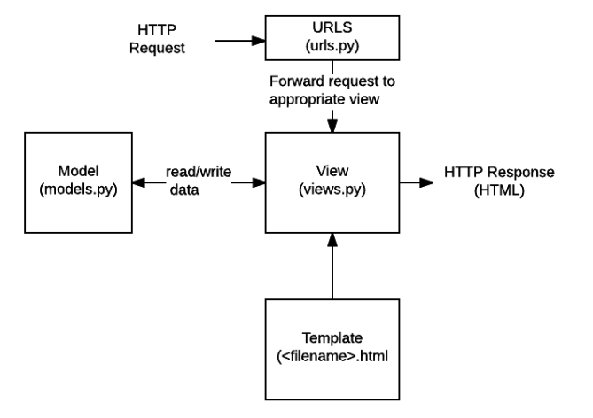

- **URLs:** 단일 함수를 통해 모든 URL 요청을 처리하는 것이 가능하지만, 분리된 뷰 함수를 작성하는 것이 각각의 리소스를 유지보수하기 훨씬 쉽습니다. URL mapper는 요청 URL을 기준으로 HTTP 요청을 적절한 view로 보내주기 위해 사용됩니다. 또한 URL mapper는 URL에 나타나는 특정한 문자열이나 숫자의 패턴을 일치시켜 데이터로서 뷰 함수에 전달할 수 있습니다.
- **View:** view는 HTTP 요청을 수신하고 HTTP 응답을 반환하는 요청 처리 함수입니다. View는 Model을 통해 요청을 충족시키는 데 필요한 데이터에 접근합니다. 그리고 탬플릿에게 응답의 서식 설정을 맡깁니다.
- **Models:** Model은 application의 데이터 구조를 정의하고 데이터베이스의 기록을 관리(추가, 수정, 삭제)하고 query하는 방법을 제공하는 파이썬 객체입니다.. 
- **Templates:** 탬플릿은 파일의 구조나 레이아웃을 정의하고(예: HTML 페이지), 실제 내용을 보여주는 데 사용되는 플레이스홀더를 가진 텍스트 파일입니다. view는 HTML 탬플릿을 이용하여 동적으로 HTML 페이지를 만들고 model에서 가져온 데이터로 채웁니다. 탬플릿으로 모든 파일의 구조를 정의할 수 있습니다.탬플릿이 꼭 HTML 타입일 필요는 없습니다!

# Django Intro

## Strat Django

1. 장고 설치하기

```bash
pip install djang==2.1.15
pip list
```

2. 프로젝트 생성

```bash
django-admin startproject <프로젝트 명>
```

```bash
python manage.py runserver
```

3. 프로젝트 생성시 제공되는 파일
   - `manage.py`
     - 현재 django와 관련된 모든 명령어를 `manage.py`를 통해 실행합니다.
   - `__init__.py`
     - 현재 `__init__.py` 파일이 존재하는 폴더를 하나의 프로젝트 혹은 패키지로 인식시키게 해주는 파일
   - `settings.py`
     - 현재 프로젝트의 전체적인 설정 및 관리를 위해 존재하는 파일
   - `urls.py`
     - 내 프로젝트에 접근할 수 있는 경로를 설정하기 위한 파일
   - `wsgi.py`
     - ??배포용??


## Start App

### 1. Application 생성

``` bash
python manage.py startapp pages(프로젝트 명)
```

- setting.py에서 application 출생신고(?) 및 설정하기

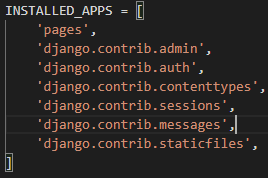


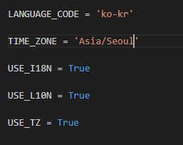

- 다시 서버 시작해보기

```bash
cd intro/
python manage.py runserver
```


언어(한글) 및 시간(서울) 설정 완료!


### 2. urlPattern 및 `View`, `Template` 설정

- url. py : 경로설정

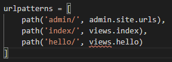

- views.py : 함수설정

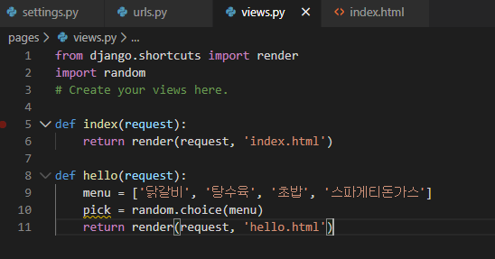

- templates 안에 html파일 생성

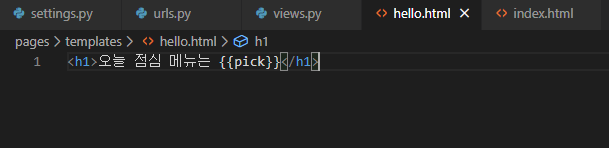

`{{ }}` 안에 value 값을 넣어준다~

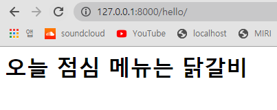!!!

- 이렇게 key값과 value형태인 dictionary로 사용가능하다!

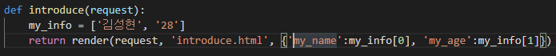

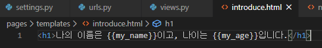

- **조금 더 깔끔하게 작성하기.**

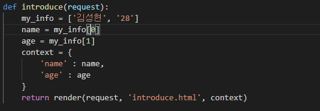

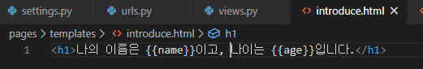


- url에서 입력을 받을 때 특정 문자/숫자만 요청할 수 있다.

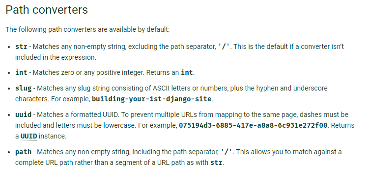

Q1

```python
# urls.py
path('urlcopy/<str:name>/<int:age>', views.urlcopy)

# views.py
def urlcopy(request, name, age):
    name = name
    age = age
    context={
        'name' : name,
        'age' : age
    }
    return render(request, 'urlcopy.html', context)


# urlcopy.html
<h2>URL로 입력받은 이름 : {{name}}, 나이 : {{age}}</h2>
```

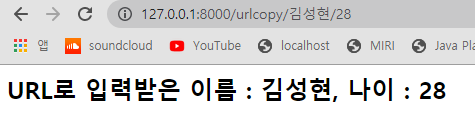


Q2

```python
# urls.py
path('multiply/<int:num1>/<int:num2>', views.multiply)

# views.py
def multiply(request, num1, num2):
    num1 = num1
    num2 = num2
    result = num1 * num2
    context = {
        'num1' : num1,
        'num2' : num2,
        'result' : result
    }
    return render(request, 'multiply.html', context)

# multiply.html
URL로 받은 숫자1 : {{num1}} , 숫자2 : {{num2}}

곱한 값 => {{result}}
```

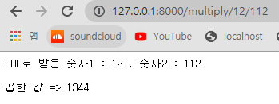


Q3

```python
# urls.py
path('multipletable/<int:big>/<int:small>', views.multipletable),

# views.py
def multipletable(request, big, small):
    result = []
    if(big < small):
        big, small = small, big
    for num in range(1, small+1):
        result.append(big*num)
    context={
        'result' : result
    }
    return render(request, 'multipletable.html', context)

# multiplly.html
<p>{{result}}</p>
<h1>Django Temlplate Lagnuage ( DTL )</h1>

<!--  -->
{# 이게 DTL의 주석 #}

DTL의 주석은 개발자모드(F12) 에서도 보이지 않는다!
여기는 전부
출력이 안됨... 주석임!
되도록이면 template에서는 주석사용 XX



  <p>{{num}}</p>

```

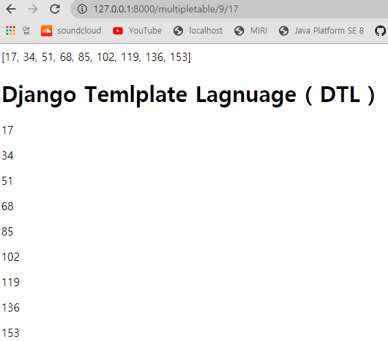


### 3. DTL 사용해보기

```python
# urls.py
path('dtl/', views.dtl),

# views.py
def dtl(request):
    mList = ['짜장면', '차돌짬뽕', '탕수육', '콩국수']
    empty_list = []
    mString = "Life is short, You need Python"
    today = datetime.now()
    context = {
        'mList' : mList,
        'empty_list' : empty_list,
        'mString' : mString,
        'today' : today
    }
    return render(request, 'dtl.html', context)

# dtl.html
<h1>1. for문</h1>

  <p> {{ forloop.counter }}.{{ food }} </p>



  <p>data</p>

  <p>비어있습니다.</p>

<hr>

<h1>2. 조건문</h1>

  
    <p>짜장면엔 고춧가루지 아암 이게맞지</p>
  
    <p>뭔 소리야 {{ food }}을 먹어줘야지</p>
  

<hr>


  
    <p> {{forloop.first}} </p>
    <p> {{forloop.last}} </p>
    <p>짜장면엔 고춧가루지 아암 이게맞지</p>
  
    <p>뭔 소리야 {{ food }}을 먹어줘야지</p>
  


<h1>3. filter 활용</h1>
  <p>{{ mString|lower }}</p>
  <p>{{ mString|upper }}</p>
  <p>{{ mString|title }}</p>
  <p>{{ mString|length }}</p>
  <p>{{ mString|truncatewords:3 }}</p>
  <p>{{ mString|truncatechars:10 }}</p>
<hr>

<h1>4. lorem ipsum</h1>
<p></p>
<p></p>
<p></p>
```

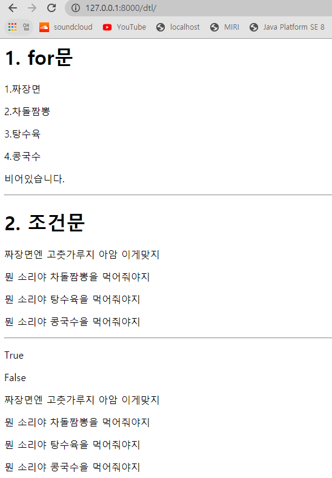

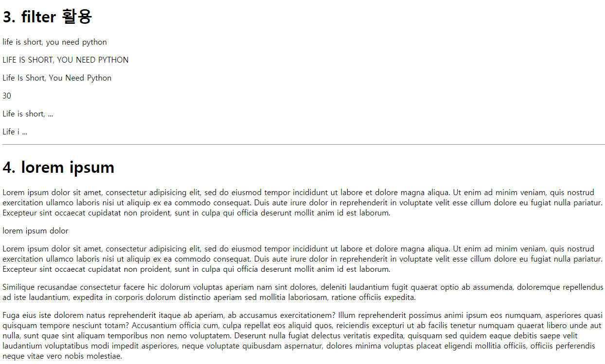


- advanced 조건문, 반복문

```python
# urls.py
path('forif/', views.forif),

# views.py
# 1. 간단한 반복문으로 리스트 각 요소를 출력
# 2. if, else 활용해서 문자열 비교
# 2-1. 내가 넘긴 문자열과 특정한 문자열 비교
# 3. if, elif, else 사용해보기
# 3-1. 문자열의 길이가 5 이하이면 short
# 3-2. 문자열의 길이가 10 이상이면 long
# 3-3. 모두 아니면 적당 출력

# 모두 작성했다면,
## 1) 반복문으로 리스트 각 요소를 출력해서
## 2) 해당 요소가 90 이상이면 A
## 3) 해당 요소가 70 이상이면 B
## 4) 그 외엔 C 출력
def forif(request):
    mList = [100, 50, 80, 71, 10]
    mString = '간단한 문자열zzzzzzzzzzzz'
    mInput = input("문자열을 입력하세요: ")
    data_a = '첫번째 데이터'
    data_b = '두번째 데이터'
    data_a, data_b = data_b, data_a
    context = {
        'mList' : mList,
        'mString' : mInput,
        'data_a' : data_a,
        'data_b' : data_b
    }
    return render(request, 'forif.html', context)

# forif.html
<h1>간단한 반복문으로 리스트 출력</h1>

  
  <P>{{ data }} : A</P>
  
  <P>{{ data }} : B</P>
  
  <p>{{ data }} : C</p>
  

<hr>

<h1>문자열의 길이</h1>

  <p>{{ mString|title }} : short</p>

  <p>{{ mString|title }} : long</p>

  <p>{{ mString|title }} : 적당</p>

```

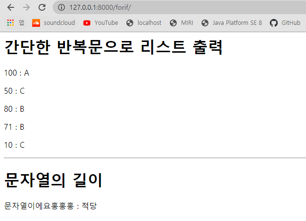

## Django form태그 사용

- 프로젝트 기획 단계에서는 `페르소나` 를 중시해라!


throw.html 상대경로 사용


가져오는 방식이 2가지

- []  ---> 값이 없을 때 오류 발생

- .get --->  값이 없어도 오류 발생 안함. 값이 없으면 none 출력

  - request.GET == 딕셔너리와 유사하다.

    request.GET != dict()

```bas
print(request.GET['message'])
print(request.GET.get('message'))
```


 

