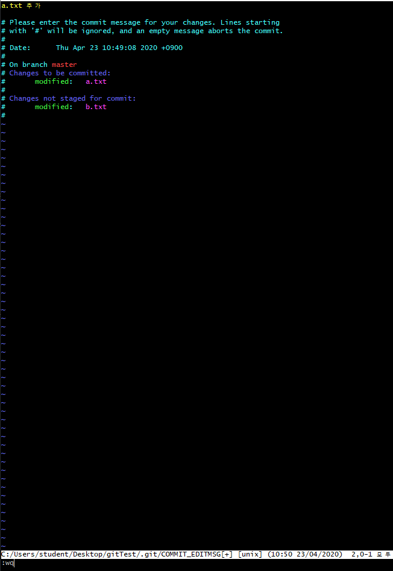
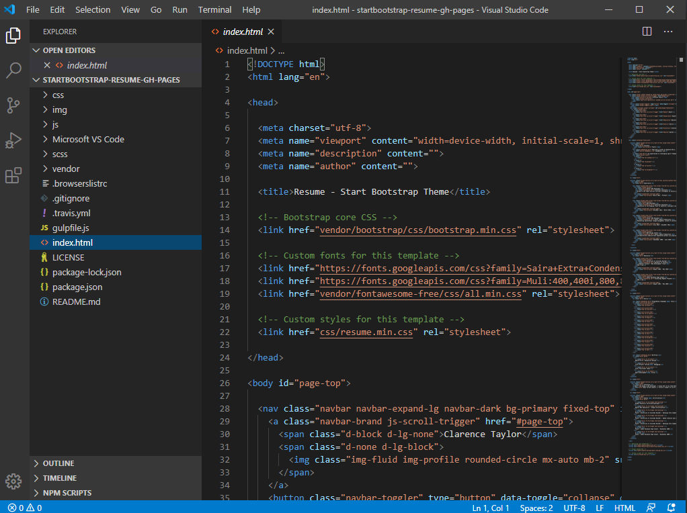

## Git

> Git은 분산형버전관리시스템( DVCS )
>
> 소스코드 형상 관리도구로써, 작성되는 코드의 이력을 관리한다.

## 0.기본 설정

아래의 설정은 이력 작성자(author)를 설정하는 것으로, 컴퓨터에서 최초에 한번만 설정하면 된다.

```bash
$ git config --global user.name kim-sung-hyun93 <<< 본인 github계정
$ git config --global user.email dhkdghehfdl@gmail.com <<본인 github 가입 이메일로 변경
```


## 1. 로컬 저장소(repository) 활용

### 1. 저장소 초기화

```bash
$ git init
Initialized empty Git repository in C:/Users/student/Desktop/TIL/.git/
->(master)
```

* (master)는 현재 있는 브랜치 위치를 뜻하며, .git폴더가 생성된다.
* 해당 폴더를 삭제하게 되면 모든 git과 관련된 이력이 삭제된다.


### 2. add

이력(history)을 확정하기 위해서는 `add`  명령어를 통하여 `staging area`에 stage 시킨다.

```bash
$ git add .				# 현재 디렉토리를 stage
$ git add README.md		# 특정 파일을 stage
$ git add images/		# 특정 폴더를 stage
```

add를 한 이후에는 항상 status 명령어를 통해 원하는 대로 되었는지 확인한다.

```bash
$ git status
On branch master

No commits yet

Changes to be committed:
  (use "git rm --cached <file>..." to unstage)
        new file:   git.md
        new file:   "images/\353\275\200\353\241\234\353\246\254.jpg"
        new file:   markdown.md
```


### 3. commit	 

`git` 은 `commit` 을 통해 이력을 남긴다. 커밋시에는 항상 메시지를 통해 해당 이력의 정보를 나타내야 한다.

```bash
$ git commit -m 'Init'
[master (root-commit) 43afe9e] Init
 3 files changed, 122 insertions(+)
 create mode 100644 git.md
 create mode 100644 "images/\353\275\200\353\241\234\353\246\254.jpg"
 create mode 100644 markdown.md
```

커밋 목록은 아래의 명령어를 통해 확인 가능하다.

```bash
$ git log
commit 43afe9e1ddddeda6abde85b6738583c62ae4eae7 (HEAD -> master)
Author: kim-sung-hyun93 <dhkdghehfdl@gmail.com>
Date:   Thu Dec 5 16:52:16 2019 +0900

    Init
```


## 2. 원격 저장소(remote repository) 활용

> 원격 저장소는 다양한 서비스를 통해 제공 받을 수 있다.
>
> github, gitlab, bitbucket

### 1. 원격 저장소 등록

```bash
$ git remote add origin https~
```

원격 저장소(remote)를 origin이라는 이름으로 해당 url로 설정한다.

등록된 원격 저장소는 아래의 명령어로 확인할 수 있다.

등록은 한번만 실행하면 된다.

```bash
$ git remote -v
```


### 2. 원격 저장소 push

```bash
$ git push origin master
Enumerating objects: 7, done.
Counting objects: 100% (7/7), done.
Delta compression using up to 4 threads
Compressing objects: 100% (4/4), done.
Writing objects: 100% (4/4), 428 bytes | 428.00 KiB/s, done.
Total 4 (delta 1), reused 0 (delta 0)
remote: Resolving deltas: 100% (1/1), completed with 1 local object.
To https://github.com/kim-sung-hyun93/TIL.git
   b24d2c5..077f410  master -> master

```

`origin`원격 저장소에 `push`하게 되며, github에서 확인할 수 있다.

이후 작업 과정에서는 add -> commit으로 이력을 남기고 push로 업로드 하면 된다.


# ==== Git 특강 1 ( 2020-04-23 ) ====

> 분산형 버전관리 시스템( DVCS )

- 남기는 커밋 하나하나들이 버전으로써 관리가 된다.
- 리눅스의 아버지인 토발즈씨가 만들었음.

- git에서 가장 중요한 명령어

```bash
$ git status
```

GUI vs CLI

내가 CLI에서의 상태를 알려면 명령어를 통해서 확인해야 한다는 것을 잊으면 안된다.

- 폴더목록 보기

```bash
ls
```

- 숨긴 폴더목록 보기

```bash
$ls -al
```

> 1 -> 2 -> 3
>
> 1 --------add----------> 2 --------commit----------> 3

1. WD ( Working Directory )
2. Staging Area ( Index )
3. version


- touch로 파일을 생성

```bash
$ touch a.txt
```

# Git status를 통해 정리하기

## 1. CLI 기초명령어

```bash
# list(파일 목록)
$ ls
# change directory(디렉토리 변경)
$ cd
# 빈 파일 생성
$ touch <파일명>
```

## 2. 상황

### 1. add

```bash
$ touch a.txt
$ git status
On branch master

No commits yet
# 트래킹 X, 새로 생성된 파일.
Untracked files:
 # 커밋을 하기 위한 곳에 포함시키려면
 # Staging area로 이동시키려면, git add하라
  (use "git add <file>..." to include in what will be committed)
        a.txt
# WD 에 새로운 파일이 존재하지만, Staging Area에는 존재 하지 않는다.
nothing added to commit but untracked files present (use "git add" to track)
```

```bash
$ git add a.txt
$ git status
On branch master

No commits yet
# 커밋될 변경사항들(staging area에 존재O)
Changes to be committed:
 # unstage를 위해서 활용할 명령어(add 취소)
  (use "git rm --cached <file>..." to unstage)
        new file:   a.txt
```

--aaaaaa : 옵션 설정

### 2. commit

```bash
$ git commit -m 'Create a.txt'
[master (root-commit) 19a37a4] Create a.txt
 1 file changed, 0 insertions(+), 0 deletions(-)
 create mode 100644 a.txt
```

- 커밋 내역확인

  ```bash
  $ git log
  commit 19a37a4a490d5b8c470012d18bff6bf9b8130b8d (HEAD -> master)
  Author: kim-svaodz <dhkdghehfdl@gmail.com>
  Date:   Thu Apr 23 10:38:40 2020 +0900
  
      Create a.txt
  ```

  ```bash
  $ git log --oneline
  19a37a4 (HEAD -> master) Create a.txt
  ```

- add 취소하기

  ```bash
  $ rm --cached <file>
  $ restore
  ```

### 3. 추가 파일 변경 상태

```bash
$ tocuh b.txt
$ git status
On branch master
Changes not staged for commit:
  (use "git add <file>..." to update what will be committed)
  (use "git restore <file>..." to discard changes in working directory)
        modified:   a.txt

Untracked files:
  (use "git add <file>..." to include in what will be committed)
        b.txt

no changes added to commit (use "git add" and/or "git commit -a")
```


### 4. 커밋 메시지 변경

> **주의!!!** 커밋 메시지 변경시 해시값 자체가 변경되어, 이미 원격저장소에 push한 이력에 대해서는 메세지 변경을 하면 안된다.

```bash
$ git commit --amend
```

- 'vim' 텍스트편집기가 실행된다.

  - i : 편집 모드
  - esc : 편집 모드를 종료하고 명령모드에서
    - :wq
      - write + quit

  ```bash
  [master d241539] a.txt 추가
   Date: Thu Apr 23 10:49:08 2020 +0900
   1 file changed, 35 insertions(+)
  ```



#### 4-1 특정 파일을 빼놓고 커밋 했을 때

```bash
$ git add <omit_file>
$ git commit --amend

$ git log --oneline
788ed26 (HEAD -> master) a.txt 추가 b.txt 추가
1609ccb 한글도 가능해요
19a37a4 Create a.txt
```

- 빠트린 파일을 add한 뒤에 commit --amend를 하면, 해당 파일까지 포함하여 재커밋이 이뤄진다.

### 5 . WD 작업 내용을 이전 버전으로 되돌리기

> 작업 하던 내용 버리기

```bash
# 커밋만 잘 해놓았으면 커밋한 시점의 버전으로 되돌릴 수 있다.(restore)
$ git status
On branch master
Changes not staged for commit:
  (use "git add/rm <file>..." to update what will be committed)
  (use "git restore <file>..." to discard changes in working directory)
$ git restore b.txt
$ git status
On branch master
nothing to commit, working tree clean

# ++++ add 취소 옵션
$ git restore --stage 
```

### 6. 특정 파일/폴더 삭제 커밋

> 해당 명령어는 실제 파일이 삭제되는 것은 아니지만, git에서 삭제되었다라는 이력을 남기는것.

```bash
# 물리적인 파일은 삭제가 되지 않았지만 commit한 이력을 지워버리기
$ git rm --cached b.txt
rm 'b.txt'

$ git status
On branch master
Changes to be committed:
  (use "git restore --staged <file>..." to unstage)
        deleted:    b.txt

Untracked files:
  (use "git add <file>..." to include in what will be committed)
        b.txt
# 주의!!! 해당 파일이 물리적으로 삭제되는 것은 아니다        
```

- 일반적으로는 `gitignore`와 함께 활용한다.

  1. `.gitignore`에 해당 파일 등록
  2. `git rm --cached`를 통해 삭제 커밋

  => 이렇게 작업하면, 실제 파일은 삭제 되지 않지만 이후로 git은 전혀 관리되지 않는다.

- 쓸모없는 파일, csv파일, 보안상 문제되는 파일을 빼고 관리하기 위해 `.gitignore`를 활용한다.

- http://gitignore.io/ 를 활용

  

1. 사용하는 시스템 환경을 추가
2. `.gitignore`에서 해당 파일들이 추가되었기 때문에 추후에 버전관리가 이루어지지 않음

#### 6-1 .gitignore

- git으로 관리하고 싶지 않는 파일을 등록하여 활용할 수 있다.
- 일반적으로 프로젝트 환경(IDE, OS 등)에 관련된 정보나 추가적으로 공개되면 안되는 데이터 파일 등을 설정한다.
- 일반 프로젝트 환경에 대한 정보는 우선  [.gitignore]( http://gitignore.io/) 에서 프로젝트 시작할 때마다 정의하는 습관을 가지자.

```bash
# 특정 파일
secret.csv
# 특정 폴더
idea/
# 특정 확장자
*.csv
# 특정 폴더에서 특정 파일 빼고
!idea/a.txt
```


## 3. 원격저장소 활용 명령어

원격저장소에 푸쉬할 때 파일자체가올라가는 게 아니라 이력이 올라가는 것.

깃헙에 올라가는것은 커밋에 확정된 부분이 올라가는것이다.(WD와 Staging area에서 작업한 내용은 X)

1. 원격 저장소 목록 조회

```bash
$ git remote -v
```

2. 원격 저장소 설정 추가

```bash
$ git remote add origin https://www.........
```

3. 원격 저장소 삭제 하기

```bash
$ git rm origin
```

4. 원격 저장소에 업로드하기

```bash
$ git push origin master
```


# :1st_place_medal: 포트폴리오 만들기

- [카카오 기술 블로그](https://tech.kakao.com/blog/)
- [깃헙페이지](https://pages.github.com/)
- 정적 사이트 생성기(generator)
  - .md ======> HTML/CSS , JS로 생성
    - jekyll(ruby) : 오래 되고, 자료 많고
  - gatsby(js, react + graphql) : 최신, 유명해서 자료 많음
- [수업시간, 템플릿으로 만들 수 있는 페이지](https://startbootstrap.com/)
  - [Resume](https://startbootstrap.com/themes/resume/)
  - [VisualStudioCode](https://code.visualstudio.com/)



1. 이름 변경
2. 아이콘 등등 변경